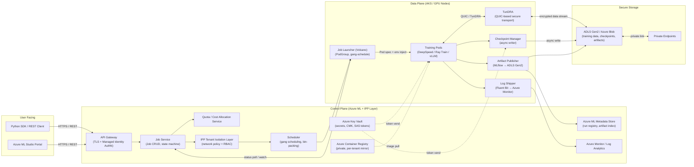

# 02 - End-to-End Architecture: Secure LLM Training on Azure / Kubernetes

## 1. High-Level Component Map



---

## 2. End-to-End Request Flow (Step by Step)

### Step 1 - User Submits a Fine-Tune Job

The user calls the Azure ML Python SDK or REST API with a `JobCreateRequest`. The payload contains: base model ID, dataset URI (an ADLS path), hyperparameters, compute target (AKS cluster name), instance type (e.g., `Standard_ND96asr_v4` - 8× A100), and number of nodes.

```
POST /subscriptions/{sub}/resourceGroups/{rg}/providers/
     Microsoft.MachineLearningServices/workspaces/{ws}/jobs
Authorization: Bearer <AAD token>
Content-Type: application/json
{ "type": "fine_tuning", "model": "gpt-4-base", "data": "azureml://...", "compute": "gpu-cluster-01", "instance_count": 4 }
```

### Step 2 - API Gateway: AuthN + AuthZ

The API Gateway validates the AAD (Entra ID) bearer token. It checks:
- Is the caller's object ID in the workspace RBAC role (ML Contributor or above)?
- Does the caller's tenant match the IPP-registered tenant for this workspace?

Managed Identity propagation: the gateway does not forward user credentials into the cluster. It instead mints a short-lived, scoped credential (Azure Workload Identity / pod identity annotation) that the training pods will use to reach ADLS and Key Vault.

### Step 3 - Job Service: Validation + State Initialization

The Job Service persists a new run record in the Azure ML Metadata Store (Cosmos DB-backed internally). Initial state: `Queued`. It validates:
- Dataset URI resolves to a resource the workspace's Managed Identity can read.
- The requested instance type exists in the compute target's node pool.
- Quota headroom exists (call to Quota Service).

### Step 4 - IPP Tenant Isolation Layer

The IPP layer enforces per-tenant network segmentation before the job is handed to the scheduler:
- Assigns the job to a dedicated Kubernetes namespace (`tenant-<id>-jobs`).
- Applies a `NetworkPolicy` that allows egress only to: the tenant's private ADLS endpoint, the tenant's ACR mirror, Key Vault private endpoint, and the TunDRA relay. All other egress is denied.
- Injects RBAC constraints: the pod's service account can only read secrets prefixed with `tenant-<id>/`.

This is the critical boundary that prevents a compromised training pod from reaching another tenant's data or control-plane endpoints.

### Step 5 - Scheduler: Gang Scheduling + Bin-Packing

The Scheduler (built on top of Volcano) receives the job spec. Gang scheduling means all `N` pods in a training job must be scheduled simultaneously - partial placement would waste GPU nodes (each node is unusable for other large jobs if partially occupied).

Algorithm:
1. Compute the full resource footprint: `N × (GPUs + CPU + memory + NVLink topology)`.
2. Check the bin-packing fitness score across available node pools (prefer filling existing nodes to reduce fragmentation).
3. If no slot fits, the job stays in `Queued` and re-evaluates on each scheduling cycle (configurable, e.g., every 30 s).
4. On fit, emit a `PodGroup` resource to Volcano; Volcano coordinates with the kube-scheduler to place all pods atomically.

> **Assumption:** The cluster uses Volcano's gang-scheduling plugin and a custom priority queue that factors in per-tenant quota and estimated job duration (from historical telemetry) for cost-aware scheduling. Exact priority function is assumed, not documented in public sources.

### Step 6 - Launcher: Pod Spec Injection

The Job Launcher translates the scheduled `PodGroup` into concrete `Pod` objects:
- Injects the Workload Identity annotation so pods can authenticate to Azure services without storing credentials.
- Mounts the `ConfigMap` with distributed training config: `MASTER_ADDR`, `MASTER_PORT`, `WORLD_SIZE`, `RANK` (for PyTorch / DeepSpeed `init_process_group`).
- Sets resource limits: `nvidia.com/gpu: 8`, CPU, memory.
- Pulls the training container image from the tenant's ACR mirror (never the public registry - prevents supply-chain attacks).
- Sets `securityContext`: non-root UID, read-only root filesystem, no privilege escalation.

### Step 7 - Data Access via TunDRA

Before training begins, each pod must stream training data from ADLS. This is where TunDRA (the QUIC-based protocol built in Rust) is used. QUIC eliminates the TCP head-of-line blocking problem when streaming large token batches from Blob storage across multiple parallel streams.

TunDRA's role:
- Authenticates to ADLS using the pod's Workload Identity token (no long-lived SAS key on disk).
- Opens multiplexed QUIC streams to the ADLS private endpoint.
- Handles retransmission and flow control at the application layer for token-batch prefetch.
- For 1M+ Compute Instances at scale, TunDRA's connection resumption (0-RTT) is critical - pods that restart mid-job reconnect without full TLS handshake.

> **Assumption:** TunDRA is a proprietary Microsoft internal protocol. The QUIC foundation and Rust implementation are resume-grounded facts. The exact congestion control algorithm (e.g., BBR vs. CUBIC) is assumed to be BBR, optimized for datacenter RTTs.

### Step 8 - Distributed Training Execution

Training pods run the actual fine-tuning workload. The stack:

| Layer | Technology | Role |
|---|---|---|
| Parallel strategy | DeepSpeed ZeRO-3 or FSDP | Shard optimizer state, gradients, parameters across GPUs |
| Training orchestration | Ray Train | Fault-tolerant distributed loop, actor model for trainer workers |
| Efficient inference during eval | vLLM | PagedAttention for memory-efficient KV-cache during validation |
| Fine-tuning method | QLoRA + PEFT | Low-rank adapters on frozen base model - reduces GPU memory 4–8× |
| Framework | PyTorch Distributed | NCCL for all-reduce across GPUs; GLOO for CPU fallback |

Intra-node GPU communication: NVLink / NVSwitch (no network hop).
Inter-node gradient sync: InfiniBand RDMA where available; falls back to RoCE.

### Step 9 - Checkpointing

The Checkpoint Manager runs as a sidecar container in each rank-0 pod (the coordinator):
- Listens for checkpoint triggers from the training loop (every N steps or every T minutes).
- Serializes model state using PyTorch's `save_on_each_rank` (for FSDP) or DeepSpeed's checkpoint API.
- Uploads checkpoint shards asynchronously to ADLS in the tenant's container (`azureml://<ws>/checkpoints/<run-id>/step-<N>/`).
- Uses the pod's Workload Identity - no SAS token is stored in the container image or env var.

Checkpoint writes are async: training is not blocked. The checkpoint manager uses a local staging area (NVMe-backed ephemeral volume on the node) and uploads in the background.

> **Assumption:** Checkpoint frequency defaults to every 500 steps or 15 minutes, whichever comes first. This is an operational assumption; exact values depend on job config.

### Step 10 - Log Shipping

Fluent Bit runs as a DaemonSet on every GPU node. It:
- Tails stdout/stderr of all training pods on the node.
- Parses structured JSON log lines emitted by the training loop (step, loss, learning rate, throughput tokens/s).
- Batches and forwards to Azure Monitor / Log Analytics over a private endpoint.
- Tags every log line with `tenant_id`, `workspace_id`, `run_id`, `node_rank` - enabling per-run filtering in the portal.

Azure Monitor stores 90 days of raw logs. Users query via KQL in Azure ML Studio.

### Step 11 - Artifact Publishing

When training completes (or is manually stopped), the Artifact Publisher:
1. Collects the final model checkpoint from ADLS.
2. Packages adapter weights (LoRA layers) and tokenizer config into a model artifact directory.
3. Registers the artifact with the Azure ML Model Registry (backed by the Metadata Store) via the MLflow tracking API.
4. Tags the run with final metrics (eval loss, BLEU, etc.) pulled from the metrics store.
5. Updates the run state in the Job Service to `Completed`.

The registered artifact URI (`azureml://registries/.../models/<name>/versions/<v>`) can be directly used as input to a deployment job (Azure ML Online Endpoints or batch inference).

---

## 3. Control Plane vs. Data Plane Separation

| Plane | Components | What It Manages |
|---|---|---|
| **Control Plane** | API Gateway, Job Service, Scheduler, Quota Service, IPP Layer, Metadata Store, Key Vault, ACR | Job lifecycle state, scheduling decisions, tenant policy, secret distribution, artifact registry |
| **Data Plane** | Training Pods, Launcher (Volcano), TunDRA, Checkpoint Manager, Log Shipper, Artifact Publisher | Actual compute execution, data movement, gradient synchronization, checkpoint I/O |

**Key separation principle:** The control plane never touches model weights, training data, or gradient tensors. The data plane never stores persistent job state - it receives a job spec and reports status back through narrow, well-defined channels (Kubernetes pod status, metrics API, a single status-update webhook).

This split means a control-plane incident (e.g., Job Service restart) does not kill a running training job. Pods continue training autonomously; they only surface the interruption when they try to write a checkpoint or post a status update.

---

## 4. Key Azure Services

| Service | Role in the System |
|---|---|
| **Azure ML** | Top-level orchestration: workspace, compute targets, model registry, dataset URIs, experiment tracking |
| **AKS (Azure Kubernetes Service)** | Runtime for all data-plane pods; provides node pools, pod scheduling, network policies |
| **Azure Blob / ADLS Gen2** | Training data, checkpoint shards, final model artifacts; hierarchical namespace for ACL-based tenant isolation |
| **Azure Container Registry (ACR)** | Stores hardened training container images; per-tenant private mirror prevents cross-tenant image access |
| **Azure Monitor / Log Analytics** | Centralized log ingestion (via Fluent Bit), metrics, alerting; KQL queries in the portal |
| **Azure Key Vault** | Stores CMK (Customer-Managed Keys), Managed Identity scoped access; no long-lived credentials in pods |
| **Azure VNet + Private Endpoints** | All traffic between AKS, ADLS, Key Vault, ACR travels over private links - no public internet exposure |
| **Managed Identity (Workload Identity)** | Pod-level identity federation; pods authenticate to Azure services with short-lived OIDC tokens, not stored secrets |

---

## 5. The IPP (Internal Private Preview) Layer

IPP (Internal Private Preview) was the controlled rollout environment for Azure AI fine-tuning features before general availability. It matters architecturally because it imposed stricter tenant isolation requirements than standard Azure ML workspaces:

- **Dedicated namespace per tenant:** Each IPP tenant gets its own Kubernetes namespace with hard `ResourceQuota` and `LimitRange` objects - no resource sharing across tenants even if nodes are shared.
- **Network policy enforcement:** Egress is allowlisted, not blocklisted. A pod that does not explicitly need to reach the Key Vault private endpoint cannot - even within the cluster.
- **Audit logging:** Every API call that touches an IPP workspace is written to an immutable audit log (Azure Monitor Logs with export to a compliance storage account). Used for SOC 2 and internal compliance reviews.
- **Feature flag gating:** IPP workspaces have feature flags that enable capabilities (e.g., QLoRA support, vLLM serving) before those features are exposed to standard GA customers. The Job Service checks the workspace's IPP tier before routing to the relevant execution path.

> **Assumption:** IPP tenants were a subset of Microsoft-internal or vetted enterprise customers during the Oct 2020 – Aug 2025 timeframe. The exact onboarding criteria are internal policy and not public knowledge.

---

## 6. Where vLLM, DeepSpeed, and Ray Train Fit

All three operate entirely within the **data plane**, inside the training pods:

**DeepSpeed** handles the memory and compute efficiency of training:
- ZeRO-3 shards optimizer states (stage 1), gradients (stage 2), and model parameters (stage 3) across GPU ranks.
- For fine-tuning LLMs with 70B+ parameters on 8×A100 nodes, ZeRO-3 is mandatory - the model does not fit on a single GPU.
- DeepSpeed also manages the gradient accumulation steps and mixed-precision (bf16) training.

**Ray Train** is the distributed loop orchestrator:
- Each training pod runs a Ray worker actor.
- Ray's fault-tolerance model allows it to restart a failed worker actor and resume training from the last checkpoint without tearing down the entire job.
- This is the mechanism that enables recovery from transient node failures without a full job re-queue.

**vLLM** is used during validation/eval phases:
- After every N training steps, the training loop runs an eval pass where the partially-trained model generates text samples.
- vLLM's PagedAttention manages the KV-cache efficiently during this generation phase - critical when running eval at batch size 512+ on long-context inputs.
- vLLM is not used for the core training forward/backward pass; it is eval-only.

> **Assumption:** vLLM may also have been used in a separate serving pod alongside the training job for online eval (prompt → completion scoring) rather than inline in the training loop. The resume anchor says "vLLM" but does not specify inline vs. sidecar usage. Both interpretations are architecturally valid.

---

## 7. Where TunDRA Fits

TunDRA operates at the **compute communication layer**, specifically on the data-ingestion and checkpoint-upload paths:

```
Training Pod → TunDRA (QUIC, Rust) → Private Endpoint → ADLS Gen2
                    ↑
             Workload Identity token
             (no stored credentials)
```

TunDRA is **not** used for GPU-to-GPU gradient synchronization (that is NCCL over InfiniBand). TunDRA is used for:
1. **Data loading:** Streaming token batches from ADLS into the training pod's prefetch buffer.
2. **Checkpoint upload:** Writing checkpoint shards from the staging NVMe to ADLS.
3. **Artifact upload:** Sending final model artifacts to the output container.

The 50% improvement in secure data transfer (from the resume) comes from QUIC's multiplexing and 0-RTT reconnect, which eliminates the round-trip penalty that TCP+TLS incurs when a pod restarts and reconnects to the storage backend. At 1M+ Compute Instances scale, this compounds significantly.

---

## 8. Component Relationships

```
Platform API Tier
      │
      ▼
  Job Service  ──── Quota Service
      │
      ▼
  IPP Layer (tenant namespace + network policy assignment)
      │
      ▼
  Scheduler (Volcano gang scheduling + bin-packing)
      │
      ▼
  Launcher (PodGroup → Pod spec with Workload Identity)
      │
      ▼
  Training Pods ──── TunDRA (data in/out)
      │                │
      │                └──► ADLS (training data, checkpoints, artifacts)
      │
      ├──► Checkpoint Manager (async, sidecar, rank-0)
      │         └──► ADLS
      │
      ├──► Log Shipper (DaemonSet, Fluent Bit)
      │         └──► Azure Monitor
      │
      └──► Artifact Publisher (post-training, standalone pod)
                ├──► ADLS (artifact bytes)
                └──► Azure ML Metadata Store (model registration)
```

**Feedback loop back to the control plane:**
- Launcher watches pod phase changes and relays `Running → Succeeded/Failed` events to the Job Service.
- Checkpoint Manager writes a `checkpoint_manifest.json` to ADLS and posts the path to the Job Service via a status webhook (narrow HTTP call over private endpoint).
- Artifact Publisher calls the Azure ML REST API to register the model, which updates the Metadata Store and transitions the run to `Completed`.

The Job Service is the single source of truth for run state. The data-plane components are stateless (except for in-flight work) and derive their configuration from the job spec injected at launch time.
