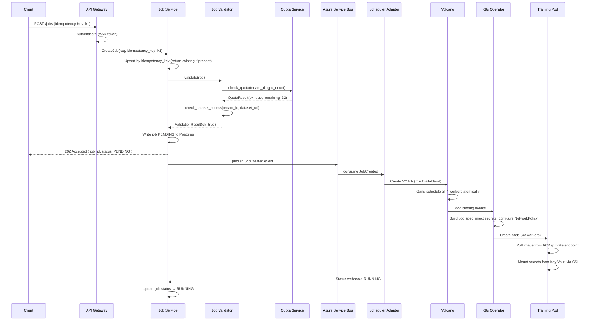

# 04 — Low-Level Design

## Service Decomposition

| Service | Language | Responsibility | Key Dependencies |
|---|---|---|---|
| **API Gateway / Frontend** | Go (Gin) | AuthN, rate limiting, request routing | Azure AD, Job Service |
| **Job Service** | Go | Job CRUD, status state machine, idempotency | Postgres, Azure Service Bus |
| **Job Validator** | Python | Quota check, dataset access check, model availability | Quota Store, Azure RBAC |
| **Scheduler Adapter** | Go | Enqueue/cancel/status to Volcano | Volcano API, Kubernetes API |
| **Pod Launcher** | Go (Kubernetes operator) | Construct pod spec, inject secrets, configure VNet | Key Vault CSI, AKS, Managed Identity |
| **CheckpointManager** (sidecar) | Python | Write/restore checkpoints to Azure Blob | ADLS/Blob SDK, TunDRA |
| **LogShipper** (DaemonSet) | Fluent Bit | Collect pod stdout/stderr, ship to Azure Monitor | Azure Monitor ingestion API |
| **ArtifactPublisher** | Python | Register model in MLflow, run eval gate | MLflow, eval harness |
| **Quota Service** | Go | Enforce per-tenant GPU quotas, track usage | Postgres, Volcano |
| **Eval Harness** | Python | Run BLEU/MMLU benchmarks on trained model | vLLM, eval datasets |

---

## Component Interfaces

### JobSubmitter

```python
class JobSubmitter:
    def validate(self, req: CreateJobRequest) -> ValidationResult:
        """
        Runs JobValidator pipeline:
        - quota_check: does tenant have GPU budget?
        - dataset_access_check: does Managed Identity have read on dataset URI?
        - model_availability_check: is base model in ACR/Model Registry?
        Returns ValidationResult(ok: bool, errors: list[str])
        """

    def submit(self, req: CreateJobRequest, idempotency_key: str) -> JobRecord:
        """
        Upsert job by idempotency_key. If key exists, return existing record.
        Writes PENDING record to Postgres, publishes JobCreated event to ASB.
        Returns JobRecord with job_id, status, estimated_start_time.
        """
```

### JobValidator

```python
class JobValidator:
    def check_quota(self, tenant_id: str, gpu_count: int, instance_type: str) -> QuotaResult:
        """Returns (allowed: bool, remaining: int, burst_available: bool)"""

    def check_dataset_access(self, tenant_id: str, dataset_uri: str) -> AccessResult:
        """
        Uses Azure RBAC token exchange to verify pod's Managed Identity
        will have Storage Blob Data Reader on the dataset container.
        Does NOT actually read data — checks IAM policy only.
        """

    def check_model_availability(self, model_id: str, version: str) -> ModelResult:
        """Verify base model exists in ACR or Azure ML model registry"""
```

### SchedulerAdapter

```go
type SchedulerAdapter interface {
    // Enqueue creates a Volcano Job CRD in the tenant's namespace.
    // Returns a SchedulerHandle containing volcano job name and queue assignment.
    Enqueue(ctx context.Context, job *JobRecord) (*SchedulerHandle, error)

    // Cancel deletes the Volcano Job CRD, triggering pod termination.
    Cancel(ctx context.Context, jobID string) error

    // GetStatus maps Volcano job phase to platform JobStatus enum.
    GetStatus(ctx context.Context, jobID string) (JobStatus, error)
}
```

### PodLauncher (Kubernetes Operator)

```go
type PodLauncher interface {
    // Launch builds and submits the pod spec for all workers in the job.
    // Called by the operator reconcile loop when Volcano schedules the job.
    Launch(ctx context.Context, job *TrainingJobCRD) (*LaunchResult, error)

    // InjectSecrets mounts Key Vault secrets as files via CSI driver.
    // No secrets in env vars.
    InjectSecrets(podSpec *corev1.PodSpec, secretRefs []SecretRef) error

    // ConfigureVNet adds network annotations for per-tenant NetworkPolicy,
    // pod identity label for Managed Identity binding, and node selectors.
    ConfigureVNet(podSpec *corev1.PodSpec, tenantConfig *TenantNetConfig) error
}
```

### CheckpointManager (training sidecar)

```python
class CheckpointManager:
    def write(
        self,
        step: int,
        model_state: dict,
        optimizer_state: dict,
        rng_state: bytes,
        dataloader_position: int
    ) -> CheckpointRef:
        """
        Serializes state to temp local file, uploads to Azure Blob
        at checkpoints/{job_id}/step-{step:08d}/ via TunDRA connection.
        Writes a manifest.json with hash for integrity check.
        Updates checkpoint pointer in Job Service via webhook.
        Returns CheckpointRef(uri, step, timestamp).
        """

    def restore(self, job_id: str, step: int = -1) -> TrainingState:
        """
        Downloads latest (or specific) checkpoint from Blob.
        Verifies hash. Returns TrainingState for model.load_state_dict().
        step=-1 means latest checkpoint.
        """

    def gc(self, job_id: str, keep_last_n: int = 3) -> None:
        """Deletes all but the last N checkpoints for a job."""
```

### LogShipper (Fluent Bit DaemonSet)

Fluent Bit collects container stdout/stderr. Each log line is enriched with:

```json
{
  "job_id": "jb-abc123",
  "tenant_id": "t-xyz",
  "pod_name": "worker-0",
  "step": 1200,
  "timestamp": "2026-05-06T12:34:56.789Z",
  "level": "INFO",
  "message": "step=1200 loss=0.412 gpu_util=92% nccl_bw=180GB/s"
}
```

Ships to Azure Monitor Log Analytics and a Kusto cluster for oncall queries.

### ArtifactPublisher

```python
class ArtifactPublisher:
    def publish(self, job_id: str, final_checkpoint_ref: CheckpointRef) -> ArtifactRef:
        """
        Copies final checkpoint from training storage to model artifact store.
        Runs eval harness (BLEU, MMLU) against the artifact.
        Returns ArtifactRef(artifact_uri, eval_scores, status).
        """

    def register_model(self, artifact_ref: ArtifactRef, job_record: JobRecord) -> ModelVersion:
        """
        Registers model in MLflow with:
        - lineage: source job_id, dataset_uri, base_model, hyperparams
        - eval scores
        - tags for compliance (tenant_id, data_classification)
        Returns ModelVersion for downstream deployment.
        Only called if artifact_ref.eval_passed == True.
        """
```

---

## Kubernetes CRD: TrainingJob

```yaml
apiVersion: ml.azure.com/v1alpha1
kind: TrainingJob
metadata:
  name: jb-abc123
  namespace: tenant-xyz        # per-tenant namespace
  labels:
    tenant-id: "t-xyz"
    job-id: "jb-abc123"
spec:
  baseModel: "meta-llama/Llama-2-7b"
  datasetURI: "abfss://container@storage.dfs.core.windows.net/train/"
  hyperparameters:
    learning_rate: "2e-4"
    num_epochs: "3"
    batch_size: "8"
    lora_r: "16"
    lora_alpha: "32"
  compute:
    instanceType: "Standard_NC96ads_A100_v4"
    instanceCount: 4
    schedulerQueue: "tenant-xyz-standard"
  checkpoint:
    storageURI: "https://checkpoints.blob.core.windows.net/jb-abc123"
    intervalSteps: 100
    keepLast: 3
  output:
    artifactURI: "https://artifacts.blob.core.windows.net/jb-abc123"
status:
  phase: Running
  startedAt: "2026-05-06T12:00:00Z"
  lastCheckpointStep: 900
  lastCheckpointURI: "..."
```

---

## Volcano Job Spec (Gang Scheduling)

```yaml
apiVersion: batch.volcano.sh/v1alpha1
kind: Job
metadata:
  name: jb-abc123-volcano
  namespace: tenant-xyz
spec:
  minAvailable: 4          # ALL 4 workers must be schedulable atomically
  queue: tenant-xyz-standard
  priorityClassName: standard
  plugins:
    pytorch: ["--master", "--worker", "--port=23456"]
  tasks:
    - name: worker
      replicas: 4
      template:
        spec:
          containers:
            - name: trainer
              image: acr.azurecr.io/finetuning:v2.3.1
              resources:
                limits:
                  nvidia.com/gpu: "8"    # 8 GPUs per node
              env:
                - name: MASTER_ADDR
                  value: "$(JOB_NAME)-worker-0"
              volumeMounts:
                - name: secrets
                  mountPath: /mnt/secrets
          volumes:
            - name: secrets
              csi:
                driver: secrets-store.csi.k8s.io
```

---

## Job Table Schema

```sql
CREATE TABLE jobs (
    job_id            UUID PRIMARY KEY DEFAULT gen_random_uuid(),
    idempotency_key   VARCHAR(255) UNIQUE NOT NULL,
    tenant_id         VARCHAR(255) NOT NULL,
    status            VARCHAR(50) NOT NULL DEFAULT 'PENDING',
    base_model        VARCHAR(255) NOT NULL,
    dataset_uri       TEXT NOT NULL,
    compute_config    JSONB NOT NULL,
    hyperparameters   JSONB NOT NULL,
    checkpoint_uri    TEXT,
    last_checkpoint_step INT DEFAULT 0,
    artifact_uri      TEXT,
    error_code        VARCHAR(100),
    error_message     TEXT,
    retry_count       INT DEFAULT 0,
    scheduler_handle  JSONB,
    created_at        TIMESTAMPTZ DEFAULT now(),
    updated_at        TIMESTAMPTZ DEFAULT now(),
    started_at        TIMESTAMPTZ,
    completed_at      TIMESTAMPTZ
);

CREATE INDEX idx_jobs_tenant_status ON jobs(tenant_id, status);
CREATE INDEX idx_jobs_idempotency   ON jobs(idempotency_key);
CREATE INDEX idx_jobs_created_at    ON jobs(created_at DESC);
```

---

## Sequence: Job Submission to Pod Running



---

## Component Responsibility Matrix

| Component | Owns | Does NOT own |
|---|---|---|
| Job Service | Job state, idempotency, event publishing | Scheduling decisions, pod lifecycle |
| Scheduler Adapter | Volcano CRD lifecycle | Job business logic, pod spec construction |
| Pod Launcher (Operator) | Pod spec, secrets, VNet config | Job state tracking |
| CheckpointManager | Checkpoint writes, restore, GC | Training logic, model architecture |
| LogShipper | Log collection and enrichment | Log analysis, alerting |
| ArtifactPublisher | Eval gate, model registration, lineage | Training, checkpointing |
| Quota Service | GPU budget enforcement | Job routing, scheduling |
