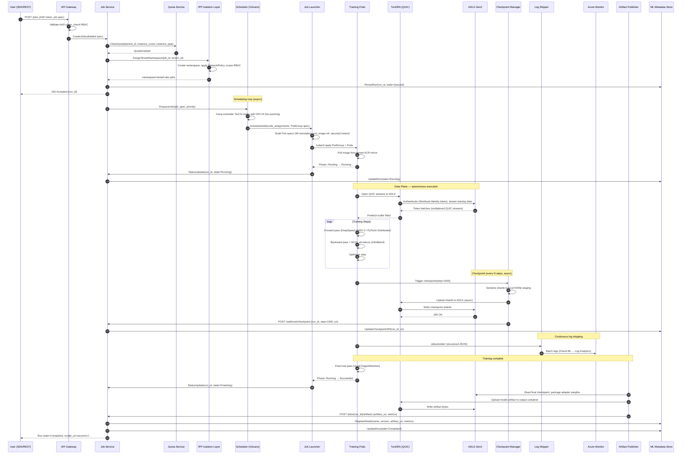

# 11 — Control Plane vs. Data Plane

## 1. Precise Definitions in This System

**Control Plane** is the set of components that decide *what* should happen and *when*. It manages job lifecycle state, enforces policy (quota, tenant isolation, RBAC), schedules work onto compute, and maintains the authoritative record of system state. Control-plane components must be highly available, strongly consistent, and auditable. They handle per-request metadata operations, not bulk data movement.

**Data Plane** is the set of components that execute *the actual work*. It moves tokens, computes gradients, writes checkpoint shards, ships logs, and publishes artifacts. Data-plane components are designed for throughput and fault tolerance, not strong consistency. They are ephemeral by design: if a data-plane pod dies and restarts, the system recovers by replaying from the last durable checkpoint, not by querying the control plane for lost state.

The boundary is enforced physically: control-plane services run on system node pools in AKS (CPU-only, tainted against user workloads) or as Azure-managed services (Azure ML, Key Vault). Data-plane pods run on GPU node pools in tenant namespaces and cannot reach control-plane internal APIs directly — they communicate through a narrow set of private endpoints.

---

## 2. Component Table: Plane → Responsibility

| Component | Plane | Primary Responsibility |
|---|---|---|
| Azure ML API Gateway | Control | AuthN/AuthZ; request routing; Managed Identity validation |
| Job Service | Control | Run CRUD; state machine (`Queued → Running → Completed/Failed`); source of truth for all job state |
| Scheduler (Volcano wrapper) | Control | Gang scheduling decisions; bin-packing; priority queue management; quota enforcement |
| Quota / Cost Allocation Service | Control | Per-tenant GPU-hour budget enforcement; cost attribution; admission control |
| IPP Tenant Isolation Layer | Control | Namespace assignment; NetworkPolicy injection; RBAC scoping per tenant |
| Azure ML Metadata Store | Control | Durable run records, experiment lineage, model registry, artifact index |
| Azure Key Vault | Control | Secret management; Workload Identity token scoping; CMK for storage |
| Azure Container Registry | Control | Hardened image distribution; per-tenant mirror; image pull secret brokering |
| Azure Monitor | Control | Centralized log and metric aggregation; alerting; audit trail |
| Job Launcher (Volcano) | Data | Translates scheduler decision into Kubernetes `PodGroup` and `Pod` objects; injects env and identity |
| Training Pods (DeepSpeed / Ray Train / vLLM) | Data | Forward/backward pass; gradient sync (NCCL/InfiniBand); optimizer step |
| TunDRA (QUIC transport) | Data | Secure, high-throughput data ingestion from ADLS; checkpoint and artifact upload |
| Checkpoint Manager (sidecar) | Data | Async checkpoint serialization; staged upload to ADLS; manifest write |
| Log Shipper (Fluent Bit DaemonSet) | Data | Structured log collection from pod stdout/stderr; batch forward to Azure Monitor |
| Artifact Publisher | Data | Final model packaging; MLflow registration call; run-state transition webhook |

---

## 3. Why the Planes Are Separated

### Security

The control plane holds secrets (Key Vault), tenant policy (IPP layer), and RBAC enforcement. Keeping it separate from the data plane means a compromised training pod — even with full container escape — cannot reach the Job Service's internal API, cannot enumerate other tenants' jobs, and cannot modify job state without going through the authenticated API gateway.

NetworkPolicy rules (enforced by Azure CNI / Cilium) are configured to deny all ingress to control-plane internal services from tenant namespaces. The attack surface from the data plane to the control plane is a single HTTPS webhook endpoint (for status updates) and the Azure managed service endpoints (ADLS, Key Vault, ACR) — all over private links, all requiring a Workload Identity token.

### Reliability and Blast Radius

If the Job Service restarts or the scheduler crashes, in-flight training jobs continue running. The data plane does not poll the control plane during training — it was given all configuration at launch time (via pod spec). This means a control-plane incident has zero impact on training throughput.

Conversely, if a GPU node fails and takes out several training pods, the control plane is unaffected. The Job Service detects the failure via Kubernetes pod status events and triggers a recovery action (reschedule or fail the job). The blast radius of a data-plane failure is bounded to the affected tenant's jobs.

### Independent Scaling

The control plane scales based on API request rate and job submission volume — CPU-bound, low throughput, high availability requirements. The data plane scales based on the number of active training jobs and GPU node count — GPU-bound, high throughput, failure-tolerant. They have completely different scaling characteristics and should not be co-located.

### Operational Isolation

Control-plane upgrades (e.g., rolling out a new version of the Job Service) can happen without draining GPU nodes. Data-plane container image updates (e.g., new DeepSpeed version) can be rolled out job-by-job without touching control-plane services.

---

## 4. State Flow: Control Plane → Data Plane → Control Plane

### Outbound (Control → Data)

```
Job Service (state: Queued)
    │
    │  PodGroup spec (namespace, resource requests, image, env, WI annotation)
    ▼
Launcher (Volcano)
    │
    │  Pod objects created in Kubernetes API
    ▼
Training Pods (state: Pending → Running)
    │
    │  Training loop reads: MASTER_ADDR, WORLD_SIZE, RANK, dataset URI, hyperparams
    ▼
    (data plane operates autonomously)
```

No ongoing communication from control plane to data plane after pod launch. The pods have everything they need in their pod spec and mounted ConfigMaps.

### Inbound (Data → Control)

There are exactly three inbound channels from data plane to control plane:

1. **Kubernetes Pod Status Events:** The kubelet on each node reports pod phase changes (`Pending`, `Running`, `Succeeded`, `Failed`, `OOMKilled`) to the Kubernetes API Server. The Job Service watches these events via a `ListWatch` on pods in tenant namespaces. This is the primary liveness signal.

2. **Status Webhook (Checkpoint Manager):** When the Checkpoint Manager successfully uploads a checkpoint shard and writes the manifest to ADLS, it POSTs a small status payload to the Job Service webhook endpoint:
   ```json
   { "run_id": "...", "step": 1500, "checkpoint_uri": "azureml://...", "timestamp": "..." }
   ```
   The Job Service records the latest checkpoint URI. This is used for recovery: if the job fails after step 1500, the next attempt starts from that checkpoint, not from scratch.

3. **Artifact Publisher API Call:** On completion, the Artifact Publisher calls the Azure ML REST API to register the final model artifact. This is an authenticated call using the pod's Workload Identity token. The Job Service handles this call, writes the artifact record to the Metadata Store, and transitions the run state to `Completed`.

### Complete State Transition

```
Control Plane                          Data Plane
─────────────────────────────────────────────────────────────────
Job created (state: Queued)
    │
Scheduler finds fit → gang-schedule
    │
Launcher emits PodGroup + Pods
                                        Pods → Pending → Running
                                        TunDRA opens QUIC streams to ADLS
                                        Training loop starts
                                        Step 500: checkpoint written to ADLS
Job Service receives webhook ←──────── Checkpoint Manager POSTs step=500
    (records checkpoint URI)
                                        Step 1000: checkpoint written
Job Service receives webhook ←──────── Checkpoint Manager POSTs step=1000
                                        ...
                                        Training completes
                                        Artifact Publisher packages model
Job Service receives artifact reg ←─── Artifact Publisher calls ML REST API
    (state: Completed)
    Metadata Store updated
    Model registry entry created
```

---

## 5. What Happens If the Control Plane Goes Down Mid-Training

**Scenario:** The Job Service process crashes and takes 3 minutes to restart (e.g., during a rolling upgrade).

**Impact on running training jobs:** None. Training pods continue executing. TunDRA continues streaming data from ADLS. Gradient sync continues over InfiniBand. Checkpoints continue being written to ADLS asynchronously.

**What is degraded:**
- New job submissions fail (API Gateway returns 503 or queues requests).
- The scheduler cannot place new jobs onto the cluster.
- Status webhooks from Checkpoint Manager accumulate in a retry queue (the Checkpoint Manager uses exponential backoff with a dead-letter path to ADLS for cases where the webhook is unreachable for > 10 minutes).
- Azure Monitor continues receiving logs from Fluent Bit — this path does not go through the Job Service.

**Recovery:** When the Job Service restarts, it reconciles its in-memory state against the Kubernetes API (pod statuses) and ADLS (checkpoint manifest files). It reconstructs the current state of all running jobs from these durable sources. Missed webhook deliveries are retried from the dead-letter queue. No job state is lost.

> **Assumption:** The Job Service implements a reconciliation loop on startup that issues `kubectl list pods` for all tenant namespaces and compares against the Metadata Store. This is a standard Kubernetes operator pattern. The exact implementation is assumed based on common operator design; it is consistent with the scale described (15M+ jobs/month).

---

## 6. What Happens If the Data Plane Loses Connectivity to the Control Plane

**Scenario:** A VNet routing misconfiguration causes the training pods to lose the ability to reach the status webhook endpoint and the Azure ML API. ADLS and InfiniBand (intra-cluster) are unaffected.

**Impact on running training jobs:** Minimal during the connectivity loss window.
- Training continues (no dependency on control plane during the training loop).
- Gradient sync continues (NCCL is intra-cluster, not routed through the control-plane VNet segment).
- Checkpoint writes to ADLS continue (ADLS private endpoint is a separate network path from the control-plane webhook endpoint).
- Status webhook calls fail; Checkpoint Manager buffers them locally and retries.

**What degrades:**
- The Job Service loses its liveness signal. After a configurable timeout (e.g., 5 minutes with no pod status event), it may mark the job as `Unknown` or trigger an alert.
- If connectivity is not restored before the job completes, the Artifact Publisher cannot call the Azure ML REST API. It retries with exponential backoff and writes the artifact URI to a well-known ADLS path as a fallback. The Job Service's reconciliation loop picks this up on the next cycle.

**What can cause permanent failure:**
- If the connectivity loss is also accompanied by an ADLS outage (e.g., private endpoint misconfiguration affecting both), checkpoints cannot be written, and a node failure during this window would cause data loss for the training progress since the last successful checkpoint.
- If the pod's Workload Identity token expires (default lifetime: 1 hour) and the pod cannot reach the Azure OIDC endpoint to refresh it, subsequent ADLS and Key Vault calls will fail. This is a hard failure that terminates the training job.

> **Assumption:** Workload Identity tokens are refreshed by the Azure Workload Identity webhook controller running in the cluster (control plane node pool), which is within the cluster's internal network and not affected by VNet routing issues to the Azure ML service endpoints. Token refresh would still work in this scenario unless the OIDC issuer endpoint itself is unreachable.

---

## 7. Sequence Diagram: Complete Job Lifecycle



---

## Key Takeaways for the Interview

1. **The control plane is the brain; the data plane is the muscle.** The control plane decides; the data plane executes. They communicate through narrow, well-defined channels.

2. **Data-plane autonomy is load-bearing for reliability.** At 15M+ jobs/month with 20B+ tokens/year processed, you cannot afford control-plane coupling to training execution. A Job Service rolling deploy cannot stall active training.

3. **State flows one way during execution, then reports back on completion and checkpoint milestones.** The control plane does not need to know every gradient step — it needs to know: is the job alive? where is the latest checkpoint? what did it produce?

4. **NetworkPolicy is your blast radius limiter.** The IPP layer's namespace-scoped NetworkPolicy means a compromised pod in tenant A cannot reach tenant B's storage or the Job Service's internal admin APIs. This is not defense in depth — this is the primary isolation boundary.

5. **TunDRA is why checkpoints and data ingestion are fast and secure.** QUIC's 0-RTT reconnect and multiplexing eliminate the per-restart TLS penalty that would otherwise add seconds of latency on every pod restart at 1M+ Compute Instances scale.
