# 12 - State Machine and Workflows

## Full Job State Machine

```mermaid
stateDiagram-v2
    [*] --> PENDING : POST /jobs (idempotency key)
    PENDING --> VALIDATING : JobCreated event consumed
    VALIDATING --> QUEUED : Validation passes (quota ok, dataset accessible)
    VALIDATING --> FAILED : Validation fails (quota exceeded, dataset unreachable, model not found)
    QUEUED --> SCHEDULING : Volcano VCJob created
    SCHEDULING --> RUNNING : All gang workers bound and pods Running
    SCHEDULING --> QUEUED : Scheduling timeout > 30min (retry gang schedule)
    SCHEDULING --> FAILED : Max scheduling retries exceeded
    RUNNING --> CHECKPOINTING : Checkpoint interval reached (async)
    CHECKPOINTING --> RUNNING : Checkpoint written successfully
    CHECKPOINTING --> RUNNING : Checkpoint write failed (training continues, alert)
    RUNNING --> COMPLETING : Training loop finished (all epochs / steps done)
    COMPLETING --> EVALUATING : ArtifactPublisher starts eval harness
    EVALUATING --> ARTIFACT_PUBLISHING : Eval passed (BLEU/MMLU above threshold)
    EVALUATING --> FAILED : Eval failed (model quality below threshold)
    ARTIFACT_PUBLISHING --> COMPLETED : Model registered in MLflow
    ARTIFACT_PUBLISHING --> FAILED : Publish failed after 5 retries
    RUNNING --> RETRYING : Worker failure detected; checkpoint exists
    RETRYING --> SCHEDULING : New VCJob submitted (resume from checkpoint)
    RUNNING --> FAILED : Max retries exceeded OR non-retryable error (CUDA OOM, bad user code)
    RUNNING --> CANCELING : DELETE /jobs/{id} received
    SCHEDULING --> CANCELING : DELETE /jobs/{id} received
    CANCELING --> CANCELED : Pods terminated; partial checkpoints retained
    COMPLETED --> [*]
    FAILED --> [*]
    CANCELED --> [*]
```



---

## State Transition Triggers

| From | To | Trigger | Actor |
|---|---|---|---|
| [*] | PENDING | POST /jobs API call with valid token | Client |
| PENDING | VALIDATING | JobCreated event dequeued from Azure Service Bus | Job Service |
| VALIDATING | QUEUED | All validation checks pass | Job Validator |
| VALIDATING | FAILED | Quota exceeded, dataset inaccessible, model not found | Job Validator |
| QUEUED | SCHEDULING | Volcano VCJob CRD created | Scheduler Adapter |
| SCHEDULING | RUNNING | All minAvailable pods transition to Running phase | Kubernetes / Volcano |
| SCHEDULING | QUEUED | Gang schedule wait > 30 min; VCJob deleted and requeued | Scheduler Adapter (watchdog) |
| RUNNING | CHECKPOINTING | Checkpoint interval reached (step % interval == 0) | Training pod / CheckpointManager |
| CHECKPOINTING | RUNNING | Checkpoint write confirmed (manifest updated) | CheckpointManager |
| RUNNING | COMPLETING | Training loop exits normally | Training pod |
| COMPLETING | EVALUATING | ArtifactPublisher triggered | ArtifactPublisher |
| EVALUATING | ARTIFACT_PUBLISHING | Eval scores above threshold | Eval Harness |
| EVALUATING | FAILED | Eval scores below threshold | Eval Harness |
| ARTIFACT_PUBLISHING | COMPLETED | MLflow model version created | ArtifactPublisher |
| RUNNING | RETRYING | Pod eviction event or NCCL error; retry_count < max_retries | Job Service (pod event handler) |
| RETRYING | SCHEDULING | New VCJob created with checkpoint URI in env | Scheduler Adapter |
| RUNNING | FAILED | Non-retryable error OR max_retries exhausted | Job Service |
| RUNNING | CANCELING | DELETE /jobs/{id} or user cancellation via SDK | API Gateway |
| CANCELING | CANCELED | All pods terminated; checkpoint URIs preserved | Job Service |

---

## Retry Workflow

```mermaid
sequenceDiagram
    participant Pod as Training Pod (Worker 0)
    participant K8s as Kubernetes
    participant JS as Job Service
    participant CM as CheckpointManager
    participant SA as Scheduler Adapter
    participant Volcano

    Pod->>Pod: NCCL error detected at step 1200
    Pod->>CM: Emergency checkpoint write (step 1200)
    CM->>CM: Write to Azure Blob (async)
    Pod->>K8s: Pod exits (exit code 1)
    K8s->>JS: Pod failure event (job_id=jb-abc123, reason=NCCL_ERROR)
    JS->>JS: Increment retry_count (1/3)
    JS->>JS: Transition status: RUNNING → RETRYING
    JS->>SA: Enqueue retry job (checkpoint_uri=step-1200)
    SA->>Volcano: Create new VCJob with env RESUME_FROM_CHECKPOINT=step-1200
    Volcano->>Volcano: Gang schedule new workers
    Note over Volcano: All workers start atomically
    Volcano->>Pod: New Pod: jb-abc123-retry1-worker-0
    Pod->>CM: CheckpointManager.restore(step=-1)
    CM->>CM: Download step-1200 checkpoint; verify SHA-256
    CM-->>Pod: TrainingState (model, optimizer, rng, dataloader_pos)
    Pod->>Pod: Resume training from step 1201
    JS->>JS: Transition status: RETRYING → RUNNING
```

---

## Checkpoint-Resume Workflow

**What resumes from checkpoint vs. what resets:**

| State | Resumes from checkpoint | Resets on restart |
|---|---|---|
| Model weights (adapter) | Yes | N/A |
| Optimizer state (Adam moments) | Yes | N/A |
| LR scheduler | Yes | N/A |
| RNG state (reproducibility) | Yes | N/A |
| DataLoader position | Yes (if saved) | Otherwise shuffles from new seed |
| Training step counter | Yes | N/A |
| Epoch counter | Yes | N/A |
| GPU memory state | No (re-initialized at pod start) | Cleared |
| NCCL topology discovery | No (re-done at startup) | Re-discovered |
| TunDRA connection | No (re-established) | New QUIC handshake |

**Dataloader resume:** PyTorch's `IterableDataset` with ADLS streaming supports `seek()` to a specific record offset. The checkpoint stores `dataloader_position = global_step * batch_size`. On resume, the dataloader skips to that offset. This prevents re-processing the same data and ensures the model doesn't overfit to early-epoch data.

---

## Artifact Publishing Workflow

```
Training COMPLETED
       │
       ▼
ArtifactPublisher.publish()
  - Copy final checkpoint from training Blob to artifact staging Blob
  - Verify SHA-256 of artifact matches final checkpoint manifest
       │
       ▼
Eval Harness (vLLM-backed)
  - Load model from artifact staging Blob
  - Run BLEU eval on held-out dataset
  - Run MMLU benchmark (5-shot, multiple choice)
  - Run customer-defined eval tasks (optional, from job config)
  - Compare scores against baseline (base model scores stored in Model Registry)
       │
    ┌──┴──┐
    │pass │fail
    ▼     ▼
ArtifactPublisher.register_model()   Job → FAILED (eval_failed)
  - Create MLflow model version
  - Tag: job_id, tenant_id, base_model,
    dataset_uri, training_params,
    eval scores, compliance tags
  - Set status: READY_FOR_DEPLOYMENT
       │
       ▼
Job → COMPLETED
Webhook notification to customer endpoint
```

**Rollout gate:** Even after MLflow registration, deployment requires a separate approval step (customer triggers deployment via SDK or AI Studio). The platform does not auto-deploy fine-tuned models.

---

## Cancellation Workflow

```
DELETE /jobs/{job_id}
       │
       ▼
Job Service: Transition status → CANCELING
       │
       ├── If status was RUNNING or CHECKPOINTING:
       │     Send SIGTERM to all pods via Volcano job deletion
       │     Grace period: 60 seconds (allows emergency checkpoint write)
       │     After 60s: SIGKILL
       │
       ├── If status was SCHEDULING:
       │     Delete Volcano VCJob CRD
       │     No pods to terminate
       │
       └── If status was QUEUED or VALIDATING:
             Remove from Azure Service Bus queue (dead-letter or abandon)
             No scheduler or pod cleanup needed

After pod termination confirmed:
  Job → CANCELED
  Partial checkpoints retained for 30 days (user may download)
  Partial artifacts NOT published to MLflow
  Quota released immediately
```

---

## Long-Running Job Heartbeat

A training pod that is legitimately running looks the same as a pod that has deadlocked from the control plane's perspective (both show status `Running` in Kubernetes). To distinguish:

**Mechanism:** Each training pod sends a heartbeat webhook to the Job Service every 60 seconds:

```
POST /internal/jobs/{job_id}/heartbeat
{
  "step": 1200,
  "timestamp": "...",
  "gpu_util_avg": 0.92,
  "pod_name": "worker-0"
}
```

Job Service records the `last_heartbeat_at` timestamp per job.

**Watchdog:** A Job Service cron runs every 5 minutes and checks all RUNNING jobs. If `now() - last_heartbeat_at > 10 minutes`, the job is considered stalled:
1. Fetch pod logs to check for crash, OOM, or deadlock evidence.
2. If pod is truly silent (no stdout in last 10 min): trigger emergency pod kill + retry.
3. If pod logs show active step output but heartbeat failed: likely a transient network issue; extend timeout and recheck in 5 minutes.

> **Assumption:** Training code is instrumented to send heartbeats as part of the CheckpointManager callback. This is part of the platform training harness (not user code), so customers cannot accidentally disable it.
