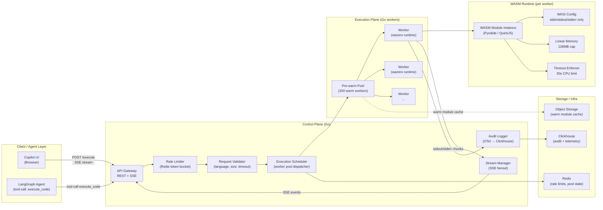

# 02 - Architecture

## High-Level Component Map



---

## End-to-End Request Flow (11 Steps)

**Step 1 - Client submits execution request**

The Copilot UI or a LangGraph agent tool-call sends:
```
POST /v1/execute
Authorization: Bearer <tenant-jwt>
Content-Type: application/json
Accept: text/event-stream

{
  "execution_id": "ex-uuid4",       // client-generated idempotency key
  "language": "python",
  "code": "print(sum(range(100)))",
  "stdin": "",
  "timeout_ms": 10000,
  "memory_mb": 64
}
```

The response is an SSE stream - the connection stays open until execution completes.

**Step 2 - Rate limiter check**

Redis token bucket per `(tenant_id, tier)`. Enterprise tier: 100 concurrent executions + 10,000/hour. Free tier: 5 concurrent + 200/hour. Exceeded limit → `429 Too Many Requests` with `retry_after` header.

**Step 3 - Request validation**

Validator checks:
- Language is in the supported set (`python`, `javascript`, `typescript`, `bash-subset`)
- Code size ≤ 100KB (configurable per tenant tier)
- `timeout_ms` ≤ tenant's max timeout (enterprise: 30s, free: 5s)
- `memory_mb` ≤ tenant's max (enterprise: 256MB, free: 64MB)
- No binary payloads masquerading as code (MIME type check on code field)

Invalid request → `400 Bad Request` with structured error.

**Step 4 - Execution record created**

Job Service writes an execution record to Redis with TTL = timeout + 60s:
```json
{
  "execution_id": "ex-uuid4",
  "tenant_id": "t-abc",
  "language": "python",
  "status": "PENDING",
  "created_at": "...",
  "worker_id": null
}
```

**Step 5 - Scheduler dispatches to worker**

Execution Scheduler checks the pre-warm pool for an available warm worker with the matching language runtime. Uses a weighted round-robin: workers that completed fewer recent executions get priority to balance load.

- **Warm worker available:** dispatch immediately; execution starts in <50ms
- **No warm worker:** accept a cold start; new worker spawned; cold start ~800ms for Python/Pyodide
- **Pool fully saturated (all workers busy):** request queues in Redis; backpressure event sent to client via SSE `{ "event": "queued", "position": 3, "estimated_wait_ms": 1200 }`

**Step 6 - Sandbox creation (WASM module instantiation)**

The assigned worker:
1. Loads the pre-compiled WASM module for the language from in-process cache (or warm-up cache in object storage on cold start)
2. Creates a new `wazero.Runtime` instance for this execution
3. Configures WASI with:
   - `stdin`: pipe connected to the execution's `stdin` field
   - `stdout`: pipe connected to the stream manager
   - `stderr`: pipe connected to the stream manager
   - Filesystem: none (no mounts, no directory grants)
   - Network: none (no socket APIs exposed)
   - Environment variables: explicit allowlist only (empty by default)
   - Clock: real-time allowed (needed for timing-sensitive code)
4. Sets memory limit: `wazero.NewRuntimeConfig().WithMemoryLimitPages(memory_mb * 16)` (1 WASM page = 64KB)
5. Instantiates the module: this creates a fresh linear memory space, isolated from all other executions

**Step 7 - Execution**

The WASM module runs the user's code:
- For **Python:** Pyodide (CPython compiled to WASM) interprets the code string. The worker writes the code to a virtual in-memory file in the WASI pseudo-filesystem (temp dir explicitly allowed only for the code file) and invokes `python -c` equivalent.
- For **JavaScript:** QuickJS compiled to WASM evaluates the code string directly.

A Go goroutine monitors the execution with a deadline derived from `timeout_ms`. If the deadline fires:
1. The goroutine calls `wazero.Runtime.Close()` - this terminates execution immediately
2. The worker sends `{ "event": "timeout", "timeout_ms": 10000 }` via SSE

**Step 8 - Result streaming**

As the WASM module writes to stdout/stderr, the worker reads from the pipe in 1KB chunks and forwards each chunk to the Stream Manager as an SSE event:

```
data: {"event": "stdout", "chunk": "4950\n", "seq": 1}

data: {"event": "stderr", "chunk": "", "seq": 2}

data: {"event": "done", "exit_code": 0, "duration_ms": 87, "memory_peak_mb": 12}
```

The Stream Manager fans this out to all SSE connections waiting for this `execution_id` (supporting the case where the browser and the agent are both watching the same execution).

**Step 9 - Audit logging**

On execution completion (or timeout/error), the worker emits an OpenTelemetry span:
```json
{
  "trace_id": "...",
  "span_id": "...",
  "name": "wasm.execute",
  "tenant_id": "t-abc",
  "execution_id": "ex-uuid4",
  "language": "python",
  "exit_code": 0,
  "duration_ms": 87,
  "memory_peak_mb": 12,
  "timed_out": false,
  "code_hash": "sha256:abc...",  // hash of executed code, not the code itself
  "worker_id": "worker-07"
}
```

This lands in Clickhouse within 30 seconds via the OTel collector. SOC-2 requires this audit trail for all execution events.

**Step 10 - Cleanup**

After execution:
1. WASM module instance is explicitly closed: `module.Close(ctx)` - this deallocates the linear memory
2. `wazero.Runtime.Close()` releases all resources associated with this runtime instance
3. Worker zeroes its local execution context and marks itself available in the pool
4. The execution record in Redis is updated to COMPLETED with TTL = 24h (for result retrieval)

> **No module instance reuse across executions.** Even though WASM linear memory is separate per instance, the module's global state (e.g., Pyodide's Python interpreter state, QuickJS's object heap) could accumulate state from the execution. Fresh instantiation per execution is the correct isolation model.

**Step 11 - Worker returns to pool**

If the worker was pre-warmed, it:
1. Re-instantiates a fresh WASM module (this takes ~50ms for pre-compiled modules - faster than the first cold load)
2. Returns to the pre-warm pool
3. Is available for the next execution within ~50ms

---

## Control Plane vs. Execution Plane

| Layer | Components | Responsibility |
|---|---|---|
| **Control Plane** | API Gateway, Rate Limiter, Validator, Scheduler, Stream Manager, Audit Logger | Request lifecycle management; routing; streaming; observability |
| **Execution Plane** | Pre-warm pool, Go workers, wazero runtimes | Code execution; isolation; resource limits; result capture |
| **Storage** | Redis, Clickhouse, Object Storage | Rate limit state; audit log; warm module cache |

**Key separation:** The control plane never executes user code. The execution plane has no external network access - workers cannot make outbound calls to Redis, Clickhouse, or any other service. All communication between planes flows through the worker's result channel (a Go channel), not via shared memory or external services from inside the sandbox.

---

## Pre-Warm Pool Architecture

```
                    ┌─────────────────────────────────────────────────┐
                    │           Pre-Warm Pool Manager (Go)            │
                    │                                                  │
                    │  target: 200 warm workers                        │
                    │  by language:                                    │
                    │    python: 140 workers (70% of traffic)          │
                    │    javascript: 50 workers (25%)                  │
                    │    other: 10 workers                             │
                    │                                                  │
                    │  Pool watchdog: every 5s checks warm count       │
                    │  Autoscaler: if warm < 20% → spawn new workers   │
                    │  Backpressure: if busy > 95% → queue incoming    │
                    └─────────────────────────────────────────────────┘
                          │                 │
                  available workers      busy workers
                    (idle, warm)         (executing)
```

The pool manager maintains language-specific warm pools based on observed traffic distribution. It adjusts ratios every 5 minutes using a rolling traffic window. During Python-heavy periods, it shifts warm workers from JS to Python.

---

## WASM Runtime Selection: wazero

> **Assumption:** wazero was chosen over Wasmtime-Go and Wasmer-Go.

| Runtime | Language | CGo Required | Security Relevance |
|---|---|---|---|
| **wazero** | Pure Go | No | Smallest attack surface; no CGo means no C memory vulnerabilities in the runtime |
| Wasmtime-Go | Go bindings for Rust Wasmtime | Yes (CGo) | Larger attack surface; Wasmtime is well-audited but CGo boundary is a risk |
| Wasmer-Go | Go bindings for Rust Wasmer | Yes (CGo) | Same concern as Wasmtime-Go |

wazero's pure-Go implementation means:
- No CGo = no `unsafe.Pointer` bridging to C memory = no C-memory bugs that could escape isolation
- Embeds directly in the Go binary with no shared library dependencies
- Deployable as a single static binary (important for container image size and supply chain)
- Fully goroutine-safe runtime lifecycle
