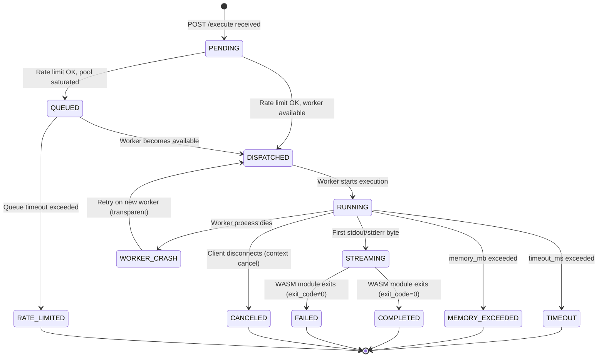

# 04 — Low-Level Design

## Service Decomposition

| Component | Language | Responsibility | Key Dependencies |
|---|---|---|---|
| **API Server** | Go (Gin) | HTTP server, SSE endpoint, auth middleware, route dispatch | Redis (rate limits), Scheduler |
| **Rate Limiter** | Go | Per-tenant token bucket; sliding window counters | Redis |
| **Request Validator** | Go | Language allowlist, size limits, timeout validation | — |
| **Execution Scheduler** | Go | Worker selection, queuing, pool state management | Worker Pool, Redis (pool state) |
| **Stream Manager** | Go | SSE multiplexing, event buffering, reconnect support | — |
| **Pre-Warm Pool Manager** | Go | Worker lifecycle, warm pool sizing, language ratio adjustment | Workers |
| **Worker** | Go | Owns one wazero runtime; executes one job at a time | wazero, WASI config |
| **wazero Runtime** | Go (pure-Go WASM) | WASM module loading, instantiation, execution, resource limits | — |
| **WASM Modules** | WASM bytecode | Language runtimes compiled to WASM (Pyodide, QuickJS) | — |
| **Audit Logger** | Go | OTel span emission for every execution | OTel collector → Clickhouse |
| **Pool Watchdog** | Go (goroutine) | Detects stale/crashed workers, respawns, adjusts warm count | Pre-Warm Pool Manager |

---

## Worker: Core Component

The Worker is the most critical component. It is a Go struct that:
1. Owns one `wazero.Runtime` — the WASM execution engine
2. Executes exactly one job at a time (single-threaded per worker)
3. Manages the entire lifecycle: sandbox creation → execution → cleanup → ready

```go
type Worker struct {
    id           string
    language     Language
    runtime      wazero.Runtime
    moduleCache  *ModuleCache  // pre-compiled WASM bytecode for fast re-instantiation
    state        WorkerState   // WARM, BUSY, RESETTING, DRAINING
    metrics      *WorkerMetrics
    logger       *zap.Logger
}

type WorkerState int
const (
    WARM      WorkerState = iota  // ready to accept work
    BUSY                          // executing a job
    RESETTING                     // cleaning up after job, about to be WARM again
    DRAINING                      // being shut down gracefully
)

func (w *Worker) Execute(ctx context.Context, req *ExecutionRequest) error {
    w.state = BUSY
    defer func() {
        w.cleanup()     // zero memory, close module instance
        w.state = WARM  // back to pool
    }()

    // Create a new module instance (fresh linear memory)
    mod, err := w.runtime.InstantiateModule(ctx, w.moduleCache.Compiled, w.buildWASIConfig(req))
    if err != nil {
        return fmt.Errorf("module instantiation failed: %w", err)
    }
    defer mod.Close(ctx)

    // Set up pipes for stdout/stderr
    stdoutR, stdoutW := io.Pipe()
    stderrR, stderrW := io.Pipe()

    // Stream reader goroutines (non-blocking)
    go w.streamOutput(req.ResultChan, stdoutR, EventStdout, &req.Seq)
    go w.streamOutput(req.ResultChan, stderrR, EventStderr, &req.Seq)

    // Run with timeout
    execCtx, cancel := context.WithTimeout(ctx, time.Duration(req.TimeoutMs)*time.Millisecond)
    defer cancel()

    startTime := time.Now()
    _, err = mod.ExportedFunction("_start").Call(execCtx)
    duration := time.Since(startTime)

    exitCode := 0
    if err != nil {
        exitCode = extractExitCode(err)  // WASM exit code or trap type
    }

    req.ResultChan <- ExecutionEvent{
        Type:       EventDone,
        ExitCode:   exitCode,
        DurationMs: duration.Milliseconds(),
        MemPeakMB:  w.measureMemoryPeak(mod),
    }
    return nil
}

func (w *Worker) buildWASIConfig(req *ExecutionRequest) wazero.ModuleConfig {
    cfg := wazero.NewModuleConfig().
        WithStdin(strings.NewReader(req.StdinData)).
        WithStdout(stdoutW).
        WithStderr(stderrW).
        WithArgs("main").             // argv[0]
        WithFSConfig(wazero.NewFSConfig())  // no filesystem mounts
    // Only add env vars from the explicit allowlist
    for k, v := range req.EnvVars {
        cfg = cfg.WithEnv(k, v)
    }
    return cfg
}

func (w *Worker) cleanup() {
    // The module.Close() call already freed WASM linear memory.
    // Zero our local references for GC.
    w.lastExecID = ""
    w.lastTenantID = ""
    // Re-instantiate a fresh warm module instance in the background
    // so the next execution gets a pre-warmed state.
    go w.prewarm()
}
```

---

## ModuleCache: Pre-Compilation

Compiling WASM bytecode to native machine code (JIT) is expensive — 200-800ms for Pyodide. We pre-compile once and cache the compiled module:

```go
type ModuleCache struct {
    mu       sync.RWMutex
    compiled map[Language]wazero.CompiledModule
}

func (mc *ModuleCache) Load(ctx context.Context, rt wazero.Runtime, lang Language) (wazero.CompiledModule, error) {
    mc.mu.RLock()
    if mod, ok := mc.compiled[lang]; ok {
        mc.mu.RUnlock()
        return mod, nil
    }
    mc.mu.RUnlock()

    // Compile the WASM bytecode (CPU-intensive, done once)
    wasmBytes, err := loadWASMBytes(lang)  // from embedded FS or object storage
    if err != nil {
        return nil, err
    }

    mc.mu.Lock()
    defer mc.mu.Unlock()
    compiled, err := rt.CompileModule(ctx, wasmBytes)
    if err != nil {
        return nil, err
    }
    mc.compiled[lang] = compiled
    return compiled, nil
}
```

`wazero.CompiledModule` is the result of parsing and JIT-compiling the WASM bytecode. It is **immutable and goroutine-safe** — multiple workers share the same compiled module. Each `InstantiateModule` call creates a new instance with fresh linear memory.

**Key distinction:**
- `CompiledModule`: shared, immutable JIT-compiled native code
- `ModuleInstance` (from `InstantiateModule`): per-execution, mutable, isolated linear memory

---

## Pre-Warm Pool Manager

```go
type PoolManager struct {
    workers      []*Worker
    available    chan *Worker       // workers ready to accept work
    langTargets  map[Language]int   // target warm count per language
    mu           sync.Mutex
    metrics      *PoolMetrics
}

func (pm *PoolManager) Dispatch(req *ExecutionRequest) (*Worker, error) {
    // Try non-blocking pick from available pool
    select {
    case w := <-pm.available:
        if w.language == req.Language {
            return w, nil
        }
        // Wrong language — put back and try a cross-language compatible worker
        // (some workers can switch languages by reloading the module cache)
        pm.available <- w
    default:
        // Pool empty — cold start or queue
    }
    return pm.coldStart(req)
}

func (pm *PoolManager) Return(w *Worker) {
    // Worker finished execution; reset and return to pool
    w.state = RESETTING
    go func() {
        w.prewarm()         // ~50ms to instantiate a fresh warm module
        w.state = WARM
        pm.available <- w   // back in the pool
    }()
}

func (pm *PoolManager) watchdog() {
    ticker := time.NewTicker(5 * time.Second)
    for range ticker.C {
        pm.adjustPoolSize()
        pm.checkWorkerHealth()
    }
}

func (pm *PoolManager) adjustPoolSize() {
    // Based on rolling 5-minute request rate:
    // - if warm pool < 20% of target → spawn new workers
    // - if warm pool > 80% of target for 10min → drain excess workers
    // - adjust language ratios based on traffic distribution
}
```

---

## Stream Manager: SSE Fanout

The Stream Manager manages the SSE connection lifecycle and event fanout:

```go
type StreamManager struct {
    streams map[string]*ExecutionStream  // execution_id → stream
    mu      sync.RWMutex
}

type ExecutionStream struct {
    executionID string
    events      []ExecutionEvent     // event buffer for reconnect (last 100)
    subscribers []chan ExecutionEvent // SSE connections watching this execution
    mu          sync.RWMutex
    done        bool
}

func (sm *StreamManager) Subscribe(executionID string, lastSeq int) (<-chan ExecutionEvent, error) {
    sm.mu.RLock()
    stream, ok := sm.streams[executionID]
    sm.mu.RUnlock()

    if !ok {
        return nil, ErrExecutionNotFound
    }

    ch := make(chan ExecutionEvent, 100)
    stream.mu.Lock()
    // Replay buffered events after lastSeq for reconnect support
    for _, ev := range stream.events {
        if ev.Seq > lastSeq {
            ch <- ev
        }
    }
    if !stream.done {
        stream.subscribers = append(stream.subscribers, ch)
    } else {
        close(ch)
    }
    stream.mu.Unlock()
    return ch, nil
}

func (sm *StreamManager) Publish(executionID string, event ExecutionEvent) {
    sm.mu.RLock()
    stream := sm.streams[executionID]
    sm.mu.RUnlock()

    stream.mu.Lock()
    defer stream.mu.Unlock()
    stream.events = append(stream.events, event)
    for _, sub := range stream.subscribers {
        select {
        case sub <- event:
        default:
            // Subscriber channel full — slow consumer, drop event
            // (SSE handles this via reconnect with Last-Event-ID)
        }
    }
    if event.Type == EventDone || event.Type == EventError || event.Type == EventTimeout {
        stream.done = true
        for _, sub := range stream.subscribers {
            close(sub)
        }
    }
}
```

---

## Execution State Machine



---

## WASM Memory Model (Important for Isolation Questions)

WASM linear memory is a contiguous, flat byte array. It is:

1. **Per-instance**: Each call to `InstantiateModule` allocates a fresh linear memory. Memory from one module instance cannot be read or written by another.
2. **Sandboxed**: WASM code can only address offsets within its own linear memory. There are no pointers to host memory. A WASM buffer overflow writes into WASM memory, not host memory.
3. **Explicitly bounded**: We set `WithMemoryLimitPages(n)`. Attempting to grow beyond this causes a WASM trap (not a crash of the host process).
4. **Not automatically zeroed on reuse**: This is why we don't reuse module instances. If we did, the Python interpreter's heap from execution A might be read by execution B if memory wasn't explicitly cleared. Discarding the instance is the safe choice.

```
Host Process Memory
┌─────────────────────────────────────────────────────────────┐
│  Go heap (workers, pool manager, stream manager, etc.)      │
│                                                             │
│  Worker 0:                                                  │
│  ┌──────────────────────────────────────────┐               │
│  │  WASM Linear Memory (isolated)           │               │
│  │  [0...memory_limit_bytes]                │               │
│  │  Python heap / QuickJS heap lives here   │               │
│  └──────────────────────────────────────────┘               │
│                                                             │
│  Worker 1:                                                  │
│  ┌──────────────────────────────────────────┐               │
│  │  WASM Linear Memory (isolated)           │               │
│  │  Completely separate from Worker 0       │               │
│  └──────────────────────────────────────────┘               │
│                                                             │
│  (Workers cannot address each other's WASM memory)          │
└─────────────────────────────────────────────────────────────┘
```

---

## Execution Record Schema (Redis)

```
Key: execution:{execution_id}
TTL: max(timeout_ms, 10000) + 86400  (result kept 24h after completion)
Type: Hash

Fields:
  tenant_id       string
  language        string
  status          PENDING|QUEUED|RUNNING|COMPLETED|FAILED|TIMEOUT|CANCELED
  worker_id       string (set when dispatched)
  created_at      unix timestamp ms
  started_at      unix timestamp ms
  completed_at    unix timestamp ms
  exit_code       int
  duration_ms     int64
  memory_peak_mb  int
  stdout_bytes    int
  stderr_bytes    int
  error_code      string (if failed)
  error_message   string (if failed)
  code_hash       string (sha256 of code)
  # Note: stdout/stderr content stored separately if buffered result needed
```

For executions that complete while the client is disconnected, stdout/stderr are stored in a separate key:
```
Key: execution:{execution_id}:output
TTL: 86400
Type: String (JSON)
Value: {"stdout": "...", "stderr": "..."}
```
