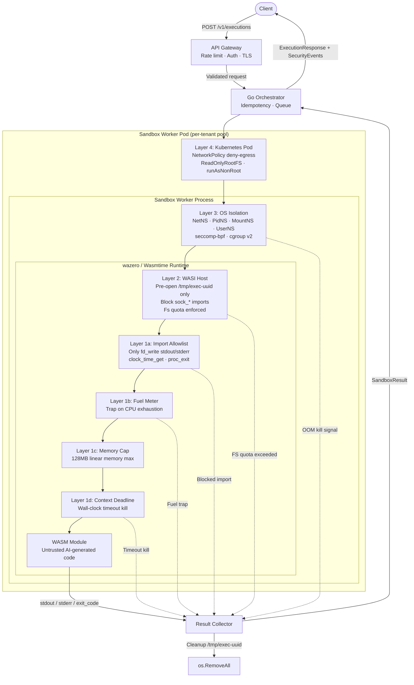

# 02 — Defense-in-Depth Architecture

## Overview

The sandbox execution plane uses five concentric isolation layers. Each layer is independently enforceable and independently observable. A bypass in an inner layer is contained by outer layers. No single control failure produces a full escape.

This is the same model Suman deployed at BlackBox: a Golang orchestration layer driving wazero-based WASM execution, wrapped with Linux namespaces and seccomp-bpf, all inside Kubernetes pods with strict network policy. The layered approach unblocked Enterprise SOC-2 compliance by providing auditable, deterministic isolation boundaries.

---

## Layer 1 — WASM Runtime Controls

**Runtime:** wazero (pure-Go, no CGo) or wasmtime-go (Wasmtime via CGo bindings). wazero is preferred in a Go service because it avoids CGo and produces a single static binary with no shared library dependency.

### Controls

**Linear memory sandbox**
WASM's memory model is a flat byte array (the "linear memory"). All pointer arithmetic is bounded within this array. WASM code has no mechanism to reference host process memory outside the sandbox. Buffer overflows stay inside the linear memory and cannot corrupt Go heap or stack.

**Import allowlist**
A WASM module can only call host functions that the host explicitly exports to it. At instantiation time the host passes a `wasm.HostFunctionBuilder` (wazero) that registers exactly the functions the module may call:
- `fd_write` (stdout, stderr only — fd 1 and fd 2)
- `clock_time_get`
- `proc_exit`

Everything else — `sock_open`, `path_open`, `fd_read` on arbitrary fds, `environ_get` — is simply not registered. Any attempt to call an unregistered import traps the module immediately with a `wasm.ErrModuleInstantiation`-class error.

**Fuel metering**
Wasmtime supports per-instruction fuel. A compile-time or instantiation-time fuel budget is set (e.g., 10 billion units ≈ ~2 CPU-seconds of compute). Each WASM instruction consumes one unit. When fuel reaches zero the runtime raises a `code_out_of_fuel` trap — the module is killed deterministically without relying on wall-clock signals.

wazero exposes equivalent functionality via `RuntimeConfig.WithCloseOnContextDone` plus a context deadline, but dedicated fuel metering is available through the `wazero/sys` API.

**Memory cap**
The WASM `memory` section declares a maximum page count. The host enforces this at instantiation: if the module requests more than `MaxMemoryBytes / 65536` pages (e.g., 2048 pages = 128 MB), the instantiation is rejected. At runtime `memory.grow` traps if it would exceed the cap.

**Wall-clock timeout**
The Go orchestrator wraps the execution in `context.WithDeadline`. The wazero runtime is configured with `RuntimeConfig.WithCloseOnContextDone(true)`, which propagates context cancellation into the WASM execution loop. Wasmtime exposes `Engine::increment_epoch` + `Store::set_epoch_deadline` for the same effect. The timeout is the last-resort kill after fuel metering fires; it guards against spin-wait loops that consume fuel slowly.

**Fresh instantiation**
A WASM module instance is never reused across executions. Each request compiles (or loads from an AOT cache), instantiates, runs, and is disposed. This eliminates state leakage (global variables, open file descriptors, partial memory writes) between tenants or between sequential executions from the same tenant.

---

## Layer 2 — WASI Capability Restrictions

WASI (WebAssembly System Interface) is capability-based by design. There is no ambient authority: a module can only access the resources the host explicitly hands to it.

**Pre-opened directory**
The host opens exactly one directory for the module: an ephemeral per-execution path `/tmp/exec-<uuid>`. This directory is pre-opened with a filesystem quota enforced via the host's WASI `fd_write` interceptor counting bytes. The module can read and write within this directory and no other. There is no `path_open` into parent directories; WASI path traversal checks prevent `../` escapes at the WASI host layer.

**No network imports**
`sock_accept`, `sock_connect`, `sock_recv`, `sock_send`, `sock_open` are not registered in the host. The WASI preview1 spec includes these; the host simply omits them. Any call traps with `ErrFunctionNotFound`.

**No real FS paths**
The WASM module never sees host filesystem paths. `/proc`, `/sys`, `/etc`, and all host mounts are invisible. The only visible path is the ephemeral scratch directory.

**Post-execution cleanup**
After execution (success, trap, or timeout), the orchestrator deletes `/tmp/exec-<uuid>` and all contents unconditionally. This is a deferred `os.RemoveAll` registered before execution starts so cleanup fires even on panic.

---

## Layer 3 — OS Isolation (Linux Namespaces + seccomp + cgroups)

The Go orchestrator process that hosts WASM execution runs inside a Linux namespace bundle. On Kubernetes this is achieved by running the worker pod with a custom seccomp profile and restricted capabilities, plus an init container or a privileged sidecar that sets up namespaces if unshare is available.

**Network namespace**
`CLONE_NEWNET`: the process sees a loopback interface only. No external NIC. Even if WASM somehow called a raw socket syscall, there is no interface to send packets on.

**PID namespace**
`CLONE_NEWPID`: the sandbox process cannot enumerate or signal host processes. `/proc` inside the namespace shows only the sandbox's own process tree.

**Mount namespace**
`CLONE_NEWNS`: the sandbox process mounts a minimal read-only rootfs (busybox-style). No host paths are mounted. `/proc`, `/sys` are either absent or mounted read-only with minimal visibility.

**User namespace**
`CLONE_NEWUSER`: the process appears to run as `uid=0` inside the namespace but maps to an unprivileged `uid=65534` (nobody) on the host. Capabilities inside the namespace are scoped to the namespace and do not grant host-level privileges.

**seccomp-bpf allowlist**
A BPF program is loaded via `prctl(PR_SET_SECCOMP, SECCOMP_MODE_FILTER)`. The allowlist includes only what Wasmtime/wazero actually needs:

| Allowed | Rationale |
|---|---|
| `read`, `write`, `pread64`, `pwrite64` | file I/O |
| `mmap`, `munmap`, `mprotect` | JIT code generation |
| `futex` | Go runtime scheduler |
| `clock_gettime`, `clock_nanosleep` | time |
| `exit`, `exit_group` | process exit |
| `brk` | heap growth |
| `sigaltstack`, `rt_sigaction`, `rt_sigprocmask` | Go signal handling |
| `getrandom` | Go crypto |
| `openat`, `close`, `fstat`, `lstat` | ephemeral tmp dir only |

Blocked (SIGSYS / EPERM returned):

- `socket`, `connect`, `bind`, `accept`, `sendto`, `recvfrom` — no network
- `execve`, `execveat` — no child process spawning
- `ptrace` — no debugging/introspection of other processes
- `perf_event_open` — no side-channel timing attacks
- `clone` with `CLONE_NEWUSER` — no privilege escalation via user namespace
- `setuid`, `setgid`, `capset` — no privilege escalation
- `mount`, `pivot_root` — no filesystem escapes
- `init_module`, `finit_module` — no kernel module loading

**cgroup v2 limits**

| Controller | Setting | Value |
|---|---|---|
| `cpu.max` | CPU quota per period | `200000 1000000` (200ms CPU per 1s) |
| `memory.max` | Hard memory cap | `268435456` (256 MB) |
| `memory.swap.max` | No swap | `0` |
| `pids.max` | Fork bomb prevention | `64` |
| `io.max` | Disk I/O rate limit | `rbps=10485760 wbps=1048576` |

When `memory.max` is hit, the kernel OOM-kills the cgroup. This fires even if WASM memory caps are misconfigured or if the Go orchestrator itself allocates on behalf of the module.

---

## Layer 4 — Container and Kubernetes Layer

Each sandbox worker is a dedicated Kubernetes pod. No two tenants share a pod. The pod spec enforces:

```yaml
securityContext:
  runAsNonRoot: true
  runAsUser: 65534
  allowPrivilegeEscalation: false
  readOnlyRootFilesystem: true
  seccompProfile:
    type: Localhost
    localhostProfile: sandbox-seccomp.json
  capabilities:
    drop: ["ALL"]

resources:
  limits:
    cpu: "2"
    memory: "512Mi"
  requests:
    cpu: "500m"
    memory: "256Mi"
```

**Network policy**
```yaml
apiVersion: networking.k8s.io/v1
kind: NetworkPolicy
metadata:
  name: sandbox-deny-egress
spec:
  podSelector:
    matchLabels:
      role: sandbox-worker
  policyTypes:
    - Egress
  egress:
    - ports:
        - port: 9090   # Prometheus metrics scrape only
          protocol: TCP
```

All other egress is denied. The sandbox worker pod cannot reach the internet, the control plane API, or any other internal service.

**AppArmor profile** (optional, if AppArmor is loaded on the node)
A profile named `sandbox-worker` denies `network inet`, `network inet6`, `capability net_raw`, and all `/proc/sys/` writes.

---

## Layer 5 — Multi-Tenant Isolation

**Execution pool separation**
Each tenant has a dedicated pool of WASM worker goroutines. The pool size is configured per tier (free, pro, enterprise). This prevents one tenant's burst from starving another's workers (noisy-neighbor CPU starvation) and ensures per-tenant queue depth visibility.

**Ephemeral directory isolation**
Temp directories are `/tmp/exec-<tenant_id>-<exec_uuid>`. The Go orchestrator creates them with mode `0700` owned by the worker process UID. No two tenants' directories share a common parent writable by both.

**Kubernetes namespace separation**
For enterprise tenants with SOC-2 requirements (directly applicable to Suman's BlackBox work), sandbox workers run in a dedicated Kubernetes namespace with its own resource quotas, network policies, and RBAC. For strict isolation tiers, a dedicated node pool with node taints ensures workloads are physically separated on different nodes.

**Audit log per tenant**
Every execution emits a structured log entry tagged with `tenant_id`, `exec_id`, and the full `SecurityEvents` list. These logs are immutable (append-only sink) and retained for 90 days, satisfying SOC-2 CC6.1 and CC7.2 logging requirements.

---

## Request-Path Mermaid Diagram



---

## Defense-in-Depth Summary Table

| Layer | Resource | Control | What it stops |
|---|---|---|---|
| 1 — WASM Runtime | CPU | Fuel metering | Infinite loops, compute abuse |
| 1 — WASM Runtime | Memory | Linear memory max | Heap explosion inside WASM |
| 1 — WASM Runtime | Network | Import allowlist (no sock_*) | Direct socket calls from WASM |
| 1 — WASM Runtime | FS | Import allowlist (no path_open to host) | Host filesystem reads |
| 1 — WASM Runtime | State | Fresh instantiation | Cross-execution state leakage |
| 2 — WASI Host | FS | Pre-open + quota | Directory traversal, disk fill |
| 2 — WASI Host | Network | Unregistered sock_* | WASI network API abuse |
| 3 — OS | Network | Network namespace | Raw socket, IP stack abuse |
| 3 — OS | Privilege | seccomp-bpf | execve, ptrace, privilege escalation |
| 3 — OS | CPU/Mem | cgroup v2 | Host resource exhaustion, fork bombs |
| 4 — Kubernetes | Network | NetworkPolicy deny-egress | Pod-to-pod lateral movement |
| 4 — Kubernetes | Privilege | securityContext | Container breakout via capabilities |
| 5 — Multi-tenant | State | Separate pools + dirs | Cross-tenant data leakage |
| 5 — Multi-tenant | Compliance | Dedicated namespaces/nodes | SOC-2 tenant boundary audit |
