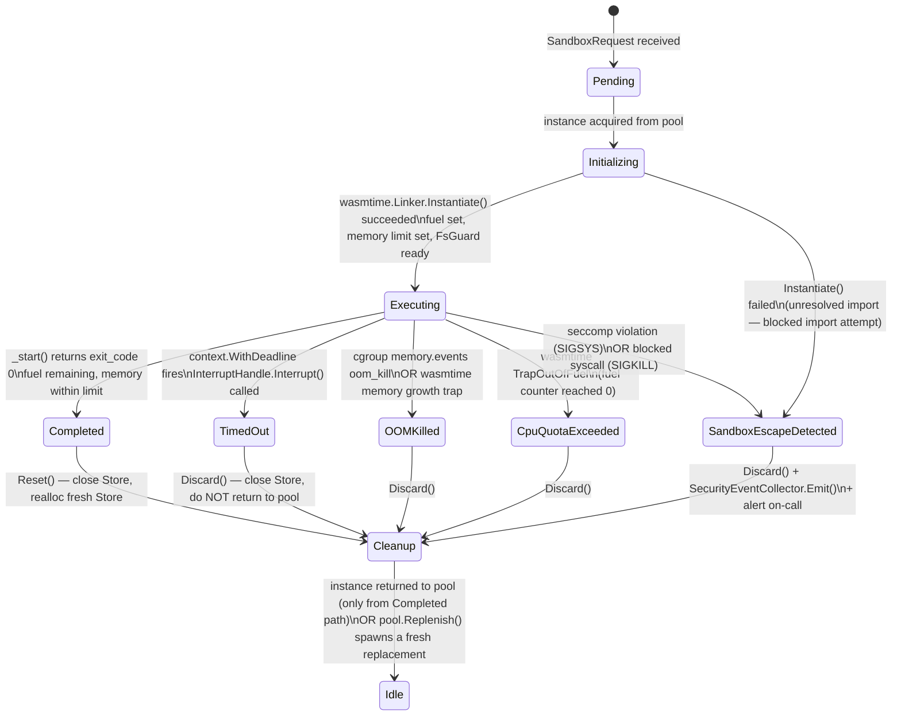

# 04 — Low-Level Design: Enforcement Engine

Focus: module-level design of every subsystem that prevents malicious AI-generated code from
escaping the sandbox or abusing CPU, memory, filesystem, or network access.

---

## Module Map

```
SandboxManager
  ├── WASMInstance (wraps wasmtime.Store + wasmtime.Instance)
  │     └── ResourceEnforcer (fuel, memory, deadline goroutine)
  ├── SeccompFilter (BPF, applied once per worker process)
  ├── FsGuard (ephemeral tmpdir + quota-aware host wrapper)
  ├── NetworkBlocker (WASM import filter + netns + K8s NetworkPolicy)
  └── SecurityEventCollector (OTel spans + audit log)
```

---

## SandboxManager (Go)

`SandboxManager` owns a pool of pre-warmed `WASMInstance` objects — one per supported language
runtime (Python/Pyodide, JavaScript/QuickJS, etc.). It is the single call-site that the
execution API layer touches.

```go
type SandboxManager struct {
    pool        map[Language]*instancePool   // per-language warm pools
    config      ManagerConfig
    enforcer    *ResourceEnforcer
    fsGuard     *FsGuard
    netBlocker  *NetworkBlocker
    collector   *SecurityEventCollector
    metrics     *prometheus.Registry
    mu          sync.Mutex
}

type ManagerConfig struct {
    PoolSizePerLanguage  int
    MaxPoolSize          int
    WarmupConcurrency    int
    HealthcheckInterval  time.Duration
}

// Execute is the primary entrypoint called by the API layer.
// It is the ONLY public method callers should use.
func (sm *SandboxManager) Execute(ctx context.Context, req SandboxRequest) SandboxResult {
    inst, err := sm.pool[req.Language].Acquire(ctx)
    if err != nil {
        return SandboxResult{Error: ErrNoInstanceAvailable}
    }

    result := inst.Run(req.Code, req.Config)

    // Safety gate: if any security signal fired, discard the instance.
    // Never return a potentially tainted instance to the pool.
    if result.SecurityEvent != nil {
        sm.collector.Emit(result.SecurityEvent)
        inst.Discard()           // close wasmtime.Store, free memory
        sm.pool[req.Language].Replenish(ctx)  // spawn a fresh replacement
    } else {
        inst.Reset()             // zero state, return to pool
        sm.pool[req.Language].Return(inst)
    }

    return result
}

// Healthcheck polls each pool for stuck or unhealthy instances.
// Called on a ticker from the manager's background goroutine.
func (sm *SandboxManager) Healthcheck() HealthStatus {
    status := HealthStatus{Timestamp: time.Now()}
    for lang, p := range sm.pool {
        pStatus := p.Health()
        status.Pools[lang] = pStatus
        if pStatus.StuckInstances > 0 {
            p.EvictStuck()
        }
    }
    return status
}

// ScalePool adjusts the target warm-instance count for a language pool.
// Called by the HPA controller or the internal autoscaler goroutine.
func (sm *SandboxManager) ScalePool(lang Language, targetSize int) error {
    if targetSize < 1 || targetSize > sm.config.MaxPoolSize {
        return ErrInvalidPoolSize
    }
    return sm.pool[lang].Resize(context.Background(), targetSize)
}
```

### instancePool internals

```go
type instancePool struct {
    lang      Language
    warm      chan *WASMInstance    // buffered channel acts as the pool
    target    int
    factory   func() (*WASMInstance, error)
    mu        sync.Mutex
}

func (p *instancePool) Acquire(ctx context.Context) (*WASMInstance, error) {
    select {
    case inst := <-p.warm:
        return inst, nil
    case <-ctx.Done():
        return nil, ctx.Err()
    }
}

func (p *instancePool) Replenish(ctx context.Context) {
    go func() {
        inst, err := p.factory()
        if err != nil {
            return
        }
        select {
        case p.warm <- inst:
        default:
            inst.Discard()   // pool already full (race); throw away
        }
    }()
}
```

---

## WASMInstance (Go + Wasmtime)

Each `WASMInstance` wraps a `wasmtime.Store` and a linked (but not yet called) `wasmtime.Instance`.
The Store carries all per-execution state: fuel counter, memory limit, and the import filter.

```go
type WASMInstance struct {
    engine    *wasmtime.Engine        // shared, immutable; one per process
    store     *wasmtime.Store         // per-instance; holds fuel + memory state
    module    *wasmtime.Module        // pre-compiled, shared across instances of same language
    instance  *wasmtime.Instance      // live instance; nil until Run() is called
    config    SandboxConfig
    id        string
    discarded bool
}

// Run compiles the user code into a WASM wrapper (or for interpreted runtimes,
// injects it as a string into the pre-warmed interpreter instance), then executes.
func (wi *WASMInstance) Run(code []byte, cfg SandboxConfig) SandboxResult {
    wi.config = cfg

    // 1. Configure the Store before instantiation.
    //    Fuel sets a hard ceiling on WASM instructions executed.
    wi.store.SetFuel(cfg.MaxFuelUnits)

    // 2. Build the linker with the allowed import set ONLY.
    //    Any import not in this allowlist causes instantiation to fail — the
    //    module is rejected before a single instruction executes.
    linker, err := wi.buildFilteredLinker()
    if err != nil {
        return SandboxResult{Error: fmt.Errorf("import filtering failed: %w", err)}
    }

    // 3. Instantiate (links imports, allocates linear memory, runs _initialize).
    inst, err := linker.Instantiate(wi.store, wi.module)
    if err != nil {
        // Instantiation failure = unresolved import (import filter blocked it)
        // or malformed module.
        return SandboxResult{
            Error:         fmt.Errorf("instantiation rejected: %w", err),
            SecurityEvent: &SecurityEvent{Type: BlockedImport, Detail: err.Error()},
        }
    }
    wi.instance = inst

    // 4. Apply memory limit via the module's memory export.
    mem := inst.GetExport(wi.store, "memory")
    if mem != nil && mem.Memory() != nil {
        // Wasmtime enforces this at the store level; growth beyond limit traps.
        wi.store.Limiter(int64(cfg.MaxMemoryPages))
    }

    // 5. Run the entry point under a deadline enforced by a parent goroutine.
    //    The ResourceEnforcer handles the interrupt-on-deadline path.
    return wi.executeWithEnforcer(cfg)
}

// Reset zeroes mutable state so the instance can be returned to the pool.
// ONLY safe to call if Run() completed without a SecurityEvent.
// For any suspicious execution, call Discard() instead.
func (wi *WASMInstance) Reset() {
    // We do NOT reuse the wasmtime.Store — a fresh Store (and therefore fresh
    // linear memory) is required for the next execution to prevent cross-tenant
    // memory leakage. Reset() closes the current store and allocates a new one.
    wi.store.Close()
    wi.store = wasmtime.NewStore(wi.engine)
    wi.instance = nil
    wi.discarded = false
}

// Discard permanently closes this instance. It is NOT returned to the pool.
func (wi *WASMInstance) Discard() {
    if wi.store != nil {
        wi.store.Close()
    }
    wi.discarded = true
}

// buildFilteredLinker returns a linker that only exposes the allowed WASI/host
// functions. Any import the module requests that is not explicitly linked here
// will cause Instantiate() to return an error — there is no fallback.
func (wi *WASMInstance) buildFilteredLinker() (*wasmtime.Linker, error) {
    linker := wasmtime.NewLinker(wi.engine)

    // Allowed WASI preview1 surface:
    allowedWASI := []string{
        "proc_exit", "fd_write", "fd_read", "fd_close",
        "fd_seek", "fd_tell", "fd_stat_get",
        "path_open",          // allowed but rooted to the FsGuard tmpdir only
        "clock_time_get",
        "random_get",
        "environ_get", "environ_sizes_get",
        "args_get", "args_sizes_get",
    }

    wasiSnapshot := wasmtime.NewWasiInstance(wi.store, wi.buildWASIConfig())
    for _, fn := range allowedWASI {
        if err := linker.DefineFunc(wi.store, "wasi_snapshot_preview1", fn,
            wasiSnapshot.ExportedFunc(fn)); err != nil {
            return nil, err
        }
    }

    // Explicitly NOT linked (blocked by omission):
    //   sock_open, sock_connect, sock_recv, sock_send  (network)
    //   path_rename, path_unlink_at to paths outside tmpdir  (fs escape)
    //   fd_advise (no-op risk vector)

    return linker, nil
}
```

### Key design note: why we discard rather than reset the Store

WASM linear memory is a flat, mutable byte array. If we reused the Store across executions,
residual heap data from execution A (secrets, tokens, model weights) would be readable to
execution B. Closing and re-allocating the Store guarantees a zero-initialized linear memory
for every execution. The compiled `wasmtime.Module` is immutable and safely shared.

---

## ResourceEnforcer (Go)

`ResourceEnforcer` runs before, during, and after each execution to bound CPU, memory, and
wall-clock time.

```go
type ResourceEnforcer struct {
    engine *wasmtime.Engine
}

type ResourceUsage struct {
    FuelConsumed  uint64
    MemoryBytes   uint64
    WallClockMs   int64
    CPUMs         int64
    OOMKilled     bool
    FuelExhausted bool
    DeadlineHit   bool
}

// executeWithEnforcer runs the WASM entry point in a child goroutine.
// The parent goroutine enforces the wall-clock deadline via context + interrupt.
func (wi *WASMInstance) executeWithEnforcer(cfg SandboxConfig) SandboxResult {
    ctx, cancel := context.WithDeadline(context.Background(),
        time.Now().Add(time.Duration(cfg.MaxWallClockMs)*time.Millisecond))
    defer cancel()

    // Interrupt handle must be obtained BEFORE spawning the goroutine.
    // It is safe to call Interrupt() from a different goroutine.
    handle, err := wi.store.InterruptHandle()
    if err != nil {
        return SandboxResult{Error: fmt.Errorf("could not create interrupt handle: %w", err)}
    }

    resultCh := make(chan wasmExecResult, 1)

    go func() {
        start := time.Now()
        fn := wi.instance.GetExport(wi.store, "_start")
        _, execErr := fn.Func().Call(wi.store)
        resultCh <- wasmExecResult{
            err:        execErr,
            wallClockMs: time.Since(start).Milliseconds(),
        }
    }()

    select {
    case res := <-resultCh:
        return wi.collectUsage(res, cfg)

    case <-ctx.Done():
        // Deadline exceeded — interrupt the WASM execution.
        // wasmtime checks interrupt flags at every fuel decrement point,
        // so the goroutine above will unblock within microseconds.
        handle.Interrupt()
        res := <-resultCh   // drain; goroutine is now unblocked
        return SandboxResult{
            Error:         ErrDeadlineExceeded,
            Usage:         wi.collectUsageRaw(res),
            SecurityEvent: nil,   // timeout is not a security event by itself
        }
    }
}

// Before execution: fuel is set on the Store (done in WASMInstance.Run).
// The Store decrements fuel per WASM instruction; when fuel hits zero, wasmtime
// raises a trap of type TrapKind_OutOfFuel.

// After execution: collect metered values from the Store.
func (wi *WASMInstance) collectUsage(res wasmExecResult, cfg SandboxConfig) SandboxResult {
    fuelRemaining, _ := wi.store.GetFuel()
    fuelConsumed := cfg.MaxFuelUnits - fuelRemaining

    memSize := uint64(0)
    if mem := wi.instance.GetExport(wi.store, "memory"); mem != nil && mem.Memory() != nil {
        memSize = uint64(mem.Memory().DataSize(wi.store))
    }

    usage := ResourceUsage{
        FuelConsumed: fuelConsumed,
        MemoryBytes:  memSize,
        WallClockMs:  res.wallClockMs,
    }

    // Classify the trap type to distinguish OOM from CPU exhaustion.
    var secEvent *SecurityEvent
    if res.err != nil {
        if trap, ok := res.err.(*wasmtime.Trap); ok {
            switch trap.Code() {
            case wasmtime.TrapOutOfFuel:
                usage.FuelExhausted = true
                secEvent = &SecurityEvent{Type: CPUQuotaExceeded, FuelConsumed: fuelConsumed}
            case wasmtime.TrapUnreachableCodeReached:
                // Normal program trap (e.g., panic in Rust WASM); not a security event.
            }
        }
    }

    return SandboxResult{Usage: usage, SecurityEvent: secEvent}
}
```

### Fuel calibration

| Tier | Max fuel units | Approximate compute budget |
|------|---------------|---------------------------|
| Free | 500M | ~250ms of moderate Python |
| Pro | 2B | ~1s of moderate Python |
| Enterprise | 10B | ~5s of moderate Python |

1 fuel unit = 1 WASM instruction. Calibration: a tight loop in Pyodide executes roughly
2B instructions per second on a 3 GHz core, so 1B units ≈ 500ms of pure compute at
moderate complexity. The mapping is linear but language-dependent (Python burns more
instructions per "line" than Rust).

---

## SeccompFilter (Go using libseccomp / pre-compiled BPF)

The seccomp filter is applied **once per worker process at startup**, not per execution.
Per-execution application would add 2-5ms of syscall overhead and is unnecessary because
the worker process is single-tenant for its lifetime.

```go
// ApplySeccompFilter is called in main() of the worker binary,
// before processing any execution requests.
func ApplySeccompFilter() error {
    filter, err := seccomp.NewFilter(seccomp.ActKillProcess)  // default: SIGKILL on violation
    if err != nil {
        return fmt.Errorf("seccomp filter init: %w", err)
    }
    defer filter.Release()

    // Allowlist: only syscalls required for Go runtime + WASM execution.
    allowed := []seccomp.ScmpSyscall{
        seccomp.ScmpSyscall(syscall.SYS_READ),
        seccomp.ScmpSyscall(syscall.SYS_WRITE),
        seccomp.ScmpSyscall(syscall.SYS_MMAP),
        seccomp.ScmpSyscall(syscall.SYS_MPROTECT),
        seccomp.ScmpSyscall(syscall.SYS_FUTEX),
        seccomp.ScmpSyscall(syscall.SYS_CLOCK_GETTIME),
        seccomp.ScmpSyscall(syscall.SYS_NANOSLEEP),
        seccomp.ScmpSyscall(syscall.SYS_EXIT_GROUP),
        seccomp.ScmpSyscall(syscall.SYS_GETPID),
        seccomp.ScmpSyscall(syscall.SYS_OPENAT),    // controlled by FsGuard
        seccomp.ScmpSyscall(syscall.SYS_CLOSE),
        seccomp.ScmpSyscall(syscall.SYS_FSTAT),
        seccomp.ScmpSyscall(syscall.SYS_PREAD64),
        seccomp.ScmpSyscall(syscall.SYS_PWRITE64),
        seccomp.ScmpSyscall(syscall.SYS_LSEEK),
        seccomp.ScmpSyscall(syscall.SYS_MUNMAP),
        seccomp.ScmpSyscall(syscall.SYS_SIGALTSTACK),
        seccomp.ScmpSyscall(syscall.SYS_RT_SIGRETURN),
        seccomp.ScmpSyscall(syscall.SYS_SCHED_YIELD),
    }
    for _, sc := range allowed {
        if err := filter.AddRule(sc, seccomp.ActAllow); err != nil {
            return fmt.Errorf("seccomp allow rule for %v: %w", sc, err)
        }
    }

    // Explicit blocklist with SIGKILL (defense-in-depth; also caught by default deny above).
    // Listed explicitly so violations are distinguishable in audit logs.
    explicitDeny := []seccomp.ScmpSyscall{
        seccomp.ScmpSyscall(syscall.SYS_SOCKET),
        seccomp.ScmpSyscall(syscall.SYS_CONNECT),
        seccomp.ScmpSyscall(syscall.SYS_EXECVE),
        seccomp.ScmpSyscall(syscall.SYS_EXECVEAT),
        seccomp.ScmpSyscall(syscall.SYS_PTRACE),
        seccomp.ScmpSyscall(syscall.SYS_PERF_EVENT_OPEN),
        seccomp.ScmpSyscall(syscall.SYS_KEYCTL),
        seccomp.ScmpSyscall(syscall.SYS_MOUNT),
        seccomp.ScmpSyscall(syscall.SYS_PIVOT_ROOT),
        seccomp.ScmpSyscall(syscall.SYS_CLONE),     // no fork-based escape
        seccomp.ScmpSyscall(syscall.SYS_UNSHARE),   // no namespace manipulation
        seccomp.ScmpSyscall(syscall.SYS_SETUID),
        seccomp.ScmpSyscall(syscall.SYS_SETGID),
        seccomp.ScmpSyscall(syscall.SYS_CHROOT),
    }
    for _, sc := range explicitDeny {
        // SECCOMP_RET_TRAP sends SIGSYS; we use ActKillProcess to guarantee death.
        if err := filter.AddRule(sc, seccomp.ActKillProcess); err != nil {
            return fmt.Errorf("seccomp deny rule for %v: %w", sc, err)
        }
    }

    return filter.Load()
}
```

**Why not per-execution?** `prctl(PR_SET_SECCOMP, SECCOMP_MODE_FILTER, ...)` is a process-level
operation. Calling it inside every execution would (a) be redundant — the filter is already in
effect — and (b) add ~2ms of kernel syscall overhead per execution.

---

## FsGuard (Go)

`FsGuard` creates an ephemeral, quota-bounded scratch directory for each execution. No execution
can read or write files outside its own tmpdir.

```go
type FsGuard struct {
    baseDir   string  // e.g. /run/sandbox-scratch on tmpfs
    quotaBytes int64
}

type guardedDir struct {
    path       string
    written    int64   // atomic counter
    quotaBytes int64
}

// Prepare creates a fresh tmpdir and returns a WASI FSConfig rooted at it.
// The returned cleanup func MUST be deferred by the caller.
func (fg *FsGuard) Prepare(execID string) (wasi.FSConfig, func(), error) {
    dir, err := os.MkdirTemp(fg.baseDir, execID+"-")
    if err != nil {
        return wasi.FSConfig{}, nil, fmt.Errorf("tmpdir creation: %w", err)
    }

    gd := &guardedDir{path: dir, quotaBytes: fg.quotaBytes}

    // Wrap the real FS with a quota-aware layer.
    // quotaFS intercepts every write call and checks the running total.
    qfs := &quotaFS{dir: gd, inner: os.DirFS(dir)}

    fsCfg := wasi.NewFSConfig().WithFSMount(qfs, "/")

    cleanup := func() {
        if err := os.RemoveAll(dir); err != nil {
            // Log but don't fail — worst case the ephemeral tmpfs is recycled
            // by the OS on next mount.
            log.Printf("FsGuard cleanup failed for %s: %v", dir, err)
        }
    }

    return fsCfg, cleanup, nil
}

// quotaFS wraps fs.FS and intercepts Open() for writes,
// rejecting any write that would push total bytes over the quota.
type quotaFS struct {
    dir   *guardedDir
    inner fs.FS
}

func (q *quotaFS) Open(name string) (fs.File, error) {
    f, err := q.inner.Open(name)
    if err != nil {
        return nil, err
    }
    return &quotaFile{File: f, guard: q.dir}, nil
}

type quotaFile struct {
    fs.File
    guard *guardedDir
}

func (qf *quotaFile) Write(p []byte) (int, error) {
    newTotal := atomic.AddInt64(&qf.guard.written, int64(len(p)))
    if newTotal > qf.guard.quotaBytes {
        atomic.AddInt64(&qf.guard.written, -int64(len(p)))  // roll back
        return 0, ErrFsQuotaExceeded
    }
    return qf.File.(io.Writer).Write(p)
}
```

**Key invariants:**
- The WASI `path_open` host function is linked only to files under `tmpdir`. Paths with `..`
  components are rejected by the WASI layer before reaching the host OS.
- `os.RemoveAll` is wrapped in `defer` so it fires even on WASM trap, panic, or context cancel.
- `baseDir` lives on a `tmpfs` mount, so tmpdir creation and removal are RAM-speed ops with no
  disk I/O.

---

## NetworkBlocker

Network blocking is defense-in-depth across three independent layers.

### Layer 1: WASM import filter (innermost)

`sock_open`, `sock_connect`, `sock_recv`, `sock_send`, and all WASI socket extensions are
absent from the linker's allowed import set (see `buildFilteredLinker` above). A module that
imports any of these will fail to instantiate before executing a single instruction.

### Layer 2: OS — network namespace (middle)

Each worker process starts inside a dedicated network namespace with no interfaces:

```bash
# In the worker process launcher (Go):
// cmd is the worker subprocess; run it in a new network namespace.
cmd.SysProcAttr = &syscall.SysProcAttr{
    Cloneflags: syscall.CLONE_NEWNET,  // new, empty network namespace
}
```

Inside an empty netns, `connect(2)` returns `ENETUNREACH` even if the seccomp filter were
somehow bypassed. The worker cannot reach loopback (127.0.0.1) or any external host.

### Layer 3: Kubernetes NetworkPolicy (outermost)

```yaml
apiVersion: networking.k8s.io/v1
kind: NetworkPolicy
metadata:
  name: sandbox-worker-deny-all-egress
  namespace: execution-plane
spec:
  podSelector:
    matchLabels:
      role: sandbox-worker
  policyTypes:
    - Egress
  egress: []   # empty egress = deny all
```

This catches any escapes via the container runtime or CNI layer, independent of what happens
inside the process.

---

## SecurityEventCollector

`SecurityEventCollector` is the unified sink for all enforcement signals. Every event is
emitted as an OpenTelemetry span with a `security_event` attribute, routed to the same
50M-span/day telemetry mesh used for operational observability.

```go
type SecurityEventType string

const (
    BlockedImport       SecurityEventType = "blocked_wasm_import"
    CPUQuotaExceeded    SecurityEventType = "cpu_quota_exceeded"
    OOMKilled           SecurityEventType = "oom_killed"
    FsQuotaExceeded     SecurityEventType = "fs_quota_exceeded"
    DeadlineExceeded    SecurityEventType = "deadline_exceeded"
    SeccompViolation    SecurityEventType = "seccomp_violation"
    SandboxEscape       SecurityEventType = "sandbox_escape_detected"
)

type SecurityEvent struct {
    Type         SecurityEventType
    ExecutionID  string
    TenantID     string
    Detail       string
    FuelConsumed uint64
    MemoryBytes  uint64
    Timestamp    time.Time
}

type SecurityEventCollector struct {
    tracer   trace.Tracer
    alertCh  chan SecurityEvent   // high-severity events go here for PagerDuty
}

func (sec *SecurityEventCollector) Emit(ev *SecurityEvent) {
    if ev == nil {
        return
    }

    ctx, span := sec.tracer.Start(context.Background(), "sandbox.security_event")
    defer span.End()

    span.SetAttributes(
        attribute.String("security_event.type", string(ev.Type)),
        attribute.String("execution_id", ev.ExecutionID),
        attribute.String("tenant_id", ev.TenantID),
        attribute.String("detail", ev.Detail),
        attribute.Int64("fuel_consumed", int64(ev.FuelConsumed)),
        attribute.Int64("memory_bytes", int64(ev.MemoryBytes)),
    )
    span.SetStatus(codes.Error, string(ev.Type))

    // High-severity events (escape attempts) trigger immediate alerts.
    if ev.Type == SandboxEscape || ev.Type == SeccompViolation || ev.Type == BlockedImport {
        select {
        case sec.alertCh <- *ev:
        default:
            // Alert channel full; don't block the execution path.
            // The OTel span is already emitted; on-call rotation picks it up via query.
        }
    }
}

// Event sources and how they hook in:
//
//   seccomp violations:    worker subprocess receives SIGSYS → Go signal handler
//                          → Emit(SeccompViolation)
//
//   blocked WASM imports:  linker.Instantiate returns error → Run() → Emit(BlockedImport)
//
//   OOM events:            cgroup memory.events file watcher goroutine
//                          → Emit(OOMKilled)
//
//   fuel exhaustion:       wasmtime TrapOutOfFuel in collectUsage()
//                          → Emit(CPUQuotaExceeded)
//
//   fs quota exceeded:     quotaFile.Write() returns ErrFsQuotaExceeded
//                          → SandboxManager catches it → Emit(FsQuotaExceeded)
```

---

## Execution State Machine



---

## Defense-in-Depth Summary

| Threat | Layer 1 (WASM) | Layer 2 (OS/Go) | Layer 3 (Infra) |
|--------|---------------|-----------------|-----------------|
| CPU abuse | Fuel counter (wasmtime) | context.WithDeadline + InterruptHandle | cgroup cpu.max |
| Memory abuse | memory.max pages (wasmtime limiter) | — | cgroup memory.max |
| Filesystem escape | WASI path_open restricted to tmpdir | FsGuard quotaFS + os.RemoveAll | Pod ephemeral-storage limit |
| Network escape | No sock_* in linker import set | CLONE_NEWNET (empty netns) | K8s NetworkPolicy deny-all egress |
| Syscall abuse | — | seccomp allowlist (SIGKILL on violation) | — |
| Cross-tenant data leak | Store discarded after each execution (fresh linear memory) | No shared mutable state between workers | Separate K8s namespaces per tier |
| Privilege escalation | No execve/clone in linker | seccomp blocks execve/clone/setuid | Non-root container, no CAP_SYS_ADMIN |
