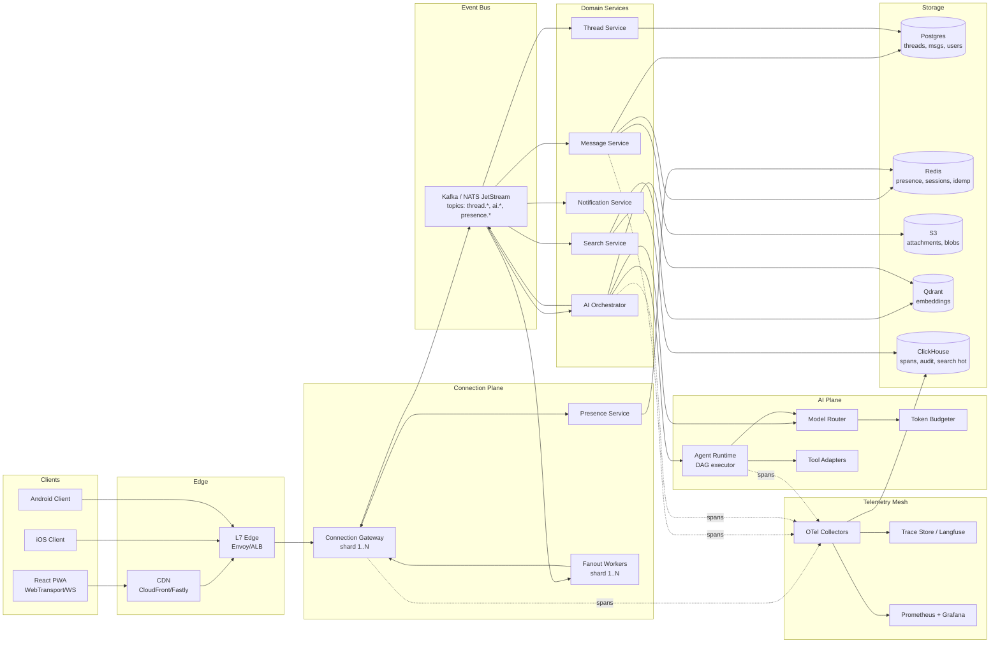
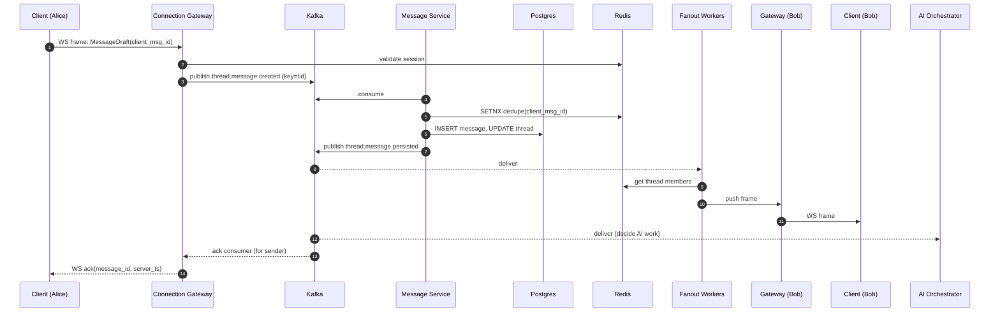
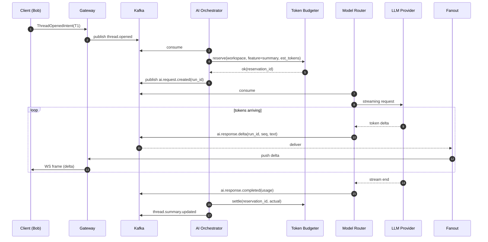
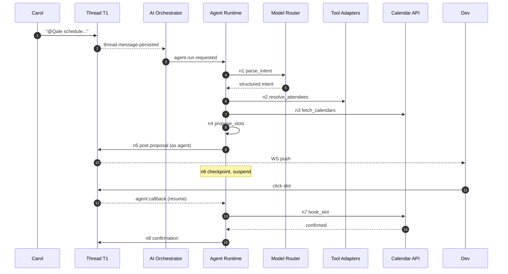

# 02 - End-to-End Architecture

> Audience: CTO / VP Eng of Turium AI.
> Goal: leave the room with the conviction that there is *one* coherent system in my head, that it is grounded in things I have actually shipped, and that I know where the seams are.

---

## 1. North star

Qale wins the moment a user stops thinking of "the AI" as a panel on the right-hand side and starts thinking of it as **another participant in the thread that happens to never sleep**. That single product belief drives every architectural choice in this document: AI requests are first-class events on the same bus as messages, AI responses stream back through the same fanout pipe as a human reply, and the *thread* (not the inbox, not the channel) is the canonical unit of state. When this is built right, the latency floor for "send → AI summary visible to all participants" is **<800 ms p95** for a 200-message thread, the system runs at **<$0.04 / DAU / month in inference cost** at 1M users (anchor A-BB4 - BlackBox model router consumed 1B+ tokens/month under cost discipline), and a single engineer can replay any incident - human or AI - deterministically from the telemetry mesh (anchor A-BB5 - 50M spans/day, 60% MTTR cut). That is the bar.

---

## 2. Component map



The diagram is a deliberate **eight-tier stack**: Client → Edge → Connection Plane → Event Bus → Domain Services → AI Plane → Storage → Telemetry. Every arrow that crosses a tier boundary is a network hop I will defend with a budget in `05-scaling-and-capacity.md`. Every box is independently deployable, independently observable, and - except for Postgres - horizontally scalable by partition key.

### 2.1 Tier responsibilities at a glance

| Tier | Owns | Stateless? | Scale knob |
| --- | --- | --- | --- |
| Client | Render, optimistic UI, IndexedDB cache, retry/backoff | n/a | code-split bundles |
| Edge (CDN + L7) | TLS terminate, geo-route, static assets, WAF | yes | provider-managed |
| Connection Gateway | WebSocket / WebTransport sessions, auth handshake, intent → bus | yes (sticky session via Redis) | gateway pods per shard |
| Event Bus | Durable ordering per partition, fanout substrate | n/a (Kafka cluster) | partitions per topic |
| Domain Services | Business logic, write-through to storage, derived events | yes | replicas per consumer group |
| AI Plane | Model selection, agent DAG execution, budget gating | mostly stateless; agent state in PG/Redis | worker pool per provider |
| Storage | Source of truth | n/a | shards per workspace_id range |
| Telemetry Mesh | Spans, metrics, deterministic replay | yes (collectors) | collector replicas; ClickHouse shards |

### 2.2 The opinionated cuts

Three cuts in this map are non-negotiable for me:

1. **The Connection Gateway never talks to Postgres.** It only talks to Redis (sessions) and the bus. If a gateway pod can be killed mid-request without losing a message, the whole system gets simpler. (Anchor A-MS1 - TunDRA: gateways were stateless in front of QUIC sessions for 1M+ Compute Instances.)
2. **The AI plane consumes from the bus, not from HTTP.** No domain service ever calls "POST /summarize" directly. The Message Service emits `thread.message.created`, the AI Orchestrator subscribes, decides whether work is needed, and emits `ai.request.created`. This is the single change that makes AI features cancellable, replayable, and budgetable.
3. **The fanout pipe is *not* the bus.** Kafka is the durable log; fanout is a thin Go process that reads a per-shard subset of topics and pushes JSON frames to gateways. Conflating the two is what kills latency at scale (anchor A-SC2 - RTB demanded sub-100ms, achieved by separating durable log from in-memory fanout).

---

## 3. End-to-end request flows

Three flows, three sequence diagrams. These are the flows the interviewer will probe; if I cannot draw them on a whiteboard, the rest of the pack is theatre.

### 3.1 Flow A - Sending a message in a thread

**Plain-English sequence:**

1. User Alice types in thread `T1`, presses Enter. Client constructs a `MessageDraft { client_msg_id: uuid7(), thread_id, body, attachments[] }`. The `client_msg_id` is the **idempotency key**.
2. Client optimistically renders the message in pending state, pushes onto the WebSocket frame queue.
3. Connection Gateway receives the frame, validates auth + workspace membership from cached session in Redis, attaches `user_id`, `workspace_id`, `connection_id`, `received_at_edge_ts`, and publishes onto `workspace.{wid}.thread.{tid}` topic, key = `tid` (preserves order per thread).
4. Message Service consumer reads the event, dedupes on `client_msg_id` against a 24h Redis SET, assigns a server-side `message_id` (snowflake-style, monotonic per shard), writes to Postgres in a single transaction (insert message + update `thread.last_message_at`), and emits `thread.message.persisted`.
5. Fanout Workers consume `thread.message.persisted`, look up thread members from a cached membership list (Redis, TTL 60s, invalidated on membership change), and push the message frame to all gateways holding sockets for those `user_id`s. Gateway pushes to client.
6. Notification Service consumes the same event, computes "who is offline / mentioned", and dispatches push / email / SMS via worker queues.
7. Search Service consumes the same event, indexes the body in ClickHouse (BM25 / inverted) and pushes an embed job onto `ai.requests.embed`.
8. AI Orchestrator consumes the same event and decides - based on thread heuristics + workspace settings - whether to enqueue a summary, a triage classification, or nothing.
9. Client receives `message.acked { client_msg_id, message_id, server_ts }`, swaps optimistic → confirmed.

**Sequence diagram:**



**Latency budget for Flow A** (target p95, single-region):

| Hop | Budget | Why |
| --- | --- | --- |
| Client → Edge | 30 ms | Indian mobile reality; CDN PoP in Mumbai |
| Edge → Gateway | 5 ms | same VPC |
| Gateway → Kafka produce ack | 8 ms | acks=1, idempotent producer |
| Kafka → Message Service | 10 ms | poll cycle, not flush-bound |
| Postgres write (single row) | 8 ms | with prepared statement, on-shard |
| Bus → Fanout | 10 ms | shared subscriber model |
| Fanout → recipient gateway | 5 ms | intra-VPC |
| Gateway → recipient client | 30 ms | symmetric |
| **End-to-end (Alice → Bob receive)** | **~110 ms** | Within "feels live" threshold |

This budget is anchored in **A-SC2** (RTB at sub-100ms required the same partitioning discipline) and **A-MS1** (TunDRA hit 50% transfer improvement by removing exactly these per-hop allocations).

### 3.2 Flow B - Receiving a streamed AI summary

**Plain-English sequence:**

1. Bob opens thread `T1` with 287 messages. Client emits a `ThreadOpenedIntent { thread_id, last_seen_message_id }`.
2. Gateway publishes `thread.opened` onto the bus.
3. AI Orchestrator consumes the event, evaluates: (a) is there a cached summary up-to-date through `last_message_id`? (Look in Redis under key `thread:{tid}:summary:{message_id}`.) If yes - emit `ai.response.summary` directly from cache. If no - proceed.
4. AI Orchestrator reserves a token budget from the **Token Budgeter** for `workspace_id` + `feature=summary`. If denied (workspace over budget), emit `ai.response.rejected { reason }` and return.
5. AI Orchestrator constructs a request: `{ context: chunked thread, target_model_class: 'fast-summary', stream: true, run_id }`. Publishes `ai.request.created`.
6. Model Router consumes, picks a model (e.g., Haiku-class for sub-1s TTFT, Sonnet-class if previous run quality < threshold), opens streaming connection to provider.
7. Router emits `ai.response.delta` events on `ai.responses.{run_id}` topic as tokens arrive (every ~25ms or every ~20 tokens, whichever first).
8. Fanout Workers (subscribed to `ai.responses.{run_id}` via a wildcard rule) push deltas to *all* clients viewing thread `T1`. Each delta carries `{ run_id, seq, delta_text, finish_reason | null }`.
9. On stream end, Router emits `ai.response.completed { run_id, total_tokens, model, cost_micros, latency_ms }`. Token Budgeter debits actuals.
10. AI Orchestrator persists summary to Postgres + Redis cache and emits `thread.summary.updated`. Search Service indexes the summary.

**Sequence diagram:**



**Why streaming through Kafka is acceptable** (anticipated pushback): the deltas carry small JSON payloads (~150–400 bytes per delta, ~40 deltas per typical summary). At 1M users with 5% active summary streams concurrent = 50K streams × 40 deltas × 300 bytes = **600 MB/s peak through the bus**, which is well within Kafka's per-broker capacity (modern brokers do GB/s). The win - single fanout substrate, free multi-viewer broadcast, replayable - outweighs the cost. The cost case is in `05-scaling-and-capacity.md`.

### 3.3 Flow C - Agent action triggered by a thread ("schedule a meeting")

This is the flow that justifies calling Qale "AI-native" rather than "messaging with AI features bolted on."

**Plain-English sequence:**

1. User Carol types in thread `T1`: "@Qale schedule a 30-min sync with @Dev next week".
2. Standard Flow A persists the message. AI Orchestrator detects the `@Qale` mention as an **explicit agent trigger**.
3. AI Orchestrator publishes `agent.run.requested { thread_id, trigger_message_id, intent_hint: 'schedule_meeting', invoker: carol_id }`.
4. Agent Runtime consumes the event, instantiates a **DAG run** from the `schedule_meeting` workflow definition (anchor A-BB2/A-BB3 - DAG executor with checkpointing and retry semantics, supporting 10K+ runs/day at BlackBox).
5. DAG nodes execute in order:
   - `n1: parse_intent` - LLM call via Router → structured `{ attendees, duration, window }`.
   - `n2: resolve_attendees` - Tool call to Workspace Directory.
   - `n3: fetch_calendars` - Tool call to Google/Microsoft Graph (per-user OAuth tokens stored encrypted).
   - `n4: propose_slots` - pure compute, no LLM.
   - `n5: post_proposal` - emits a structured message into thread `T1` via the same Message Service path (Flow A) with `author_type=agent`. Carol and Dev see proposed slots inline.
   - `n6: await_user_choice` - DAG **checkpoints** here. The run state is persisted to Postgres. The DAG is now suspended.
6. When Dev clicks a slot, client emits `agent.callback { run_id, node_id: n6, payload: { slot_id } }`. Bus delivers, Agent Runtime resumes the DAG from checkpoint.
7. `n7: book_slot` - Tool call to calendar APIs. On success, `n8: post_confirmation` posts a confirmation message into the thread.
8. On any node failure, retry with exponential backoff per node policy. After exhaustion, `n_fail: post_apology` posts an honest "I couldn't book this; here's what failed."
9. Every node emits OpenTelemetry spans into the telemetry mesh, parented under `agent.run.{run_id}` (anchor A-BB5 - same pattern that cut MTTR by 60%).

**Sequence diagram:**



The critical property here: **the agent's "thinking" is visible in the thread the same way a human's is.** Proposal, choice, confirmation - all are messages in `T1`. The user never context-switches into an "AI panel." That is the product thesis embodied in the architecture.

---

## 4. Why this shape - anchored to prior experience

I am not designing this from a textbook. Each major shape below maps to a system I shipped or co-shipped.

### 4.1 Connection plane ← TunDRA (A-MS1)

At Microsoft I co-developed **TunDRA**, a QUIC-based protocol in Rust that fronted **1M+ Compute Instances** with a **50% improvement in secure data transfer**. The lesson that ports directly: the gateway must be a **stateless multiplexer** with all state living in (a) the connection itself and (b) a fast session store. We did not store per-instance state in the gateway. Every reconnect started clean and re-attached via a session token. Qale's Connection Gateway is the same shape, with WebSocket as the v1 transport and WebTransport/QUIC as the v2 evolution (Section 5.5 below).

### 4.2 AI plane ← BlackBox model router (A-BB4)

At BlackBox I led the **model router** across Claude, GPT, and Grok with **capability-aware routing** and **context optimization**, sustaining **1B+ tokens/month**. The key architectural lesson: the router is a *capability matcher*, not a load balancer. Each request carries a *capability profile* (max latency, min context, tools needed, cost ceiling, safety class), and the router picks the cheapest model that matches. Qale's AI plane has the same router with the same profile schema (Section 7).

### 4.3 Telemetry mesh ← BlackBox LLMOps (A-BB5)

At BlackBox I institutionalized a telemetry mesh ingesting **50M spans/day**, managing **2.5TB/month** of trace data, enabling **deterministic replay** and cutting org-wide MTTR for AI anomalies by **60%**. Qale needs the same thing on day one. Every domain event, every AI run, every agent node carries an OpenTelemetry trace context. ClickHouse stores spans (anchor A-BB5 used the same engine). Langfuse-style UI on top. Without this, debugging "why did the AI summary say X" becomes archaeology - and Qale will need to debug exactly that, daily.

### 4.4 Bus + fanout ← ShareChat real-time + Pub/Sub (A-SC1, A-SC2, A-SC3)

At ShareChat I built ad-infra serving **40M DAU** with **sub-100ms RTB**, on **Pub/Sub + Redis + Kubernetes + OpenTelemetry**. The shape that ports: a **durable log** for ordering and replay, a **separate fanout layer** for hot delivery, and a **Redis hot-path** for membership/segmentation lookups. The Qale design is structurally the same, just with Kafka instead of Pub/Sub for finer partition control and tighter latency floors.

### 4.5 The non-anchored bits, called out honestly

- **WebTransport / HTTP/3 in browser** is still maturing. I am proposing it as v2 (Section 5.5). v1 is plain WSS, which is what I would defend in front of investors.
- **Qdrant for vectors** is a choice based on the BlackBox stack (A-BB4 anchor mentions vector DB use). pgvector is a credible v1 alternative if we want to defer one piece of infra.

---

## 5. Connection plane deep-dive

The connection plane is the single biggest technical risk in the system. Get it wrong and the rest does not matter, because the user just sees a spinner. Get it right and the rest is deliverable engineering.

### 5.1 Sizing model

| Variable | v1 (Public Launch) | v2 (1M users) |
| --- | --- | --- |
| MAU | 250K | 1M+ |
| DAU | 60K | 200K |
| Peak concurrent WS | 35K | 150K |
| Sockets per gateway pod | 25K | 25K |
| Gateway pods (incl. headroom) | 3–4 | 12–15 |
| Pod size | 4 vCPU, 8 GB | 8 vCPU, 16 GB |
| Inbound msgs/sec (peak) | 1.5K | 8K |
| Outbound frames/sec (fanout multiplier 4×) | 6K | 32K |

Sizing assumes a Go-based gateway with `gorilla/websocket` or `nhooyr.io/websocket`, one goroutine per connection for read and one for write (so ~50K goroutines per pod, well within Go runtime comfort). I have run Go services at this goroutine density at ShareChat and the failure modes are predictable (GC pauses, not crashes).

### 5.2 Sticky-by-userId routing

Every WebSocket connection is routed to a gateway pod via **consistent hashing on `user_id`**. The L7 edge holds the hash ring; gateway pods register their range on startup via the service registry (etcd or K8s endpoints + a small controller).

Why sticky-by-userId rather than random:

- A user often holds 1–3 concurrent sockets (web + mobile + tablet). Co-locating them on one gateway lets us deduplicate fanout: one frame, one pod, multiple writes - instead of one frame, three pods, three reads from the bus.
- Reconnection after a transient network failure lands on the same pod 95% of the time, so resume tokens are local Redis lookups (sub-1ms) instead of cross-pod cache misses.

When a pod is added or removed, the ring rebalances. We accept that some users get bumped during a deploy; the resume-token protocol (Section 5.4) makes the bump invisible at the application layer.

### 5.3 Sharded fanout

Fanout is a **separate worker pool**, not a feature of the gateway. Each fanout shard subscribes to a subset of topic partitions (`workspace.{wid_range}.thread.*`, `ai.responses.*`). When a fanout worker decides to deliver a frame to user `U`, it looks up `U`'s gateway pod from the ring and pushes via an internal HTTP/2 stream (or gRPC) to that pod. The pod writes to the WebSocket.

Why HTTP/2 between fanout and gateway rather than another Kafka topic per pod:

- HTTP/2 multiplexing gives us 1–2ms intra-VPC latency vs 5–10ms for an extra Kafka hop.
- Backpressure is per-stream and surfaces immediately; Kafka would mask it with consumer lag.
- The connection is long-lived, so connection-establishment cost is amortized.

The tradeoff is that fanout → gateway delivery is at-most-once if the gateway dies mid-write, but the client's sequence-number protocol (Section 5.4) detects the gap and refetches.

### 5.4 Reconnect and resume

Every WebSocket session carries a `session_token` (issued on connect) and a `last_server_seq` (incremented per inbound frame from server). On reconnect:

1. Client opens a new WS to the edge with `Sec-WebSocket-Protocol: qale-v1, resume:{session_token}:{last_server_seq}`.
2. Edge routes to the right gateway via consistent hash.
3. Gateway looks up the session in Redis. If found and within the 5-minute resume window, it replays any frames in the per-session ring buffer (Redis Stream, capped at 1000 entries) with `seq > last_server_seq`. Then transitions the socket into normal operation.
4. If the session is expired or the gap exceeds the buffer, gateway responds with `RESUME_FAILED { reason: 'gap' | 'expired' }` and the client falls back to a full state hydration via REST (`GET /threads?since=...`).

This is the same shape as TunDRA's session resumption in QUIC (anchor A-MS1) - re-attach by token, replay from a bounded buffer, fall back to full sync if the gap is too large.

### 5.5 Why WebTransport/QUIC is the 18-month evolution, not the v1

WebTransport over HTTP/3 buys us:

- **0-RTT reconnects** on warm sessions - critical for mobile networks switching between WiFi and 4G.
- **Per-stream backpressure** - we can prioritize a small AI delta stream over a large attachment upload on the same connection.
- **No head-of-line blocking** - TCP HoL blocking on a flaky connection currently causes "lag spikes" that are very hard to diagnose.
- Direct anchor to TunDRA (A-MS1) where we measured **50% improvement in secure data transfer** moving to QUIC.

Why I would not ship it in v1:

- Browser support is real but uneven; we need a WS fallback path anyway.
- Operational tooling (load balancers, observability, debug tools) is meaningfully less mature for HTTP/3 than for WSS in 2026.
- The team will need to learn it. Pre-Public-Launch is the wrong time to teach a new transport.

The plan is: WSS in v1, WebTransport behind a feature flag in v1.5, default WebTransport with WSS fallback in v2 (post-Public-Launch).

### 5.6 Presence

Presence has two modes:

| Signal | Storage | TTL | Update path |
| --- | --- | --- | --- |
| Coarse "online / away / offline" | Redis sorted set per workspace, score = last-heartbeat-ts | 90s | Heartbeat from gateway every 30s |
| Per-thread typing indicator | Pub/sub channel `presence.thread.{tid}.typing` | ephemeral (no persistence) | Client emits debounced (300ms), gateway forwards |

Presence is **deliberately not on Kafka.** It is high-volume, low-value-per-message ephemeral data. Putting it on the durable log would 5× the bus load for no benefit. Redis pub/sub plus a sorted set handles it at the scale we care about, and degrades gracefully (a presence outage shows users as "offline" but does not block messaging).

---

## 6. Event bus topology

### 6.1 Topic naming and partition strategy

| Topic | Key | Partition count (v1 → v2) | Retention | Notes |
| --- | --- | --- | --- | --- |
| `workspace.{wid_band}.thread.created` | `wid` | 32 → 128 | 7d | Wid bands shard by hashed workspace_id mod 16 |
| `workspace.{wid_band}.thread.message` | `tid` | 64 → 256 | 7d | Per-thread ordering preserved |
| `workspace.{wid_band}.thread.message.persisted` | `tid` | 64 → 256 | 7d | Downstream-facing, post-dedupe |
| `presence.changes` | `uid` | 16 → 64 | 1h | Short retention, presence is ephemeral truth |
| `ai.requests` | `run_id` | 32 → 128 | 24h | Replayable for debugging |
| `ai.responses.{run_id}` | n/a (auto-created) | 1 per run | 1h | Per-run topic, GC after completion |
| `ai.budget.audit` | `wid` | 8 → 32 | 30d | Long retention for billing |
| `agent.run.events` | `run_id` | 32 → 128 | 30d | Long retention for compliance |
| `notifications.outbound` | `uid` | 16 → 64 | 24h | Worker queue for push/email |
| `search.index` | `tid` | 16 → 64 | 24h | Async search indexing |
| `dlq.{topic}` | original key | mirror of source | 14d | Dead letters per topic |

**Key decisions:**

- **Partition by `workspace_id` at the top level, then by `thread_id` within.** This keeps a single workspace's ordering coherent (important for audit log generation) while letting one hot workspace use up to N partitions of its band rather than one global partition.
- **Per-run topics for AI streaming responses.** This is the unusual choice. Each AI run gets a short-lived topic. Pros: trivial to subscribe a fanout shard to "all viewers of this run"; trivial to GC; no global ordering to worry about. Cons: topic-create churn. We mitigate with topic auto-creation enabled and a janitor process that deletes topics older than the retention window. (NATS JetStream handles this pattern more naturally than Kafka; we benchmark both in `09-tradeoffs-and-alternatives.md`.)
- **Retention is short.** Kafka is for ordering and short-window replay, not for archival. Long-term storage is Postgres + S3.

### 6.2 Dead-letter strategy

Every consumer wraps message handling in this contract:

```
on(message):
    try:
        process(message)
        commit(message.offset)
    except RetryableError as e:
        if message.attempt < max_attempts:
            republish_with_delay(message, attempt+1, backoff)
        else:
            send_to_dlq(message, reason=str(e))
    except FatalError as e:
        send_to_dlq(message, reason=str(e))
```

DLQ topics mirror their source topic name. A small DLQ inspector service exposes a UI for SREs (during on-call) to triage dead letters: replay, drop, or mutate-and-replay. **Replaying from DLQ must be auditable** - every replay generates a span in the telemetry mesh tagged `dlq.replay`.

### 6.3 Producer and consumer contracts

| Property | Choice | Rationale |
| --- | --- | --- |
| Producer acks | `acks=1` for thread events; `acks=all` for `ai.budget.audit` | Latency vs durability tradeoff per topic class |
| Producer idempotence | enabled | Prevents duplicate on retry |
| Compression | `lz4` | Best CPU/ratio for JSON payloads |
| Consumer offset commit | manual, after side-effect persisted | At-least-once semantics |
| Schema | JSON Schema in v1, Avro/Protobuf in v2 | Defer the schema-registry investment until cross-team count justifies it |

### 6.4 What I would refuse to put on the bus

- **Authentication challenges.** Auth is request/response; bus is fire-and-forget. Don't conflate.
- **Synchronous read-after-write.** Reads always go through the domain service's read API, which reads from Postgres directly. The bus is for derived/observed state, not source-of-truth reads.
- **Large blobs.** Attachments go to S3 directly via presigned URLs. The bus carries only the metadata + S3 reference.

---

## 7. AI plane

This is the section I spend the most words on, because (a) it is the part the founders are most uncertain about how to build, and (b) it is where my BlackBox anchors are deepest.

### 7.1 Model router

The router is a stateless service consuming `ai.requests` and emitting `ai.responses.*`. Its only job: pick the right model for the request.

**Capability profile (request-side):**

```json
{
  "request_id": "...",
  "feature": "summary | draft | triage | embed | rewrite | agent_step",
  "max_latency_ms": 2000,
  "min_context_tokens": 8000,
  "max_cost_micros": 5000,
  "tools_required": ["calendar_book", "directory_lookup"],
  "safety_class": "default | sensitive | regulated",
  "stream": true,
  "fallback_chain": ["primary", "secondary", "tertiary"]
}
```

**Capability profile (model-side):**

```json
{
  "model_id": "anthropic.claude-haiku-3.7",
  "provider": "anthropic",
  "max_context_tokens": 200000,
  "p50_latency_ms_per_token": 8,
  "cost_micros_per_input_token": 1,
  "cost_micros_per_output_token": 5,
  "supports_tools": true,
  "supports_streaming": true,
  "safety_class": "default | sensitive",
  "rate_limit_rpm": 5000,
  "rate_limit_tpm": 800000
}
```

The router does a constraint-satisfaction match: filter models that satisfy `min_context`, `tools_required`, `safety_class`; rank by `(p50_latency_for_request × latency_weight) + (estimated_cost × cost_weight)`; pick the top one with rate budget remaining; fall back to next on 429 or 5xx. This is the **same algorithm** I shipped at BlackBox (anchor A-BB4). It generalized across Claude, GPT, and Grok there; it will generalize across whatever providers Qale adds.

### 7.2 Agent runtime - DAG executor

Anchored on A-BB2 and A-BB3 (DAG execution, checkpointing, retry, resumable agents - supporting 10K+ runs/day at BlackBox).

Each agent workflow is a **DAG defined in code** (TypeScript or Python - assumption: Qale picks one; I'd lean TypeScript for symmetry with the frontend stack):

```ts
const scheduleMeeting = defineWorkflow('schedule_meeting', {
  nodes: {
    parse_intent:      { kind: 'llm',   input: ['trigger_message'], output: 'IntentSchema' },
    resolve_attendees: { kind: 'tool',  tool: 'directory_lookup',  retries: 3 },
    fetch_calendars:   { kind: 'tool',  tool: 'calendar_read',     retries: 3 },
    propose_slots:     { kind: 'pure',  fn: proposeSlotsFn },
    post_proposal:     { kind: 'tool',  tool: 'thread_post',       output: 'message_id' },
    await_choice:      { kind: 'wait',  on: 'agent.callback',      timeout: '7d' },
    book_slot:         { kind: 'tool',  tool: 'calendar_book',     retries: 5 },
    post_confirm:      { kind: 'tool',  tool: 'thread_post' },
  },
  edges: [
    ['parse_intent', 'resolve_attendees'],
    ['resolve_attendees', 'fetch_calendars'],
    ['fetch_calendars', 'propose_slots'],
    ['propose_slots', 'post_proposal'],
    ['post_proposal', 'await_choice'],
    ['await_choice', 'book_slot'],
    ['book_slot', 'post_confirm'],
  ],
  on_failure: { kind: 'tool', tool: 'thread_post', node_id: 'post_apology' },
})
```

**Runtime invariants** (all directly anchored to A-BB3):

- Each node executes idempotently. Re-execution after crash produces the same effect.
- After each node completes, the run state is checkpointed to Postgres (`agent_runs` table, `state JSONB`).
- A `wait` node serializes the run to durable storage and de-allocates the worker. When the awaited event arrives, a scheduler claims the run and resumes from the checkpoint.
- Retries are per-node with exponential backoff; node-level deadlines roll up to a run-level deadline.
- All node executions emit OpenTelemetry spans parented under `agent.run.{run_id}`; the trace-tree-per-run is the same model I shipped at BlackBox (A-BB5).

### 7.3 Token budgeter

Per-workspace, per-feature, per-time-window budgets enforced **before** the request reaches a provider. Stored in Redis as token buckets:

```
key: budget:{workspace_id}:{feature}:{minute_bucket}
value: { reserved: int, consumed: int, limit: int }
```

API: `reserve(workspace, feature, est_tokens) -> reservation_id | DENIED`, `settle(reservation_id, actual_tokens)`. Reservations expire after 60s if not settled (orphan cleanup).

Budgets are configured per workspace plan (Free / Pro / Enterprise) and per feature (summary, draft, agent). Free-tier workspaces hit a wall; Enterprise-tier workspaces hit soft warnings then negotiated overage. This is the **direct lesson** from the BlackBox 1B+ tokens/month context (A-BB4): cost is a product feature, not an ops afterthought. Without enforcement at this layer, a single runaway customer can move the company's monthly margin by 5%.

### 7.4 Streaming back to the client

Already covered in Flow B (Section 3.2). The thing worth re-stating: the AI response stream and the human message stream **share the same WebSocket and the same fanout substrate**. The client distinguishes by message type (`type: 'ai.delta' | 'message'`), but the transport layer does not care. This is what makes the AI feel like "another participant in the thread" rather than "a different system speaking through a side channel."

### 7.5 Retrieval (RAG) - brief, full version in 13-data-model

For each workspace, embeddings are stored in Qdrant under a per-workspace collection (or per-workspace vector namespace, depending on collection-count limits). On retrieval-augmented requests, the AI Orchestrator runs:

1. `query → embedding (cached if seen)`
2. `Qdrant ANN search → top K`
3. `BM25 reranker on retrieved candidates → top M` (anchor A-BB4 - bm25 + cross-encoder pattern from BlackBox)
4. `Cross-encoder rerank → top N` (only for high-stakes features, not for autocomplete)
5. `Pack into context with citation tokens`

The cross-encoder/BM25 hybrid is anchor A-BB4. The choice to keep step 4 optional is a cost discipline: cross-encoders are expensive; we only run them for features where wrong retrieval is visibly broken (e.g., search, agent grounding), not for ambient features (e.g., compose suggestions).

### 7.6 Safety and guardrails

- Every LLM input passes through a lightweight prompt-injection classifier before reaching the provider (anchor A-BB4 - guardrails were part of the BlackBox stack).
- Every LLM output passes through a redaction classifier for PII / secrets before being persisted or fanned out.
- Workspace-level controls: "this workspace's content is not used for training" (default on, contractually enforced via provider terms), "this workspace requires no-data-retention providers only" (Enterprise toggle, restricts router model pool).

---

## 8. Storage topology

A brief here; the full schemas, partition keys, and migration path live in `13-data-model-and-storage.md`.

| Store | Owns | Hot / Warm / Cold | Partition strategy |
| --- | --- | --- | --- |
| **Postgres (primary)** | Workspaces, users, threads, messages, memberships, agent runs, summaries | Hot: last 30d of messages; warm: 30d–6mo via partition; cold: archived to S3 + Iceberg | Logical: 1 DB per region; physical: `messages` partitioned by `thread_id` hash + monthly time | 
| **Redis** | Sessions, presence, idempotency dedupe keys, hot membership cache, token-budget buckets, per-session ring buffers | Hot only; nothing persists beyond TTL | Cluster mode, hash tag = `{workspace_id}` so a workspace's keys co-locate |
| **S3** | Attachments, exported workspace archives, cold message tier | Hot: <90d in standard; warm: 90d–1y in IA; cold: >1y in Glacier | Per-workspace prefixes |
| **Qdrant** | Message and document embeddings | Hot only (embeddings re-derivable from source) | Per-workspace collection or namespace |
| **ClickHouse** | OTel spans, search index (BM25), audit log, per-thread analytics | Hot: 7d for spans, 90d for audit, 30d for search; cold: spans aged out | Sharded by `workspace_id`; ordered by `(workspace_id, ts)` |

**The single most important storage decision**: messages live in Postgres, not in a NoSQL-first design. A messaging product is a transactional CRUD product on top of a fanout pipe. Postgres gives us strong consistency, foreign keys, mature ops tooling, and a clear sharding story. The temptation to start with Cassandra or DynamoDB ("infinitely scalable!") is a trap that adds operational cost we cannot afford pre-Public-Launch. The Postgres-with-sharding plan is anchored to the AutoML platform at Microsoft (A-MS3) which served 15M+ jobs/month with a similar Postgres-at-the-core topology.

**Hot/warm/cold tiering** at 1M-user scale:

| Tier | Window | Storage | Read latency target |
| --- | --- | --- | --- |
| Hot | 0–30 days | Postgres primary partition | <20ms p95 |
| Warm | 30–180 days | Postgres archive partition (different tablespace) | <100ms p95 |
| Cold | 180+ days | S3 + Iceberg, queried via DuckDB or Trino | <2s p95 (rare) |

Tiering happens via a daily archival job. Cold reads hit a separate "archive read" code path in the Message Service - the API surface stays uniform, but the latency budget is different.

---

## 9. Cross-cutting concerns

### 9.1 Auth

- **End-user auth**: OAuth/OIDC (Google, Microsoft, SSO via SAML for Enterprise). JWT access tokens, opaque refresh tokens stored in `httpOnly` cookies. Session lifetime: access 15 min, refresh 30 days, revocable per-device.
- **WebSocket auth**: bearer token in `Sec-WebSocket-Protocol` subprotocol header (the only browser-friendly way to send a header on WS upgrade). Validated on connect, then session is cached in Redis for subsequent frames.
- **Service-to-service auth**: mTLS within the cluster via a service mesh (Linkerd or Istio); SPIFFE identities. No service trusts a JWT for cross-service calls.
- **Workspace boundary**: every authenticated request is scoped to a `workspace_id`. The middleware that resolves `workspace_id` is the single most-tested piece of code in the system. (Anchor A-BB1 - SOC-2 compliance work demanded exactly this discipline.)

### 9.2 Rate limiting

Three tiers, all enforced at the gateway and re-enforced at the domain service:

| Tier | Scope | Limit (default) | Storage |
| --- | --- | --- | --- |
| Per-IP | Edge | 200 req/min | CDN / WAF rules |
| Per-user | Gateway | 60 messages/min | Redis token bucket |
| Per-workspace per feature | AI plane | configured per plan | Token budgeter (Section 7.3) |

Rate limit responses always carry `Retry-After` headers and a structured error code so the client can backoff intelligently rather than retry-storm.

### 9.3 Feature flags

Every new surface lands behind a flag. We use a simple flag service (LaunchDarkly or in-house) keyed by `(workspace_id, user_id, flag_name)`. This is non-negotiable for an AI product where we will be shipping experimental features weekly. Anchor A-MS3 - AutoML evolution at Microsoft used flag-gated rollouts for every change touching the public SDK.

### 9.4 Multi-region

**v1 (Public Launch): single region, multi-AZ.** Pick the region nearest the largest user cohort (likely AP-South-1 / Mumbai given the Hyderabad team and likely India launch). Multi-AZ Postgres, multi-AZ Kafka, multi-AZ Redis. RTO/RPO targets in `06-reliability-and-incidents.md`.

**v2 (1M+ users): multi-region, with a primary write region per workspace.** A workspace is "homed" in a region; all writes for that workspace go there. Reads can be served from the nearest region via a read-replica cache, but we accept that a read may be up to 5s stale on the far side of the world. Cross-region replication via Kafka MirrorMaker for derived events; Postgres logical replication for the source of truth.

Why workspace-homed rather than active-active multi-master: the alternative requires CRDT-like semantics across all message ordering, which is **possible but adds two engineer-quarters of complexity for marginal gain.** Most workspaces have geographically clustered users; the small number that span regions accept slightly higher cross-region latency. This is the same tradeoff Slack made successfully and Discord made differently - both are defensible. I would defend workspace-homed in front of the founders.

### 9.5 Multi-tenant isolation

- Hard tenant boundary at the data layer: every query carries `workspace_id` and the framework rejects un-scoped queries via static analysis (lint rule + DB schema policy).
- Per-tenant rate limits, token budgets, and storage quotas (anchor A-BB1 - SOC-2 isolation discipline).
- Per-tenant encryption keys (envelope encryption, KMS-managed) for sensitive features (Enterprise tier). The data plane stores envelope-encrypted blobs; only the customer's key envelope is regional.

---

## 10. What I would defer past Public Launch

These are conscious omissions. Any of them is a credible feature. None of them belongs in v1.

| Deferred item | Why it's deferred | When to reconsider |
| --- | --- | --- |
| **Federation** (cross-org workspaces, à la Matrix or email) | Adds a routing and trust dimension that doubles the security surface. Customer pull at <100K users is anecdotal. | When 3+ paying Enterprise customers ask in writing. |
| **Custom transport / proprietary protocol** | WebSocket+JSON is fine through 1M users. WebTransport is the next step (Section 5.5). A custom protocol is several engineer-years for sub-15% latency wins. | When telemetry shows transport is the dominant latency contributor and we have an SRE-mature org. |
| **Self-hosted LLMs for core features** | Hosted providers via the model router (A-BB4) are cheaper per token at our volume *and* offload safety/quality work. Self-hosting only wins below ~50¢/M tokens at sustained 100B+ tokens/month. | When unit economics break - measured monthly via the budgeter's ledger. |
| **Offline-first sync engine** (CRDT-style local DB) | A correctly-built optimistic UI + IndexedDB cache + reconnect protocol gets us 95% of the perceived offline value at 10% of the engineering cost. | When a top-3 customer asks for explicit offline editing of long threads. |
| **Native voice/video stack** | WebRTC via OpenTok or LiveKit gets us launch-quality calls (anchor A-HL1 - I have shipped this). Building it ourselves is a Twilio-shaped distraction. | Not before $10M ARR. |
| **On-prem deployment** | Possible but doubles every release pipeline and observability surface. | Only for $1M+ ACV deals, with a separate ops team. |
| **Native SDKs for integrations marketplace** | Webhooks + OAuth-scoped APIs cover 80% of integration use cases. A formal SDK + extension store is a Public-Launch+12-month item. | When 5+ partners ask for richer extensibility. |
| **A model fine-tuning pipeline** | We can prompt-engineer and RAG our way to most quality wins. Fine-tuning is justified when we have a workload-specific quality gap that survives all other interventions. (I have shipped fine-tuning at Microsoft - A-MS founding-team note - so I know what it takes; it is not a v1 lift.) | When telemetry shows a specific feature has a measurable quality gap not closeable by retrieval. |

The discipline behind this list: **every deferred item is one fewer thing the Hyderabad team is building in parallel during the months that matter most.** Pre-Public-Launch is not the time to be clever; it is the time to ship the boring 80% with high quality and instrument everything so that the next 20% is informed rather than guessed.

---

## 11. Closing one-liner for the interview

> "The shape is: stateless gateways → durable bus → stateless services → AI plane on the same bus → telemetry mesh seeing every span. Each of those four lines maps to something I shipped - TunDRA, ShareChat real-time, BlackBox model router, BlackBox telemetry. The risk is execution velocity, not architectural unknowns. That is a problem I can solve with the right six engineers in Hyderabad."

The next document (`03-real-time-and-messaging.md`) zooms into the connection plane and the message delivery semantics. The one after (`04-ai-plane-and-agents.md`) does the same for the AI plane.
