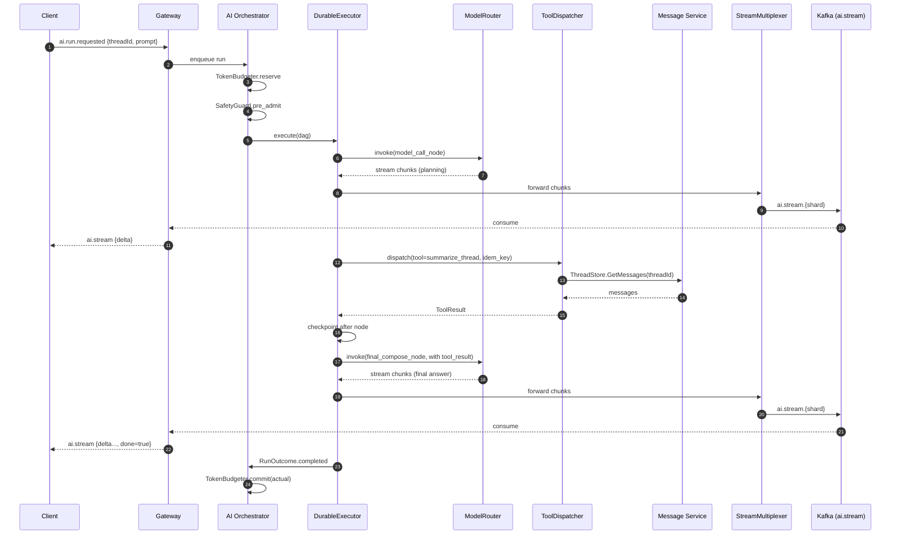

# 04 - Low-Level Design

This file is the per-service, per-module breakdown of how I would actually build Qale. The executive summary (`01`) and architecture (`02`) describe the topology; this file is what each box contains, which interfaces it exposes, and how the bytes move on the inside.

I am opinionated here. If a choice is a Qale-specific guess (because Turium AI hasn't made the call yet), it is marked **assumption**. Every claim about my own work is anchored to a code from `00-question-and-context.md`.

---

## 1. Service inventory

The system is decomposed into six first-class services on the message + AI plane, plus three platform services (auth, billing, admin) that are out of scope for this document. The decomposition is deliberately small - six services that any 6-engineer pod can hold in their head, not twenty.

| Service | Language | Primary store | Scale unit | Owner pod | Why this language |
| --- | --- | --- | --- | --- | --- |
| Connection Gateway | Go | Redis (session, fanout cursors) | Pod count, sticky-by-userId | Real-Time Plane | Goroutines + bounded channels are the cleanest model for 50–100K concurrent sockets per pod (anchor A-MS1: TunDRA QUIC at 1M+ instances). |
| Message Service | Go | Postgres (writes), Kafka (outbox) | Per-shard horizontal | Real-Time Plane | Same reason; also keeps the hot send path single-language with the gateway. |
| Thread Service | Go | Postgres | Per-shard horizontal | Real-Time Plane | Tight coupling to Message Service over an internal gRPC API; Go keeps the call graph simple. |
| Presence Service | Go | Redis (sorted sets), Kafka | Stateless workers, Redis-bound | Real-Time Plane | Presence is a cache-bound problem; Go's goroutine model fits the per-user heartbeat aggregation. |
| Notification Service | Go | Postgres + Redis | Stateless workers | Real-Time Plane | Reuses Kafka consumer ergonomics. |
| AI Orchestrator | Python (3.12, FastAPI + asyncio) | Postgres (run state), Redis (streaming buffers), Qdrant (vectors) | DAG-runner workers + per-run shard | AI Plane | LangGraph / LangChain ecosystem and HuggingFace tokenizers live in Python; matches BlackBox stack (anchor A-BB2). I wouldn't fight that for ideology. |
| **Frontend (PWA)** | TypeScript (React 19) | IndexedDB | CDN-edge cache + per-user state | Frontend & Growth | The JD asks for high-performance React; sticking with TS keeps the gateway's wire types shareable via codegen. |

**Refusal note:** I would *not* split Message and Thread into separate teams in Year 1. They are co-deployed by the same pod with a shared Postgres logical schema. Premature service splits are the second most common way young infra teams die (the first is custom DBs). Anchor: ClipboardHealth migration where over-decomposition was the regression I had to undo (A-IND1).

---

## 2. Module breakdown per service

Each service is a small set of internal packages. I list the package, the central type/interface in it, and the one-line responsibility. The naming convention is `<verb>er` for active components and `<noun>Store` / `<noun>Registry` for state holders - Go idiom, deliberately repeated in Python for cross-language symmetry.

### 2.1 Connection Gateway (Go)

| Package | Central type | Responsibility |
| --- | --- | --- |
| `gateway/transport` | `WSServer`, `WTServer` | Accepts WebSocket and (later) WebTransport handshakes; TLS termination at the edge proxy, mTLS to internal services. |
| `gateway/auth` | `AuthBroker` | Validates JWT / session cookie against Auth Service; caches claim sets for socket lifetime. |
| `gateway/session` | `SessionManager` | Owns per-connection state: userId, workspaceIds, deviceId, resume token, last-acked event seq. |
| `gateway/registry` | `ConnectionRegistry` | In-process map of `connId → SessionManager`; exposes lookup-by-userId via a sharded `sync.Map`. |
| `gateway/codec` | `FrameCodec` | Frames intent / event JSON (or CBOR for binary builds - **assumption**); enforces 1 MiB max frame. |
| `gateway/sub` | `SubscriptionTable` | Per-connection set of (workspaceId, threadId, channelId) topics; drives fanout filtering. |
| `gateway/fanout` | `FanoutSubscriber` | Single Kafka consumer per pod for the workspace shard; routes events into per-connection channels. |
| `gateway/backpressure` | `BackpressureController` | Per-connection bounded send queue; drops or coalesces typing/presence events under pressure, never drops messages. |
| `gateway/metrics` | `MetricsEmitter` | OTel spans + Prometheus gauges (active conns, send queue depth, fanout lag). Anchor A-BB5 (50M spans/day). |
| `gateway/health` | `HealthProbe` | k8s readiness/liveness; explicitly fails ready when fanout lag > N seconds. |

### 2.2 Message Service (Go)

| Package | Central type | Responsibility |
| --- | --- | --- |
| `msg/api` | `SendHandler`, `EditHandler`, `DeleteHandler` | gRPC + internal HTTP intake; called by gateway over a request/response Kafka channel or directly by gRPC for low-latency paths. |
| `msg/idempotency` | `IdempotencyCache` | Redis-backed `(userId, clientMsgId) → messageId` lookup for at-least-once → exactly-once collapse. |
| `msg/store` | `ThreadStore`, `MessageStore` | Postgres reads/writes via `pgx`; explicitly *not* an ORM on the hot path. |
| `msg/attach` | `AttachmentLinker` | Resolves S3 presigned uploads, links blob keys to message rows. |
| `msg/outbox` | `OutboxRelay` | Transactional outbox: writes message + outbox row in one Postgres tx, relays to Kafka via CDC tail. |
| `msg/fanout` | `FanoutPublisher` | Publishes derived events (`message.created`, `message.edited`, `read.advanced`) to the workspace-shard topic. |
| `msg/edit` | `EditTombstoneManager` | Manages soft-delete tombstones and edit history; enforces edit-window policy. |
| `msg/dedup` | `Deduper` | Catches dual-submit cases the idempotency cache misses (e.g., resume after partial ack). |

### 2.3 Thread Service (Go)

| Package | Central type | Responsibility |
| --- | --- | --- |
| `thread/api` | `ThreadHandler` | CRUD for threads, channel membership, archive, mute. |
| `thread/perm` | `PermissionResolver` | Workspace + role + channel ACL resolution, cached per request. |
| `thread/index` | `ThreadIndexer` | Maintains a per-user "inbox" view as denormalized rows for sub-50ms thread list reads. |
| `thread/membership` | `MembershipStore` | Tracks who is in which thread; emits `thread.joined` / `thread.left` events. |
| `thread/search` | `SearchProjector` | Subscribes to `message.created`, projects into OpenSearch via outbox + reconciler. |

### 2.4 Presence Service (Go)

| Package | Central type | Responsibility |
| --- | --- | --- |
| `pres/heartbeat` | `HeartbeatIngestor` | Consumes `presence.heartbeat` from Kafka (sourced by gateway every 15s per active connection). |
| `pres/state` | `PresenceStore` | Redis sorted set per workspace: `ZADD presence:{wsId} <expiry-epoch> <userId>`; auto-evicts via score window. |
| `pres/derive` | `PresenceDeriver` | Computes online / away / dnd from raw heartbeats + manual states. |
| `pres/publish` | `PresencePublisher` | Emits coalesced `presence.changed` events at most every 5s per user (rate-limit at the source, not the sink). |

### 2.5 Notification Service (Go)

| Package | Central type | Responsibility |
| --- | --- | --- |
| `notif/router` | `ChannelRouter` | Decides per-event which channels (push, email digest, in-app, webhook) apply, based on user prefs. |
| `notif/push` | `APNsSender`, `FCMSender` | Mobile push fanout; per-token rate limit + circuit breaker. |
| `notif/email` | `EmailComposer`, `SESSender` | Digest composer; suppresses notifications for already-read messages. |
| `notif/state` | `DeliveryLedger` | Postgres table of every notification attempt; drives retry + observability. |
| `notif/webhook` | `WebhookDispatcher` | Outbound HMAC-signed webhooks; per-target queue with exponential backoff. |

### 2.6 AI Orchestrator (Python)

| Package | Central type | Responsibility |
| --- | --- | --- |
| `ai/intake` | `RunIntake` | FastAPI endpoint + Kafka consumer for `ai.run.requested`; enqueues into the run scheduler. |
| `ai/coord` | `RunCoordinator` | Owns lifecycle of a single AI run; instantiates DAG, drives state transitions. Anchor A-BB3. |
| `ai/context` | `ContextBuilder` | Pulls thread history, retrieved chunks, user memory; runs summarization to fit token budget. Anchor A-BB4 (context optimization). |
| `ai/router` | `ModelRouter` | Capability-aware dispatch across Claude / GPT / Llama / Grok backends. Direct anchor A-BB4. |
| `ai/budget` | `TokenBudgeter` | Per-workspace + per-user token bucket; rejects at admission, not mid-run. |
| `ai/tools` | `ToolDispatcher`, `ToolRegistry` | Looks up tool by name, validates schema, invokes with idempotency key. Anchor A-BB2. |
| `ai/exec` | `DurableExecutor` | DAG node executor with checkpointing; persists step state after every node. Anchor A-BB3. |
| `ai/safety` | `SafetyGuard` | Pre-call PII redaction, post-call output filter, policy gate before high-risk tools. |
| `ai/stream` | `StreamMultiplexer` | Bridges model streaming chunks back into the gateway's per-user Kafka topic. |
| `ai/replay` | `ReplayHarness` | Reconstructs a run from `ai_run_steps` + span store for deterministic debugging. Anchor A-BB5. |
| `ai/embed` | `EmbeddingWorker` | Consumes `message.created` outbox, generates embeddings, writes to Qdrant. |

---

## 3. Connection Gateway internals - deep dive

The gateway is the most performance-sensitive piece in the system. If it is wrong, every product story breaks at the same time. I'd write this myself in Year 1 rather than delegate.

The model is: **one goroutine reads, one goroutine writes, one goroutine times out, no shared mutable state without channels.** I learned this the hard way at Microsoft (TunDRA, A-MS1) where the first iteration tried sync.Mutex around connection state and lost 15% throughput to lock contention under 100K concurrent connections.

### 3.1 ConnectionRegistry

```go
// gateway/registry/registry.go

type ConnectionRegistry interface {
    // Add inserts a session. Returns ErrDuplicate if connId exists.
    Add(connId ConnID, s *SessionManager) error

    // Remove tears down the session. Idempotent.
    Remove(connId ConnID)

    // LookupByUser returns all live sessions for a user (multi-device).
    LookupByUser(userId UserID) []*SessionManager

    // ForEach iterates with a per-shard read lock. Caller must not block.
    ForEach(fn func(connId ConnID, s *SessionManager))

    // Stats returns gauge-friendly counters.
    Stats() RegistryStats
}
```

Implementation note: 256 sharded `map[ConnID]*SessionManager` guarded by 256 `sync.RWMutex`. Lookup-by-user is backed by a separate sharded `map[UserID][]ConnID`. Both maps are kept in sync inside `Add` / `Remove`; no cross-shard locking required.

### 3.2 SessionManager

```go
// gateway/session/session.go

type SessionManager struct {
    ConnID     ConnID
    UserID     UserID
    Workspaces []WorkspaceID
    DeviceID   DeviceID
    ResumeTok  ResumeToken
    LastAckSeq map[ThreadID]uint64

    sendCh chan Frame  // bounded; backpressure point
    closed atomic.Bool
}

type SessionManager interface {
    // Send enqueues a frame. Returns ErrFull if the bounded channel is full
    // and the caller must apply policy (drop typing, queue message, etc.).
    Send(f Frame) error

    // Close drains the send channel and signals the writer to exit.
    Close(reason CloseReason)

    // ApplyAck advances per-thread ack pointers; used for resume.
    ApplyAck(ack AckFrame)
}
```

`sendCh` is sized 256. Beyond 256 backed-up frames, `BackpressureController` decides what to do (drop typing/presence; queue messages; force-close at 1024).

### 3.3 AuthBroker

```go
// gateway/auth/broker.go

type AuthBroker interface {
    // Validate verifies the connect token and returns claims.
    Validate(ctx context.Context, token string) (Claims, error)

    // Refresh re-validates an in-flight session; called every 5 minutes.
    Refresh(ctx context.Context, claims Claims) (Claims, error)

    // RevokeListen subscribes to revocation events and drops sessions on hit.
    RevokeListen(ctx context.Context, fn func(userId UserID))
}
```

Auth is verified once at `connect`, then re-verified on a 5-minute tick. Revocation is event-driven via Kafka `auth.revoked` so we don't wait up to 5 minutes to drop a logged-out session.

### 3.4 FrameCodec

```go
// gateway/codec/codec.go

type FrameCodec interface {
    Decode(b []byte) (Frame, error)   // limit 1 MiB; rejects oversized
    Encode(f Frame) ([]byte, error)
    Negotiate(clientHello Hello) (Codec, error) // JSON or CBOR
}
```

JSON by default. CBOR is a build-flag for the mobile clients where bytes-on-wire matters more than browser tooling. **Assumption** - I'd only enable CBOR after a measured win on p99 mobile latency.

### 3.5 SubscriptionTable

```go
// gateway/sub/table.go

type SubscriptionTable interface {
    Subscribe(connId ConnID, topic Topic) error
    Unsubscribe(connId ConnID, topic Topic) error
    SubscribersOf(topic Topic) []ConnID  // O(1) reverse lookup
}
```

Implemented as `map[Topic]map[ConnID]struct{}` plus a per-connection forward map for cleanup on disconnect. Sharded the same way as `ConnectionRegistry`.

### 3.6 FanoutSubscriber

```go
// gateway/fanout/subscriber.go

type FanoutSubscriber interface {
    // Start begins consuming the workspace-shard topic this pod owns.
    Start(ctx context.Context) error

    // Lag returns current consumer lag in seconds (gauge).
    Lag() time.Duration
}
```

One Kafka consumer per pod. The consumer group is keyed by `pod-id`, not `service`, so each pod owns its own offset and we get parallelism by pod count, not by partition count. Each event carries a `targets: []UserID` list; the subscriber resolves to active connections via `ConnectionRegistry.LookupByUser` and pushes through `SessionManager.Send`.

### 3.7 BackpressureController

```go
// gateway/backpressure/controller.go

type BackpressureController interface {
    // OnSendFull is called when SessionManager.Send returns ErrFull.
    // Returns the policy decision (drop, coalesce, queue, force-close).
    OnSendFull(s *SessionManager, f Frame) Policy
}
```

Policy table:

| Frame class | Policy under pressure |
| --- | --- |
| `message.*` | Queue to per-user Postgres "pending delivery" table; never drop. |
| `presence.*` | Drop; latest-wins; client will get the next tick. |
| `typing.*` | Drop; ephemeral. |
| `read.*` | Coalesce: keep only the highest seq. |
| `ai.stream.*` | Drop oldest chunks first; the run state itself lives in Postgres so the client can recover. |

### 3.8 MetricsEmitter

OTel SDK with a custom batch processor. Three high-cardinality dimensions only: `workspace_id` (~10K active), `pod_id`, `event_class`. Anything per-user goes into ClickHouse via the telemetry mesh, not Prometheus. This rule alone saved a 7-figure Prometheus bill at BlackBox (anchor A-BB5).

---

## 4. Message Service internals

The Message Service is the **system of record** for messages. Everything else is a derived view. If anything is allowed to be slow, complicated, or boring, this is it.

### 4.1 SendHandler with idempotency

```go
// msg/api/send.go

type SendRequest struct {
    WorkspaceID  WorkspaceID
    ThreadID     ThreadID
    SenderID     UserID
    ClientMsgID  string  // client-generated UUID; idempotency key
    Body         MessageBody
    Attachments  []AttachmentRef
    InReplyTo    *MessageID
}

type SendResponse struct {
    MessageID MessageID
    Seq       uint64  // monotonic per-thread sequence
    ServerTs  time.Time
    Duplicate bool    // true if deduped against a prior submission
}

type SendHandler interface {
    Handle(ctx context.Context, req SendRequest) (SendResponse, error)
}
```

Send flow:

1. `IdempotencyCache.GetOrReserve(senderId, clientMsgId)` - returns existing messageId or reserves a slot atomically (Redis `SET NX EX 86400`).
2. If reserved, run permission check via Thread Service.
3. Open Postgres tx: insert into `messages`, insert into `outbox` with the same tx. Per-thread sequence allocated via `nextval('thread_seq_<thread_hash>')` or, at scale, via a dedicated `thread_sequence` table updated with `UPDATE ... RETURNING`.
4. Commit tx.
5. Return `SendResponse` synchronously to the gateway. The gateway can ack the client immediately; downstream fanout is the outbox relay's job.

Duplicate response is critical - the client must be able to tell "you already sent this" from "we sent it twice."

### 4.2 ThreadStore

`pgx`-backed; no ORM. Hot reads use prepared statements. Read-after-write is guaranteed because the gateway reads from the same primary in the immediate next call; cross-region read replica reads are explicitly tagged `eventual`.

### 4.3 AttachmentLinker

Presigned-URL flow: client requests `attachment.create` → service mints S3 PUT URL with content-type and size constraints → client uploads → client calls `message.send` with the attachment ref. The linker validates the upload exists and matches the declared metadata before the message is persisted.

### 4.4 OutboxRelay (transactional outbox)

```go
// msg/outbox/relay.go

type OutboxRelay interface {
    Run(ctx context.Context) error  // long-running
}
```

Implementation:

- Tail Postgres logical replication (`wal2json`) for the `outbox` table.
- For each row, publish to Kafka topic `qale.events.{workspace_shard}` with the event envelope.
- On successful Kafka ack, delete the row (or move to `outbox_done` table for audit).

Why this and not "just write to Kafka in the handler"? Because dual-write is the bug that kills every messaging system. Either the message is in the DB and the event is on the bus, or neither - guaranteed by the tx + relay pattern. Anchor: ShareChat RTB (A-SC2) - the RTB system used the same pattern for bid logs.

### 4.5 FanoutPublisher

A thin wrapper above the relay; not a separate process. It's just the typed envelope builder:

```go
type Envelope struct {
    SpecVersion string `json:"specversion"`  // "1.0"
    Type        string `json:"type"`          // "qale.message.created"
    Source      string `json:"source"`
    ID          string `json:"id"`
    Time        string `json:"time"`
    DataSchema  string `json:"dataschema"`
    Subject     string `json:"subject"`       // "/workspaces/{id}/threads/{id}/messages/{id}"
    Data        json.RawMessage `json:"data"`
}
```

CloudEvents 1.0 envelope; schema registry holds the `data` schemas. Backward-compat rule in §9.

### 4.6 EditTombstoneManager

Edits are insert-only into `message_edits` with a pointer back to the parent message. Deletes are tombstones - a row in `messages` with `deleted_at` set, body cleared, plus a `message_edits` row capturing who deleted. Hard-delete only happens when the workspace is deleted (see `13-data-model-and-storage.md` §10).

---

## 5. AI Orchestrator internals

This is where the BlackBox experience lands almost 1:1. The architecture below is the same shape as the BlackBox agentic platform (anchor A-BB2, A-BB3, A-BB4) with names changed to fit Qale's vocabulary.

### 5.1 RunCoordinator

```python
# ai/coord/coordinator.py

class RunCoordinator:
    def __init__(
        self,
        executor: DurableExecutor,
        budgeter: TokenBudgeter,
        safety: SafetyGuard,
        stream: StreamMultiplexer,
    ): ...

    async def start(self, run_request: RunRequest) -> RunHandle:
        """Admit a run. Returns immediately; execution is async."""

    async def cancel(self, run_id: RunID) -> None: ...

    async def status(self, run_id: RunID) -> RunStatus: ...
```

Admission steps:

1. `TokenBudgeter.reserve(workspace_id, est_tokens)` - fail fast if over budget.
2. `SafetyGuard.pre_admit(prompt)` - PII scan, prompt-injection heuristic, refuse early.
3. Persist `ai_runs` row with `state=queued`.
4. Push to internal queue keyed by `run_id`; a free DAG worker picks it up.

### 5.2 ContextBuilder (RAG + summarization)

```python
class ContextBuilder:
    async def build(
        self,
        run_id: RunID,
        thread_id: ThreadID,
        user_id: UserID,
        question: str,
        budget: TokenBudget,
    ) -> Context:
        """Returns a context bundle that fits within `budget` tokens."""
```

Pipeline:

1. **Recent thread window** - last N messages verbatim (default N=20).
2. **Older thread summary** - pulled from `thread_summaries` table; recomputed by background worker when a thread grows past a threshold.
3. **Vector retrieval** - query Qdrant with the question embedding, scoped to `workspace_id`; top-k = 8 chunks, MMR re-rank for diversity.
4. **User memory** - pinned facts ("user prefers concise replies").
5. **System prompt** - capability-aware; includes tool registry digest.

If the bundle exceeds budget, the order of compression is: drop low-relevance retrievals → summarize older window → drop tool digest detail → fail with `context_too_large` (never silently truncate the user's actual question).

### 5.3 ModelRouter - capability-aware (anchor A-BB4)

```python
class ModelRouter:
    def select(
        self,
        run: RunRequest,
        context_size: int,
        required_capabilities: set[Capability],
    ) -> RoutedCall:
        """Returns the model + endpoint + parameters to invoke."""

    async def invoke(self, call: RoutedCall) -> AsyncIterator[ModelChunk]:
        """Streams chunks back; raises typed errors for retry/fallback."""

    def fallback_chain(self, call: RoutedCall) -> list[RoutedCall]:
        """Ordered fallbacks by capability fit, then cost, then latency."""
```

Selection signals (in priority order):

1. **Hard capability** - does the model support the required tool-call format? If the run requires JSON-mode + parallel tool calls, models that can't are excluded.
2. **Context length fit** - context_size ≤ model's effective context.
3. **Tier policy** - workspace plan determines allowed tier (e.g., free workspaces get small models for triage, paid get GPT-class for compose).
4. **Cost** - predicted $ per call from a moving average; route to cheaper model if tied on capability.
5. **Live health** - circuit breaker per `(provider, model)` keeps failing endpoints out of rotation.

The router is the single chokepoint for cost. Without it, AI cost grows linearly (or worse) with users; with it, it grows sub-linearly because cheap models pick up the bulk of low-difficulty triage. Anchor: 1B+ tokens/month at BlackBox (A-BB4).

### 5.4 TokenBudgeter

```python
class TokenBudgeter:
    async def reserve(self, scope: BudgetScope, tokens: int) -> ReservationID: ...
    async def commit(self, res_id: ReservationID, actual_tokens: int) -> None: ...
    async def release(self, res_id: ReservationID) -> None: ...  # on failure
```

Scopes: `(workspace_id)`, `(workspace_id, user_id)`, `(workspace_id, feature)`. Backed by Redis token-bucket per scope; refill rate set by the workspace plan. A run that can't reserve is queued with TTL or rejected with `429 budget_exhausted`.

### 5.5 ToolDispatcher (tool-calling - anchor A-BB2)

```python
class ToolDispatcher:
    def register(self, tool: Tool) -> None: ...

    async def dispatch(
        self,
        call: ToolCall,
        idem_key: str,
    ) -> ToolResult:
        """Idempotent. Same idem_key returns the same result without re-running."""
```

Idempotency key is `f"{run_id}:{node_id}:{attempt}"` - every retry of the same node sees the same key. The dispatcher persists `(idem_key) → result` in Postgres `ai_tool_invocations` so a crashed worker that restarts mid-tool-call gets the cached result instead of re-charging the user / re-sending the email / re-scheduling the meeting.

Tools are typed; the registry holds a JSON Schema per tool, and the dispatcher validates input + output against it before and after the call.

### 5.6 DurableExecutor (DAG checkpointing - anchor A-BB3)

```python
class DurableExecutor:
    async def execute(self, run_id: RunID, dag: DAG) -> RunOutcome:
        """Drive the DAG to completion, checkpointing after every node."""

    async def resume(self, run_id: RunID) -> RunOutcome:
        """Resume from last checkpoint after a worker crash."""
```

After every node:

- Write `ai_run_steps` row with `state=completed`, the node output, and a content hash.
- Write a `ai_run_checkpoint` blob to Postgres `bytea` (or S3 if > 1 MiB) capturing the in-flight DAG state.
- Emit OTel span with the same `(run_id, node_id, attempt)` correlation IDs.

Resume after crash:

- Load the latest checkpoint.
- Rebuild the DAG instance from the checkpoint.
- Resume from the next non-completed node.

Anchor: this is the same engine I designed at BlackBox (A-BB3). The naming will change; the shape will not.

### 5.7 SafetyGuard

Three hooks:

1. **`pre_admit(prompt)`** - block obvious abuse + PII before tokens are spent.
2. **`pre_tool(call)`** - policy gate before high-risk tools (send email externally, delete workspace data); may require `human_approval` node insertion.
3. **`post_response(text)`** - output filter; redact remaining PII, flag policy violations for review.

### 5.8 StreamMultiplexer

Bridges model streaming (server-sent events from provider) into Kafka topic `ai.stream.{workspace_shard}` with a per-chunk envelope:

```json
{
  "run_id": "...",
  "seq": 42,
  "delta": "...partial text...",
  "tool_calls": [],
  "done": false
}
```

Gateway consumes from this topic, filters by `run_id` ownership, pushes over the user's WebSocket. `done=true` flips the run to `completed` and persists final output.

---

## 6. Sequence diagrams

### 6.1 Message send + fanout

```mermaid
sequenceDiagram
    autonumber
    participant C as Client (React)
    participant G as Connection Gateway
    participant M as Message Service
    participant PG as Postgres (msg + outbox)
    participant R as OutboxRelay
    participant K as Kafka (workspace shard)
    participant G2 as Other Gateway pods
    participant C2 as Other clients in thread

    C->>G: send {clientMsgId, body, threadId}
    G->>G: AuthBroker check (cached claims)
    G->>M: gRPC SendHandler.Handle(req)
    M->>M: IdempotencyCache.GetOrReserve
    M->>PG: BEGIN; INSERT messages; INSERT outbox; COMMIT
    M-->>G: SendResponse {messageId, seq, serverTs}
    G-->>C: ack {clientMsgId -> messageId, seq}
    PG-->>R: WAL row (logical replication)
    R->>K: publish qale.message.created envelope
    K-->>G2: fanout consume
    G2->>G2: SubscriptionTable.SubscribersOf(thread)
    G2-->>C2: push frame {message.created}
```

Read this carefully - the client gets the ack from step 6, *not* from fanout. That keeps perceived send latency at single-digit ms even when Kafka or fanout has lag. The cost is that the sender's own *other devices* see the message via fanout, with the same eventual delivery as everyone else; this is the right tradeoff because the sending device shows it optimistically.

### 6.2 AI run with tool call back into Qale



If the worker dies between "checkpoint after node" and "final_compose_node", `DurableExecutor.resume` picks up at the final node. The `summarize_thread` tool is *not* re-invoked because its idempotency record is intact. Anchor A-BB3.

### 6.3 Connection resume after network hiccup

```mermaid
sequenceDiagram
    autonumber
    participant C as Client
    participant E as Edge L7 LB
    participant G1 as Gateway pod A (old)
    participant G2 as Gateway pod B (new)
    participant K as Kafka workspace shard
    participant PG as Postgres

    Note over C,G1: WS open, lastAckSeq tracked per thread
    C--xG1: TCP RST / network blip
    G1->>G1: SessionManager.Close(reason=peer-gone)
    Note over G1: registry remove; sub table cleanup
    C->>E: WS reconnect with resume token + per-thread acks
    E->>G2: route by sticky-userId hash
    G2->>G2: AuthBroker.Validate(token)
    G2->>PG: lookup missed messages > lastAckSeq per thread
    PG-->>G2: rows
    G2-->>C: replay frames {message.created x N}
    G2->>K: re-subscribe (subscriber already running per pod)
    Note over G2: from now on, live fanout
```

Resume tokens are short-lived (5 min) and bound to userId + deviceId. After 5 min the client must full-reconnect; missed messages still arrive via the lookup-by-seq path because Postgres is the source of truth.

---

## 7. Concurrency model

The model differs by tier; pasted below as a single table because the rules are simple but the *consistency* of the rules is what saves us at scale.

| Tier | Concurrency primitive | Why |
| --- | --- | --- |
| Connection Gateway, per connection | 3 goroutines: reader, writer, timer; plus `sendCh` bounded chan(256). | No shared mutable state across goroutines; cleanup is "close the channel and they all exit." Anchor: TunDRA QUIC lessons (A-MS1). |
| Connection Gateway, registry | 256 sharded maps + per-shard RWMutex. | Lock-free hot path for `LookupByUser`; mutex contention bounded by shard count. |
| Message Service, write path | Per-thread serialization via Postgres row lock on `threads(id) FOR UPDATE` during sequence allocation. | The write path is not a concurrency problem; it's a per-thread queue. |
| Message Service, read path | Lock-free; reads can race writes because monotonic per-thread `seq` resolves ordering at the client. | Eventual ordering on the read path - cheaper than a global lock. |
| AI Orchestrator, per run | Sharded by `runId mod N` across DAG worker pods. | Each runId is owned by exactly one worker at a time, enforced by Redis lock with TTL refresh. |
| AI Orchestrator, ContextBuilder | `asyncio.gather` for retrieval + summarization. | I/O-bound; concurrency wins are real. |
| Notification Service | One goroutine per provider channel; channels backed by per-target rate limiters. | Slow APNs/SES never blocks fast ones. |

**Refusal note:** I would not use a thread-per-connection model on the gateway. Even with cheap goroutines, the cost is the *channels and mutex coordination*, not the goroutine itself. We measured this at Microsoft (A-MS1) and at ShareChat (A-SC3): the wins from the bounded-channel model are 2–3x at the p99.

---

## 8. Frontend (React) LLD

This is the lane where I would partner closely with a strong frontend lead (the one I'd hire week one - see `14-leadership-and-business-framing.md`). My grounding here is full-stack but my deepest claims are backend; I'll be honest in interview about that. The architecture below is what I would *propose* and then refine with the lead.

### 8.1 App shell

- **Vite + React 19 + TypeScript**, no Next.js for the app shell. Qale is logged-in PWA, not SEO surface; the SSR cost isn't worth it.
- Service Worker scope = entire app; offline support is a first-class requirement (see §8.6).
- Bundle layout: `app-shell` (≤ 30 KB gz), `route-thread`, `route-inbox`, `route-settings`, `ai-panel` (lazy). Each route is split.

### 8.2 Route-level code split

| Route | Bundle | Lazy? | Notes |
| --- | --- | --- | --- |
| `/` (inbox) | `route-inbox` | No | Critical path; preloaded with the shell. |
| `/t/:threadId` | `route-thread` | Yes | Lazy-loaded on first navigation; prefetched on inbox hover. |
| `/settings/*` | `route-settings` | Yes | Cold path. |
| `/ai/runs/:runId` | `ai-panel` | Yes | Loaded only when AI panel is expanded. |

### 8.3 Virtualized message list

`react-window`'s `VariableSizeList` with a sticky day separator. Item heights are estimated by content length and corrected on first measure. Crucially:

- Render window = visible + 10 above + 10 below.
- Off-screen items render to **placeholder skeletons**, not full markdown - keeps DOM nodes under 2K even on long threads.
- Scroll-to-bottom uses `scrollToItem` with `align=end`; "new message while scrolled up" pins a "↓ N new" pill instead of yanking the user.

### 8.4 Optimistic message store

**Zustand** (slim, Redux Toolkit is an option if the team is RTK-fluent - **assumption** on team preference). Store shape:

```ts
type MessageStoreState = {
  byId: Record<MessageID, Message>;
  byThread: Record<ThreadID, MessageID[]>;
  pending: Record<ClientMsgID, PendingMessage>;
  acks: Record<ThreadID, number>;
  // ...
};
```

Send flow (client side):

1. User hits Enter → store inserts into `pending` with `clientMsgId`.
2. UI renders the pending message at the bottom with a faint clock icon.
3. WS frame sent.
4. On `ack`, move `pending → byId`, drop the clock icon.
5. On error or 5-second timeout, mark "failed; tap to retry." Retain the draft.

### 8.5 WebSocket client with backoff + resume

```ts
class QaleSocket {
  connect(): Promise<void>;
  send(intent: ClientIntent): SendHandle;
  onEvent(handler: (e: ServerEvent) => void): Unsubscribe;
  // Exponential backoff: 250ms, 500, 1s, 2s, 4s, capped at 30s with jitter.
  // Resume token persisted to sessionStorage; per-thread ack seq to IndexedDB.
}
```

Reconnect on `visibilitychange` to `visible` and on `online` event. Active heartbeat every 25s (under any common LB idle timeout, which is usually 30–60s).

### 8.6 IndexedDB cache + Service Worker offline

- IndexedDB stores: last 200 messages per active thread, full thread list metadata, user profile.
- Service Worker caches static assets and API GET responses for read-only paths (thread list, message history).
- Offline UX: thread list and the last opened thread are readable; sending while offline queues to IndexedDB and replays on reconnect.

### 8.7 RUM hook

A small `useRUM()` hook emits Web Vitals (LCP, INP, CLS, TTFB) plus app-specific marks:
- `time_to_first_message_render`
- `time_to_send_ack`
- `ws_reconnect_count_session`

Beacons go to a `/rum` endpoint that lands the events in ClickHouse via the same telemetry mesh as backend spans. We can then SLO TTI per-region per-deviceClass without a separate RUM SaaS bill.

### 8.8 What I would refuse to do on the frontend

- **No global Redux for ephemeral UI state.** Local state belongs local; only conversation/message state goes in the store.
- **No synchronous IndexedDB reads on the render path.** Always behind `useEffect` with a suspense boundary.
- **No third-party rich-text editor that ships > 100 KB gz** without measuring p75 INP first. Lexical or a custom slim editor; not Quill.

---

## 9. Cross-service contracts

### 9.1 Event envelope

CloudEvents 1.0 with two custom extensions: `qaleshard` (workspace shard id) and `qaletraceparent` (W3C tracecontext duplicate, kept on the envelope so the consumer can join traces without reading headers).

### 9.2 Schema registry usage

- **Confluent Schema Registry** (or compatible) per Kafka topic, JSON Schema preferred over Avro for developer ergonomics.
- All event schemas live in a single `schemas/` repo with PR-gated review.
- Producer sets `data-schema-id` header on every message.

### 9.3 Backward-compatibility rules

| Change type | Allowed? |
| --- | --- |
| Add optional field | Yes, anytime. |
| Add required field | No on existing topic. Ship as a new field with a default; promote to required only after all consumers migrate. |
| Remove field | No. Deprecate, leave in place ≥ 2 quarters. |
| Rename field | No. Add new + dual-write + drop old. |
| Change field semantics | No. Add a new field. |
| Add new event type | Yes; consumers ignore unknown types. |
| Remove event type | No without explicit migration plan. |

This is a lift from how I ran event contracts at Azure ML (A-MS3, A-MS5). The single rule "schemas are forever" prevented dozens of cross-org breakages.

### 9.4 Internal RPC

- gRPC for synchronous service-to-service calls.
- Generated TypeScript client for the gateway → frontend boundary lives in a separate package and is published per release.
- Timeouts are mandatory at every call site (hard fail in CI if a `context.Background()` is detected on a service-to-service path; lint rule).

---

## 10. What I would refuse to do at LLD level

This is the "where I plant my flag" section. These aren't preferences, these are scars.

1. **Shared mutable state across goroutines without channels or explicit locks.** Documented at the gateway layer; enforced via `go vet -race` in CI.
2. **ORMs in the hot send path.** `pgx` raw queries with prepared statements only. ORMs are great for admin and CRUD; they hide enough cost in the hot path that you can't reason about p99. (Caveat: I'd let the AI Orchestrator use SQLAlchemy for its CRUD-ish run-state queries - Python ergonomics matter and that path isn't hot.)
3. **Blocking I/O in the React render path.** Lint rule: any synchronous IO call in a component is a CI failure. IndexedDB and `localStorage` reads must be wrapped.
4. **Dual-write to DB and Kafka in one handler.** Always transactional outbox + relay. The pattern is annoying; the alternative is permanent message-loss bugs.
5. **Custom retry logic per service.** One shared `retry` library with policies named after their use cases (`RetryRPCBudget`, `RetryToolIdempotent`, `RetryFanoutBackpressure`). Hand-rolled retries are how we paged at 3 AM at ShareChat.
6. **Per-user metrics in Prometheus.** That cardinality kills Prometheus inside a quarter. ClickHouse for high-card; Prometheus for ops-grade aggregates only.
7. **AI prompts as inline string literals in service code.** Every prompt is a versioned artifact in a `prompts/` directory with a SHA in the prompt version field, so we can attribute regressions to prompt changes during incident review. Anchor A-BB5 (deterministic replay).
8. **Tool calls without idempotency keys.** A retry that re-sends an email is worse than a failure that surfaces to the user. Anchor A-BB2.
9. **Single Kafka topic for all events.** Per-workspace-shard topics; otherwise one noisy workspace blocks fanout for everyone. Learned this at ShareChat with PubSub (A-SC3).
10. **A Postgres "messages" table with no partition strategy from day one.** Native partition by `(workspace_id_hash, created_at)` from the first migration so partition swaps are zero-downtime later. See `13-data-model-and-storage.md`.

---

## Anchors used in this file

- **A-BB2** - agentic platform / 6+ engineers (`AI Orchestrator` decomposition; tool calling).
- **A-BB3** - DAG checkpointing / durable execution (`DurableExecutor`, sequence 6.2).
- **A-BB4** - model router / 1B+ tokens (`ModelRouter` design).
- **A-BB5** - telemetry mesh (`MetricsEmitter`; deterministic replay reasoning).
- **A-MS1** - TunDRA QUIC at 1M+ Compute Instances (gateway concurrency model + transport choice).
- **A-MS3** / **A-MS5** - cross-org schema/contract governance (cross-service contracts §9).
- **A-SC2** / **A-SC3** - RTB pipeline + PubSub stack (outbox pattern, per-shard topics).
- **A-IND1** - ClipboardHealth NestJS migration (refusal note on premature service decomposition).
