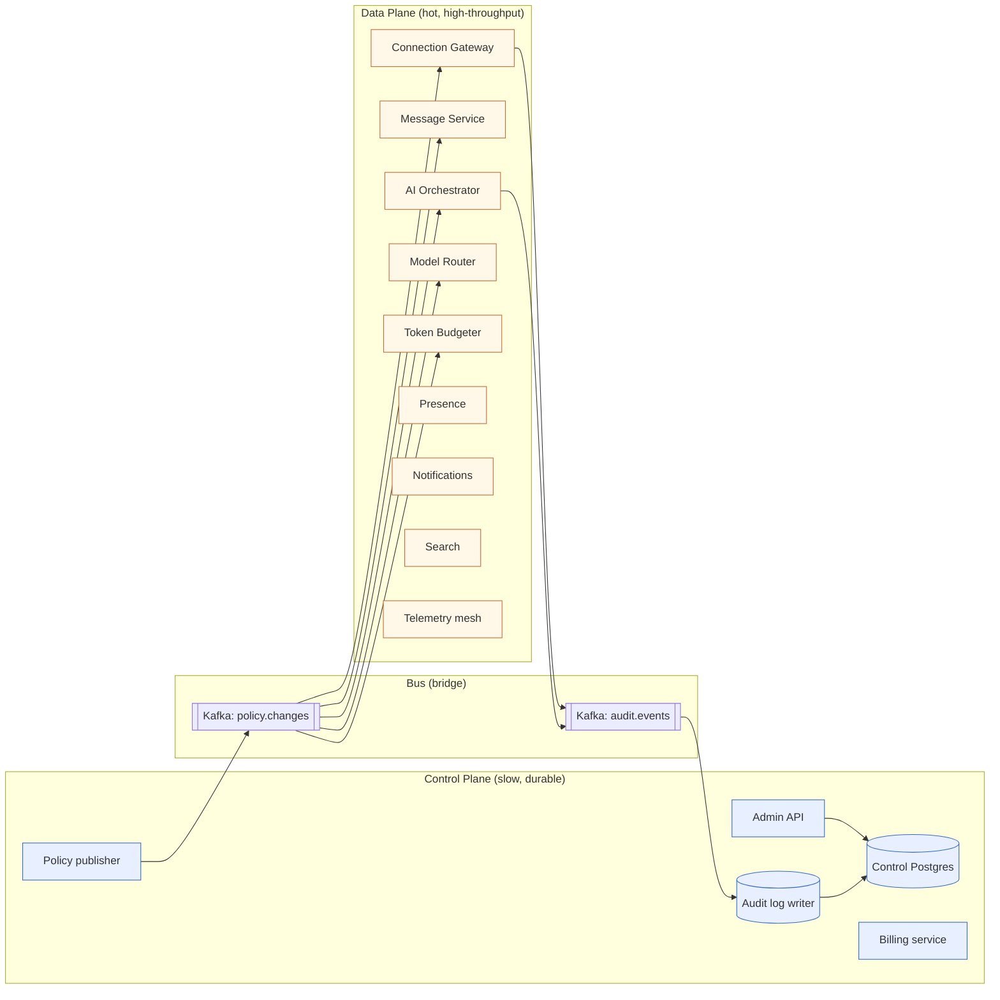

# 11 - Control Plane vs Data Plane

The split that lets Qale's slow, durable, audited surface (workspace settings, billing, AI policy, schemas) coexist with the hot, high-throughput surface (messages, presence, AI streams). Anchors from `00-question-and-context.md`.

## 1. Why the split matters

A single deployment that mixes "user is renaming a channel" and "5,000 users are receiving a fanout" is a deployment whose worst case dominates everything. The control plane and the data plane have different SLOs, different blast radii, different change cadences, different failure modes, and (often) different operators on call.

Anchor: this is the same separation that ran cleanly through the **Microsoft Azure ML control vs data plane** during AutoML evolution (A-MS3) - control-plane changes (job schemas, quotas, policies) went through formal change control; data-plane code (job execution, scheduler, runtime) deployed under canary + auto-rollback.

The principle: **a control-plane outage must never stop in-flight data-plane traffic.**

## 2. Inventory

| Component | Plane | Primary store | Expected QPS / scale | Change cadence | SLO |
| --- | --- | --- | --- | --- | --- |
| Workspace CRUD | Control | Postgres (control DB) | < 1 QPS | Slow (governed) | 99.9% |
| User / member management | Control | Postgres (control DB) | < 5 QPS | Slow | 99.9% |
| Role / ACL editor | Control | Postgres (control DB) | < 1 QPS | Slow | 99.9% |
| Billing | Control | Postgres + Stripe | < 1 QPS | Slow | 99.9% |
| AI policy editor (allowed tools, budgets, models) | Control | Postgres (control DB) | < 1 QPS | Slow | 99.9% |
| Webhook / integration config | Control | Postgres (control DB) | < 1 QPS | Slow | 99.9% |
| Audit log writes | Both (control writes via control plane; data plane appends via append-only table) | Postgres + S3 immutable | ~50 QPS | Continuous | 99.95% |
| Feature-flag evaluation | Control (definition) / Data (evaluation) | LaunchDarkly / Configmap | High at evaluation; low at definition | Slow definition, hot eval | 99.99% eval |
| Schema migrations | Control | Postgres | Per release | Coordinated | 99.9% |
| **Connection Gateway** | Data | in-memory + Redis | 150K concurrent | Continuous | 99.95% |
| **Message Service** | Data | Postgres + Kafka | 5K msg/s peak | Continuous | 99.95% |
| **Thread Service** | Data | Postgres | ~500 QPS | Continuous | 99.95% |
| **Presence Service** | Data | Redis | 10K events/s peak | Continuous | 99.9% |
| **Notification Service** | Data | Postgres + queue | 200 QPS peak | Continuous | 99.5% |
| **Search Service** | Data | OpenSearch + Qdrant | 200 QPS peak | Continuous | 99.5% |
| **AI Orchestrator** | Data | Postgres + Redis | 25 runs/s peak | Continuous | 99.5% |
| **Model Router** | Data | in-mem + Redis | bursty | Continuous | 99.5% |
| **Token Budgeter** | Data | Redis (atomic counters) | every AI call | Continuous | 99.95% |
| **Outbox Relay** | Data | Postgres + Kafka | follows write rate | Continuous | 99.95% |
| **Telemetry Mesh** | Data | OTel collector → Kafka → ClickHouse | 50–80M spans/day | Continuous | 99.5% |
| **Webhook Dispatcher** | Data | queue + outbound HTTP | low but bursty | Continuous | 99.5% |
| **Search Indexer** | Data | OpenSearch + Qdrant | follows write rate | Continuous | 99.5% |
| **Embedder pool** | Data | Redis queue + GPU/CPU workers | follows write rate | Continuous | 99.5% |
| Admin console (web) | Control | reads/writes via control plane | < 5 QPS | Slow | 99.9% |
| Workspace import/export | Control batch | S3 | rare | Slow | 99% |
| Onboarding wizard | Control | Postgres | rare per user | Slow | 99.9% |

## 3. Auth and policy propagation

The control plane owns **authority**; the data plane carries **traffic**. Authority must not gate every data-plane request through a round trip to the control plane.

Mechanism:
- Control plane writes policy changes to its store.
- Control plane signs **policy bundles** (versioned, RS256) and pushes to the data plane via a fan-out (configmap watcher, or a `policy.changes` Kafka topic).
- Data plane services hold a recent (≤ 60s old) cached policy bundle and verify the signature locally.
- Tokens issued by the control plane are short-lived JWTs (10 min for user; 60s for service-to-service capability tokens) so revocation propagates in bounded time without round trips.
- Emergency revocation: a per-`{wsId, userId}` "kill list" pushed via the same channel and held in-memory at the gateway; checked on every WS frame for high-value sessions.

This is the same pattern Microsoft used for VNet-attached compute trust at scale (A-MS2) - policy decisions are made centrally and enforced locally with short-TTL artifacts.

## 4. Config distribution

| Config type | Mechanism | Reload semantics |
| --- | --- | --- |
| Static infra config (region, cluster, account) | Helm values + IaC | Per release |
| Dynamic feature flags | LaunchDarkly (or in-house Flagger + ConfigMap watcher) | Hot, per-evaluation |
| Routing tables for AI router | Kafka `policy.changes` + cache | Hot, ≤ 60s |
| Per-tenant policy (budgets, allowed tools) | Same as above | Hot, ≤ 60s |
| Schema migrations | Versioned via Liquibase / Flyway | Per release |
| Secrets | Secrets Manager + IRSA | Lease-refreshed per pod |

Region-aware rollout: every dynamic config change rolls per-region (smallest first) with a 10-minute soak before next region. Auto-rollback on SLO burn.

## 5. Deploy cadence

| Plane | Cadence | Gating |
| --- | --- | --- |
| Control plane | Behind change control; weekly window or as needed | Approval + dry-run on staging mirror; longer canary window |
| Data plane | Continuous deploy (CD); multiple per day | Canary 5% for 30 min → 25% for 30 min → 100%; auto-rollback on SLO burn or error-rate spike |

Anchor: ran 30+ architecture reviews and Scrum execution at Microsoft (A-MS5) - this dual cadence is what kept AutoML evolving fast (data plane) without breaking compliance posture (control plane).

## 6. Failure containment

Required invariants:

- A control-plane outage **does not** drop active WebSocket sessions.
- A control-plane outage **does not** stop in-flight message delivery.
- A control-plane outage **does not** stop the AI plane from completing in-flight runs (using cached policy + cached budget).
- A control-plane outage **does** prevent: new workspace creation, role changes, billing writes, policy changes, integrations setup. Customers see degraded admin functions, not degraded chat.

How the data plane survives without control plane:
| Dependency | What the data plane caches | Survival window |
| --- | --- | --- |
| Workspace policy | Last bundle | Until staleness > 24h, then read-only fallback |
| User role | Last bundle | Same |
| AI policy | Last bundle | Same |
| Token budget | Redis counters (independent store) | Indefinite |
| Feature flags | LaunchDarkly local-cache | Indefinite (last-known-good) |
| Tenant existence | Local TTL cache + Postgres data plane | Until cache TTL |
| Audit destination | Local buffer + Kafka | Until buffer fills (~ hours) |

Inverse: a data-plane outage degrades chat/AI but does not block billing, admin, or compliance work - those remain functional through the control plane.

## 7. Storage split

- **Control DB:** small, slow, durable Postgres (RDS r6g.large is enough). Backed up daily with PITR. Tuned for correctness, not throughput.
- **Data plane stores:** tuned for throughput - sharded Postgres, Redis, Kafka, OpenSearch, Qdrant, ClickHouse.
- **Bridge:** the control plane writes its `policy.changes` to a Kafka topic that the data plane consumes; outbox pattern guarantees at-least-once.

## 8. Where the split blurs

Three real cases where the line is fuzzy:

1. **Workspace deletion.** Control-plane action with massive data-plane consequences (delete all messages, attachments, vectors, indexes). Solution: control plane writes a `tombstone` record with `delete_intent`; data-plane cleanup workers consume and execute. Customer sees workspace as deleted instantly; data is purged within 24h with audit evidence (anchor A-BB1).

2. **Role revocation.** Sensitive - user must lose access immediately. Solution: short JWT TTL (10 min) bounds worst case; for instant effect, the control plane also pushes the user to the per-`(wsId, userId)` kill list.

3. **AI policy change** (e.g., disable an agent tool because it was abused). Solution: pushed via `policy.changes`; data plane evaluates new policy on next AI call (≤ 60s).

For all three, the principle: **eventual consistency with bounded staleness, plus an immediate-effect path for emergencies.**

## 9. Diagram

The arrows between the planes are intentionally narrow - only policy down, audit up. Nothing else crosses. That's what keeps the planes independently survivable.
