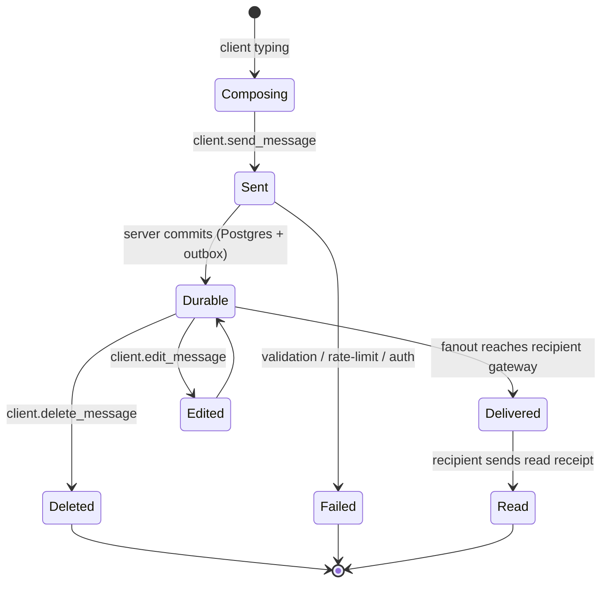
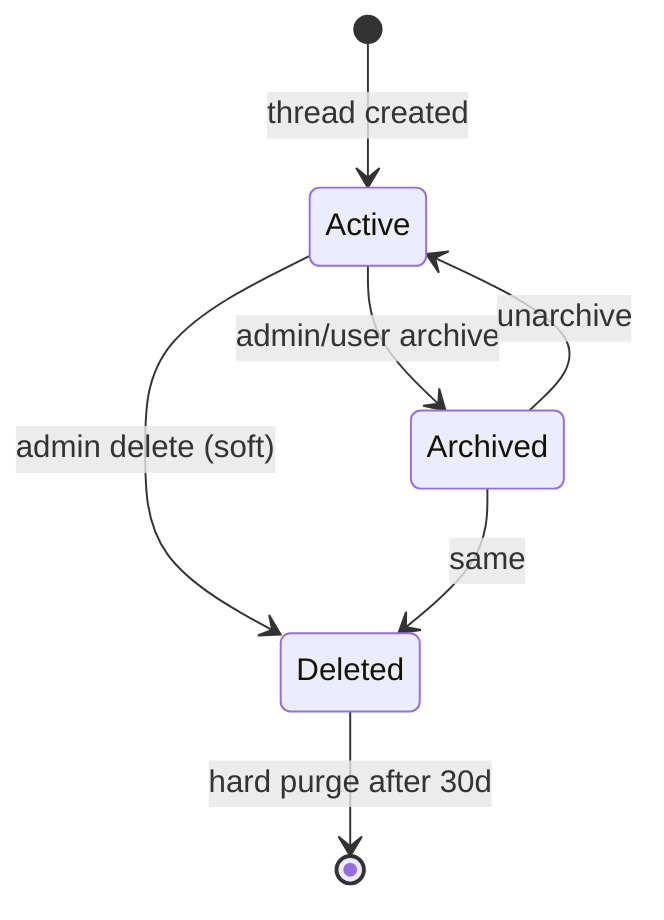
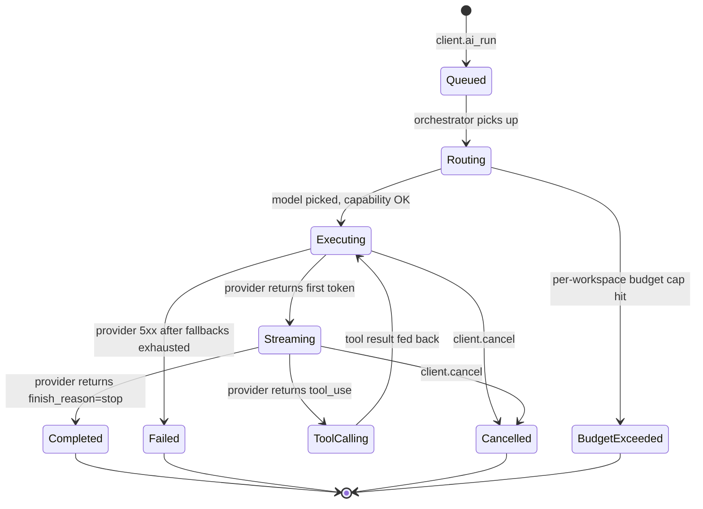
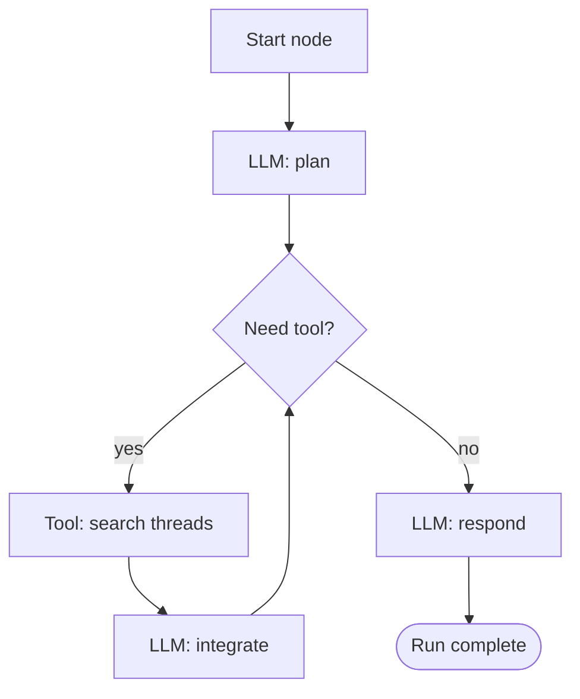
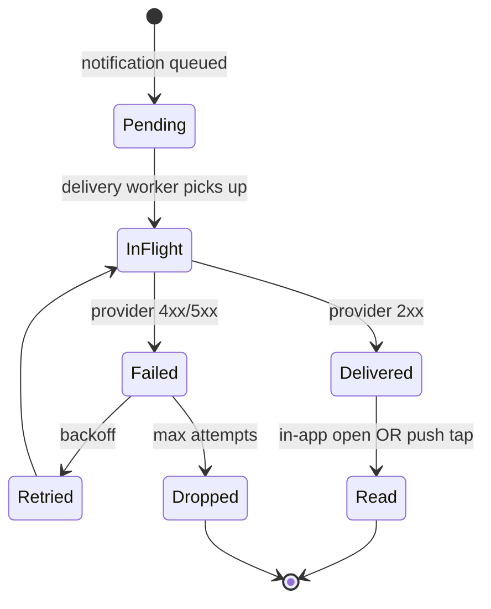

# 12 — State Machines and Workflows

The state diagrams that make Qale's behavior explicit. Anchors from `00-question-and-context.md`.

## 1. Message lifecycle state machine

**Allowed transitions:**

| From | To | Trigger | Recorded where |
| --- | --- | --- | --- |
| Composing | Sent | client emits `client.send_message` | not stored — UI state |
| Sent | Durable | Message Service writes row + publishes outbox | Postgres `messages.status='durable'`, Kafka |
| Sent | Failed | validation / auth / rate-limit reject | Postgres `messages.status='failed'` |
| Durable | Delivered | per-recipient delivery cursor advances | Per-(userId, threadId) cursor in Redis |
| Delivered | Read | client sends `read_receipt` | Postgres `read_receipts` |
| Durable | Edited | author sends `edit_message` (within window) | Postgres `message_edits` (history); `messages.body` updated |
| Edited | Durable | edit committed | as above |
| Durable | Deleted | author/admin sends `delete_message` | Soft-delete: `messages.status='deleted'`, content tombstoned; hard-delete after 30d |

**Important constraint:** transitions are monotonic per-message. Once `Read`, you cannot go back. Editing pushes to `Edited` then back to `Durable` with a new `version`.

## 2. Thread lifecycle

Permission notes: archive is reversible by any member with `manage_threads`; delete is owner-only and triggers a tombstone + delete intent (see `11-control-plane-vs-data-plane.md`).

## 3. AI run state machine

This is the most consequential state machine in the system. Anchor: same shape as the BlackBox DAG agent runtime (A-BB3) and model router (A-BB4).

**Sub-states per node** (DAG node):
- Each node has its own micro-state: `pending → running → succeeded | failed | retrying | compensating`.
- Node-level checkpoint after every transition. Anchor A-BB3.

**Transition table:**

| From | To | Trigger | Side effects |
| --- | --- | --- | --- |
| Queued | Routing | orchestrator picks run | reserve token budget |
| Routing | Executing | router picks provider + model | log route reason |
| Routing | BudgetExceeded | budget exceeded after consideration | refund any reserved tokens; user-visible message |
| Executing | Streaming | provider returns first token | start emitting tokens to WS |
| Streaming | ToolCalling | provider tool_use response | dispatch tool with capability token |
| ToolCalling | Executing | tool returns result | feed result back to provider |
| Executing | Completed | provider finish | persist result, settle tokens, emit `ai_run_complete` |
| Executing | Failed | retries exhausted | persist failure, refund unused budget, emit `ai_run_error` |
| any active | Cancelled | client.cancel | abort provider call (where supported), clean up |

## 4. Durable workflow engine

The DAG executor that powers AI runs. The engine guarantees:

1. **Checkpoint after every node transition.** Run state lives in `ai_runs` + `ai_run_steps` tables. A pod can die mid-run; another pod resumes from the last checkpoint.
2. **Idempotent tool dispatch.** Each tool call is keyed by `(runId, nodeId, attempt)`. Tools either accept a dedup key, are intrinsically idempotent, or have an explicit compensation hook (saga pattern).
3. **Retry policy per node type.** LLM calls retry up to 2 times across providers (then fall back ladder); tool calls retry per the tool's policy; human-approval nodes don't retry — they wait.
4. **Bounded fan-out.** A single run can invoke at most N parallel children to prevent runaway tree growth.

Anchor: BlackBox graph workflow engine — DAG execution, checkpointing, retry semantics, durable resumable agents (A-BB3).

Each box above is a checkpointed node; the executor records `(runId, nodeId, status, attempt, started_at, ended_at, input_hash, output_hash)`.

## 5. Side-effect / compensation model

Tools fall into three classes:

| Class | Examples | Retry approach |
| --- | --- | --- |
| Pure / read-only | search threads, list calendar | Free retry |
| Idempotent write | upsert reminder by key, set thread title | Keyed retry |
| Non-idempotent write | send external email, schedule a meeting via external API | One attempt; compensation hook on failure (e.g., send retraction email, cancel the meeting) |

The DAG executor refuses to retry a non-idempotent tool without an explicit compensation function. Saga semantics. Anchor A-BB3.

## 6. Long-running flows

**Example: "Summarize this 200-message thread."**

| Node | Action | Wall-clock |
| --- | --- | --- |
| 1 | Fetch last 200 messages from thread (paginated) | ~50ms |
| 2 | Chunk + retrieve relevant earlier context (vector + lexical) | ~200ms |
| 3 | LLM call with chunk 1 of N: "summarize this slice" | ~1.5s/slice (streamed) |
| 4 | Iterate slices (3 slices typical) | ~5s |
| 5 | Final LLM: "synthesize summaries" | ~2s |
| 6 | Persist + publish to thread | ~100ms |

User sees streaming output starting at step 3 (~250ms after click). Total wall-clock ~7–10s. Each node is checkpointed; if the executor crashes between slices, resume picks up at the next slice.

**Example: "Schedule a meeting" (long-tail, possibly human-in-the-loop).**

| Node | Action |
| --- | --- |
| 1 | LLM: parse intent + extract participants + duration |
| 2 | Tool: lookup participant calendars (3 tools in parallel) |
| 3 | LLM: propose 3 times |
| 4 | Tool: send proposal via Qale message back to user |
| 5 | **Wait** for user reply (state = `WaitingForUser`) — durable hold |
| 6 | LLM: parse user choice |
| 7 | Tool: create calendar invite (non-idempotent — keyed by `(runId, nodeId)`) |
| 8 | Persist + finish |

Node 5 may sit in `WaitingForUser` for hours. The run state survives restarts and is resumed by an event when the user replies.

## 7. Human-in-the-loop transitions

`Pause` nodes have:
- `expiry_at`: if the user doesn't respond by then, the node transitions to `Cancelled` and the run completes with a status hint.
- `resume_event`: declared event type that resumes the node (e.g., `user_reply_in_thread:{threadId}`).
- `escalation`: optional, e.g., reminder ping after 24h.

Persisted in `ai_run_steps.status='waiting'` with metadata. Anchor: BlackBox durable execution muscle (A-BB3).

## 8. Notification delivery state machine

Per-channel rules:

| Channel | Max attempts | Backoff | Notes |
| --- | --- | --- | --- |
| Push (APNs / FCM) | 3 | 1s, 5s, 30s | Token-invalid responses unsubscribe immediately |
| Email | 5 | 1m, 5m, 30m, 2h, 12h | SES suppression list respected |
| In-app | 1 | n/a | Always succeeds (local store) |
| Webhook (enterprise) | 50 over 24h | exponential | HMAC-signed, idempotency key |

## 9. State storage decisions

| State | Where | Why |
| --- | --- | --- |
| `messages.status` | Postgres column | Source of truth, indexed |
| Per-user delivery cursor | Redis | Hot-path read, OK to lose (rebuild from Postgres) |
| `ai_runs.status` and `ai_run_steps.status` | Postgres | Durable, queryable, audit |
| Tool dispatch dedup key | Postgres `ai_run_steps.attempt_id` (PK) | Strong dedup |
| Notification per-attempt | Postgres `notifications` | Audit + retry |
| Presence | Redis (sorted set, TTL) | Hot, ephemeral |
| Typing | gateway memory only | Cosmetic, drop on restart |
| Read receipts | Postgres (batched via Redis) | Source of truth, batched for write amp |

## 10. Operational tools

- `qale ai run inspect <runId>` — print full DAG state, all node history, all tool calls.
- `qale ai run replay <runId>` — re-run from captured inputs (anchor A-BB5).
- `qale ai run cancel <runId>` — graceful cancel.
- `qale ai run resume <runId>` — force-resume a stuck `WaitingForUser` (admin).
- `qale msg event replay <eventId>` — re-publish a captured event to staging for incident triage.
- `qale workspace tombstone <wsId>` — mark for delete; cleanup workers consume (anchor A-BB1).

Each command has an audit log entry and requires the right role.
