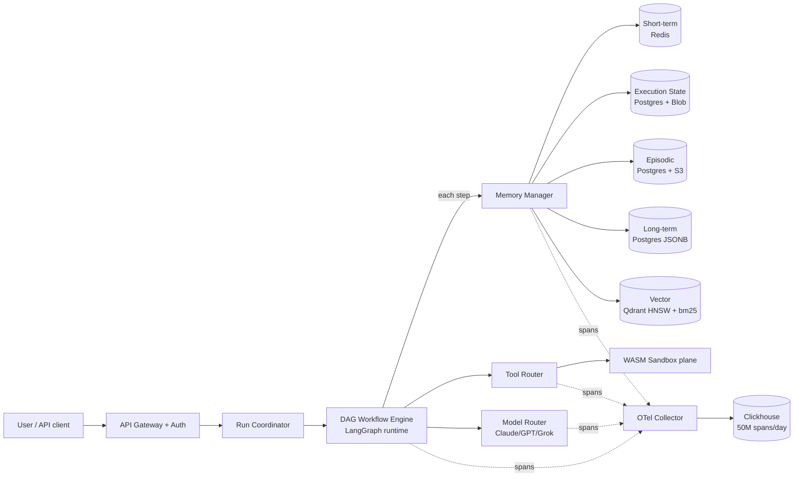
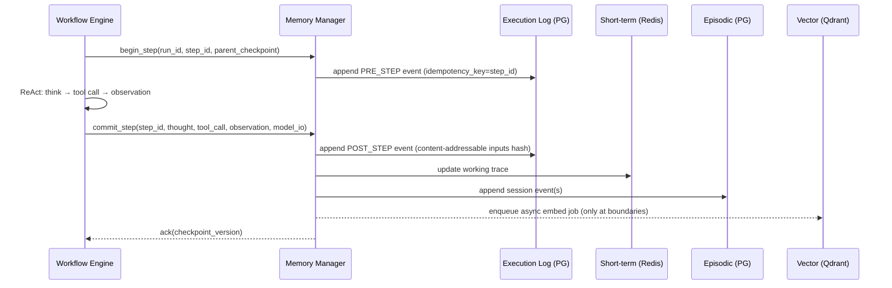
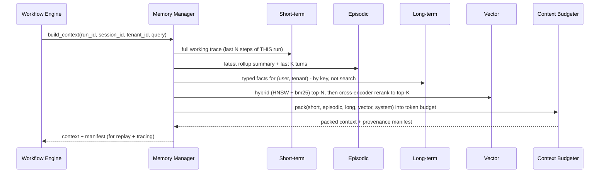

# 02 - Architecture

## End-to-End Topology

The runtime is two planes:

- **Control plane** - Run Coordinator, DAG Workflow Engine, Memory Manager,
  Tool Router, Model Router. Stateless services behind the API gateway.
- **Data plane** - the five memory stores, the WASM sandbox, the Clickhouse
  trace store. Stateful, isolated per tenant.

Memory is **never accessed directly by the agent code**. Every read and write
goes through the Memory Manager, which is the only thing that knows the tier
contracts, isolation rules, and span emission.

## The Five Stores At A Glance

| Tier | What goes in | Store | Latency budget | Durability | Visible to LLM? |
| --- | --- | --- | --- | --- | --- |
| Execution state | DAG run state, step inputs/outputs, tool call results, retry counters, checkpoint version | Postgres (hot) + S3/blob (cold) | <20 ms write, <50 ms read | Strong (fsync, replicated) | No - it's the substrate |
| Short-term | ReAct working memory: thoughts, tool calls, observations, scratchpad for the *current* run | Redis (primary) + Postgres write-through | <5 ms read, <10 ms write | Best-effort live + Postgres for replay | Yes, mostly verbatim |
| Episodic | Per-session story across runs: turns, actions, outcomes, periodic LLM rollups | Postgres (events) + S3 (large blobs) + LLM-summarized rollups | <100 ms read | Strong | Yes, summarized |
| Long-term | Stable typed facts: user prefs, tenant config, learned heuristics, durable note board | Postgres JSONB + optional embeddings | <50 ms read | Strong | Yes, selectively |
| Vector | Embedding-indexed recall surface across episodic rollups, long-term facts, and tenant docs (RAG) | Qdrant HNSW + bm25 + cross-encoder rerank | <80 ms hybrid retrieval | Strong (rebuildable from sources) | Yes, top-k items |

## The Write Path (per ReAct step)

Key properties:

- **`step_id` is the idempotency key** for the entire step. Replay or retry of
  the same step is a no-op at the execution log layer.
- **Inputs are content-addressable** (SHA-256 of model prompt + tool args). Two
  retries with the same inputs are guaranteed the same identity in the log,
  which is the foundation of deterministic replay.
- **Vector writes are async**. The hot ReAct path never blocks on embeddings;
  embeddings are derived data and can be rebuilt from episodic + long-term.

## The Read Path (per ReAct step)

Key properties:

- **Long-term is keyed, not searched** - we look up `user.preferences.code_style`,
  not "search for code style preference." This avoids the most common memory
  failure mode: pulling a wrong fact via fuzzy match.
- **Vector is reranked** - HNSW returns top-N (≈50), bm25 returns top-N (≈50),
  the union is reranked by a cross-encoder to top-K (≈5). This is what made
  retrieval acceptable at 1B+ tokens/month: bad rerank → wasted context budget.
- **Provenance manifest** lists the exact `(store, key, version)` tuples that
  went into the context window. Stored alongside the execution event. This is
  what enables deterministic replay: replay can reconstruct the *same context*
  even if the underlying stores moved on.

## How The Plane Plugs Into LangGraph

LangGraph already gives you a checkpointer interface. We **implemented our own
checkpointer** that delegates to the Memory Manager:

- `get_tuple(config)` → returns `(checkpoint, metadata, parent_config)` from
  the execution state store, with the short-term trace re-hydrated from Redis
  (with Postgres fallback if the Redis key has expired).
- `put(config, checkpoint, metadata)` → writes a checkpoint row, appends to the
  execution event log, updates short-term, and enqueues episodic + vector work.
- `list(config, ...)` → backed by the execution event log; supports
  point-in-time replay by `checkpoint_version`.

This means LangGraph is responsible for *running* the graph; the Memory Manager
is responsible for *what is remembered* - and the boundary between them is the
checkpointer interface.

## Why The Memory Manager Is Its Own Service

It would be tempting to make memory a library. We made it a service for four
reasons that came up in design review:

1. **Tenant isolation has to be enforced in one place**, not every callsite.
2. **Context packing and reranking are CPU/GPU-intensive** (cross-encoder); they
   need their own scaling envelope.
3. **Schema evolution** - the moment you change what "episodic event" means,
   you don't want to hunt through every agent author's code.
4. **Audit + replay** - a single chokepoint means a single span surface for
   every memory op. That is what makes 60% MTTR reduction tractable.

## What Is Explicitly Not In The Memory Plane

- **Tool execution side effects** - they live in the tool/sandbox layer; the
  *result* is recorded in execution state, but the side effect itself (rows
  inserted in customer DB, files written) is not "memory."
- **Model weights, fine-tunes, KV caches** - those are in the model serving
  layer. Memory is text/JSON/embeddings, not weights.
- **Telemetry trace data** - Clickhouse holds spans for ops/replay; it is not a
  source of truth that the agent reads. (Spans flow *out* of memory ops, not
  into them.)

## Anchors

- DAG workflow engine + checkpointing + memory persistence - `resume.txt`
  BlackBox bullet 3.
- LangGraph runtime with tool calling and durable execution - `resume.txt`
  BlackBox bullet 2; `blackbox-experience.md` #7, #10.
- Vector + HNSW + bm25 + cross-encoder stack - `resume.txt` technologies line.
- 50M spans/day OTel → Clickhouse - `resume.txt` BlackBox bullet 5;
  `blackbox-experience.md` #20.
