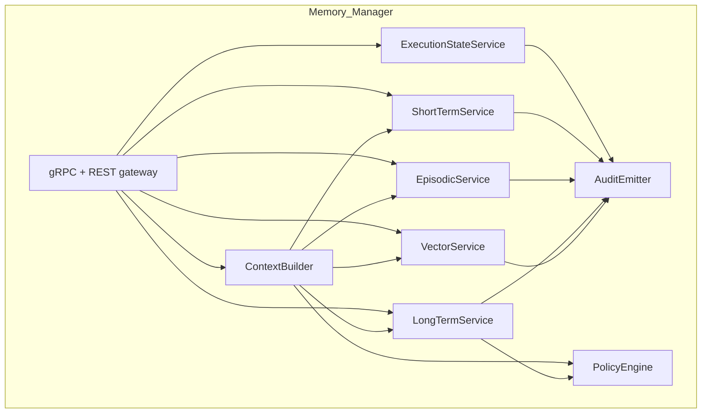
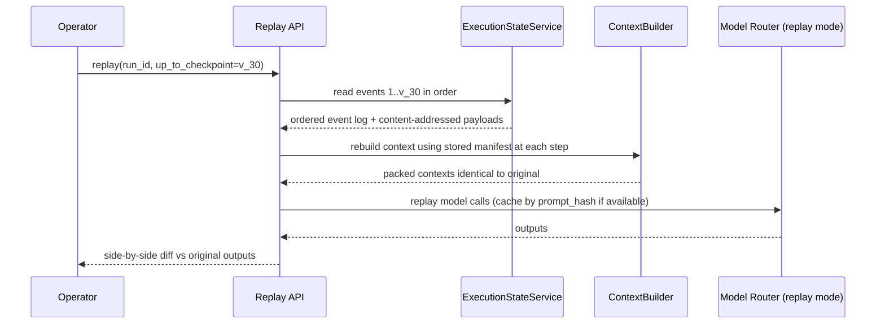
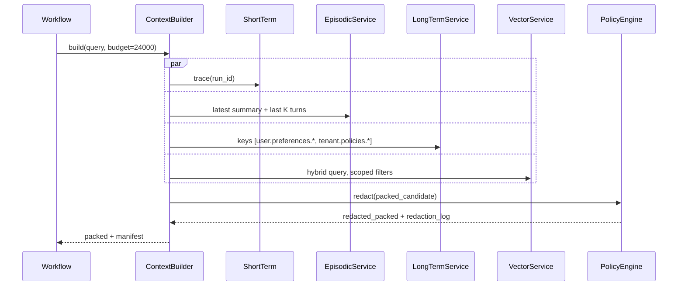

# 04 — Low-Level Design

## Service Decomposition



| Module | Responsibility | Why it's its own unit |
| --- | --- | --- |
| `gRPC + REST gateway` | Auth, tenant binding, rate limit, span entry | one chokepoint for all surface contracts |
| `ExecutionStateService` | Append/read events, manage checkpoints, optimistic concurrency | strong-consistency unit with the tightest SLO |
| `ShortTermService` | Redis primary + Postgres write-through; trace operations | latency-sensitive, distinct scaling envelope |
| `EpisodicService` | Append events, schedule rollups, fetch summaries | rollup pipeline runs on its own worker pool |
| `LongTermService` | Schema-typed K/V, review queue, embeddings hookoff | needs schema registry + HITL queue, separate concern |
| `VectorService` | HNSW + bm25 hybrid, cross-encoder rerank | CPU/GPU-bound; scales independently |
| `ContextBuilder` | Token-budgeted packing across tiers, manifest emission | the "policy" that turns a query into a window |
| `PolicyEngine` | Tenant policy, retention, redaction, write gates | central place for SOC-2 controls |
| `AuditEmitter` | OTel spans + audit log entries | one place to enforce audit completeness |

## Data Model — Core Tables

### Postgres: `exec_run`

```sql
CREATE TABLE exec_run (
  run_id              TEXT PRIMARY KEY,           -- ULID
  tenant_id           TEXT NOT NULL,
  session_id          TEXT NOT NULL,
  workflow_id         TEXT NOT NULL,              -- DAG identifier
  status              TEXT NOT NULL,              -- queued|running|paused|failed|completed|cancelled
  current_checkpoint  TEXT NOT NULL,              -- monotonic version id
  parent_run_id       TEXT,                       -- for forked replays
  created_at          TIMESTAMPTZ NOT NULL,
  updated_at          TIMESTAMPTZ NOT NULL
);
CREATE INDEX exec_run_session_idx ON exec_run (tenant_id, session_id, created_at DESC);
ALTER TABLE exec_run ENABLE ROW LEVEL SECURITY;
```

### Postgres: `exec_event` (append-only)

```sql
CREATE TABLE exec_event (
  event_id           TEXT PRIMARY KEY,           -- ULID
  run_id             TEXT NOT NULL REFERENCES exec_run(run_id),
  step_id            TEXT NOT NULL,              -- idempotency key
  parent_checkpoint  TEXT NOT NULL,
  new_checkpoint     TEXT NOT NULL,
  kind               TEXT NOT NULL,              -- pre_step|post_step|tool_call|model_call|context_build|...
  inputs_hash        TEXT NOT NULL,              -- sha256 of canonicalized inputs
  payload            JSONB NOT NULL,             -- bounded; large blobs offloaded
  payload_blob_uri   TEXT,                       -- for >32KB payloads
  produced_at        TIMESTAMPTZ NOT NULL,
  UNIQUE (run_id, step_id, kind)                 -- enforces idempotency
);
CREATE INDEX exec_event_run_seq ON exec_event (run_id, produced_at);
```

The unique key (`run_id`, `step_id`, `kind`) is the load-bearing constraint:
it's what makes a duplicate `POST /steps` from a retrying worker a no-op
rather than a corruption.

### Redis: short-term

Keys (per run):

```
stm:{tenant_id}:{run_id}:trace        # LIST of compact trace items
stm:{tenant_id}:{run_id}:scratch      # HASH of named scratch values
stm:{tenant_id}:{run_id}:lease        # STRING owner + expiry
```

TTL = `min(run_TTL, 24h)`. Eviction policy `volatile-lru`. **Postgres
write-through** at every checkpoint: a fresh recovery just rebuilds the Redis
state from `stm_snapshot` rows.

### Postgres: `episodic_event` (append-only)

```sql
CREATE TABLE episodic_event (
  event_id      TEXT PRIMARY KEY,
  tenant_id     TEXT NOT NULL,
  session_id    TEXT NOT NULL,
  seq           BIGINT NOT NULL,                 -- server-assigned per session
  kind          TEXT NOT NULL,                   -- user_message|agent_action|tool_result|user_feedback|system_event
  actor         TEXT NOT NULL,
  ref_run_id    TEXT,
  ref_step_id   TEXT,
  payload       JSONB NOT NULL,
  redactions    JSONB,                           -- spans + tags removed
  occurred_at   TIMESTAMPTZ NOT NULL,
  UNIQUE (session_id, seq)
);
CREATE INDEX episodic_session_recent ON episodic_event (tenant_id, session_id, seq DESC);
```

### Postgres: `episodic_summary`

```sql
CREATE TABLE episodic_summary (
  summary_id     TEXT PRIMARY KEY,
  tenant_id      TEXT NOT NULL,
  session_id     TEXT NOT NULL,
  covers_from    BIGINT NOT NULL,                -- seq range covered
  covers_to      BIGINT NOT NULL,
  text           TEXT NOT NULL,
  facts          JSONB,                          -- candidate long-term facts
  embedding_id   TEXT,                           -- pointer to vector store item
  generated_by   TEXT NOT NULL,                  -- model+prompt version
  created_at     TIMESTAMPTZ NOT NULL
);
```

### Postgres: `long_term`

```sql
CREATE TABLE long_term (
  scope            TEXT NOT NULL,                -- user|org|tenant
  owner_id         TEXT NOT NULL,
  tenant_id        TEXT NOT NULL,
  key              TEXT NOT NULL,                -- declared in schema registry
  value            JSONB NOT NULL,
  schema_version   INT NOT NULL,
  source           JSONB NOT NULL,               -- where this came from + confidence
  ttl_at           TIMESTAMPTZ,
  review_state     TEXT NOT NULL DEFAULT 'approved', -- approved|pending|rejected
  version          INT NOT NULL,
  updated_at       TIMESTAMPTZ NOT NULL,
  PRIMARY KEY (scope, owner_id, key)
);
CREATE TABLE long_term_audit (
  audit_id    BIGSERIAL PRIMARY KEY,
  scope       TEXT NOT NULL,
  owner_id    TEXT NOT NULL,
  key         TEXT NOT NULL,
  prev_value  JSONB,
  new_value   JSONB,
  actor       TEXT NOT NULL,
  reason      TEXT,
  at          TIMESTAMPTZ NOT NULL
);
```

The **schema registry** is a versioned set of allowed `key`s and JSON schemas.
A write to an unregistered key fails. This is the single most useful guard
against "the agent invented a key and wrote nonsense to it" failures.

### Qdrant: vector

One **collection per tenant** (or per (tenant, scope) for high-volume
tenants). Each item:

```json
{
  "id": "vm_<uuid>",
  "vector": [...],
  "payload": {
    "tenant_id": "t_acme",
    "scope": "session:abc" | "long_term:user:u_123" | "doc:tenant:acme",
    "source_store": "episodic" | "long_term" | "doc",
    "source_ref": "summary:sum_...",
    "content_hash": "sha256:...",
    "created_at": "2026-05-15T10:00:00Z",
    "model": "text-embedding-3-large",
    "model_version": "v1"
  }
}
```

**Why per-tenant collections** rather than a shared collection with a
filter: ANN filters add latency proportional to filter cardinality and are a
soft isolation boundary, not a hard one. A separate collection is a hard
boundary at the storage layer and lets us delete a tenant in one operation.

### Object storage (S3 / Azure Blob): cold + bulk

- Per-run blob bucket: `runs/{tenant_id}/{run_id}/...` for large step payloads
  (model raw outputs, tool outputs > 32 KB).
- Per-session bucket: `sessions/{tenant_id}/{session_id}/blobs/...` for large
  episodic payloads.
- Per-tenant retention lifecycle policies map to SOC-2 retention classes.

## Key Classes / Modules (Go-style sketch)

```go
// MemoryManager glues the five tiers and is the only thing the runtime calls.
type MemoryManager interface {
    BeginStep(ctx, BeginStepReq) (*StepHandle, error)
    CommitStep(ctx, *StepHandle, CommitReq) (*Checkpoint, error)
    BuildContext(ctx, BuildContextReq) (*PackedContext, *Manifest, error)
    Episodic() EpisodicAPI
    LongTerm() LongTermAPI
    Vector()   VectorAPI
}

// PolicyEngine is consulted for every write that could persist data.
type PolicyEngine interface {
    AllowLongTermWrite(ctx, LTMWrite) (Decision, error)   // approve|hold|reject
    AllowVectorIngest(ctx, VectorItem) (Decision, error)
    Redact(ctx, payload []byte, kind PayloadKind) ([]byte, []Redaction)
}

// ContextBudgeter packs tier outputs into a token budget with a fixed priority.
type ContextBudgeter interface {
    Pack(systemPrompt string,
         tiers []TierResult,
         budget int) (PackedContext, ProvenanceManifest)
}

// CheckpointStore is the LangGraph-facing adapter.
type CheckpointStore interface {
    GetTuple(ctx, RunRef) (Checkpoint, Metadata, ParentRef, error)
    Put(ctx, RunRef, Checkpoint, Metadata) error
    List(ctx, RunRef, ListOpts) ([]Checkpoint, error)
}
```

## State Machines

### Run

```
queued -> running -> {paused, failed, completed, cancelled}
running -> running         (next checkpoint)
paused  -> running         (resume)
failed  -> running         (retry from checkpoint)
```

`paused` is used for human-in-the-loop approvals and 429-driven pauses.

### Checkpoint

```
draft -> committed -> archived
draft -> abandoned
```

A `draft` exists between `BeginStep` and `CommitStep`. If the worker dies
holding a `draft`, a janitor abandons it after the lease expires; a retry
re-creates a fresh draft with the same `step_id`, which de-duplicates.

### Long-term write (with `review_required`)

```
proposed -> auto_approved -> active
proposed -> pending_review -> {approved -> active, rejected -> dropped}
active   -> superseded
active   -> revoked
```

## Sequence: Replay Of A Past Run



Replay does not actually execute tools — it re-invokes the model with the same
context to find where divergence started, which is what makes anomaly
investigation tractable.

## Sequence: Tier-Aware Context Build



## Schema Registry (long-term)

A small YAML/JSON registry shipped with the platform — example:

```yaml
- key: user.preferences.code_style
  scope: user
  schema:
    type: object
    properties:
      language: { type: string, enum: [Go, Python, TypeScript, Rust] }
      indent:   { type: string, enum: [tabs, spaces] }
    additionalProperties: false
  ttl: null
  review_required: false

- key: org.compliance.pii_handling
  scope: org
  schema: { ... }
  review_required: true     # all writes need human approval
```

The registry is the contract between agent authors and the platform. Adding a
key is a PR; the platform runs CI checks for naming, scoping, and schema
shape. This is what kept long-term memory from drifting into a free-for-all.

## Anchors

- LangGraph + ReAct + tool calling drives the LLD shape — `resume.txt` /
  `blackbox-experience.md` #7, #9.
- DAG checkpointing + retry semantics — `resume.txt` BlackBox bullet 3;
  `blackbox-experience.md` #12.
- Vector store + HNSW + bm25 + cross-encoder — `resume.txt` technologies line.
- SOC-2 + multi-tenant motivates PolicyEngine and per-tenant collections —
  `blackbox-experience.md` #5.
