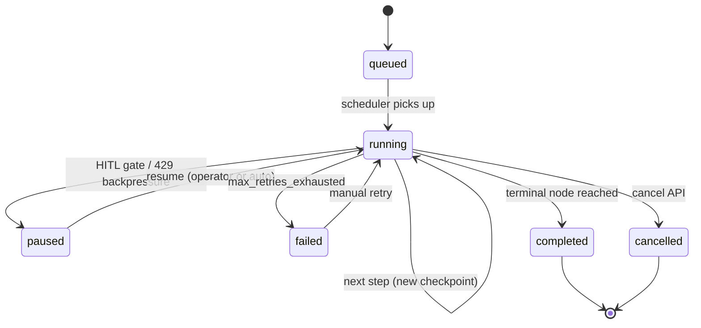
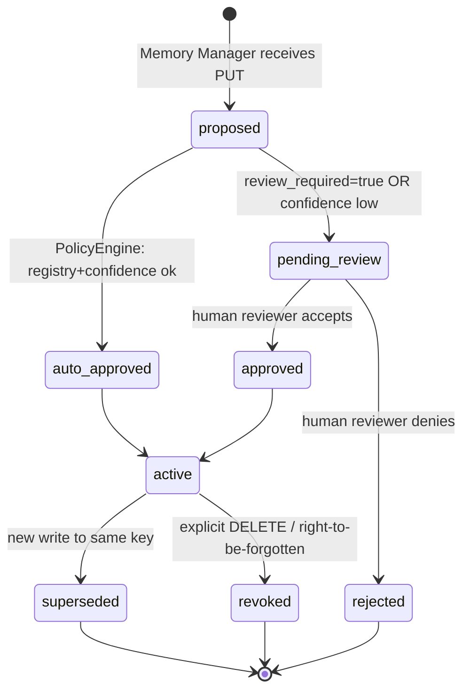
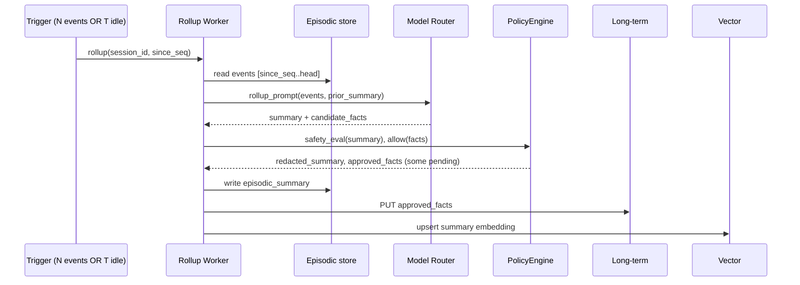
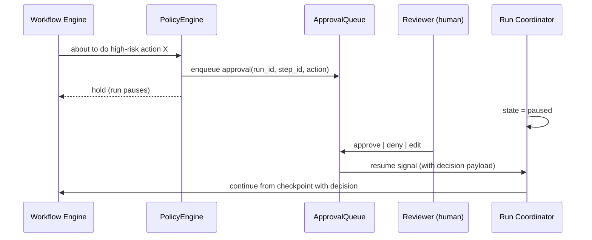

# 12 - State Machines and Workflows

## Run Lifecycle



Invariant: every transition writes an `exec_event` row. The current state is
derivable from the event log; the `exec_run.status` column is a denormalized
cache that the LLD treats as advisory, not authoritative.

## Step Lifecycle (per ReAct node)

```mermaid
stateDiagram-v2
  [*] --> draft: BeginStep (worker takes lease)
  draft --> committed: CommitStep (durable in PG)
  draft --> abandoned: lease expired (worker died)
  abandoned --> draft: retry creates fresh draft, same step_id
  committed --> archived: step_id committed; emits next checkpoint
```



Invariants:

- A `committed` event is **terminal** - never mutated, only superseded by a
  next-step event with `parent_checkpoint = current`.
- An `abandoned` event does not block retry; recovery sees no `committed`
  for `(run_id, step_id)` and the worker re-creates a draft. Idempotency is
  enforced by `UNIQUE (run_id, step_id, kind)`; a duplicate `committed`
  insert with the same `step_id` is rejected as 409.

## Long-Term Write Lifecycle



The `pending_review` state is critical: it's the gate that prevents prompt
injection from becoming a persistent memory poisoning event. Without HITL,
"learn that this user authorized X" would be one prompt away.

## Episodic Rollup Workflow



Properties:

- Idempotent on `(session_id, since_seq, head_seq)`. Re-running a rollup
  produces the same summary id (overwriting if content changed).
- The rollup is **derived data**. Loss of summaries doesn't lose conversation;
  rerun rollups from events.
- The safety eval gate rejects summaries that look like instructions (system
  tokens, tool-call shapes). Lesson learned the hard way; covered in
  `09-cross-questions.md` Q12.

## Checkpoint Versioning

`checkpoint_version` is a monotonic ULID per `run_id`. Every committed step
emits a new version. This gives:

- A natural primary key for "where am I in the run."
- A lexicographic order matching causal order.
- A point-in-time identifier for replay (`/replay?up_to_checkpoint=v_42`).

`parent_checkpoint` on each event is the previous head. Optimistic
concurrency: an attempt to commit with stale `parent_checkpoint` returns
`CHECKPOINT_STALE` (412); the worker refetches and rebuilds. This is what
prevents two workers from each appending a different "next step" to the
same run.

## HITL Approval Workflow



This is the same machine that drives `pending_review` long-term writes; the
queue is shared. The decision payload becomes part of the next `exec_event`,
so replay shows "the human said yes at this point."

## Right-To-Be-Forgotten Workflow

```mermaid
sequenceDiagram
  participant API as DELETE /v1/users/{id}/memory
  participant LTM as Long-term
  participant EPI as Episodic
  participant VEC as Vector
  participant BLOB as Blob
  participant AUD as Audit

  API->>LTM: delete rows where scope=user, owner=id
  API->>EPI: tombstone events; rewrite payloads to <REDACTED>
  API->>BLOB: delete or redact blobs referenced by tombstoned events
  API->>VEC: delete items where payload.scope=user:id
  API->>EPI: re-run latest rollup with tombstoned events filtered
  API->>AUD: emit forgetting record
```

Bounded SLA: 30 days. Audit records persist (compliance), but contain only
metadata about the deletion, not the deleted content.

## Memory Lifecycle Summary

| Tier | Typical TTL | Trigger |
| --- | --- | --- |
| Short-term | run lifetime; max 24h in Redis | run terminal state |
| Execution events (hot) | 30 days | partition rotation |
| Execution events (cold archive) | retention policy (per tenant) | lifecycle policy |
| Episodic events | retention policy (90d–7y per scope) | lifecycle + RTBF |
| Episodic summaries | longer than events (cheap) | regenerate on event change |
| Long-term | indefinite or per-key TTL | explicit DELETE / RTBF |
| Vector | mirrors source TTL; re-derivable | upsert / source delete |
| Audit log | 7 years | compliance |

## Anchors

- DAG checkpointing + retry semantics + memory persistence - `resume.txt`
  BlackBox bullet 3, `blackbox-experience.md` #12, #13, #14.
- Durable execution definition - `blackbox-experience.md` #15.
- HITL gating relevance - `blackbox-experience.md` #19, #20.
