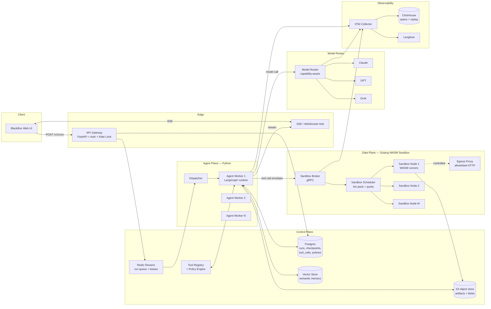
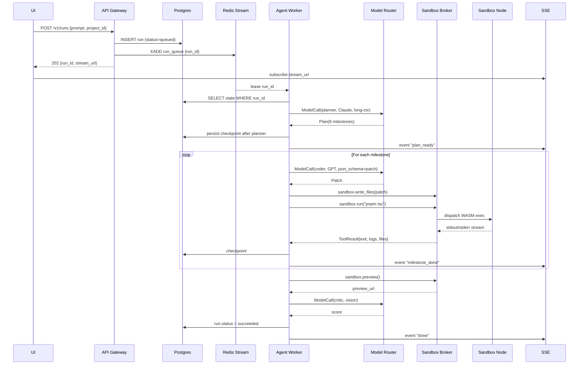

# 02 — Architecture

## Component map

## Why this shape

Three hard constraints drove the topology:

1. **Code execution must be physically isolated from the orchestrator.** A
   compromised WASM run cannot have shell access to the Python agent process
   or Postgres. So the sandbox plane is its own cluster with its own service
   account, no shared filesystem, and a gRPC-only ingress. (Anchored on the
   *"Golang-backed WASM sandbox plane... unblocking Enterprise SOC-2
   compliance"* line.)
2. **Agent runs are long, expensive, and crash-prone.** A naive request/response
   model would burn money and frustrate users every time a worker rolled. So
   state is **externalized to Postgres + S3** after every node transition, and
   workers are stateless and replaceable. (Anchored on *"DAG execution,
   checkpointing, retry semantics... long-running, resumable agents"*.)
3. **Every component must emit structured telemetry.** The SOC-2 evidence story
   and the deterministic-replay story share the same spine. OpenTelemetry +
   ClickHouse + Langfuse is the trace mesh; every model call, tool call, and
   routing decision is a span. (Anchored on *"50M spans/day... 2.5TB+ monthly
   trace data for deterministic replay"*.)

## Layers, top to bottom

### 1. Product surface

The UI ships a single React app. The only thing it does in this flow is open
a run and render the stream:

- a markdown panel for the planner's plan,
- a live file tree from the sandbox,
- an iframe to the sandbox preview URL,
- a token-and-cost meter wired to the model router span stream.

### 2. Edge — FastAPI gateway

Owns auth (OIDC), tenant scoping, rate limits, request validation, and the
SSE/WebSocket hub. Crucially **does not** call into LangGraph synchronously.
It writes the `Run` row, enqueues a job, and returns. The agent plane is
fully async.

### 3. Control plane — Postgres + Redis + Tool Registry

- **Postgres** holds `runs`, `checkpoints`, `tool_calls`, `model_calls`,
  `policy_decisions`, `tenants`, `projects`, `working_memory`. The
  authoritative source of truth for everything except large blobs.
- **Redis Streams** is the run queue: dispatcher pops; workers ack with
  leases. Dead-letter on lease expiry.
- **Tool Registry** is a versioned table of tool descriptors (name, schema,
  cost weight, side-effect class, required scopes). Every tool call goes
  through it.
- **Vector store** (Qdrant or pgvector) backs semantic memory and the
  retrieval node.

### 4. Agent plane — Python workers running LangGraph

The most important detail: **agent workers are stateless**. They take a
`run_id`, hydrate the `RunState` from Postgres, execute the next pending
node, persist the new state, ack the lease, and either re-enqueue or release.
This is what gives us crash-safe long runs.

- Each worker is a Kubernetes pod with a pinned LangGraph + LangChain version.
- Concurrency per pod is bounded — typically 4 in-flight runs per pod, tuned
  to LLM call wait time, not CPU.
- The pod hosts the **tool client** that talks gRPC to the sandbox broker and
  the **router client** that talks to the model router.

### 5. Model router

A separate service that fronts Claude, GPT, and Grok. Every call carries a
`ModelCall` envelope: prompt, schema, model preference, budget, tenant. The
router scores candidates on:

- declared capabilities (context length, tool-use schema, JSON mode, vision),
- recent error rate per model (sliding window from telemetry),
- tenant pricing tier (some tenants get a cheaper Grok-first policy),
- size of context (Claude wins for >128K).

Failover is structured: if the chosen model 429s or times out, the router
retries the next-best candidate **but propagates a `degraded=true` flag** so
the caller can decide whether to accept different output shape.

### 6. Data plane — Golang sandbox

- **Sandbox broker** is the gRPC ingress. It authenticates the envelope (signed
  by the agent worker's per-run token), checks tenant quota, and dispatches.
- **Sandbox scheduler** bin-packs WASM instances on Linux worker nodes. Each
  run gets a workspace volume. Idle WASM instances are pooled for cold-start
  reuse.
- **Egress proxy** mediates all outbound HTTP from sandboxes. Allowlisted
  domains (npm, github raw, ESM CDN) with per-domain byte budgets and full
  request logging.

This pack treats the sandbox as a black box behind its API. The internal
runtime design lives in `design-packs/2026-05-06-wasm-sandbox-platform/`.

### 7. Observability

- OpenTelemetry SDK in every Python and Go process.
- Collector tier (OTel Collector + tail-sampling for high-cardinality spans).
- ClickHouse for span storage and replay queries.
- Langfuse for the LLM-specific UX (prompt diffs, eval, scoring).

## Request flow — *"design a website like Slack"*

## Boundaries — what each component owns

| Component | Owns | Does not own |
| - | - | - |
| API gateway | Auth, rate limit, run creation, SSE | Agent execution, tool dispatch |
| Dispatcher | Queue draining, worker assignment, leases | Agent semantics |
| Agent worker | LangGraph execution, ReAct loop, retries, memory writes | Tool execution, model inference |
| Tool registry | Tool catalog, schema, side-effect class, policy bindings | Calling tools |
| Sandbox broker | AuthN of envelopes, quota, dispatch | Picking which tool to call |
| Sandbox scheduler | Placement, packing, lifecycle of WASM instances | What the WASM code does |
| Model router | Model choice, failover, cost accounting | Prompt design |
| OTel collector | Span ingestion, sampling, fan-out | What to instrument |
| ClickHouse | Trace store, replay queries | Live alerting |

This split is what makes the system shippable by 6+ engineers: each pair owns
exactly one of these surfaces with a stable interface to the next.
