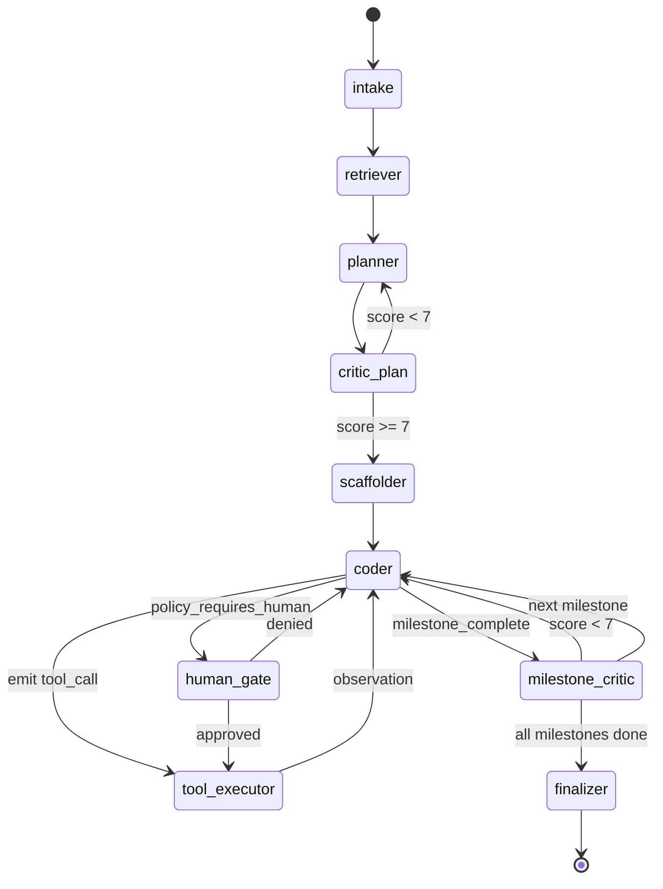

# 04 - Low-Level Design

This file is the one the interviewer will probe with "now zoom in." It pins down
the LangGraph topology, the typed state, the executor, the checkpointer, the
ReAct inner loop, the tool registry, and the policy gate.

## The graph topology



Notes on the topology:

- **`tool_executor` is its own node** rather than a side-channel inside `coder`.
  This makes every tool dispatch a graph transition with its own checkpoint
  and its own span - essential for replay.
- **`human_gate`** is a parking node. The graph state goes `awaiting_approval`,
  Postgres row is written, the worker releases the lease, and a webhook /
  `POST /v1/runs/.../actions` call resumes it.
- **`critic_plan`** is an early loop. It's cheap (one model call) and prevents
  the system from wasting 8 milestones of compute on a bad plan.

## Typed state

LangGraph wants a single `TypedDict` state; we extend it heavily.

```python
from typing import TypedDict, Literal, Annotated
from langgraph.graph.message import add_messages

class Milestone(TypedDict):
    id: str
    title: str
    description: str
    acceptance_criteria: list[str]
    status: Literal["pending","in_progress","done","failed"]
    artifacts: list[str]              # blob keys
    iterations: int
    max_iterations: int               # ReAct loop bound

class ToolCallRecord(TypedDict):
    envelope_id: str
    tool: str
    args_hash: str
    started_at: float
    completed_at: float | None
    exit_code: int | None
    observation_blob_key: str | None
    cached: bool

class RunState(TypedDict):
    run_id: str
    tenant_id: str
    project_id: str
    archetype: str
    user_prompt: str

    # ReAct conversation channel; reducers append
    messages: Annotated[list, add_messages]

    plan: dict | None
    plan_score: float | None
    milestones: list[Milestone]
    current_milestone_idx: int

    # Tool-call ledger; append-only
    tool_calls: list[ToolCallRecord]

    # Workspace handle
    workspace_id: str | None
    workspace_token: str | None        # short-lived; rotated per checkpoint

    # Budgets
    tokens_used: int
    cost_micros: int
    wallclock_used_ms: int
    budget: dict

    # Routing & memory
    model_pref: list[str]
    semantic_mem_hits: list[dict]

    # Resumability
    last_checkpoint_id: str | None
    status: Literal["queued","running","awaiting_approval","paused","succeeded","failed","cancelled"]
    error: dict | None
```

Two design choices to defend:

1. **`messages` uses LangGraph's `add_messages` reducer**, but every other field
   is replaced wholesale. We do *not* let LangGraph's default reducer touch
   anything else - that would silently merge dict states and hide bugs.
2. **`tool_calls` is an append-only ledger**, not a side table. Having it inside
   `RunState` means each checkpoint is a complete description of the run, and
   a replay can be sourced from a single Postgres row + a few blob fetches.

## Node classes

Every node is a Python callable `(state) -> state_patch`. I keep them small and
typed. Below are the contracts.

### `IntakeNode`

- Validates prompt length and content type.
- Resolves `archetype` if not provided (LLM classifier with a small router model).
- Initializes `messages`, `budget`, `model_pref`.

### `RetrieverNode`

- Computes embedding of `(prompt + project_summary)`.
- Pulls top-K from semantic memory scoped to `tenant_id+project_id`.
- Hybrid search: BM25 (Elastic) + HNSW (Qdrant), reranked with a cross-encoder.
  Anchored on resume tech list: *"Embeddings, VectorDB, Cross-encoder, HNSW, bm25."*
- Writes `semantic_mem_hits` into state.

### `PlannerNode`

- Builds prompt from: `user_prompt`, `archetype`, `semantic_mem_hits`, available
  tools (filtered by archetype), output schema.
- Calls model router with hints `min_context_tokens=64K, requires_json_mode=true`.
- Validates output against the `Plan` schema; on failure retries up to 2x with
  schema-constrained re-prompt; after that the run fails with `PLAN_INVALID`.

### `CriticPlanNode`

- Cheaper model (Grok or Haiku-tier) scores the plan 0–10 on:
  feasibility, completeness, tool plan, milestone granularity, security flags.
- Returns `plan_score` and `feedback`. If `<7`, the planner gets the feedback
  appended and replans.

### `ScaffolderNode`

- Maps `archetype` → starter template. For `webapp-scaffold`, emits a
  single tool call: `sandbox.run(create-next-app, ts, tailwind, app-router)`.
- Records the scaffolded file tree in state.

### `CoderNode` (the ReAct heart)

```python
def coder(state: RunState) -> dict:
    milestone = state["milestones"][state["current_milestone_idx"]]
    if milestone["iterations"] >= milestone["max_iterations"]:
        return {"messages": [...failure...], "milestones": mark_failed(milestone)}

    # Build prompt: plan + acceptance criteria + recent file diff + recent observation
    msgs = build_coder_prompt(state, milestone)
    # Model with tool-use; preferred = GPT-4.1 for code, fallback Claude
    resp = router.invoke(msgs, hints=RoutingHints(requires_tool_use=True))

    if resp.tool_calls:
        return {
            "messages": [resp.message],
            "pending_tool_calls": resp.tool_calls,  # consumed by tool_executor
        }
    elif resp.signals("milestone_complete"):
        return {"milestones": advance(milestone)}
    else:
        # textual reasoning only; bump iteration, loop
        return {"messages": [resp.message],
                "milestones": bump_iter(milestone)}
```

Loop guards:

- `max_iterations` per milestone (default 12).
- Tool-call dedup: identical `args_hash` within a milestone is short-circuited
  with a cached observation **and** a special system message
  *"You already ran this tool; do not call it again."* - combats the
  ReAct-loop-on-same-tool failure mode.
- A `loop_signature` (last 3 tool args hashed) is checked; if the same trigram
  repeats, the run is parked into `human_gate`.

### `ToolExecutorNode`

```python
def tool_executor(state: RunState) -> dict:
    out_calls = []
    out_obs = []
    for call in state["pending_tool_calls"]:
        descr = registry.lookup(call.tool, call.version)
        validated_args = descr.schema.validate(call.args)
        decision = policy_engine.evaluate(state, descr, validated_args)
        if decision.requires_human:
            return {"status": "awaiting_approval",
                    "human_gate_payload": decision.payload}
        if not decision.allowed:
            out_obs.append(policy_block_observation(decision))
            continue
        envelope = make_envelope(state, descr, validated_args)
        result = sandbox_or_other_dispatch(envelope, descr.side_effect_class)
        out_calls.append(record_from(envelope, result))
        out_obs.append(to_observation_message(result))
    return {
        "tool_calls": out_calls,            # appended by reducer
        "messages": out_obs,
        "pending_tool_calls": [],
    }
```

Crucially, the dispatcher is **chosen by `side_effect_class`**, not by tool name.
That means adding a new sandbox tool needs no code change here.

### `MilestoneCriticNode`

- Runs the milestone's `acceptance_criteria` against current sandbox state:
  type-check, unit tests, smoke test, optional UI screenshot diff.
- For `webapp-scaffold` archetype the UI screenshot is fed to a vision model
  with a rubric ("does it look like a Slack-style chat layout?"). Score saved.
- If score `>=7`, advance milestone; else feed structured feedback to coder
  and re-loop.

### `FinalizerNode`

- Snapshots the workspace into a signed artifact blob (`tar.zst` + manifest).
- Writes `Run.status=succeeded`, emits `done` SSE event.
- Schedules a delayed `workspace.close` (5 min) so users can poke the preview.

### `HumanGateNode`

Parking node. Writes `policy_decision` row, sets `status=awaiting_approval`,
emits SSE event. The run is removed from the queue until an approval action
re-enqueues it. Decision rows feed the SOC-2 evidence pipeline.

## The executor

LangGraph ships a `Pregel`-style runtime. I replace the default executor with a
**thin coordinator** that:

1. Pulls the next node from the compiled graph.
2. Loads the latest checkpoint into a fresh `RunState` instance.
3. Executes the node with a 60s outer deadline (model and tool calls have
   inner deadlines).
4. Persists the new state to Postgres in one transaction:
   - `INSERT INTO checkpoints (run_id, seq, state_jsonb, blob_keys[])`
   - `UPDATE runs SET status, current_node, last_checkpoint_id WHERE ...`
   - `INSERT INTO model_calls ...` / `INSERT INTO tool_calls ...`
5. If the node returned a `transition=next_node` hint, re-enqueues on the
   Redis stream with a short delay so another worker (or this one) can pick
   it up. Releases the lease either way.

That fifth step is the **stateless-worker trick** - workers don't hold the
graph in memory between nodes. Pod rollouts are zero-downtime.

## Checkpointing

Each checkpoint is the full `RunState` JSON-encoded, with large fields
(`messages` over N bytes, big plans, big observations) lifted into S3-compatible
blobs keyed by SHA-256 of the content. The Postgres row holds the blob keys
and small fields only.

```sql
CREATE TABLE checkpoints (
  run_id        TEXT,
  seq           INT,
  created_at    TIMESTAMPTZ DEFAULT now(),
  node_after    TEXT,
  state_jsonb   JSONB,
  blob_keys     TEXT[],
  parent_seq    INT,
  PRIMARY KEY (run_id, seq)
);
CREATE INDEX ON checkpoints (run_id, created_at DESC);
```

Forking from a checkpoint becomes trivial: copy the row, set `parent_seq`,
issue a new `run_id`. We use this for "try the same prompt with a different
model" experiments.

## Tool registry and policy engine

Registry rows live in Postgres and are cached in-process with a 30s TTL. The
policy engine is a small rules layer:

```python
@dataclass
class Decision:
    allowed: bool
    requires_human: bool
    reason: str
    payload: dict | None

def evaluate(state, tool_descr, args) -> Decision:
    if tool_descr.side_effect_class == "DESTRUCTIVE":
        return Decision(allowed=True, requires_human=True, reason="destructive", ...)
    if not has_scope(state, tool_descr.required_scopes):
        return Decision(allowed=False, requires_human=False, reason="no_scope")
    if exceeds_budget(state, tool_descr.cost_weight):
        return Decision(allowed=False, requires_human=False, reason="budget")
    if matches_blocked_pattern(state.tenant_id, tool_descr.name, args):
        return Decision(allowed=False, requires_human=False, reason="tenant_policy")
    return Decision(allowed=True, requires_human=False, reason="default")
```

The function above is intentionally short - *every* row of logic must turn
into a `policy_decisions` row for SOC-2 evidence, so we keep the surface tiny
and auditable.

## Concurrency model inside the worker

Per worker pod we run an `asyncio` loop with a bounded worker pool (default 4
concurrent runs). Each run is owned by exactly one Task; node execution is
cooperative.

- **Model calls** use streaming `httpx.AsyncClient`.
- **Tool calls** use gRPC `grpc.aio`.
- **Postgres** uses `asyncpg`.
- The lease is renewed every 15 seconds while the node is mid-flight; if the
  worker dies, the dispatcher's lease watcher reaps in 30 seconds and another
  worker picks the run up from the last checkpoint.

## Module map

```
agent/
  graph/
    build_graph.py          # compiles the LangGraph; one per archetype
    nodes/
      intake.py
      retriever.py
      planner.py
      critic_plan.py
      scaffolder.py
      coder.py
      tool_executor.py
      milestone_critic.py
      finalizer.py
      human_gate.py
  state.py                  # TypedDicts, reducers
  executor.py               # thin coordinator, checkpoint, lease
  checkpointer.py           # Postgres + S3 backend
  router_client.py          # model router gRPC stub
  sandbox_client.py         # broker gRPC stub
  registry.py               # tool registry + policy engine
  observability.py          # OTel spans, redaction
  prompts/
    planner.j2
    coder.j2
    milestone_critic.j2
```

## Why I keep the graph small

A real interviewer will ask "why only 9 nodes?" - the answer is that the
**ReAct loop happens *inside* `coder` + `tool_executor`**, not as separate
graph nodes. Trying to model every tool call as its own node bloats the
checkpoint table and hides the actual control flow. Two nodes (a thinker and
a doer) plus a critic give you a ReAct agent with replayable observation
boundaries and a small enough surface that 6+ engineers can ship without
stepping on each other.
