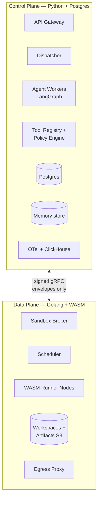

# 11 — Control Plane vs Data Plane

## Why this distinction matters at the agent layer

The temptation in agentic systems is to fuse "deciding what to do" and
"doing it" into one process — call a model, look at the output, exec a
shell command, repeat. That works for a demo. It fails for the same
reasons monolithic queue workers fail at scale: failure domains share,
deployments share, audit boundaries blur.

The agentic layer at BlackBox splits cleanly along this seam:

- **Control plane** decides *what* the agent should do, *who* it is, *what*
  it's allowed to do, and *what's been recorded*. It owns identity, policy,
  graph state, checkpoints, and audit.
- **Data plane** runs *the AI-generated workload* — the WASM sandbox that
  executes code patches, runs builds, serves preview URLs. It's stateless
  with respect to agent intent.

## What each plane owns

| Concern | Control plane | Data plane |
| - | - | - |
| Who is the user | ✅ (OIDC, tenant, project) | only receives `tenant_id` in envelope |
| What graph runs | ✅ | unaware |
| Which model to call | ✅ (router) | n/a |
| Which tool to dispatch | ✅ (LangGraph node) | only executes what it receives |
| Tool argument validation | ✅ (registry schema) | re-validates at envelope decode |
| Policy enforcement | ✅ (policy engine) | enforces budget + auth, not policy |
| Checkpointing | ✅ (Postgres + S3) | stateless |
| Cost accounting | ✅ (router meters tokens) | reports CPU/memory/wallclock used |
| Audit log | ✅ (`policy_decisions`, `model_calls`, `tool_calls`) | dispatch logs |
| Multi-tenant boundary | ✅ (row-level + memory namespacing) | per-workspace isolation |
| Workspace filesystem | reference only | ✅ owns the bytes |
| WASM instance lifecycle | n/a | ✅ |
| External network egress | mediates via tool registry | ✅ enforces via proxy |
| Telemetry emission | ✅ (graph + router spans) | ✅ (sandbox spans) |

## Why this split is load-bearing for security

A SOC-2 reviewer's first question is: *"what is the audit boundary for
AI-generated code?"* With this split the answer is one sentence: **the
audit boundary is the gRPC envelope between control and data planes.**
Every byte of AI-generated effect crosses that boundary, is signed by the
agent worker's per-run key, is logged by the broker, and is bounded by the
envelope's budget. Inside the data plane, AI-generated code runs in a
WASM sandbox with no access back to the control plane.

That property — *only signed envelopes cross the boundary, nothing else*
— is what makes the SOC-2 evidence story tractable. We don't have to
audit "every line of AI code"; we audit envelopes.

## Why this split is load-bearing for reliability

The control plane and data plane fail differently:

| Failure | Effect | Recovery |
| - | - | - |
| Control plane worker dies | Run resumes from checkpoint on another worker | < 60 s |
| Postgres replica fails | Read path degraded, write path failovers via primary | < 30 s |
| Sandbox node dies | Workspace lost; broker reroutes to another node; coder loop retries from observation | <  2 min |
| Sandbox broker fully down | Runs pause with `SANDBOX_UNAVAILABLE`; resume when broker returns | minutes |
| Model provider outage | Router fails over to next candidate; flagged `degraded=true` | seconds |
| Egress proxy down | Sandbox calls needing egress fail; non-egress calls (build, test) still succeed | depends |

Each plane can absorb failure without taking the other down. That's the
whole point.

## Why this split is load-bearing for organization

Six engineers across these planes split cleanly:

- Control plane work is Python + Postgres + LangGraph — strong fit for the
  team's existing skills.
- Data plane is Golang + WASM + Linux ops — a smaller, more specialized
  team owns it.
- The contract between them is the gRPC schema in
  `03-api-and-contracts.md`. Versioned, additive-only, with capability
  negotiation. Pull requests on either side don't block the other.

## Deployment model

- Control plane deploys multiple times per day. Stateless agent workers
  can rollover with zero downtime because state is externalized.
- Data plane deploys cautiously — sandbox broker version is mTLS-bound to
  agent worker, so we use blue/green with a router shift. WASM runtime
  upgrades are even more cautious; we shadow-test against historical
  envelopes before cutover.

## Anti-patterns we avoided

- **Sharing a database between planes.** The data plane has no Postgres
  access. Everything it needs is in the envelope.
- **Long-lived workspaces.** Workspaces are scoped to a run; closed when
  the run completes (with a 5-min preview grace period). Stateless.
- **Implicit trust at the boundary.** Every envelope is signed and
  validated. The data plane treats *the control plane* as semi-trusted
  to the same standard the control plane treats *AI output*.
- **Shared identity.** Each plane has its own service account and PKI
  identity. Cross-plane impersonation requires explicit mTLS configuration.

## The mantra

> "Brains in the control plane. Bytes in the data plane. Signed envelopes
> between them. Logs of everything."
