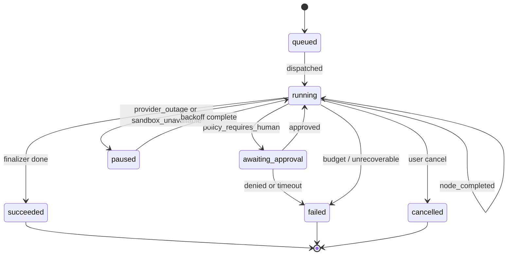

# 12 — State Machine and Workflows: "design a website like Slack"

This file is the concrete walkthrough the user asked for. It treats the
agent run as a state machine and traces every transition for the prompt
*"design a website like Slack"* from intake to artifact delivery.

## The high-level state machine



A run lives in exactly one of these states and transitions atomically with
a checkpoint write.

## Per-node state transitions

Inside `running`, the graph traverses:

```
intake → retriever → planner → critic_plan → scaffolder →
  (coder ↔ tool_executor) × milestones (with milestone_critic between) →
finalizer
```

Each transition writes:

1. A new row in `checkpoints (run_id, seq, node_after, state_jsonb, blob_keys)`.
2. An update to `runs.last_checkpoint_id` and `runs.current_node`.
3. New rows in `model_calls` / `tool_calls` / `policy_decisions` as
   appropriate.

All inside a single Postgres transaction. Then the worker emits an SSE
event and either re-enqueues or releases.

## The Slack-clone walkthrough — full trace

### t = 0 s — intake

**Input:** `prompt = "design a website like Slack"`,
`tenant_id = t_acme`, `project_id = prj_8f12`.

**Node action:** validate prompt length and tone. Detect archetype via a
small classifier model: returns `webapp-scaffold` with confidence 0.94.
Initialize budgets from request; allocate `messages = [user_message]`.

**Output state delta:**
```json
{
  "archetype": "webapp-scaffold",
  "model_pref": ["claude-sonnet", "gpt-4.1"],
  "budget": {"max_tokens": 800000, "max_tool_calls": 200, "max_wallclock_ms": 1800000},
  "tokens_used": 1240,
  "status": "running"
}
```

SSE event: `node_completed:intake`.

### t = 1 s — retriever

**Action:** embed the user prompt + last 3 project decisions; hybrid query
on Qdrant collection `mem-t_acme-prj_8f12`. Returns 12 candidate memories
(e.g. "prior runs in this project used Tailwind"). Cross-encoder rerank
keeps the top 4.

**Why it matters for *Slack-clone*:** memory might surface preferences
("this user always wants Postgres, never SQLite"). If empty (first run in
project), this node is a no-op.

**Output delta:** `semantic_mem_hits` = 4 entries with `score > 0.6`.

SSE event: `node_completed:retriever`.

### t = 3 s — planner

**Action:** route call to Claude (long-context, structured output). Prompt
includes: user prompt, archetype manual, available tools (filtered), prior
memories, schema for `Plan`.

**Model output (truncated):**
```json
{
  "summary": "Slack-clone web app with channels, DMs, threads, presence, search; built on Next.js + Tailwind + Postgres + WebSocket (Socket.IO).",
  "stack": {
    "framework": "Next.js 14 (App Router, TypeScript)",
    "styling": "Tailwind CSS",
    "backend": "Next.js API routes + Socket.IO server",
    "db": "Postgres via Drizzle ORM",
    "realtime": "Socket.IO",
    "auth": "NextAuth (credentials + Google)"
  },
  "milestones": [
    {"id":"m1","title":"Scaffold Next.js + Tailwind","acceptance":["pnpm dev runs","tailwind class compiles"]},
    {"id":"m2","title":"DB schema + Drizzle migrations","acceptance":["users, workspaces, channels, messages tables","migration applies"]},
    {"id":"m3","title":"Auth (NextAuth) wiring","acceptance":["sign in flow works","session cookie set"]},
    {"id":"m4","title":"Channel sidebar + chat view layout","acceptance":["pnpm tsc clean","layout matches Slack reference"]},
    {"id":"m5","title":"Realtime message send / receive","acceptance":["socket connects","message round-trips"]},
    {"id":"m6","title":"Threads + reactions","acceptance":["thread modal opens","reaction increments"]},
    {"id":"m7","title":"Search (full-text on messages)","acceptance":["search returns matches"]},
    {"id":"m8","title":"Deploy preview + final polish","acceptance":["preview URL responsive","no console errors"]}
  ]
}
```

**Output delta:** `plan = {...}`, `milestones = [...]`,
`current_milestone_idx = 0`, `tokens_used` += ~16K.

SSE events: `model_chunk` × many during streaming, then `node_completed:planner`.

### t = 18 s — critic_plan

**Action:** call a cheaper model (Haiku-tier or Grok). Score on
feasibility (9), completeness (8), milestone granularity (9), security
flags (10). Aggregate 9.0. Above the threshold (7) → forward.

**Output delta:** `plan_score = 9.0`.

SSE event: `node_completed:critic_plan` with `plan_ready` event for the UI.
The user can now *see* the plan.

### t = 21 s — scaffolder

**Action:** open a workspace and run the scaffold command.

```python
envelope = ToolEnvelope(
    envelope_id="01HVR3...",
    run_id="run_19f3",
    tenant_id="t_acme",
    project_id="prj_8f12",
    node_name="scaffolder",
    tool="sandbox.exec",
    args_canonical=canonical_json({
        "cmd": ["npx","create-next-app@latest","slack-clone","--ts","--tailwind","--app","--no-eslint","--use-pnpm"],
        "cwd": "/workspace"
    }),
    budget=Budget(cpu_ms=60000, memory_mb=1024, wallclock_ms=120000, stdout_kb=2048, egress_kb=10240),
)
```

Broker dispatches; sandbox runs `create-next-app`; egress proxy passes
through `registry.npmjs.org`. File tree streamed back.

**Output delta:** `workspace_id = "ws_acme_19f3"`, `tool_calls += 1`,
`messages += [observation]`. ~70 files now in the workspace.

SSE events: `tool_started`, `file_changed` × many, `tool_completed`.

### t = 95 s — coder loop for m1 ("Scaffold")

Coder runs. The scaffold tool already covered most of m1. The coder calls
`sandbox.run(pnpm tsc --noEmit)`. Passes. Calls `sandbox.run(pnpm dev &)`
to confirm dev server starts. Sees a healthy response. Marks m1 complete.

**Iterations:** 2. **Tool calls:** 2. **Tokens:** ~6K.

`milestone_critic` agrees → advance to m2.

### t = 130 s — coder loop for m2 ("DB schema + Drizzle")

Coder emits a tool call `sandbox.write_files` containing
`drizzle/schema.ts`, `drizzle/migrations/0001_init.sql`, and an updated
`drizzle.config.ts`. Then `sandbox.run(pnpm drizzle-kit generate)`.
Generate succeeds. Then `sandbox.run(pnpm drizzle-kit push)` — but
Postgres isn't available in the sandbox. Observation reports
`ECONNREFUSED localhost:5432`.

Coder reasons: "I need to use the bundled `postgres-light` adapter for
preview." Calls `sandbox.write_files` to swap in `@electric-sql/pglite`
and re-run. Now succeeds.

**Iterations:** 4. **Tool calls:** 6. **Tokens:** ~22K.

`milestone_critic` runs the new migration and a smoke `select 1`. Pass.
Advance to m3.

### t = 250 s — m3 ("Auth")

Standard NextAuth wiring. ~3 iterations, mostly file writes plus a
`pnpm tsc` check. The coder's typed output schema means the model can't
"talk around" type errors — it has to fix them. ~14K tokens.

### t = 340 s — m4 ("Sidebar + chat view layout")

This is where the **vision critic** earns its keep. Coder writes a
`(workspace)/[channel]/page.tsx` with a left sidebar of channels and a
main chat area. `sandbox.preview()` returns a URL; broker captures a
screenshot at 1280×800 and uploads to the artifact bucket. Vision-capable
model scores the screenshot against a "Slack reference" rubric.

Score 6.2 — sidebar too narrow, message bubbles missing avatars. Coder
gets the structured feedback as an observation message, emits another
patch (Tailwind width changes + avatar component), `tsc`, preview again.
Score 8.4. Pass.

**Iterations:** 5. **Tool calls:** 9. **Tokens:** ~38K.

### t = 480 s — m5 ("Realtime")

Coder scaffolds `pages/api/socket.ts`, writes a tiny Socket.IO server, and
wires up `useSocket` hooks. Critical edge: Next.js App Router doesn't
support legacy Pages API routes for sockets cleanly. Coder hits a build
error; observation contains the Next.js error message. After one
iteration, coder switches to a custom server (`server.mjs`) with
explicit Socket.IO mount.

**Iterations:** 6. **Tool calls:** 11. **Tokens:** ~46K.

`milestone_critic` runs a vitest that opens a socket and round-trips a
message. Pass.

### t = 700 s — m6, m7, m8

Each ~1–2 minutes. Threads + reactions (~28K tokens), search (~22K), deploy
preview (~15K).

The deploy-preview milestone calls `sandbox.preview()` once more,
captures a final screenshot, and validates accessibility (one cheap audit
tool exists in the sandbox image).

### t = 950 s — finalizer

**Action:** call `sandbox.package_artifact()`; broker returns a signed
`tar.zst` URL plus a preview URL that stays alive for 5 minutes. Write a
final `Run.status = succeeded` row.

**Output delta:**
```json
{
  "status": "succeeded",
  "artifacts": [
    {"kind":"tarball","url":"https://artifacts.blackbox.ai/...","sha256":"..."},
    {"kind":"preview_url","url":"https://sbx.blackbox.ai/p/run_19f3","expires_at":"..."}
  ],
  "tokens_used": 247000,
  "cost_usd": 1.34
}
```

SSE event: `done`.

## Totals

| Quantity | Value |
| - | - |
| Wall-clock | ~16 min |
| Model calls | ~52 |
| Tokens (in+out) | ~247K |
| Sandbox tool calls | ~58 |
| Checkpoints written | ~63 |
| OTel spans emitted | ~340 |
| Cost (model + sandbox) | ~$1.34 |

## Resumability traces

Three failure injections to illustrate state-machine resilience:

### Crash at t = 200 s (mid m3, during NextAuth wiring)

1. Worker pod is killed by chaos test.
2. Dispatcher's lease watcher reaps the run's lease after 30 s.
3. Worker pod B picks up the `run_id`.
4. Loads checkpoint `seq = 11` (last completed: coder mid-m3 with one
   pending tool call).
5. Pending tool call has an `envelope_id`. Worker re-emits the envelope.
   Broker sees the ID in its idempotency table, returns the cached
   observation, **does not** re-execute. (If the broker hadn't seen it
   yet, the call executes for the first time.)
6. Coder continues from where it was. User sees a `paused → running`
   blip and a sub-second SSE gap. Total recovery time: ~45 s.

### Provider outage at t = 350 s (Claude returns 429 for 60 s)

1. Model router's first chunk is `error{code:429}`.
2. Router fails over to GPT-4.1. Emits `RoutingDecision{degraded=true}`.
3. Run continues. The vision critic at m4 picks Claude back later once
   the provider is healthy.

### Sandbox node lost at t = 480 s

1. The exec on the WASM node times out at the broker side because the
   node went away.
2. Broker reports `RESOURCE_EXHAUSTED` to worker.
3. Worker exponential-backoffs once; the broker re-dispatches to a
   different node; new node has empty workspace, so worker re-runs
   `sandbox.write_files` to restore — but the file content is in the
   checkpoint, so this is cheap.
4. Total impact: ~20 s of wall-clock loss; cost: ~10K extra tokens for
   the file-restore prompt.

## Human-in-the-loop branch

If the user typed *"design a website like Slack and email me when ready"*,
the planner would include `tools.email.send` in the plan. At dispatch,
the policy gate flags `EXTERNAL_MUTATION`, parks the run with
`awaiting_approval`, and the UI shows: *"The agent wants to send an email
to you@example.com. Approve?"* On approval, the run resumes from the
checkpoint and dispatches the email. On denial, the run finishes without
sending and the model is told "user denied the email send."

This is the canonical example of how the state machine handles
side-effecting tools cleanly: pause, expose, resume.
