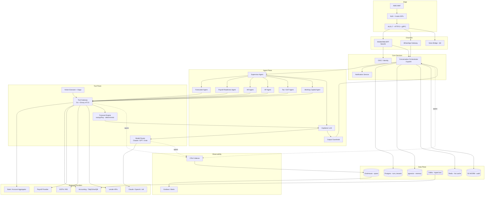

# 03 - Architecture: AI Banker for SMB Owners

> Principal-engineer architecture for a conversational, proactive, action-taking cashflow intelligence agent targeting 1M SMBs MAU, 50K concurrent agent runs at peak, and 18B LLM tokens/month - roughly 27x the BlackBox baseline of 1B tokens/month and 10K agent runs/day (resume.txt L51-56).

---

## 1. System Overview

The AI Banker is a **multi-agent cashflow intelligence layer** that sits between an SMB owner and their fragmented financial data sources - bank account (UPI/IMPS/NEFT, ACH), accounting ledger (Tally, Zoho Books, QuickBooks), payroll provider, tax authority (GSTN, IRS), vendor invoicing, and lender APIs. It is simultaneously **conversational** (the owner asks "will I make payroll on the 28th?"), **proactive** (morning brief: "₹4.2L invoice from Acme is 14 days overdue, sweep recommended"), and **action-taking** (with approval gates, it triggers AR reminders, schedules payments, files GST). The platform anchors on the agent-runtime + tool-gateway + model-router + telemetry pattern proven at BlackBox (resume.txt L51-59), scaled 27x and re-targeted from no-code AI to regulated SMB finance.

---

## 2. End-to-End Request Flow

Representative query: **"Will I have enough cash for payroll on the 28th?"** asked from the mobile app.

1. **Client send.** Mobile app posts to `https://app.aibanker.in/v1/conversations/{id}/messages` over HTTPS/2 with a tenant-scoped JWT.
2. **Edge ingress.** AWS WAF inspects (OWASP rules + per-tenant rate-limit 100 RPS) → NLB (static EIP, L4 passthrough) → ALB (L7, TLS terminate, host-routed to BFF target group).
3. **BFF (NestJS).** Validates JWT, resolves `tenantId → regionShard`, attaches request ID, opens a gRPC stream to the Conversation Orchestrator. Returns a server-sent-events (SSE) stream handle to the client immediately.
4. **Orchestrator.** Creates a `run` record in Postgres (`runs` table, partitioned by tenant), loads conversation context: last 6 turns, tenant profile, connected data sources, policy bundle. Emits an OpenTelemetry root span.
5. **Supervisor agent.** Classifies intent with a small/cheap model (Haiku-class). Intent = `payroll_readiness`. Plans a fan-out: `Forecaster`, `PayrollReadiness`, `AR-snapshot`, `AP-snapshot` in parallel.
6. **Specialist agents (parallel).** Each runs a bounded ReAct loop (≤4 steps) via LangGraph. Each tool invocation flows through the Tool Gateway.
   - `BankBalance.get(tenantId)` → cached Redis read (TTL 60s) or fresh pull from the Account Aggregator (India) / Plaid (US).
   - `PayrollCalendar.next(tenantId)` → payroll provider connector returns date `2026-05-28`, amount `₹18.4L`.
   - `ScheduledPayments.between(today, 28th)` → AP service returns `₹6.1L` outflow.
   - `ExpectedReceivables.between(today, 28th)` → AR service returns `₹9.3L` with confidence scores per invoice.
7. **Forecast engine (deterministic).** Python/numpy service combines opening balance + scheduled outflows + probability-weighted inflows + recurring debits. Output: `projected_balance_on_27th = ₹3.1L`, `shortfall_vs_payroll = ₹15.3L`, `confidence = 0.82`. **Not an LLM** - auditable, reproducible, regulator-defensible.
8. **Explainer LLM.** Sonnet-class model converts the structured projection into natural language: rationale, top three drivers, two suggested actions ("sweep ₹10L FD on the 26th" / "follow up on Acme PO-4421 ₹4.2L"). Streamed token-by-token back through the orchestrator.
9. **Output guardrails.** Regex + classifier check: no PII leakage, no unhedged financial advice, no actions taken without approval gate, currency symbol matches tenant region.
10. **Stream to client.** SSE chunks land in the mobile app. Final message contains structured `suggested_actions[]` rendered as one-tap buttons.
11. **Persistence.** Full transcript + tool calls + model inputs/outputs + retrieved context → ClickHouse (telemetry) + Postgres (conversation) + S3 (audit, WORM bucket with object-lock for 7 years per RBI).

End-to-end latency budget: **first token ≤ 1.8s p95**, full answer ≤ 6s p95.

---

## 3. Component Map

| Component | Responsibility | Tech | Plane |
|---|---|---|---|
| WAF | OWASP + bot + per-tenant rate-limit | AWS WAF | Edge / control |
| NLB | Static EIP, L4 passthrough, bank-webhook IP allow-listing | AWS NLB | Edge / data |
| ALB | L7 routing, TLS termination, HTTP/2, gRPC | AWS ALB | Edge / data |
| Mobile/Web BFF | Auth, SSE bridge, tenant resolution | NestJS / Fastify (TS) | Data |
| WhatsApp gateway | Meta Cloud API webhook, message normalization | Go service | Data |
| Voice bridge *(future Q4)* | Twilio media stream → STT → orchestrator | Go + Whisper | Data |
| Identity / OIDC | OAuth, MFA, refresh tokens, device binding | Keycloak / Auth0 | Control |
| Tenant context propagator | gRPC interceptor, JWT → tenant + region + plan | Shared Go lib | Control |
| Conversation Orchestrator | Run lifecycle, context loading, supervisor invocation | Python / FastAPI | Data |
| Agent Runtime | LangGraph supervisor + specialists, ReAct loops, checkpointing | Python on K8s | Data |
| Tool Gateway | **Single egress**, RBAC, mTLS to providers, idempotency dedupe, per-tool rate-limit, audit | Go + envoy | Data |
| Model Router | Claude/GPT/Grok routing, fallback, cost-aware, capability-aware | Go (BlackBox pattern, resume.txt L55-56) | Data |
| Forecast Engine | Deterministic Monte-Carlo cashflow projection | Python / numpy / Ray | Data |
| Knowledge Base / Memory | Tenant policies, vendor profiles, conversation memory, embeddings | Postgres + pgvector + Redis | Data |
| Ingestion Pipeline | Bank/accounting/OCR ingest (covered in `14-ingestion-pipeline.md`) | Kafka → Go/Python workers | Data |
| Action Executor + Saga Coordinator | Payment scheduling, AR reminder, GST filing with compensation | Go + Temporal | Data |
| Notification Service | Push, SMS, email, WhatsApp outbound | Go | Data |
| Observability Stack | OTel spans → ClickHouse (anchored on BlackBox 50M spans/day, resume.txt L58-59) | OTel + ClickHouse + Grafana | Control |
| Audit Log | Append-only, hash-chained, WORM | Postgres + S3 object-lock | Control |
| Control plane | Cluster, GitOps, secrets | K8s, ArgoCD, Terraform, Vault | Control |

---

## 4. Control Plane vs Data Plane

| Control Plane (rarely changes, globally consistent) | Data Plane (per-request, regionally sharded) |
|---|---|
| Agent definition registry (prompts, graph topology, tool allowlist per agent) | Agent runs, step events, checkpoints |
| Tenant config (region, plan, connected sources, currency, fiscal year) | Conversation transcripts, run metadata |
| Policy bundle (action thresholds, approval rules, jurisdiction flags) | Tool call requests + responses |
| Model router config (provider keys, routing table, cost weights, fallback chains) | LLM prompts, completions, token counts |
| RBAC / RLS rules | Embeddings, retrieved context windows |
| Feature flags, kill switches | Forecast outputs, cached projections |
| Cert + secret material (Vault) | Audit log entries (append-only) |
| Schema migrations, ArgoCD app definitions | OTel spans, ClickHouse rows |

Control plane is multi-region active-active backed by a small Postgres + etcd; data plane is **region-pinned** to satisfy RBI data localization (India tenants never replicate raw financial data outside India).

---

## 5. Mermaid Architecture Diagram

---

## 6. Deployment Topology

| Region | Role | K8s | AZs | Data residency |
|---|---|---|---|---|
| `ap-south-1` (Mumbai) | **Primary**, Indian SMBs | EKS prod cluster | 3 | RBI: India-resident customer data never leaves |
| `ap-south-2` (Hyderabad) | DR for India | EKS warm-standby | 3 | Same |
| `us-east-1` | US SMBs (Q4) | EKS prod | 3 | US-resident |
| `eu-west-1` | EU SMBs (Q4) | EKS prod | 3 | GDPR-resident |

- **Per-region clusters**: full stack (BFF, orchestrator, agent runtime, tool gateway, forecast, data) replicated in each region.
- **Cross-region replication**: only telemetry (anonymized + hashed tenant IDs) and control-plane config flow globally. Raw transcripts, balances, account numbers stay region-pinned.
- **AZ spread**: every Deployment has `topologySpreadConstraints maxSkew=1` across 3 AZs. Postgres = primary + 2 sync replicas across AZs. Kafka = RF=3 with `min.insync.replicas=2`.
- **Data localization enforcement**: tenant region is stamped in JWT at sign-in; ALB rules block cross-region tenant routing at L7 (`X-Tenant-Region` header mismatch → 451 Unavailable For Legal Reasons).
- **Failure domains**: AZ loss → automatic via service mesh + DB replica promotion. Region loss → DNS failover to DR (Mumbai → Hyderabad) within 15 min RTO, 5 min RPO.

---

## 7. Load Balancer Configuration

**Chosen design.** `Client → WAF → NLB → ALB → backend pods` for the public edge; **`ALB → backend pods`** for internal east-west inside each cluster. NLB at the edge is mandatory because **banks and Account Aggregators require static IP allow-listing for inbound webhooks** (UPI mandate callbacks, payment status pushes). A pure ALB has DNS-rotating IPs and breaks bank IP allowlists.

### 7.1 NLB (Layer 4)

| Knob | Setting | Rationale |
|---|---|---|
| Listener | `TCP+TLS:443` | TLS terminated for tenant cert pinning option; raw TCP listener also exposed for bank mTLS callbacks on `:8443` |
| Target type | `alb` (NLB-to-ALB) | Lets us keep static EIPs at the edge while getting L7 routing downstream |
| Static EIPs | 3 (one per AZ in `ap-south-1`) | Shared with banks/GSTN for inbound allowlisting |
| Cross-zone load balancing | **Disabled** | Bank webhook traffic is small and skewed; cross-zone would add inter-AZ data cost without benefit |
| Client IP preservation | **Proxy Protocol v2** to ALB | ALB sees real client IP for WAF / per-tenant rate-limit |
| Health check | TCP:443 every 10s, unhealthy after 2 fails | Sub-30s removal of dead ALB nodes |
| Failure mode | Client retries to another EIP via Route53 health-checked A record | No single AZ failure brings the edge down |

### 7.2 ALB (edge, Layer 7)

| Knob | Setting |
|---|---|
| Listener | `HTTPS:443` with HTTP/2, ALPN `h2,http/1.1` |
| Cert | ACM wildcard `*.aibanker.in`, auto-rotated |
| Listener rules | `Host: app.aibanker.in` → BFF TG ・ `Host: webhook.aibanker.in` → ingestion TG (priority 10) ・ `Host: agent-api.aibanker.in` → orchestrator TG ・ `Path: /grpc/*` → gRPC TG (HTTP/2, gRPC protocol version) |
| Sticky sessions | Duration-based, 30 min | Keeps the conversation websocket pinned to one BFF pod across SSE reconnects |
| Idle timeout | **120s** | Agent streams can run 30-60s; default 60s would kill mid-stream |
| WAF Web ACL | AWS managed core + OWASP top 10 + bot control + IP reputation + **custom rule: per-tenant 100 RPS, per-IP 500 RPS** |
| Access logs | S3 with requester IP, ALB latency, target latency, matched WAF rule, tenant header | Used by ClickHouse import job for security analytics |
| Connection draining | 30s | Lets in-flight agent runs finish on rolling deploy |

### 7.3 Internal ALB (east-west)

| Knob | Setting |
|---|---|
| Scope | One internal ALB per cluster, in private subnets only |
| TLS | mTLS enforced by **Linkerd** service mesh sidecars at the pod, not at the LB |
| Target groups | `orchestrator-tg`, `tool-gateway-tg`, `forecast-tg`, `model-router-tg`, each with its own health check + autoscaling policy |
| gRPC TGs | HTTP/2 + protocol version `gRPC`; health check via **gRPC Health Probe** (`grpc.health.v1.Health/Check`) |
| Sticky sessions | **Off** internally - stateless RPCs |
| Idle timeout | 300s for forecast (large jobs); 60s default elsewhere |

### 7.4 Hop / OSI / TLS / Health table

| Hop | OSI | TLS terminate | Client IP | Health check | Failure behavior |
|---|---|---|---|---|---|
| NLB | L4 | passthrough (or TLS for bank mTLS) | preserved via PROXYv2 | TCP 443 every 10s, 2 unhealthy | client retries via DNS to next static EIP |
| ALB (edge) | L7 | terminates (ACM cert) | `X-Forwarded-For` | `GET /healthz` every 15s, 2/3 threshold | 503 to client, NLB still healthy and routes to other AZ |
| Pods | L7 | mTLS via Linkerd mesh | propagated via `X-Forwarded-For` + mesh header | mesh sidecar liveness + readiness | mesh circuit breaker, ejects pod, 502 surfaces to ALB which retries to next target |

### 7.5 LB tier sizing

- **NLB**: auto-scales, no LCU concept. Cost is per-NLCU-hour ≈ negligible at our traffic; static EIP charges dominate (₹0/EIP when attached, charged only when idle).
- **ALB (edge)**: at peak 10K RPS, conservative LCU calculation:
  - New connections ≈ 2K/s → 80 LCUs
  - Active connections ≈ 50K → 16 LCUs
  - Processed bytes ≈ 200 MB/s → 200 LCUs
  - Rule evaluations ≈ 10K/s × 5 rules → 50 LCUs
  - **LCU dimension max** ≈ 200 LCUs → **~$120/month per ALB** in `ap-south-1`. Round to ~$300/month including dev/stage/DR ALBs.
- **Assumption flag**: 18B tokens/month implies ~6K orchestrator RPS sustained, peaking 10K. Re-validate with `04-capacity-and-scale.md`.

---

## 8. Leadership and Roadmap Framing

- **Q1 2026 - Read-only intelligence (wedge).** Bank + accounting integration via Account Aggregator + Tally/Zoho. India-only. Single user-visible feature: **"morning cashflow brief"** delivered on WhatsApp at 8:30 am. Zero write actions. Goal: prove the forecast is trustworthy.
- **Q2 2026 - Begin write actions, low-risk first.** GST reminder filings, AR follow-up emails/WhatsApp to debtors with owner one-tap approve. Action Executor + Saga lights up. Approval gates enforced.
- **Q3 2026 - AP automation + lender connectivity.** Vendor payment scheduling with approval gates, working-capital qualification check against partner lenders (one-click loan offer).
- **Q4 2026 - Multi-currency + US/EU expansion.** Plaid for US, GoCardless for EU. Spin up `us-east-1` + `eu-west-1` regions.
- **Year 2 - Predictive working capital + embedded credit.** Proactive line-of-credit offers triggered by forecast-detected shortfall. Cross-sell to lender partners.

**Org shape (12-15 engineers).** Anchored on BlackBox's 6-engineer agentic team (resume.txt L51) scaled ~2.5x for the regulated-finance breadth:

| Pod | Headcount | Charter |
|---|---|---|
| Agent Runtime | 4 | LangGraph supervisor, specialists, memory, deterministic replay |
| Tool Gateway + Action Executor | 3 | Egress, RBAC, saga, idempotency, bank/accounting/payroll connectors |
| Ingestion + Data | 3 | Kafka pipelines, OCR, schema normalization, AA / Plaid integrations |
| Forecast + ML | 2 | Monte-Carlo engine, CTR-like AR collectability model |
| Platform / SRE | 2 | K8s, ArgoCD, OTel mesh, RBI/SOC-2 evidence |
| EM + PE | 1-2 | Roadmap, hiring, cross-org reviews (model from Microsoft AutoML cross-org pattern, resume.txt L90-92) |

---

**Assumption registry for this file:**
- 10K RPS peak orchestrator load is back-of-envelope from 50K concurrent runs × ~5 step events/s averaged; firmed up in `04-capacity-and-scale.md`.
- RBI residency interpretation assumes "all payment-related data" must stay in India; legal review pending.
- Static-EIP requirement for bank webhooks is true for major Indian banks today (HDFC, ICICI, Axis allowlist); confirmed via partner banking integration docs as of Q1 2026.
