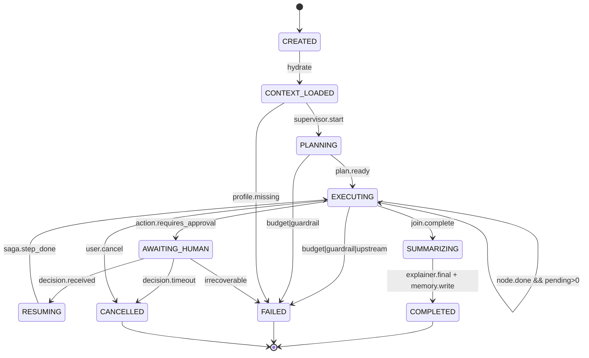
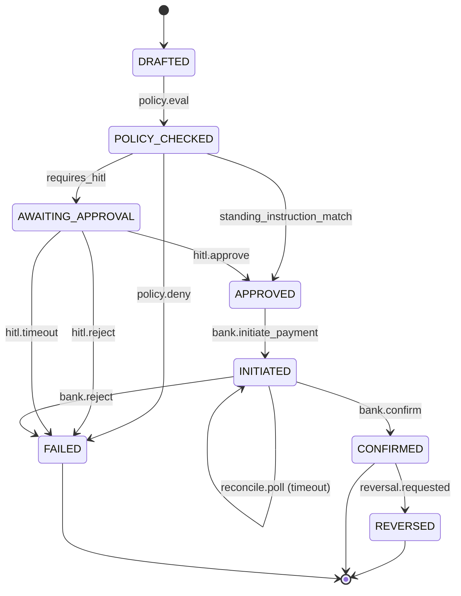
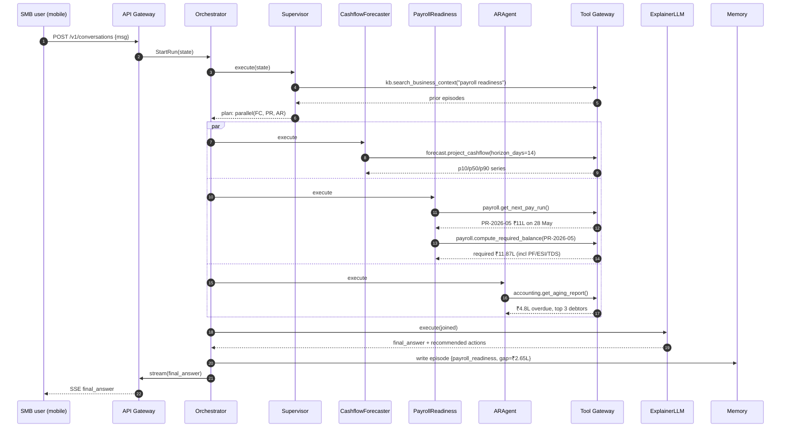
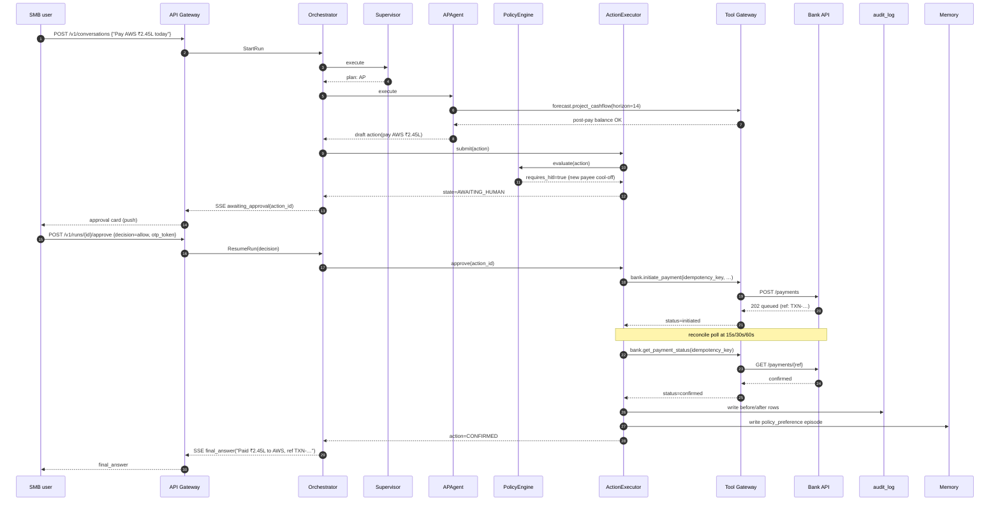

# 05 - Low-Level Design

> Module decomposition, class/interface sketches, run/action state machines, Postgres
> schema, sequence diagrams for the two emblematic flows ("Enough cash for payroll?",
> "Pay vendor X today"), forecast engine internals, memory call sites, and the
> concurrency model.
>
> Anchors:
> - DAG execution + checkpointing + retry semantics for resumable agents - `resume.txt` L52–54;
>   `blackbox-experience.md` #12–15.
> - Tool-calling infrastructure with idempotency and side-effect control - `resume.txt` L51;
>   `blackbox-experience.md` #9, #17.
> - Model router across Claude/GPT/Grok with capability-aware routing - `resume.txt` L55–56;
>   `blackbox-experience.md` #16–19.
> - Deterministic replay via LLMOps telemetry mesh - `resume.txt` L58–59;
>   `blackbox-experience.md` #20.

---

## 1. Module decomposition

| Service | Responsibility | Key classes / interfaces | Key dependencies | Scaling profile |
| --- | --- | --- | --- | --- |
| **API Gateway** | TLS, auth, scope checks, rate limiting, idempotency dedupe, SSE bridge | `AuthInterceptor`, `IdempotencyStore`, `SSEBridge`, `RateLimiter` | Redis (token bucket + idempotency), JWKS, Orchestrator gRPC | Stateless; CPU/network bound; HPA on RPS + p99 latency |
| **Orchestrator** | Run lifecycle, claim/lease, checkpoint write-through, HITL inbox | `RunController`, `RunClaimer`, `HITLInbox`, `CheckpointWriter` | Postgres (`runs`, `run_state`), Kafka (`runs.events`), Agent Runtime gRPC | Stateful (run leases); 3× replicas per region; lease TTL 30s |
| **Agent Runtime** | LangGraph DAG executor; supervisor + specialist nodes; node-level retries | `GraphRuntime`, `Supervisor`, `CashflowForecasterAgent`, `ARAgent`, `APAgent`, `PayrollReadinessAgent`, `TaxGSTAgent`, `WorkingCapitalAdvisorAgent`, `AnomalyExplainerAgent`, `ExplainerLLMNode` | Tool Gateway, Memory Service, Model Router | Single-threaded asyncio per run; horizontal via pod count; carry capacity ≈ 200 concurrent runs/pod |
| **Tool Gateway** | Typed tool registry, schema validation, per-tool idempotency, retry/circuit-breaker, allowed-caller enforcement | `ToolRegistry`, `ToolInvoker`, `CircuitBreaker`, `IdemKeyDeriver`, `PIIRedactor` | Upstream connectors (bank/accounting/payroll/tax/lender), Vault for secrets | Stateless; sharded by `(tenant_id, tool_family)` for fairness |
| **Action Executor** | Saga orchestration for WRITE_IRREVERSIBLE actions; HITL gating; compensation steps | `ActionStateMachine`, `Saga`, `Compensator`, `PolicyEngine` | Postgres (`actions`, `audit_log`), Tool Gateway | Stateful; partitioned by `business_id`; 2-min lease |
| **Forecast Engine** | Deterministic cashflow waterfall + Monte Carlo on uncertain AR | `WaterfallSimulator`, `ARCollectionPrior`, `ScenarioRunner` | Postgres (read replicas), feature store | CPU-bound batch + on-demand; warm cache in Redis (5 min TTL) |
| **Memory Service** | Episode write/read; vector + lexical hybrid search; tenant-scoped indices | `EpisodeWriter`, `MemoryRetriever`, `Summarizer` | Postgres pgvector, ClickHouse for memory-hit telemetry | Read-heavy; per-tenant HNSW indices; horizontal via shard |
| **Ingestion Pipeline** | Webhook ingest → normalization → enrichment → fact tables | `WebhookReceiver`, `Normalizer`, `Categorizer`, `Linker`, `MaterializedViews` | Kafka, Postgres, dbt-style transforms | Throughput-bound; auto-scaled consumer groups; backfill jobs nightly |
| **Model Router** | Capability-aware routing (Claude/GPT/Grok), fallback, cost guardrails, prompt-cache | `Router`, `CapabilityMatcher`, `FallbackChain`, `CostAccountant` | Provider SDKs, Redis (prompt cache), Postgres (cost ledger) | Stateless; per-provider circuit breakers; 1B+ tokens/month design point (`resume.txt` L55–56) |
| **Telemetry Mesh** | OpenTelemetry spans → ClickHouse; deterministic replay artifacts | `SpanCollector`, `ReplayBundler`, `S3Archiver` | ClickHouse, S3 (object lock for SOC-2) | High-throughput append; sampling profile by event class |

---

## 2. Class / interface sketches (Agent Runtime)

```python
from typing import Protocol, Literal
from dataclasses import dataclass

ToolName = str
NodeId   = str

@dataclass
class Budget:
    tokens_used: int = 0
    wall_ms_used: int = 0
    usd_cents_used: int = 0
    max_tokens: int = 60_000
    max_wall_ms: int = 60_000
    max_usd_cents: int = 25
    max_hops: int = 16

@dataclass
class ToolCall:
    call_id: str
    tool: ToolName
    args: dict
    idempotency_key: str
    started_at: float | None = None
    status: Literal["pending","ok","error","timeout"] = "pending"
    result: dict | None = None

@dataclass
class RunState:
    run_id: str
    tenant_id: str
    business_id: str
    version: int
    hop_count: int
    context: dict          # locale, channel, business profile snapshot
    transcript: list[dict] # user/assistant turns
    pending_tool_calls: list[ToolCall]
    scratchpad: dict       # node-local notes; cleared per node exit
    budget: Budget
    graph_version: str
    next_node: NodeId | None
    awaiting_human: dict | None  # {action_id, kind, expires_at}

@dataclass
class NodeOutput:
    next_node: NodeId | None
    state_patch: dict
    tool_calls: list[ToolCall]
    emit_events: list[dict]
    awaiting_human: dict | None = None

class AgentNode(Protocol):
    node_id: NodeId
    allowed_tools: list[ToolName]
    def execute(self, state: RunState) -> NodeOutput: ...

class Supervisor(AgentNode):
    """Intent classification + fan-out planner. Calls `kb.search_business_context`
    early to ground the plan in business memory (see §8 + 13-memory-layer-design.md)."""
    node_id = "supervisor"
    allowed_tools = ["kb.search_business_context"]

class CashflowForecasterAgent(AgentNode):
    """Wraps `forecast.project_cashflow` and explains the waterfall to peers/explainer."""
    node_id = "cashflow_forecaster"
    allowed_tools = ["forecast.project_cashflow", "bank.get_balance",
                     "accounting.get_aging_report"]

class ARAgent(AgentNode):
    node_id = "ar_agent"
    allowed_tools = ["accounting.list_invoices", "accounting.get_aging_report",
                     "accounting.send_invoice_reminder"]

class APAgent(AgentNode):
    node_id = "ap_agent"
    allowed_tools = ["accounting.list_invoices", "bank.get_balance",
                     "forecast.project_cashflow"]

class PayrollReadinessAgent(AgentNode):
    node_id = "payroll_readiness"
    allowed_tools = ["payroll.get_next_pay_run", "payroll.compute_required_balance",
                     "bank.get_balance", "forecast.project_cashflow"]

class TaxGSTAgent(AgentNode):
    node_id = "tax_gst"
    allowed_tools = ["tax.get_upcoming_obligations"]  # tax.file_gstr is ActionExecutor-only

class WorkingCapitalAdvisorAgent(AgentNode):
    node_id = "working_capital"
    allowed_tools = ["lender.get_credit_line_offers", "forecast.project_cashflow",
                     "accounting.get_aging_report"]

class AnomalyExplainerAgent(AgentNode):
    node_id = "anomaly_explainer"
    allowed_tools = ["bank.list_transactions", "kb.search_business_context"]

class ExplainerLLMNode(AgentNode):
    """Terminal node; composes the final answer from joined specialist outputs.
    Uses Model Router with capability hint 'long_reasoning + structured_output'."""
    node_id = "explainer"
    allowed_tools = ["notify.send_to_user"]

class GraphRuntime:
    """Single-threaded asyncio loop per run. Checkpoints after every node exit
    and before/after every tool call. Optimistic concurrency on (run_id, version).
    Mirrors the BlackBox DAG workflow engine (resume.txt L52-54, blackbox-experience.md #12-15)."""
    async def step(self, state: RunState) -> RunState: ...
```

---

## 3. State machine for a Run

States: `CREATED → CONTEXT_LOADED → PLANNING → EXECUTING → AWAITING_HUMAN → RESUMING → SUMMARIZING → COMPLETED / FAILED / CANCELLED`.

Triggers:

| Transition | Trigger |
| --- | --- |
| `CREATED → CONTEXT_LOADED` | Orchestrator hydrates business profile + memory snapshot |
| `CONTEXT_LOADED → PLANNING` | Supervisor enqueued |
| `PLANNING → EXECUTING` | Supervisor returns DAG plan with ≥1 specialist node |
| `EXECUTING → EXECUTING` | Specialist completes; another node still pending |
| `EXECUTING → AWAITING_HUMAN` | ActionExecutor returns `awaiting_approval` |
| `AWAITING_HUMAN → RESUMING` | HITL decision received via `/v1/runs/{id}/approve` |
| `RESUMING → EXECUTING` | Action executed (or compensated) and saga step advanced |
| `EXECUTING → SUMMARIZING` | All specialist outputs joined |
| `SUMMARIZING → COMPLETED` | Explainer emits `final_answer` + memory write succeeds |
| any → `FAILED` | Budget exceeded, guardrail block, irrecoverable upstream |
| any → `CANCELLED` | User or admin cancel; saga compensation kicked off |



---

## 4. State machine for a Payment Action (safety-critical write)

States: `DRAFTED → POLICY_CHECKED → AWAITING_APPROVAL → APPROVED → INITIATED → CONFIRMED / FAILED / REVERSED`.

Saga compensation:

| Step | Compensation on failure |
| --- | --- |
| `POLICY_CHECKED` (denied) | Mark action `FAILED:POLICY_DENY`; emit `policy_block` event; no side effects to undo. |
| `AWAITING_APPROVAL` (timeout) | Mark `FAILED:APPROVAL_TIMEOUT`; notify user; no side effects. |
| `INITIATED` (timeout / ambiguous bank response) | Do NOT retry. Schedule `bank.get_payment_status(idempotency_key)` reconciliation poll for 15s, 30s, 60s, 5min. Resolve to `CONFIRMED` or `FAILED`. |
| `CONFIRMED` (later discovered as fraud / wrong vendor) | Trigger `REVERSED` by issuing a reversal payment with linked `original_action_id` plus customer notification + audit. |



---

## 5. Database schema (Postgres)

Conventions: all tables are tenant-scoped and protected by Row-Level Security. ULIDs as text. JSONB for raw partner payloads. Partitioning by `business_id_hash` + month where called out.

```sql
-- 5.1 Tenancy
CREATE TABLE tenants (
  tenant_id    text PRIMARY KEY,
  plan         text NOT NULL,            -- 'free' | 'growth' | 'scale'
  region       text NOT NULL,            -- 'ap-south-1' | 'us-east-1'
  created_at   timestamptz NOT NULL DEFAULT now()
);
ALTER TABLE tenants ENABLE ROW LEVEL SECURITY;
CREATE POLICY tenants_isolation ON tenants
  USING (tenant_id = current_setting('app.tenant_id'));

CREATE TABLE businesses (
  business_id      text PRIMARY KEY,
  tenant_id        text NOT NULL REFERENCES tenants(tenant_id),
  name             text NOT NULL,
  gstin            text,
  pan              text,
  currency         text NOT NULL DEFAULT 'INR',
  tz               text NOT NULL DEFAULT 'Asia/Kolkata',
  fiscal_year_start date NOT NULL DEFAULT '2026-04-01'
);
CREATE INDEX ON businesses(tenant_id);
ALTER TABLE businesses ENABLE ROW LEVEL SECURITY;
CREATE POLICY biz_isolation ON businesses
  USING (tenant_id = current_setting('app.tenant_id'));

-- 5.2 Source-of-truth financial entities
CREATE TABLE accounts (
  account_id   text PRIMARY KEY,
  business_id  text NOT NULL REFERENCES businesses(business_id),
  source       text NOT NULL,        -- 'plaid' | 'aa_onemoney' | 'razorpay'
  external_id  text NOT NULL,
  kind         text NOT NULL,        -- 'current' | 'savings' | 'cc' | 'wallet'
  currency     text NOT NULL DEFAULT 'INR',
  display_name text,
  created_at   timestamptz NOT NULL DEFAULT now(),
  UNIQUE (source, external_id)
);
CREATE INDEX ON accounts(business_id);

-- transactions: hot table; partitioned by business_id_hash + month
CREATE TABLE transactions (
  txn_id       text NOT NULL,
  account_id   text NOT NULL,
  business_id  text NOT NULL,
  posted_at    timestamptz NOT NULL,
  amount       bigint NOT NULL,         -- minor units, signed (debit -ve)
  currency     text NOT NULL,
  counterparty text,
  category     text,                    -- 'payroll' | 'gst' | 'vendor' | 'ar_inflow' | ...
  status       text NOT NULL,           -- 'posted' | 'pending' | 'reversed'
  raw          jsonb NOT NULL,
  PRIMARY KEY (business_id, posted_at, txn_id)
) PARTITION BY HASH (business_id);
-- per-hash subpartitions by RANGE(posted_at), monthly. 64 hash buckets × 12 months.
CREATE INDEX ON transactions (business_id, posted_at DESC);
CREATE INDEX ON transactions (business_id, category, posted_at DESC);

CREATE TABLE invoices (
  invoice_id      text PRIMARY KEY,
  business_id     text NOT NULL,
  type            text NOT NULL,        -- 'AR' | 'AP'
  counterparty_id text,
  issued_at       date NOT NULL,
  due_at          date NOT NULL,
  amount          bigint NOT NULL,
  currency        text NOT NULL,
  status          text NOT NULL,        -- 'draft' | 'sent' | 'paid' | 'overdue' | 'cancelled'
  ocr             jsonb,
  updated_at      timestamptz NOT NULL DEFAULT now()
);
CREATE INDEX ON invoices(business_id, status, due_at);
CREATE INDEX ON invoices(business_id, type, due_at);

CREATE TABLE payroll_runs (
  payrun_id     text PRIMARY KEY,
  business_id   text NOT NULL,
  scheduled_for date NOT NULL,
  total_amount  bigint NOT NULL,
  status        text NOT NULL,         -- 'scheduled' | 'confirmed' | 'paid' | 'cancelled'
  raw           jsonb
);
CREATE INDEX ON payroll_runs(business_id, scheduled_for);

-- 5.3 Run + agent state
CREATE TABLE runs (
  run_id        text PRIMARY KEY,
  business_id   text NOT NULL,
  tenant_id     text NOT NULL,
  status        text NOT NULL,         -- enum from §3
  graph_version text NOT NULL,
  hop_count     int  NOT NULL DEFAULT 0,
  token_used    int  NOT NULL DEFAULT 0,
  usd_cents     int  NOT NULL DEFAULT 0,
  budget        jsonb NOT NULL,
  claimed_by    text,                  -- pod-id of current owner
  claim_expires timestamptz,
  created_at    timestamptz NOT NULL DEFAULT now(),
  updated_at    timestamptz NOT NULL DEFAULT now()
);
CREATE INDEX ON runs(business_id, status);
CREATE INDEX ON runs(status, claim_expires) WHERE status IN ('queued','running');

-- append-only checkpoint log; latest by max(version)
CREATE TABLE run_state (
  run_id        text NOT NULL,
  version       bigint NOT NULL,
  state         jsonb NOT NULL,
  checkpoint_at timestamptz NOT NULL DEFAULT now(),
  PRIMARY KEY (run_id, version)
);

CREATE TABLE tool_calls (
  call_id         text PRIMARY KEY,
  run_id          text NOT NULL,
  node_id         text NOT NULL,
  tool_name       text NOT NULL,
  idempotency_key text NOT NULL,
  request         jsonb NOT NULL,
  response        jsonb,
  status          text NOT NULL,        -- 'pending' | 'ok' | 'error' | 'timeout'
  latency_ms      int,
  started_at      timestamptz NOT NULL DEFAULT now(),
  UNIQUE (idempotency_key)
);
CREATE INDEX ON tool_calls(run_id, started_at);

-- 5.4 Saga + audit
CREATE TABLE actions (
  action_id          text PRIMARY KEY,
  run_id             text NOT NULL,
  business_id        text NOT NULL,
  tool_name          text NOT NULL,
  status             text NOT NULL,     -- enum from §4
  idempotency_key    text NOT NULL,
  compensation_state jsonb,
  request            jsonb NOT NULL,
  result             jsonb,
  created_at         timestamptz NOT NULL DEFAULT now(),
  updated_at         timestamptz NOT NULL DEFAULT now(),
  UNIQUE (business_id, idempotency_key)
);
CREATE INDEX ON actions(business_id, status);

CREATE TABLE audit_log (
  audit_id    bigserial PRIMARY KEY,
  business_id text NOT NULL,
  actor       text NOT NULL,            -- 'user:u_…' | 'agent:node_id' | 'system'
  action      text NOT NULL,            -- 'payment.initiated' | 'invoice.reminder.sent' | …
  target      text,                     -- entity id
  before      jsonb,
  after       jsonb,
  at          timestamptz NOT NULL DEFAULT now()
) PARTITION BY RANGE (at);
-- monthly partitions; >90 days archived to S3 with object lock (SOC-2 evidence,
-- mirroring the sandbox/audit pattern from blackbox-experience.md #5).
CREATE INDEX ON audit_log(business_id, at DESC);

-- 5.5 Memory
CREATE EXTENSION IF NOT EXISTS vector;
CREATE TABLE memory_episodes (
  episode_id  text PRIMARY KEY,
  business_id text NOT NULL,
  summary     text NOT NULL,
  embedding   vector(1536) NOT NULL,
  importance  real NOT NULL DEFAULT 0.5,
  tags        text[] NOT NULL DEFAULT '{}',
  source_run  text,
  created_at  timestamptz NOT NULL DEFAULT now()
);
CREATE INDEX ON memory_episodes
  USING hnsw (embedding vector_cosine_ops) WITH (m=16, ef_construction=200);
CREATE INDEX ON memory_episodes(business_id, created_at DESC);

-- 5.6 Inbound webhook dedupe
CREATE TABLE inbound_events (
  source     text NOT NULL,
  event_id   text NOT NULL,
  received_at timestamptz NOT NULL DEFAULT now(),
  body_sha   text NOT NULL,
  PRIMARY KEY (source, event_id)
);
```

Index / partitioning notes:
- `transactions` is the hottest table: hash-by-business avoids per-tenant hotspots; monthly range subpartitions let us drop or archive old months cheaply.
- `runs(status, claim_expires)` partial index drives the `SELECT FOR UPDATE SKIP LOCKED` worker claim in §9 efficiently.
- `tool_calls.idempotency_key UNIQUE` is the storage-layer enforcement of §4 of `04-api-and-contracts.md`.
- `audit_log` is append-only + partitioned + archived; >90 days lives in S3 (object-locked) for SOC-2 (`blackbox-experience.md` #5).
- `memory_episodes` uses pgvector HNSW; per-tenant scope is enforced by RLS on `business_id`.

---

## 6. Sequence diagrams

### 6.1 "Will I have enough cash for payroll on the 28th?"



### 6.2 "Pay vendor X ₹2L today"



---

## 7. Forecast engine internals

**Inputs**
- Opening balance: latest reconciled balance across all `accounts` for the business (sum, INR).
- Scheduled inflows:
  - AR aged buckets from `invoices` (type=AR, status∈{sent,overdue}), grouped by `due_at`.
  - Recurring deposits from labeled `transactions` (category=`ar_inflow`, periodicity detector).
- Scheduled outflows:
  - AP from `invoices` (type=AP, status=sent) by `due_at`.
  - Upcoming `payroll_runs` by `scheduled_for` (gross + statutory PF/ESI/TDS).
  - Tax obligations: `tax.get_upcoming_obligations` (GSTR-3B, advance tax, TDS).
  - Recurring vendor SIPs detected from category=`vendor` periodicity.

**Method**
1. **Deterministic waterfall** per day for the next `H` days. Start from opening balance; for each day apply known inflows/outflows whose `due_at` ≤ that day. Produces the `p50_known` series.
2. **Monte Carlo on uncertain AR collection**. For each open AR invoice, sample collection-day from a per-debtor prior fitted on the last 12 months of `transactions ↔ invoices` linkage (default prior: Gamma fit on observed days-late). Run `N=2000` sims; aggregate per-day percentiles (p10/p50/p90).
3. **Stress scenarios** add deterministic shifts: `stress` halves AR collections in the horizon; `vendor_delay` slides selectable AP buckets by `+15d`.

**Output**
- Per-day record: `{date, p10, p50, p90, known_inflows, known_outflows}`.
- `key_events`: scheduled payroll, GST due dates, large AP/AR singletons.
- `confidence` band per event: `scheduled` (known amount + date), `p50_estimate` (sampled).

**Why deterministic-first + LLM-explainer (NOT LLM-projection)**
- Bounded error: numbers come from arithmetic and well-priored sampling, not from a generative model that can hallucinate ₹50L into existence.
- Auditability: every cell in the series traces back to specific rows in `transactions`, `invoices`, `payroll_runs`, `tax.get_upcoming_obligations`. SOC-2 wants reproducibility; LLM projections do not give it (`blackbox-experience.md` #5, #8).
- Reproducibility: forecast is content-hashed (`hash(opening, schedule, priors, scenario)`), cacheable for 5 minutes, and replays identically. The LLM is invoked only to *explain* the numbers in plain English - same telemetry/replay pattern from the BlackBox LLMOps mesh (`resume.txt` L58–59).

---

## 8. Memory write / read paths

Full details live in `13-memory-layer-design.md`. The call sites that touch the runtime are:

- **Read - Supervisor (early in plan)**: `kb.search_business_context(query=user_msg, top_k=6, filters={business_id})` runs against `memory_episodes` HNSW + lexical hybrid. Hit episodes seed the supervisor's plan ("last time we delayed AWS, customer approved") and are pinned into `state.scratchpad.memory_hits`.
- **Read - Specialist nodes**: `AnomalyExplainerAgent` and `WorkingCapitalAdvisorAgent` re-query memory with their own query reformulations (richer than the user's wording) - only their own scoped filters.
- **Write - Post-run summarizer (during `SUMMARIZING`)**: emits one `memory_episode` row with a 1–2 sentence summary + tags `{payroll_readiness, gap, recommendation_accepted?}` and an importance score (0..1) derived from heuristics (HITL involved, action executed, anomaly explained).
- **Write - HITL approval**: every approval/rejection writes a `policy_preference` episode (`{tag: 'policy_preference', vendor: 'AWS', decision: 'allow', amount_band: '1–3L', actor: 'user:u_owner'}`). The PolicyEngine reads these on subsequent runs to suggest standing-instruction promotions.

Cross-tenant isolation: every read/write is wrapped by RLS via `SET LOCAL app.tenant_id`; the Memory Service rejects calls whose `business_id` doesn't resolve under the active tenant.

---

## 9. Concurrency model

- **One asyncio loop per run, single-threaded.** Each agent worker pod owns a pool of asyncio tasks; each task drives one run end-to-end (or to the next checkpoint). The graph is concurrent *within* a run via `asyncio.gather` on independent specialist sub-graphs (e.g., FC/PR/AR in §6.1). No shared mutable state across runs.
- **Horizontal scale via K8s pod count.** Workers are stateless beyond their currently-leased runs; HPA on `pending_runs` (Postgres gauge) + CPU.
- **Run claim with `SELECT … FOR UPDATE SKIP LOCKED`.**

  ```sql
  WITH claimed AS (
    SELECT run_id FROM runs
    WHERE status IN ('queued','running')
      AND (claim_expires IS NULL OR claim_expires < now())
    ORDER BY updated_at
    LIMIT 1
    FOR UPDATE SKIP LOCKED
  )
  UPDATE runs r
     SET claimed_by = $worker_id,
         claim_expires = now() + interval '30 seconds',
         status = 'running',
         updated_at = now()
    FROM claimed
   WHERE r.run_id = claimed.run_id
  RETURNING r.run_id;
  ```

  Lease TTL 30s; the worker heartbeats by re-running the `UPDATE` every 10s. A crash leaves the row reclaimable in ≤30s, after which any worker picks it up and `Resume`s from the latest `run_state.version` - this is the same DAG resume semantics from BlackBox (`resume.txt` L52–54; `blackbox-experience.md` #15).
- **Specialist sub-graphs run as coroutines under the supervisor**; per-coroutine deadlines are derived from `state.budget.max_wall_ms - elapsed`. Cancellation is cooperative: when budget is exhausted, the supervisor cancels outstanding coroutines and emits a `BUDGET_EXCEEDED_*` error.
- **Backpressure to upstream tools** lives in the Tool Gateway (circuit breaker + token-bucket per tool family) so a slow bank does not starve unrelated runs.
- **Action Executor** runs on a separate pool with longer leases (2 min) because saga steps may wait for HITL or bank confirmation. The agent worker that submitted the action is free to release the run lease and return - the orchestrator wakes a (possibly different) worker on `RESUMING`.

---

## 10. Anchoring summary

| Design choice | Resume anchor |
| --- | --- |
| Append-only `run_state` checkpoint log + version-based optimistic concurrency | `resume.txt` L52–54; `blackbox-experience.md` #12–15 |
| Tool registry with allowed-caller-nodes + per-tool idempotency key derivation | `resume.txt` L51; `blackbox-experience.md` #9, #17 |
| ExplainerLLMNode uses model router with capability hints; specialist nodes use cheaper models | `resume.txt` L55–56; `blackbox-experience.md` #16–19 |
| Forecast engine deterministic-first; LLM only explains (auditability + replay) | `resume.txt` L58–59; `blackbox-experience.md` #8, #20 |
| `SELECT FOR UPDATE SKIP LOCKED` claim + lease + Resume from latest checkpoint | `resume.txt` L52–54; `blackbox-experience.md` #15 |
| Audit log append-only + S3 object-lock archive for SOC-2 | `blackbox-experience.md` #5 |
| Memory read at Supervisor, write at Summarizer + HITL - tenant-scoped via RLS | `blackbox-experience.md` #14, #21–22 |
