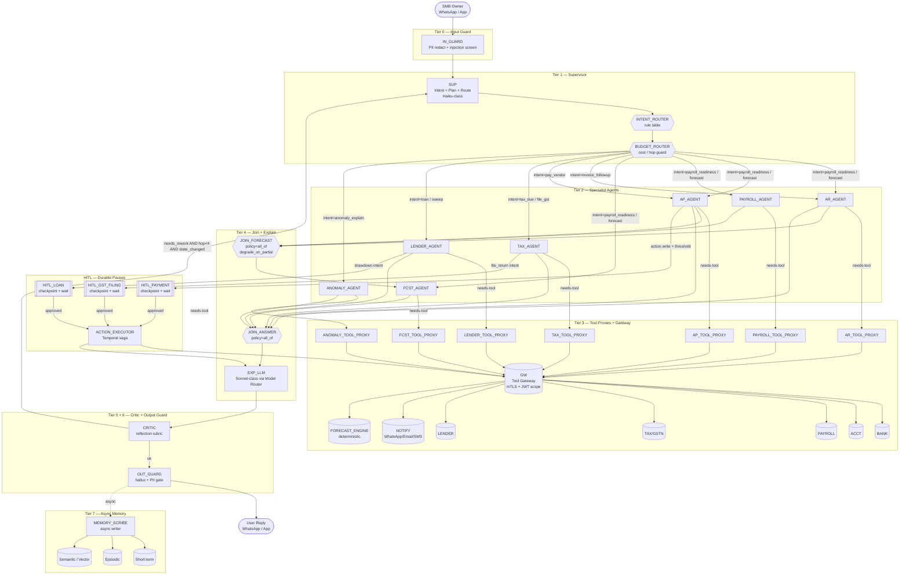

# 12 — Agentic Graph Structure (Two-Layer Deep Dive)

This document is the canonical agentic-graph reference for the AI Banker for SMB owners. It is written in **two layers** and split across two lanes:

- **Layer 1 — Graph Topology** (this lane): node taxonomy, edge taxonomy, supervisor/worker/tool-caller hierarchy, the full Mermaid graph, three traversal examples, graph version metadata, and the rationale for the chosen topology.
- **Layer 2 — Per-Node State and Edge Conditions** (Lane 12, appended below): per-node checkpointed state shapes, edge condition logic, parallel join semantics, and HITL interrupt/resume contracts.

The topology is anchored on the BlackBox agentic platform that ran LangGraph/LangChain ReAct + DAG orchestration with durable execution at 10K+ runs/day, memory persistence, and a multi-model router across Claude/GPT/Grok (resume.txt L51-56). Tool-authority enforcement and WASM-sandboxed deterministic execution patterns are reused from the same lineage (resume.txt L49-50; blackbox-experience.md #6, #9).

Node IDs in this file are kept **consistent with `03-architecture.md`**. Where 03-architecture uses bare service-style names for agent roles (`SUP`, `AR`, `AP`, `TAX`, `FCST_A`, `EXP`, `GW`, etc.), this file uses the **`_AGENT` suffix form** (`AR_AGENT`, `AP_AGENT`, `PAYROLL_AGENT`, `TAX_AGENT`, `LENDER_AGENT`, `ANOMALY_AGENT`, `FCST_AGENT`) to disambiguate the *agent node* from the *physical microservice* of the same domain. `SUP`, `EXP`, `GW`, `BANK`, `ACCT`, `PAYROLL`, `LENDER`, `NOTIFY` are kept identical.

---

## 1. Node Type Taxonomy

| Node Type | Role | Example Node IDs | LLM-backed or Deterministic |
|---|---|---|---|
| Planner (Supervisor) | Classifies user intent, plans fan-out / fan-in, owns routing decisions, holds no direct tool authority | `SUP` | LLM-backed (Haiku-class small model for intent + plan; structured output) |
| Executor (Specialist) | Owns one financial domain; produces intermediate domain answers; bounded tool allow-list | `AR_AGENT`, `AP_AGENT`, `PAYROLL_AGENT`, `TAX_AGENT`, `LENDER_AGENT`, `ANOMALY_AGENT`, `FCST_AGENT` | LLM-backed (Sonnet/GPT-4-class via model router) with structured-output tool calls; `FCST_AGENT` is LLM-thin + deterministic forecast engine call |
| Critic | Reflection / self-check over final answer; can request rework | `CRITIC` | LLM-backed (cheap reflection model with rubric prompt) |
| Router | Deterministic conditional dispatch from a rule / classifier output | `INTENT_ROUTER`, `BUDGET_ROUTER` | Deterministic (rule table + score thresholds; uses supervisor's structured output) |
| Tool-caller | Typed wrapper that calls the tool gateway with capability-scoped JWT; one per specialist | `AR_TOOL_PROXY`, `AP_TOOL_PROXY`, `PAYROLL_TOOL_PROXY`, `TAX_TOOL_PROXY`, `LENDER_TOOL_PROXY`, `ANOMALY_TOOL_PROXY`, `FCST_TOOL_PROXY` | Deterministic (no LLM; schema-validated JSON-RPC over mTLS to `GW`) |
| Human-in-loop | Durable pause node that suspends run and waits on owner approval | `HITL_PAYMENT`, `HITL_LOAN`, `HITL_GST_FILING` | Deterministic (writes interrupt checkpoint; waits on approval webhook) |
| Aggregator | Joins parallel subgraph outputs under a named join policy | `JOIN_FORECAST`, `JOIN_ANSWER` | Deterministic (typed merge + policy: all-of / any-of / first-success / majority-vote) |
| Explainer | Converts deterministic / structured outputs into natural-language reply (WhatsApp / app card) | `EXP_LLM` | LLM-backed (Sonnet-class via model router; resume.txt L55-56) |
| Memory-write | Post-run summarizer that writes short-term, episodic, and semantic memory | `MEMORY_SCRIBE` | LLM-backed (cheap summarizer; runs async off the critical path) |
| Guardrail | Input/output safety, PII redaction, prompt-injection screen | `IN_GUARD`, `OUT_GUARD` | Deterministic + small classifier (see `15-guardrails.md` for full policy; this node is just the graph hook) |

---

## 2. Edge Type Taxonomy

| Edge Type | Semantics | Example Transitions | Guard Logic |
|---|---|---|---|
| Sequential | Straight-line transition, no branching | `USER → IN_GUARD → SUP`; `OUT_GUARD → USER_RESPONSE` | None; always taken |
| Conditional | Branch on classifier output, structured-output schema field, or rule table | `SUP → AR_AGENT` (if `intent=invoice_followup`); `SUP → LENDER_AGENT` (if `intent=loan`) | `state.plan.route == <target_id>` AND `state.plan.confidence >= 0.55`; ties broken by rule table |
| Parallel-fork | Supervisor fans out to N specialists with **shared state-fork**: each child gets a deep-copied immutable view of `state.context` and writes only to its own namespaced `state.outputs[<agent_id>]` | `SUP → {AR_AGENT, AP_AGENT, PAYROLL_AGENT, FCST_AGENT}` on `intent=payroll_readiness` | Fork allowed only if `hop_counter < N_max` AND fan-out width ≤ 6; per-child timeout 8s |
| Parallel-join | Aggregator collects N outputs under a named join policy | `{AR_AGENT, AP_AGENT, PAYROLL_AGENT} → JOIN_FORECAST → FCST_AGENT`; `{*} → JOIN_ANSWER → EXP_LLM` | Policy ∈ {`all_of`, `any_of`, `first_success`, `majority_vote`}. Default `all_of` with `degrade_on_partial=true` after timeout — partial join is recorded and a degraded flag is propagated |
| Back-edge with guard | Specialist or critic returns control to supervisor for a new ReAct iteration | `CRITIC -- needs_rework --> SUP`; `<agent> -- needs_more_context --> SUP` | `hop_counter < N` (N=4 per run) AND `state_changed == true` (the run has produced *new* observations since last visit, else we abort to prevent loop-of-doom; aligns with blackbox-experience.md #18) |
| Halt-to-human | Any executor or critic can route to a HITL node when a policy trigger fires | `AP_AGENT → HITL_PAYMENT`; `LENDER_AGENT → HITL_LOAN`; `TAX_AGENT → HITL_GST_FILING` | Trigger = `action.value ≥ policy_threshold` OR `action.class ∈ {write, payment, file}` OR `risk_score ≥ τ`. Resume on signed approval webhook with replay-safe idempotency key |

---

## 3. Supervisor / Worker / Tool-Caller Hierarchy

```
┌─────────────────────────────────────────────────────────────────────────────┐
│ Tier 0  IN_GUARD              (input safety, PII redact, injection screen)  │
├─────────────────────────────────────────────────────────────────────────────┤
│ Tier 1  SUP                   (supervisor; intent + plan + route; tools=∅)  │
├─────────────────────────────────────────────────────────────────────────────┤
│ Tier 2  AR_AGENT  AP_AGENT  PAYROLL_AGENT  TAX_AGENT                        │
│         LENDER_AGENT  ANOMALY_AGENT  FCST_AGENT                             │
│         (specialists; each with scoped tool allow-list)                     │
├─────────────────────────────────────────────────────────────────────────────┤
│ Tier 3  *_TOOL_PROXY          (typed wrapper; no LLM; gateway JWT)          │
├─────────────────────────────────────────────────────────────────────────────┤
│ Tier 4  EXP_LLM               (explainer; structured → NL)                  │
├─────────────────────────────────────────────────────────────────────────────┤
│ Tier 5  CRITIC                (reflection; can route back to SUP)           │
├─────────────────────────────────────────────────────────────────────────────┤
│ Tier 6  OUT_GUARD             (output safety, hallucination + PII gate)     │
├─────────────────────────────────────────────────────────────────────────────┤
│ Tier 7  MEMORY_SCRIBE         (async post-run; never blocks reply)          │
└─────────────────────────────────────────────────────────────────────────────┘
```

| Tier | Node(s) | Owns | Allowed Tools | Failure Domain |
|---|---|---|---|---|
| 0 | `IN_GUARD` | Pre-supervisor input safety, PII redaction, prompt-injection screen | none | Fail-closed → polite refusal |
| 1 | `SUP` | Intent classification, plan synthesis, routing decisions | **none directly** — only the routing edge | Fail → bounded retry, then drop to `OUT_GUARD` with degraded mode |
| 2 | `AR_AGENT` | Invoice / receivables reasoning | `ar.list_invoices`, `ar.send_reminder` (write → HITL) | Specialist isolated; sibling failure does not abort siblings |
| 2 | `AP_AGENT` | Vendor / payables reasoning | `ap.list_bills`, `ap.schedule_payment` (write → HITL) | Same |
| 2 | `PAYROLL_AGENT` | Payroll runs, headcount, dues | `payroll.read_run`, `payroll.read_schedule` | Same |
| 2 | `TAX_AGENT` | GST / tax dues, filings | `tax.read_dues`, `tax.file_return` (write → HITL) | Same |
| 2 | `LENDER_AGENT` | Loan eligibility, sweep, drawdown | `lender.quote`, `lender.drawdown` (write → HITL) | Same |
| 2 | `ANOMALY_AGENT` | Variance explanation, transaction inspection | `bank.list_tx`, `forecast.read_expected` | Same |
| 2 | `FCST_AGENT` | Cashflow forecast composition | `forecast.compute`, `forecast.read_history` | Same |
| 3 | `*_TOOL_PROXY` | Typed JSON-RPC call to `GW`; signs request with capability-scoped JWT | per parent agent | Tool error surfaces as observation, not exception |
| 4 | `EXP_LLM` | Structured outputs → natural language; chooses channel template (WhatsApp / card) | none | Fail → fall back to deterministic template renderer |
| 5 | `CRITIC` | Reflection over `{question, plan, evidence, draft_answer}`; emits `{ok | needs_rework, critique}` | none | Fail → assume `ok` (do-no-harm); record telemetry |
| 6 | `OUT_GUARD` | Output safety, hallucination check vs. evidence, PII gate | none | Fail-closed → degraded canned reply |
| 7 | `MEMORY_SCRIBE` | Writes short-term, episodic, and semantic memory; runs on a separate worker | memory writers | Fail → retried with backoff; never blocks user reply |

**Tool authority is enforced at the graph level by the tool gateway, not by the LLM prompt.** Every `*_TOOL_PROXY → GW` call carries a capability-scoped JWT whose `scope` claim is restricted to the parent agent's allow-list; the gateway rejects out-of-scope calls. This is the same pattern used at BlackBox to keep ReAct agents from breaking the trust boundary regardless of what the LLM "decided" to call (resume.txt L51-56; blackbox-experience.md #6, #9, #19). The LLM cannot escalate by asking nicely — the JWT physically does not let it.

---

## 4. Full Mermaid Graph



Notes on the graph:

- `INTENT_ROUTER` and `BUDGET_ROUTER` are drawn as separate router nodes for clarity; in the runtime they are conditional edges evaluated from `SUP`'s structured output (`{intent, plan, confidence, est_cost_tokens}`). They are first-class for telemetry — every routing decision is a span with classifier scores attached (resume.txt L58-59).
- Every `*_TOOL_PROXY → GW` arrow is the **only** path from an agent to the outside world. There is no agent-to-external direct edge anywhere in the graph; this is the trust boundary.
- `JOIN_FORECAST` is a *typed* join: AR contributes expected receivables with per-invoice confidence, AP contributes scheduled outflows, PAYROLL contributes the payroll-window obligation. `FCST_AGENT` is the only consumer.
- The `CRITIC → SUP` back-edge has a hop guard (`hop < 4`) AND a state-change guard (`state_changed == true`). Both are required to prevent runaway ReAct loops, which is the failure mode called out in blackbox-experience.md #18.
- `MEMORY_SCRIBE` is reached by a dashed async edge from `OUT_GUARD`. Latency-critical path ends at `USER_RESPONSE`; memory writes happen on a separate worker queue.

---

## 5. Graph Traversal Examples

### 5.1 "Will I have enough cash for payroll on the 28th?"

Intent: `payroll_readiness`. This is the canonical fan-out case.

```
USER
  → IN_GUARD                                  (pass; PII none; injection score=0.02)
  → SUP                                       (Haiku classifies intent=payroll_readiness, conf=0.91; plan = fan-out)
  → INTENT_ROUTER → BUDGET_ROUTER             (hop=0, est_cost=4.1k tok, within budget)
  → fork[FCST_AGENT, AR_AGENT, AP_AGENT, PAYROLL_AGENT]
        AR_AGENT      → AR_TOOL_PROXY → GW → ACCT  (expected receivables to 28th)
        AP_AGENT      → AP_TOOL_PROXY → GW → ACCT  (scheduled outflows to 28th)
        PAYROLL_AGENT → PAY_TOOL_PROXY → GW → PAYROLL (payroll-window obligation)
        FCST_AGENT    → FCST_TOOL_PROXY → GW → BANK + FCST_ENG (current balance + curve)
  → JOIN_FORECAST                             (policy=all_of; all 3 of AR/AP/PAYROLL returned in 1.4s)
  → FCST_AGENT                                (composes runway curve; verdict: shortfall ₹0.8L on 27th)
  → JOIN_ANSWER                               (single contributor; FCST_AGENT)
  → EXP_LLM                                   (renders WhatsApp card: "Tight. ₹0.8L short on 27th. 3 levers ...")
  → CRITIC                                    (rubric: grounded? yes; numbers cited? yes; action suggested? yes → ok)
  → OUT_GUARD                                 (PII pass; halluc gate pass)
  → USER_RESPONSE
  ⇢ MEMORY_SCRIBE (async)                     (writes episodic: "payroll readiness query, shortfall flagged")
```

### 5.2 "Pay vendor X ₹2L today"

Intent: `pay_vendor` with a **write action above threshold** → durable HITL pause.

```
USER
  → IN_GUARD                                  (pass)
  → SUP                                       (intent=pay_vendor, conf=0.94; entity=vendor_X, amount=₹2,00,000)
  → BUDGET_ROUTER → AP_AGENT
  → AP_AGENT                                  (policy_check: amount ≥ ₹50k threshold → require approval)
        → AP_TOOL_PROXY → GW → ACCT           (verify vendor_X exists, bank details, recent invoice match)
        → AP_TOOL_PROXY → GW → BANK           (verify sufficient balance + idempotency-key reservation)
  → HITL_PAYMENT                              (DURABLE PAUSE; checkpoint written; WhatsApp approval card sent)
  ─── run suspended; durable state in checkpoint store; worker can crash and another picks up ───
  ── owner taps "Approve" ──
  → HITL_PAYMENT.resume                       (approval signature + idempotency key validated)
  → ACTION_EXECUTOR                           (Temporal saga: reserve → execute → reconcile; compensation = void)
        → GW → BANK                           (execute_payment with idempotency_key)
        → GW → ACCT                           (post journal entry)
        → GW → NOTIFY                         (vendor receipt)
  → EXP_LLM                                   ("Paid ₹2L to Vendor X. UTR: ...; updated runway: ...")
  → OUT_GUARD → USER_RESPONSE
  ⇢ MEMORY_SCRIBE (async)                     (episodic + semantic: vendor_X payment cadence)
```

The pause is a **first-class graph node**, not a callback. Run state is checkpointed so the run survives worker crashes between approval-send and approval-receipt. This is the durable-execution pattern from resume.txt L52-54.

### 5.3 "Why is cash lower than expected?"

Intent: `anomaly_explain`. This is the case that exercises the **back-edge with guard**.

```
USER
  → IN_GUARD                                  (pass)
  → SUP                                       (intent=anomaly_explain, conf=0.82; hop_counter=0)
  → BUDGET_ROUTER → ANOMALY_AGENT
  → ANOMALY_AGENT                             (round 1: pulls last-30d transactions vs forecast)
        → ANO_TOOL_PROXY → GW → BANK          (list_tx last 30d)
        → ANO_TOOL_PROXY → GW → FCST_ENG      (read expected curve)
        → draft: "I see variance but cannot isolate the driver"
  → JOIN_ANSWER → EXP_LLM → CRITIC            (rubric fail: "evidence does not isolate a driver"; needs_rework)
  → CRITIC -- needs_rework AND hop<4 AND state_changed --> SUP
  → SUP                                       (refines plan: split tx by category and counterparty; hop_counter=1)
  → ANOMALY_AGENT (round 2)
        → ANO_TOOL_PROXY → GW → ACCT          (category breakdown)
        → ANO_TOOL_PROXY → GW → BANK          (top counterparties last 7d)
        → identifies: ₹3.1L outflow to Counterparty_Z = vendor prepayment, +1 week early
  → JOIN_ANSWER → EXP_LLM
  → CRITIC                                    (ok: grounded, isolated driver, evidence cited)
  → OUT_GUARD → USER_RESPONSE
  ⇢ MEMORY_SCRIBE (async)                     (episodic: anomaly-explain pattern; semantic: counterparty_Z early-pay tendency)
```

If the back-edge had been taken without the `state_changed` guard, the same prompt would have replayed indefinitely on identical observations — the classic loop-of-doom (blackbox-experience.md #18). The guard requires that round 2 produced *new* observations vs. round 1; otherwise the run aborts to `OUT_GUARD` with a degraded "I could not confidently explain the variance" reply.

---

## 6. Graph Version Metadata

Every graph definition is published with a semver tag and pinned per run.

| Field | Value / Example | Notes |
|---|---|---|
| `graph_version` | `graph_v1.4.2` | semver: major = topology break, minor = node add / edge add, patch = guard / threshold tweak |
| `run.graph_version` | pinned on run creation | In-flight runs **do not migrate** mid-flight; they finish on the version they started under |
| `latest_version` | served to new runs | Set by control-plane flag; rollback is a single flag flip |
| `support_window` | ≥ 30 days after a version becomes non-current | Older runs continue to resolve their checkpoints against the pinned version |
| `compatibility_migration` | only for structurally compatible changes (added optional state keys, relaxed guards, additive nodes downstream of current frontier) | Breaking changes (renamed nodes, deleted edges upstream of in-flight frontier) are **never** auto-migrated; affected runs run to completion on old version |
| `deprecation_path` | mark `deprecated_at` → stop new runs after T+30d → reap after the longest-living checkpoint TTL expires | Aligns with BlackBox durable-execution guarantees (resume.txt L52-54): resumable agents survive infra and graph changes |
| `dual-write window` | 7 days minimum | New checkpoints written in both old and new schema during transition |
| `audit` | each run-record stores `{graph_version, model_router_version, prompt_version, policy_version}` | Required for deterministic replay (resume.txt L58-59) |

Rollout discipline: a new `graph_vN+1` is shadowed first (replay last 24h of runs and diff outputs against current), then canaried at 1% → 5% → 25% → 100% over 72h, gated on three SLOs: critic-rework-rate, HITL-false-trigger-rate, and p95 end-to-end latency.

---

## 7. Why This Topology (Decisions)

- **Supervisor + specialists over single mega-agent.** Limits tool authority at the **graph layer**, not at the LLM prompt. A specialist with a JWT scoped to `payroll.read_*` physically cannot call `bank.transfer` no matter what the model "decides" — the gateway rejects the call. This is the trust-boundary pattern proven at BlackBox (resume.txt L51, L55-56; blackbox-experience.md #6, #9, #19). It also makes per-domain prompt versioning, per-domain eval, and per-domain rollback tractable.
- **Critic in the loop, with hop + state guards.** Accepts ~600ms p95 of added latency in exchange for bounded hallucination and bounded loop length. The two-condition back-edge guard (`hop < 4` AND `state_changed`) is non-negotiable; without `state_changed`, ReAct loops can replay identical observations forever (blackbox-experience.md #18).
- **HITL nodes are first-class graph nodes.** Not callbacks, not "pause and call back later" patterns. They write a durable checkpoint, suspend the run, and a different worker can resume after the approval webhook arrives. This is what makes "approve payment in 3 hours" survive a fleet rolling deploy. Durable execution semantics anchor on resume.txt L52-54.
- **Memory scribe is asynchronous.** It does not sit on the critical path of `USER → USER_RESPONSE`. Memory writes can lag by seconds and are bounded by a worker pool; they retry independently. This protects p95 reply latency at the cost of slightly stale memory for the *next immediate* turn (mitigated by a thin in-request short-term cache).
- **Tool proxy nodes are deterministic wrappers, not LLMs.** This keeps the LLM agents free of credential and routing concerns and centralizes mTLS, retry, rate-limit, and idempotency policy in one place — the gateway path is the only place where a tenant's bank token is materialized.
- **Joins are typed, named, and policy-tagged.** A `JOIN_FORECAST` with `degrade_on_partial=true` makes the contract explicit: if AR is slow but AP and PAYROLL returned, we degrade gracefully and mark the answer with `confidence=degraded`. Without that, fan-out becomes a hidden source of tail-latency amplification at 1M SMBs.
- **Two routers between SUP and specialists.** `INTENT_ROUTER` is about *what* (rule table over structured intent); `BUDGET_ROUTER` is about *whether* (hop counter, token cost forecast, model-router budget). Separating them lets us tune cost without touching intent semantics — a meaningful decoupling at 1B+ tokens/month spend (resume.txt L55-56).

---

## Layer 2 — Per-Node State and Edge Conditions

Layer 1 fixed the topology, the tier hierarchy, and the version contract. Layer 2 is the per-node implementation reference: every checkpointed key with its type and durability class, every conditional/back-edge with its exact trigger expression, every join with its policy and timeout, and every HITL pause with its complete interrupt/resume contract. The checkpointing model below is the same Postgres-backed durable-execution pattern that powers `LangGraph` durable runs at BlackBox at ~10K agent runs/day (resume.txt L51-54), with the per-tenant memory persistence model from blackbox-experience.md #14 reused for `MEMORY_SCRIBE`.

### State Durability Classes

Three durability classes are used throughout the tables below. They are graph-engine primitives, not application code:

| Class | Storage | Survives | Lost On | Typical Use |
|---|---|---|---|---|
| `durable` | Postgres `agent_checkpoint` table, one row per `(run_id, node_id, version)`; write-through on node entry/exit | Coordinator crash, fleet roll, HITL pause of arbitrary duration | TTL expiry (90d default for completed runs; ∞ for HITL-waiting runs until timeout) | Run-level facts, plan, hop counter, all approval payloads, audit lineage |
| `run_scoped_ephemeral` | In-process map, replicated to a Redis side-cache keyed by `run_id` with 30-min TTL; **not** in checkpoint table | Single worker restart (Redis side-cache restores); replay-from-checkpoint will recompute | Loss of both worker and Redis shard; >30 min idle | Tool observations (cheap to re-fetch), partial LLM scratchpads, intermediate scores |
| `turn_scoped` | Heap-only within one node invocation; never leaves the worker | Anything; lives microseconds–seconds | Node exit | Prompt-assembly buffers, tokenizer outputs, retry counters within one tool call |

A key invariant: **`durable` is the only class that is safe to read on resume after a HITL pause or a coordinator crash.** Any consumer that reads from `run_scoped_ephemeral` after resume MUST tolerate a miss and recompute. This matches the BlackBox durable-execution contract — if it isn't checkpointed, it didn't happen (resume.txt L52-54).

The checkpoint write barrier fires on node-exit by default (`write_through=true`). For HITL nodes and joins, the barrier also fires on node-entry so that the pause/aggregation point is recoverable even if the node crashes between accepting input and serializing it.

---

## 1. Per-Node State Shape

Below: every node from Layer 1 with the keys it owns, types, durability class, and notes on why a key is or isn't durable. Keys are namespaced as `state.<scope>.<key>`. A few state keys are owned by the engine itself and shared across nodes (run metadata, hop counter, version pins) — these are listed once in the run-scoped global table and referenced by node tables below.

### 1.0 Run-Scoped Global State (owned by graph engine, readable by all nodes)

| Key | Type | Durability | Writer | Notes |
|---|---|---|---|---|
| `state.run.run_id` | UUIDv7 | durable | engine on run create | Time-sortable; primary key into `agent_checkpoint` |
| `state.run.tenant_id` | UUID | durable | engine | Scopes every tool call and every memory read/write |
| `state.run.user_id` | UUID | durable | engine | Operator under the tenant; carried in audit logs |
| `state.run.graph_version` | semver string | durable | engine on run create | Pinned at run start; never mutated (see L1 §6) |
| `state.run.model_router_version` | semver string | durable | engine on run create | Pinned for deterministic replay (resume.txt L58-59) |
| `state.run.policy_version` | semver string | durable | engine on run create | Pinned; HITL thresholds resolve against this |
| `state.run.prompt_version_map` | `Map<node_id, semver>` | durable | engine | One prompt version per LLM-backed node |
| `state.run.hop_counter` | int | durable | engine on every SUP entry | Incremented by SUP; back-edge guard reads this |
| `state.run.state_changed` | bool | durable | each specialist on exit | True if any specialist wrote new observations since last SUP visit; reset on SUP entry |
| `state.run.token_budget_remaining` | int | durable | engine; decremented at each LLM call | BUDGET_ROUTER guard reads this |
| `state.run.dollar_budget_remaining` | decimal(8,4) | durable | engine | Hard ceiling per-run; default $0.18 |
| `state.run.deadline_at` | timestamptz | durable | engine on run create | p95 SLO deadline; joins use this for timeout |
| `state.run.created_at` | timestamptz | durable | engine | |
| `state.run.locale` | enum(`en-IN`,`hi-IN`,`en-US`,...) | durable | engine | Picked from user profile; EXP_LLM template selection |
| `state.run.channel` | enum(`whatsapp`,`app`,`email`) | durable | engine | Drives EXP_LLM template + length limits |
| `state.run.idempotency_key` | string | durable | engine | Set by API GW from `Idempotency-Key` header |
| `state.run.parent_trace_id` | string | durable | engine | OTel trace continuation |

### 1.1 `IN_GUARD` (Tier 0)

| Key | Type | Durability | Notes |
|---|---|---|---|
| `state.input.raw_user_message` | text | durable | Verbatim user input; redaction happens to a *copy* |
| `state.input.redacted_message` | text | durable | PII-redacted; this is what every downstream LLM sees |
| `state.input.pii_findings` | `List<{type, span, redaction_token}>` | durable | Reversible map; held only in checkpoint, not in LLM prompts |
| `state.input.injection_score` | float [0,1] | durable | Classifier score; >0.85 → fail-closed refusal |
| `state.input.guard_verdict` | enum(`pass`,`refuse`,`degrade`) | durable | Drives whether SUP is even invoked |
| `state.input.attachments` | `List<{mime, sha256, size}>` | durable | File pointers, not bytes; bytes live in object storage with TTL |
| `state.input.guard_latency_ms` | int | run_scoped_ephemeral | Telemetry only; recomputable |

`pii_findings` is durable because the post-response detokenizer (in OUT_GUARD) needs the same map to detokenize any user-mentioned spans that survived redaction in the answer. Losing it on a worker crash would corrupt the reply.

### 1.2 `SUP` (Tier 1 — Supervisor)

| Key | Type | Durability | Notes |
|---|---|---|---|
| `state.plan.intent` | enum (19 values; see §2.1) | durable | Output of classifier; drives INTENT_ROUTER |
| `state.plan.intent_confidence` | float [0,1] | durable | Calibrated softmax; threshold logic in §2.2 |
| `state.plan.entities` | `Map<string, JSON>` | durable | Extracted entities (vendor name, amount, date range) |
| `state.plan.fanout` | `List<agent_id>` | durable | Specialists to fan out to; subset of Tier-2 nodes |
| `state.plan.est_cost_tokens` | int | durable | Plan-level token forecast; BUDGET_ROUTER reads this |
| `state.plan.est_cost_dollars` | decimal(8,4) | durable | Same in dollar units after model-router pricing |
| `state.plan.rationale` | text | durable | Free-text plan rationale; kept for audit + critic rubric |
| `state.plan.replan_count` | int | durable | Incremented every time SUP is re-entered via critic back-edge |
| `state.plan.last_critique` | text \| null | durable | Last critic feedback when re-planning |
| `state.plan.scratchpad` | text | turn_scoped | LLM intermediate thoughts within one SUP invocation |
| `state.plan.classifier_logits` | `List<float>` | run_scoped_ephemeral | Raw logits for telemetry; recomputable |

Note: `state.plan.scratchpad` is intentionally **never** durable. Persisting LLM scratchpads is the cheapest way to accidentally leak chain-of-thought into auditable artifacts; we throw it away by node exit.

### 1.3 `INTENT_ROUTER` and `BUDGET_ROUTER` (Tier 1 helpers)

Both are stateless conditional edges in the runtime; they own no durable state of their own. They read `state.plan.*` and `state.run.*budget*` and write back a single decision key for telemetry:

| Key | Type | Durability | Notes |
|---|---|---|---|
| `state.router.intent_route` | string (target node id) | durable | Selected by INTENT_ROUTER; one row per visit (multi-visit on replan) |
| `state.router.budget_verdict` | enum(`proceed`,`degrade`,`abort`) | durable | BUDGET_ROUTER output |
| `state.router.fanout_resolved` | `List<agent_id>` | durable | Effective fan-out after budget trim |
| `state.router.degrade_reason` | string \| null | durable | E.g. `"token_budget_below_threshold"` |

### 1.4 Specialist Agents (Tier 2) — common shape

Every specialist (`AR_AGENT`, `AP_AGENT`, `PAYROLL_AGENT`, `TAX_AGENT`, `LENDER_AGENT`, `ANOMALY_AGENT`, `FCST_AGENT`) shares a common state shape under `state.agents.<agent_id>.*`:

| Key | Type | Durability | Notes |
|---|---|---|---|
| `state.agents.<id>.status` | enum(`pending`,`running`,`succeeded`,`failed`,`degraded`,`hitl_waiting`) | durable | Authoritative per-specialist status |
| `state.agents.<id>.attempt` | int | durable | Retry count within this run; capped at 2 per specialist |
| `state.agents.<id>.tool_calls` | `List<ToolCall>` | durable | One entry per call; includes name, args, latency, status, idempotency_key |
| `state.agents.<id>.observations` | `List<Observation>` | durable | Tool outputs, schema-validated; this is the evidence base for the answer |
| `state.agents.<id>.draft_answer` | `StructuredAnswer` | durable | Typed schema per specialist (see §1.4.1–§1.4.7) |
| `state.agents.<id>.confidence` | float [0,1] | durable | Self-reported confidence after structured-output decode |
| `state.agents.<id>.error` | `{code, message, retryable}` \| null | durable | Set on terminal failure; surfaces to JOIN node |
| `state.agents.<id>.scratchpad` | text | turn_scoped | Per-iteration ReAct scratchpad; never durable |
| `state.agents.<id>.partial_tool_buffer` | bytes | run_scoped_ephemeral | Streaming tool output buffer; cheap to refetch |
| `state.agents.<id>.token_spend` | int | durable | Incremented as the specialist runs; rolls up to `state.run.token_budget_remaining` |

#### 1.4.1 `AR_AGENT.draft_answer`

| Field | Type | Durability | Notes |
|---|---|---|---|
| `expected_receivables` | `List<{invoice_id, vendor, amount, expected_date, p_pay_by_date}>` | durable | Per-invoice forecast probability |
| `total_expected` | decimal(14,2) | durable | Sum across horizon |
| `horizon_days` | int | durable | Default 14; overridden by intent |
| `top_risk_invoices` | `List<invoice_id>` | durable | Top-K late-risk invoices |

#### 1.4.2 `AP_AGENT.draft_answer`

| Field | Type | Durability | Notes |
|---|---|---|---|
| `scheduled_outflows` | `List<{bill_id, vendor, amount, due_date, optionality}>` | durable | `optionality` ∈ {`mandatory`,`flexible`,`deferrable`} |
| `total_outflows` | decimal(14,2) | durable | |
| `proposed_payment` | `{vendor, amount, date, idempotency_key} \| null` | durable | Only set on `pay_vendor` intent; triggers HITL_PAYMENT |
| `payment_policy_decision` | enum(`auto_ok`,`require_hitl`,`block`) | durable | Output of policy check; HITL trigger reads this |

#### 1.4.3 `PAYROLL_AGENT.draft_answer`

| Field | Type | Durability | Notes |
|---|---|---|---|
| `next_run_date` | date | durable | |
| `gross_payroll` | decimal(14,2) | durable | |
| `headcount` | int | durable | |
| `statutory_components` | `Map<{pf,esi,tds,...}, decimal>` | durable | |

#### 1.4.4 `TAX_AGENT.draft_answer`

| Field | Type | Durability | Notes |
|---|---|---|---|
| `dues` | `List<{tax_type, period, amount, due_date}>` | durable | |
| `proposed_filing` | `{tax_type, period, form, idempotency_key} \| null` | durable | Triggers HITL_GST_FILING |
| `late_fee_exposure` | decimal(14,2) | durable | If not filed by due_date |

#### 1.4.5 `LENDER_AGENT.draft_answer`

| Field | Type | Durability | Notes |
|---|---|---|---|
| `eligibility` | `{eligible, max_principal, apr_low, apr_high, term_months}` | durable | |
| `proposed_drawdown` | `{principal, apr, term, idempotency_key} \| null` | durable | Triggers HITL_LOAN |
| `repayment_schedule` | `List<{date, principal, interest}>` | durable | |
| `lender_quote_signature` | string | durable | Lender's signed quote; needed for replay-safe drawdown |

#### 1.4.6 `ANOMALY_AGENT.draft_answer`

| Field | Type | Durability | Notes |
|---|---|---|---|
| `variance_amount` | decimal(14,2) | durable | Actual vs expected |
| `variance_window` | `{start, end}` | durable | |
| `driver_candidates` | `List<{counterparty, amount, p_driver, evidence_tx_ids}>` | durable | Ranked candidates |
| `top_driver` | `{counterparty, amount, narrative, p_driver}` \| null | durable | null if no driver isolated → critic rework |
| `isolation_quality` | enum(`isolated`,`ambiguous`,`unknown`) | durable | Read by critic rubric |

#### 1.4.7 `FCST_AGENT.draft_answer`

| Field | Type | Durability | Notes |
|---|---|---|---|
| `curve` | `List<{date, projected_balance, p10, p50, p90}>` | durable | Probabilistic forecast curve |
| `shortfall_events` | `List<{date, amount, p_event}>` | durable | Days where p10 < 0 |
| `runway_days_p50` | int | durable | |
| `runway_days_p10` | int | durable | Conservative runway |
| `confidence` | float [0,1] | durable | Lower if AR/AP fan-in was degraded |
| `assumptions` | `List<string>` | durable | Audited; surfaced to user |
| `forecast_engine_version` | semver | durable | Pinned for replay |

### 1.5 Tool Proxies (Tier 3 — `*_TOOL_PROXY`)

Tool proxies are deterministic wrappers; they hold almost no state of their own. State is per-call and lives under `state.agents.<id>.tool_calls[i]`.

| Key (per ToolCall element) | Type | Durability | Notes |
|---|---|---|---|
| `tool_name` | string | durable | E.g. `bank.list_tx` |
| `args` | JSON | durable | Schema-validated |
| `capability_jwt_kid` | string | durable | Key id of the capability-scoped JWT used; full JWT NOT stored |
| `idempotency_key` | string | durable | Required for write tools; derived as `hash(run_id, agent_id, tool_name, args, hop)` |
| `started_at` | timestamptz | durable | |
| `latency_ms` | int | durable | |
| `status` | enum(`ok`,`schema_fail`,`tool_error`,`timeout`,`scope_denied`) | durable | |
| `response_digest` | sha256 | durable | Pointer; full body in object storage |
| `response_body_ref` | URI | durable | Object-storage URI; 30d retention for hot tier |
| `retry_count` | int | run_scoped_ephemeral | Retries within one call; not part of audit chain |
| `circuit_breaker_state` | enum | turn_scoped | Read from `GW` per call |

The JWT itself is never written to a checkpoint — only the `kid`. This is the same secret-handling rule as the BlackBox tool gateway (blackbox-experience.md #6, #19): credentials are materialized in one place and never serialized into agent state.

### 1.6 `JOIN_FORECAST` and `JOIN_ANSWER` (Aggregators)

| Key | Type | Durability | Notes |
|---|---|---|---|
| `state.joins.<join_id>.policy` | enum(`all_of`,`any_of`,`first_success`,`majority_vote`,`degrade_on_partial`) | durable | Pinned per join; see §3 |
| `state.joins.<join_id>.expected_contributors` | `Set<agent_id>` | durable | Snapshot of fan-out at fork time |
| `state.joins.<join_id>.received` | `Map<agent_id, contribution_ref>` | durable | Incremental; written as each child returns |
| `state.joins.<join_id>.missing` | `Set<agent_id>` | durable | `expected - received` |
| `state.joins.<join_id>.timeout_at` | timestamptz | durable | Hard deadline for join |
| `state.joins.<join_id>.verdict` | enum(`complete`,`degraded`,`failed`) | durable | Written on join completion |
| `state.joins.<join_id>.confidence_downgrade` | float [0,1] | durable | Multiplier applied to downstream confidence on degraded join |
| `state.joins.<join_id>.partial_lock` | bytes (advisory lock token) | run_scoped_ephemeral | Prevents two workers from concurrently completing the same join |

The `partial_lock` is the only ephemeral key — the join's authoritative state is fully durable so a crashed coordinator can resume aggregation by reading `received` and waiting for the remainder.

### 1.7 `EXP_LLM` (Tier 4 — Explainer)

| Key | Type | Durability | Notes |
|---|---|---|---|
| `state.explain.template_id` | string | durable | Selected channel template (`whatsapp_card_v3`, `app_richcard_v2`, ...) |
| `state.explain.evidence_refs` | `List<{type, ref}>` | durable | Pointers to evidence in `state.agents.*.observations`; used by hallucination gate |
| `state.explain.draft_text` | text | durable | The proposed reply text; written before OUT_GUARD |
| `state.explain.draft_attachments` | `List<{type, ref}>` | durable | Charts, cards, deep-links |
| `state.explain.tone` | enum(`reassuring`,`urgent`,`neutral`) | durable | Drives template substitution |
| `state.explain.locale_overrides` | `Map<string,string>` | durable | Tenant-specific terminology |
| `state.explain.token_spend` | int | durable | |
| `state.explain.scratchpad` | text | turn_scoped | Discarded on exit |

### 1.8 `CRITIC` (Tier 5)

| Key | Type | Durability | Notes |
|---|---|---|---|
| `state.critic.verdict` | enum(`ok`,`needs_rework`,`unsafe`) | durable | `unsafe` short-circuits to OUT_GUARD degraded reply |
| `state.critic.rubric_scores` | `Map<criterion, float [0,1]>` | durable | Criteria: `grounded`, `complete`, `actionable`, `cited`, `safe` |
| `state.critic.critique` | text | durable | Free-text feedback; consumed by SUP on replan |
| `state.critic.referenced_evidence` | `List<evidence_ref>` | durable | Which evidence the critic actually checked |
| `state.critic.token_spend` | int | durable | |

### 1.9 `OUT_GUARD` (Tier 6)

| Key | Type | Durability | Notes |
|---|---|---|---|
| `state.output.final_text` | text | durable | Post-detokenization, post-hallucination-gate reply |
| `state.output.detokenization_map` | `List<{token, original}>` | durable | Audit trail of PII restoration |
| `state.output.halluc_score` | float [0,1] | durable | Aggregated NLI score over claims vs evidence |
| `state.output.pii_residual_found` | bool | durable | If true, fail-closed to canned reply |
| `state.output.delivered_at` | timestamptz | durable | Set on successful send to channel |
| `state.output.channel_msg_id` | string | durable | WhatsApp / push id for delivery telemetry |
| `state.output.degrade_reason` | string \| null | durable | E.g. `halluc_score>0.4` |

### 1.10 `HITL_PAYMENT` / `HITL_LOAN` / `HITL_GST_FILING` (Durable Pauses)

All three HITL nodes share a shape; per-node specifics noted inline. See §4 for the resume contract.

| Key | Type | Durability | Notes |
|---|---|---|---|
| `state.hitl.<id>.kind` | enum(`payment`,`loan`,`gst_filing`) | durable | |
| `state.hitl.<id>.proposal` | typed JSON (see §4.2–§4.4) | durable | The exact action being proposed |
| `state.hitl.<id>.proposal_hash` | sha256 | durable | Bound into the approval signature |
| `state.hitl.<id>.policy_trigger` | string | durable | Which policy rule fired |
| `state.hitl.<id>.confidence` | float [0,1] | durable | Specialist confidence in the proposal |
| `state.hitl.<id>.evidence_snapshot` | JSON | durable | Frozen evidence shown to the human |
| `state.hitl.<id>.approver_user_id` | UUID | durable | Set on resume |
| `state.hitl.<id>.approver_role` | enum(`owner`,`co_owner`,`accountant`) | durable | RBAC check |
| `state.hitl.<id>.signature` | bytes (Ed25519) | durable | Signed by approver's device key over `proposal_hash + nonce + ts` |
| `state.hitl.<id>.decision` | enum(`approve`,`reject`,`modify`,`defer`,`timeout`) | durable | |
| `state.hitl.<id>.modified_proposal` | JSON \| null | durable | Only on `modify`; re-runs policy check |
| `state.hitl.<id>.deferred_until` | timestamptz \| null | durable | Only on `defer` |
| `state.hitl.<id>.status` | enum(`waiting`,`completed`,`expired`,`cancelled`) | durable | |
| `state.hitl.<id>.notified_at` | timestamptz | durable | First push sent |
| `state.hitl.<id>.reminder_count` | int | durable | Capped at 3 |
| `state.hitl.<id>.timeout_at` | timestamptz | durable | Default 24h for payment, 72h for loan, until-deadline-minus-12h for GST |
| `state.hitl.<id>.idempotency_key` | string | durable | Carried into ACTION_EXECUTOR; ensures replay-safe execution |
| `state.hitl.<id>.audit_chain` | `List<AuditEvent>` | durable | Every state change appended |

### 1.11 `ACTION_EXECUTOR` (Temporal saga)

| Key | Type | Durability | Notes |
|---|---|---|---|
| `state.action.saga_id` | string (Temporal workflow id) | durable | One-to-one with HITL run on approve |
| `state.action.steps` | `List<SagaStep>` | durable | Each step has `{name, status, attempt, compensation, idempotency_key}` |
| `state.action.terminal_status` | enum(`completed`,`compensated`,`failed`) | durable | |
| `state.action.compensation_log` | `List<{step, reason, ts}>` | durable | Used by audit + user explanation |
| `state.action.external_refs` | `Map<{utr, ack_id, ...}>` | durable | UTR for bank txn, GSTN ARN, lender drawdown id |

### 1.12 `MEMORY_SCRIBE` (Tier 7, async)

| Key | Type | Durability | Notes |
|---|---|---|---|
| `state.memory.job_id` | UUID | durable | Async job id; user reply does not wait on this |
| `state.memory.short_term_writes` | `List<{key, value, ttl_s}>` | durable | Rolling window per user |
| `state.memory.episodic_writes` | `List<{event_type, payload}>` | durable | One per intent-resolution |
| `state.memory.semantic_writes` | `List<{embedding_ref, payload}>` | durable | Vector-store inserts; embedding job id |
| `state.memory.status` | enum(`queued`,`running`,`completed`,`failed`) | durable | Retried independently |
| `state.memory.retry_count` | int | durable | Backoff: 1m, 5m, 30m, dead-letter |

Memory writes are durable because they are the long-lived artifact across runs — same pattern as BlackBox per-tenant agent memory (blackbox-experience.md #14). The job's *intermediate* state (e.g., embedding API client buffers) is not.

---

## 2. Edge Condition Logic

This section enumerates every conditional, parallel-fork, back-edge, and halt-to-human edge from Layer 1 with the exact predicate that fires it. Predicates are pure functions of state and are evaluated by the graph engine, not by an LLM. Predicates are versioned with `state.run.graph_version` and pinned per run.

### 2.1 `INTENT_ROUTER` rule table

`SUP` emits `state.plan.intent` as a categorical with calibrated softmax. `INTENT_ROUTER` is a deterministic table lookup:

| `intent` value | Target node(s) (fanout) | Min confidence | Tie-break (if conf<min) |
|---|---|---|---|
| `payroll_readiness` | `{AR_AGENT, AP_AGENT, PAYROLL_AGENT, FCST_AGENT}` | 0.55 | If conf < 0.55, fall back to `general_cashflow` |
| `forecast` | `{AR_AGENT, AP_AGENT, PAYROLL_AGENT, FCST_AGENT}` | 0.55 | Same |
| `general_cashflow` | `{FCST_AGENT}` | 0.40 | If conf < 0.40 → degraded "could you clarify?" reply |
| `invoice_followup` | `{AR_AGENT}` | 0.60 | If conf in [0.40,0.60) and `entities.invoice_id` present → still route |
| `pay_vendor` | `{AP_AGENT}` | 0.70 | High bar: write intent; if conf < 0.70 → clarification turn |
| `vendor_inquiry` | `{AP_AGENT}` | 0.55 | |
| `tax_due` | `{TAX_AGENT}` | 0.60 | |
| `file_gst` | `{TAX_AGENT}` | 0.75 | High bar: write intent; rejection → clarification turn |
| `loan_eligibility` | `{LENDER_AGENT}` | 0.55 | |
| `loan_drawdown` | `{LENDER_AGENT}` | 0.75 | High bar: write intent |
| `sweep_setup` | `{LENDER_AGENT}` | 0.70 | High bar |
| `anomaly_explain` | `{ANOMALY_AGENT}` | 0.50 | Low bar; ANOMALY is itself iterative |
| `transaction_lookup` | `{ANOMALY_AGENT}` | 0.50 | |
| `runway_query` | `{FCST_AGENT}` | 0.55 | |
| `payroll_status` | `{PAYROLL_AGENT}` | 0.55 | |
| `multi_intent` | per-sub-intent table | n/a | Decomposed by SUP into sub-runs |
| `chitchat` | (no fanout; canned reply) | 0.50 | EXP_LLM only |
| `unsupported` | (no fanout) | 0.50 | Canned "not supported yet" |
| `ambiguous` | (no fanout) | n/a | Clarification turn |

Tie-breaking rule when two intents are within 0.10 confidence of each other: the rule table picks the **higher-bar (more conservative)** intent. E.g., if `pay_vendor=0.62` and `vendor_inquiry=0.58`, we pick `vendor_inquiry` because `pay_vendor` requires conf ≥ 0.70. This biases the system away from accidentally triggering write paths.

### 2.2 `BUDGET_ROUTER` decision logic

Reads `state.run.token_budget_remaining`, `state.run.dollar_budget_remaining`, `state.plan.est_cost_tokens`, `state.plan.est_cost_dollars`, and `state.run.hop_counter`. Emits `state.router.budget_verdict`:

| Condition | Verdict | Action |
|---|---|---|
| `est_cost_tokens > 0.6 * token_budget_remaining` AND `hop_counter == 0` | `degrade` | Trim fanout: drop lowest-prior specialists until cost fits |
| `est_cost_dollars > dollar_budget_remaining` | `abort` | Skip to OUT_GUARD with "budget exceeded" degraded reply |
| `hop_counter >= 4` | `abort` | Same; hard hop cap |
| `now() > deadline_at - 2s` | `degrade` | Skip non-critical specialists (ANOMALY, LENDER); keep FCST/AR/AP |
| else | `proceed` | Fan out as planned |

Specialist priority order for trimming (low → high importance, dropped first): `LENDER_AGENT`, `ANOMALY_AGENT`, `TAX_AGENT`, `PAYROLL_AGENT`, `AP_AGENT`, `AR_AGENT`, `FCST_AGENT`. `FCST_AGENT` is never trimmed for forecast/payroll intents.

### 2.3 Specialist-internal edge: `<agent> -- needs-tool --> <agent>_TOOL_PROXY`

Triggered when the specialist's structured output emits a `tool_call` element rather than a `draft_answer`. Predicate:

```
tool_call != null
AND tool_call.name ∈ allowed_tools_for(agent_id)   (else: scope_denied, error path)
AND args validates against tool_schema(tool_call.name)   (else: schema_fail, retry once)
AND agent.attempt < 2
```

Schema validation is JSON-Schema (Draft 2020-12) compiled at boot; a failure increments the specialist's attempt counter and feeds the schema error back into the next ReAct iteration as an observation.

### 2.4 `*_TOOL_PROXY → GW` edge

This is a sequential edge with deterministic guards:

```
capability_jwt = mint_jwt(run_id, agent_id, tool_call.name, ttl=30s)
require: jwt.scope ⊇ {tool_call.name}                 # else local short-circuit; never hits GW
require: rate_limiter(tenant_id, tool_call.name).allow()
require: circuit_breaker(tool_call.name).state ∈ {closed, half_open}
emit: GW.invoke(jwt, args, idempotency_key)
```

If any precondition fails, the proxy synthesizes a `tool_call.status = scope_denied | rate_limited | circuit_open` observation and returns to the specialist *without* contacting `GW`. This is the trust-boundary enforcement from blackbox-experience.md #6, #19.

### 2.5 `<agent> → JOIN_FORECAST` and `<agent> → JOIN_ANSWER`

Sequential edge with one guard:

```
agent.status ∈ {succeeded, degraded, failed}
```

The edge does **not** wait for the join — it asynchronously records the contribution in `state.joins.<join_id>.received[agent_id]` and exits. The JOIN node is responsible for blocking on completion (see §3).

### 2.6 `JOIN_ANSWER → EXP_LLM`

```
state.joins.JOIN_ANSWER.verdict ∈ {complete, degraded}
AND |state.joins.JOIN_ANSWER.received| >= 1
```

The 1-contributor floor matters: if every specialist failed, the edge does not fire and the graph short-circuits to `OUT_GUARD` with a degraded reply. This prevents `EXP_LLM` from being asked to "explain" an empty evidence base.

### 2.7 `EXP_LLM → CRITIC`

Sequential; always taken if `state.explain.draft_text` is non-empty.

### 2.8 `CRITIC -- needs_rework AND hop<4 AND state_changed --> SUP` (back-edge)

The non-negotiable two-guard back-edge:

```
state.critic.verdict == "needs_rework"
AND state.run.hop_counter < 4
AND state.run.state_changed == true
AND state.critic.rubric_scores.unsafe != true
AND now() < state.run.deadline_at - 3s     # leave headroom for one more pass
```

`state_changed` is set true by any specialist that wrote a *new* observation since the previous SUP visit (i.e., `len(observations)` increased OR any observation digest differs). If the back-edge would re-fire on identical observations, `state_changed=false` and the edge is **blocked**, forcing the graph to `OUT_GUARD` with a degraded reply. This is the loop-of-doom guard from blackbox-experience.md #18.

### 2.9 `CRITIC -- ok --> OUT_GUARD`

```
state.critic.verdict == "ok"
OR (state.critic.verdict == "needs_rework" AND back-edge guard above is FALSE)
OR state.critic.verdict == "unsafe"        # short-circuit with degraded reply
```

### 2.10 Halt-to-human edges (`AP_AGENT → HITL_PAYMENT`, etc.)

Each specialist that owns a write tool evaluates a policy predicate after producing `proposed_*`:

| Edge | Trigger predicate (all clauses ANDed) |
|---|---|
| `AP_AGENT → HITL_PAYMENT` | `proposed_payment != null` AND (`proposed_payment.amount ≥ tenant.policy.payment_hitl_threshold` OR `payment_policy_decision == "require_hitl"` OR `risk_score ≥ tenant.policy.payment_risk_threshold`) |
| `LENDER_AGENT → HITL_LOAN` | `proposed_drawdown != null` (drawdown is **always** HITL — no auto-approve path) |
| `TAX_AGENT → HITL_GST_FILING` | `proposed_filing != null` (filings are **always** HITL) |

Default policy thresholds (overridable per tenant):

| Tenant tier | `payment_hitl_threshold` | `payment_risk_threshold` |
|---|---|---|
| `default` | ₹50,000 | 0.30 |
| `enterprise_low_trust` | ₹10,000 | 0.20 |
| `enterprise_high_trust` | ₹2,00,000 | 0.40 |
| `policy_locked_compliance` | ₹0 (always HITL) | 0.00 |

If the predicate is FALSE, `AP_AGENT` proceeds straight to `JOIN_ANSWER` and the action is executed by a non-HITL path (still through `ACTION_EXECUTOR`, but with `auto_approval=true` recorded in the audit chain).

### 2.11 `HITL_* → ACTION_EXECUTOR`

```
state.hitl.<id>.decision == "approve"
AND verify_signature(state.hitl.<id>.signature, proposal_hash, approver_pubkey) == true
AND state.hitl.<id>.approver_role ∈ allowed_roles_for(kind)
AND state.hitl.<id>.status == "completed"
```

On `modify`, the edge does **not** fire; instead the modified proposal is sent back through the originating specialist's policy check (see §4.5). On `reject`, the graph routes directly to `EXP_LLM` with a "rejected" template. On `timeout` or `defer`, see §4.6.

### 2.12 `ACTION_EXECUTOR → EXP_LLM`

```
state.action.terminal_status ∈ {completed, compensated}
```

Either status proceeds to `EXP_LLM`; the explainer template differs. `failed` is a terminal error case that routes to `OUT_GUARD` directly with a "we couldn't complete this; nothing was charged" canned message.

### 2.13 `OUT_GUARD -.async.-> MEMORY_SCRIBE`

This dashed edge is *fire-and-forget*. It pushes a job onto a separate worker queue and does not block. The condition is:

```
state.output.delivered_at != null
AND state.run.intent != "chitchat"
```

`chitchat` runs are not memory-worthy. Async failures retry independently and never affect user reply latency.

---

## 3. Parallel-Fork Join Semantics

Layer 1 named two joins: `JOIN_FORECAST` (fan-in of AR/AP/PAYROLL into FCST_AGENT) and `JOIN_ANSWER` (fan-in of all live specialists into EXP_LLM). Both joins follow the same engine primitive but with different policies, timeouts, and degradation behavior.

### 3.1 Common join state machine

Every join is a small state machine over `state.joins.<join_id>`:

```
[init] expected = fork_snapshot
  → [accumulating] on each child arrival: received[agent_id] = contribution_ref
      → [complete]  when len(received) satisfies policy condition
      → [timeout]   when now() > timeout_at
  → [terminal]      verdict = complete | degraded | failed
```

Policies supported by the engine:

| Policy | Completion predicate | On timeout | Notes |
|---|---|---|---|
| `all_of` | `received == expected` | `verdict=degraded` if `degrade_on_partial=true` AND `|received| ≥ floor`; else `verdict=failed` | Default for forecast composition |
| `any_of` | `|received| ≥ 1` | `verdict=failed` if zero received | First successful contributor proceeds; latecomers discarded |
| `first_success` | `∃ a: received[a].status == succeeded` | `verdict=failed` | Like `any_of` but ignores failed contributions |
| `majority_vote` | `|{a : received[a].verdict matches}| ≥ ceil(expected/2 + 1)` | `verdict=degraded` if `degrade_on_partial=true`; else `failed` | Used for redundant-model voting (not used in v1) |
| `degrade_on_partial` | Modifier on `all_of` / `majority_vote` | `verdict=degraded` with `confidence_downgrade < 1.0` | See §3.4 |

### 3.2 `JOIN_FORECAST` configuration

| Field | Value | Rationale |
|---|---|---|
| `policy` | `all_of` with `degrade_on_partial=true` | We want AR, AP, and PAYROLL ideally; degrade is acceptable |
| `expected_contributors` | `{AR_AGENT, AP_AGENT, PAYROLL_AGENT}` | Snapshot at fork |
| `floor` | 2 of 3 | Below this we cannot produce a credible forecast |
| `timeout_at` | `fork_time + 8s` | Aligns with per-specialist 8s budget from L1 edge table |
| `on_complete` | proceed to `FCST_AGENT` | |
| `on_degraded` | proceed to `FCST_AGENT` with `confidence_downgrade=0.8` and `assumptions.append("AR data unavailable; used 7d trailing average")` | Forecast still useful but explicitly hedged |
| `on_failed` (received < 2) | route to `OUT_GUARD` with canned `"I couldn't pull enough data to forecast — try again in a minute"` reply | Hard fail |
| `confidence propagation` | `FCST_AGENT.confidence = min(individual contributor confidences) * confidence_downgrade` | Conservative |
| `partial fill strategy` | Missing AR → use 7d trailing average from `MEM_EP`; missing AP → use scheduled-bills-only (no flex outflows); missing PAYROLL → query `tenant.payroll_calendar` static config | Each missing input has a documented fallback so degradation is bounded, not silent |

### 3.3 `JOIN_ANSWER` configuration

| Field | Value | Rationale |
|---|---|---|
| `policy` | `all_of` | Every specialist that was forked must report |
| `expected_contributors` | dynamic; set from `state.router.fanout_resolved` | Matches whatever BUDGET_ROUTER actually fanned out |
| `floor` | 1 | If at least one specialist returned, we have something to explain |
| `timeout_at` | `state.run.deadline_at - 4s` | Leave 4s for EXP_LLM + CRITIC + OUT_GUARD |
| `on_complete` | proceed to `EXP_LLM` with `confidence_downgrade=1.0` | Full confidence |
| `on_degraded` | proceed to `EXP_LLM` with `confidence_downgrade=0.7` AND inject `"some sources were slow; this is a partial answer"` into the explainer prompt | Honest partial answer |
| `on_failed` (zero received) | route to `OUT_GUARD` with degraded reply | |
| `confidence propagation` | `EXP_LLM.input.confidence = (avg of received confidences) * confidence_downgrade` | |

### 3.4 `degrade_on_partial` semantics in detail

When a join times out with `degrade_on_partial=true` and `|received| ≥ floor`:

1. The join records `verdict=degraded` and `confidence_downgrade ∈ (0,1)`. Default downgrade is `0.5 + 0.5 * (|received|/|expected|)`, capped at `0.9`.
2. Every still-pending child is marked `state.agents.<id>.status = abandoned` and any in-flight tool call is sent a best-effort cancellation. The tool call itself is *not* rolled back — write tools all use idempotency keys, so a late completion is safe to ignore.
3. `state.joins.<id>.missing` is published into telemetry as a labeled counter (`join_missing_total{join_id, agent_id}`) — chronic absentees are an SLO violation, not noise.
4. Downstream consumers (`FCST_AGENT`, `EXP_LLM`) must read `confidence_downgrade` and reflect it in their output. `CRITIC`'s rubric includes a clause that penalizes answers that fail to disclose degradation.

### 3.5 Concurrency and replay safety

Joins are checkpoint-driven, so they survive worker restarts:

- A worker handling `<agent> → JOIN` writes to `state.joins.<id>.received[agent_id]` under a row-level lock on the checkpoint row. Conflict resolution is last-write-wins **only** if the digests match; otherwise the second writer aborts and emits `join_conflict_total`.
- On worker resume from checkpoint, the join engine re-reads `received` and `expected` and re-evaluates the policy. If the policy is already satisfied (a duplicate worker), it short-circuits without re-firing the downstream edge — the `partial_lock` advisory ensures only one worker advances the join.
- This is the same join semantics as the BlackBox DAG orchestration layer for parallel tool-fan-out at 10K runs/day (resume.txt L51-54).

### 3.6 Bounded fan-out

The engine enforces a hard fan-out width of `6` per fork (L1 edge table). Plans that propose wider fan-out are rejected by the supervisor's structured-output schema validator and SUP is asked to re-plan with a smaller fan-out. This bounds the worst-case join wait and keeps the cost-per-run predictable at 1M users.

---

## 4. HITL Interrupt / Resume Contracts

Every HITL pause is a **first-class graph node** with a durable checkpoint. The pause is not a callback or a "remember to come back later" pattern — the run state is serialized to Postgres, the worker is released, and a different worker can pick up the run when the approval webhook arrives. This is the durable-execution guarantee from BlackBox LangGraph runs (resume.txt L51-54): a run that pauses for 24h survives every rolling deploy, every coordinator restart, every database failover.

### 4.1 Lifecycle (common to all HITL nodes)

```
[entry] specialist routes here on policy trigger
  → snapshot proposal + evidence + confidence into state.hitl.<id>
  → compute proposal_hash = sha256(canonical_json(proposal))
  → write durable checkpoint (write barrier on node entry)
  → release worker
  → push approval card to owner via NOTIFY (WhatsApp + app push fan-out)
  → set state.hitl.<id>.status = "waiting"
  → emit audit event: HITL_REQUESTED
  ─── waiting (durable; may last seconds to days) ───
  ── webhook arrives ──
  → validate signature, RBAC, idempotency
  → set state.hitl.<id>.decision and state.hitl.<id>.status = "completed"
  → write durable checkpoint
  → emit audit event: HITL_RESOLVED
  → fire outgoing edge based on decision (approve/reject/modify/defer)
```

### 4.2 `HITL_PAYMENT` contract

| Aspect | Value |
|---|---|
| Trigger | `AP_AGENT.proposed_payment.amount ≥ tenant.policy.payment_hitl_threshold` OR `risk_score ≥ τ` (see §2.10) |
| State checkpointed | `proposal = {vendor_id, vendor_name, amount, currency, value_date, bank_method, invoice_refs[], idempotency_key, expected_balance_after}`; plus `evidence_snapshot = {recent_invoices, vendor_payment_history, current_balance, forecast_card}` |
| Human sees | WhatsApp interactive card: vendor name, amount, value date, current balance, balance after, top-3 recent invoices to this vendor, "Approve" / "Reject" / "Modify amount" / "Defer 24h" |
| Confidence shown | One of `high / medium / low` (mapped from `state.hitl.<id>.confidence`); reasoning summary in 2 lines |
| Supporting context | Deep-link to the full reasoning card in app |
| Valid actions | `approve`, `reject`, `modify` (amount or value date only), `defer` (up to 7d) |
| Signature | Approver's device key (Ed25519) signs `proposal_hash + nonce + ts`; nonce is server-generated per-request to prevent replay |
| RBAC | `approver_role ∈ {owner, co_owner}`; `accountant` can recommend but not approve payments ≥ ₹1L |
| Timeout | 24h default; configurable per tenant |
| On `approve` | Edge to `ACTION_EXECUTOR` with `idempotency_key` and `state.hitl.<id>.signature` carried forward |
| On `reject` | Edge to `EXP_LLM` with `template_id="payment_rejected"`; user gets "Got it — won't pay Vendor X. Anything else?" |
| On `modify` | Re-routes to `AP_AGENT` with `proposed_payment` overridden; AP re-runs policy check (a modified amount may still exceed threshold → re-enters HITL_PAYMENT with new `proposal_hash`) |
| On `defer` | Sets `deferred_until`; engine reschedules a wake-up event; the same checkpoint resumes on wake; reminder card sent at wake |
| On `timeout` | `decision = "timeout"`; default action = **do nothing**; route to `EXP_LLM` with `template_id="payment_timeout"` and log `hitl_timeout_total` |
| Audit emission | `HITL_REQUESTED`, `HITL_REMINDED` (per reminder), `HITL_RESOLVED`, `PAYMENT_EXECUTED` (downstream from ACTION_EXECUTOR), all stamped with `approver_user_id`, `proposal_hash`, `signature` |

### 4.3 `HITL_LOAN` contract

| Aspect | Value |
|---|---|
| Trigger | `LENDER_AGENT.proposed_drawdown != null` (always HITL) |
| State checkpointed | `proposal = {principal, apr, term_months, lender_id, repayment_schedule[], lender_quote_signature, idempotency_key, expected_funding_date}`; `evidence_snapshot = {eligibility_record, current_loans, projected_dscr, comparison_lenders[]}` |
| Human sees | App-only rich card (not WhatsApp): principal, APR, total interest, monthly EMI, schedule preview, comparison vs alternate lender, lender T&C deep-link |
| Confidence shown | Eligibility band (`high/medium/conditional`) + DSCR projection |
| Valid actions | `approve`, `reject`, `modify` (principal or term only), `defer` |
| Signature | Ed25519 device key + **second factor** (biometric or OTP) required because loan terms bind the tenant legally |
| RBAC | `owner` only; co-owners cannot bind to debt |
| Timeout | 72h default; lender quote validity (`lender_quote_signature` carries its own expiry; if quote expires first, HITL auto-fails) |
| On `approve` | Edge to `ACTION_EXECUTOR`; saga = `lender.lock_quote → lender.drawdown → bank.reconcile → notify` |
| On `reject` | Edge to `EXP_LLM` with `template_id="loan_rejected"` |
| On `modify` | Re-routes to `LENDER_AGENT`; new quote is fetched and a fresh HITL_LOAN is entered (NOT in-place edit — every loan term needs a fresh quote signature) |
| On `defer` | Same as payment; reminders sent at 24h, 48h, 60h |
| On `timeout` | `decision = "timeout"`; default = **do nothing**; quote signature reaped |
| Audit emission | Same set + `LOAN_AGREEMENT_SIGNED` event with full term sheet on approve |

### 4.4 `HITL_GST_FILING` contract

| Aspect | Value |
|---|---|
| Trigger | `TAX_AGENT.proposed_filing != null` (always HITL) |
| State checkpointed | `proposal = {tax_type=GST, period, form (GSTR-1/3B), total_tax, total_input_credit, net_payable, idempotency_key}`; `evidence_snapshot = {invoice_summary, expense_summary, reconciliation_status, prior_period_carries}` |
| Human sees | App rich card with downloadable PDF preview of the filing |
| Confidence shown | Reconciliation status (`clean / minor_discrepancy / major_discrepancy`); on `major_discrepancy`, HITL prompts owner to consult their CA before approving |
| Valid actions | `approve`, `reject`, `defer` (no `modify` — filings are pre-computed; modifications happen by editing source data and re-running TAX_AGENT) |
| Signature | Ed25519 device key + second factor; CA proxy approval supported via delegated signature |
| RBAC | `owner` or `accountant_with_filing_rights` |
| Timeout | `due_date - 12h`; below that, escalation cadence accelerates (every 2h reminders) |
| On `approve` | Edge to `ACTION_EXECUTOR`; saga = `gstn.upload → gstn.confirm → bank.pay_dues (if applicable) → file_ack_archive` |
| On `reject` | Edge to `EXP_LLM` with `template_id="filing_rejected"`; logs reason; sets a follow-up reminder for `due_date - 48h` |
| On `defer` | Defer ceiling = `due_date - 12h`; cannot defer past that |
| On `timeout` | `decision = "timeout"`; default = **do nothing**; ALSO emit `COMPLIANCE_RISK` event to tenant admin and CA; this is a higher-severity event than payment timeout |
| Audit emission | Same set + `FILING_ACK_RECEIVED` with GSTN ARN; full filing payload archived 7 years (regulatory) |

### 4.5 Resume contract — what the human can edit

The human cannot edit arbitrary state — only the `state.hitl.<id>.modified_proposal` field, and only for proposal fields whitelisted per HITL kind:

| HITL kind | Editable fields | Read-only fields |
|---|---|---|
| `HITL_PAYMENT` | `amount`, `value_date` | `vendor_id`, `bank_method`, `invoice_refs` |
| `HITL_LOAN` | `principal`, `term_months` | `apr` (re-quote required), `lender_id`, `repayment_schedule` |
| `HITL_GST_FILING` | (none — modify path disabled) | all |

A `modify` decision re-enters the originating specialist with the edited proposal. The specialist re-runs its policy check, which may:
- Send back to HITL with the same kind and a new `proposal_hash` (e.g., modified amount still above threshold)
- Auto-approve below threshold and route straight to `ACTION_EXECUTOR`
- Block with a policy violation (e.g., modified principal exceeds eligibility) → route to `EXP_LLM` with `template_id="modify_rejected"`

Crucially, the human's edit is treated as untrusted input — it goes back through `IN_GUARD` for injection screening before the specialist re-evaluates.

### 4.6 Timeout, escalation, and reminder ladder

| Time after HITL_REQUESTED | Action |
|---|---|
| `0h` | Initial card via WhatsApp + app push |
| `+2h` | Reminder via app push only (no WhatsApp — avoid spam) |
| `+8h` | Reminder via WhatsApp + app push |
| `+20h` (for 24h timeout) | Final reminder via WhatsApp + email |
| `+24h` | Timeout fires; `decision="timeout"`; default action = no-op; user notified "we didn't hear back so we didn't act" |

For `HITL_LOAN` (72h timeout): reminders at 12h, 36h, 60h, 70h. For `HITL_GST_FILING`: reminders cadence shifts based on `time_to_due_date`, every 2h in last 12h.

`reminder_count` is capped at 3 even if intermediate timing windows would suggest more — chronic non-response is escalated to email + a "want us to ask your accountant?" prompt, but the user is never spammed beyond 3 push events.

### 4.7 Idempotency and replay safety

The idempotency contract spans HITL → ACTION_EXECUTOR → external write tool:

1. `idempotency_key` is generated at proposal time by the specialist: `hash(tenant_id, run_id, agent_id, action_class, args_canonical)`. Same args → same key.
2. The key is bound into `proposal_hash`, signed by the approver, and carried into `ACTION_EXECUTOR`.
3. `ACTION_EXECUTOR` uses the key as the Temporal workflow id (`workflow_id_reuse_policy=REJECT_DUPLICATE`), so a duplicate approval webhook cannot trigger a second execution.
4. The write tool (`bank.execute_payment`, `gstn.upload`, `lender.drawdown`) receives the same key in its request and is required to be idempotent at the provider boundary (banks support this via UTR-pre-reservation).
5. On replay from a checkpoint (worker crash mid-saga), `ACTION_EXECUTOR` re-resolves the workflow id and Temporal returns the in-flight or completed result without re-issuing.

This guarantees: the human approves once, the payment happens at most once, even if the coordinator crashes between approval acceptance and bank API call. This is the same idempotency-chain pattern proven at BlackBox for tool-call execution (blackbox-experience.md #6, #9, #19) and is the load-bearing invariant that makes the graph safe at 1M-user scale.

### 4.8 Audit event schema (common)

Every HITL transition emits an `AuditEvent`:

| Field | Type | Notes |
|---|---|---|
| `event_id` | UUIDv7 | |
| `run_id` | UUID | |
| `tenant_id` | UUID | |
| `hitl_id` | string | Per-HITL-node id within the run |
| `kind` | enum (HITL kind) | |
| `event_type` | enum(`HITL_REQUESTED`,`HITL_REMINDED`,`HITL_RESOLVED`,`HITL_TIMEOUT`,`HITL_CANCELLED`) | |
| `proposal_hash` | sha256 | Bound into signature |
| `actor` | `{user_id, role, device_id}` | Null for `REQUESTED` |
| `signature` | bytes \| null | Present on `RESOLVED` with approve/reject |
| `decision` | enum \| null | Present on `RESOLVED` |
| `ts` | timestamptz | |
| `graph_version`, `policy_version` | semver | Pinned references for replay |

Audit events are written to an append-only log (`agent_audit` table, partitioned by month) with a 7-year retention for compliance. They are the source of truth for any post-hoc forensic review and for the answer to "why did the agent pay this vendor?" — a question that, at 1M SMBs, will be asked.

---

## 5. Closing Notes

The state-shape, edge-condition, join, and HITL tables above are the implementation reference for any engineer building, on-calling, or auditing a node in this graph. Three invariants thread through all of it:

1. **If it isn't in a `durable` checkpoint, it didn't happen.** No resume contract reads from `run_scoped_ephemeral` without a re-compute fallback.
2. **Tool authority is graph-level, not prompt-level.** Specialists are physically incapable of calling tools outside their JWT scope, regardless of what the LLM emits. The same pattern that kept BlackBox ReAct loops inside their trust boundary (blackbox-experience.md #6, #9, #19).
3. **HITL is durable execution, not a callback.** Owner approval may arrive in seconds or days; the graph survives every infra event in between by virtue of Postgres-backed run checkpoints (resume.txt L51-54).

Layer 1 defined the shape of the system. Layer 2 is the contract that lets ten engineers build it in parallel without colliding.
