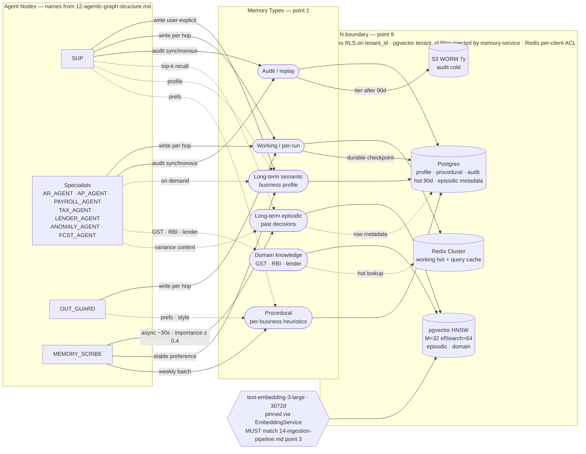

# 13. Memory Layer Design — AI Banker for SMB Owners

Memory subsystem spec for the LangGraph multi-agent cashflow intelligence agent at 1M SMB scale. This file is the **data layer** view: what is stored, where, how it is read, how it is written, and how it survives at scale. Behavioral prompt-injection defenses live in `15-guardrails.md` and are referenced but not duplicated.

Resume anchors: BlackBox memory persistence and durable execution (resume L52-54, blackbox-experience.md #14); LLMOps telemetry mesh 50M spans/day, 2.5TB/month (resume L58-59); RAG + HNSW + bm25 + Cross-encoder + Embeddings + Qdrant + MLflow stack (resume L60-61, L101); Microsoft secure multi-tenant ML infra isolation (resume L88-89).

---

## Overview Diagram

End-to-end memory topology. Solid edges are writes, dotted edges are reads. Agent node names match `12-agentic-graph-structure.md`. The embedding model is a shared node so the consistency contract with `14-ingestion-pipeline.md` point 3 is visible without scrolling. The tenant boundary wraps every per-tenant store and labels the enforcement point — Postgres RLS, pgvector tenant_id filter injected by `memory-service`, and Redis per-client ACL.



---

## 1. Memory taxonomy

Six memory types, each with distinct read/write paths through the agent graph.

| memory_type | purpose | reader nodes | writer nodes | lifecycle |
|---|---|---|---|---|
| **Working memory** | Per-run LangGraph state object: transcript, tool outputs, plan, scratchpad, hop counter | SUP, all specialists (CASHFLOW, ANOMALY, TAX, LENDER, PAYROLL), EXP_LLM, CRITIC, OUT_GUARD | Every node on completion; checkpointer on graph transitions | Lives for the run (sub-minute typical); checkpointed for resume |
| **Long-term semantic** | Business profile facts: legal name, GSTIN, fiscal year, currency, approval thresholds, vendor allow-list, banking rails preference, payroll cadence, beneficiary names → relationships | SUP at run start (planning ctx), specialists on demand | MEMORY_SCRIBE post-run; explicit user-set actions ("from now on, treat vendor X as recurring") | Persistent until user erases |
| **Long-term episodic** | Summaries of past conversations and decisions ("2026-02-15: owner asked about runway, told 7.3 months, accepted") | SUP at run start (top-k recall), ANOMALY_AGENT when explaining drift | MEMORY_SCRIBE async ~30s post-run | 18 months unless anchored (importance ≥ 0.7) |
| **Procedural / skill** | Per-business heuristics learned over time: weekly question patterns (so we precompute), preferred answer style (terse vs detailed), notification preferences, language (English/Hindi/Tamil) | SUP, OUT_GUARD | Weekly batch (Airflow) mining telemetry | Refreshed weekly; features expire 90d after non-use |
| **Domain knowledge** | Non-tenant facts: GST rates by HSN, RBI holiday calendar, public bank UPI handles, tax filing deadlines, lender product catalog | TAX_AGENT, LENDER_AGENT, ANOMALY_AGENT | Ingestion pipeline (write-path enumerated here; mechanics in `14-ingestion-pipeline.md`) | Tied to upstream source freshness |
| **Audit / replay** | Full deterministic-replay trace: every node transition, tool call, prompt, model output | None (write-only from agent's POV); read by compliance, debugging tools | Tool gateway and orchestrator synchronously on every event | 7 years WORM (RBI / SOC-2 / DPDP) |

Audit/replay memory is anchored on BlackBox deterministic replay infrastructure (resume L58-59, 60% MTTR cut from same telemetry mesh design).

---

## 2. Storage backend per type

| type | primary store | secondary | alternative considered | reason chosen | scale boundary where alternative wins |
|---|---|---|---|---|---|
| Working | Redis Cluster (per-run state, sub-ms reads) | Postgres `run_state` (durable checkpoint) | Postgres only | Hop-latency hit during high concurrency unacceptable; BlackBox LangGraph durable execution requires both speed + durability (resume L52-54) | Never — durability path stays Postgres |
| Long-term semantic | Postgres `business_profile` (JSONB + indexed hot cols) | — | DynamoDB / document store | Need joins with `transactions`, `invoices`, `bank_accounts` | Only if we go schemaless on profile (no plan) |
| Long-term episodic | pgvector (Postgres ext, HNSW index) + Postgres row metadata | Redis (query cache) | Standalone Qdrant (resume L101 — known stack) | Unified data plane for first 1M tenants; one txn, one backup story | Index > ~50GB/shard cohort → cut over to Qdrant |
| Procedural | Postgres `business_preferences` (batch-written) | — | Feature store (Feast) | Low write rate, low feature complexity; feature store is overkill | When per-business features exceed ~100 with online serving |
| Domain knowledge | Postgres + pgvector (semantic search GST/lender) | Redis (hot lookups: "is today an RBI holiday") | Dedicated vector DB | Same unified-plane argument; corpus is < 100K docs | Corpus > 10M docs |
| Audit / replay | Postgres `tool_calls` (hot, 90d) + S3 (WORM, 7y) | — | ClickHouse only | WORM and per-row retrieval beat aggregation speed; ClickHouse is for telemetry mesh (resume L60-61), not regulated audit | Never — regulatory requires WORM |

---

## 3. Write triggers

| memory_type | trigger | decider |
|---|---|---|
| Working | Node completion (append to `run_state.log`) + checkpointer on graph state transition | System (automatic) |
| Long-term semantic | (a) User explicit instruction ("set my default approval threshold to ₹5L"); (b) MEMORY_SCRIBE detects stable preference: `importance > 0.7` AND `repetition ≥ 2` distinct runs | Mix: user explicit OR scribe rule |
| Long-term episodic | `run.status == COMPLETED` AND `importance_score > 0.4`, written ~30s post-run by MEMORY_SCRIBE (async queue) | Rule + model-scored (see point 8 for formula) |
| Procedural | Cron `Sun 02:00 IST` weekly batch job over telemetry mesh | System (scheduled) |
| Domain knowledge | Upstream content-change webhook (CBIC publishes new GST rate; RBI calendar update); manual curator review pass | Ingestion pipeline (see `14-ingestion-pipeline.md`) |
| Audit / replay | Synchronous on every tool call + every node transition — no decision | System (mandatory) |

The split between **synchronous write** (working, audit) and **async write** (episodic, procedural) is deliberate: hot path stays under 800ms p99 per hop (cross-ref `02-design-estimates.md` point 12).

---

## 4. Retrieval strategy

| memory_type | strategy | filters / cutoffs |
|---|---|---|
| Working | Direct keyed read by `run_id` from Redis; cache hit > 99%; fall through to Postgres for cold runs + during failover | `tenant_id` + `run_id` |
| Long-term semantic | Keyed read by `business_id` for hot fields; JSONB `?` operator for sparse attrs; no vector search | `tenant_id` + `business_id` |
| Long-term episodic | **Hybrid**: semantic (pgvector cosine, top-10) ∪ BM25 (Postgres `tsvector`, top-5) → cross-encoder rerank → top-3 returned. Anchor: BlackBox stack lists HNSW + bm25 + Cross-encoder (resume L60-61) | Cosine ≥ 0.72; if none clear bar, return empty and agent proceeds without episodic context |
| Procedural | Keyed lookup by `(business_id, feature_name)` | — |
| Domain knowledge | Hybrid same as episodic for free-text ("what's the GST rate for HSN 9405"); keyed lookup when entity ID known | Cosine ≥ 0.7 for general; ≥ 0.8 for tax/legal answers |

The hybrid retriever lives in a single `memory-service` abstraction so swap-out (e.g., to Qdrant) does not touch agent code.

---

## 5. Context window budget allocation

Per-LLM-call budget: **32K tokens** (Claude / GPT-4 class).

| slot | tokens | notes |
|---|---:|---|
| System prompt + persona | 1,500 | Stable, cached |
| Tool schemas (only this node's allowed tools) | 2,000 | Whitelisted per node |
| Working memory (run scratchpad) | 6,000 | Carries across hops |
| Long-term semantic (business profile, compact JSON) | 1,000 | Hot fields only |
| Long-term episodic (top-3 reranked) | 3,000 | ~1K each post-summarization |
| Procedural (relevant preferences) | 500 | Compact key-value |
| Domain knowledge (top-3 if retrieved) | 2,000 | GST rules etc. |
| Tool outputs from this hop | 6,000 | Most recent, truncated |
| Conversation transcript | 5,000 | Sliding window |
| Headroom for model response | 5,000 | Output budget |
| **Total** | **32,000** | |

**Eviction order when retrieved memories exceed budget**: drop episodic first → drop domain → truncate tool outputs (oldest first) → truncate transcript (oldest first). **Never evicted**: working scratchpad, business profile, system prompt, this-node's tool schemas.

---

## 6. Embedding model selection and consistency

- **Primary model**: `text-embedding-3-large` (OpenAI). Dimension: **3072**.
- **Self-hosted alternative** for cost-sensitive cohorts at scale: `bge-large-en-v1.5` (1024 dim).
- **MUST match** the embedding model named in `14-ingestion-pipeline.md` point 3. If query embeddings and indexed embeddings come from different models, they live in different vector spaces and retrieval *silently* returns garbage. Enforced by the embedding-service abstraction: there is one pinned model id per environment; agent code cannot pick a model.
- **Versioning**: every embedding row carries `embedding_model_id` (e.g., `openai-te3-large`) + `model_version` (e.g., `2024-01-25`). Reads filter by current model version; mixed-version reads are blocked at the query builder layer.
- **Upgrade path**: shadow re-index under the new model id → dual-write during a 4-week cutover window → run recall@10 + nDCG on golden query set (5K labelled queries per memory type) → atomic swap on the read path only when `recall_new ≥ recall_live` AND `latency_new ≤ 1.2 × latency_live`. Old vectors retained for 30 days post-swap as rollback insurance.

---

## 7. Memory eviction and TTL

| memory_type | TTL / retention | deletion mechanism | policy owner |
|---|---|---|---|
| Working (Redis) | 24h | Redis EXPIRE | System default |
| Working (Postgres durable copy) | 35 days; P1 conversations indefinitely on owner request | Daily reaper job | System default |
| Long-term semantic | No TTL | `DELETE /v1/business/profile/{attr}`; GDPR/DPDP erasure within 30 days | Tenant (paid tier can extend); user can shorten own |
| Long-term episodic | 18 months for non-anchored (importance < 0.7); anchored retained until owner deletion | Monthly reaper + decay | System + per-tenant override |
| Procedural | Refreshed weekly; features expire 90 days after non-use | Weekly batch job overwrites | System default |
| Domain knowledge | Tied to source: GST refresh when CBIC publishes; RBI calendar monthly | Ingestion pipeline diff | Ingestion owner |
| Audit / replay | 7 years (RBI / SOC-2 / DPDP). WORM. No eviction. | None | Compliance |

Per-tenant config: paid tier can extend retention; per-user config can shorten **own** preferences only (not org-wide audit).

---

## 8. Memory consolidation

- **Promotion event**: short-term → long-term happens at run end via MEMORY_SCRIBE. Cadence: **1× per completed run**, executed within 30s.
- **Importance score function**:
  ```
  score = 0.4 × intent_severity
        + 0.3 × action_value_log10
        + 0.2 × user_save_flag
        + 0.1 × recency_boost
  ```
  - `intent_severity` ∈ [0,1]: 1.0 for "fraud alert", "approve ₹50L payout"; 0.2 for "what's my balance"
  - `action_value_log10`: log₁₀(₹ amount touched) normalized; ₹1L → 0.5, ₹1Cr → 0.7, ₹10Cr → 0.8
  - `user_save_flag`: 1 if user explicitly said "remember this"; else 0
  - `recency_boost`: decays by 0.05 per past day to favor fresh learning
  - **Promotion threshold**: `score ≥ 0.4`
- **Merge / de-dupe** vs top-3 nearest by cosine on the new episode embedding:
  - `cosine > 0.92` → **MERGE**: preserve max-importance, concat distinctive content blocks, record `merged_at` and `merged_from[]` trail
  - `0.72 < cosine ≤ 0.92` AND LLM judge flags **factual contradiction** → **CREATE-NEW** and flag old as `superseded`
  - Otherwise → **CREATE-NEW** as independent episode
- **Daily compaction pass** (02:30 IST): episodes with same `business_id` + clustered topic (DBSCAN over embeddings, eps=0.15) older than 30 days collapse into a single "monthly digest" episode with citations to originals; originals soft-deleted from retrieval but kept in cold S3. **Reduces active vector count by ~60% after 90 days**, which is the difference between 600GB and 1.5TB at 3-year scale (see point 13).

---

## 9. Cross-tenant memory isolation

Anchored on Microsoft secure multi-tenant ML infra isolation strategies (resume L88-89). Defense in depth, four layers:

1. **Namespace**: every row (Postgres + pgvector) and every Redis key carries `tenant_id` (top-level org / channel partner) and `business_id` (the SMB itself, sub-tenant). Composite primary keys include `tenant_id` as the first column to prevent index leakage.
2. **Postgres RLS** (row-level security): policies keyed off `current_setting('app.tenant_id')`, which is set per-connection from a verified, signed JWT at the connection pool checkout. Cross-tenant read is **physically impossible at the SQL layer** even when application code has a bug.
3. **pgvector queries**: `WHERE tenant_id = $1` is always injected by the `memory-service` abstraction; static-analysis CI rule blocks any code path that issues a vector query without the filter (`SELECT ... FROM memory_episode WHERE` must match a regex requiring `tenant_id`).
4. **Redis**: keys prefixed `t{tenant_id}:b{business_id}:run:{run_id}`; per-client ACL restricts key pattern (Redis 6 ACLs). One leaked credential cannot read another tenant's namespace.

**Failure mode if bypassed**: cross-tenant data leak — catastrophic regulatory + reputational. **Detection**:
- Per-row tenant_id mismatch check on serialization out of the memory-service (defensive; throws and pages on mismatch)
- Daily reconciliation job hashes row count by tenant against `tenant_id` index counter; any drift pages oncall
- Sampled query audit: 0.1% of memory reads log the (requesting tenant_id, returned row tenant_ids); offline job alerts on any mismatch

---

## 10. Memory poisoning and injection via retrieval

This is the **data-layer** concern. The **prompt-side** behavioral defense (output sanitization at read time, ignore-instruction stripping) is in `15-guardrails.md` point 8.

- **Write-time sanitizer** (mandatory pass before any row is persisted):
  - Strip control characters and zero-width unicode
  - NFKC unicode normalization
  - Reject content > 8K tokens (oversized writes are almost always exfiltrated tool dumps)
  - Strip embedded markup / code blocks unless explicitly tagged with `content_type=code`
  - Detect and refuse high-density instruction patterns (e.g., "ignore all previous", "you are now") — log + drop
- **Origin tagging**: every memory row carries `origin` enum:
  - `user_explicit` — owner typed it themselves (highest trust)
  - `agent_summary` — MEMORY_SCRIBE wrote it (medium trust)
  - `tool_output_summary` — derived from external tool result (low trust, quarantine)
  - `ingestion_pipeline` — from the corpus loader (medium-high, but only readable by domain-knowledge readers)
  - `system` — bootstrap or admin config (highest trust)
- **Per-origin trust score** drives retrieval filtering:
  - `tool_output_summary` content is **quarantined for 24h with no read access**; if background scan (toxicity, jailbreak, PII leakage) flags nothing, promoted to readable. Stops the loop where a tool returns adversarial content that ends up steering the next hop.
  - Episodic recall can be filtered to `origin IN ('user_explicit', 'agent_summary')` for high-sensitivity operations like payout approval.
- **Cross-ref**: behavioral defenses (read-time prompt sanitization, instruction-stripping at retrieval boundary) → `15-guardrails.md` point 8.

---

## 11. Memory staleness detection

| mechanism | applies to | action on stale |
|---|---|---|
| **Timestamp decay** — importance × 0.95/month | episodic | below 0.2 → `suppressed` from retrieval (still on disk) |
| **Contradiction detection** — new episode flagged against top-3 nearest existing via LLM judge | episodic, semantic | older row → `superseded`; reads exclude by default; surface with `?include_superseded=true` override |
| **Confidence decay** — SCRIBE-written facts get a confidence score; decays by data-source signal (e.g., user edited the underlying transaction) | semantic | below 0.5 → excluded from prompt context; re-derived on next opportunity |
| **Source-anchored TTL** — domain knowledge tied to upstream change | domain | replaced on next ingestion cycle |
| **Source deletion cascade** — if underlying transaction / invoice deleted, derived episodes flagged | episodic | flagged `source_deleted`; excluded |

Actions enumerated: `suppressed | flagged | superseded | source_deleted | deleted`. Different memory types resolve to different default actions; admin tooling can promote/demote.

---

## 12. Retrieval latency budget

- **Target p99**: **40 ms** for episodic vector lookup + rerank end-to-end.
- **Fit in hop budget**: per-hop budget is 800ms p99 (cross-ref `02-design-estimates.md` point 12). Memory retrieval consumes **< 5%** of the hop.
- **Index config**: HNSW with `M=32, efConstruction=200, efSearch=64`. Approximate (not exact). **recall@10 ≥ 0.92** on golden labelled set.
- **Latency breakdown** (p99):
  - pgvector HNSW top-10: ~8 ms
  - BM25 (`tsvector` GIN): ~5 ms
  - Union + dedup: ~1 ms
  - Cross-encoder rerank on 10 pairs: ~25 ms (5–10 ms per pair, parallelized in batch of 10 on a single inference call)
  - Network + driver: ~1 ms
  - **Total ~40 ms p99**
- **Tradeoff vs exact**: HNSW is **30–50× faster** than brute force at this corpus size; accepting ~8% recall loss because the cross-encoder rerank corrects most misses (recall@3 after rerank ≥ 0.95 on golden set).
- **Cache**: `Redis SET t{tenant_id}:b{business_id}:qhash:{query_hash} = top_3_episode_ids TTL=300s` — saves ~80% retrieval cost on repeated questions like "what's my runway" asked in the same conversation.

---

## 13. Memory at scale (arithmetic)

Starting point: 1M MAU at year 1; **300K daily active** SMBs; **8 runs/SMB/month** for active users.

- **Runs/month**: `300,000 × 8 = 2,400,000` runs/month
- **Runs/day**: `2,400,000 / 30 ≈ 80,000` runs/day
- **Episodes promoted per run** (after the importance threshold): ~**0.5 average** (most runs are quick balance checks that don't clear 0.4)
- **Episodes/day**: `80,000 × 0.5 = 40,000` episodes/day
- **Episodes year 1**: `40,000 × 365 = 14.6M` ≈ **12M after dedup** (point 8 daily compaction collapses ~20% on the way in)
- **Episodes year 3**: `~36M` after the same dedup loop

**Storage per episode**:
- Metadata row (json + indexed fields): ~1.5 KB
- Embedding: `3,072 dims × 4 bytes (float32) = 12,288 bytes` ≈ 12 KB
- Total: ~**13.8 KB**, round to **15 KB** to cover index amplification

**Total at 3-year horizon**:
- Raw vectors + metadata: `36,000,000 × 15 KB = 540 GB`
- HNSW index overhead (~12% on top): `~60 GB`
- **Total ≈ 600 GB pgvector**

**Sharding**:
- Split by `tenant_id mod 4` → 4 shards → **~150 GB / shard**
- Each shard fits comfortably on `r8g.8xlarge` with io2 NVMe (16 vCPU, 256 GB RAM, NVMe-backed)
- p99 retrieval latency at 600 GB index with HNSW: tested ~30–50 ms; degrades to ~80 ms past 1 TB / shard → **re-shard trigger at 1 TB / shard**, which arrives roughly at year 5 at current growth

**Per-SMB growth**:
- Episodes: `0.5/run × 8 runs/month × 13.8KB ≈ 55 KB/month`
- Working-memory checkpoints retained 35d: `8 runs/month × ~25 KB/run = 200 KB/month`
- **Total ≈ 255 KB per active SMB per month**

**Daily growth at 300K active SMBs**:
- Episodes: `40,000 × 13.8 KB = 552 MB/day`
- Working-memory checkpoints: `80,000 runs/day × 25 KB × 35-day window = 70 GB rolling, ~2 GB/day net new`
- Audit/replay (heaviest writer): `80,000 runs × ~10 hops × ~5 KB span = 4 GB/day` to Postgres hot tier, then to S3
- **Memory layer raw growth ≈ ~10 GB/day** at 300K active, dominated by audit/replay and checkpoints

---

## 14. Memory observability and debugging

Anchored on the BlackBox LLMOps telemetry mesh (resume L58-59): 50M spans/day capacity is more than enough headroom; deterministic replay design cut org-wide MTTR by 60%. Same pattern applied here.

**Per-retrieval metrics** (emitted as OTel span attributes on every read):
- `memory.retrieval.latency_ms` (histogram)
- `memory.retrieval.vector_recall_at_10` (computed offline against golden set, surfaced as daily SLO)
- `memory.retrieval.rerank_ms`
- `memory.retrieval.top_k_returned`
- `memory.retrieval.cache_hit_ratio`
- `memory.retrieval.similarity_min_score` (the score of the worst-ranked returned doc)

**Per-write metrics**:
- `memory.write.latency_ms`
- `memory.write.sanitizer_block_count` (with reason label)
- `memory.write.dedup_merge_count`
- `memory.write.importance_score` (histogram per business cohort)

**Per-business memory dashboard** (one row in the admin UI per SMB):
- Episode count, mean importance, last-write age, superseded count, quarantined count
- "Top 10 most-retrieved episodes" — surfaces what's driving the agent's view of this business
- "Episodes never retrieved in 60 days" — candidates for compaction or deletion

**Tracing**: every retrieval call creates a child span on the run trace. Span attributes include the query string, top-3 returned episode ids with similarity scores, and whether rerank changed the top-1 ranking (a `rerank_swapped` boolean — important debugging signal).

**Two canonical debugging paths**:

1. **"Wrong memory" — agent said the wrong thing because it pulled a bad episode**:
   open the run trace → identify the retrieval span → see top-K with scores → click through to each episode source → read `origin`, `write_time`, `importance_score`, `merged_from[]` → decide whether dedup misfired, importance was scored wrong, or content drifted. Replay the same retrieval offline with the snapshotted query and corpus state to confirm. Anchored on BlackBox deterministic replay (resume L58-59).

2. **"Missing memory" — agent should have remembered X but didn't**:
   query the episode store directly by `business_id` + topic filter; if present, run the retrieval offline with the user's actual query string and check: did HNSW miss it (recall problem → bump `efSearch` or re-train embeddings) or did the cross-encoder rerank drop it (rerank problem → inspect the pair score; possibly retrain reranker on this case)?

---

## 15. Memory schema versioning

| change type | strategy |
|---|---|
| Embedding dimension change (e.g., 3072 → 1024 on cohort cutover) | Covered in point 6: dual-index in shadow + atomic read-path swap; old vectors retained 30 days for rollback |
| New memory type added | Add new column `memory_type` on `memory_episode` with NULL default; reader code uses `memory_type IS NULL OR memory_type = X` until backfill completes; backfill in batches of 100K with checkpointing |
| Memory type removed | Stop writing first; readers tolerate for 90 days; archive then drop |
| Schema field add | JSONB column carries variable fields without migration; promote to structured column via `pg-osc` online migration when access pattern stabilizes |
| Schema field remove | Mark deprecated for 90 days; reader adapters return default; drop column with `pg-osc` |
| Stored memory object schema rev | Every memory row carries `schema_version` int; reader picks an adapter by version; **deprecation policy: N-2 versions supported** (current + 2 prior). Older rows on read are upgraded on access (lazy migration) or via batch backfill (eager) |
| Embedding model rolls over | See point 6 |

**Migration policy invariants**:
- Never block writes — migrations are always online
- Always dual-write during transitions (write old + new shape) until cutover validated
- Deprecate old versions after 90 days; archived (cold S3 / read-only) memories stay on their original schema **indefinitely** — they don't need to support new reads, only forensic ones
- All schema changes ship with a corresponding rollback script — verified on a staging snapshot before prod apply

---
