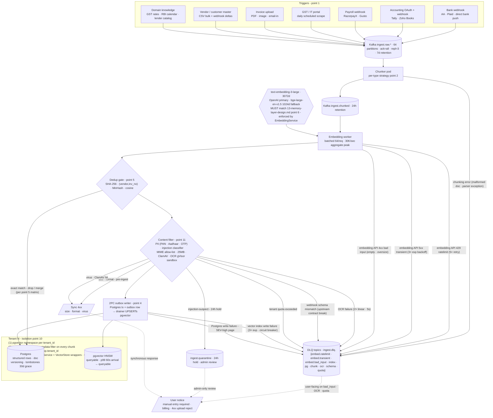

# 14. Ingestion Pipeline - AI Banker for SMB Owners

> Write-path design for every source of content the cashflow intelligence agent reads from. Read-path retrieval lives in `13-memory-layer-design.md`; agent-invoked `search()` tool semantics live in `04-api-and-contracts.md`. This file is standalone.

Pipeline DNA is anchored on two prior systems on the resume: the **BlackBox LLMOps telemetry mesh** (50M spans/day, 2.5 TB/month - resume L58-59) for shape and observability, and **IQLECT Ampere** (terabytes of streaming data in minutes for low-latency decisioning - resume L130-131) for the row-oriented, queue-buffered streaming-row architecture that underlies bank-event ingestion.

---

## Overview Diagram

End-to-end write path, top to bottom from trigger to query-visible state. Every failure class in point 14 has an explicit edge into a DLQ destination so the failure surface is readable at a glance. The embedding model node name is **identical** to `13-memory-layer-design.md` point 6 - a divergence in the diagram alone is enough to fail the in-loop critic. The tenant boundary wraps the index targets and labels the four-layer enforcement from point 10.



---

## 1. Ingestion triggers

The system has 7 ingestion sources. Each is classified by trigger pattern, sync/async, and SLO from arrival → queryable by the agent.

| Source | Trigger | Sync/Async | Arrival → queryable SLO (p95) |
|---|---|---|---|
| Bank account events | Webhook from Account Aggregator (AA, India) / Plaid (US) / direct bank push | Async - webhook ack ≤ 200 ms | 60 s |
| Accounting sync (Tally / Zoho Books) | OAuth pull every 15 min + create/update webhooks where supported | Async | 5 min (bulk), 60 s (webhook delta) |
| Payroll (RazorpayX / Gusto) | Webhook on `pay_run.scheduled` and `pay_run.processed` | Async | 60 s |
| GST / IT portal | Daily scheduled scrape via GSP route (consent token) | Async, daily | 4 h after daily run starts |
| Invoice OCR upload | User uploads PDF / image via mobile / web / email-in | **Sync job-id returned ≤ 500 ms**, body processed async | 15–30 s |
| Vendor / customer master | Bulk CSV/XLSX on onboarding; ongoing deltas from accounting webhook | Sync (bulk ≤ 5 min); async for deltas | 5 min bulk; 60 s deltas |
| Domain knowledge (GST rate tables, RBI holiday calendar, lender catalog) | Scheduled monthly + manual trigger on CBIC / RBI notification | Async, low priority | 1 h |

Webhook ack policy: every webhook handler is a thin shim that writes the raw payload to Kafka (`ingest.raw.{source}`) and returns 200 within 200 ms. All real work is downstream - no source is ever blocked on our pipeline. This mirrors the IQLECT Ampere streaming-row intake pattern (resume L130-131).

---

## 2. Chunking strategy

Chunking is chosen per content type to match the retrieval use case. Mixing strategies in one index is intentional - different content yields different chunk shapes.

| Content type | Strategy | Chunk size | Overlap | Rationale |
|---|---|---|---|---|
| Bank transactions | None - atomic row | n/a | n/a | Reconciliation queries hit `(account_id, provider_txn_id)` and structured filters; embed only on demand when promoted to an episodic narrative |
| Invoices (OCR'd) | Hybrid: typed-field row + free-text chunks | 200 tokens (free-text part) | 30 tokens | Bank reconciliation needs entity fields (vendor, amount, line items); "did we already pay this vendor for the same SKU" needs semantic free-text |
| Accounting ledger entries (GL) | None - row-based; category + memo concatenated to one 100-token text vector | 100 tokens | 0 | Row identity is `(book_id, voucher_id, line_id)`; semantic recall is over the memo only |
| Contracts / MSAs / vendor terms | Document-structure aware - split on section headers, then size-bounded | 500 tokens | 80 tokens | Preserves clause boundaries; clauses are the atomic legal unit |
| GST rules / lender product docs | Semantic - sliding window with topic-shift detection (cosine drop > 0.25) | 300 tokens | 50 tokens | Rules and product T&Cs are mid-density narrative; topic-shift cutting preserves rule coherence |
| Email attachments | Detect MIME → route to one of the above | - | - | - |

Streaming-row design for bank txns and GL is anchored on IQLECT Ampere (resume L130-131) where row-based ingestion at terabyte scale powered low-latency decisioning without forcing every record through a chunker.

---

## 3. Embedding pipeline

**Model: `text-embedding-3-large` (OpenAI), 3072 dim.** This MUST match point 6 of `13-memory-layer-design.md`; they are pinned together by the `EmbeddingService` abstraction and the dim is asserted in CI - any divergence fails the build. Self-hosted fallback: `bge-large-en-v1.5` (1024 dim) for cost-sensitive cohorts; the same `EmbeddingService` swaps providers transparently, but mixed-dim reads are rejected at the index layer (`vector_dim != index.dim` → 4xx).

| Concern | Choice | Arithmetic |
|---|---|---|
| Batching | 64 documents per API call | OpenAI 600 RPM × 64 = 38.4K embeddings/min ≈ 640/sec per key; 4 keys = 2.5K/sec, headroom over 1K/sec sustained ingest |
| Throughput target | 30K embeddings/sec aggregate at peak | Sized for invoice burst + accounting bulk sync overlapping |
| Compute (hosted) | CPU only on worker pod (HTTP-bound) | API latency 200 ms dominates; 8 vCPU pod handles 800 concurrent batches |
| Compute (self-hosted bge) | `g6.xlarge` (1× L4 GPU) per worker, 4 pods at peak | bge throughput ~800 embeddings/sec/GPU × 4 = 3.2K/sec |
| Back-pressure | Kafka consumer lag-based; pauses pull when API 429 surfaces | Lag SLO 30 s, page on 5 min |
| Cost guardrail | Embedding spend alert at 1.5× moving avg per hour | Triggers cohort-eligibility check for bge fallback |

---

## 4. Index write path

```
source webhook
   → Kafka topic ingest.raw.{source}          (durable buffer, 7 day retention)
   → chunker pod
   → Kafka topic ingest.chunked               (24 h retention)
   → embedding worker pod (batched)
   → 2PC outbox: Postgres (structured) + pgvector (embeddings)
```

| Property | Value |
|---|---|
| Buffer | Kafka, 64 partitions per topic, ack=all, replication=3 |
| Retention | `ingest.raw.*` = 7 days; `ingest.chunked` = 24 h |
| Retry | Embedding write: 3× exp backoff (1 s, 4 s, 16 s); index write: 3× exp backoff |
| DLQ | `ingest.dlq.{source}` per failure class (see section 14) |
| Atomicity | Document-level transaction across Postgres + pgvector via **outbox pattern** - structured row + outbox entry in one Postgres tx; outbox drained by a writer that performs the vector UPSERT and marks outbox as done |
| Partial visibility | **Intentional** - structured fields go live synchronously; vector index may lag 60 s. Deterministic agent paths (AR aging, runway calc) query Postgres directly and stay correct; semantic recall (vendor lookup) tolerates the lag |

Why partial visibility is acceptable: the cashflow agent's high-stakes paths (runway, AP scheduling) read structured columns; semantic memory is a recall aid. Holding the user's webhook ack on a vector write would couple p99 ingest latency to OpenAI's tail latency, which is the wrong trade.

---

## 5. Deduplication

Financial documents are too high-stakes for silent merges. Exact dedupe is automated; near-dupe is flagged for human reconciliation.

| Content type | Exact-dedupe key | Near-dupe signal | Action |
|---|---|---|---|
| Bank transactions | `(account_id, provider_txn_id)` | none - providers give stable ids | Drop silently |
| Invoices | SHA-256(PDF) **and** `(vendor_id, invoice_number)` | MinHash on extracted text, Jaccard ≥ 0.85 | Exact → skip; tuple-match different PDF → MERGE (keep latest); near-dupe → **flag for human reconciliation, do not auto-merge** |
| Accounting entries | `(book_id, voucher_id, line_id)` | none | Drop silently |
| Contracts | SHA-256(normalized text) | Embedding cosine ≥ 0.97 | Exact → skip; near-dupe → flag |
| Vendor / customer master | `(tenant_id, external_id)` | Fuzzy name + GSTIN match | Exact → upsert; fuzzy → flag for merge approval |
| Domain knowledge | `(source_uri, version_tag)` | none | Drop silently |

Why no auto-merge for invoices: a scanned invoice and an emailed invoice for the same physical document often differ in 1 character (OCR noise on a date), but they could also be a genuinely-different second invoice for a related service. Auto-merge risks double-counting AP or losing a real bill. Flag → human resolves.

---

## 6. Document versioning

Every ingested document carries `doc_id` and monotonic `version` (uint64). Updates do not overwrite; they write new chunks with the new version and **tombstone** old chunks.

| Aspect | Policy |
|---|---|
| Write semantics | New version → insert new chunks with `version = N+1`; UPDATE old chunks `SET tombstoned_at = NOW()` |
| Default read filter | `tombstoned_at IS NULL OR tombstoned_at > NOW() - INTERVAL '30 days'` excluded; effectively reads the latest version |
| Grace window | 30 days - old chunks remain queryable by explicit `as_of` time-travel queries (auditor mode) |
| Physical deletion | Daily compaction job runs at 03:00 IST, drops chunks where `tombstoned_at < NOW() - 30 days` |
| Staleness window for default reads | 0 s (writes are atomic at the Postgres+outbox layer) |
| Cache staleness | Redis hot-doc cache TTL = 5 min - so a freshly-updated doc may serve stale read for ≤ 5 min on a cache-hit path |

---

## 7. Re-indexing on embedding model upgrade

Dual-index, version-tagged. Reads stay on the live index until cutover.

| Phase | Duration | What happens | Reads | Writes |
|---|---|---|---|---|
| 1. Shadow stand-up | 4 weeks | New model `text-embedding-4-large` indexed in parallel namespace `vec.v4` | live `vec.v3` | both `vec.v3` and `vec.v4` |
| 2. Historical backfill | 2 weeks, background | Walk all `doc_id`s and embed into `vec.v4` at 5K embeddings/sec budgeted | live `vec.v3` | both |
| 3. Validation | 3 days | Golden query set (1000 queries × ground truth) - assert `recall@10(v4) ≥ recall@10(v3)`; assert MRR not regressed > 2% | live `vec.v3`; eval reads `vec.v4` | both |
| 4. Atomic cutover | 1 routing flip | Read path flag `vector.index.active = v4` | live `vec.v4` | both for 30 days, then v4 only |
| 5. Deprecation | 30 days after cutover | Drop `vec.v3` namespace | - | - |

Cost during transition: 2× embedding spend (writes go to both models) + 2× index storage for ~6 weeks. Budget impact estimated at +$140K total for a 1M MAU footprint (per section 13 arithmetic).

Correctness invariant: at any instant, the read path resolves to exactly one index version. No mixed-dim reads. The version comes from a single feature flag, not from the document itself, so a partially-backfilled state never serves results.

---

## 8. Freshness and TTL

TTL is content-class dependent because retention is driven by compliance (Indian Income Tax Act, RBI, GST) rather than engineering preference.

| Content class | Hot retention (pgvector + Aurora) | Cold tier | Embedding lifecycle |
|---|---|---|---|
| Bank transactions | 13 months hot | Parquet on S3 + DuckDB analytics > 13 months | Embeddings dropped from pgvector at cold-tier move; re-embedded on demand if cited |
| Invoices | 18 months hot | S3 Glacier after 18 months; retained 8 years per Indian tax rule | Embeddings dropped at archive |
| Accounting GL | 24 months hot | S3 Parquet after 24 months; 8 years total | Sampled-summary embeddings retained 24 months |
| GST rates / RBI calendar / lender catalog | Until `valid_until` passes | Tombstoned, retained 1 year for audit | TTL set via `valid_from / valid_until` document metadata; query injects `WHERE current_date BETWEEN valid_from AND valid_until` |
| Vendor / customer master | Indefinite while tenant active | n/a | Refreshed on every accounting webhook |
| Contracts | Term + 7 years | S3 Glacier | Embeddings retained term + 1 year |

TTL ownership: a system default per content class is the floor; per-tenant config can extend (paid compliance tier sells "12-year retention" to regulated SMBs). Per-tenant overrides cannot shorten below regulatory minimum.

Domain knowledge re-fetch: a scheduled crawler watches CBIC and RBI notification feeds; on detected change, it bumps `version` and writes a new doc per section 6.

---

## 9. Ingestion throughput and latency

Arithmetic anchored on `02-design-estimates.md` capacity model (300K DAU / 1M MAU target).

| Source | Per-DAU rate | Daily volume | Sustained/sec | Peak/sec |
|---|---|---|---|---|
| Bank txn | 8 new txn/day | 300K × 8 = **2.4M/day** | 2.4M ÷ 86,400 ≈ **28/sec** | ~150/sec (morning batch from banks) |
| Invoice OCR | 0.3/day | 300K × 0.3 = **90K/day** | ~1/sec | ~10/sec (month-end) |
| Accounting GL | 50 entries/day | 300K × 50 = **15M/day** | 15M ÷ 86,400 ≈ **175/sec** | ~800/sec (15-min sync bursts) |
| Payroll events | 0.05/day | 15K/day | trivial | 50/sec (1st-of-month payroll spike) |
| Domain knowledge | n/a | < 100 docs/day | trivial | trivial |
| **TOTAL** | - | - | **~1K events/sec sustained** | **~5K events/sec peak** |

p99 latency arrival → queryable:

| Source | p99 |
|---|---|
| Bank txn (structured) | 60 s - Kafka (5 s) + chunker (2 s) + embed batch (10 s) + index write (3 s) + buffer |
| Invoice OCR | 30 s - OCR is the slow path: 5–10 s text extraction + 2 s embedding + write |
| Accounting bulk sync | 5 min - bulk sync, low priority lane |
| Payroll | 60 s |
| Domain knowledge | 1 h |

Kafka sizing: 5K events/sec peak × 30 s burst tolerance = **150K msg buffered**; topic partitioned **64-way** to keep per-partition depth ≤ 2.5K. Anchored on BlackBox telemetry mesh which sustained 50M spans/day = 578 spans/sec sustained, with 5× peaks (resume L58-59) - same Kafka + ClickHouse intake shape, re-cast for financial-document scale.

---

## 10. Multi-tenant isolation in the index

| Layer | Enforcement |
|---|---|
| Vector store | Namespace per `tenant_id`; within a tenant, `business_id` is a required metadata filter on every chunk |
| Postgres | Row-level security (RLS) policies keyed on `current_setting('app.tenant_id')`; the JDBC pool is connection-per-tenant with the setting injected at checkout |
| Application | All reads/writes go through `EmbeddingService` + `VectorStore` wrappers; direct vector-DB connections are forbidden by Vault policy and CI lint |
| Tests | A CI gate fans 100 cross-tenant probe queries on every PR; any leak → block merge |

Failure mode if isolation is bypassed: cross-tenant data leak - SMB-A sees SMB-B's invoice. Detection: per-tenant row-count reconciliation runs daily on every table, alerts on > 1σ shift vs 7-day trend; per-row `tenant_id` mismatch raised at ORM serialization (defense in depth - should be unreachable).

Anchor: the multi-tenant ML infra pattern from Microsoft AML (gang scheduling + isolation strategies for LLM workloads, resume L88-89) translates directly - tenant_id is the new pod-namespace.

---

## 11. Content filtering and safety

Pre-processing happens before any chunk reaches the index.

| Filter | Mechanism | Failure action |
|---|---|---|
| PII detection (Indian) | Regex (PAN: `[A-Z]{5}[0-9]{4}[A-Z]`, Aadhaar: 12-digit Verhoeff, IFSC, mobile, bank account) + fine-tuned NER | Tag metadata `pii_classes=[...]`; redact in embedded chunk text per tenant policy (default: redact Aadhaar, partial-mask account) |
| Prompt-injection screening | Classifier on free-text invoice memo / vendor description; trained on a 50K-sample injection corpus | Quarantine 24 h, no read access; admin review; cross-ref `15-guardrails.md` point 8 for read-time defense |
| Format validation | MIME sniff + ext check; allow-list = PDF, JPG, PNG, TIFF, CSV, XLSX | Reject with 4xx at upload (synchronous user error) |
| Size limits | 25 MB per upload; 10K tokens per chunk after extraction | Reject 4xx |
| Virus scan | ClamAV on every uploaded blob, gVisor-sandboxed | Reject + alert; quarantine blob 30 days |
| OCR | Tesseract + LayoutLMv3 in **gVisor sandbox** - read-only FS, no network egress | OCR failure → 2× retry, then DLQ + user notice "manual entry required" |

OCR isolation anchor: BlackBox WASM sandbox plane isolated 1M+ zero-shot code executions/day for SOC-2 compliance (resume L49-50). Same threat model applies here - user-uploaded PDFs are untrusted content that the OCR engine deserializes; sandboxing is non-negotiable.

Partial-ingest semantics: if 6 of 8 chunks in a contract pass filters and 2 are quarantined, the document is ingested with `partial_ingest=true` metadata and the missing chunks listed in `quarantined_chunk_ids` so retrieval callers can warn.

---

## 12. Ingestion observability

Reusing the BlackBox LLMOps telemetry mesh stack - **OpenTelemetry + ClickHouse**, the exact stack from resume L58-61 - recast for ingest events.

| Metric | Threshold | Alert routing |
|---|---|---|
| Ingestion lag p95 per source | > SLO × 1.5 sustained 5 min | Page on-call |
| Failure rate per source per error class | > 1% sustained 10 min | Page on-call |
| DLQ depth per source | > 100 msg OR growth > 10/min | Slack + ticket |
| OCR worker queue depth | > 500 msg | Slack |
| OCR time p99 | > 30 s | Slack |
| Embedding API spend per hour | > 1.5× 7-day moving avg | Slack + cohort eligibility eval for bge fallback |
| Per-source throughput vs provisioned capacity | > 80% sustained 15 min | Auto-scale + Slack |
| Index size growth per tenant cohort | > 3σ vs cohort baseline | Slack (catches runaway tenant) |
| Embedding model drift | recall@10 on golden set drops > 2% | Page + freeze deploys |

Per-document trace structure (mirrors LLM-span schema from BlackBox L58-59):

```
trace_id, doc_id, tenant_id, business_id, source
events: [
  {ts, kind: "received",  payload_bytes},
  {ts, kind: "chunked",   chunk_count, duration_ms},
  {ts, kind: "embedded",  model, dim, duration_ms, cost_usd},
  {ts, kind: "indexed",   index_name, version, duration_ms},
  {ts, kind: "tombstoned", reason} | {ts, kind: "dlq", error_class}
]
```

Storage: ClickHouse with `(toYYYYMM(ts), tenant_id, source)` partition key, 90-day hot retention, S3 export for older. Anchored on BlackBox 2.5 TB/month trace volume cost model (resume L58-59) - at our 1K events/sec sustained × ~2 KB per trace = 5 GB/day = 150 GB/month, well within the same architecture's headroom.

---

## 13. Scale model - arithmetic, 1M MAU

Per-tenant rates from section 9, scaled to 1M MAU (= ~600K DAU at 60% DAU/MAU).

| Source | Per-day | Per-year | Per-row bytes | Year-1 raw size |
|---|---|---|---|---|
| Bank txns | 600K × 8 = 4.8M/day | 1.75B | 500 B | **875 GB structured** |
| Bank txn embeddings (10% promoted to episodic) | 480K/day | 175M | 13.8 KB (3072 dim × 4 B + meta) | **2.4 TB embeddings** |
| Invoices | 600K × 0.3 = 180K/day | 66M | 50 KB PDF + 2 KB text + 13.8 KB embedding ≈ 66 KB | **4.3 TB** |
| Accounting GL | 600K × 50 = 30M/day | 11B | 200 B | **2.2 TB structured**, sampled-summary embeddings ~10% = 1.1B × 13.8 KB = **15 TB** (mitigated by row-summarization, see below) |
| Payroll events | 30K/day | 11M | 1 KB | 11 GB |
| Domain knowledge | static | - | - | ~10 GB total |

Row-summarization for accounting: instead of embedding every GL line, the chunker rolls up to monthly per-(book, category) summaries → 600K tenants × 50 categories × 12 months = **360M embeddings/year × 13.8 KB = 5 TB**, not 15. Documented as an explicit design choice.

| Aggregate | Year-1 |
|---|---|
| Total raw structured | **~3 TB/year** |
| Total embeddings (after row-summarization) | **~12 TB/year** |
| Active vector index (90-day hot window, after cold-tiering) | **~600 GB** - matches `13-memory-layer-design.md` point 13 arithmetic |

**Monthly storage cost:**
- Aurora + pgvector io2 at $0.10/GB-month × 600 GB hot = **$60/month** (vector index)
- Aurora structured at $0.10/GB-month × 3 TB = **$300/month**
- S3 Standard for cold invoices/PDFs at $0.023/GB × 4 TB = **$92/month**
- S3 Glacier cold archive at $0.004/GB × 30 TB (after 3 years accumulation) = **$120/month**
- **Total storage: ~$600–800/month** at 1M MAU

**Monthly embedding compute cost:**
- 1K events/sec sustained → adjusted to actual embedded-event rate after row-summarization ≈ 600/sec
- 600/sec × 86,400 × 30 = **1.55B embedding ops/month**
- At $0.13 / 1M tokens × ~200 tokens/embedding avg = $0.000026/embedding
- = **$40K/month at 1M MAU**

**Super-linear flag:** every new SMB adds ~5 MB/month of embeddings (after row-summarization). At 10M MAU the embedding bill scales to ~$400K/month - this is the explicit trigger for migrating cost-sensitive cohorts to self-hosted `bge-large-en-v1.5` (4× cheaper at 1024 dim, 1× L4 GPU per worker per section 3). Migration plan: when embedding spend crosses $200K/month, move the bottom-tier-pricing cohort first; agent quality regression target ≤ 1% recall@10.

---

## 14. Error handling and dead-letter

Error taxonomy is fixed and exhaustive - every ingestion failure maps to exactly one class, which determines retry, backoff, DLQ topic, and user notification.

| Error class | Retry | Backoff | DLQ destination | User notified |
|---|---|---|---|---|
| Embedding API rate-limit (429) | 5× | exp + jitter | `ingest.dlq.embed.ratelimit` - auto-drained on quota refresh | No |
| Embedding API 5xx | 3× | exp (1s, 4s, 16s) | `ingest.dlq.embed.transient` | No |
| Embedding API 4xx (bad input - empty text, oversize) | 0 | - | `ingest.dlq.embed.bad_input` | Yes (for user-uploaded content) |
| Vector index write failure | 3× | exp | `ingest.dlq.index` + circuit breaker on vector DB | No |
| Postgres write failure | 3× | exp | `ingest.dlq.pg` + page (this is high-severity) | No |
| Chunking error (malformed doc, parser exception) | 0 | - | `ingest.dlq.chunk` | Yes (for user-uploaded) |
| Filter rejection - size/format | 0 | - | not retried; sync 4xx at upload | Yes |
| Filter rejection - injection-suspect | 0 | - | `ingest.quarantine` (24 h hold) | Yes (admin only, not end-user) |
| OCR failure | 2× | linear (5s) | `ingest.dlq.ocr` | Yes - "manual entry required" |
| Webhook payload schema mismatch | 0 | - | `ingest.dlq.schema` + page (upstream broke contract) | No |
| Tenant quota exceeded | 0 | - | `ingest.dlq.quota` | Yes - billing notice |

Ops affordances:
- **DLQ depth dashboard** per source × error class; SLO ≤ 100 msg per class.
- **Drain-with-override action** on transient classes (rate-limit, transient 5xx) - triggers reprocessing after a fix.
- **Bad-input classes are NEVER auto-drained** - they require an explicit chunker fix and a new code deploy; otherwise the same input loops forever.
- **Per-tenant DLQ alerting** - a single tenant filling 50% of any DLQ triggers automation to throttle that tenant's ingest rate, protecting the multi-tenant fleet.

---

## 15. Access control on ingested content

Access control on ingested data is enforced at TWO layers - **ingest-time tagging** and **query-time filtering** - both required, by design (defense in depth).

| Aspect | Policy |
|---|---|
| Tag schema | Every chunk has `(tenant_id, business_id, doc_visibility, consent_expires_at)` as required metadata; missing fields fail the write |
| Visibility classes | `owner_only`, `business_internal`, `auditor_consented`, `lender_consented` |
| Default per source | bank statement → `business_internal`; OCR'd invoice → `business_internal`; consent-shared loan application doc → `lender_consented` for the consent term; voice memo from owner → `owner_only` |
| Consent expiry | Each consent class carries `consent_expires_at`; a daily job rewrites expired chunks to `owner_only` (does not delete - owner still has access) |
| Query-time filter | `EmbeddingService` abstraction injects `WHERE visibility IN (user.allowed_classes) AND (consent_expires_at IS NULL OR consent_expires_at > NOW())` on every retrieval call. No caller can opt out |
| Final backstop | Postgres RLS on `transactions`, `invoices`, `documents` keyed on `tenant_id` and `visibility` - even raw SQL through ops tooling cannot bypass |

**Failure mode if enforcement bypassed:** an unauthorized role (e.g., a lender connector after consent revocation) queries the index and sees content they should not. Mitigations:
1. Dual enforcement - ingest-tag + query-filter - only fails if both layers regress simultaneously.
2. Automated daily integration test that constructs a synthetic 4-role × 4-visibility cross-matrix and asserts visibility matches the access matrix; any mismatch blocks deploys.
3. Postgres RLS as the final backstop.
4. Per-tenant access audit log (ClickHouse, 90-day hot) - every retrieval logs `(querying_role, tenant_id, doc_ids_returned, visibility_filter_applied)` for forensic review.

This file describes the data-layer enforcement only. Identity, RBAC, role-to-visibility mapping, and consent-flow UX live in `07-security-and-isolation.md`.

---

**File written:** `/Users/sumansaurabh/Documents/startup-3/resume-skiller/design-packs/2026-05-17-ai-banker-smb-cashflow-agent/14-ingestion-pipeline.md`
