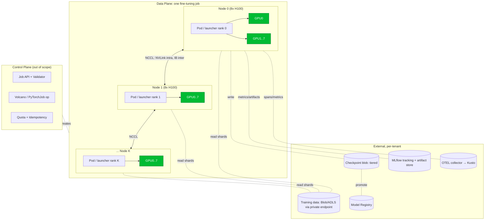
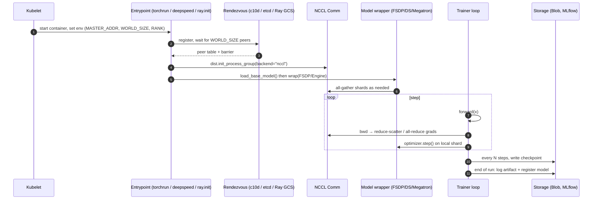

# 02 — Data-Plane Architecture

## What "data plane" means in this answer

Control plane stops the moment a `PyTorchJob` / `MPIJob` CRD is admitted and Volcano
declares the **PodGroup ready**. From that instant forward we are in the data plane:
the pods are running, NCCL is about to come up, and weight tensors are about to be
loaded onto the GPUs. Everything in this file is about what happens inside that
boundary.

## High-level topology



## The five things every worker process does



## Component map

| Component | Role | Where it runs |
|---|---|---|
| **Container image** | Pinned PyTorch + CUDA + NCCL + DeepSpeed + Transformers + bitsandbytes + vLLM + MLflow client + OTEL SDK | Built by platform; loaded onto every worker pod |
| **Launcher** | `torchrun`, `deepspeed`, or `ray train` — sets RANK/WORLD_SIZE, spawns per-GPU processes | PID 1 inside the pod |
| **Rendezvous backend** | C10d TCPStore (default), etcd-v2, or Ray GCS | Rank 0 hosts; others connect |
| **NCCL communicator** | Collective ops over NVLink + IB; one comm per process group | Each process owns one (or more) |
| **Distributed wrapper** | `FSDP`, `DeepSpeedEngine`, `Megatron parallel state`, `ray.train.torch.prepare_model` | Per-process Python object |
| **Data loader** | Sharded reader: each rank only sees its slice; uses BlobFuse or `azureml-fsspec` | Per-process |
| **Optimizer / scheduler** | Standard or fused (Apex FusedAdam, DeepSpeed FusedAdam, bnb 8-bit Adam) | Per-process; ZeRO-2/3 shards its state |
| **Checkpoint manager** | Strategy: every-N-steps, async, deduped; format depends on framework | Cross-rank coordinated |
| **MLflow client** | Logs params/metrics/artifacts; rank 0 only | Per-process (idle on non-zero ranks) |
| **OTEL exporter** | Spans for `epoch`, `step`, `forward`, `backward`, `nccl_op`; metrics for `gpu_util`, `tokens/sec` | All ranks; aggregated by collector |
| **Health sidecar** (optional) | Watches for NaN loss, stalled all-reduce, GPU XID errors, pushes liveness | Sidecar container, shares PID namespace |

## The actual control flow inside a worker

```python
# Stripped to the spine. Real launcher does more env handling.
def main():
    init_dist()                           # 1. NCCL rendezvous
    cfg = parse_config()                  # JSON/YAML mounted as ConfigMap
    setup_otel_and_mlflow(cfg)            # 2. obs wired before anything heavy
    model = build_or_load_base_model(cfg) # 3. weights in via streaming load
    model = wrap_for_parallelism(model, cfg)  # 4. FSDP / DS / Megatron — see 04-low-level-design
    train_ds, eval_ds = build_datasets(cfg)
    optimizer = build_optimizer(model, cfg)
    scheduler = build_scheduler(optimizer, cfg)

    ckpt_state = checkpoint_manager.resume_or_fresh(cfg)  # 5. idempotent restart
    for step, batch in enumerate(train_loader, start=ckpt_state.start_step):
        loss = forward_backward(model, batch)             # 6. fwd/bwd/grad-allreduce
        optimizer.step(); scheduler.step(); optimizer.zero_grad()
        if step % cfg.log_every == 0:
            log_metrics(loss, model)                       # 7. mlflow + otel
        if step % cfg.ckpt_every == 0:
            checkpoint_manager.save(model, optimizer, step)
    finalize(model, cfg)                                   # 8. eval, register artifact
```

Each of these eight steps is the topic of one section in `04-low-level-design.md`,
expressed in PyTorch-native, DeepSpeed, Ray Train, and Megatron/DeepSeek style.

## Why this layout — anchored to the resume

- The platform was a **founding investment in AI Fine-tuning on IPP** (`resume.txt`
  L73-74). That means it had to land working at the *runtime* level on day one. The
  worker contract above is intentionally minimal so the same image can host
  DeepSpeed, FSDP, or Megatron without re-imaging.
- The tech list (`resume.txt` L100-101) names **DeepSpeed, PyTorch, vLLM, Ray Train,
  MLflow** explicitly — every one of them sits at a defined layer in this topology:
  `DeepSpeed/PyTorch/Ray Train` at the *wrapper* layer, `vLLM` at the post-training
  eval/serving layer, `MLflow` at the artifact and metric layer.
- **Gang scheduling** (`resume.txt` L88-89) is what makes the topology above *legal*
  at all — you cannot start NCCL with a half-scheduled communicator.
- **Multi-tenant isolation** (`microsoft-experience.md` #7) is why every external
  arrow (Blob, MLflow, Registry, OTEL) is per-tenant routed through that tenant's
  private endpoint + workload identity, never through a shared egress.

## Two important non-obvious facts

1. **Rank 0 is special, but should not be a single point of failure.** Rank 0 hosts
   the rendezvous store, writes MLflow metrics, and coordinates checkpoint shards.
   If rank 0 dies mid-run, the whole job dies. The design mitigation is *not* to
   make rank 0 redundant; it's to make **resume-from-checkpoint cheap and atomic**.
2. **The data plane never talks back to the control plane synchronously.** Status
   updates land in a queue (or via Kubernetes status subresource updates from a
   sidecar). The trainer keeps running even if the control plane is briefly down —
   it just buffers updates. This is the same separation logic that we used in the
   wider AutoML platform (`resume.txt` L91-92): the orchestrator's outage budget is
   not the trainer's outage budget.
