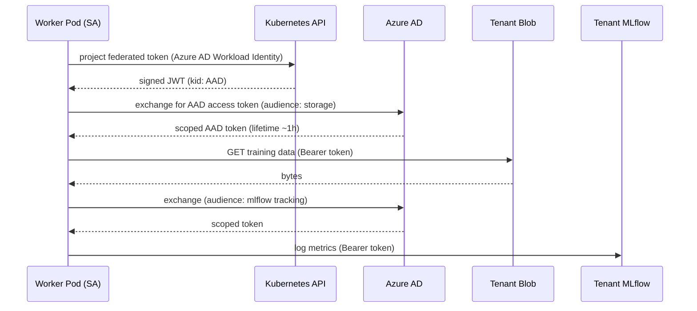

# 06 — Security and Isolation Inside the Data Plane

The control plane has already put us in a tenant-scoped namespace, with a private
endpoint, behind a VNet. This file is about what isolation looks like *inside the
running data plane*, where the trainer process owns the GPU and is reading
customer data.

This is grounded in the resume's **"secure multi-tenant ML infrastructure across
Kubernetes and Azure, including GPU scheduling and isolation strategies"**
(`resume.txt` L88-89, `microsoft-experience.md` #7, #10).

## Trust boundaries inside the data plane

```
┌─ tenant boundary ─────────────────────────────────────────────────┐
│                                                                    │
│   ┌─ pod boundary ───────────────────────────────────────────┐    │
│   │                                                            │   │
│   │  ┌─ container boundary (the trainer) ─────────────┐      │   │
│   │  │  user-supplied code (if any) <<<< most risk    │      │   │
│   │  │  platform-supplied training driver             │      │   │
│   │  └─────────────────────────────────────────────────┘      │   │
│   │                                                            │   │
│   │  sidecar: log shipper (platform-trusted)                  │   │
│   │  sidecar: health probe (platform-trusted)                 │   │
│   │  init container: data sync (platform-trusted)             │   │
│   └────────────────────────────────────────────────────────────┘   │
│                                                                    │
│   workload identity → Azure AD → tenant Blob, tenant MLflow,      │
│                                  tenant registry namespace        │
└────────────────────────────────────────────────────────────────────┘
```

## Where each boundary is enforced

| Boundary | Enforced by | Failure mode if broken |
|---|---|---|
| Tenant → tenant network | VNet + NSG + private endpoints + Calico network policy | One tenant could read another's data over the cluster network |
| Tenant → tenant storage | Workload identity scoped to tenant-only role assignments | One tenant could read/write another's blob |
| Pod → host | Linux user namespace + read-only root + seccomp + AppArmor | Container escape → host RBAC and other pods compromised |
| Container → kernel | gVisor (for highest-risk tenants), or stock runc + seccomp | Kernel exploit → host root |
| User code → platform code | User code runs in a separate process / venv; platform code holds the secret material | User code reads credentials from env |
| GPU isolation | MIG (multi-instance GPU) for small jobs; full GPU exclusivity for big jobs | Side-channel between tenants on shared GPU |

## Identity flow



Three properties matter:

1. **No long-lived secrets in the pod.** Federated tokens are short-lived and
   audience-bound; AAD tokens auto-rotate.
2. **Token audience scoping.** A blob token can't be replayed against MLflow,
   and vice versa.
3. **No tenant data on the platform's identity.** The platform never reads
   tenant data with its own identity — it always swaps to the tenant's scoped
   identity for that operation.

## Secrets in user-supplied code

Some platform tiers allow the customer to supply a Python entry script (rare in
hosted fine-tuning, common in BYOM). Three rules:

1. The user script runs in a **subprocess** with a stripped environment. None of
   the federated token paths, storage keys, or MLflow tokens are visible.
2. Anything the user wants the platform to consume from their script goes through
   a **typed stdout channel** (`PLATFORM_EMIT={"metric": "loss", "value": 0.4}`).
   The platform driver parses and forwards.
3. The user script's filesystem access is scoped via **read-only** mounts for
   inputs and a single writable scratch dir for outputs.

## Network policy: what the trainer can reach

```yaml
# NetworkPolicy excerpt — tenant-7 namespace
egress:
  # Allow NCCL to other workers in the same job (gang member pods)
  - to: [{ podSelector: { matchLabels: { job-id: <job-id> }}}]
    ports: [{ protocol: TCP }, { protocol: UDP }]
  # Allow private endpoint to tenant blob
  - to: [{ ipBlock: { cidr: 10.42.0.0/24 }}]   # tenant PE subnet
  # Allow private endpoint to MLflow tracking
  - to: [{ ipBlock: { cidr: 10.42.1.0/24 }}]
  # Allow Azure AD token endpoint (federated identity)
  - to: [{ ipBlock: { cidr: 168.63.129.16/32 }}]    # AAD IMDS
  - ports: [{ protocol: TCP, port: 443 }]
ingress:
  # Only same-job pods can hit the rendezvous TCPStore on rank 0
  - from: [{ podSelector: { matchLabels: { job-id: <job-id> }}}]
    ports: [{ protocol: TCP, port: 29500 }]
```

What's deliberately blocked:

- Internet egress (no `*.docker.io`, no PyPI from the running trainer).
- The other tenants' private endpoints.
- The host node's metadata service (IMDSv2 is blocked at the pod boundary).

## Image trust

The training image is the largest attack surface. Two controls:

1. **Image signing**: every image pushed to ACR is Cosign-signed by the platform
   CI. Kubelet (via Notation / OPA-Gatekeeper) refuses to start a pod whose image
   isn't signed by a trusted key.
2. **SBOM + CodeQL**: anchored to **resume.txt L93-94** — CodeQL and GitHub
   Advanced Security caught a class of issues in the image build pipeline
   (insecure deserialization, command injection in entrypoint scripts). The CI
   gate blocks merges that introduce these.

## NCCL on the wire — is it encrypted?

By default, **NCCL traffic is not encrypted**. In a single-tenant cluster on a
private fabric, that's acceptable. For multi-tenant: NCCL traffic only ever
crosses pods that belong to the same job, scoped by the network policy above.
Inter-tenant NCCL crossover is impossible because (a) IB partitions (PKey) or
SR-IOV slicing isolates the fabric, (b) the NetworkPolicy refuses ingress, and
(c) NCCL ports are dynamic and only known to job members.

For paranoid scenarios (government, healthcare), the option is to wrap NCCL
sockets in TLS or use a privacy-preserving transport — **this is exactly the
problem TunDRA solved** (`resume.txt` L97-98): a QUIC-based, mTLS-authenticated
secure transport for high-throughput compute traffic. The fine-tuning data
plane is one of its consumers.

## Threat model summary

| Threat | Asset | Mitigation |
|---|---|---|
| Tenant data exfiltration via user code | Customer training data | User-code subprocess with stripped env + egress NetworkPolicy + read-only mounts |
| Credential leak in logs | Federated token, MLflow token | Token redaction in fluent-bit; no token-bearing requests in stdout |
| GPU side-channel | Customer model weights | MIG or full-GPU-per-tenant; no GPU sharing across tenants |
| Supply-chain image tamper | Training driver | Cosign signing, ACR scoped pull, CodeQL on build pipeline |
| Container escape | Host node, neighbor pods | Seccomp + AppArmor + read-only root + gVisor (high-risk tiers) |
| Checkpoint poisoning | Model registry | Checkpoint signed by training driver; registry verifies signature |
| Replay of stolen token | Tenant blob | Audience-bound, short-lived federated tokens; AAD conditional access |
| Cross-tenant NCCL crossover | Customer activations | Per-job NetworkPolicy, IB partitioning, dynamic ports |

## Why a TunDRA-shaped QUIC layer matters here

(Anchor: `resume.txt` L97-98 — TunDRA, QUIC in Rust, 1M+ Compute Instances, 50%
improvement in secure data transfer.)

For most fine-tuning, NCCL on a private fabric is fine. But the same data plane
is also responsible for talking to the broader compute fleet (registry, data
movers, log shippers, compute control plane). At 1M+ compute instances:

- TCP+TLS handshake cost on every reconnection adds latency.
- HTTP/2 head-of-line blocking starves slow consumers.
- Long-lived connections through stateful firewalls and load balancers age out.

QUIC over UDP fixes all three: 0-RTT resumption, no head-of-line blocking, and
connection migration that survives client IP changes. In production this is
what makes the fine-tuning plane's chatty surfaces (status updates, metric
shipping, model artifact pulls) fast and reliable across a fleet that big.
