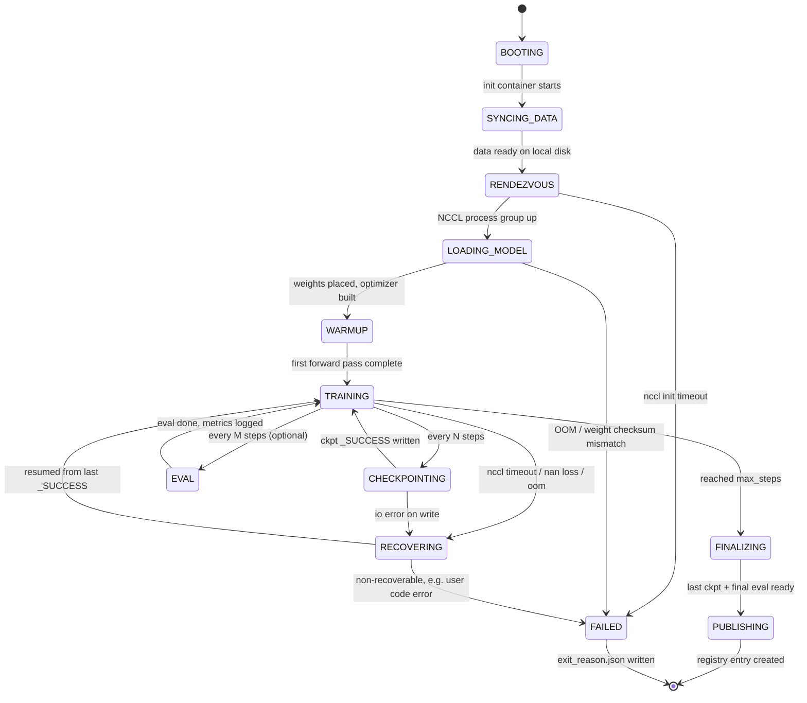
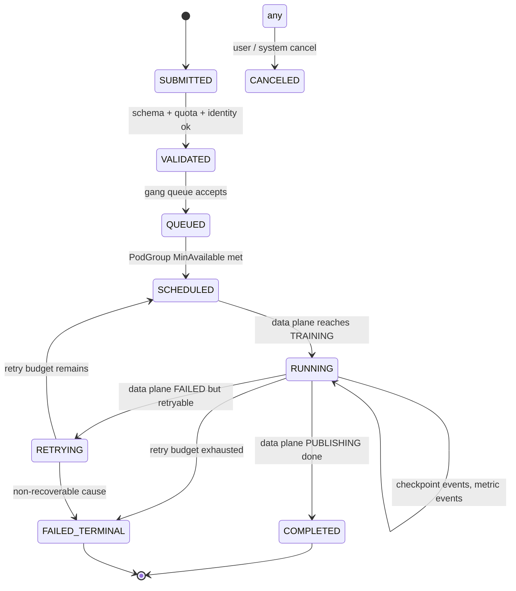

# 12 - Worker State Machine and Workflow

The data-plane worker is a state machine. Knowing it well lets you debug stalls
and design idempotent retries.

## State diagram

## State descriptions

| State | What's running | Typical duration | Exit signals |
|---|---|---|---|
| `BOOTING` | Container started, Python imports | 5-30s | Imports complete |
| `SYNCING_DATA` | Init container streaming dataset to local NVMe | 30s-5min | All shards present |
| `RENDEZVOUS` | `dist.init_process_group` | 2-30s | Process group ready |
| `LOADING_MODEL` | `from_pretrained` / weight stream | 1-15min for 70B | First param on GPU |
| `WARMUP` | First forward + lazy CUDA init + jit compile | 30-180s | First loss emitted |
| `TRAINING` | Step loop | hours-days | `step >= max_steps` or interrupt |
| `CHECKPOINTING` | Coordinated write | 5-120s | `_SUCCESS` marker |
| `EVAL` | vLLM eval sidecar runs (training waits) | 1-30min | Eval scores logged |
| `FINALIZING` | Last ckpt, end-of-training metric logging | 30s-5min | All metrics flushed |
| `PUBLISHING` | Safetensors conversion + registry write | 1-10min | Registry entry id returned |
| `RECOVERING` | Resume from `_SUCCESS` | same as `LOADING_MODEL` | Back to `TRAINING` |
| `FAILED` | Cleanup, exit_reason.json | < 5s | Pod exit |

## Transition contracts

Every transition has a precondition and a side effect. Get these wrong and you
introduce silent failure modes.

| Transition | Precondition | Side effect |
|---|---|---|
| `BOOTING → SYNCING_DATA` | Image pulled, all imports succeed | Init container started |
| `SYNCING_DATA → RENDEZVOUS` | All data shards present, checksums valid | Data path env var set |
| `RENDEZVOUS → LOADING_MODEL` | `WORLD_SIZE` ranks joined, barrier ok | `dist.is_initialized() == True` |
| `LOADING_MODEL → WARMUP` | All params on GPU, optimizer state allocated | OTEL span `model_loaded` closes |
| `WARMUP → TRAINING` | First loss is finite (not NaN/Inf) | MLflow `started_at` set |
| `TRAINING → CHECKPOINTING` | step % N == 0 AND no pending async ckpt | DCP write begins |
| `CHECKPOINTING → TRAINING` | `_SUCCESS` written, fsync'd | older ckpts pruned |
| `TRAINING → RECOVERING` | Exception caught at training loop | `exit_reason.json` written |
| `RECOVERING → TRAINING` | Latest `_SUCCESS` loadable; base_model_sha matches | RNG, optimizer, sampler restored |
| `TRAINING → FINALIZING` | `step == max_steps` | EOR signal sent to all ranks |
| `FINALIZING → PUBLISHING` | Final ckpt has `_SUCCESS`; eval scores logged | Safetensors conversion begins |
| `PUBLISHING → exit(0)` | Registry returns 201 with version id | `run.tags.registry_version` set |
| `* → FAILED` | Non-recoverable error | exit_reason.json written; pod exit ≠ 0 |

## The workflow at the job level

(This blurs into the control plane, but worth pinning so the boundary stays
crisp.)

## Idempotency keys

Three idempotency keys keep state consistent under retries:

| Key | Scope | Used by |
|---|---|---|
| `run_id` | One submission attempt | MLflow run, checkpoint dir |
| `job_id` | One logical job (all retries) | Registry namespace, billing |
| `submission_idempotency_key` | One user click | Control plane dedup |

A retry shares `job_id` but gets a **new** `run_id` (so MLflow shows the
attempt history). Checkpoints under the same `job_id` are read across retries
- this is what makes "resume from last `_SUCCESS`" deterministic regardless of
which run wrote it.

## Why this state machine matters for the architecture answer

- It's the **smallest correct API** between control and data plane: control
  plane only sees state transitions and metric snapshots, never internal step
  state.
- It pins **where retries happen** (control plane decides; data plane resumes).
- It explains why **`_SUCCESS` is the most important file in the system**:
  it's the visible boundary of every `CHECKPOINTING → TRAINING` and
  `RECOVERING → TRAINING` transition.

At Microsoft AutoML scale (`resume.txt` L91-92), the state machine is uniform
across job types. The same machinery runs a 7B LoRA, a 70B full fine-tune, and
an AutoML hyperparameter sweep - because what changes is the **profile** that
populates `LOADING_MODEL` and `TRAINING`, not the state diagram.
