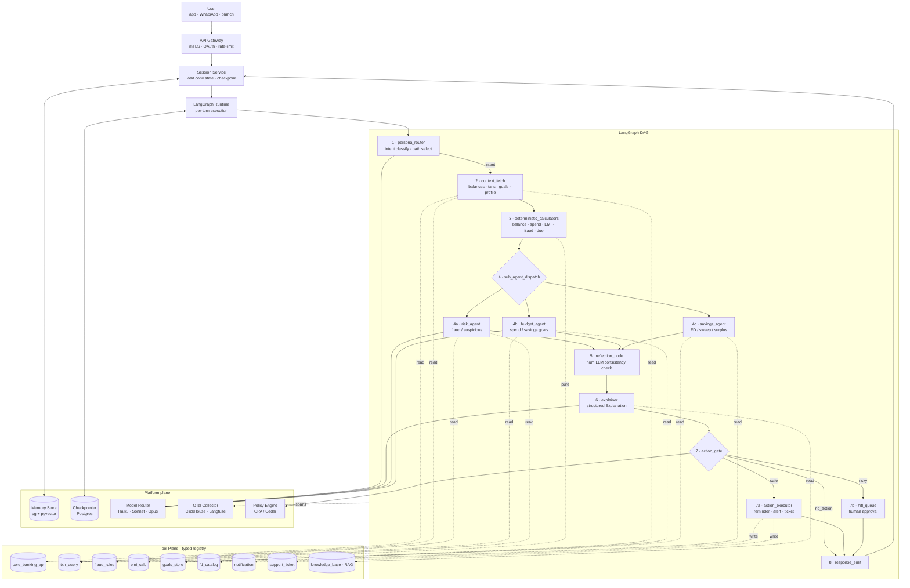
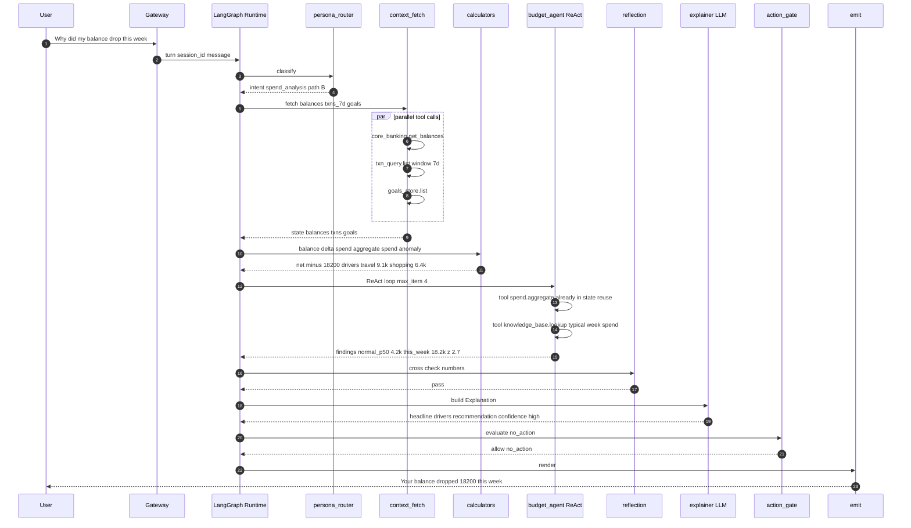

# 03 - Architecture

The agent is a **LangGraph state machine**: a directed graph of nodes that
mutate a shared `BankerState`. Edges are either *static* (always go to node B
after A) or *conditional* (a router function decides the next node based on
state). Tools are *not* nodes — they are functions called *by* nodes via a
typed registry. ReAct loops live *inside* sub-agent nodes, not at the graph's
top level. The reasoning here is the same shape we ran for BlackBox's
LangGraph ReAct runtimes with DAG orchestration and 10K+ agent runs/day
(`resume.txt` L51-54, `blackbox-experience.md` #7-#11).

## High-level topology



## Node-by-node walkthrough

### 1. `persona_router`

- **Purpose:** classify the user question into an *intent* and pick the DAG
  path. Uses Haiku-class model (cheapest, fastest) because routing is a
  high-frequency, low-stakes decision.
- **Input:** `user_message`, `user_profile.persona` (retail / premium /
  joint), `conversation.history[-3:]`.
- **Output:** `state.intent` ∈ `{balance_query, spend_analysis,
  emi_affordability, fraud_check, savings_advice, fd_suggestion,
  reminder_set, escalation, smalltalk}`; `state.path` ∈ pre-defined DAG
  branches.
- **Tool calls:** none (pure LLM classification with constrained output).
- **Fallback:** if model fails or returns unknown intent, fall back to a
  deterministic keyword classifier (`re.search`) — never block the user on
  a router failure.

### 2. `context_fetch`

- **Purpose:** parallel-fetch every piece of data the chosen path needs.
  Pre-computes the working set before any sub-agent runs.
- **Tool calls (parallel via `asyncio.gather`):**
  - `core_banking.get_balances(customer_id)` →
    `[{account_id, type, balance, currency, as_of}]`
  - `txn_query.list(customer_id, window=last_90d, limit=2000)` → paged
    transactions
  - `goals_store.list(customer_id)` → savings/budget goals
  - `core_banking.get_cards(customer_id)` → card limits, due dates
- **Failure handling:** any tool failure annotates `state.fetch_errors[]`
  and continues; downstream nodes degrade gracefully (e.g., budget agent
  refuses if `transactions` missing rather than guessing).
- **Caching:** transactions cached at session granularity with a 60s TTL;
  balances always fresh (no stale-cash bug).

### 3. `deterministic_calculators`

- **Purpose:** run *every* numerical computation the agent will ever cite.
  Pure functions, unit-tested, no LLM.
- **Functions (called based on `state.intent`):**
  - `balance.delta(prev_balance, curr_balance, txns)` →
    `{net_change, top_outflows[], top_inflows[]}`
  - `spend.aggregate(txns, group_by="category", window="month")` →
    `{[category, amount, n_txn]}`
  - `spend.anomaly(spend_this_month, historical_p50, historical_p95)` →
    `{is_anomalous, z_score, drivers[]}`
  - `emi.affordability(income, fixed_obligations, requested_emi)` →
    `{ratio, decision, safe_buffer}`
  - `fraud.evaluate(txn, rules, user_history)` → `{score, fired_rules[]}`
  - `due.upcoming(cards, accounts, window=14d)` → `{[bill, amount, due]}`
- **Why pure:** every result is rerunnable from inputs, every dispute
  reproducible. This is the same rule-engine discipline used at ShareChat
  for ad targeting and CTR scoring over 40M DAU (`resume.txt` L109-114).

### 4. Sub-agent dispatch

A **conditional edge** selects one of three sub-agents based on
`state.intent`. Each sub-agent is a **bounded ReAct loop** with:

- A **tool allowlist** (max 4-6 tools).
- A **max iteration cap** (`max_iters=4` for risk/budget; `2` for savings).
- A **structured-output requirement** at exit.

#### 4a. `risk_agent` (fraud / suspicious)

- Allowed tools: `fraud_rules.eval`, `txn_query.peers` (peer-account
  patterns), `geo.lookup`, `device.fingerprint`.
- ReAct: "is the txn anomalous?" → call `fraud_rules` → "is it
  geo-unusual?" → call `geo` → assemble verdict.
- Exit: `{verdict: clean | suspicious | confirmed_fraud, evidence[],
  recommended_action}`.

#### 4b. `budget_agent` (spend / savings)

- Allowed tools: `spend.aggregate`, `spend.anomaly`, `goals_store.get`,
  `knowledge_base.lookup` (budgeting tips).
- ReAct: "categorize spend" → "compare to history" → "compare to goal" →
  "find biggest deltas" → produce `{drivers[], goal_status, suggested_cut}`.

#### 4c. `savings_agent` (FD / surplus / sweep)

- Allowed tools: `fd_catalog.list`, `goals_store.get`,
  `liquidity.forecast(account, days=30)`.
- ReAct: "what's my idle balance trend?" → "what's the best FD bucket for
  that horizon?" → produce `{recommendation, expected_yield, risk_label}`.

### 5. `reflection_node`

- **Purpose:** self-correction. Cross-checks that the LLM's draft narrative
  (a side product of sub-agents) uses *only the numbers the calculator
  emitted*. If a number drifts > 1% from the deterministic ground truth,
  the node forces a re-explain with the canonical number injected as a
  hard constraint.
- **Tools:** none; pure comparator over `state.calc_results` vs
  `state.draft_narrative.numbers[]`.
- **Why this matters:** the most common LLM failure in finance is
  "1.8% vs 2.0%" — small, plausible, wrong. The reflection node closes
  that hole deterministically. This is the same "reflection /
  self-correction" qualifier the user listed as a requirement.

### 6. `explainer`

- **Purpose:** turn `(intent, calc_results, sub_agent_findings)` into a
  human, structured `Explanation`.
- **Output (Pydantic-validated):**
  ```python
  class Explanation(BaseModel):
      headline: str            # one-line summary
      drivers: list[Driver]    # what caused it
      recommendation: str | None
      confidence: Literal["low","medium","high"]
      citations: list[Citation]  # links back to txns / rules
      language: Literal["en","hi"]
  ```
- **Model choice:** Sonnet-class for retail; Opus-class for premium /
  escalation. Decided by `model_router` based on `state.persona` and
  `state.intent.complexity`.
- **Prompt construction:** strict template; injects only sanitized
  references (`acct_***1234`); calculator outputs as JSON, not prose.

### 7. `action_gate` and 7a/7b

- **Policy engine call:** `policy.evaluate(intent, action, user, context)`
  returns `allow | hitl | deny`. We use OPA / Cedar so policies are
  text artifacts, version-controlled, and reviewable by legal/compliance.
- **Safe action (`allow`):** `action_executor` writes via
  `notification.send`, `support_ticket.create`, `reminder.create` with
  an **idempotency key** = `sha256(session_id + intent + action_args)`.
- **Risky action (`hitl`):** enqueues to `hitl_queue` with timeout and
  escalation policy; agent emits a "request submitted, you will be
  notified when approved" response.
- **Deny:** explicit decline with reason, surfaced in `Explanation`.

### 8. `response_emit`

- Renders the `Explanation` for the surface (app card / WhatsApp text /
  branch banker UI), persists the turn to memory and trace, returns.

## Edge types

| Edge | Type | Decision logic |
|---|---|---|
| `router → fetch` | static | always |
| `fetch → calc` | static | always |
| `calc → sub_dispatch` | conditional | by `state.intent` |
| `sub_dispatch → risk/budget/savings` | conditional | by `state.intent` |
| `sub_* → reflect` | static | always |
| `reflect → explainer` | conditional | if `reflect.passed` else loop back to `sub_*` with `corrective_hint` |
| `explainer → action_gate` | static | always |
| `action_gate → action_exec | hitl_queue | emit` | conditional | by `policy.evaluate()` |

## Tool-call shape (typed registry)

Every tool is declared once. The same declaration produces:

1. Python callable for nodes.
2. JSON schema fed to LLM `tool_calling` for sub-agents.
3. OTel span attributes for observability.

```python
@tool(
    name="spend.aggregate",
    input_schema=AggregateInput,
    output_schema=AggregateOutput,
    side_effect=False,
    cost="cheap",
    timeout_s=0.5,
)
def spend_aggregate(inp: AggregateInput) -> AggregateOutput: ...
```

The full registry shape is in [05-low-level-design.md](05-low-level-design.md).

## End-to-end trace: "Why did my balance drop this week?"



Total: ~5 tool calls, 1 LLM router call, 1 LLM ReAct iteration in budget,
1 LLM explainer call. ~3 LLM calls total. Budget: ~2.4s p95.

## How nodes talk to each other (the contract)

Nodes do **not** call each other directly. They only **mutate `BankerState`**
and **return `state` to the runtime**. The runtime walks the DAG based on
edges. This gives us four properties:

1. **Pure-node testability:** every node is `state → state`, trivially
   unit-tested with frozen `BankerState` fixtures.
2. **Replay:** persist the input `BankerState` at every node, and any node
   becomes independently replayable.
3. **Parallelism:** independent nodes are parallelizable by the runtime; we
   exploit this in `context_fetch`.
4. **Resumability:** the LangGraph checkpointer (Postgres) snapshots state
   after every node, so a worker crash mid-graph resumes at the next
   unstarted node, not from scratch.

This is the same durability story as BlackBox's graph workflow engine —
DAG execution, checkpointing, retry semantics, memory persistence
(`resume.txt` L52-54, `blackbox-experience.md` #12-#15).

## What lives outside the DAG

- **API gateway:** authn, rate limits, sticky session routing.
- **Session service:** holds conversational state across turns (the DAG
  runs per-turn); persists into Postgres + pgvector.
- **Model router:** chooses LLM provider/model per call based on
  `cost × latency × capability`. Lifted verbatim from BlackBox model
  router across Claude / GPT / Grok at 1B tokens/month (`resume.txt`
  L55-56).
- **Policy engine (OPA/Cedar):** keeps action rules out of code.
- **Telemetry pipeline:** OTel → ClickHouse + Langfuse; same shape as
  BlackBox's 50M spans/day mesh (`resume.txt` L58-59).
- **Eval harness:** offline replay of golden conversations against any
  candidate model/prompt; gates deployment.
