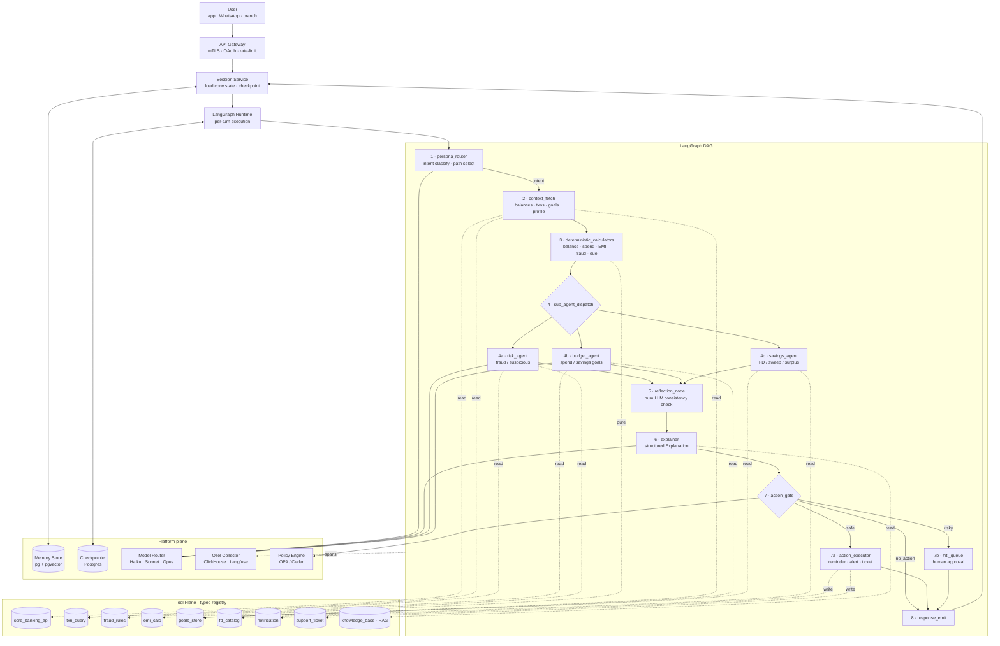
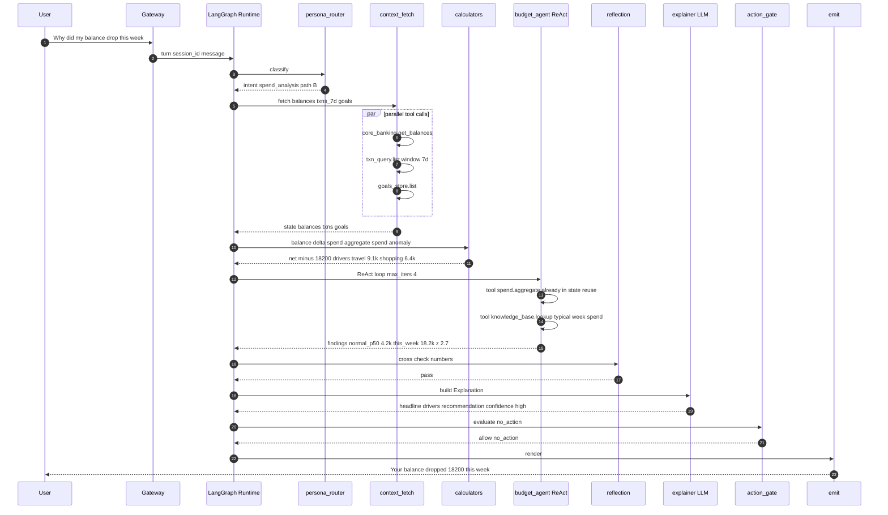
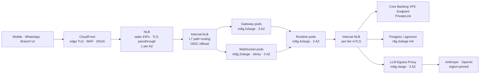

# 03 - Architecture

The agent is a **LangGraph state machine**: a directed graph of nodes that
mutate a shared `BankerState`. Edges are either *static* (always go to node B
after A) or *conditional* (a router function decides the next node based on
state). Tools are *not* nodes — they are functions called *by* nodes via a
typed registry. ReAct loops live *inside* sub-agent nodes, not at the graph's
top level. The reasoning here is the same shape we ran for BlackBox's
LangGraph ReAct runtimes with DAG orchestration and 10K+ agent runs/day
(`resume.txt` L51-54, `blackbox-experience.md` #7-#11).

## High-level topology



## Node-by-node walkthrough

### 1. `persona_router`

- **Purpose:** classify the user question into an *intent* and pick the DAG
  path. Uses Haiku-class model (cheapest, fastest) because routing is a
  high-frequency, low-stakes decision.
- **Input:** `user_message`, `user_profile.persona` (retail / premium /
  joint), `conversation.history[-3:]`.
- **Output:** `state.intent` ∈ `{balance_query, spend_analysis,
  emi_affordability, fraud_check, savings_advice, fd_suggestion,
  reminder_set, escalation, smalltalk}`; `state.path` ∈ pre-defined DAG
  branches.
- **Tool calls:** none (pure LLM classification with constrained output).
- **Fallback:** if model fails or returns unknown intent, fall back to a
  deterministic keyword classifier (`re.search`) — never block the user on
  a router failure.

### 2. `context_fetch`

- **Purpose:** parallel-fetch every piece of data the chosen path needs.
  Pre-computes the working set before any sub-agent runs.
- **Tool calls (parallel via `asyncio.gather`):**
  - `core_banking.get_balances(customer_id)` →
    `[{account_id, type, balance, currency, as_of}]`
  - `txn_query.list(customer_id, window=last_90d, limit=2000)` → paged
    transactions
  - `goals_store.list(customer_id)` → savings/budget goals
  - `core_banking.get_cards(customer_id)` → card limits, due dates
- **Failure handling:** any tool failure annotates `state.fetch_errors[]`
  and continues; downstream nodes degrade gracefully (e.g., budget agent
  refuses if `transactions` missing rather than guessing).
- **Caching:** transactions cached at session granularity with a 60s TTL;
  balances always fresh (no stale-cash bug).

### 3. `deterministic_calculators`

- **Purpose:** run *every* numerical computation the agent will ever cite.
  Pure functions, unit-tested, no LLM.
- **Functions (called based on `state.intent`):**
  - `balance.delta(prev_balance, curr_balance, txns)` →
    `{net_change, top_outflows[], top_inflows[]}`
  - `spend.aggregate(txns, group_by="category", window="month")` →
    `{[category, amount, n_txn]}`
  - `spend.anomaly(spend_this_month, historical_p50, historical_p95)` →
    `{is_anomalous, z_score, drivers[]}`
  - `emi.affordability(income, fixed_obligations, requested_emi)` →
    `{ratio, decision, safe_buffer}`
  - `fraud.evaluate(txn, rules, user_history)` → `{score, fired_rules[]}`
  - `due.upcoming(cards, accounts, window=14d)` → `{[bill, amount, due]}`
- **Why pure:** every result is rerunnable from inputs, every dispute
  reproducible. This is the same rule-engine discipline used at ShareChat
  for ad targeting and CTR scoring over 40M DAU (`resume.txt` L109-114).

### 4. Sub-agent dispatch

A **conditional edge** selects one of three sub-agents based on
`state.intent`. Each sub-agent is a **bounded ReAct loop** with:

- A **tool allowlist** (max 4-6 tools).
- A **max iteration cap** (`max_iters=4` for risk/budget; `2` for savings).
- A **structured-output requirement** at exit.

#### 4a. `risk_agent` (fraud / suspicious)

- Allowed tools: `fraud_rules.eval`, `txn_query.peers` (peer-account
  patterns), `geo.lookup`, `device.fingerprint`.
- ReAct: "is the txn anomalous?" → call `fraud_rules` → "is it
  geo-unusual?" → call `geo` → assemble verdict.
- Exit: `{verdict: clean | suspicious | confirmed_fraud, evidence[],
  recommended_action}`.

#### 4b. `budget_agent` (spend / savings)

- Allowed tools: `spend.aggregate`, `spend.anomaly`, `goals_store.get`,
  `knowledge_base.lookup` (budgeting tips).
- ReAct: "categorize spend" → "compare to history" → "compare to goal" →
  "find biggest deltas" → produce `{drivers[], goal_status, suggested_cut}`.

#### 4c. `savings_agent` (FD / surplus / sweep)

- Allowed tools: `fd_catalog.list`, `goals_store.get`,
  `liquidity.forecast(account, days=30)`.
- ReAct: "what's my idle balance trend?" → "what's the best FD bucket for
  that horizon?" → produce `{recommendation, expected_yield, risk_label}`.

### 5. `reflection_node`

- **Purpose:** self-correction. Cross-checks that the LLM's draft narrative
  (a side product of sub-agents) uses *only the numbers the calculator
  emitted*. If a number drifts > 1% from the deterministic ground truth,
  the node forces a re-explain with the canonical number injected as a
  hard constraint.
- **Tools:** none; pure comparator over `state.calc_results` vs
  `state.draft_narrative.numbers[]`.
- **Why this matters:** the most common LLM failure in finance is
  "1.8% vs 2.0%" — small, plausible, wrong. The reflection node closes
  that hole deterministically. This is the same "reflection /
  self-correction" qualifier the user listed as a requirement.

### 6. `explainer`

- **Purpose:** turn `(intent, calc_results, sub_agent_findings)` into a
  human, structured `Explanation`.
- **Output (Pydantic-validated):**
  ```python
  class Explanation(BaseModel):
      headline: str            # one-line summary
      drivers: list[Driver]    # what caused it
      recommendation: str | None
      confidence: Literal["low","medium","high"]
      citations: list[Citation]  # links back to txns / rules
      language: Literal["en","hi"]
  ```
- **Model choice:** Sonnet-class for retail; Opus-class for premium /
  escalation. Decided by `model_router` based on `state.persona` and
  `state.intent.complexity`.
- **Prompt construction:** strict template; injects only sanitized
  references (`acct_***1234`); calculator outputs as JSON, not prose.

### 7. `action_gate` and 7a/7b

- **Policy engine call:** `policy.evaluate(intent, action, user, context)`
  returns `allow | hitl | deny`. We use OPA / Cedar so policies are
  text artifacts, version-controlled, and reviewable by legal/compliance.
- **Safe action (`allow`):** `action_executor` writes via
  `notification.send`, `support_ticket.create`, `reminder.create` with
  an **idempotency key** = `sha256(session_id + intent + action_args)`.
- **Risky action (`hitl`):** enqueues to `hitl_queue` with timeout and
  escalation policy; agent emits a "request submitted, you will be
  notified when approved" response.
- **Deny:** explicit decline with reason, surfaced in `Explanation`.

### 8. `response_emit`

- Renders the `Explanation` for the surface (app card / WhatsApp text /
  branch banker UI), persists the turn to memory and trace, returns.

## Edge types

| Edge | Type | Decision logic |
|---|---|---|
| `router → fetch` | static | always |
| `fetch → calc` | static | always |
| `calc → sub_dispatch` | conditional | by `state.intent` |
| `sub_dispatch → risk/budget/savings` | conditional | by `state.intent` |
| `sub_* → reflect` | static | always |
| `reflect → explainer` | conditional | if `reflect.passed` else loop back to `sub_*` with `corrective_hint` |
| `explainer → action_gate` | static | always |
| `action_gate → action_exec | hitl_queue | emit` | conditional | by `policy.evaluate()` |

## Tool-call shape (typed registry)

Every tool is declared once. The same declaration produces:

1. Python callable for nodes.
2. JSON schema fed to LLM `tool_calling` for sub-agents.
3. OTel span attributes for observability.

```python
@tool(
    name="spend.aggregate",
    input_schema=AggregateInput,
    output_schema=AggregateOutput,
    side_effect=False,
    cost="cheap",
    timeout_s=0.5,
)
def spend_aggregate(inp: AggregateInput) -> AggregateOutput: ...
```

The full registry shape is in [05-low-level-design.md](05-low-level-design.md).

## End-to-end trace: "Why did my balance drop this week?"



Total: ~5 tool calls, 1 LLM router call, 1 LLM ReAct iteration in budget,
1 LLM explainer call. ~3 LLM calls total. Budget: ~2.4s p95.

## How nodes talk to each other (the contract)

Nodes do **not** call each other directly. They only **mutate `BankerState`**
and **return `state` to the runtime**. The runtime walks the DAG based on
edges. This gives us four properties:

1. **Pure-node testability:** every node is `state → state`, trivially
   unit-tested with frozen `BankerState` fixtures.
2. **Replay:** persist the input `BankerState` at every node, and any node
   becomes independently replayable.
3. **Parallelism:** independent nodes are parallelizable by the runtime; we
   exploit this in `context_fetch`.
4. **Resumability:** the LangGraph checkpointer (Postgres) snapshots state
   after every node, so a worker crash mid-graph resumes at the next
   unstarted node, not from scratch.

This is the same durability story as BlackBox's graph workflow engine —
DAG execution, checkpointing, retry semantics, memory persistence
(`resume.txt` L52-54, `blackbox-experience.md` #12-#15).

## Load balancer and edge topology

The runtime is a stateless Python fleet, but the *entry path* is not a single
hop — three load-balancer layers carry distinct concerns and live in distinct
trust zones.



### LB combination in use

Following the combination table in the analyze-my-resume **Load Balancer
Configuration** guidance:

| Hop | Pattern | Why |
|---|---|---|
| Edge → NLB | **CloudFront in front of NLB** | DDoS + WAF + edge TLS termination; static EIPs at NLB for bank partner firewall whitelisting |
| NLB → ALB | **NLB → ALB chaining** | NLB for static IPs + TLS passthrough; ALB for L7 path/host routing, OIDC offload, sticky sessions on WebSocket pods |
| ALB → Runtime | direct (L7) | Path-based: `/v1/conversations/*` → runtime; `/v1/conversations/.../stream` → WebSocket pods |
| Runtime → internal services | **Internal NLB per tier** | Pure TCP / mTLS; PrivateLink to Core Banking; flow-hash stickiness for connection pools |

### Per-LB configuration knobs

**CloudFront (edge):**
- TLS 1.3 minimum, custom domain, ACM cert.
- AWS WAF Web ACL: managed rule groups (Core, KnownBadInputs, IP-Reputation) + rate limit (200 req / 5 min / IP).
- Origin shield enabled in `ap-south-1` to absorb burst.

**External NLB (per region, 1 per AZ = 3 nodes):**
- Listener: TLS:443 (terminate for mTLS), TCP:443 (passthrough for app pin).
- Cross-zone LB: **disabled** (inter-AZ data charge avoidance; capacity is roughly even).
- Static Elastic IPs (3, one per AZ) — published to partner banks for firewall allowlisting.
- Health check: TCP:8443, interval 10 s, threshold 2.
- Deregistration delay: 60 s (tuned down from 300 s default) — conversational turns are short.

**Internal ALB:**
- Listener: HTTPS:443, OIDC action on `/v1/admin/*` paths (bank ops SSO).
- Listener rules (priority order):
  1. `path=/healthz` → return 200 fixed-response.
  2. `path=/v1/conversations/*/stream`, header `Upgrade: websocket` → WebSocket target group (sticky 1 h, application cookie).
  3. `path=/v1/conversations/*` → runtime target group (non-sticky, even distribution).
  4. default → 404.
- Idle timeout: **120 s** (above default 60 s) — covers deep-analysis turns.
- HTTP/2 enabled (required for the gRPC internal hop to Core Banking).
- Slow-start: 60 s on the runtime target group — gives a new pod time to warm the LangGraph runtime + LLM client pools.
- Access logs → S3 → Athena, partitioned by date.

**Internal NLB (per tier — Postgres, LLM egress, Core Banking VPCE):**
- TLS passthrough; backend owns the cert (mTLS).
- Cross-zone LB: **enabled** for stateful tiers (Postgres) so write traffic balances across replicas; **disabled** for stateless tiers.
- Preserve client IP (instance targets); proxy-protocol v2 for IP targets behind NAT.
- Flow hash 5-tuple sticky — important for the LLM egress pool where each provider connection is reused.

### Health-check chain

The chain is: CloudFront → NLB (TCP) → ALB (HTTP `/healthz` 200) → pod
(`/healthz` checks LangGraph compile + DB pool + LLM provider reachability).
Each layer's interval and threshold *decrease* down the chain so an upstream
LB sees a node as unhealthy before the downstream LB does, preventing
half-drain states.

### Failure modes per hop

| Hop fails | Client sees | Recovery |
|---|---|---|
| CloudFront | DNS failover to NLB direct (degraded WAF) | < 60 s via Route53 health check |
| NLB AZ | client retries to alternate EIP | DNS round-robin across 3 EIPs |
| ALB | 502; CloudFront retries to alternate AZ | ALB is multi-AZ by design |
| Runtime pod | ALB sheds unhealthy target | health-check interval 5 s, threshold 2 |
| LLM egress | runtime falls back to alt provider via model router | < 1 s in-flight, no client impact |

## AWS node sizing per tier

Anchored on the **m8g** (Graviton 4) family per the analyze-my-resume sizing
reference. Peak load is **900 turns/s**, ~3 LLM calls and ~5 tool calls per
turn, headroom factor 1.5 for stateless tiers and 2.0 for stateful tiers.

### Sizing arithmetic

| Tier | Instance | vCPU / RAM / instance | Per-instance capacity | Peak load | Fleet (peak × headroom / per-inst) | On-Demand $/hr | Monthly ($) |
|---|---|---|---|---|---|---|---|
| Edge gateway pods (HTTP/WS terminate, auth, rate-limit) | **m8g.2xlarge** | 8 / 32 GiB | ~600 conv-conn (idle keep-alive heavy) | 50k concurrent conn | ceil(50000 × 1.5 / 600) = **125** | $0.343 | ~$31k |
| WebSocket pods (sticky, streaming) | **m8g.2xlarge** | 8 / 32 GiB | ~1.5k WS / pod (idle), 300 active | 30% of sessions streaming → ~4.5k active WS | ceil(4500 × 1.5 / 300) = **23** | $0.343 | ~$5.8k |
| LangGraph runtime workers (the agent itself) | **m8g.4xlarge** | 16 / 64 GiB | ~30 concurrent turns (LLM-concurrency bound, not CPU) | 900 turns/s × avg 3 s = 2700 concurrent | ceil(2700 × 1.5 / 30) = **135** | $0.686 | ~$67.5k |
| LLM egress proxy (PII tokenizer + per-provider semaphore) | **m8g.xlarge** | 4 / 16 GiB | ~3k LLM RPS | 900 × 3 = 2.7k LLM RPS peak | ceil(2700 × 1.5 / 3000) = **2** → bump to **6** for 3-AZ × 2 | $0.171 | ~$0.75k |
| Memory store — Postgres + pgvector (`user_facts`, episodic) | **r8g.4xlarge** (8 GiB/vCPU memory-bound) | 16 / 128 GiB | ~3k SELECT/s, ~500 INSERT/s with pgvector | 25M turns/day × 2 reads = ~580/s avg, ~1.7k peak | 1 primary + 2 replicas × 3 AZ = **9** (Multi-AZ HA) | $1.075 | ~$7.1k |
| LangGraph checkpointer Postgres | **r8g.2xlarge** sharded ×8 | 8 / 64 GiB | ~5k writes/s (append-only) | 25M turns × 10 node-transitions / day ≈ 2.9k writes/s avg, ~9k peak | 8 shards × 3 AZ HA = **24** | $0.538 | ~$9.4k |
| Trace store — ClickHouse (zstd, partitioned) | **i4i.4xlarge** (NVMe write-heavy) | 16 / 128 GiB / 3.75 TB NVMe | ~150k spans/s ingest | 50M spans/day / BlackBox parity → 580/s avg, 5k/s peak | 3 shards × 2 replicas = **6** | $1.373 | ~$6k |
| Redis (hot-user cache) | **r8g.large** × 3 AZ cluster | 2 / 16 GiB | ~200k ops/s | hot-user reads ~5k/s peak | **3** | $0.151 | ~$0.33k |
| OPA policy sidecar (DaemonSet on runtime nodes) | bundled | — | — | — | — | $0 | $0 |
| LLM egress NAT / Internet egress | NAT Gateway (3 AZ) | — | ~45 Gbps | data ~5 TB/day egress | **3** | $0.045 + data | ~$5.4k incl data |

**Total compute & data tier:** ~$133k/month (≈ $1.6M/year) before reserved-
instance / savings-plan discounts. Reserved 1y all-upfront brings this down
~30% → ~$93k/month. LLM API spend (~$7M/month from
[06-scaling-and-capacity.md](06-scaling-and-capacity.md)) dwarfs compute,
which is the load-bearing argument for *not* over-optimizing compute
sizing early.

### Sizing notes per tier

- **Gateway and runtime pods on m8g**: balanced 4 GiB/vCPU profile fits well —
  most work is I/O wait (LLM call, DB read), not CPU-bound. EBS burst
  bandwidth on m8g.2xlarge (up to 10 Gbps) is more than enough for the
  ~12 KB per-turn trace write footprint.
- **Memory store on r8g**: pgvector + `user_facts` hot working set wants
  more RAM than the 4 GiB/vCPU m8g ratio. r8g.4xlarge's 8 GiB/vCPU keeps
  the index hot.
- **Checkpointer on r8g.2xlarge sharded**: 9k writes/s peak across 8 shards
  is ~1.1k/s/shard — well within a single r8g.2xlarge ceiling, and sharding
  by `session_id` mod 8 isolates hot sessions.
- **Trace store on i4i.4xlarge (not m8g)**: write-heavy NVMe workload —
  deviates from m8g per the analyze-my-resume sizing table ("Write-heavy
  NVMe (>1 GB/s sequential) → i4i"). Local NVMe avoids the EBS write
  amplification.
- **LLM egress on m8g.xlarge**: throughput-bound, not concurrency-bound;
  4 vCPU is plenty for tokenization + HTTP/2 multiplexing. Over-provisioned
  to 6 instances for 3-AZ × 2 redundancy at minimum cost.
- **Postgres Multi-AZ**: RDS Multi-AZ for `user_facts`; self-managed
  Patroni on EC2 for the LangGraph checkpointer shards (cost + sharding
  flexibility).

### Headroom and burst

- Stateless tiers: headroom 1.5 (peak / per-inst → fleet has ~33% slack at
  peak). Auto-scaling on CPU > 60% with 2-minute warm-up — gateway scales
  in ~3 minutes, runtime in ~5 minutes (LangGraph compile + DB pool).
- Stateful tiers: headroom 2.0 plus replica spare; no auto-scaling — we
  pre-provision for peak.
- Salary-day pre-warm: 30 minutes before predicted spike, scale runtime
  fleet to 1.8× baseline and pre-fill the balance cache for the top
  10% of users.

### Reserved capacity strategy

| Tier | RI / Savings Plan choice |
|---|---|
| Gateway + runtime (steady baseline) | 70% on 1y All-Upfront Compute SP; 30% on-demand for elastic head |
| WebSocket pods | 100% Compute SP (steady traffic) |
| Memory / checkpoint Postgres | 100% RDS RI or EC2 RI (steady) |
| ClickHouse | 100% EC2 RI (steady) |
| LLM egress, NAT | on-demand (low absolute cost) |

## What lives outside the DAG

- **API gateway:** authn, rate limits, sticky session routing.
- **Session service:** holds conversational state across turns (the DAG
  runs per-turn); persists into Postgres + pgvector.
- **Model router:** chooses LLM provider/model per call based on
  `cost × latency × capability`. Lifted verbatim from BlackBox model
  router across Claude / GPT / Grok at 1B tokens/month (`resume.txt`
  L55-56).
- **Policy engine (OPA/Cedar):** keeps action rules out of code.
- **Telemetry pipeline:** OTel → ClickHouse + Langfuse; same shape as
  BlackBox's 50M spans/day mesh (`resume.txt` L58-59).
- **Eval harness:** offline replay of golden conversations against any
  candidate model/prompt; gates deployment.
