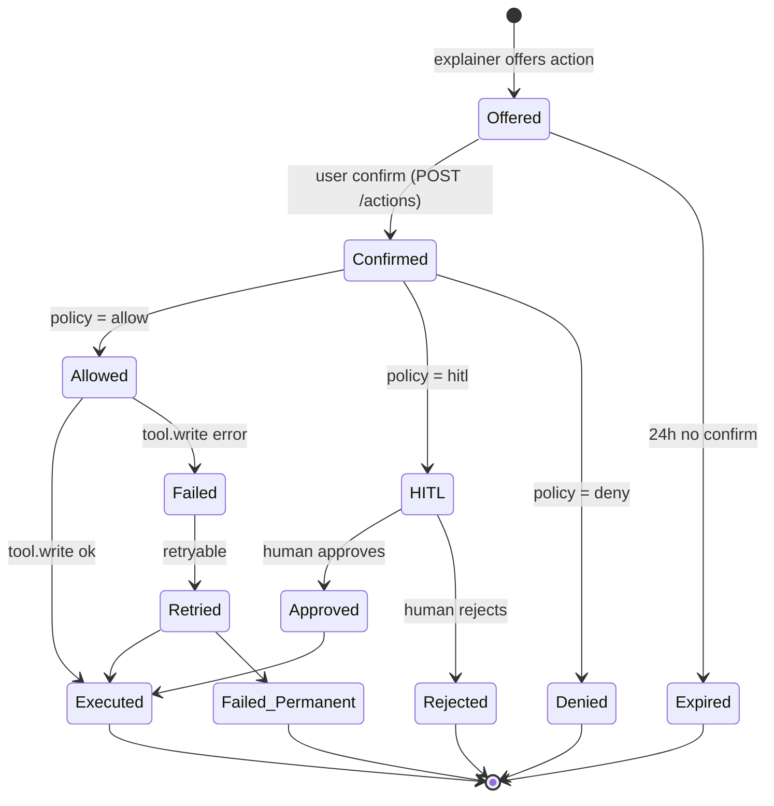

# 05 - Low-Level Design

This is the "show me code" file. Every module is small, single-purpose,
unit-testable, and JSON-schema typed at every boundary. Modeled on the
modular-Python and rule-engine qualifiers in the prompt.

## Module layout

```
banker/
├── api/
│   ├── http.py              # FastAPI routes
│   ├── ws.py                # streaming
│   └── auth.py              # JWT + mTLS validation
├── runtime/
│   ├── graph.py             # LangGraph DAG assembly
│   ├── state.py             # BankerState (Pydantic)
│   ├── checkpoint.py        # Postgres checkpointer
│   └── runner.py            # per-turn executor
├── nodes/
│   ├── persona_router.py
│   ├── context_fetch.py
│   ├── calculators.py
│   ├── sub_dispatch.py
│   ├── risk_agent.py
│   ├── budget_agent.py
│   ├── savings_agent.py
│   ├── reflection.py
│   ├── explainer.py
│   ├── action_gate.py
│   ├── action_executor.py
│   └── response_emit.py
├── tools/
│   ├── registry.py          # @tool decorator + catalog
│   ├── core_banking.py
│   ├── txn_query.py
│   ├── goals_store.py
│   ├── fraud_rules.py
│   ├── emi.py
│   ├── due.py
│   ├── fd_catalog.py
│   ├── liquidity.py
│   ├── knowledge_base.py
│   ├── notification.py
│   ├── support_ticket.py
│   └── reminder.py
├── memory/
│   ├── working.py
│   ├── episodic.py
│   └── long_term.py
├── models/
│   ├── router.py            # multi-provider model router
│   ├── providers/{claude,gpt,grok}.py
│   └── prompts/             # versioned, hash-pinned
├── policy/
│   ├── engine.py            # OPA/Cedar wrapper
│   └── rules/{*.rego,*.cedar}
├── telemetry/
│   ├── otel.py
│   ├── langfuse.py
│   └── eval/                # replay + golden-set harness
└── tests/
    ├── unit/                # per-node, per-tool
    ├── property/             # hypothesis tests on calculators
    ├── golden/               # frozen conversations
    └── e2e/                  # full DAG against staging
```

## `BankerState` - the shared object

```python
# runtime/state.py
from pydantic import BaseModel, Field
from typing import Literal, Any

class CustomerCtx(BaseModel):
    customer_id: str
    persona: Literal["retail", "premium", "joint"]
    locale: Literal["en-IN", "hi-IN"]
    consents: dict[str, bool]

class ConvCtx(BaseModel):
    session_id: str
    turn_id: str
    message: str
    history: list[dict] = Field(default_factory=list)  # last N turns, redacted

class CalcResults(BaseModel):
    balance_delta: dict | None = None
    spend_agg: dict | None = None
    spend_anomaly: dict | None = None
    emi_affordability: dict | None = None
    fraud: dict | None = None
    due: dict | None = None

class SubAgentFindings(BaseModel):
    risk: dict | None = None
    budget: dict | None = None
    savings: dict | None = None

class Draft(BaseModel):
    headline: str | None = None
    drivers: list[dict] = Field(default_factory=list)
    numbers_cited: list[float] = Field(default_factory=list)

class Explanation(BaseModel):
    headline: str
    drivers: list[dict]
    recommendation: str | None = None
    confidence: Literal["low", "medium", "high"]
    citations: list[dict]
    language: str

class BankerState(BaseModel):
    customer: CustomerCtx
    conv: ConvCtx
    intent: str | None = None
    path: str | None = None
    fetch: dict = Field(default_factory=dict)
    fetch_errors: list[str] = Field(default_factory=list)
    calc: CalcResults = Field(default_factory=CalcResults)
    sub: SubAgentFindings = Field(default_factory=SubAgentFindings)
    draft: Draft = Field(default_factory=Draft)
    reflect: dict = Field(default_factory=dict)
    explanation: Explanation | None = None
    actions_offered: list[dict] = Field(default_factory=list)
    action_decision: Literal["allow", "hitl", "deny", "none"] = "none"
    errors: list[dict] = Field(default_factory=list)
    trace_id: str
```

Why one big object: it is **the** invariant the runtime checkpoints. Diff
between state versions is the audit story.

## Tool decorator + registry

```python
# tools/registry.py
from dataclasses import dataclass, field
from typing import Callable, Type, Awaitable
from pydantic import BaseModel
import functools, json, hashlib

@dataclass
class ToolSpec:
    name: str
    version: str
    description: str
    input_schema: Type[BaseModel]
    output_schema: Type[BaseModel]
    side_effect: bool
    cost: str
    timeout_s: float
    pii_class: str
    fn: Callable[..., Awaitable[BaseModel]]
    rate_limit: "RateLimit | None" = None

REGISTRY: dict[str, ToolSpec] = {}

def tool(**meta):
    def decorate(fn):
        spec = ToolSpec(fn=_instrument(fn), **meta)
        REGISTRY[spec.name] = spec
        return spec
    return decorate

def _instrument(fn):
    @functools.wraps(fn)
    async def wrapped(inp, *, ctx):
        spec = REGISTRY[fn.__qualname__]  # resolved at registration
        with otel.span(f"tool.{spec.name}",
                       attributes={"tool.version": spec.version,
                                   "tool.side_effect": spec.side_effect,
                                   "caller.node": ctx.node}) as span:
            args_hash = _hash_args(inp)
            span.set_attribute("tool.args_hash", args_hash)
            try:
                out = await asyncio.wait_for(fn(inp, ctx=ctx),
                                             timeout=spec.timeout_s)
                span.set_attribute("tool.result_hash", _hash_args(out))
                return out
            except asyncio.TimeoutError:
                metrics.tool_timeout.inc(tool=spec.name)
                raise
    return wrapped

def llm_tools_for(*names: str) -> list[dict]:
    """JSON schemas for LLM tool-calling."""
    return [
        {
            "type": "function",
            "name": REGISTRY[n].name,
            "description": REGISTRY[n].description,
            "parameters": REGISTRY[n].input_schema.model_json_schema(),
        }
        for n in names
    ]
```

## A calculator (pure, unit-testable)

```python
# tools/emi.py
from pydantic import BaseModel, Field

class EmiAffordabilityIn(BaseModel):
    monthly_income: float = Field(gt=0)
    existing_obligations: float = Field(ge=0)
    requested_emi: float = Field(gt=0)
    threshold: float = 0.50   # FOIR

class EmiAffordabilityOut(BaseModel):
    foir: float
    decision: str   # "ok" | "tight" | "deny"
    safe_buffer: float

@tool(
    name="emi.affordability", version="2",
    description="EMI affordability via FOIR (Fixed Obligations to Income Ratio).",
    input_schema=EmiAffordabilityIn, output_schema=EmiAffordabilityOut,
    side_effect=False, cost="cheap", timeout_s=0.05, pii_class="none",
)
async def emi_affordability(inp: EmiAffordabilityIn, *, ctx) -> EmiAffordabilityOut:
    total = inp.existing_obligations + inp.requested_emi
    foir = total / inp.monthly_income
    if foir <= inp.threshold - 0.10:
        decision = "ok"
    elif foir <= inp.threshold:
        decision = "tight"
    else:
        decision = "deny"
    safe_buffer = max(0.0, (inp.threshold * inp.monthly_income) - total)
    return EmiAffordabilityOut(foir=round(foir, 4),
                               decision=decision,
                               safe_buffer=round(safe_buffer, 2))
```

Unit test:

```python
# tests/unit/test_emi.py
import pytest
from hypothesis import given, strategies as st
from banker.tools.emi import emi_affordability, EmiAffordabilityIn

@pytest.mark.asyncio
async def test_emi_ok():
    out = await emi_affordability(
        EmiAffordabilityIn(monthly_income=100_000, existing_obligations=10_000, requested_emi=20_000),
        ctx=Ctx(node="t"))
    assert out.decision == "ok"

@pytest.mark.asyncio
async def test_emi_deny():
    out = await emi_affordability(
        EmiAffordabilityIn(monthly_income=100_000, existing_obligations=40_000, requested_emi=20_000),
        ctx=Ctx(node="t"))
    assert out.decision == "deny"

@given(st.floats(min_value=10_000, max_value=10_000_000),
       st.floats(min_value=0, max_value=10_000_000),
       st.floats(min_value=1, max_value=10_000_000))
@pytest.mark.asyncio
async def test_emi_foir_invariant(inc, ob, req):
    out = await emi_affordability(
        EmiAffordabilityIn(monthly_income=inc, existing_obligations=ob, requested_emi=req),
        ctx=Ctx(node="t"))
    assert 0 <= out.foir
    assert (out.foir > 0.5) == (out.decision == "deny")
```

## A node (pure transform on state)

```python
# nodes/budget_agent.py
from banker.runtime.state import BankerState
from banker.tools.registry import llm_tools_for, REGISTRY
from banker.models.router import call_llm

MAX_ITERS = 4
ALLOWED_TOOLS = ["spend.aggregate", "spend.anomaly",
                 "goals_store.list", "knowledge_base.lookup"]

async def budget_agent(state: BankerState) -> BankerState:
    msgs = [
        {"role": "system", "content": BUDGET_SYSTEM_PROMPT},
        {"role": "user", "content": _render(state)},
    ]
    for i in range(MAX_ITERS):
        out = await call_llm(
            purpose="budget_agent",
            messages=msgs,
            tools=llm_tools_for(*ALLOWED_TOOLS),
            structured_output=BudgetFindings,  # final answer schema
        )
        if out.finish_reason == "tool_calls":
            for tc in out.tool_calls:
                if tc.name not in ALLOWED_TOOLS:
                    raise PolicyViolation(tc.name)
                spec = REGISTRY[tc.name]
                result = await spec.fn(spec.input_schema(**tc.args),
                                       ctx=Ctx(node="budget_agent", iteration=i))
                msgs.append({"role": "tool", "tool_call_id": tc.id,
                             "content": result.model_dump_json()})
            continue
        # structured-output exit
        state.sub.budget = out.parsed.model_dump()
        return state
    # iteration cap hit
    state.errors.append({"node": "budget_agent", "kind": "max_iters"})
    state.sub.budget = {"degraded": True}
    return state
```

Key invariants:

- The node returns a *new* `BankerState` (Pydantic copy).
- The ReAct loop is **inside the node**, not at the top of the graph -
  this is what makes the outer DAG predictable.
- Tools are restricted by an **allowlist**, not by faith in the prompt.

## DAG assembly

```python
# runtime/graph.py
from langgraph.graph import StateGraph, END
from banker.runtime.state import BankerState
from banker.nodes import (persona_router, context_fetch, calculators,
                          risk_agent, budget_agent, savings_agent,
                          reflection, explainer, action_gate,
                          action_executor, response_emit)

def build_graph():
    g = StateGraph(BankerState)
    g.add_node("router", persona_router.run)
    g.add_node("fetch", context_fetch.run)
    g.add_node("calc", calculators.run)
    g.add_node("risk", risk_agent.run)
    g.add_node("budget", budget_agent.run)
    g.add_node("savings", savings_agent.run)
    g.add_node("reflect", reflection.run)
    g.add_node("explain", explainer.run)
    g.add_node("gate", action_gate.run)
    g.add_node("act", action_executor.run)
    g.add_node("emit", response_emit.run)

    g.set_entry_point("router")
    g.add_edge("router", "fetch")
    g.add_edge("fetch", "calc")

    g.add_conditional_edges("calc", _dispatch, {
        "risk": "risk", "budget": "budget", "savings": "savings",
        "skip_sub": "explain",
    })
    g.add_edge("risk", "reflect")
    g.add_edge("budget", "reflect")
    g.add_edge("savings", "reflect")

    g.add_conditional_edges("reflect", _reflected, {
        "pass": "explain", "retry_budget": "budget", "retry_risk": "risk",
    })
    g.add_edge("explain", "gate")
    g.add_conditional_edges("gate", _gated, {
        "allow": "act", "deny": "emit", "hitl": "emit", "none": "emit",
    })
    g.add_edge("act", "emit")
    g.add_edge("emit", END)

    return g.compile(checkpointer=PostgresCheckpointer())

def _dispatch(s: BankerState) -> str:
    return {
        "fraud_check": "risk",
        "spend_analysis": "budget",
        "savings_advice": "budget",
        "fd_suggestion": "savings",
        "emi_affordability": "skip_sub",   # calc is enough
        "balance_query": "skip_sub",
        "smalltalk": "skip_sub",
    }.get(s.intent, "skip_sub")

def _reflected(s: BankerState) -> str:
    if not s.reflect.get("passed"):
        if "budget" in s.reflect.get("hint", ""):
            return "retry_budget"
        if "risk" in s.reflect.get("hint", ""):
            return "retry_risk"
    return "pass"

def _gated(s: BankerState) -> str:
    return s.action_decision
```

## Reflection node (deterministic comparator)

```python
# nodes/reflection.py
from banker.runtime.state import BankerState

NUM_DRIFT_THRESHOLD = 0.01  # 1%

async def run(state: BankerState) -> BankerState:
    canonical = _canonical_numbers(state.calc)
    cited = state.draft.numbers_cited
    if not cited:
        state.reflect = {"passed": True}
        return state
    drift = max(_pct_drift(c, canonical) for c in cited)
    state.reflect = {
        "passed": drift <= NUM_DRIFT_THRESHOLD,
        "drift": drift,
        "hint": "budget" if drift > NUM_DRIFT_THRESHOLD else "",
    }
    return state
```

## Model router (capability-aware)

```python
# models/router.py
from dataclasses import dataclass

@dataclass
class RoutingDecision:
    provider: str   # "claude" | "gpt" | "grok"
    model: str
    reason: str

def choose(purpose: str, persona: str, complexity: int,
           need_structured: bool, need_tools: bool) -> RoutingDecision:
    if purpose == "persona_router":
        return RoutingDecision("claude", "haiku-4-5", "cheap, fast")
    if purpose == "reflection":
        return RoutingDecision(None, None, "deterministic")
    if purpose == "explainer":
        model = "sonnet-4-6" if persona != "premium" else "opus-4-7"
        return RoutingDecision("claude", model, "narration quality")
    if purpose in ("budget_agent", "risk_agent", "savings_agent"):
        return RoutingDecision("claude", "sonnet-4-6", "needs tool-calling")
    return RoutingDecision("claude", "sonnet-4-6", "default")
```

Fallback policy: provider error → next-best provider with same capability
class; quality regression flag set on the response so `reflection_node`
applies stricter checks. Mirrors BlackBox multi-model routing across
Claude/GPT/Grok (`resume.txt` L55-56).

## State machine for an action



## Schemas - minimal data model

```sql
-- per turn (immutable)
CREATE TABLE conversation_turns (
    turn_id TEXT PRIMARY KEY,
    session_id TEXT NOT NULL,
    customer_id TEXT NOT NULL,
    started_at TIMESTAMPTZ NOT NULL,
    finished_at TIMESTAMPTZ,
    state_redacted JSONB NOT NULL,    -- BankerState with PII tokens
    explanation JSONB,
    actions_offered JSONB,
    trace_id TEXT NOT NULL
);
CREATE INDEX ON conversation_turns(customer_id, started_at DESC);

-- long-term memory (mutable, gated writes)
CREATE TABLE user_facts (
    customer_id TEXT NOT NULL,
    kind TEXT NOT NULL,
    value JSONB NOT NULL,
    confidence TEXT NOT NULL,
    evidence_turn_id TEXT NOT NULL,
    created_at TIMESTAMPTZ NOT NULL,
    updated_at TIMESTAMPTZ NOT NULL,
    PRIMARY KEY (customer_id, kind)
);

-- action ledger (immutable)
CREATE TABLE actions (
    action_id TEXT PRIMARY KEY,
    turn_id TEXT NOT NULL,
    kind TEXT NOT NULL,
    state TEXT NOT NULL,        -- offered/confirmed/hitl/executed/...
    idempotency_key TEXT UNIQUE,
    payload JSONB NOT NULL,
    result JSONB,
    created_at TIMESTAMPTZ NOT NULL
);
```

## Testing strategy (because the prompt asked)

| Layer | Tool | What it proves |
|---|---|---|
| Pure calculators | `pytest` + `hypothesis` | numerical invariants hold for any input |
| Nodes | `pytest-asyncio` with frozen state fixtures | each node is `state → state`, no hidden globals |
| Tool registry | schema round-trip tests | every tool's JSON schema parses; every input/output validates |
| DAG | golden conversations replayed | full graph produces the recorded explanation within token+latency budget |
| Policy | OPA `opa test` | every action × persona × intent has a deterministic decision |
| Eval | nightly LLM-judge over golden set | regression in narration quality alerts before deploy |
| Replay | trace → re-run | any historic turn can be re-executed deterministically (same approach as BlackBox replay, `resume.txt` L58-59) |
