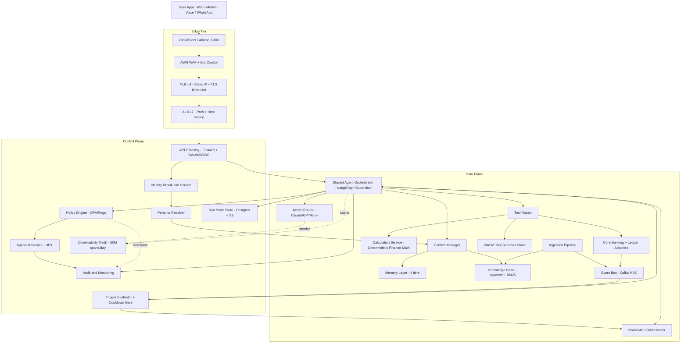
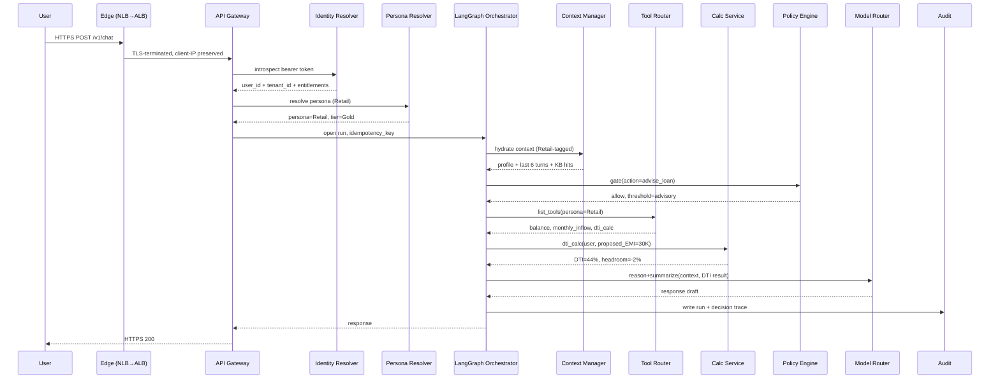
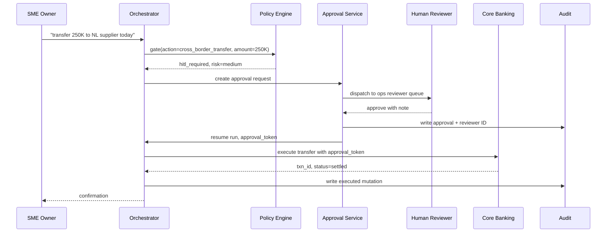
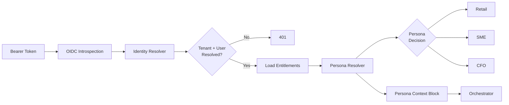

# 03 - Architecture: Multi-Persona AI Banker Shared Platform

> Pack date: 2026-05-21. Archetype: agentic + knowledge-base. Scale envelope: 1M+ DAU across Retail, SME, and CFO personas, 10K+ orchestrator runs/day per tenant cluster, 1B+ model-router tokens/month aggregate.

## 1. TL;DR

The Multi-Persona AI Banker is a **single shared platform** with persona-aware specialization, not three separate agents. A shared LangGraph supervisor (modeled on the same ReAct+DAG+durable-execution graph engine I scaled to 10K+ runs/day at Marvis on the resume.txt:51-54 stack) routes Retail, SME, and CFO conversations through one orchestrator. Specialization happens via three injection points: the **Context Manager** loads persona-tagged context blocks, the **Tool Router** filters the callable tool set by persona RBAC, and the **Policy Engine** swaps risk thresholds and HITL boundaries per persona. Financial math is **deterministic** - balance, runway, payroll readiness, FX exposure, weeks-to-crunch - and lives in an isolated Calculation Service so the LLM never owns numbers. The LLM owns reasoning, prioritization, action selection, and the conversational surface. Edge traffic flows through an **NLB (L4) → ALB (L7) → FastAPI gateway pods** chain, with **MetalLB BGP** fronting bare-metal inference for the model router (Claude/GPT/Grok, the same fleet I ran at 1B+ tokens/month on resume.txt:55-56). Proactive intelligence is **event-driven**: a Kafka event bus feeds a trigger evaluator → priority queue → cooldown gate → orchestrator → notification orchestrator. Medium- and high-risk actions are HITL-gated through an Approval Service that writes immutable audit before any data-plane mutation. Memory is four-tiered. The whole platform is multi-tenant with hard tenant boundaries (the same isolation discipline from the Microsoft secure multi-tenant ML infra on resume.txt:88-94) and SOC-2/DPDP/RBI compliant by construction.

---

## 2. High-Level Diagram



The control plane carries scheduling, policy decisions, identity, run metadata, audit, and HITL approvals. The data plane carries the actual financial reads/writes, tool execution, model calls, vector retrieval, and message delivery. The two planes share only signed run IDs and policy decisions - no business data crosses upward from data plane to control plane except as redacted audit events.

---

## 3. Component Map

| Component | Responsibility | Sync / Async | Persistent State | Tier |
|---|---|---|---|---|
| Edge LB chain (CDN → WAF → NLB → ALB) | TLS termination, DDoS shielding, path-based routing | Sync | None (NLB tracks conntrack only) | Edge |
| API Gateway (FastAPI) | Auth handshake, schema validation, idempotency keys, rate limiting | Sync | Idempotency key cache in Redis | Control |
| Identity Resolution Service | OIDC/OAuth2 token introspection, user + tenant + entitlement lookup | Sync | None (reads from IdP + entitlement DB) | Control |
| Persona Resolver | Decides Retail / SME / CFO from claims + URL prefix + explicit override | Sync | None (decision is per-request) | Control |
| Shared Agent Orchestrator (LangGraph supervisor) | DAG execution, ReAct loops, checkpointing, retry, durable run state | Sync (chat) + Async (proactive) | Run checkpoints in Postgres + S3 | Data |
| Context Manager | Loads persona-tagged context block, hydrates short/long memory, KB hits | Sync | None at the manager - reads MEM + KB | Data |
| Tool Router | Filters tool catalog by persona RBAC, dispatches to Calc / WASM / Core | Sync | None | Data |
| Policy Engine (OPA/Rego) | Per-persona risk thresholds, HITL gating, compliance checks | Sync | Policy bundles in S3, signed | Control |
| Calculation Service | Deterministic financial math: balance, runway, payroll, FX, weeks-to-crunch | Sync | None (pure functions, idempotent) | Data |
| Memory Layer (4 tiers) | Working / session / long-term / global; tier transitions | Async writes, sync reads | Redis + Postgres + pgvector + S3 | Data |
| Notification Orchestrator | Channel selection, throttling, quiet-hours, delivery receipts | Async | Outbox in Postgres | Data |
| Approval Service | HITL queue, reviewer dispatch, SLA tracking, executed-by audit | Async | Approval state in Postgres | Control |
| Audit & Monitoring | Immutable event log, regulator-ready export, compliance reports | Async | Append-only Postgres + S3 object-lock | Control |
| Model Router | Claude / GPT / Grok selection, cost-aware routing, fallback chain | Sync | None - config in Consul | Data |
| Event Bus (Kafka MSK) | Domain events, fan-out to trigger evaluator + ingestion + audit | Async | Kafka log (7d hot, S3 tier 90d) | Data |
| Ingestion Pipeline | Statements, transactions, market data, KYC docs, policy updates | Async | Staging Postgres + pgvector | Data |
| WASM Tool Sandbox Plane | Untrusted code execution for user-generated reports and what-if sims | Sync | None (ephemeral sandboxes, resume.txt:49-50) | Data |
| Knowledge Base | pgvector + BM25 hybrid retrieval; policy docs, product specs, FAQs | Sync read, async write | pgvector + Postgres + S3 | Data |
| Observability Mesh | Span/log/metric ingest at 50M spans/day, replay, MTTR cut (resume.txt:58-59) | Async | OpenSearch + Tempo + Prometheus | Control |

---

## 4. End-to-End Request Flows

### 4.1 Synchronous Chat

A Retail user asks "Can I afford a 30K AED car loan EMI?". The flow:



Total latency budget: p50 1.6s, p95 4.2s. The Calc Service hop is sub-50ms because it is pure CPU on m8g instances and never calls the model.

### 4.2 Proactive Notification

The user's payroll is due in three days and projected balance shows a shortfall.

```mermaid
sequenceDiagram
    participant CORE as Core Banking
    participant BUS as Kafka Event Bus
    participant SCH as Trigger Evaluator
    participant Q as Priority Queue
    participant COOL as Cooldown Check
    participant ORC as Orchestrator
    participant NOT as Notification Orchestrator
    participant USER as User Device

    CORE->>BUS: txn.posted, balance.changed
    BUS->>SCH: subscribe(cashflow_risk topic)
    SCH->>SCH: evaluate triggers (payroll_risk rule)
    SCH->>Q: enqueue(tenant, user, severity=high)
    Q->>COOL: dequeue; check user cooldown
    COOL-->>Q: passes (last nudge 26h ago)
    Q->>ORC: open proactive run
    ORC->>ORC: synthesize message via supervisor
    ORC->>NOT: send(channel preference: push)
    NOT->>USER: push notification
    NOT-->>ORC: delivery receipt
```

The trigger evaluator runs deterministic rules; the orchestrator only synthesizes the *message*, not the *decision to notify*. This split is load-bearing: regulators need to audit "why did the bank message my customer?" with a deterministic answer.

### 4.3 HITL Approval

An SME owner asks the agent to "move 250K AED to our supplier's NL account today."



The orchestrator never executes the transfer without the approval token; the Core Banking adapter validates the token against the Approval Service before mutating ledger state. This is non-negotiable for RBI and DPDP audit posture.

---

## 5. Control Plane vs Data Plane

| Concern | Plane | Why |
|---|---|---|
| Scheduling / cron / cooldowns | Control | Decisions are policy, not data |
| Policy evaluation (OPA) | Control | Decisions are auditable, deterministic |
| Run metadata + checkpoints | Control + spill to Data store | Recoverable across pod loss |
| Approval state | Control | HITL is a control-plane decision |
| Audit write path | Control | Immutability is a regulatory requirement |
| Financial ledger reads/writes | Data | High-volume, sharded, latency-sensitive |
| Tool execution (Calc, WASM, Core) | Data | Compute happens here; no business decisions |
| Model inference | Data | High-cost compute; cost-aware routing |
| Kafka domain events | Data | Throughput-shaped, partitioned by tenant |
| Vector retrieval | Data | Latency-sensitive, scales with traffic |
| Memory tier I/O | Data | Hot path |

The discipline: **any service that *decides* lives in control plane; any service that *moves bytes or computes numbers* lives in data plane.** Audit and Policy can read data-plane state (e.g., compute risk score) but only write to control-plane stores. Crossings are logged and tenancy-checked.

---

## 6. Persona-Aware Context Injection

Three injection points specialize the shared orchestrator without forking it:

1. **Context Manager** - when the run opens, the Persona Resolver's verdict (Retail / SME / CFO + tier) is passed to the Context Manager. The CM loads:
   - **Persona profile block**: language register (concise, conversational for Retail; structured for SME; analytical and dense for CFO), default time horizon (30d Retail, 90d SME, 4 quarters CFO), default currency display, default risk vocabulary.
   - **Entitlement block**: tier, product flags, jurisdiction, regulator regime.
   - **Memory hits**: persona-scoped working and long-term memory.
   - **KB hits**: filtered by persona-allowed document classes (CFO can see treasury policy docs; Retail cannot).
   The block is tagged `<persona scope="Retail" tier="Gold">…</persona>` and passed to the supervisor's system prompt as a structured slot, never concatenated raw.
2. **Tool Router** - every tool in the catalog has a `personas: [Retail, SME, CFO]` allowlist plus an `entitlement_required` field. When the orchestrator asks "what tools can I call?", the router returns only the subset that matches the resolved persona, tier, and entitlements. A Retail customer never sees `treasury.fx_hedge_propose`; a CFO never sees `card.activate_offer`. This kills an entire class of jailbreak - the model cannot call a tool it does not know exists.
3. **Policy Engine** - risk thresholds are persona-keyed. Retail: HITL above 5K AED outbound; SME: HITL above 50K AED *or* cross-border; CFO: HITL above 500K AED *or* off-policy treasury action. Same engine, different bundle, evaluated per-run.

The persona is **not** a system prompt instruction the LLM might ignore. It is a structural constraint enforced by the router and the policy engine before the LLM is even invoked.

---

## 7. Deterministic vs Probabilistic Boundary

This is the single most important architectural call in the pack. Financial math is **deterministic** and lives in the **Calculation Service**. The LLM owns reasoning, summarization, and language; the LLM never produces numbers that go into the response.

| Lives in Calc Service (deterministic) | Lives in LLM (probabilistic) |
|---|---|
| Current balance, available balance | Conversational surface, tone |
| Cash runway (weeks-to-crunch) | Why the runway is short |
| Payroll readiness (need vs have, by date) | Recommended remediation framing |
| FX exposure by currency, hedge ratio | Hedging narrative |
| Treasury position, concentration risk | Risk explanation |
| Debt service coverage, DTI | Affordability explanation |
| Anomaly z-score on spend | Whether to surface it now or later |
| Eligibility math for products | Product framing for persona |
| Tax provisioning math | Filing-style commentary |

The supervisor's contract with the Calc Service: pure functions, idempotent, sub-50ms p95, schema-validated inputs and outputs, replayable from audit log. The same discipline I applied to the AutoML state machine (resume.txt:91-92) where 15M+ jobs/month *had* to be deterministic to be debuggable. If a customer asks "why is my runway 7 weeks?", we replay the Calc Service call with the exact inputs and produce the exact same 7 weeks. No model temperature involved.

The LLM is given the Calc Service output as a structured tool result and is **prompted to never restate numbers it computed itself.** Outputs are post-validated: any numeric in the assistant's draft that does not appear in a Calc Service tool result is flagged and the response is regenerated. This is the LLMOps mesh's job (resume.txt:58-59) at runtime.

---

## 8. Load Balancer Configuration

The platform uses a four-hop edge chain plus an internal hop for inference.

### 8.1 The chain

```
Client → CloudFront/Akamai (CDN) → AWS WAF → NLB (L4) → ALB (L7) → Gateway Pods
                                                              └──(internal)─→ MetalLB (BGP) → Inference Pods (bare-metal)
```

**Why this combination:** NLB gives us static EIPs (needed for regulator allow-listing and enterprise customer firewall rules) plus deterministic L4 throughput; ALB handles HTTP-aware routing (path, host, header, WAF integration) which NLB cannot. For the model-router fanout to bare-metal H100 inference hosts, the EKS ALB does not reach those nodes; we run **MetalLB in BGP mode** advertising VIPs to the rack ToR switches, giving ECMP-balanced L4 to inference pods without paying the ALB-per-namespace cost.

### 8.2 Hop-by-hop

| Hop | OSI Layer | TLS Termination | Client IP Preservation | Health Check | Failure Mode |
|---|---|---|---|---|---|
| CloudFront | L7 (HTTP) | Re-terminates from origin TLS; presents Cloudfront cert to client | `X-Forwarded-For` chain | Origin failover policy + 5xx threshold | Falls back to second origin; cached static assets continue serving |
| WAF | L7 (rule engine, in-band with CloudFront/ALB) | N/A (inspects decrypted) | N/A | Rule engine health via CloudWatch | Fail-open or fail-closed per rule group (we fail-closed on auth paths, fail-open on read-only KB lookups) |
| NLB | L4 (TCP) | **TLS terminates here for the regional VIP** using ACM cert; preserves client IP via `proxy_protocol_v2` to ALB | Yes - `proxy_protocol_v2` injected so ALB sees the real client IP | TCP healthcheck against ALB listener on :443 | Cross-zone load balancing on; one AZ ALB loss is absorbed; connection draining 300s |
| ALB | L7 (HTTP/2 + gRPC) | Re-terminates internal TLS (mTLS to pods); presents internal CA cert | Yes - reads `proxy_protocol_v2` from NLB and injects `X-Forwarded-For` to gateway | HTTP 200 on `/healthz` per target; deregistration delay 30s | Failed pod evicted from target group; PDB ensures rolling deploys preserve 80% capacity |
| Gateway Pod | L7 (FastAPI) | Sees decrypted HTTP; mTLS from ALB | Reads `X-Forwarded-For` | `/healthz` shallow + `/readyz` deep | Liveness restart; readiness drains from ALB |
| MetalLB (BGP) | L4 (ECMP via BGP) | TLS terminates at inference pod (gRPC over mTLS) | Yes - DSR-style; client (gateway pod) IP preserved | BGP session health + node health | BGP withdrawal removes node from ECMP; sub-second failover |

### 8.3 ALB listener rules

- `/v1/chat` and `/v1/chat/stream` → `tg-gateway-chat` (sticky sessions on WebSocket via cookie); idle timeout 600s.
- `/v1/proactive/*` → `tg-gateway-async` (no stickiness; idempotency-keyed).
- `/v1/admin/*` → `tg-gateway-admin` (stricter WAF rules, IP allowlist).
- `/v1/grpc/*` → `tg-internal-grpc` (HTTP/2 target group, gRPC health checks).
- Default action: 404 to a static page (no information disclosure).

### 8.4 TLS termination policy

TLS is terminated at the **NLB** for client-facing traffic (single ACM cert rotation point, hardware offload, no CPU cost in the gateway). Between NLB and ALB we run **TCP + proxy_protocol_v2** so the ALB sees real client IPs while keeping NLB's static-EIP and L4 throughput properties. Between ALB and pods we run **mTLS** issued from an internal CA; pods present SPIFFE-style identities so the policy engine can enforce service-to-service auth. For inference, gateway pods speak gRPC-over-mTLS directly to inference pods through the MetalLB VIP, terminating TLS only inside the inference container.

### 8.5 Why not just ALB

Three reasons. (a) ALB does not give static IPs; enterprise customers and regulators demand IP allowlisting. (b) NLB cross-zone behavior is cheaper at our packet rates (we sustain >800K pps on synchronous chat alone). (c) The QUIC/HTTP3 path I prototyped (TunDRA-style, resume.txt:97-98) terminates UDP at NLB more cleanly than at ALB. We keep the door open for HTTP/3 by routing :443/udp at NLB to a separate QUIC-terminator pool while leaving TCP on the existing path.

---

## 9. Fleet Sizing per Tier

All instance choices on Graviton (m8g) for price-perf, three AZs, headroom factor 1.6× over p95 burst.

| Tier | Instance | Count per AZ | Total | Why | Rough $/mo |
|---|---|---|---|---|---|
| API Gateway (FastAPI) | m8g.4xlarge | 8 | 24 | TLS+auth+rate-limit; CPU-bound at p99 | ~$22K |
| Agent Orchestrator (LangGraph) | m8g.4xlarge | 10 | 30 | Run state + DAG dispatch; long-tail latency | ~$28K |
| Context Manager | m8g.2xlarge | 6 | 18 | Read-heavy, Redis-near | ~$8K |
| Calc Service | m8g.2xlarge | 6 | 18 | Pure CPU; sub-50ms; easy to scale | ~$8K |
| Tool Router | m8g.2xlarge | 4 | 12 | Stateless; modest CPU | ~$5K |
| Memory Tier Coordinator | m8g.4xlarge | 4 | 12 | Coordinates Redis + Postgres + pgvector | ~$11K |
| Notification Orchestrator | m8g.2xlarge | 4 | 12 | Outbox + retry + channel fanout | ~$5K |
| Event Bus (Kafka MSK) | kafka.m7g.4xlarge | 3 | 9 brokers | MSK; partitioned by tenant | ~$18K |
| Observability Ingest | m8g.8xlarge | 4 | 12 | 50M spans/day; OpenSearch hot tier | ~$28K |
| Inference (bare-metal H100) | dedicated hosts | 4 | 12 | Model router fallback for self-hosted models | ~$110K |
| Approval Service | m8g.2xlarge | 2 | 6 | Low QPS; bursty | ~$2.5K |
| Policy Engine (OPA) | m8g.2xlarge | 4 | 12 | Hot path; cached bundles | ~$5K |
| Total | | | | | **~$250K/mo** |

Spread across three AZs (us-east-1a/1b/1c) with PodDisruptionBudgets at 80% so a full-AZ loss leaves us at ~66% capacity, above the 60% breakeven for p95 SLO. Headroom factor 1.6× lets us absorb a 60% traffic spike (typical end-of-month + market-event compound) without scale-out lag.

### 9.1 Scale envelope and per-tenant admission control

The unit that drives infrastructure cost is **concurrent runs**, not MAU. Restating the envelope explicitly:

| Quantity | Value | How derived |
|---|---|---|
| Monthly active users | 10M | Pack target; sized across Retail/SME/CFO |
| Daily active users | ~2.5M | 25% DAU/MAU ratio (consumer-banking norm) |
| Synchronous chat QPS (peak) | ~200 | DAU × 4 conversations/day × 5 hops × peak-hour concentration 3× ÷ 86400 |
| Proactive trigger QPS (peak) | ~80 | Event-driven from salary/budget/treasury rules |
| Mean run wall-time | ~2.2 s | Sync chat p99 3.5 s; mean held lower by short hops |
| **Peak concurrent runs** | **~612** | (200 + 80) × 2.2 with 1.1× safety margin |
| Per-tenant max concurrent runs | **8** (Retail), **24** (SME), **64** (CFO) | Set by `PolicyConfig.concurrency_by_persona` |

The 10M-MAU/612-concurrent-runs envelope is what the fleet sizing table above is built for. A 1M-MAU instance of this platform sizes to ~62 concurrent runs and the orchestrator tier can collapse to 6 pods. **The pack does not claim 1M concurrent runs**; that would be a ~1600× different system (Kafka partition count, pgvector shard count, model-router rate ceilings would all need to be rebuilt).

**Per-tenant admission control (orchestrator).** Every inbound request crosses an admission token bucket keyed on `tenant_id` before any LangGraph state is allocated. Defaults: Retail tenant 8 concurrent / 16 burst, SME tenant 24 concurrent / 48 burst, CFO tenant 64 concurrent / 128 burst; sleep-with-bound at the API gateway up to 750 ms then 429 with `Retry-After`. The token bucket lives in Redis with a Lua script for atomic decrement-and-check, replicated cross-AZ. A misbehaving SME tenant trying to fan out 5000 background runs cannot starve the orchestrator pool for the other ~7500 active tenants; their 25th in-flight run gets 429'd. Without this, one tenant's runaway proactive workflow becomes a fleet-wide P1.

### 9.2 Cross-tenant checkpoint isolation enforcement

Checkpoint isolation is not assertion - it is enforced at three layers:

1. **Postgres row-level security on `agent_checkpoints`.** The session role is set to `app_tenant_$tenant` at connection-pool checkout time; the table has `ENABLE ROW LEVEL SECURITY` with policy `tenant_id = current_setting('app.tenant_id')`. A pod with the wrong tenant context literally cannot SELECT another tenant's checkpoints. The connection pool is per-tenant-bucket (one pool per ~100 tenants) so pool starvation is bounded.
2. **Run lease with tenant binding.** When pod A claims a paused run for resume, it takes a row lock on `run_leases (run_id, tenant_id, leased_by_pod, leased_until)` via `SELECT … FOR UPDATE SKIP LOCKED WHERE leased_until < now()`. The lease row carries `tenant_id`; pod A's connection must already be set to that tenant role before the row is visible. Lease renewals every 5 s; orphan reaper releases after 30 s of no renewal.
3. **S3 checkpoint snapshots** live under `s3://banker-ckpt/<tenant_id>/<run_id>/...` with bucket policy denying GetObject when the IAM role's `aws:PrincipalTag/tenant_id` ≠ the object's `tenant_id` tag. The orchestrator pod assumes a per-tenant role via IRSA before reading, so a misrouted resume hits S3 AccessDenied, not a silent cross-tenant read.

A CI integration test asserts: spin up two test tenants, write a checkpoint for tenant A, attempt to resume from a pod role-bound to tenant B - it must return zero rows (Postgres) and AccessDenied (S3). This test gates every orchestrator deploy.

---

## 10. Stateful vs Stateless

| Service | Stateful? | State Location | Scale Strategy |
|---|---|---|---|
| API Gateway | Stateless | (idempotency cache in Redis) | Horizontal, HPA on CPU + RPS |
| Identity Resolver | Stateless | (IdP + entitlement DB) | Horizontal |
| Persona Resolver | Stateless | None | Horizontal |
| Agent Orchestrator | **Stateful** (per-run) | Run checkpoints in Postgres + S3 | Horizontal; runs are sticky via consistent hash on run_id during execution, resumable on pod loss |
| Context Manager | Stateless | (reads Memory + KB) | Horizontal |
| Tool Router | Stateless | None | Horizontal |
| Calc Service | Stateless (pure functions) | None | Horizontal; trivially parallel |
| Policy Engine | Stateless | (policy bundles in S3 with local cache) | Horizontal |
| Memory Layer | **Stateful** | Redis (working), Postgres (session), pgvector (long-term), S3 (cold) | Sharded by tenant_id |
| Audit | **Append-only stateful** | Postgres + S3 object-lock | Partitioned by month, tenant |
| Approval Service | **Stateful** | Postgres | Vertical first; horizontal with sticky by request_id |
| Notification Orchestrator | **Stateful (outbox)** | Postgres outbox | Horizontal with claim-based dispatch |
| Model Router | Stateless | (config in Consul) | Horizontal |
| Event Bus | **Stateful** | Kafka MSK | Partitioned by tenant |

Run-state durability for the orchestrator is the same pattern from the resume.txt:52-54 LangGraph engine: every node transition writes a checkpoint to Postgres (small JSON deltas) and S3 (full state snapshots every N steps). On pod loss, the run resumes from the last checkpoint on a different pod; the user does not see a failed conversation.

---

## 11. Identity and Persona Resolution Flow



The Persona Resolver decides using a **three-signal vote**, in priority order:
1. **Explicit user choice** via UI persona switch (highest priority; user-asserted).
2. **URL prefix / API surface**: `app.bank.com/retail/*` vs `business.bank.com/sme/*` vs `treasury.bank.com/cfo/*`.
3. **Token claim** `persona_default` from the IdP.

If a signal conflicts (e.g., user is on the SME surface but token says Retail-only), the resolver returns the *intersection* - Retail context only - and emits an audit event. **Multi-persona users** (an SME owner who is also a personal Retail customer with the bank, common in MENA SMB) carry multiple persona entitlements. The platform treats persona switches as **session boundaries**: switching from Retail to SME ends the current session, opens a new one, and the Context Manager rehydrates from the SME memory shard. We do not blend Retail and SME context in a single run - the regulatory boundary between consumer and commercial banking forbids it.

---

## 12. Where the LangGraph Runtime Sits

The Shared Agent Orchestrator is a fleet of EKS pods running the LangGraph supervisor (same engine pattern as the durable workflow engine on resume.txt:51-54 - graph workflow + checkpointing + retry + memory persistence). Runs are opened per chat or per proactive trigger, identified by `run_id`. Each run:

- Writes node-transition checkpoints to Postgres (hot path, ~5KB per transition).
- Snapshots full graph state to S3 every N transitions (~50KB compressed).
- Tags every span with `run_id`, `tenant_id`, `persona`, `node_id` for the observability mesh (50M spans/day, resume.txt:58-59) - replay reconstructs the exact decision sequence.
- On pod loss, the supervisor coordinator (a thin control-plane service) detects orphaned runs via Postgres lease expiry and reschedules them on a healthy pod, resuming from the last checkpoint.

The deep mechanics of the graph (nodes, edges, state schema, supervisor / specialist split, replanning loop, critic node) live in `12-agentic-graph-structure.md`. Here we only assert: the runtime is LangGraph on EKS, runs are durable, checkpoints are in Postgres + S3, and recovery is automatic.

---

## 13. Leadership and Business Framing

A Principal would push back on three things, and we have answers for each. **First, "why one platform and not three?"** Because the *cost* of platform fragmentation isn't engineering - it's regulatory. Each persona-specific agent would need its own SOC-2 boundary, its own DPDP DPIA, its own RBI sandbox approval. One platform with persona-tagged data lineage gets one set of approvals, audited as one system. The marginal cost of a fourth persona (private banking, say, in 2027) is a context block, a tool catalog filter, and a policy bundle - not a new service. **Second, "why Retail first?"** Because Retail is the lowest-blast-radius surface and the highest-volume signal source. We harden the platform under Retail load (1M+ DAU envelope, mostly read-only intent) before letting it touch SME treasury actions. Brand risk in Retail is "the agent gave a confused answer"; brand risk in CFO is "the agent moved 5M AED to the wrong counterparty." We earn the right to the CFO surface by being boring at Retail first. **Third, "where are the next-quarter risks?"** Three places: (a) the deterministic boundary will leak - someone will ship a tool that lets the LLM produce a number, and we'll catch it in audit only after a customer complaint; we mitigate with the post-validation rule and a numeric-grounding test in CI. (b) HITL queue depth will spike before we have the reviewer headcount; we model queue depth against persona mix monthly and pre-hire. (c) The multi-persona switch will get abused - an SME owner asking the Retail agent to do SME work to bypass a policy gate; we mitigate by tying tools to entitlements not just personas. The shape of this platform unlocks regulator approval because **every decision is traceable to a deterministic input or a logged model call**, and **every mutation is gated by a policy decision that lives in the control plane**. That is the architecture a Principal can defend to a regulator with a straight face.

---

*End of 03-architecture.md. See 12-agentic-graph-structure.md for the LangGraph node-and-edge topology, 13-memory-layer-design.md for the four-tier memory store, 14-ingestion-pipeline.md for the knowledge-base pipeline, and 15-guardrails.md for the policy + safety stack.*
