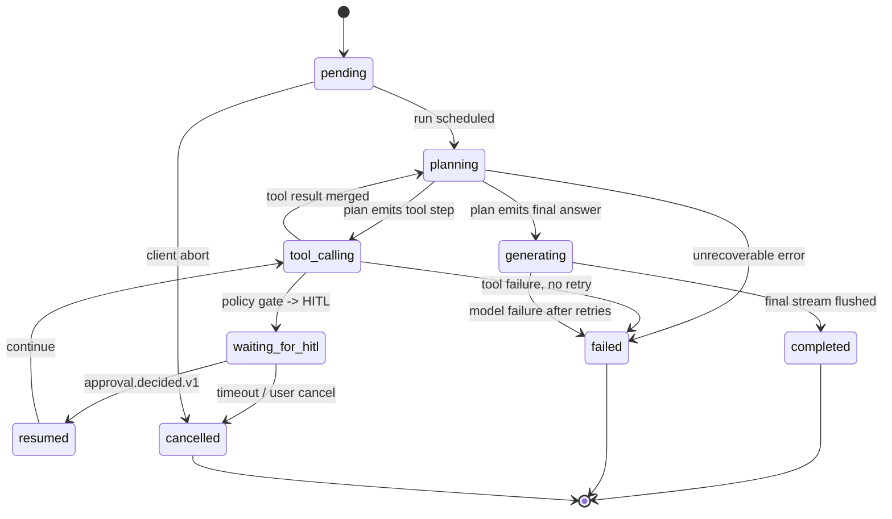
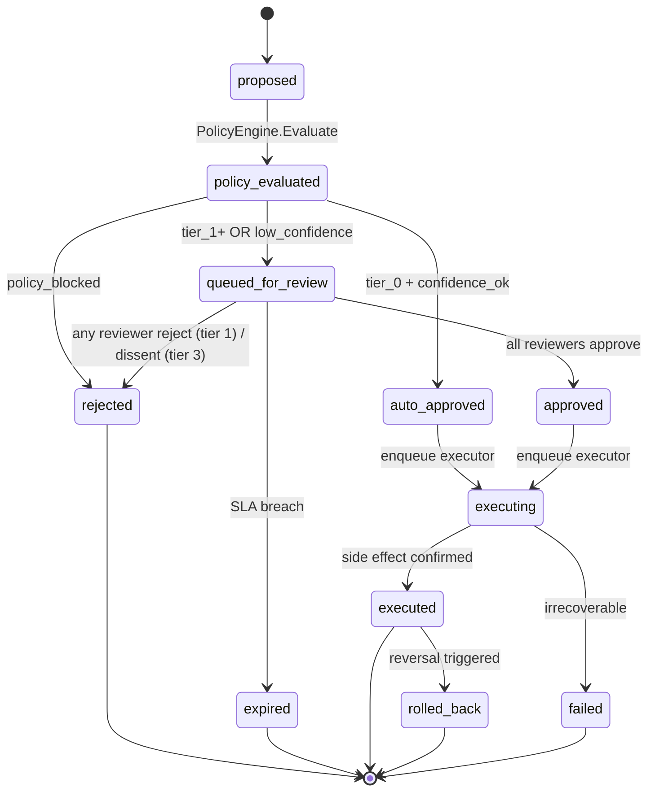
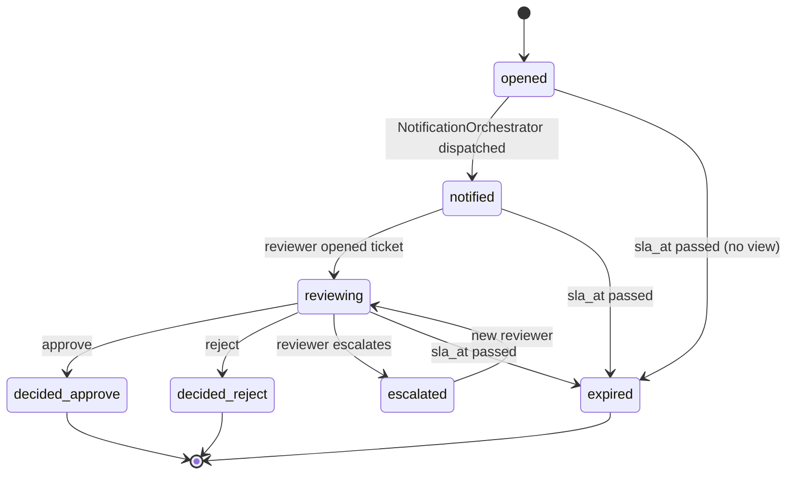
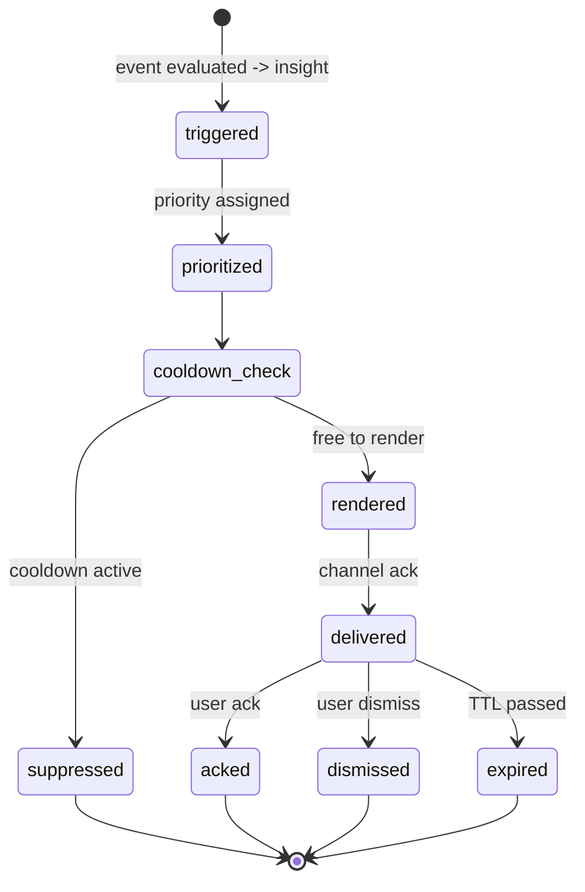
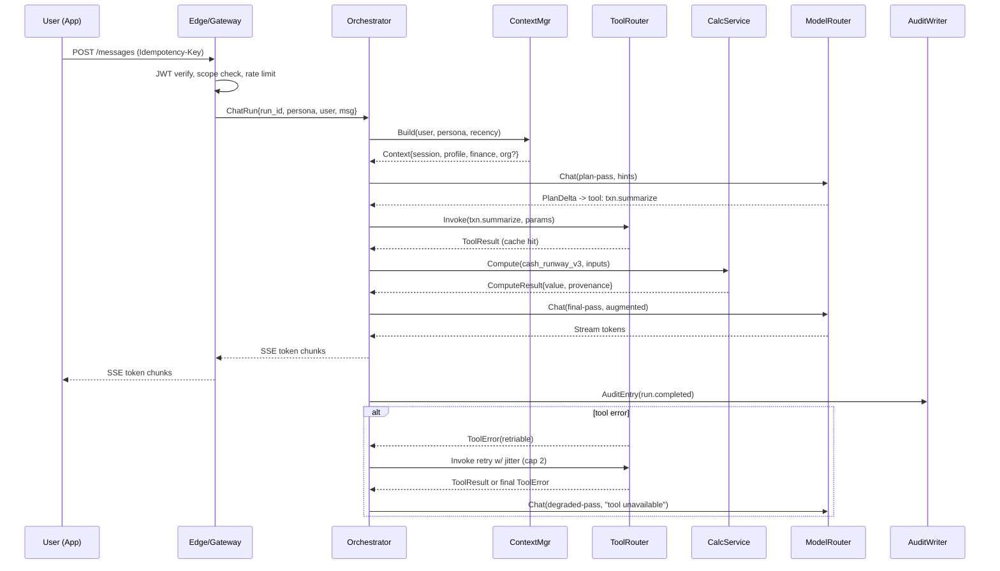
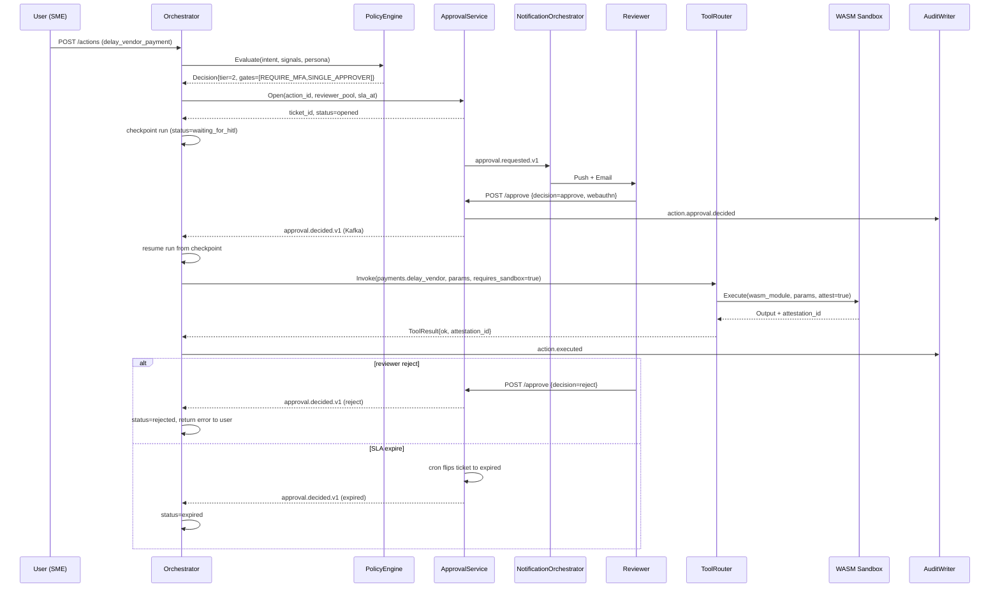
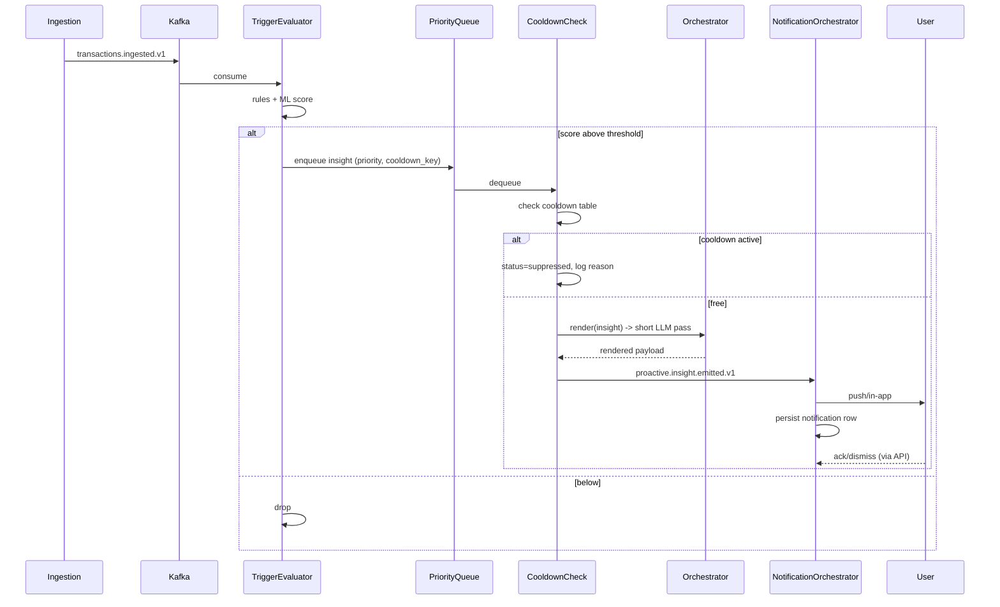

# 05 — Low-Level Design: Multi-Persona AI Banker (Shared Platform)

> Scope: Internal mechanics that the contracts in `04-api-and-contracts.md` ride on. State machines, persistent schemas, sequence flows, class-level responsibilities, concurrency, idempotency, sandbox isolation, and the LangGraph supervisor integration points.
>
> Companion files: `03-architecture.md` (system map), `04-api-and-contracts.md` (interfaces), `12-agentic-graph-structure.md` (agent topology), `13-memory-layer-design.md` (memory tier deep dive), `15-guardrails.md` (policy + tool guardrails).

---

## 1. Service decomposition

| Service | Language | Responsibilities | Deploy unit | Key dependencies |
|---------|----------|------------------|-------------|------------------|
| Edge / API Gateway | Go (Envoy + custom filters) | TLS, OAuth/OIDC validation, persona scope check, rate limits, tenant routing | k8s Deployment (HPA on CPU + RPS) | IdP JWKS, Redis (rate), tenant config |
| Identity Resolver | Go | Resolves `(tenant, user)` → entitlements + persona profile | gRPC microservice | Postgres `users`, `entitlements` |
| Orchestrator (Supervisor) | Python (FastAPI + LangGraph) | Durable agent runs, checkpointing, HITL pause/resume | k8s StatefulSet (per-shard) | LangGraph checkpoints in Postgres + Redis, Kafka |
| Context Manager | Python (FastAPI) | Builds persona-shaped context payloads | k8s Deployment | Memory Service, embedding store |
| Tool Router | Go | Tool catalog, routing, circuit breaking, sandbox dispatch | k8s Deployment | Tool registry, WASM sandbox plane |
| Policy Engine | Rust | OPA-style rule evaluation, risk-tier decisions | k8s Deployment | Postgres `policy_rules`, persona profiles |
| Calculation Service | Rust | Deterministic numerical computation (cashflow, runway, FX, amortization, NPV) | k8s Deployment + CPU node pool | Formula registry, content-addressed cache |
| Memory Service | Python (FastAPI) | Façade over Redis (session), Postgres (profile + financial), graph store (org), pgvector (semantic) | k8s Deployment | Redis, Postgres, pgvector, Neo4j (org) |
| Approval Service | Go | Ticket lifecycle, reviewer pool resolution, SLA timers | k8s Deployment | Postgres `approval_tickets`, Notification |
| Notification Orchestrator | Go | Outbox dispatch over push/email/SMS/in-app, cooldown gating | k8s Deployment (worker pool) | Kafka, APNs, FCM, Twilio, SendGrid |
| Trigger Evaluator | Python | Consumes domain events → proactive insights | k8s Deployment (Kafka consumer group) | Kafka, Memory Service |
| Audit Writer | Go | Hash-chained append-only log | k8s Deployment (single-writer per tenant shard) | Postgres `audit_log`, WORM bucket |
| Model Router | Go | Claude/GPT/Grok routing, token budgeting, circuit breaking (resume.txt:55–56) | k8s Deployment | Provider APIs, Redis (budget) |
| WASM Sandbox Plane | Rust + Wasmtime | Executes risky tools in attested sandboxes (resume.txt:49–50) | k8s Deployment + bare-metal pool | Tool wasm modules, KMS for signing |

Two cross-cutting libraries are shared across services: `obs-sdk` (OpenTelemetry, trace propagation, metrics, logs) and `auth-sdk` (JWT verification, scope checks, persona claim handling).

---

## 2. State machines

### 2.1 Agent Run lifecycle



Checkpoint points are at every state transition. The LangGraph checkpointer writes `(run_id, step_no, state_blob_hash)` to Postgres and the full state blob to a Redis-backed value store keyed by `state_blob_hash`. A run can be resumed from any checkpoint, so an Orchestrator pod crash mid-run replays from the last persisted checkpoint without re-charging the model for completed steps — this is the durable-execution discipline carried over from the resume's LangGraph + DAG platform handling 10K+ runs/day (resume.txt:51–54).

### 2.2 Action lifecycle



### 2.3 Approval Ticket lifecycle



### 2.4 Proactive Notification lifecycle



---

## 3. Database schemas (Postgres DDL)

All tables include `created_at TIMESTAMPTZ NOT NULL DEFAULT now()` and `updated_at TIMESTAMPTZ NOT NULL DEFAULT now()` unless noted. Soft deletes use `deleted_at TIMESTAMPTZ`. Multi-tenancy is enforced by `tenant_id` in every domain table and a row-level security policy.

```sql
CREATE TABLE tenants (
  tenant_id      TEXT PRIMARY KEY,
  display_name   TEXT NOT NULL,
  plan           TEXT NOT NULL CHECK (plan IN ('starter','pro','enterprise')),
  token_budget_monthly BIGINT NOT NULL DEFAULT 0,
  audit_retention_days INT  NOT NULL DEFAULT 2555, -- 7 years
  created_at     TIMESTAMPTZ NOT NULL DEFAULT now()
);

CREATE TABLE users (
  user_id        TEXT PRIMARY KEY,
  tenant_id      TEXT NOT NULL REFERENCES tenants(tenant_id),
  external_sub   TEXT NOT NULL,
  display_name   TEXT,
  email          TEXT,
  created_at     TIMESTAMPTZ NOT NULL DEFAULT now(),
  UNIQUE (tenant_id, external_sub)
);
CREATE INDEX users_tenant_idx ON users(tenant_id);

CREATE TABLE personas_assignment (
  user_id        TEXT NOT NULL REFERENCES users(user_id),
  persona        TEXT NOT NULL CHECK (persona IN ('retail','sme','cfo')),
  assigned_at    TIMESTAMPTZ NOT NULL DEFAULT now(),
  PRIMARY KEY (user_id, persona)
);

CREATE TABLE entitlements (
  entitlement_id TEXT PRIMARY KEY,
  user_id        TEXT NOT NULL REFERENCES users(user_id),
  resource       TEXT NOT NULL, -- e.g., 'acct:1234', 'entity:de_op'
  scope          TEXT NOT NULL, -- 'read','propose','approve:tier1', ...
  created_at     TIMESTAMPTZ NOT NULL DEFAULT now()
);
CREATE INDEX entitlements_user_idx ON entitlements(user_id);

CREATE TABLE agent_runs (
  run_id              TEXT PRIMARY KEY,
  parent_run_id       TEXT REFERENCES agent_runs(run_id),
  tenant_id           TEXT NOT NULL REFERENCES tenants(tenant_id),
  user_id             TEXT NOT NULL REFERENCES users(user_id),
  persona             TEXT NOT NULL,
  session_id          TEXT NOT NULL,
  status              TEXT NOT NULL CHECK (status IN
                        ('pending','planning','tool_calling','waiting_for_hitl',
                         'resumed','generating','completed','failed','cancelled')),
  checkpoint_pointer  TEXT, -- (step_no, state_blob_hash)
  started_at          TIMESTAMPTZ NOT NULL DEFAULT now(),
  completed_at        TIMESTAMPTZ,
  total_cost_usd      NUMERIC(12,6),
  model_tokens_in     BIGINT,
  model_tokens_out    BIGINT,
  policy_profile_id   TEXT,
  trace_id            TEXT
);
CREATE INDEX agent_runs_user_idx     ON agent_runs(user_id, started_at DESC);
CREATE INDEX agent_runs_session_idx  ON agent_runs(session_id, started_at DESC);
CREATE INDEX agent_runs_status_idx   ON agent_runs(status) WHERE status IN ('waiting_for_hitl','pending');

CREATE TABLE agent_run_steps (
  step_id        TEXT PRIMARY KEY,
  run_id         TEXT NOT NULL REFERENCES agent_runs(run_id) ON DELETE CASCADE,
  step_no        INT NOT NULL,
  node           TEXT NOT NULL, -- 'planner','tool','calc','model','critic','memory_write'
  input_hash     TEXT,
  output_hash    TEXT,
  tool_calls     JSONB,  -- array of {tool_id, params_hash, latency_ms, cache}
  model_call     JSONB,  -- {provider, model_id, tokens_in, tokens_out, latency_ms}
  latency_ms     INT,
  status         TEXT NOT NULL CHECK (status IN ('ok','err','partial')),
  err_code       TEXT,
  created_at     TIMESTAMPTZ NOT NULL DEFAULT now(),
  UNIQUE (run_id, step_no)
);
CREATE INDEX agent_run_steps_run_idx ON agent_run_steps(run_id, step_no);

CREATE TABLE actions (
  action_id            TEXT PRIMARY KEY,
  tenant_id            TEXT NOT NULL REFERENCES tenants(tenant_id),
  user_id              TEXT NOT NULL REFERENCES users(user_id),
  run_id               TEXT REFERENCES agent_runs(run_id),
  type                 TEXT NOT NULL,
  params               JSONB NOT NULL,
  estimated_impact_usd NUMERIC(14,2),
  risk_tier            SMALLINT NOT NULL CHECK (risk_tier BETWEEN 0 AND 3),
  status               TEXT NOT NULL CHECK (status IN
                          ('proposed','policy_evaluated','queued_for_review',
                           'auto_approved','approved','rejected','expired',
                           'executing','executed','failed','rolled_back')),
  client_idempotency_key TEXT,
  executor_run_id      TEXT,
  audit_chain_id       TEXT,
  created_at           TIMESTAMPTZ NOT NULL DEFAULT now(),
  executed_at          TIMESTAMPTZ,
  UNIQUE (user_id, client_idempotency_key)
);
CREATE INDEX actions_status_idx ON actions(status);
CREATE INDEX actions_user_idx   ON actions(user_id, created_at DESC);

CREATE TABLE approval_tickets (
  ticket_id      TEXT PRIMARY KEY,
  action_id      TEXT NOT NULL REFERENCES actions(action_id),
  tenant_id      TEXT NOT NULL,
  reviewer_pool  TEXT[] NOT NULL,
  required_count INT NOT NULL DEFAULT 1,
  decisions      JSONB NOT NULL DEFAULT '[]', -- [{reviewer, decision, decided_at, auth_proof_id, note}]
  status         TEXT NOT NULL CHECK (status IN
                   ('opened','notified','reviewing','decided_approve',
                    'decided_reject','escalated','expired')),
  sla_at         TIMESTAMPTZ NOT NULL,
  sla_breached   BOOLEAN NOT NULL DEFAULT FALSE,
  created_at     TIMESTAMPTZ NOT NULL DEFAULT now(),
  decided_at     TIMESTAMPTZ
);
CREATE INDEX approval_tickets_action_idx ON approval_tickets(action_id);
CREATE INDEX approval_tickets_open_idx   ON approval_tickets(status, sla_at)
  WHERE status NOT IN ('decided_approve','decided_reject','expired');

CREATE TABLE audit_log (
  entry_id       TEXT PRIMARY KEY,
  tenant_id      TEXT NOT NULL REFERENCES tenants(tenant_id),
  user_id        TEXT,
  actor_kind     TEXT NOT NULL CHECK (actor_kind IN ('user','agent','system','reviewer')),
  event_type     TEXT NOT NULL, -- 'action.proposed','action.executed','tool.invoked',...
  payload        JSONB NOT NULL,
  payload_hash   TEXT NOT NULL,        -- SHA-256(canonical_json(payload))
  prior_hash     TEXT NOT NULL,        -- SHA-256 of prior entry in same shard
  signature      TEXT NOT NULL,        -- KMS-signed hash chain checkpoint
  occurred_at    TIMESTAMPTZ NOT NULL DEFAULT now()
);
CREATE INDEX audit_log_tenant_time_idx ON audit_log(tenant_id, occurred_at DESC);
CREATE INDEX audit_log_event_type_idx  ON audit_log(event_type);

CREATE TABLE proactive_events (
  event_id       TEXT PRIMARY KEY,
  tenant_id      TEXT NOT NULL,
  user_id        TEXT NOT NULL,
  kind           TEXT NOT NULL,  -- 'budget_breach','salary_credit','fx_exposure',...
  severity       TEXT NOT NULL CHECK (severity IN ('info','warn','crit')),
  payload        JSONB NOT NULL,
  cooldown_key   TEXT NOT NULL,
  status         TEXT NOT NULL CHECK (status IN
                   ('triggered','prioritized','suppressed','rendered',
                    'delivered','acked','dismissed','expired')),
  created_at     TIMESTAMPTZ NOT NULL DEFAULT now(),
  expires_at     TIMESTAMPTZ
);
CREATE INDEX proactive_events_user_idx     ON proactive_events(user_id, created_at DESC);
CREATE INDEX proactive_events_cooldown_idx ON proactive_events(cooldown_key, created_at DESC);

CREATE TABLE notifications (
  notification_id TEXT PRIMARY KEY,
  event_id        TEXT NOT NULL REFERENCES proactive_events(event_id),
  user_id         TEXT NOT NULL,
  channel         TEXT NOT NULL CHECK (channel IN ('push','email','sms','in_app')),
  rendered_at     TIMESTAMPTZ,
  delivered_at    TIMESTAMPTZ,
  ack_at          TIMESTAMPTZ,
  dismissed_at    TIMESTAMPTZ,
  delivery_attempt INT NOT NULL DEFAULT 0,
  last_error      TEXT,
  UNIQUE (event_id, channel)
);
CREATE INDEX notifications_user_idx ON notifications(user_id, COALESCE(delivered_at, rendered_at) DESC);
```

The audit log uses a **per-tenant hash chain**: each insert reads the prior entry's `payload_hash` under a `SELECT ... FOR UPDATE` lock, computes the new entry's hash over the canonical JSON of the payload, and signs a checkpoint every N entries with KMS. A nightly job verifies the chain end-to-end and exports a Merkle root to a WORM (write-once-read-many) S3 bucket with object lock. Tampering is detectable because any modified row breaks the chain at the next checkpoint verification.

Row-level security policy (example):

```sql
ALTER TABLE actions ENABLE ROW LEVEL SECURITY;
CREATE POLICY actions_tenant_isolation ON actions
  USING (tenant_id = current_setting('app.tenant_id'));
```

The Orchestrator sets `app.tenant_id` on every connection checkout from the connection pool.

---

## 4. Memory tier schemas (interaction view)

Full schema lives in `13-memory-layer-design.md`. Here is how the platform services interact with each tier.

| Tier | Storage | Key | Value | TTL | Read path | Write path |
|------|---------|-----|-------|-----|-----------|------------|
| Session | Redis | `sess:{tenant}:{session_id}` | JSON state (last N turns, plan, intermediate vars) | 24h | Context Manager `Build()` → reads + decompresses | Supervisor every step transition |
| Long-term user | Postgres + pgvector | `(user_id)` row in `user_profile`, vectors in `user_pref_embeddings` | structured prefs + goal vectors | persistent | Context Manager `Build()` selects relevant facts | Memory Writer node at end of run, dedup by canonical fact key |
| Financial historical | Postgres + warehouse pointer | `(user_id, account_id, month)` summaries | aggregates + raw txn pointer | persistent (cold tier after 24 mo) | Calc Service joins on monthly summaries; Tool `txn.summarize` reads raw via warehouse | Ingestion pipeline (separate stream) |
| Organizational context | Postgres + Neo4j graph | nodes: `Entity`, `Vendor`, `Approver`, `Account`; edges: `pays`, `approves`, `parent_of` | structured graph + scalars | persistent | Context Manager builds the persona-specific subgraph projection | Org-mgmt UI + nightly reconciliation |

The Context Manager hides tier choice behind a single `Build()` call but the underlying storage discipline is different per tier — Redis for hot path latency, Postgres for transactional facts, pgvector for semantic retrieval, Neo4j for the org graph projections that CFO queries hit heavily (multi-hop entity → approver → account walks).

---

## 5. Sequence flows

### 5.1 Sync chat happy path



### 5.2 Action requiring HITL



### 5.3 Proactive event



Error branches: if the model router fails the `render` pass, the proactive event reverts to status `triggered` and a retry is scheduled with exponential backoff (max 3 attempts over 2h, then `expired`).

---

## 6. Class / module responsibilities (pseudocode)

```python
# orchestrator/supervisor.py
class SupervisorAgent:
    """LangGraph node. Owns plan -> tool -> reflect loop with checkpointing."""

    def __init__(self, ctx_mgr, tool_router, calc, model_router, policy,
                 memory, approvals, audit, checkpointer):
        self.ctx_mgr = ctx_mgr
        self.tool_router = tool_router
        self.calc = calc
        self.model_router = model_router
        self.policy = policy
        self.memory = memory
        self.approvals = approvals
        self.audit = audit
        self.cp = checkpointer  # LangGraph Postgres + Redis checkpointer

    async def run(self, run_id: str, user_msg: Message, run_ctx: RunContext):
        state = await self.cp.load_or_init(run_id, user_msg, run_ctx)
        while not state.is_terminal():
            state = await self._step(state)
            await self.cp.save(run_id, state.step_no, state)
            if state.status == "waiting_for_hitl":
                return  # durable pause; resumed on approval.decided.v1
        await self.audit.emit("run.completed", run_id=run_id)

    async def _step(self, state: RunState) -> RunState:
        if state.node == "planner":
            plan = await self.model_router.chat(state.plan_messages(),
                                                hints=CapabilityHints(structured_output=True))
            return state.advance(plan)
        if state.node == "tool":
            tool_id, params = state.next_tool_call()
            requires_sandbox = self.tool_router.is_risky(tool_id)
            result = await self.tool_router.invoke(tool_id, params,
                                                   requires_sandbox=requires_sandbox,
                                                   ctx=state.ctx)
            return state.merge_tool(result)
        if state.node == "calc":
            r = await self.calc.compute(state.formula_id, state.inputs)
            return state.merge_calc(r)
        if state.node == "action":
            decision = await self.policy.evaluate(state.action_intent(), state.risk_signals(), state.ctx.persona)
            if decision.tier == "TIER_0_AUTO":
                return state.auto_execute()
            ticket = await self.approvals.open(state.action_id, decision)
            return state.pause_for_hitl(ticket)
        ...
```

```python
# context/builder.py
class ContextBuilder:
    """Persona-aware context shaping. Owns the token budget."""
    PERSONA_BUDGET = {"retail": 4000, "sme": 8000, "cfo": 16000}

    async def build(self, user_id, persona, recency, capability_hints):
        session = await self.memory.read_session(user_id)
        profile = await self.memory.read_profile(user_id)
        finance = await self.memory.query_financial(user_id, recency)
        org = None
        if persona in ("sme", "cfo"):
            org = await self.memory.query_org(user_id, persona)
        ctx = Context(session=session, profile=profile, finance=finance, org=org)
        return self._trim_to_budget(ctx, self.PERSONA_BUDGET[persona], capability_hints)
```

```go
// tool_router/router.go
type Router struct {
    catalog    *ToolCatalog
    breaker    *CircuitBreakerSet
    sandbox    SandboxClient
    workers    *WorkerPool
}

func (r *Router) Invoke(ctx context.Context, req InvokeRequest) (*ToolResult, error) {
    t, ok := r.catalog.Get(req.ToolId)
    if !ok { return nil, ErrUnknownTool }
    if !r.breaker.Allow(req.ToolId) { return nil, ErrToolUnavailable }
    if t.Risky || req.RequiresSandbox {
        return r.sandbox.Execute(ctx, t.WasmModule, req.Params, req.Ctx)
    }
    return r.workers.Run(ctx, t, req.Params, req.Ctx)
}
```

```rust
// policy_engine/eval.rs
pub fn evaluate(intent: &ActionIntent, signals: &RiskSignals, persona: Persona) -> Decision {
    let profile = load_persona_profile(persona);
    let mut tier = RiskTier::Tier0Auto;
    let mut gates = Vec::new();
    for rule in profile.rules.iter() {
        if rule.matches(intent, signals) {
            tier = max(tier, rule.tier);
            gates.extend(rule.gates.clone());
        }
    }
    if signals.confidence < profile.auto_threshold(tier) {
        tier = max(tier, RiskTier::Tier1);
    }
    Decision { tier, gates, policy_rule_ids: profile.matched_ids(intent, signals) }
}
```

```rust
// calc_service/runway.rs
pub fn cash_runway_v3(inputs: &RunwayInputs) -> Result<RunwayResult, CalcError> {
    validate_inputs(inputs)?;
    let monthly_burn = inputs.monthly_outflows - inputs.monthly_inflows;
    if monthly_burn <= 0.0 { return Ok(RunwayResult::infinite(inputs)); }
    let months = inputs.cash_balance / monthly_burn;
    Ok(RunwayResult {
        months,
        provenance: Provenance::new("cash_runway_v3", inputs.deterministic_hash()),
    })
}
```

```go
// approval_service/service.go
type Service struct { db *sql.DB; bus *Kafka; sla SLAQueue }

func (s *Service) Open(ctx context.Context, in OpenReq) (*Ticket, error) {
    t := newTicket(in)
    if err := s.db.Insert(ctx, t); err != nil { return nil, err }
    s.bus.Publish(ctx, "approval.requested.v1", t.AsEvent())
    s.sla.Schedule(t.TicketID, t.SLAAt)
    return t, nil
}

func (s *Service) Decide(ctx context.Context, in DecideReq) (*Ticket, error) {
    t, err := s.db.LockTicket(ctx, in.TicketID)
    if err != nil { return nil, err }
    if t.Status != "opened" && t.Status != "notified" && t.Status != "reviewing" {
        return nil, ErrTerminal
    }
    t.Apply(in)
    if t.Reached(t.RequiredCount) || in.Decision == "reject" { t.Finalize() }
    if err := s.db.Update(ctx, t); err != nil { return nil, err }
    s.bus.Publish(ctx, "approval.decided.v1", t.AsEvent())
    return t, nil
}
```

```go
// notification_orchestrator/dispatcher.go
type Dispatcher struct {
    out OutboxStore
    channels map[string]ChannelClient
}

func (d *Dispatcher) Dispatch(ctx context.Context, n Notification) error {
    for attempt := 0; attempt < 5; attempt++ {
        ch := d.channels[n.Channel]
        err := ch.Send(ctx, n)
        if err == nil {
            d.out.MarkDelivered(ctx, n.ID)
            return nil
        }
        if !errors.Is(err, ErrTransient) { return err }
        backoff(attempt)
    }
    return ErrMaxAttempts
}
```

```go
// audit/writer.go  (hash-chained, single-writer per tenant shard)
func (w *Writer) Append(ctx context.Context, e Entry) error {
    tx, _ := w.db.BeginTx(ctx, &sql.TxOptions{Isolation: sql.LevelSerializable})
    defer tx.Rollback()
    var prior string
    tx.QueryRowContext(ctx,
        `SELECT payload_hash FROM audit_log
         WHERE tenant_id=$1 ORDER BY occurred_at DESC LIMIT 1 FOR UPDATE`,
        e.TenantID).Scan(&prior)
    if prior == "" { prior = genesisHash(e.TenantID) }
    e.PriorHash = prior
    e.PayloadHash = sha256Canonical(e.Payload)
    e.Signature = w.kms.Sign(e.PayloadHash + e.PriorHash)
    if _, err := tx.ExecContext(ctx, insertSQL, e.toRow()...); err != nil { return err }
    return tx.Commit()
}
```

```python
# idempotency/store.py
class IdempotencyStore:
    """Redis-backed dedup with persistent action anchor."""
    INFLIGHT_TTL = 30
    DONE_TTL = 24 * 3600

    async def begin(self, key: str, body_hash: str) -> BeginResult:
        new = await self.redis.set(f"idem:{key}", json.dumps({"state":"inflight","body":body_hash}),
                                   nx=True, ex=self.INFLIGHT_TTL)
        if new: return BeginResult(kind="new")
        existing = json.loads(await self.redis.get(f"idem:{key}"))
        if existing["body"] != body_hash:
            raise IdempotencyConflict()
        if existing["state"] == "inflight": return BeginResult(kind="inflight")
        return BeginResult(kind="done", response_ref=existing["response_ref"])

    async def complete(self, key: str, response_ref: str):
        await self.redis.set(f"idem:{key}",
                             json.dumps({"state":"done","response_ref":response_ref}),
                             ex=self.DONE_TTL)
```

---

## 7. Concurrency model

| Layer | Pattern | Why |
|-------|---------|-----|
| Gateway | Go goroutines per connection, bounded queue, drop-load at saturation | mTLS termination + JWT verify is fast; bound shedding > queue blowup |
| Orchestrator | asyncio per run; one Python pod hosts many runs (~200-500 concurrent) | Most time is awaiting model + tool I/O. Each run is `await`-driven; CPU is light |
| Per-run sequencing | Serial within one run (state machine) | The state machine has to advance one step at a time so checkpointing is consistent |
| Tool calls | async with deadlines + jittered retries; circuit breaker per tool | Slow/dead tools must not cascade |
| Calc Service | Synchronous CPU work in Rust, thread-per-core pool | Deterministic compute; no I/O; no event loop overhead |
| Notification dispatcher | async worker pool (configurable concurrency per channel) | Channel APIs are I/O-bound and rate-limited externally |
| Audit writer | Single-writer per tenant shard (advisory lock) | Hash chain integrity requires serial append within a shard |

The Orchestrator's per-run state machine is **logically synchronous**: step N+1 cannot start until step N's checkpoint is durable. But many runs co-exist on one pod via asyncio. Pods are sharded by `hash(run_id) % N` so the same run pins to the same pod (or its replacement) during its lifetime, which makes warm caches (context, prompt, plan) effective. This is the same orchestration pattern that ran Microsoft AutoML at 15M+ jobs/month and 200K+ users (resume.txt:91–92) — durable, sharded, recoverable.

---

## 8. Idempotency mechanics internally

| Surface | Key | Store | Replay semantics |
|---------|-----|-------|------------------|
| `POST /messages`, `POST /messages:stream` | `Idempotency-Key` | Redis 24h | Replays full SSE buffer if available; else returns final reply |
| `POST /actions` | `Idempotency-Key` + `actions.client_idempotency_key` UNIQUE | Redis 24h + Postgres permanent | First-write-wins on Postgres; replay returns same `action_id` |
| `POST /actions/{id}/approve` | `(ticket_id, reviewer_id, idempotency_key)` | Postgres `approval_tickets.decisions` is a set | Second submit by same reviewer is a no-op |
| Tool invocation (internal) | `(tool_id, sha256(params))` | Content-addressed result cache (Redis 1h, longer for pure tools) | Fresh tools bypass cache via `cache_bust=true` |
| Calc service | `(formula_id, sha256(canonical_inputs))` | Content-addressed Postgres cache | Cache hit returns identical output hash; provenance preserved |
| Audit append | `(entry_id)` UNIQUE | Postgres | Idempotent insert via `ON CONFLICT DO NOTHING` |

The persistent **action_id** is the durable dedup anchor — if Redis dies, the Postgres UNIQUE constraint on `(user_id, client_idempotency_key)` still prevents double-execution.

---

## 9. Tool execution isolation

Tools split into two classes:

| Class | Examples | Where | Guarantees |
|-------|----------|-------|------------|
| Read-only | `account.lookup`, `txn.summarize`, `vendor.read`, `fx.quote` | Go worker pool inside Tool Router | Stateless; no side effects; allowed in cache |
| Risky (side-effect) | `payments.delay_vendor`, `transfer.intercompany`, `fx.book_hedge`, `loan.disburse`, `accounting.post_journal` | **WASM sandbox plane** (resume.txt:49–50) | Attested execution, signed I/O, instruction budget, no network egress except to a whitelisted set of brokers |

The WASM sandbox plane is the same SOC-2-aligned isolation discipline the resume describes (resume.txt:49–50): tools are compiled to `.wasm`, signed, and loaded into a Wasmtime instance with a precise capability list (filesystem none, network only via the broker, memory bounded, fuel budgeted). Every risky tool invocation produces an `attestation_id` that the Orchestrator records on the run step. The auditor can later replay the input + module + output to verify integrity.

A risky-tool invocation has three additional gates layered above the policy engine:

1. **Pre-flight schema check** — the params payload is validated against the tool's signed schema before entering the sandbox.
2. **Capability assertion** — the sandbox runtime denies any syscall not on the tool's manifest.
3. **Post-flight reconciliation** — the broker that fronts the bank/ERP API performs a second-stage check that the side effect matches the attested intent.

---

## 10. LangGraph integration points

The orchestrator is a LangGraph state machine with a `Supervisor` node plus tool nodes plus a `Critic` node plus a `MemoryWriter` node. Full topology is in `12-agentic-graph-structure.md`; here are the integration code-sketches.

```python
# orchestrator/graph.py
from langgraph.graph import StateGraph, START, END
from langgraph.checkpoint.postgres import PostgresSaver

class AgentState(TypedDict):
    run_id: str
    user_id: str
    persona: Literal["retail","sme","cfo"]
    messages: list[Message]
    plan: Optional[Plan]
    pending_tool: Optional[ToolCall]
    pending_action: Optional[ActionIntent]
    pending_ticket: Optional[TicketRef]
    last_calc: Optional[ComputeResult]
    confidence: float
    status: RunStatus

def build_graph(supervisor, tool_node, calc_node, critic_node, memory_writer, action_node):
    g = StateGraph(AgentState)
    g.add_node("supervisor",     supervisor.run)
    g.add_node("tool",           tool_node.run)
    g.add_node("calc",           calc_node.run)
    g.add_node("action",         action_node.run)
    g.add_node("critic",         critic_node.run)
    g.add_node("memory_writer",  memory_writer.run)

    g.add_edge(START, "supervisor")

    def route(state: AgentState) -> str:
        if state["pending_tool"]:   return "tool"
        if state["last_calc"] is None and state["plan"].needs_calc(): return "calc"
        if state["pending_action"]: return "action"
        if state["status"] == "needs_critic": return "critic"
        if state["status"] == "completed":    return "memory_writer"
        return "supervisor"

    g.add_conditional_edges("supervisor", route,
        {"tool":"tool","calc":"calc","action":"action",
         "critic":"critic","memory_writer":"memory_writer","supervisor":"supervisor"})
    g.add_edge("tool", "supervisor")
    g.add_edge("calc", "supervisor")
    g.add_edge("critic", "supervisor")
    g.add_edge("memory_writer", END)

    # HITL: interrupt before action execution
    return g.compile(
        checkpointer=PostgresSaver(connstr=POSTGRES_CONNSTR),
        interrupt_before=["action"],
    )
```

`interrupt_before=["action"]` is the LangGraph primitive that lets the platform pause durably when a tier-1+ action is proposed. The graph yields control with the full state checkpointed; when the `approval.decided.v1` event arrives, an outbox consumer calls `graph.invoke(None, config={"configurable": {"thread_id": run_id}})` to resume from the checkpoint. This is exactly the durable-execution behavior the resume describes for the LangGraph platform handling 10K+ runs/day (resume.txt:51–54) — the run survives pod restarts, infra hiccups, and reviewer delays of hours or days without re-charging the model for completed work.

The `Critic` node runs only for action proposals with `confidence < 0.92` or whenever the planner emits a brand-new action type — it re-reads the plan, the tool outputs, and the calc provenance, and either confirms or downgrades confidence (which can re-enter HITL at a higher tier). The `MemoryWriter` node writes durable facts to the long-term tier *only on `run.completed`* so a failed run does not pollute memory.

---

## 11. Observability hooks

Every node in the graph wraps its work with an OTel span. Span attributes include `run_id`, `tenant_id`, `persona`, `node`, `tool_id` (when applicable), `model_id` (when applicable), `latency_ms`, `tokens_in/out`, `cache`, and `confidence`. Metric series (counter + histogram) are emitted for: messages received, runs completed, tool calls, model calls, policy decisions by tier, approval ticket open/decide latency, proactive insights emitted/suppressed/acked, errors by code, cost per run by persona, and audit chain verification result.

Hot dashboards: per-tenant tail latency on chat, per-persona action approval SLA breach %, per-tool circuit-breaker state, per-model availability and 95p latency, audit chain verification freshness.

---

## 12. Closing notes

This LLD reuses three pieces of resume lineage explicitly: the LangGraph ReAct + DAG + durable execution pattern handling 10K+ runs/day (resume.txt:51–54) shows up here as the supervisor graph plus checkpointer plus `interrupt_before` for HITL; the Claude/GPT/Grok model router at 1B+ tokens/month (resume.txt:55–56) shows up here as a single internal gRPC `ModelRouter` with per-tenant budgets and per-provider circuit breakers; the WASM sandbox plane built for SOC-2 (resume.txt:49–50) shows up here as the isolation layer for every risky tool with signed attestation per execution. The fourth piece — Microsoft AutoML state-machine orchestration at 15M+ jobs/month with 200K+ users (resume.txt:91–92) — informs the sharded, durable orchestration pattern that lets one platform serve all three personas at scale without divergent codebases.

The shared platform is therefore not just a code-level abstraction — it is a contract-level invariant: every persona pays the same machinery, and divergence is expressed only in policy profiles, action shapes, context shapes, and approval flows, all of which are data, not code.
