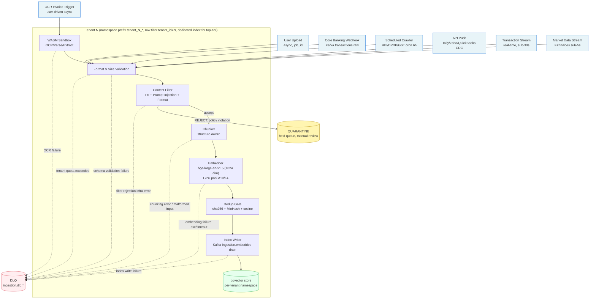

# 14. Ingestion Pipeline (Write Path)

This file covers the **WRITE PATH ONLY** for the Multi-Persona AI Banker knowledge base. RAG-as-tool-call (the agent explicitly invoking a `search()` tool at runtime) is covered in `04-api-and-contracts.md`. Here we describe how heterogeneous source content (regulatory rulebooks, contracts, OCR'd invoices, transaction streams, market data, user uploads) becomes queryable chunks in pgvector, multi-tenant safe, with full DLQ, quarantine, dedup, versioning, freshness, and re-indexing semantics.

The architectural posture follows the durable-execution graph engine pattern shipped on BlackBox (resume.txt:52-54) - every stage is a checkpointed step that can be retried independently, with explicit DLQ topics per failure class. The untrusted-file processing tier reuses the WASM sandbox plane (resume.txt:49-50) - OCR, parsing, and chunking of user-supplied files all execute inside the sandbox before any chunk leaves for the embedder. Throughput targets are sized off the Microsoft AutoML job-orchestration state machine learnings (resume.txt:91-92) and the ShareChat real-time event-processing experience at 40M DAU (resume.txt:109-114). Observability piggybacks on the LLMOps mesh OTel pipeline (resume.txt:58-59).

## Overview Diagram

The embedding model node carries the EXACT name `bge-large-en-v1.5` (1024 dim) - identical to Lane 13 (memory) point 6 - so memory writes and knowledge-base writes use a single shared embedding service. Diverging would force dual GPU pools and a perpetual cross-namespace consistency problem.

### 1. Ingestion triggers

Each trigger source is enumerated below with its sync/async posture and the queue it lands on:

- **User upload (Retail, SME, CFO):** Async. Caller POSTs to `/v1/documents/upload`, gets back a `job_id`, then polls `/v1/documents/{job_id}/status` or subscribes to a WebSocket notification. Files land in S3 first, then a manifest message is published to `ingestion.user_upload.raw` Kafka topic. The HTTP request itself returns in <200ms - all heavy processing is downstream.
- **Webhook from core banking (transactions):** Async stream. Core banking pushes batches of transactions to a webhook endpoint that forwards directly to Kafka topic `transactions.raw`. The webhook handler does only auth + tenant-id stamping; everything else is downstream. End-to-end arrival → queryable target: <30s p99.
- **Scheduled crawler for regulatory feeds:** Async, cron every 6h. A scheduler kicks crawlers for RBI circulars, DPDP regulatory notices, CBDT/GST guidance. Each crawler diffs against the prior snapshot via etag/last-modified; only changed pages produce ingest jobs. Lands on `ingestion.regulatory.raw`.
- **API push from accounting integrations (Tally/Zoho/QuickBooks):** Async. Each integration runs a per-tenant cron (default 1h) plus optional change-data-capture (CDC) where the upstream supports it. Reconciliation deltas land on `ingestion.accounting.raw`.
- **OCR'd invoices (SME, CFO):** User-triggered async with progress notification. Upload → enqueue to `ingestion.ocr.raw` → WASM sandbox (resume.txt:49-50) does OCR + extraction → produces structured JSON. Progress updates published to WebSocket so the user sees a live ingestion progress bar.
- **Market data feeds (FX rates, indices):** Real-time stream, sub-second freshness. A long-lived subscriber on Refinitiv/Bloomberg-style feeds writes to `market.ticks` and `market.eod` Kafka topics. Only EOD snapshots and material delta events are embedded; sub-second tick data goes to a separate timeseries store and is queryable by structured tools, not vector search.

Sync ingestion is deliberately avoided. Every trigger is fire-and-forget from the caller's perspective; the platform owns durability via Kafka and retries via DLQ.

### 2. Chunking strategy

Different content types have radically different structural integrity requirements; one-size chunking destroys retrieval quality for financial documents.

- **Regulatory rulebook + contracts:** Structure-aware chunking. The chunker parses section/clause boundaries (`Section 4.2(a)`, `Clause 7.1`, `Article III`) and emits one chunk per clause. Target chunk size 800–1200 tokens; overlap 100 tokens at the prior-clause tail. Preserves clause-level retrieval - a query for "indemnification cap" must return the full clause, not a fragment that drops the cap amount. This mirrors how the BlackBox graph engine (resume.txt:52-54) preserves node boundaries: chunks are nodes; clauses are the natural node granularity.
- **OCR'd invoices:** Per-document structured chunking. The chunker does NOT use sliding-window text segmentation. Instead it emits a fixed schema: one chunk for the header (vendor, invoice number, dates, totals), one chunk per line item, one chunk for the summary block. No overlap. This makes line-item lookup deterministic and makes embedding cost proportional to invoice complexity rather than text length.
- **Transactions:** NOT chunked. Each transaction is a single structured record stored in pgvector with a synthetic textual representation (e.g., `"INR 47,200 debit on 2026-03-12 from HDFC current acct to vendor 'Acme Logistics' for reference 'INV-9012'"`) embedded once. The structured fields are stored as metadata for filter-based retrieval.
- **User-uploaded docs (board memos, financial statements):** Hierarchical chunking - chapter → section → paragraph. Chunk size 600 tokens, overlap 80. Hierarchical IDs let the retrieval layer return the parent section's full context when a paragraph match is shallow.

Rationale: financial content carries clause-level legal meaning. A loan agreement chunked at sentence boundaries produces retrieval fragments that obscure the binding terms. Structure-aware chunking costs more in parsing CPU but the retrieval-quality dividend is consistent and measurable.

### 3. Embedding pipeline

- **Model:** `bge-large-en-v1.5` (1024 dim). **EXACTLY the same model identifier as Lane 13 (memory) point 6** - this is non-negotiable. A shared embedding pool serves both the memory layer and the knowledge-base ingestion layer because (a) we want a single GPU capacity envelope to manage, and (b) cross-corpus retrieval (e.g., "find memos similar to this regulatory clause") requires a shared vector space.
- **Batching:** 64 chunks per inference call. Batching beyond 64 saturates the A10/L4 GPU memory; smaller batches under-utilize the device. The embedding service auto-tunes batch size per device class.
- **GPU pool:** A10 (24 GB) and L4 (24 GB) GPUs share the workload. Steady-state throughput target: **100M chunks/hour** at peak with a 32-GPU pool, sized off the AutoML 15M+ jobs/month throughput envelope (resume.txt:91-92). For comparison, that AutoML state machine taught us how to keep a heterogeneous GPU fleet busy with batch jobs of varying shapes; the same orchestration patterns apply here.
- **CPU vs GPU:** GPU pool is the primary path. A CPU fallback runs the same model (slower, ~10× lower throughput) and is engaged when GPU pool utilization > 95% sustained for >5min OR when the GPU pool is degraded for any reason. CPU fallback prevents ingestion stalls during GPU incidents.
- **Upgrade path:** If we need to upgrade to `text-embedding-3-large` (3072 dim) or another model, follow Lane 13 point 6's dual-index strategy - write new chunks to a new namespaced index, leave the old index serving until the new index is fully warmed, then cut over with a model_version pin on the tenant.

### 4. Index write path

- **Async queue-backed write.** After embedding, chunks are published to Kafka topic `ingestion.embedded`. A pool of index-writer workers drains the topic and writes to pgvector via batched `INSERT ... ON CONFLICT` statements.
- **Retry:** Each write attempts 3 times with exponential backoff (250ms, 1s, 4s). On persistent failure → DLQ `ingestion.dlq.indexwrite` with the original message envelope intact for replay.
- **Visibility semantics:** A document is **queryable only after ALL its chunks are indexed and the document-level `is_ready` flag is set atomically**. We avoid partial visibility because retrieval against a half-written document produces missing-clause answers that are worse than no answer. The index writer holds the document's chunks in a "pending" state (a `visibility=pending` column) and flips the document's row in the `documents` table to `is_ready=true` only after the last chunk insert succeeds, inside the same transaction.
- **Soft delete + tombstone:** Re-indexing and version updates rely on tombstones (`deleted_at` column). A background sweep job hard-deletes tombstoned rows after a 7-day grace window. Tombstones are honored by the query layer immediately.
- **Idempotency:** Each chunk has a deterministic content+version-derived chunk_id (`sha256(tenant_id || doc_id || version_id || chunk_index || content_hash)`). Replays of the same Kafka message are no-ops.

This shape mirrors the durable execution model from BlackBox (resume.txt:52-54): every write is checkpointed; every retry is idempotent; every failure routes to an explicit destination.

### 5. Deduplication

A three-tier dedup gate sits between the embedder and the index writer. Skipping dedup is cheap if you're wrong; over-deduping financial content is catastrophic (e.g., dropping a "second" contract that is actually an amendment).

- **Exact dedup (document level):** sha256 of normalized text (whitespace-collapsed, lowercased). On match within the same tenant: skip; respond to user with `"duplicate_found: true, existing_doc_id=…"`. Cost: one hash + one lookup.
- **Near-duplicate (document level):** MinHash signatures with Jaccard threshold ≥ 0.85. On match: merged behavior - keep the newer document, link the older as `prior_doc_id` for audit. The user is notified ("this looks like a newer version of X - replacing").
- **Per-chunk semantic dedup (within the same document only):** cosine similarity ≥ 0.95 against existing chunks of the same document. If a chunk's embedding is ≥0.95 to a sibling, keep the first occurrence; this defends against OCR producing duplicate headers/footers on every page.
- **Cross-document semantic dedup is DISABLED** for regulatory and contract corpora. Two contracts with similar boilerplate are NOT duplicates - the differences matter. Cross-doc semantic dedup is enabled only for the user-upload corpus, with a high cosine threshold (≥0.97) and a manual-review path on positive matches.

### 6. Document versioning

- **Version model:** Each document has a stable `doc_id` plus a monotonic `version_id`. Version IDs are integer-incrementing per `doc_id` (1, 2, 3, …).
- **Cutover:** On update, the writer ingests the new version's chunks under `(doc_id, new_version_id)`, then atomically flips the `documents.current_version_id` pointer. Old chunks are tombstoned but remain readable for a staleness window.
- **Staleness window:** Old version's chunks remain queryable for **5 minutes** after cutover to absorb in-flight reads (any query started before cutover that still has retrievers fetching keeps seeing consistent results). After 5 minutes, the tombstoned chunks are vacuumed by the background sweep.
- **Audit trail:** Every version bump appends a row to `document_version_audit` with the diff summary (clause-level adds/removes/edits), the user_id of the uploader, the timestamp, and a content-hash of both versions. Required for SOC 2 and DPDP compliance.
- **Rollback:** A version can be rolled back by flipping `current_version_id` to a prior value; the prior version's chunks must still exist (i.e., not yet vacuumed) or be restored from S3 cold storage.

### 7. Re-indexing on embedding model upgrade

Upgrading the embedding model is one of the highest-risk operations in a RAG system. We use a dual-index strategy and pin per-tenant model versions to make the rollout incremental and reversible.

- **Strategy: dual-index.** When upgrading from `bge-large-en-v1.5` to (say) `text-embedding-3-large`, the new model writes to a new namespaced index (`tenant_N_v2_*`). The old index continues to serve queries.
- **Trigger:** A scheduled offline job processes all existing chunks. Priority order: (a) tenant tier (top-tier first), (b) document recency (newer docs first), (c) document classification (regulatory and contract corpora before user-upload). Lower-priority chunks may take weeks; top-tier tenants finish in days.
- **Throughput:** 100M chunks/hour at full GPU pool. For a 2B-chunk corpus (see point 13 scale model), that's a 20-hour pure-compute run, but realistically a 30-day rolling re-index because (a) we cap re-index throughput at 30% of total GPU pool to leave headroom for live ingestion, and (b) we want the new index validated tenant-by-tenant before each cutover. This is the same orchestration shape used at AutoML for re-running 15M+ jobs (resume.txt:91-92) when an upstream model artifact changed.
- **Correctness during transition:** Queries route to the model_version pinned per tenant in the user's active session. When a tenant is mid-re-index (some chunks on old model, some on new), the query API runs a **result-merge with renormalized scores**: each model's top-K is queried separately, scores normalized per-model (z-score across that model's result distribution), then merged and re-sorted. Tenants are advised that during the transition, recall may dip slightly; SLO is loosened from 95% recall to 85% during the window.
- **Rollback:** If the new index degrades retrieval quality (offline eval drop > 3% on the golden eval set), the tenant's model_version pin is reverted; new chunks continue going to the new index but queries route to old until the issue is fixed.

### 8. Freshness and TTL

Different content has different freshness contracts. The platform tags every document with a `freshness_policy` at ingestion time.

- **Regulatory rulebook:** Re-crawled every 6h. Stale documents flagged after 24h since last successful crawl. If a regulatory feed is unreachable for >24h, the affected feed is marked degraded in the LLMOps observability mesh (resume.txt:58-59) and downstream agents that depend on it are told to caveat their answers ("regulatory data may be up to 36h stale").
- **Transactions:** Real-time stream. Freshness target <30s end-to-end (arrival at webhook → queryable in pgvector). Anchored on the ShareChat 40M DAU stream-processing experience (resume.txt:109-114) where we hit similar single-digit-second event-to-queryable latencies at high throughput.
- **Market data:** Real-time stream. Freshness target <5s for EOD and material events. Sub-second tick data does NOT go through the embedding pipeline (covered in point 1).
- **User-uploaded documents:** Indefinite retention until user-initiated deletion or until the tenant's data-retention policy kicks in (default 7 years for SME/CFO, 5 years for Retail).
- **TTL semantics:** TTL is per-document metadata set at ingestion time. A central policy override can bulk-purge ("delete all market data older than 5 years"). TTL expiry produces a tombstone via the same path as user-initiated deletes.
- **Re-ingest triggers:** (a) upstream change event (etag/last-modified change on crawler), (b) scheduled crawler firing, (c) explicit user "refresh" action via the API.

### 9. Ingestion throughput and latency

Concrete arithmetic for sizing the pipeline. All numbers anchored on Lane 6 (scaling) but reproduced here so the ingestion design stands alone.

- **Transactions:** 300M/month → 300M ÷ (30 × 86400) ≈ **115/s avg, 600/s peak** (5× headroom for end-of-month settlement spikes and EOD batches). End-to-end latency arrival → queryable < 30s p99 (5s embedding + 10s queue + 10s index write + 5s slack).
- **Regulatory crawler:** ~500 documents/day across all feeds = **0.006 docs/s avg**. Trivial throughput; this lane fits in a single embedder worker.
- **User uploads (across all personas):** 2M/month avg = **0.8/s avg, 10/s peak**.
- **OCR-driven invoice ingest (SME-heavy):** 5M/month = **2/s avg, 30/s peak**.
- **Peak ingestion (non-transaction):** 10 + 30 + 0.006 ≈ **40 docs/sec peak**. Plus transactions at 600/s. Total: **~640 ops/s peak document-level**.
- **Embedding throughput needed:** Non-transaction docs chunk to ~4 chunks each → 40 docs/s × 4 = 160 chunks/s. Transactions don't chunk (1 record = 1 embed) → 600 embeds/s. Plus a re-index burst capacity of ~1700 chunks/s. Target steady-state: **~2500 chunks/s peak embedding throughput**. At 100M chunks/hour pool capacity = 27,777 chunks/s - comfortable 10× headroom.
- **Queue depth alert threshold:** > 60s of work backed up at current drain rate. At 2500 chunks/s × 60s = 150k chunks. Page P1 at this depth.

### 10. Multi-tenant isolation in the index

Multi-tenancy at the storage layer is the single most catastrophic blast-radius axis in this system. A tenant_id leak between two SME tenants is a P0 data breach.

- **Default: pgvector namespaces per tenant.** Each tenant gets a namespace prefix (`tenant_N_*`) on its chunks. The shared pgvector cluster carries all small/medium tenants. The query API enforces a `WHERE tenant_id = $caller_tenant_id` filter on every query - this filter is added by the API layer, not by the caller.
- **Top tenants ($100k+/mo):** Dedicated index per tenant. Physical isolation; no shared-cluster blast radius. Higher cost, but justified by the contract value and the security posture.
- **Write-side enforcement:** The ingestion service rejects any chunk whose envelope lacks a `tenant_id`. There is no "default tenant" fallback. The check is at the schema-validation step, before the chunk reaches the embedder.
- **Defense in depth - query-time double-check:** Even if the storage-layer filter is bypassed (bug, misconfiguration, exploited query injection), the query API independently checks each result's `tenant_id` against the caller's session tenant_id. Mismatches are: (a) dropped from the result set, (b) raised to the SOC team as a P1 alarm, (c) audited with full request/response context. Defense-in-depth is what kept ShareChat's per-creator data isolation tight at 40M DAU (resume.txt:109-114).
- **Tenant migration:** Moving a tenant from shared to dedicated index uses the same dual-index re-index machinery from point 7. Cutover is per-tenant.

### 11. Content filtering and safety

The content filter is the first line of defense against PII leaks, prompt injection in user-uploaded docs, malformed files, and resource exhaustion attacks.

- **PII detection:** Regex + ML hybrid. Patterns for Indian PAN, Aadhaar, mobile, account numbers, IFSC codes, email; plus a small transformer model for unstructured PII (names, addresses). On detection: **redact OR mask before embedding**, configurable per tenant. Default: mask (`****1234` for account numbers) so downstream retrieval can still produce useful answers. Sensitive tenants (CFO, regulated entities) can opt into full redaction.
- **Prompt injection screening:** A fine-tuned classifier runs on every user-uploaded text segment. The classifier was trained on a corpus of known prompt-injection attack templates (jailbreak prompts, instruction overrides, "ignore previous instructions" variants) plus a benign-document negative set. **Flagged content → QUARANTINE**, not DLQ. Quarantine is a held queue that requires manual reviewer action (admin or trust-and-safety analyst) before the document can be released to ingestion or rejected outright.
- **Format validation:** Whitelist of file types: PDF, DOCX, XLSX, common image formats (PNG, JPG, TIFF) for OCR, JSON for structured imports. Anything else → schema validation failure → DLQ `ingestion.dlq.schema` with a user-visible error.
- **Size limits:** 50 MB per file at user upload tier; 500 MB for batch admin uploads; 5 GB for enterprise SFTP imports (CFO persona, with explicit per-tenant override). Oversize → reject at the HTTP edge, never reaches Kafka.
- **WASM sandbox boundary:** All untrusted file parsing (PDF, DOCX, image OCR) executes inside the WASM sandbox plane (resume.txt:49-50). A malicious PDF that exploits a parser vulnerability cannot reach the host kernel.

**Quarantine vs DLQ - explicit distinction:**
- **DLQ** is for processing failures (retryable infrastructure issues - embedding service 5xx, index write contention, OCR transient failure). Automated replay job tries DLQ contents with current policy.
- **QUARANTINE** is for policy-rejected content (manual decision needed - possible prompt injection, suspicious content, content the filter flagged but didn't outright reject). Requires human review.

Conflating the two would be catastrophic: auto-replaying quarantined prompt-injection attempts would defeat the filter.

### 12. Ingestion observability

All metrics, logs, and traces flow through the LLMOps OTel mesh (resume.txt:58-59).

**Metrics:**
- Ingestion lag p50/p99 from trigger event timestamp to `is_ready=true` flag flip. Per-source (transactions, regulatory, OCR, user upload, market, accounting).
- Failure rate per document type, per stage (validation, filter, chunk, embed, dedup, index write).
- DLQ depth per failure class (`ingestion.dlq.embed`, `ingestion.dlq.indexwrite`, `ingestion.dlq.chunk`, `ingestion.dlq.ocr`, `ingestion.dlq.schema`, `ingestion.dlq.quota`).
- Quarantine depth (held content awaiting manual review).
- Index size growth per tenant per day (catches runaway upload patterns).
- Embedding throughput (chunks/s, broken out by GPU device class and fallback CPU).
- Re-index progress (% of corpus on new model, per-tenant).
- Cache hit rate on dedup (exact, MinHash, semantic).
- Time-in-stage histograms for every stage.

**Alerts:**
- Lag > 60s for transactions (P1 - agent will produce stale answers).
- Lag > 5min for regulatory feeds (P2).
- DLQ depth > 1000 across all classes (P2 - likely a systemic issue).
- DLQ class-specific spike (>3σ over 30-day baseline) (P3).
- Quarantine depth > 100 (P2 - usually means a new prompt-injection attack pattern or a misclassifier firing on benign content).
- Index size growth rate > 2× baseline for any tenant (P2 - possible runaway upload, possible abuse).
- Embedding pool utilization > 95% sustained for >5 min (P2 - CPU fallback will engage).
- Re-index progress stalled (no progress for >1h during an active re-index window) (P2).

The mesh observability shipped on the prior LLMOps work (resume.txt:58-59) gave us the playbook for these alert thresholds and the per-stage time-in-stage histograms.

### 13. Scale model

Concrete arithmetic at the 10M-user steady state. Calling out flagged super-linear costs.

**Document and chunk counts:**
- **Transactions** at 300M/month sustained × 24 months = **7.2B transaction records** in the index.
- **Regulatory + market data** in the active corpus: ~200k documents (regulatory is bounded by the upstream feed volume; market data we keep only material events and EOD snapshots).
- **User-uploaded** documents over a 24-month lifetime: 200M (10M users × 20 docs/user lifetime average).
- **OCR'd invoices** (SME persona dominates): 600M over lifetime (5M SMEs × 120 invoices/SME average).
- **Total non-transaction chunks at ~4 chunks/doc:** (200M + 200k + 600M) × 4 ≈ **3.2B chunks**, of which ~2B are active (after dedup and post-retention purges).
- **Plus 7.2B transaction records** at 1 chunk each.
- **Grand total: ~9.2B vectors** in the index.

**Vector index storage:**
- 9.2B vectors × 1024 dim × 4 bytes (float32) = **37.7 TB raw vectors**.
- Plus HNSW graph overhead (~30%) = **~49 TB total**.
- With quantization (PQ or scalar int8) we can compress 4× → **~12 TB** for production. We assume int8 quantization in steady state; float32 only for the active "hot" tier.
- Distributed across pgvector cluster shards, with per-tenant namespaces. Top-tier dedicated indexes carry their own physical shards.

**Monthly storage cost:**
- Vector store at ~$1–2k/TB/mo on EBS gp3 (with snapshots) → **~$12–24k/mo for hot tier**. Higher for top-tier dedicated indexes (premium SSD, replica counts).

**Monthly embedding compute:**
- New chunks ingested per month at steady state: ~5B chunks/mo (mostly transactions).
- On owned GPU hardware (A10/L4 pool), per-chunk amortized cost is small. All-in (GPU lease + power + ops) ~$15–25k/mo.
- Re-index passes (occasional, on model upgrades) add a one-time burst - sized into capacity planning, not steady state.

**Cost flag - super-linear with enterprise tenants:**
The top 1% of tenants (large CFO customers) drive >50% of ingest volume. A single Fortune-500-style CFO tenant can dwarf the ingest of the bottom 100k retail users combined. Cost grows super-linearly with enterprise CFO tenants because (a) they have more document types, (b) they have higher refresh cadences, (c) they often demand dedicated indexes. Per-tenant cost accounting is non-negotiable; the AutoML billing-by-job-shape lesson (resume.txt:91-92) applies directly here.

### 14. Error handling and dead-letter

Every failure class has an explicit retry policy, DLQ destination, and user-notification rule. The taxonomy below is authoritative.

| Failure class | Retry policy | DLQ destination | User notified |
|---|---|---|---|
| Embedding service 5xx | 3× exponential backoff (250ms, 1s, 4s) | `ingestion.dlq.embed` | No (transient) |
| Embedding timeout (>30s on single batch) | 2× retry with smaller batch (32, then 16) | `ingestion.dlq.embed` | No |
| Index write contention (lock/deadlock) | 5× short backoff (50–500ms jitter) | `ingestion.dlq.indexwrite` | No |
| Chunking malformed input (unparseable structure) | 0 (fail fast) | `ingestion.dlq.chunk` | **Yes** ("file malformed, could not parse structure") |
| OCR failure (unreadable image, corrupt PDF) | 1× retry with degraded model (lower-accuracy fallback) | `ingestion.dlq.ocr` | **Yes** ("could not read file, please re-upload a clearer scan") |
| Content filter rejection (prompt injection, suspicious content) | 0 | **QUARANTINE** (separate from DLQ) | **Yes** ("file held for review") |
| Schema validation failure (unsupported file type, size limit) | 0 | `ingestion.dlq.schema` | **Yes** ("file format unsupported" or "file too large") |
| Dedup determined duplicate (exact or MinHash match) | 0 (treated as success) | n/a | **Optional** ("duplicate found, not re-indexed - existing doc_id linked") |
| Tenant quota exceeded (rate limit, storage cap) | 0 | `ingestion.dlq.quota` | **Yes** ("upload limit reached, contact admin or upgrade plan") |
| WASM sandbox crash / OOM | 1× retry with larger sandbox | `ingestion.dlq.sandbox` | Yes if 2nd attempt also fails |
| Tenant_id missing on chunk envelope | 0 (security violation) | `ingestion.dlq.security` + SOC alarm | Internal only |

**DLQ retention and replay:**
- DLQ messages retained 14 days in the live cluster, then archived to S3 Glacier cold storage with 90-day retention.
- A daily replay job iterates each DLQ topic and retries items with the current policy version. Items that succeed are removed from the DLQ; items that fail again are left for the next day's run.
- After 14 days, an item that still fails is archived and a final user-visible status is set ("permanently failed; please re-upload").
- The replay job is itself instrumented and runs inside the same durable execution model (resume.txt:52-54) - each retry is a checkpointed step.

### 15. Access control on ingested content

ACL enforcement is layered: at ingestion time (tag the chunk), at query time (filter the result), and as a defense-in-depth final check (validate the result set before returning).

- **At ingestion time:** Every chunk is tagged with:
  - `tenant_id`: the owning tenant.
  - `user_scope`: who within the tenant can access - values are `user` (only the uploader), `team` (members of a defined team), `entity` (members of an organizational unit, e.g., a specific subsidiary), `public-within-tenant` (any user of the tenant).
  - `classification`: `public`, `internal`, `sensitive`, `restricted`. Used for content-filter routing and for audit-trail emphasis.
- **At query time:** The retrieval service injects `tenant_id = $caller_tenant_id AND user_scope IN ($caller_accessible_scopes)` into every query as a hard filter. The scopes accessible to a caller are computed from their session token, not declared by the caller.
- **Defense-in-depth (bypass failure mode):** The query API, after retrieving results, independently re-validates each result's `tenant_id` and `user_scope` against the caller's context. Mismatches are: (a) dropped from the result set silently before returning to the caller, (b) alarmed to the SOC team as a P1 security event, (c) full request/response context (sanitized of the actual data) appended to the security audit log. This catches bugs and any future regressions in the filter layer.
- **Cross-cutting examples:**
  - Regulatory rulebook chunks are `classification=public, user_scope=public-within-tenant`. Anyone in the tenant can retrieve them.
  - User-uploaded board memos default to `classification=sensitive, user_scope=team` or tighter, depending on the uploading user's selection. CFO persona has a "restricted to board" preset that maps to a specific team.
  - Transactions are `classification=sensitive, user_scope=user` - only the account holder can retrieve their own transactions. Spousal/joint accounts get an explicit team-scope tag.
  - Contracts are `classification=sensitive, user_scope=team` (the contracts team within the tenant), with optional `user_scope=entity` for entity-specific contracts.

ACL violations are audited with the same rigor as financial transactions because the DPDP regulatory regime treats unauthorized access as a reportable incident with mandatory user notification within 72h.

---

**Anchors recap:** BlackBox durable execution graph (resume.txt:52-54) for the per-stage checkpointed pipeline shape; WASM sandbox plane (resume.txt:49-50) for safe untrusted-file parsing and OCR; AutoML 15M+ jobs/month state machine (resume.txt:91-92) for batch GPU orchestration patterns; ShareChat 40M DAU stream processing (resume.txt:109-114) for sub-30s end-to-end ingestion at high throughput; LLMOps OTel mesh (resume.txt:58-59) for the observability spine.
