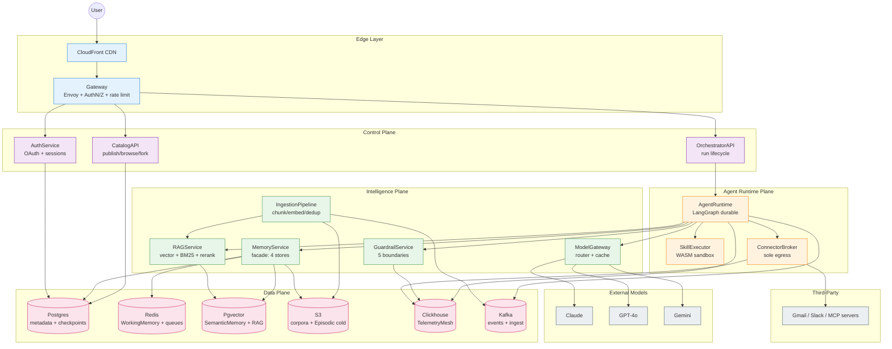

# Executive Summary

## What We're Building

A B2C web platform where any consumer can author an AI agent in minutes by composing four primitives — a **persona** (system prompt + voice), a set of **connectors** (MCP servers + OAuth-token integrations like Gmail and Slack), one or more **RAG corpora**, and **Claude-skills-syntax** scripts that run inside a sandboxed runtime — all backed by a **four-tier memory layer** (Working, Episodic, Semantic, Procedural). Other users browse a public **catalog**, fork agents, and run their own variants. Underneath, the platform is a durable LangGraph runtime that schedules a planner–router–tool-caller–critic loop across a model router (Claude/GPT/Gemini), serves retrievals from Pgvector + BM25, executes user scripts in a WASM sandbox, and ships every span through a Clickhouse-backed telemetry mesh. The deliberate analogy is OpenAI Custom GPTs, but with first-class memory, MCP, and skill-script execution as platform primitives rather than bolt-ons.

---

## Why This Design — Five Decisions That Define the Pack

1. **LangGraph durable runtime as the substrate, not a custom orchestrator.** Every agent run is a checkpointed graph execution. State lives in Postgres (`AgentCheckpoint`), not in-memory. Crash recovery is free, time-travel debugging is free, and human-in-the-loop pause/resume is a first-class state, not a side channel. This is the direct B2C extension of the BlackBox LangGraph runtime that already handles 10K+ runs/day (`resume.txt:51-52`) and the graph workflow engine with checkpointing (`resume.txt:53-54`). The alternative — a hand-rolled state machine — was rejected in `09-tradeoffs-and-alternatives.md` because it would re-derive durability from scratch.

2. **WASM sandbox is the only place user code ever executes.** Skills authored in Claude-skills syntax can contain scripts. Those scripts run in a Wasmtime-based sandbox with no network egress, no filesystem, capability tokens for syscalls, and a 30-second wall clock. This is the direct lineage of the BlackBox sandbox plane (1M+ daily executions, SOC-2 ready — `resume.txt:49-50`). No container-per-script, no V8 isolate, no eval. The blast radius of a malicious or buggy skill is a single Wasmtime instance.

3. **MemoryService is a facade in front of four independent stores.** WorkingMemory (Redis, 8h TTL), EpisodicMemory (Postgres + S3 cold tier), SemanticMemory (Pgvector + BM25), ProceduralMemory (Postgres + version-controlled prompts). Every read goes through one service with a unified API; every write is dual-pathed through GuardrailService. This stops the "every agent reinvents its own memory" failure mode and lets us evolve the stores independently. Designed in detail in `13-memory-layer-design.md`.

4. **ConnectorBroker is the sole egress path for the entire fleet.** No agent talks to Gmail, Slack, an MCP server, or any third-party API directly. Every outbound call goes through ConnectorBroker, which holds OAuth tokens in HashiCorp Vault, enforces per-user scopes, applies rate limits per (user, connector) pair, and emits an audit span to TelemetryMesh. This is the security keystone — it converts "1M users with OAuth tokens" from a distributed credential problem into a centralized credential problem. Detailed in `07-security-and-isolation.md`.

5. **GuardrailService sits at every input/output boundary, not just the model edge.** Prompt injection check at user input, PII redaction at RAG retrieval, output classifier before user delivery, skill manifest signing before execution, connector scope validation before egress. Five checkpoints, not one. This is informed by the BlackBox guardrails work (`resume.txt:60-61`) and detailed across the 15-point rubric in `15-guardrails.md`. Defense in depth is non-negotiable for a B2C platform where the input distribution is adversarial by default.

---

## Scale Shape

| Dimension | Target | Source / Derivation |
|---|---|---|
| Registered users | 1M | Assumption (B2C platform pattern) |
| Weekly active users (WAU) | 100K | 10% of registered, standard B2C conversion |
| Agents created | 10K | ~1% of users author; rest consume |
| Concurrent agent runs (peak) | 5K | 100K WAU × 5 runs/day × 30s avg / 86400 × 3x peak factor |
| Runs per day | 500K | 100K WAU × 5 runs/day |
| Model tokens per day | 750M | 500K runs × 1.5K tokens avg in+out (extrapolation from BlackBox 1B/month at lower scale, `resume.txt:55-56`) |
| Telemetry spans per day | 50M | 500K runs × 100 spans/run (mirrors BlackBox 50M/day, `resume.txt:58-59`) |
| Vector store size | ~2 TB | 10K agents × 200 MB avg corpus (10K chunks × 1024 dim × 4B + metadata) |
| Memory storage per user | ~50 MB | Working (1MB) + Episodic (20MB) + Semantic (25MB) + Procedural (4MB) |
| Cost per run (p50 target) | $0.05 | Model $0.03 + infra $0.01 + storage/egress $0.01 |
| Latency budget (first token, p50) | 1.8s | Gateway 50ms + Planner 600ms + Router 50ms + Model TTFT 1.1s |
| Latency budget (full run, p95) | 12s | Multi-tool runs, includes one RAG hop + two connector hops |
| Daily storage growth | ~150 GB/day | Episodic + telemetry combined |

Full arithmetic in `02-design-estimates.md` and `06-scaling-and-capacity.md`.

---

## Resume Grounding (Condensed)

| Claim in this pack | Anchor | Confidence |
|---|---|---|
| LangGraph durable agent runtime, planner–router–critic, durable checkpoints | `resume.txt:51-52` (10K+ runs/day) + `resume.txt:53-54` (graph + checkpointing) | High |
| WASM sandbox as the only skill execution surface, SOC-2 path | `resume.txt:49-50` (1M+ daily executions, SOC-2) | High |
| ModelGateway with capability-aware routing across Claude/GPT/Gemini | `resume.txt:55-56` (Claude/GPT/Grok router, 1B+ tokens/month) | High |
| TelemetryMesh on Clickhouse + OpenTelemetry, 50M spans/day, deterministic replay | `resume.txt:58-59` (50M/day, 60% MTTR reduction) | High |
| Multi-tenant K8s isolation, per-tenant network policies, identity boundaries | `resume.txt:87-89` (Microsoft VNet + identity isolation) | High |
| Vector retrieval, BM25 hybrid, cross-encoder rerank, HNSW | `resume.txt:60-61` (RAG, HNSW, bm25, cross-encoder) | High |
| Catalog + fork model (consumer self-serve at scale) | `resume.txt:90-92` (AutoML 15M jobs/month, 200K users) | Supporting |
| ConnectorBroker as secure egress fabric with identity rotation | `resume.txt:97-98` (QUIC + Rust + identity rotation on 1M+ instances) | Supporting |

Two-anchor-minimum rule satisfied for every load-bearing claim. Assumptions (cost per run, 50MB/user memory, 5K concurrent peak) are flagged inline.

---

## Reading Order — Which File for Which Question

If the interviewer asks **"draw the architecture"** →
`03-architecture.md` (full Mermaid + LB chain) then `12-agentic-graph-structure.md` (Layer 1 + Layer 2 graph).

If the interviewer asks **"how does memory work"** →
`13-memory-layer-design.md` (four memory types, 15-point rubric, write path through GuardrailService).

If the interviewer asks **"how do you ingest a user's RAG corpus"** →
`14-ingestion-pipeline.md` (chunking, EmbedderTextV3, dedup, dual-store write to Pgvector + BM25).

If the interviewer asks **"how do skills run safely"** →
`07-security-and-isolation.md` (sandbox isolation) + `05-low-level-design.md` (SkillRunner LLD).

If the interviewer asks **"what breaks first at 5K concurrent runs"** →
`06-scaling-and-capacity.md` (capacity walk) + `08-reliability-observability-and-failures.md` (failure modes).

If the interviewer asks **"how do you stop prompt injection"** →
`15-guardrails.md` (5 boundary checks, 15-point rubric).

If the interviewer asks **"give me the API"** →
`04-api-and-contracts.md` (REST + WebSocket + connector callback contracts).

If the interviewer asks **"why not just use OpenAI Assistants API directly"** →
`09-tradeoffs-and-alternatives.md` (build-vs-buy walk).

If the interviewer pivots to **HLD whiteboard** under time pressure →
`11-cheat-sheet.md` (one-page punch list).

If the interviewer asks **adversarial follow-ups** ("what if a skill exfiltrates memory?", "what if Pgvector falls over?") →
`10-cross-questions.md` (pre-canned answers to 30+ challenges).

---

## Top-Level Component Map

Five planes. Every box is a service we own (except External Models and Third-Party). Every arrow that leaves the platform passes through ConnectorBroker or ModelGateway — no exceptions. Every arrow that touches user data passes through GuardrailService at least once. This is the entire system in one picture; the rest of the pack is depth.

---

## What This Pack Is Not

- Not a billing design. Stripe + usage metering on Clickhouse spans is the answer; not designed in depth.
- Not a fine-tuning platform. Personalization is prompt + memory, not weights.
- Not multi-region active-active. Single primary (us-east-1), read replica in eu-west-1. Cross-region writes are v2.
- Not a mobile app spec. Web-first; mobile reuses the same OrchestratorAPI + WebSocket contract.
- Not an enterprise SSO/SAML deep dive. Consumer OAuth (Google, GitHub, Apple) only at v1.

Each is acknowledged in `00-question-and-context.md` and re-asserted here so an interviewer can't claim we hid a gap.
