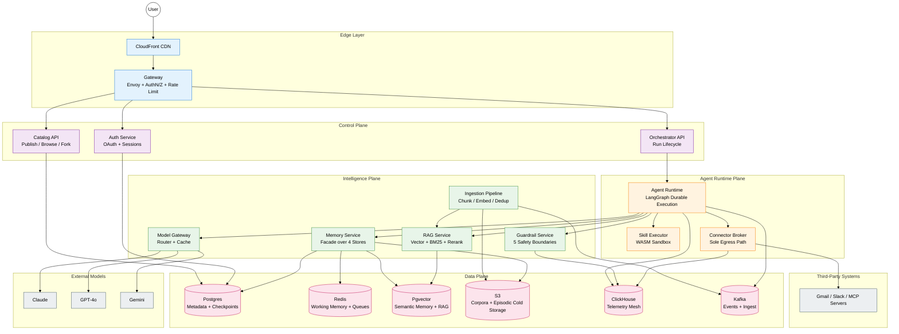

# Executive Summary

## What We're Building

A B2C web platform where any consumer can author an AI agent in minutes by composing four primitives:

  - a **persona** (system prompt + voice)
  - a set of **connectors** (MCP servers + OAuth-token integrations like Gmail, Slack, Browser and others), one or more **RAG corpora**, and 
  - **Claude-skills-syntax** scripts that run inside a sandboxed runtime - all backed by 
  - a **four-tier memory layer** (Working, Episodic, Semantic, Procedural). 

Other users browse a public **catalog**, fork agents, and run their own variants. 

Underneath, the platform is a durable LangGraph runtime that schedules a planner–router–tool-caller–critic loop across a model router (Claude/GPT/Gemini), serves retrievals from Qdrant + BM25 or Elastic Search, executes user scripts in a sandbox, and ships every span through a Clickhouse-backed telemetry mesh. The deliberate analogy is OpenAI Custom GPTs, but with first-class memory, MCP, and skill-script execution as platform primitives rather than bolt-ons.

---

## Why This Design - Five Decisions That Define the Pack

1. **LangGraph durable runtime as the substrate, not a custom orchestrator.** Every agent run is a checkpointed graph execution. State lives in Postgres (`AgentCheckpoint`), not in-memory. Crash recovery is free, time-travel debugging is free, and human-in-the-loop pause/resume is a first-class state, not a side channel.

2. **Sandbox is the only place user code ever executes.** Skills authored in Claude-skills syntax can contain scripts. Those scripts run in a sandbox(docker or Firecracker). The blast radius of a malicious or buggy skill is a single Firecracker instance.

3. **MemoryService is a facade in front of four independent stores.** WorkingMemory (Redis, 8h TTL), EpisodicMemory (Postgres + S3 cold tier), SemanticMemory (Qdrant + BM25 or Elastic Search), ProceduralMemory (Postgres + version-controlled prompts). Every read goes through one service with a unified API; every write is dual-pathed through GuardrailService. This stops the "every agent reinvents its own memory" failure mode and lets us evolve the stores independently. 

4. **ConnectorBroker is the sole egress path for the entire fleet.** No agent talks to Gmail, Slack, an MCP server, or any third-party API directly. Every outbound call goes through ConnectorBroker, which holds OAuth tokens in HashiCorp Vault, enforces per-user scopes, applies rate limits per (user, connector) pair, and emits an audit span to TelemetryMesh. This is the security keystone - it converts "1M users with OAuth tokens" from a distributed credential problem into a centralized credential problem.

5. **GuardrailService sits at every input/output boundary, not just the model edge.** Prompt injection check at user input, PII redaction at RAG retrieval, output classifier before user delivery, skill manifest signing before execution, connector scope validation before egress. Five checkpoints, not one. Defense in depth is non-negotiable for a B2C platform where the input distribution is adversarial by default.

---

## Scale Shape

| Dimension | Target | Source / Derivation |
|---|---|---|
| Registered users | 1M | Assumption (B2C platform pattern) |
| Weekly active users (WAU) | 100K | 10% of registered, standard B2C conversion |
| Agents created | 10K | ~1% of users author; rest consume |
| Concurrent agent runs (peak) | 5K | 100K WAU × 5 runs/day × 30s avg / 86400 × 3x peak factor |
| Runs per day | 500K | 100K WAU × 5 runs/day |
| Model tokens per day | 750M | 500K runs × 1.5K tokens avg in+out (extrapolation from BlackBox 1B/month at lower scale, `resume.txt:55-56`) |
| Telemetry spans per day | 50M | 500K runs × 100 spans/run (mirrors BlackBox 50M/day, `resume.txt:58-59`) |
| Vector store size | ~2 TB | 10K agents × 200 MB avg corpus (10K chunks × 1024 dim × 4B + metadata) |
| Memory storage per user | ~50 MB | Working (1MB) + Episodic (20MB) + Semantic (25MB) + Procedural (4MB) |
| Cost per run (p50 target) | $0.05 | Model $0.03 + infra $0.01 + storage/egress $0.01 |
| Latency budget (first token, p50) | 1.8s | Gateway 50ms + Planner 600ms + Router 50ms + Model TTFT 1.1s |
| Latency budget (full run, p95) | 12s | Multi-tool runs, includes one RAG hop + two connector hops |
| Daily storage growth | ~150 GB/day | Episodic + telemetry combined |

---

## Top-Level Component Map

Five planes. Every box is a service we own (except External Models and Third-Party). Every arrow that leaves the platform passes through ConnectorBroker or ModelGateway - no exceptions. Every arrow that touches user data passes through GuardrailService at least once. This is the entire system in one picture; the rest of the pack is depth.

---
