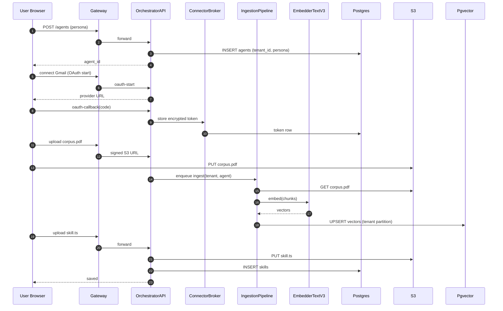
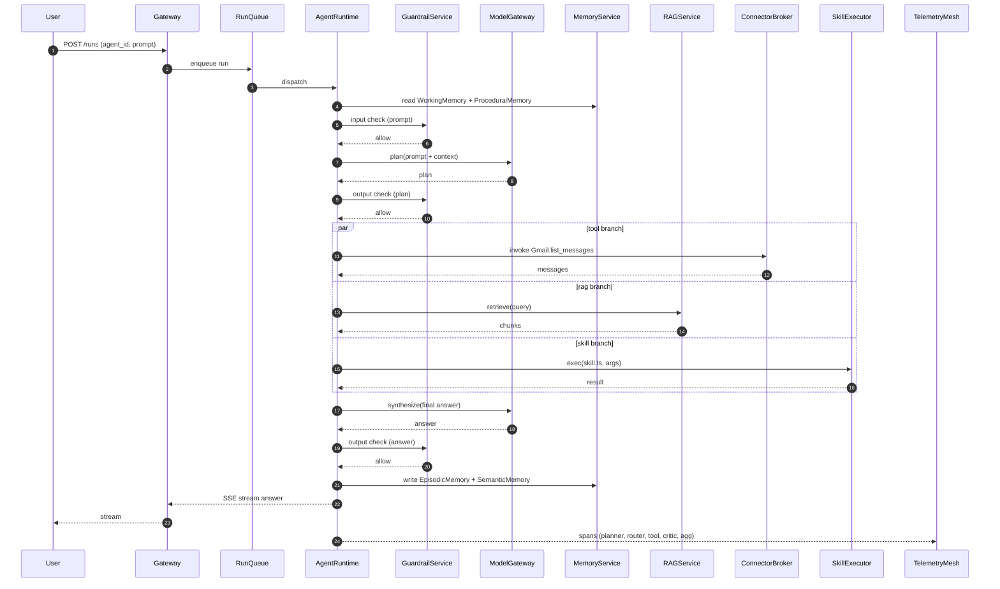

# 03 - Architecture: B2C AI Agent Orchestrator + Catalog

## 1. Top-level Mermaid Diagram

```mermaid
%%{init: {
  'theme': 'base',
  'themeVariables': {
    'fontFamily': 'Inter, Arial',
    'primaryTextColor': '#111827',
    'textColor': '#111827',
    'lineColor': '#374151',
    'primaryBorderColor': '#374151',
    'clusterBkg': '#ffffff',
    'clusterBorder': '#d1d5db',
    'edgeLabelBackground': 'transparent'
  }
}}%%

graph TD

    %% =========================
    %% Edge / Entry
    %% =========================
    User["User Browser"]
    Gateway["Gateway<br/>HTTPS / AuthN / Rate Limit"]

    User -->|HTTPS| Gateway

    %% =========================
    %% Control Plane
    %% =========================
    OrchestratorAPI["Orchestrator API<br/>Run Lifecycle"]
    CatalogAPI["Catalog API<br/>Browse / Fork / Publish"]
    RunQueue[("Run Queue<br/>SQS")]

    Gateway -->|control plane| OrchestratorAPI
    Gateway -->|catalog browse / fork| CatalogAPI
    Gateway -->|POST /runs enqueue| RunQueue
    RunQueue --> AgentRuntime

    %% =========================
    %% External Systems
    %% =========================
    ExtLLM["Claude / GPT / Gemini APIs"]
    ExtConn["Gmail / Slack / 3P MCP"]

    ModelGateway -->|HTTPS| ExtLLM
    ConnectorBroker -->|OAuth + MCP| ExtConn

    %% =========================
    %% Per-Tenant Boundary
    %% =========================
    subgraph Tenant["Per-User Tenant Boundary"]
        direction TB

        %% Runtime DAG
        subgraph AgentRuntime["Agent Runtime DAG Worker"]
            direction LR

            Planner["Planner"]
            Router["Router"]
            ToolCaller["Tool Caller"]
            Critic["Critic"]
            Aggregator["Aggregator"]
            HITL["Human-in-the-Loop"]

            Planner --> Router
            Router --> ToolCaller
            ToolCaller --> Critic
            Critic --> Aggregator
            Aggregator --> HITL
            HITL --> Planner
        end

        %% Safety / Execution / Connectors / Models
        GuardrailService["Guardrail Service<br/>Input / Output / Tool Policy"]
        SkillExecutor["Skill Executor<br/>Sandboxed Skill Runtime"]
        ConnectorBroker["Connector Broker<br/>Sole Egress Path"]
        ModelGateway["Model Gateway<br/>Router / Cache / Fallback"]

        AgentRuntime -->|input check| GuardrailService
        GuardrailService -->|output + tool-call check| AgentRuntime

        AgentRuntime -->|invoke skill| SkillExecutor
        SkillExecutor -->|fetch script| S3

        AgentRuntime -->|proxied call| ConnectorBroker
        AgentRuntime -->|LLM completion| ModelGateway

        %% Memory Plane
        subgraph MemoryService["Memory Service Facade"]
            direction TB

            WorkingMemory["Working Memory<br/>Short-lived State"]
            EpisodicMemory["Episodic Memory<br/>Conversation History"]
            SemanticMemory["Semantic Memory<br/>Facts / Embeddings"]
            ProceduralMemory["Procedural Memory<br/>User Workflows / Skills"]
        end

        AgentRuntime -->|read context| MemoryService
        AgentRuntime -->|write turn / fact| MemoryService

        WorkingMemory --> Redis
        EpisodicMemory --> Postgres
        SemanticMemory --> Qdrant
        ProceduralMemory --> Postgres
        ProceduralMemory --> Redis

        %% RAG Plane
        RAGService["RAG Service<br/>Hybrid Retrieve / Rerank"]
        IngestionPipeline["Ingestion Pipeline<br/>Parse / Chunk / Dedup"]
        EmbedderTextV3["Embedding Model<br/>text-embedding-v3"]

        AgentRuntime -->|retrieve| RAGService
        RAGService -->|kNN read| Qdrant

        IngestionPipeline -->|chunk + embed + index| EmbedderTextV3
        EmbedderTextV3 -->|vectors| Qdrant
        IngestionPipeline -->|raw doc| S3
    end

    %% =========================
    %% Data Stores
    %% =========================
    Redis[("Redis<br/>Working Memory / Queues")]
    Postgres[("Postgres<br/>Metadata / Runs / Memory")]
    Qdrant[("Qdrant<br/>Semantic Memory / RAG")]
    S3[("S3<br/>Scripts / Raw Docs / Artifacts")]
    Clickhouse[("ClickHouse<br/>Telemetry Analytics")]

    %% =========================
    %% Telemetry
    %% =========================
    TelemetryMesh["Telemetry Mesh<br/>OpenTelemetry Collector"]

    AgentRuntime -.->|OTel spans| TelemetryMesh
    SkillExecutor -.->|exec spans| TelemetryMesh
    ConnectorBroker -.->|connector spans| TelemetryMesh
    ModelGateway -.->|LLM spans| TelemetryMesh
    RAGService -.->|retrieval spans| TelemetryMesh
    MemoryService -.->|memory spans| TelemetryMesh
    GuardrailService -.->|policy spans| TelemetryMesh

    TelemetryMesh --> Clickhouse

    %% =========================
    %% Control Plane Stores
    %% =========================
    OrchestratorAPI --> Postgres
    OrchestratorAPI -->|script upload| S3
    CatalogAPI --> Postgres

    %% =========================
    %% Styling
    %% =========================

    classDef user fill:#f8fafc,stroke:#0f172a,stroke-width:2px,color:#111827

    classDef edge fill:#dbeafe,stroke:#2563eb,stroke-width:2px,color:#111827
    classDef control fill:#ede9fe,stroke:#7c3aed,stroke-width:2px,color:#111827
    classDef queue fill:#fef3c7,stroke:#d97706,stroke-width:2px,color:#111827

    classDef runtime fill:#ffedd5,stroke:#ea580c,stroke-width:2px,color:#111827
    classDef safety fill:#fee2e2,stroke:#dc2626,stroke-width:2px,color:#111827
    classDef memory fill:#dcfce7,stroke:#16a34a,stroke-width:2px,color:#111827
    classDef rag fill:#ccfbf1,stroke:#0f766e,stroke-width:2px,color:#111827
    classDef model fill:#e0e7ff,stroke:#4f46e5,stroke-width:2px,color:#111827
    classDef connector fill:#fce7f3,stroke:#db2777,stroke-width:2px,color:#111827

    classDef store fill:#f1f5f9,stroke:#475569,stroke-width:2px,color:#111827
    classDef telemetry fill:#e5e7eb,stroke:#374151,stroke-width:2px,stroke-dasharray: 5 5,color:#111827
    classDef external fill:#fafafa,stroke:#525252,stroke-width:2px,color:#111827

    %% =========================
    %% Class Assignments
    %% =========================

    class User user
    class Gateway edge

    class OrchestratorAPI,CatalogAPI control
    class RunQueue queue

    class AgentRuntime,Planner,Router,ToolCaller,Critic,Aggregator,HITL runtime
    class GuardrailService safety
    class SkillExecutor runtime
    class MemoryService,WorkingMemory,EpisodicMemory,SemanticMemory,ProceduralMemory memory
    class RAGService,IngestionPipeline,EmbedderTextV3 rag
    class ModelGateway model
    class ConnectorBroker connector

    class Redis,Postgres,Qdrant,S3,Clickhouse store
    class TelemetryMesh telemetry
    class ExtLLM,ExtConn external
```

---

## 3. Control Plane vs Data Plane

| Component | Plane | Why it lives there | Scale concern |
|---|---|---|---|
| `Gateway` | Edge | TLS termination, WAF, rate limit, auth cookie → JWT exchange. Single ingress for both planes. | Connection storms during catalog launches; needs HPA on conn-count. |
| `OrchestratorAPI` | Control | Agent CRUD, persona edits, connector OAuth callbacks, skill upload, corpus registration. Low QPS, transactional. | Burst on signup; bounded by Postgres write IOPS. |
| `CatalogAPI` | Control | Browse, search, fork, install. Read-heavy; cache aggressively in Redis. | Hot agents (viral fork) - needs per-agent Redis caching with stampede protection. |
| `AgentRuntime` | Data | Executes the LangGraph DAG per run. Pulls from `RunQueue`, runs Planner → ... → Aggregator. | 10K+ runs/day target initially; horizontal scale via pod count, durable checkpoints in Postgres. |
| `SkillExecutor` | Data | Sandbox for user skill scripts. SOC-2-isolatable execution surface. | 1M+ executions/day envelope from sandbox plane (resume.txt:49, blackbox-experience.md points 3-5). |
| `ConnectorBroker` | Data | Proxies MCP and OAuth calls so tokens never enter `AgentRuntime` process. | Per-tenant token decryption hot path; needs token cache with KMS-bounded TTL. |
| `MemoryService` | Data | Read/write working, episodic, semantic, procedural memory. Critical-path latency. | Read p99 must stay < 80ms; `WorkingMemory` Redis hot key risk per session. |
| `RAGService` | Data | kNN retrieval against `Qdrant`. | HNSW index pressure on writes; resume mentions HNSW + bm25 hybrid (resume.txt:60-61). |
| `IngestionPipeline` | Data (async) | Chunk → embed → index user-uploaded docs. Decoupled from query path. | Embedding throughput; `EmbedderTextV3` batch size + provider rate limits. |
| `ModelGateway` | Data | Multi-provider LLM gateway, capability-aware routing - direct port of the BlackBox model router across Claude/GPT/Grok (resume.txt:55-56, blackbox-experience.md points 16-19). | 1B+ tokens/month envelope; provider rate-limit shaping. |
| `GuardrailService` | Data | Input/output/tool-call policy enforcement. | In-line latency budget; needs sub-30ms p99 for shadow checks. |
| `TelemetryMesh` | Data (out-of-band) | OTel collector + span buffering before Clickhouse. | - |

---

## 4. End-to-end Request Flows

### Flow A - User creates an agent

1. User opens `/builder` in browser → `Gateway` → `OrchestratorAPI POST /agents`.
2. `OrchestratorAPI` writes a row in `Postgres.agents` with `tenant_id = user_id`, persona JSON, default model id.
3. User adds Gmail connector → `OrchestratorAPI` returns OAuth URL → user consents → callback hits `OrchestratorAPI` → encrypted token stored in `ConnectorBroker` vault keyed by `(tenant_id, agent_id, connector_id)`.
4. User uploads a PDF as RAG corpus → `OrchestratorAPI` writes raw to `S3`, enqueues an `IngestionPipeline` job → pipeline chunks, calls `EmbedderTextV3`, writes vectors into `Qdrant` partition `tenant_<id>`.
5. User uploads a skill script (Claude-skills-syntax `script.ts`) → `OrchestratorAPI` validates schema, writes script blob to `S3`, registers it in `Postgres.skills`.
6. User clicks "save" → `OrchestratorAPI` returns the full agent manifest (versioned).

### Flow B - User runs the agent

1. User clicks "run" in the builder → `Gateway POST /runs` with `agent_id` + user prompt.
2. `Gateway` enqueues a run envelope into the `Run Queue` (SQS | Kafka ).
3. An `AgentRuntime` worker pod picks up the run, materializes the DAG from the agent manifest, persists `run_id` checkpoint row in `Postgres`.
4. `AgentRuntime` enters the Planner node → asks `ModelGateway` for a plan → `ModelGateway` routes to Claude (capability-aware) and returns the plan.
5. `Planner` output passes through `GuardrailService` (output check) before being committed to `WorkingMemory`.
6. `Router` decides: tool call vs RAG retrieve vs respond.
7. If RAG: `RAGService` runs HNSW + bm25 hybrid over the tenant's `Qdrant` partition (resume.txt:60-61), returns top-k chunks.
8. If tool: `ToolCaller` invokes either `ConnectorBroker` (Gmail/Slack/MCP) or `SkillExecutor` (Sandbox) with idempotency key. `ConnectorBroker` injects the token; `SkillExecutor` runs the script in the sandbox.
9. Tool result → `Critic` node validates → `Aggregator` merges parallel branch results → write turn to `EpisodicMemory` (Postgres) and important facts to `SemanticMemory` (Qdrant`).
10. If policy requires human approval → `HITL` node pauses run; checkpoint in `Postgres`; surfaces approval UI via websocket; user resumes → durable-execution restart of the DAG.
11. Final response → `GuardrailService` (output check) → streamed to user via SSE through `Gateway`.
12. Every node emits OTel spans to `TelemetryMesh` → `Clickhouse`.

### Flow C - Catalog browse and fork

1. Consumer hits `/catalog` → `Gateway` → `CatalogAPI` → Redis cache hit on hot agent list.
2. Consumer clicks "Fork agent X" → `CatalogAPI POST /agents/{id}/fork` with consumer's auth.
3. `CatalogAPI` reads source agent manifest from `Postgres`, **deep-copies persona, skill references, RAG corpus schema, and connector schema** under the consumer's `tenant_id`. Skill script blobs in `S3` are referenced by content-hash, not copied.
4. **Credentials are not copied.** Consumer must reconnect their own Gmail / Slack OAuth via `OrchestratorAPI` before the forked agent can be run.
5. **RAG corpus content is not auto-copied.** Consumer can opt to clone the original corpus chunks (if author marked corpus as "shareable") via `IngestionPipeline` re-write into consumer's `Qdrant` partition.
6. Forked agent appears under the consumer's account, runnable via Flow B.

---

## 5. Component Responsibilities

| Component | One-line job | Scale concern | Failure mode |
|---|---|---|---|
| `Gateway` | TLS, auth, rate limit, route to control vs data plane | Connection fan-in during launches | Fail closed; circuit-break upstream |
| `OrchestratorAPI` | Authoring CRUD + OAuth callbacks + skill upload | Postgres write IOPS | 5xx returns; client retries idempotent PUT |
| `CatalogAPI` | Browse / fork / install | Redis cache stampede on viral agent | Stale-while-revalidate fallback |
| `AgentRuntime` | Run the LangGraph DAG with checkpoint + retry semantics (resume.txt:51-54) | Per-pod active runs ~ 50 | Checkpoint in `Postgres`; another pod resumes |
| `Planner` | Decompose prompt into steps | Token cost per plan | Falls back to single-step |
| `Router` | Decide tool vs RAG vs respond | Tight latency budget | Default to "respond" with apology |
| `ToolCaller` | Invoke connectors / skills with idempotency key | Side-effect safety (blackbox-experience.md point 17) | Idempotency-key dedupe in Redis |
| `Critic` | Validate node outputs against schema + policy | Adds latency to every hop | Bypass on critical path with degraded mode flag |
| `Aggregator` | Join parallel branch results | Memory footprint of joined state | Spill to S3 if > 1MB |
| `HITL` | Pause + resume with human approval | Pause-state count in Postgres | TTL of 72h then auto-cancel |
| `SkillExecutor` | Run andboxed user scripts. Note: `SkillExecutor` is the sandbox **service**; `SkillRunner` is the graph **node** that invokes it. | 1M+ executions/day envelope | Sandbox crash → return structured error, no leak |
| `ConnectorBroker` | OAuth + MCP proxy, token vault | Token decryption hot path | Token expiry → refresh + retry |
| `MemoryService` | Facade over 4 memory types | Read p99 < 80ms | Degrade to working memory only |
| `RAGService` | Hybrid retrieval (HNSW + bm25) (resume.txt:60-61) | Index pressure during ingest | Fallback to bm25-only |
| `IngestionPipeline` | Chunk + embed + index | Embedding provider rate limit | Backpressure to job queue |
| `ModelGateway` | Multi-provider routing (resume.txt:55-56) | 1B+ tokens/month budget | Provider failover with capability match |
| `GuardrailService` | Policy enforcement in-line | Sub-30ms p99 | Fail-closed for tool-call checks, fail-open for shadow checks |
| `TelemetryMesh` | OTel collector → Clickhouse (resume.txt:58-59) | 50M spans/day | Local disk buffer, then drop with stat counter |

---

## 6. Multi-region Considerations

| Item | Launch decision | Future state |
|---|---|---|
| Primary region | `us-east-1` (EKS, Postgres primary, Qdrant primary, Redis primary, Clickhouse) | - |
| EU read replica | `eu-west-1` Postgres read replica for GDPR data-locality preview | Promote to active-active once write paths are conflict-free |
| Memory replication | `MemoryService` Postgres → DMS async replication to eu-west-1; Redis is not replicated (working memory is ephemeral per run) | Active-active needs CRDT or single-writer routing |
| RAG corpus locality | Corpus is **pinned to the user's home region** at corpus-create time; queries route to home region | Cross-region replicate explicitly only if user enables |
| `S3` artifacts | Single bucket with Cross-Region Replication for skill scripts; user uploads stay in home region | - |
| `Clickhouse` | Single region at launch; per-region cluster + ClickHouse Keeper later | - |
| Catalog | Replicated read-only via Postgres logical replication to all read regions | - |

---

## 7. Tenant Isolation Model (Consumer Scale)

| Boundary | Mechanism |
|---|---|
| `Postgres` | `tenant_id` column on every row, row-level security policy `USING (tenant_id = current_setting('app.tenant_id'))` |
| `Qdrant` | Per-tenant partition: `documents_tenant_<id>` table inheriting from `documents`; HNSW index per partition |
| `Redis` | Key prefix `t:<tenant_id>:` on every key; Redis ACL user-per-shard with prefix scope |
| `S3` | Object prefix `tenant=<id>/`; bucket policy + KMS key per high-value tenant |
| `ConnectorBroker` token vault | Token encrypted with envelope encryption; DEK per `(tenant_id, agent_id)`; KMS-CMK per region |
| `SkillExecutor` | One Sandbox instance per execution; no shared memory; resource limits per `tenant_id` quota |
| `AgentRuntime` | Pod-shared but run-scoped context object; tenant_id flows through every node as part of the run envelope; OTel baggage carries `tenant.id` for end-to-end tracing |
| `RAGService` | Query rewritten with `WHERE tenant_id = ?` before vector kNN; deny if tenant_id missing |
| `ModelGateway` | Per-tenant token bucket for provider quota; per-tenant prompt-hash cache to avoid cross-tenant cache pollution |
