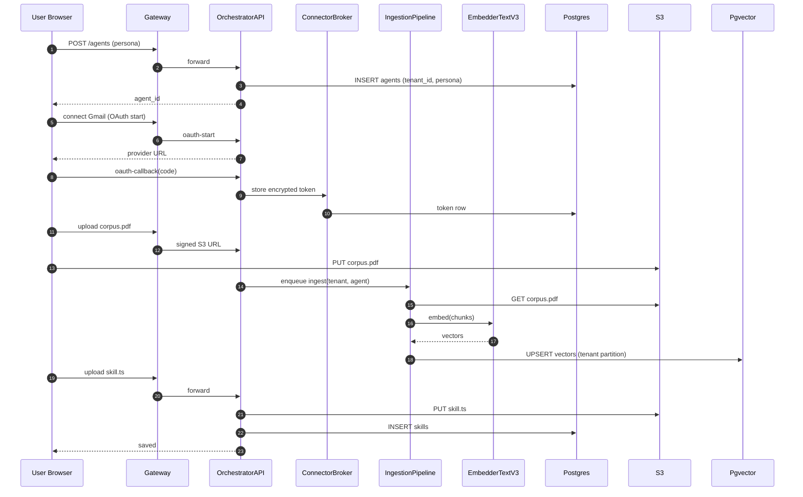
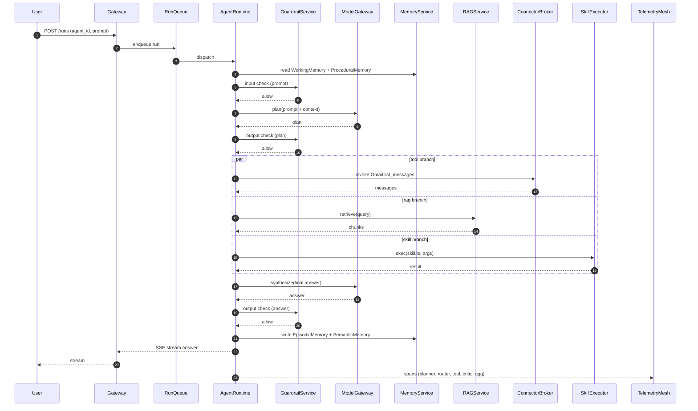
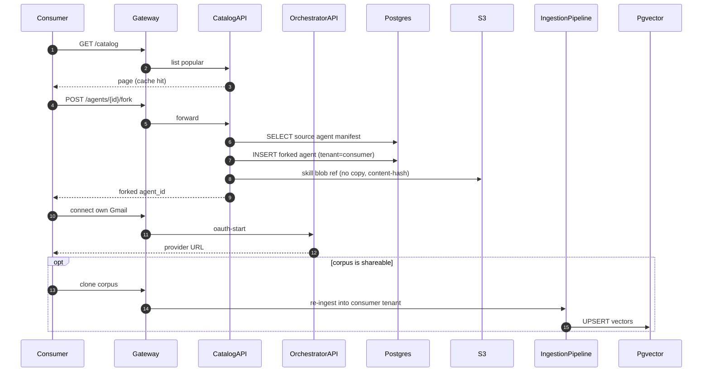

# 03 — Architecture: B2C AI Agent Orchestrator + Catalog

## 1. System Overview

This platform is a **B2C web application** where any consumer can author a Custom-GPT-style agent and publish it to a public catalog. An agent is the composition of five concerns: a **persona** (system prompt and behavior knobs), one or more **MCP / OAuth connectors** (Gmail, Slack, third-party MCP servers), one or more **RAG corpora** (user-uploaded documents indexed into a per-tenant vector partition), one or more **Claude-skills-syntax skill scripts** (sandboxed code in WASM), and a **memory layer** that survives across runs. Other users can browse the catalog, fork an agent (deep copy of persona, skills, connector schema; not credentials), install it under their own account, and run it with their own connector tokens and RAG corpora.

The system splits cleanly along the **control plane vs data plane** boundary the user established at Microsoft Azure ML for AutoML and Fine-tuning (resume.txt:88-92, microsoft-experience.md point 8, point 11). The control plane (`OrchestratorAPI`, `CatalogAPI`) handles authoring, catalog publishing, fork, install, and credential vault writes. The data plane (`AgentRuntime`, `SkillExecutor`, `ConnectorBroker`, `RAGService`, `MemoryService`, `ModelGateway`) executes agent runs as durable, resumable DAGs — directly extending the LangGraph / ReAct runtime the user built at BlackBox for 10K+ agent runs/day (resume.txt:51-52, blackbox-experience.md points 7, 11, 12). Telemetry from every run streams into the `TelemetryMesh` → `Clickhouse` pipeline modeled on the 50M spans/day mesh the user built at BlackBox (resume.txt:58-59, blackbox-experience.md point 20).

---

## 2. Top-level Mermaid Diagram

```mermaid
graph TD
    %% Edge
    User[User Browser]
    User -->|HTTPS| Gateway
    Gateway -->|control plane| OrchestratorAPI
    Gateway -->|catalog browse / fork| CatalogAPI
    Gateway -->|POST /runs enqueue| RunQueue[(Run Queue: SQS)]
    RunQueue --> AgentRuntime

    %% External LLM providers
    ModelGateway -->|HTTPS| ExtLLM[Claude / GPT / Gemini APIs]

    %% External connector targets
    ConnectorBroker -->|OAuth + MCP| ExtConn[Gmail / Slack / 3P MCP]

    %% Per-tenant subgraph
    subgraph Tenant[Per-User Tenant Boundary]
        direction TB

        subgraph AgentRuntime[AgentRuntime DAG worker]
            direction LR
            Planner --> Router
            Router --> ToolCaller
            ToolCaller --> Critic
            Critic --> Aggregator
            Aggregator --> HITL
            HITL --> Planner
        end

        AgentRuntime -->|input check| GuardrailService
        GuardrailService -->|output + tool-call check| AgentRuntime

        AgentRuntime -->|invoke skill| SkillExecutor
        SkillExecutor -->|fetch script| S3
        AgentRuntime -->|proxied call| ConnectorBroker

        AgentRuntime -->|LLM completion| ModelGateway

        %% Memory plane
        AgentRuntime -->|read context| MemoryService
        AgentRuntime -->|write turn / fact| MemoryService

        subgraph MemoryService[MemoryService facade]
            direction TB
            WorkingMemory
            EpisodicMemory
            SemanticMemory
            ProceduralMemory
        end
        WorkingMemory --> Redis
        EpisodicMemory --> Postgres
        SemanticMemory --> Pgvector
        ProceduralMemory --> Postgres
        ProceduralMemory --> Redis

        %% RAG read path
        AgentRuntime -->|retrieve| RAGService
        RAGService -->|kNN read| Pgvector

        %% RAG write path
        IngestionPipeline -->|chunk + embed + index| EmbedderTextV3
        EmbedderTextV3 -->|vectors| Pgvector
        IngestionPipeline -->|raw doc| S3
    end

    %% Telemetry — fans out from every box
    AgentRuntime -.->|OTel spans| TelemetryMesh
    SkillExecutor -.->|exec spans| TelemetryMesh
    ConnectorBroker -.->|connector spans| TelemetryMesh
    ModelGateway -.->|llm spans| TelemetryMesh
    RAGService -.->|retrieval spans| TelemetryMesh
    MemoryService -.->|mem spans| TelemetryMesh
    GuardrailService -.->|policy spans| TelemetryMesh
    TelemetryMesh --> Clickhouse

    %% Control plane stores
    OrchestratorAPI --> Postgres
    OrchestratorAPI -->|script upload| S3
    CatalogAPI --> Postgres
```



**Edge legend.** Solid edges are synchronous request paths. Dotted edges are async telemetry. Read vs write to `MemoryService` and to `Pgvector` are labeled separately.

---

## 3. Control Plane vs Data Plane

Anchored on the Azure ML separation the user co-architected (resume.txt:80, microsoft-experience.md point 11 "co-architected and led cross-org design reviews … for AutoML Job evolution" and point 8 "control plane and data plane in your Azure ML fine-tuning platform").

| Component | Plane | Why it lives there | Scale concern |
|---|---|---|---|
| `Gateway` | Edge | TLS termination, WAF, rate limit, auth cookie → JWT exchange. Single ingress for both planes. | Connection storms during catalog launches; needs HPA on conn-count. |
| `OrchestratorAPI` | Control | Agent CRUD, persona edits, connector OAuth callbacks, skill upload, corpus registration. Low QPS, transactional. | Burst on signup; bounded by Postgres write IOPS. |
| `CatalogAPI` | Control | Browse, search, fork, install. Read-heavy; cache aggressively in Redis. | Hot agents (viral fork) — needs per-agent Redis caching with stampede protection. |
| `AgentRuntime` | Data | Executes the LangGraph DAG per run. Pulls from `RunQueue`, runs Planner → ... → Aggregator. | 10K+ runs/day target initially (blackbox-experience.md point 11); horizontal scale via pod count, durable checkpoints in Postgres. |
| `SkillExecutor` | Data | WASM sandbox for user skill scripts. SOC-2-isolatable execution surface. | 1M+ executions/day envelope from BlackBox sandbox plane (resume.txt:49, blackbox-experience.md points 3-5). |
| `ConnectorBroker` | Data | Proxies MCP and OAuth calls so tokens never enter `AgentRuntime` process. | Per-tenant token decryption hot path; needs token cache with KMS-bounded TTL. |
| `MemoryService` | Data | Read/write working, episodic, semantic, procedural memory. Critical-path latency. | Read p99 must stay < 80ms; `WorkingMemory` Redis hot key risk per session. |
| `RAGService` | Data | kNN retrieval against `Pgvector`. | HNSW index pressure on writes; resume mentions HNSW + bm25 hybrid (resume.txt:60-61). |
| `IngestionPipeline` | Data (async) | Chunk → embed → index user-uploaded docs. Decoupled from query path. | Embedding throughput; `EmbedderTextV3` batch size + provider rate limits. |
| `ModelGateway` | Data | Multi-provider LLM gateway, capability-aware routing — direct port of the BlackBox model router across Claude/GPT/Grok (resume.txt:55-56, blackbox-experience.md points 16-19). | 1B+ tokens/month envelope; provider rate-limit shaping. |
| `GuardrailService` | Data | Input/output/tool-call policy enforcement. | In-line latency budget; needs sub-30ms p99 for shadow checks. |
| `TelemetryMesh` | Data (out-of-band) | OTel collector + span buffering before Clickhouse. | 50M spans/day target from BlackBox (resume.txt:58, blackbox-experience.md point 20); needs head + tail sampling. |

The same separation the user used at Microsoft maps directly: control plane state in `Postgres`, data plane state in `Redis` + `Pgvector` + `S3`, with durable checkpoints in `Postgres` so a crashed `AgentRuntime` pod can be replaced and the run resumes — the durable-execution pattern from BlackBox (resume.txt:53-54, blackbox-experience.md points 10, 13, 15).

---

## 4. End-to-end Request Flows

### Flow A — User creates an agent

1. User opens `/builder` in browser → `Gateway` → `OrchestratorAPI POST /agents`.
2. `OrchestratorAPI` writes a row in `Postgres.agents` with `tenant_id = user_id`, persona JSON, default model id.
3. User adds Gmail connector → `OrchestratorAPI` returns OAuth URL → user consents → callback hits `OrchestratorAPI` → encrypted token stored in `ConnectorBroker` vault keyed by `(tenant_id, agent_id, connector_id)`.
4. User uploads a PDF as RAG corpus → `OrchestratorAPI` writes raw to `S3`, enqueues an `IngestionPipeline` job → pipeline chunks, calls `EmbedderTextV3`, writes vectors into `Pgvector` partition `tenant_<id>`.
5. User uploads a skill script (Claude-skills-syntax `script.ts`) → `OrchestratorAPI` validates schema, writes script blob to `S3`, registers it in `Postgres.skills`.
6. User clicks "save" → `OrchestratorAPI` returns the full agent manifest (versioned).



### Flow B — User runs the agent

1. User clicks "run" in the builder → `Gateway POST /runs` with `agent_id` + user prompt.
2. `Gateway` enqueues a run envelope into the `Run Queue` (SQS). This is the same backpressure pattern from the AutoML 15M+ jobs/month system (resume.txt:91, microsoft-experience.md points 13, 27).
3. An `AgentRuntime` worker pod picks up the run, materializes the DAG from the agent manifest, persists `run_id` checkpoint row in `Postgres`.
4. `AgentRuntime` enters the Planner node → asks `ModelGateway` for a plan → `ModelGateway` routes to Claude (capability-aware) and returns the plan.
5. `Planner` output passes through `GuardrailService` (output check) before being committed to `WorkingMemory`.
6. `Router` decides: tool call vs RAG retrieve vs respond.
7. If RAG: `RAGService` runs HNSW + bm25 hybrid over the tenant's `Pgvector` partition (resume.txt:60-61), returns top-k chunks.
8. If tool: `ToolCaller` invokes either `ConnectorBroker` (Gmail/Slack/MCP) or `SkillExecutor` (WASM) with idempotency key. `ConnectorBroker` injects the token; `SkillExecutor` runs the script in the Golang-backed WASM sandbox (resume.txt:49, blackbox-experience.md points 3-5).
9. Tool result → `Critic` node validates → `Aggregator` merges parallel branch results → write turn to `EpisodicMemory` (Postgres) and important facts to `SemanticMemory` (Pgvector via `EmbedderTextV3`).
10. If policy requires human approval → `HITL` node pauses run; checkpoint in `Postgres`; surfaces approval UI via websocket; user resumes → durable-execution restart of the DAG.
11. Final response → `GuardrailService` (output check) → streamed to user via SSE through `Gateway`.
12. Every node emits OTel spans to `TelemetryMesh` → `Clickhouse`.



### Flow C — Catalog browse and fork

1. Consumer hits `/catalog` → `Gateway` → `CatalogAPI` → Redis cache hit on hot agent list.
2. Consumer clicks "Fork agent X" → `CatalogAPI POST /agents/{id}/fork` with consumer's auth.
3. `CatalogAPI` reads source agent manifest from `Postgres`, **deep-copies persona, skill references, RAG corpus schema, and connector schema** under the consumer's `tenant_id`. Skill script blobs in `S3` are referenced by content-hash, not copied.
4. **Credentials are not copied.** Consumer must reconnect their own Gmail / Slack OAuth via `OrchestratorAPI` before the forked agent can be run.
5. **RAG corpus content is not auto-copied.** Consumer can opt to clone the original corpus chunks (if author marked corpus as "shareable") via `IngestionPipeline` re-write into consumer's `Pgvector` partition.
6. Forked agent appears under the consumer's account, runnable via Flow B.



---

## 5. Component Responsibilities

| Component | One-line job | Scale concern | Failure mode |
|---|---|---|---|
| `Gateway` | TLS, auth, rate limit, route to control vs data plane | Connection fan-in during launches | Fail closed; circuit-break upstream |
| `OrchestratorAPI` | Authoring CRUD + OAuth callbacks + skill upload | Postgres write IOPS | 5xx returns; client retries idempotent PUT |
| `CatalogAPI` | Browse / fork / install | Redis cache stampede on viral agent | Stale-while-revalidate fallback |
| `AgentRuntime` | Run the LangGraph DAG with checkpoint + retry semantics (resume.txt:51-54) | Per-pod active runs ~ 50 | Checkpoint in `Postgres`; another pod resumes |
| `Planner` | Decompose prompt into steps | Token cost per plan | Falls back to single-step |
| `Router` | Decide tool vs RAG vs respond | Tight latency budget | Default to "respond" with apology |
| `ToolCaller` | Invoke connectors / skills with idempotency key | Side-effect safety (blackbox-experience.md point 17) | Idempotency-key dedupe in Redis |
| `Critic` | Validate node outputs against schema + policy | Adds latency to every hop | Bypass on critical path with degraded mode flag |
| `Aggregator` | Join parallel branch results | Memory footprint of joined state | Spill to S3 if > 1MB |
| `HITL` | Pause + resume with human approval | Pause-state count in Postgres | TTL of 72h then auto-cancel |
| `SkillExecutor` | Run WASM-sandboxed user scripts (resume.txt:49). Note: `SkillExecutor` is the WASM sandbox **service**; `SkillRunner` (see `12-agentic-graph-structure.md`) is the graph **node** that invokes it. | 1M+ executions/day envelope | Sandbox crash → return structured error, no leak |
| `ConnectorBroker` | OAuth + MCP proxy, token vault | Token decryption hot path | Token expiry → refresh + retry |
| `MemoryService` | Facade over 4 memory types | Read p99 < 80ms | Degrade to working memory only |
| `RAGService` | Hybrid retrieval (HNSW + bm25) (resume.txt:60-61) | Index pressure during ingest | Fallback to bm25-only |
| `IngestionPipeline` | Chunk + embed + index | Embedding provider rate limit | Backpressure to job queue |
| `ModelGateway` | Multi-provider routing (resume.txt:55-56) | 1B+ tokens/month budget | Provider failover with capability match |
| `GuardrailService` | Policy enforcement in-line | Sub-30ms p99 | Fail-closed for tool-call checks, fail-open for shadow checks |
| `TelemetryMesh` | OTel collector → Clickhouse (resume.txt:58-59) | 50M spans/day | Local disk buffer, then drop with stat counter |

---

## 6. Load Balancer Configuration

This is **EKS-hosted**, so the load balancer stack uses AWS Load Balancer Controller, **not MetalLB**.

### 6.1 Edge chain

```
Client → Route 53 (latency-based) → NLB (static IP, TLS passthrough) → ALB (L7) → EKS Service → Pod
                                       │
                                       └──> NLB also accepts webhook callbacks
                                            from Gmail/Slack/MCP servers (static IP required)
```

### 6.2 NLB layer

| Field | Value | Why |
|---|---|---|
| Protocol | TCP + TLS passthrough on 443 | Static IP requirement for connector callbacks; some MCP / Slack webhook signers require allowlisted source/dest IPs |
| Target type | IP (not instance) | Pods get direct routing; smaller blast radius |
| Health check | TCP/443 every 10s, 2 failed → unhealthy | Catch ALB pod failure |
| Idle timeout | 350s | Long SSE streams from `AgentRuntime` answers |
| Sticky sessions | OFF | NLB is stateless; SSE pin handled at ALB layer |
| TLS termination | Not at NLB — passthrough | Cert lives at ALB, simpler rotation |
| Client IP preservation | **Proxy Protocol v2 enabled** | NLB IP-target mode behind NAT drops client IP otherwise |
| Fail behavior | Cross-zone failover via Route 53 | Single-region launch (see §7), zonal failure handled |

### 6.3 ALB layer

| Field | Value | Why |
|---|---|---|
| Protocol | HTTPS:443 (TLS terminate), gRPC enabled on dedicated listener | gRPC for internal `ModelGateway` ↔ `AgentRuntime` if cross-pod; HTTPS for browser |
| Target type | IP, pointing to EKS pods via target group binding | Native AWS LB Controller integration |
| Health check | HTTP `/healthz` every 15s, 200 OK required, 2 failures → unhealthy | Pod-level health, not node-level |
| Idle timeout | 4000s | SSE answer streams from `AgentRuntime` can run >5 minutes for multi-step agents |
| Sticky sessions | **ON for SSE paths only** (`/runs/{id}/stream`) via `lb_cookie`, 3600s TTL | A run is owned by one `AgentRuntime` pod via checkpoint; sticky reduces websocket re-attach |
| TLS termination | At ALB; AWS Certificate Manager | Central cert rotation; simpler than per-pod TLS |
| X-Forwarded-For preservation | `X-Forwarded-For` + `X-Forwarded-Proto` always added | Required for per-tenant rate limiting downstream |
| WAF | AWS WAF attached to ALB | OWASP top 10, anchored on `microsoft-experience.md` points 17-18 (CodeQL + threat modeling) |
| Fail behavior | Return 502 with retry-after; circuit-break upstream pod for 60s after 5 consecutive fails | Prevents thundering herd |

### 6.4 Routing rules at ALB

| Path | Target group | Notes |
|---|---|---|
| `/api/agents/*`, `/api/runs` (POST only) | `OrchestratorAPI` SVC | Control plane |
| `/api/catalog/*` | `CatalogAPI` SVC | Cacheable; ALB target group has stickiness OFF |
| `/runs/{id}/stream` | `Gateway` SVC (which fans out via Redis pubsub to the owning `AgentRuntime` pod) | SSE path, stickiness ON |
| `/webhooks/connectors/*` | `ConnectorBroker` SVC | Webhook callbacks from Gmail / Slack / 3P MCP servers |

### 6.5 MetalLB consideration (explicit non-decision)

The platform launches on **EKS** (AWS-managed Kubernetes). **MetalLB is NOT used.** MetalLB is a bare-metal L2/BGP load balancer for clusters without a cloud provider's LB controller. Because EKS already integrates AWS NLB/ALB through the AWS Load Balancer Controller, layering MetalLB would add an extra hop with no benefit and would not produce a static IP that AWS connector targets accept.

**What would change if we ran on-prem** (analogous to the BlackBox LangGraph deployment context, resume.txt:51-52): MetalLB in BGP mode would replace the NLB layer; an external hardware LB or HAProxy in front of MetalLB would still be required for static IP allocation and TLS termination; the ALB would be replaced by Nginx Ingress or Istio gateway. Webhook callbacks from Gmail/Slack would still require a public, allowlisted IP — typically NATted through a fixed-egress firewall.

### 6.6 Client-IP preservation

| Layer | Mechanism |
|---|---|
| NLB → ALB | Proxy Protocol v2 (PPv2); ALB configured to accept |
| ALB → Pod | `X-Forwarded-For` header (PPv2 not supported by Pods directly) |
| Pod → downstream | `X-Forwarded-For` propagated by `Gateway` to `OrchestratorAPI`, `CatalogAPI`, `AgentRuntime` |
| Per-tenant rate limit | Reads `X-Forwarded-For` at `Gateway`, keyed by `tenant_id + client_ip` |

---

## 7. Multi-region Considerations

| Item | Launch decision | Future state |
|---|---|---|
| Primary region | `us-east-1` (EKS, Postgres primary, Pgvector primary, Redis primary, Clickhouse) | — |
| EU read replica | `eu-west-1` Postgres read replica for GDPR data-locality preview | Promote to active-active once write paths are conflict-free |
| Memory replication | `MemoryService` Postgres → DMS async replication to eu-west-1; Redis is not replicated (working memory is ephemeral per run) | Active-active needs CRDT or single-writer routing |
| RAG corpus locality | Corpus is **pinned to the user's home region** at corpus-create time; queries route to home region | Cross-region replicate explicitly only if user enables |
| `S3` artifacts | Single bucket with Cross-Region Replication for skill scripts; user uploads stay in home region | — |
| `Clickhouse` | Single region at launch; per-region cluster + ClickHouse Keeper later | — |
| Catalog | Replicated read-only via Postgres logical replication to all read regions | — |

Single-region launch keeps the durable-execution checkpoint guarantees from BlackBox (resume.txt:53-54, blackbox-experience.md point 15) — a multi-region active-active checkpoint store is a significantly harder consistency problem and is deferred.

---

## 8. Tenant Isolation Model (Consumer Scale)

| Boundary | Mechanism | Anchor |
|---|---|---|
| `Postgres` | `tenant_id` column on every row, row-level security policy `USING (tenant_id = current_setting('app.tenant_id'))` | microsoft-experience.md point 10 — isolation strategies for LLM workloads |
| `Pgvector` | Per-tenant partition: `documents_tenant_<id>` table inheriting from `documents`; HNSW index per partition | resume.txt:60 (HNSW) + microsoft-experience.md point 11 |
| `Redis` | Key prefix `t:<tenant_id>:` on every key; Redis ACL user-per-shard with prefix scope | microsoft-experience.md point 10 |
| `S3` | Object prefix `tenant=<id>/`; bucket policy + KMS key per high-value tenant | — |
| `ConnectorBroker` token vault | Token encrypted with envelope encryption; DEK per `(tenant_id, agent_id)`; KMS-CMK per region | blackbox-experience.md points 5, 6 (SOC-2, multi-tenant isolation) |
| `SkillExecutor` | One WASM instance per execution; no shared memory; resource limits per `tenant_id` quota | resume.txt:49, blackbox-experience.md points 3, 5, 6 |
| `AgentRuntime` | Pod-shared but run-scoped context object; tenant_id flows through every node as part of the run envelope; OTel baggage carries `tenant.id` for end-to-end tracing | resume.txt:58, blackbox-experience.md point 20 |
| `RAGService` | Query rewritten with `WHERE tenant_id = ?` before vector kNN; deny if tenant_id missing | — |
| `ModelGateway` | Per-tenant token bucket for provider quota; per-tenant prompt-hash cache to avoid cross-tenant cache pollution | resume.txt:55-56 |

This is **B2C consumer-scale isolation** — not VNet-per-tenant like the Microsoft fine-tuning platform (microsoft-experience.md points 4, 11, 12). At consumer scale, namespace-level isolation in shared infrastructure is correct; VNet-per-tenant would dominate the cost structure. Enterprise upgrade path (future) reuses the same `tenant_id` flow but pins to dedicated Pgvector / Redis shards.

---

## 9. Why This Architecture

- **LangGraph + DAG + durable execution** — The `AgentRuntime` (Planner → Router → ToolCaller → Critic → Aggregator → HITL) with `Postgres` checkpoints is a direct port of the BlackBox graph workflow engine: "DAG execution, checkpointing, retry semantics enabling long-running, resumable agents" (resume.txt:53-54, blackbox-experience.md points 7-8, 12-15). The 10K+ agent runs/day envelope (resume.txt:52) tells us the per-pod active-run capacity (~50) and pod count math is realistic for a B2C-scale launch.

- **WASM sandbox plane for user skill scripts** — `SkillExecutor` is the BlackBox Golang-backed WASM sandbox pattern (resume.txt:49, blackbox-experience.md points 3-6). It is the right primitive for B2C: users will publish skills to the catalog, other users will fork and run them, and the WASM isolation boundary means a malicious or buggy skill cannot escape into the runtime, the connector tokens, or another tenant's memory. SOC-2 readiness from day one was the BlackBox driver and applies equally to a consumer platform handling Gmail / Slack tokens.

- **Control plane vs data plane separation** — From Microsoft Azure ML AutoML (resume.txt:80, 88, 91, microsoft-experience.md points 8, 11, 13). Authoring is low-QPS transactional (Postgres-backed); execution is high-QPS stateful (queue-backed, checkpointed, idempotent). Forcing them through the same backend at consumer scale would couple write latency to run latency and lock the platform out of independent scaling.

- **Multi-tenant isolation via `tenant_id` everywhere + per-tenant Pgvector partition + ConnectorBroker token vault** — Anchored on Microsoft multi-tenant secure ML infra (resume.txt:88-89, microsoft-experience.md points 7, 10, 11). The hard lesson from that platform — that isolation must flow through every layer including telemetry — is why `tenant.id` is carried in OTel baggage all the way into Clickhouse, and why `MemoryService` reads/writes never cross tenant boundaries even on the same `AgentRuntime` pod.

- **LLMOps telemetry mesh** — `TelemetryMesh` → `Clickhouse` is the BlackBox 50M spans/day, 2.5TB/month telemetry mesh (resume.txt:58-59, blackbox-experience.md point 20). For a B2C platform, this is also the data source for the catalog's "popularity" and "reliability" signals; running it from day one is cheaper than retrofitting.
