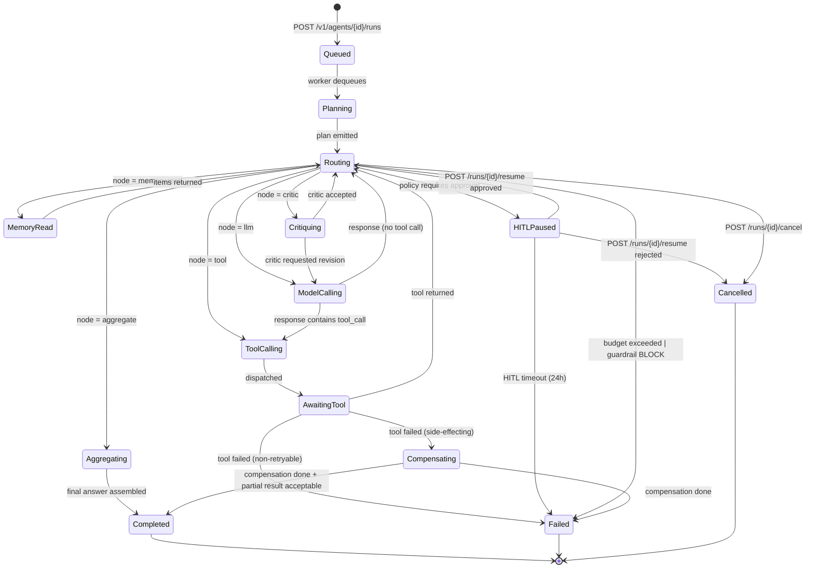

# 05 - Low-Level Design

Concrete implementation choices behind the contracts in `04-api-and-contracts.md` and the topology in `03-architecture.md`. Anchored on BlackBox DAG workflow engine with checkpointing (`resume.txt:53-54`) and Microsoft AutoML's 15M+ jobs/month orchestration (`resume.txt:90-92`).

---

## A. Service decomposition

| Service             | Language   | Runtime                                              | Key deps                                        | p99 latency target           |
| ------------------- | ---------- | ---------------------------------------------------- | ----------------------------------------------- | ---------------------------- |
| `Gateway`           | Go         | K8s Deployment (HPA on RPS)                          | Redis (rate limits), JWKS, OTel                 | 8 ms (excl. downstream)      |
| `OrchestratorAPI`   | TypeScript (NestJS) | K8s Deployment                              | Postgres, Redis, NATS                            | 35 ms                        |
| `CatalogAPI`        | Go (Gin)   | K8s Deployment                                       | Postgres, ClickHouse (install metrics)          | 25 ms                        |
| `AgentRuntime`      | Python (FastAPI + LangGraph) | K8s Deployment (sharded by `run_id` hash) | Postgres, Redis, NATS, gRPC siblings            | per-node 50 ms; run 60 s p99 |
| `Planner`           | Python     | In-process within AgentRuntime                       | ModelGateway                                    | 800 ms                       |
| `Router`            | Python     | In-process within AgentRuntime                       | ModelGateway                                    | 6 ms (rule-based hot path)   |
| `ToolCaller`        | Python     | In-process within AgentRuntime                       | ConnectorBroker, SkillExecutor                  | tool-dependent (5 s budget)  |
| `Critic`            | Python     | In-process within AgentRuntime                       | ModelGateway                                    | 1.2 s                        |
| `Aggregator`        | Python     | In-process within AgentRuntime                       | ModelGateway                                    | 1.5 s                        |
| `HITL`              | TypeScript (NestJS) | K8s Deployment                              | Postgres, push notif provider                   | 20 ms (request-side)         |
| `SkillExecutor`     | Rust (wasmtime host) | K8s Deployment + per-pod wasmtime pool      | S3 (bundles), Postgres (manifest)               | cold start 250 ms; warm 35 ms |
| `ConnectorBroker`   | Go         | K8s Deployment                                       | Postgres, Vault, Redis (RPS buckets)            | 40 ms (excl. upstream)       |
| `MemoryService`     | Go         | K8s StatefulSet (per-shard primary)                  | Postgres + pgvector, Redis                      | 25 ms read; 60 ms semantic   |
| `RAGService`        | Go         | K8s Deployment                                       | pgvector, OpenSearch (BM25), reranker pool      | 60 ms hybrid                 |
| `IngestionPipeline` | Python     | K8s Job (per ingestion) + Deployment (scheduler)     | S3, Postgres, pgvector, EmbedderTextV3          | per-doc 800 ms               |
| `ModelGateway`      | Go         | K8s Deployment (per-provider sidecar pool)           | Anthropic/OpenAI/xAI APIs, Redis (token meter)  | 150 ms (excl. provider)      |
| `GuardrailService`  | Python     | K8s Deployment                                       | Local rule engine + small classifier + ModelGateway escalation | 30 ms (rule); 250 ms (model) |
| `TelemetryMesh`     | Go (OTel Collector + Vector) | K8s DaemonSet (node-level) + Deployment (gateway) | Kafka -> ClickHouse, Loki, Tempo  | ingest 20 ms                 |

Sharding model: `AgentRuntime` and `MemoryService` use consistent-hash sharding on `(tenant_id, agent_id)` so a user's working memory and the runtime executing their run land on the same shard. Anchored on Microsoft's multi-tenant Kubernetes ML infra (`resume.txt:87-89`).

---

## B. AgentRuntime state machine



**Durable (checkpointed) states:** `Queued`, `Planning`, `Routing`, `AwaitingTool`, `HITLPaused`. On entry the runtime writes a `node.entered` event to `run_events` (section D) and a `run_checkpoints` row with the LangGraph state snapshot serialized as JSON. A crashed worker resumes by reading the latest checkpoint for the run.

**Ephemeral (in-memory only):** `ToolCalling`, `ModelCalling`, `MemoryRead`, `Critiquing`, `Aggregating`. These are short, retried freely.

**Compensating** runs reverse-side-effect handlers registered with each tool (e.g., `gmail.send_message` registers a `gmail.recall_message` compensator). Anchored on BlackBox durable, resumable agents with checkpointing and retry semantics (`resume.txt:53-54`, `blackbox-experience.md` points 13-16).

---

## C. Persistence schema (Postgres)

Postgres 16 with `pgvector`, `pg_partman` for time-based partitioning, `pgcrypto` for column encryption helpers.

```sql
-- Agents
CREATE TABLE agents (
  id                 UUID PRIMARY KEY,
  owner_user_id      UUID NOT NULL,
  tenant_id          UUID NOT NULL,
  name               TEXT NOT NULL,
  current_version    INT  NOT NULL DEFAULT 1,
  visibility         TEXT NOT NULL DEFAULT 'private', -- private | unlisted | catalog
  forked_from_id     UUID NULL REFERENCES agents(id),
  created_at         TIMESTAMPTZ NOT NULL DEFAULT now(),
  updated_at         TIMESTAMPTZ NOT NULL DEFAULT now(),
  deleted_at         TIMESTAMPTZ NULL
);
CREATE INDEX idx_agents_owner ON agents(owner_user_id) WHERE deleted_at IS NULL;
CREATE INDEX idx_agents_tenant ON agents(tenant_id) WHERE deleted_at IS NULL;

CREATE TABLE agent_versions (
  agent_id           UUID NOT NULL REFERENCES agents(id),
  version            INT  NOT NULL,
  persona            JSONB NOT NULL,
  connectors         JSONB NOT NULL,          -- [{type, connector_id}]
  skills             JSONB NOT NULL,          -- [skill_id]
  rag_sources        JSONB NOT NULL,
  memory_config      JSONB NOT NULL,
  guardrails         JSONB NOT NULL,
  created_at         TIMESTAMPTZ NOT NULL DEFAULT now(),
  PRIMARY KEY (agent_id, version)
);

-- Runs
CREATE TABLE runs (
  id                 UUID PRIMARY KEY,
  agent_id           UUID NOT NULL REFERENCES agents(id),
  agent_version      INT  NOT NULL,
  user_id            UUID NOT NULL,
  tenant_id          UUID NOT NULL,
  status             TEXT NOT NULL,           -- queued | running | hitl_paused | completed | failed | cancelled
  current_node_id    TEXT,
  budget             JSONB NOT NULL,
  usage              JSONB NOT NULL DEFAULT '{}'::jsonb,
  shard_key          INT  NOT NULL,           -- hash(agent_id, run_id) % N
  created_at         TIMESTAMPTZ NOT NULL DEFAULT now(),
  started_at         TIMESTAMPTZ,
  finished_at        TIMESTAMPTZ
) PARTITION BY HASH (id);
-- 32 partitions
CREATE INDEX idx_runs_user_active ON runs(user_id, status) WHERE status IN ('queued','running','hitl_paused');
CREATE INDEX idx_runs_agent_created ON runs(agent_id, created_at DESC);

-- Run event log (see section D)
CREATE TABLE run_events (
  run_id             UUID NOT NULL,
  seq                BIGINT NOT NULL,
  node_id            TEXT,
  event_type         TEXT NOT NULL,
  payload            JSONB NOT NULL,
  parent_event_id    BIGINT NULL,
  ts                 TIMESTAMPTZ NOT NULL DEFAULT now(),
  PRIMARY KEY (run_id, seq)
) PARTITION BY HASH (run_id);
-- 64 partitions, monthly archival to S3 + ClickHouse for trace search

CREATE TABLE run_checkpoints (
  run_id             UUID PRIMARY KEY REFERENCES runs(id),
  seq                BIGINT NOT NULL,
  graph_state        JSONB NOT NULL,           -- LangGraph state snapshot
  updated_at         TIMESTAMPTZ NOT NULL DEFAULT now()
);

-- Connectors
CREATE TABLE connectors (
  id                 UUID PRIMARY KEY,
  owner_user_id      UUID NOT NULL,
  tenant_id          UUID NOT NULL,
  type               TEXT NOT NULL,            -- oauth | mcp
  provider           TEXT,                     -- gmail | slack | github | notion | gdrive
  display_name       TEXT NOT NULL,
  scopes             TEXT[] NOT NULL DEFAULT '{}',
  created_at         TIMESTAMPTZ NOT NULL DEFAULT now(),
  revoked_at         TIMESTAMPTZ NULL
);
CREATE INDEX idx_connectors_owner ON connectors(owner_user_id) WHERE revoked_at IS NULL;

CREATE TABLE oauth_tokens (
  connector_id       UUID PRIMARY KEY REFERENCES connectors(id),
  -- access_token and refresh_token are ENCRYPTED via Vault transit engine (see section E)
  access_token_ct    BYTEA NOT NULL,           -- ciphertext blob from Vault
  refresh_token_ct   BYTEA NOT NULL,
  vault_key_version  INT   NOT NULL,
  access_expires_at  TIMESTAMPTZ NOT NULL,
  scope_grant        TEXT[] NOT NULL,
  updated_at         TIMESTAMPTZ NOT NULL DEFAULT now()
);

CREATE TABLE mcp_endpoints (
  id                 UUID PRIMARY KEY,
  owner_user_id      UUID NOT NULL,
  tenant_id          UUID NOT NULL,
  url                TEXT NOT NULL,
  auth_kind          TEXT NOT NULL,            -- none | bearer | oauth
  auth_secret_ref    TEXT,                     -- Vault path
  capabilities       JSONB NOT NULL DEFAULT '[]'::jsonb,  -- cached tools/list
  last_discovered_at TIMESTAMPTZ
);

-- Skills
CREATE TABLE skills (
  id                 UUID PRIMARY KEY,
  owner_user_id      UUID NOT NULL,
  tenant_id          UUID NOT NULL,
  name               TEXT NOT NULL,
  current_version    INT  NOT NULL DEFAULT 1,
  created_at         TIMESTAMPTZ NOT NULL DEFAULT now()
);

CREATE TABLE skill_versions (
  skill_id           UUID NOT NULL REFERENCES skills(id),
  version            INT  NOT NULL,
  manifest           JSONB NOT NULL,            -- parsed SKILL.md frontmatter
  bundle_sha256      TEXT NOT NULL,
  bundle_s3_url      TEXT NOT NULL,
  wasm_artifact_url  TEXT,                      -- AOT-compiled wasmtime artifact
  caps_default       JSONB NOT NULL,            -- ExecutionCaps proto serialized
  created_at         TIMESTAMPTZ NOT NULL DEFAULT now(),
  PRIMARY KEY (skill_id, version)
);

-- RAG
CREATE TABLE rag_sources (
  id                 UUID PRIMARY KEY,
  owner_user_id      UUID NOT NULL,
  tenant_id          UUID NOT NULL,
  name               TEXT NOT NULL,
  kind               TEXT NOT NULL,             -- upload | url_crawl | s3_prefix
  config             JSONB NOT NULL,
  embedder           TEXT NOT NULL,             -- 'EmbedderTextV3'
  status             TEXT NOT NULL,             -- ingesting | ready | error
  reindex_schedule   TEXT
);

CREATE TABLE rag_documents (
  id                 UUID PRIMARY KEY,
  corpus_id          UUID NOT NULL REFERENCES rag_sources(id),
  external_id        TEXT,
  uri                TEXT NOT NULL,
  content_sha256     TEXT NOT NULL,
  chunk_count        INT  NOT NULL,
  meta               JSONB NOT NULL DEFAULT '{}'::jsonb,
  ingested_at        TIMESTAMPTZ NOT NULL DEFAULT now(),
  UNIQUE (corpus_id, content_sha256)
);
CREATE INDEX idx_rag_documents_corpus ON rag_documents(corpus_id);

-- Vectors live in pgvector
CREATE TABLE rag_chunks (
  id                 UUID PRIMARY KEY,
  document_id        UUID NOT NULL REFERENCES rag_documents(id),
  corpus_id          UUID NOT NULL,
  ord                INT  NOT NULL,
  content            TEXT NOT NULL,
  embedding          vector(1024) NOT NULL,     -- EmbedderTextV3 dim
  meta               JSONB NOT NULL DEFAULT '{}'::jsonb
);
CREATE INDEX idx_rag_chunks_hnsw
  ON rag_chunks USING hnsw (embedding vector_cosine_ops)
  WITH (m = 16, ef_construction = 64);
CREATE INDEX idx_rag_chunks_corpus ON rag_chunks(corpus_id);

-- Idempotency
CREATE TABLE idempotency_keys (
  user_id            UUID NOT NULL,
  route              TEXT NOT NULL,
  fingerprint        BYTEA NOT NULL,            -- sha256(key || canonical_body)
  response_status    INT  NOT NULL,
  response_body      JSONB NOT NULL,
  created_at         TIMESTAMPTZ NOT NULL DEFAULT now(),
  expires_at         TIMESTAMPTZ NOT NULL,
  PRIMARY KEY (user_id, route, fingerprint)
);
CREATE INDEX idx_idem_expires ON idempotency_keys(expires_at);

-- HITL
CREATE TABLE hitl_requests (
  id                 UUID PRIMARY KEY,
  run_id             UUID NOT NULL REFERENCES runs(id),
  node_id            TEXT NOT NULL,
  prompt             TEXT NOT NULL,
  proposed_action    JSONB NOT NULL,
  status             TEXT NOT NULL,             -- pending | approved | rejected | timed_out
  decided_by         UUID,
  decided_at         TIMESTAMPTZ,
  expires_at         TIMESTAMPTZ NOT NULL
);
CREATE INDEX idx_hitl_pending ON hitl_requests(status) WHERE status = 'pending';
```

Heavy-query indexes:
- `runs(user_id, status)` partial-index for "show me my running agents" dashboard.
- `run_events(run_id, seq)` covering index for replay (every read is by `run_id` + `seq` range).
- `rag_chunks` HNSW with `(m=16, ef_construction=64)` - chosen to mirror BlackBox's HNSW config (`resume.txt:60-61`).
- `idempotency_keys(expires_at)` for the TTL sweeper.

---

## D. Run event log model

`run_events` is an **append-only**, monotonic-`seq` log per run. Every node entry, tool call, memory access, model invocation, guardrail decision, and HITL transition writes a row. Used for:

1. **Deterministic replay** - a run can be replayed by re-applying events to the LangGraph state machine, with all stochastic decisions (model outputs, tool results) sourced from the log instead of being re-issued. Anchored on `resume.txt:58-59` (50M spans/day, 2.5TB monthly traces, deterministic replay, 60% MTTR drop) and `blackbox-experience.md` point 20.
2. **SSE stream resume** - clients reconnect with `Last-Event-ID: <seq>` and we replay events from the log.
3. **HITL resume** - `HITLPaused` reads the last `node.entered` checkpoint and continues.
4. **Audit and incident review** - the structured log is the source of truth for what an agent did and why.

Event row shape:

```json
{
  "run_id": "run_01HX...",
  "seq": 47,
  "node_id": "toolcaller",
  "event_type": "tool.returned",
  "ts": "2026-05-27T11:10:08.456Z",
  "parent_event_id": 46,
  "payload": {
    "tool_name": "gmail.search",
    "latency_ms": 312,
    "result_sha256": "9c1a...",
    "result_size_bytes": 4812,
    "redacted_keys": ["headers.Authorization"]
  }
}
```

Tool results larger than 16 KB are stored in S3 (`s3://run-blobs/<run_id>/<seq>.json.gz`), and `payload.result_ref` holds the S3 key. This keeps Postgres rows small but preserves replayability.

Partitioning is hash by `run_id` (64 partitions). Rows older than 90 days are tiered out to ClickHouse for cheap long-range search (anchored on `resume.txt:60-61` ClickHouse + OTel stack).

---

## E. Connector token vault

Two options were on the table:

| Option                              | Pros                                                                                  | Cons                                                                       |
| ----------------------------------- | ------------------------------------------------------------------------------------- | -------------------------------------------------------------------------- |
| AWS KMS-encrypted Postgres column   | Cheap, simple, single backup story, low latency (decrypt at row read)                 | KMS audit logs are coarse-grained; rotating a CMK requires re-encrypting every row; the application sees plaintext often |
| HashiCorp Vault transit engine      | Per-tenant DEKs derived from a CMK; fine-grained audit per encrypt/decrypt call; key versions tracked in the ciphertext; convergent encryption optional; revocation via key disable | Extra hop (~2 ms); operational cost of running Vault HA                    |

**Pick: Vault transit engine.** Rationale: SOC-2 (anchored on `resume.txt:49-50` and `blackbox-experience.md` point 5) wants fine-grained audit on every secret access; per-tenant key isolation is a real defense-in-depth boundary; rotation is rolling, not stop-the-world. The `~2 ms` overhead is irrelevant next to the OAuth provider RTT.

Design:

```
ConnectorBroker --(VaultClient)--> Vault
    transit/encrypt/tenant_<tenant_id>:  plaintext -> ciphertext
    transit/decrypt/tenant_<tenant_id>:  ciphertext -> plaintext
Postgres oauth_tokens.{access_token_ct, refresh_token_ct, vault_key_version}
```

Per-tenant key: `transit/keys/tenant_<tenant_id>`, created on tenant onboarding, derived from a Vault-internal CMK that is sealed with auto-unseal (KMS or HSM). The application never sees the CMK.

**Token refresh worker:** A `oauth_refresher` deployment scans `oauth_tokens` every 60 s for rows with `access_expires_at < now() + 5 min AND revoked_at IS NULL`. For each:

1. `Vault.decrypt(refresh_token_ct, tenant_id)` -> refresh token.
2. POST to the provider's token endpoint.
3. `Vault.encrypt(new_access_token, tenant_id)`, write back with bumped `vault_key_version` and new `access_expires_at`.
4. Emit OTel span `connector.oauth.refresh` with `outcome` label.

The worker is sharded by `connector_id` hash so concurrent refreshers can't fight for the same row; per-row advisory locks (`pg_try_advisory_xact_lock(hashtext(connector_id::text))`) serialize within a shard.

---

## F. Skill execution contract

Skills follow Claude-skills syntax. A skill bundle is a tarball:

```
my-skill/
  SKILL.md
  scripts/
    parse.py
    helpers/
      __init__.py
      regex.py
```

`SKILL.md` frontmatter (YAML, parsed and validated against a JSON Schema):

```markdown
---
name: stripe-receipts
description: Parse Stripe email receipts into structured rows
version: 1.0.0
allowed-tools:
  - gmail.search
  - gmail.get_message
scripts:
  - scripts/parse.py
runtime: python-wasi-3.12
entry: scripts/parse.py:main
caps:
  cpu_ms_limit: 5000
  memory_mb_limit: 128
  stdout_kb_limit: 256
  allow_network: false
  allow_filesystem: false
  env_allowlist: []
---

# Stripe Receipts skill

This skill reads Stripe receipt emails from the user's Gmail inbox and emits
structured rows: `{date, amount, currency, merchant, charge_id}`.
```

**Upload flow:**

1. `POST /v1/skills` (multipart, `manifest` + `bundle`).
2. OrchestratorAPI validates manifest against schema → 400 on failure.
3. Bundle SHA-256 hashed, uploaded to `s3://skills/<skill_id>/v<n>.tgz`.
4. SkillExecutor's AOT compiler subscribes to a NATS topic `skill.uploaded`; compiles the Python entrypoint + dependencies into a wasmtime module via `wasi-python`; uploads to `s3://skills/<skill_id>/v<n>.wasm`; updates `skill_versions.wasm_artifact_url`.
5. Skill is `compiled: true` and available for use.

**Execution flow (per call):**

1. AgentRuntime → `SkillExecutor.Execute(skill_id, version, input, caps)`.
2. SkillExecutor picks (or warms) a wasmtime instance from its per-skill pool. Pool size auto-tunes; cold start ~250 ms, warm reuse ~35 ms.
3. Instance is initialized with **capability-gated host functions** matching `caps`:
   - Network: default deny. If `allow_hosts` is set, only those hosts are reachable, routed via an HTTPS egress proxy that enforces allowlist + records OTel spans.
   - Filesystem: default deny. If `allow_filesystem` is true, mounts an ephemeral tmpfs at `/work` only.
   - Env vars: only those in `env_allowlist` are exposed.
   - Tool calls (`gmail.search`, etc.): host function dispatches via gRPC back to `ConnectorBroker.InvokeTool`, scoped to the run's tenant and user. Tools not in the skill's `allowed-tools` are rejected with `SKILL_DISALLOWED_TOOL`.
4. CPU and memory caps enforced by wasmtime's metering; wall-clock by a watchdog goroutine in SkillExecutor.
5. Final stdout line is expected to be a single JSON object - that becomes `ExitResult.result`.

This is the same isolation model BlackBox used at 1M+ daily zero-shot executions (`resume.txt:49-50`, `blackbox-experience.md` points 3-6) - WASM is cheaper to spawn than Firecracker microVMs at that scale, with the tradeoff that the syscall surface is whatever we ourselves expose as host functions (so the surface is small by construction).

---

## G. Persona and prompt assembly pipeline

Every call into `ModelGateway` from `Planner`, `Router`, `ModelCalling`, `Critic`, or `Aggregator` first runs through the prompt assembler. The assembler is deterministic given its inputs - it never reaches out to providers, so it's freely re-runnable during replay.

```
1. Load persona system prompt + persona traits
       --> from agent_versions.persona
2. Load memories
       --> MemoryService.Read(WORKING)         (recent N=20 turns)
       --> MemoryService.SemanticSearch(query=last_user_message, top_k=6)
       --> MemoryService.EpisodicLoad(top_k=4) (recent run summaries)
       --> MemoryService.ProceduralLookup()    (learned tool sequences)
3. Load RAG retrievals (only if the agent has rag_sources AND the planner chose to retrieve)
       --> RAGService.Query(corpus_id, query, top_k=8, mode=HYBRID_RRF)
       --> Optional cross-encoder re-rank (top 8 -> top 4)
4. Load tool descriptions
       --> ConnectorBroker.ListCapabilities()
       --> Skill manifests for skills attached to this agent
       --> Filter by guardrail policy (e.g., remove gmail.send if persona forbids)
5. Assemble final context with token budget
       budget = ModelGateway.context_window_for(model)
         system + persona ........... 2K tokens
         memory_block .............. up to 6K tokens, ranked-trimmed
         rag_block ................. up to 4K tokens, ranked-trimmed
         tool_defs ................. up to 2K tokens (truncate descriptions)
         conversation tail ......... remaining budget, oldest dropped first
6. Pass to ModelGateway
```

Token budgeting is enforced before send; oversize blocks are summarized via a cheap secondary model call (mini Sonnet / 4o-mini), and the summarization itself is logged as a `model.token` event for replay. Anchored on BlackBox context optimization at 1B+ tokens/month (`resume.txt:55-56`, `blackbox-experience.md` points 18-19) and Microsoft AutoML SDK+UI consistent backend behavior (`resume.txt:90-92`).

---

## H. Tool routing / capability registry

The agent's prompt sees a flat list of tools by name. Behind the curtain, the **capability registry** maps each `tool_name` to one of four kinds. The registry is in-memory in each `AgentRuntime` pod, hydrated from Postgres at run start.

```
tool_name -> {
   kind: "mcp" | "oauth_connector" | "skill" | "builtin",
   target: { ... kind-specific descriptor ... }
}
```

| kind             | target shape                                                                                                    | Example                                                          |
| ---------------- | --------------------------------------------------------------------------------------------------------------- | ---------------------------------------------------------------- |
| `mcp`            | `{ endpoint_id, rpc_name }`                                                                                     | `jira.search_issues` -> `mcp_01HX.../tools/jira.search_issues`   |
| `oauth_connector`| `{ connector_id, provider, method }`                                                                            | `gmail.search` -> `{provider:"gmail", method:"users.messages.list"}` |
| `skill`          | `{ skill_id, version, input_schema }`                                                                           | `parse_stripe_receipts` -> `{skill_id:..., version:1}`           |
| `builtin`        | `{ method }`                                                                                                    | `search` (RAG), `now`, `math.eval`                               |

Per-invocation flow inside `ToolCaller`:

```python
def call(tool_name, args, run_ctx):
    entry = registry[tool_name]
    GuardrailService.CheckToolCall(run_ctx, tool_name, args)  # may BLOCK or REQUIRE_HITL
    idem_key = sha256(run_ctx.run_id || run_ctx.node_id || tool_name || canonical(args))

    if entry.kind == "mcp" or entry.kind == "oauth_connector":
        return ConnectorBroker.InvokeTool(
            tool_name=tool_name, args=args, idempotency_key=idem_key, ...
        )
    if entry.kind == "skill":
        return SkillExecutor.Execute(
            skill_id=entry.target.skill_id, version=entry.target.version,
            input=args, caps=load_caps(entry), run_ctx=run_ctx,
        )
    if entry.kind == "builtin" and entry.target.method == "search":
        return RAGService.Query(corpus_id=args.corpus_id, query=args.query, top_k=args.top_k, ...)
```

Conflict resolution: two attached connectors both expose `search` → the registry namespaces by binding prefix (`search_company_docs`, `gmail.search`) so the model sees unambiguous names.

---

## I. Catalog data model

```sql
CREATE TABLE catalog_listings (
  agent_id           UUID PRIMARY KEY REFERENCES agents(id),
  title              TEXT NOT NULL,
  description        TEXT NOT NULL,
  category           TEXT NOT NULL,
  tags               TEXT[] NOT NULL DEFAULT '{}',
  install_count      BIGINT NOT NULL DEFAULT 0,
  rating_avg         NUMERIC(3,2) NOT NULL DEFAULT 0,
  rating_count       INT  NOT NULL DEFAULT 0,
  owner_user_id      UUID NOT NULL,
  visibility         TEXT NOT NULL DEFAULT 'public', -- public | unlisted
  published_at       TIMESTAMPTZ NOT NULL DEFAULT now(),
  updated_at         TIMESTAMPTZ NOT NULL DEFAULT now()
);
CREATE INDEX idx_catalog_category ON catalog_listings(category, install_count DESC);
CREATE INDEX idx_catalog_tags     ON catalog_listings USING GIN(tags);
CREATE INDEX idx_catalog_fulltext ON catalog_listings USING GIN(to_tsvector('english', title || ' ' || description));

CREATE TABLE catalog_installs (
  user_id            UUID NOT NULL,
  agent_id           UUID NOT NULL REFERENCES catalog_listings(agent_id),
  installed_at       TIMESTAMPTZ NOT NULL DEFAULT now(),
  PRIMARY KEY (user_id, agent_id)
);

CREATE TABLE catalog_ratings (
  user_id            UUID NOT NULL,
  agent_id           UUID NOT NULL,
  stars              SMALLINT NOT NULL CHECK (stars BETWEEN 1 AND 5),
  comment            TEXT,
  created_at         TIMESTAMPTZ NOT NULL DEFAULT now(),
  PRIMARY KEY (user_id, agent_id)
);
```

**Fork semantics:** `POST /v1/agents/{id}/fork` inserts a new `agents` row with `forked_from_id = <source_id>` and copies the latest `agent_versions` row as version 1 of the new agent. Connector references that are OAuth-backed are dropped (the forker can't inherit the original owner's Gmail). MCP endpoint references survive only if they're public; private ones are dropped with a warning in the response payload. Skill references survive (skills are immutable bundles). RAG source references survive only if the source visibility is `public`.

**Trending and discovery:** `install_count` is bumped via a debounced upsert; the actual `catalog_installs` insert is the authority. A nightly ClickHouse job computes 7-day trending using time-decayed install velocity, written back to `catalog_listings.trending_score`. Anchored on the ShareChat 22-attribute segmentation pattern (`resume.txt:111-114`) - the same kind of feature pipeline applies to surfacing the right catalog agent to the right user.

---

## J. Backpressure and queue model

Run requests do not synchronously enter `AgentRuntime`. They flow through a queue.

```
POST /v1/agents/{id}/runs
   -> OrchestratorAPI validates + writes runs row (status = queued)
   -> publishes RunStart message to NATS JetStream subject runs.shard.<shard_key>
   -> AgentRuntime worker pool consumes from its assigned shard
```

**Queue choice:** NATS JetStream. RabbitMQ was the alternative; NATS won on operational simplicity (no Erlang, no quorum queues to babysit) and on per-subject sharding semantics that map cleanly onto the consistent-hash shard key. Redis Streams was considered but lacks the durability guarantees we need for crashed-worker resumption.

**Token-bucket pre-dequeue check:**

```
worker_loop:
  msg = jetstream.fetch(subject="runs.shard.<my_shard>", batch=8)
  for m in msg:
    user = m.headers["user_id"]
    if not RateLimiter.allow(user, key="runs_per_min"):
      m.nak(delay=jittered_backoff())
      continue
    if not TokenBudget.try_reserve(user, key="tokens_daily", amount=m.headers["budget.max_tokens"]):
      m.term()  # publish run.failed with QUOTA_TOKENS_DAILY_EXCEEDED
      continue
    process(m)
```

**Backpressure thresholds (per shard):**

| Metric                                 | Soft (warn + slow accept) | Hard (return 429)       |
| -------------------------------------- | ------------------------- | ----------------------- |
| Queue depth                            | 500                       | 2,000                   |
| Worker saturation (in-flight / pool)   | 80%                       | 100%                    |
| p95 dequeue-to-start latency           | 5 s                       | 30 s                    |

When **any** hard threshold trips, the Gateway returns `INTERNAL_QUEUE_FULL` with `retry_after_ms` drawn from a backoff schedule (1s, 2s, 5s, 10s, 30s; jittered ±30%). When **soft**, requests are still accepted but the Gateway adds `Retry-After-Hint` and slow-paths low-priority traffic (free-tier, non-interactive webhooks) first.

Cancellation: `POST /v1/runs/{id}/cancel` writes a flag into `runs.status = cancelling`; the worker checks the flag at each node transition (cheap) and at every tool boundary (mandatory). On hit, the runtime enters `Cancelled` (or `Compensating` first if mid-tool with side effects).

Anchored on Microsoft AutoML backpressure at 15M+ jobs/month and queue+priority discipline (`microsoft-experience.md` points 27, 21-22; `resume.txt:90-92`) and BlackBox durable execution with retries (`resume.txt:53-54`, `blackbox-experience.md` points 13-15). The same "queue-then-worker, idempotent per-message, side-effect-safe retries" pattern that worked at 15M jobs/month maps directly onto this B2C runtime, with shard fanout tuned for the much smaller per-run footprint.
