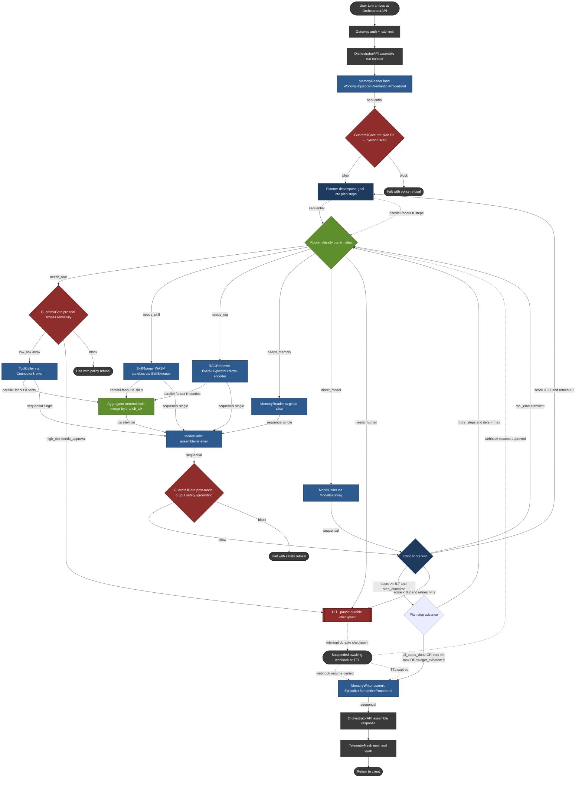

# 12 - Agentic Graph Structure (Two-Layer Deep-Dive)

## Layer 1 - Graph Topology


### 1.1 Full Mermaid diagram



### 1.2 Supervisor / worker hierarchy

The hierarchy is **two-tier with one gate plane**:

```
                ┌───────────── Planner (supervisor) ─────────────┐
                │                                                │
                ▼                                                ▼
            Router (dispatcher)                            Critic (scorer)
                │                                                ▲
   ┌────────┬───┴────┬─────────┬──────────┐                      │
   ▼        ▼        ▼         ▼          ▼                      │
ToolCaller SkillRunner RAGRetriever MemoryReader ModelCaller ────┘
   │        │        │         │
   └────────┴────┬───┴─────────┘
                ▼
            Aggregator (parallel-join)
                │
                ▼
            MemoryWriter (commit)

  Gate plane (orthogonal): GuardrailGate, HITL - can interpose on any edge.
```

- **Supervisor:** `Planner`. It is the only node allowed to mutate the `plan`
  array. It owns the loop counter and the re-plan decision.
- **Co-supervisor:** `Critic`. It cannot edit the plan but it can force a
  jump back to `Planner` (replan) or to `Router` (retry same step) by setting
  `retry_recommended` and `next_node`. Splitting "plan" from "score" prevents
  the classic ReAct failure mode where the same model both proposes and judges
  its own work without a checkpoint between them.
- **Workers:** `ToolCaller`, `SkillRunner`, `RAGRetriever`, `MemoryReader`,
  `ModelCaller`. Each worker is **stateless across runs** and gets all of its
  input from the checkpoint, so a worker pod can die mid-step and another can
  pick up from the last write.
- **Joiner:** `Aggregator`. Only runs after a parallel-fanout. Pure function
  of `fanout_results[]`.
- **Gate plane:** `GuardrailGate` and `HITL`. These are not in the linear
  flow; they are interposed on edges by the runtime engine based on policy.
  This is why a single `GuardrailGate` node appears in three positions in the
  diagram - it is the **same node type** instantiated at three policy hooks
  (pre-plan, pre-tool, post-model).

### 1.3 Design intent

The `AgentRuntime` graph is a **ReAct-style supervisor / worker DAG** with
durable checkpointing on every node boundary. It is not a pure linear chain
and not a free-form swarm. The shape is dictated by four hard constraints from
the BlackBox experience:

1. **Durable, resumable** runs that survive worker crashes, deploys, and HITL
   pauses (`resume.txt:53-54`; `blackbox-experience.md` point 13).
2. **Tool-calling with side effects** that must be idempotent and replayable
   (`blackbox-experience.md` points 11, 15).
3. **Multi-model routing** at the model-call boundary, not at the request
   boundary, so a single run can mix Claude / GPT / Grok per step
   (`resume.txt:55-56`).
4. **Memory persistence across sessions** (`blackbox-experience.md` point 12),
   which forces explicit `MemoryReader` and `MemoryWriter` nodes around the
   reasoning loop instead of implicit context stuffing.

The result is a supervisor (`Planner`) that emits a plan; a `Router` that
dispatches each step to one of four worker classes (`ToolCaller`,
`SkillRunner`, `RAGRetriever`, `MemoryReader`); a `ModelCaller` that runs the
LLM turn; a `Critic` that scores the turn and decides whether to loop; an
`Aggregator` that merges parallel fan-outs; a `MemoryWriter` that commits
durable state; and two safety nodes (`GuardrailGate`, `HITL`) that gate
high-risk transitions.

### 1.4 Node type taxonomy

Every node in the runtime is exactly one of the 12 types below. The "state
shape" column lists the fields the node **owns** in the checkpoint - i.e. it is
the canonical writer. Other nodes may read these fields but only the owner
writes them, which is what makes deterministic replay tractable
(`blackbox-experience.md` point 15).

| # | Node | Class | Role | State it writes | State it reads |
|---|---|---|---|---|---|
| 1 | `Planner` | Supervisor | Decomposes user goal into an ordered/partial-ordered step list. Re-plans on critic failure. | `plan`, `plan_version`, `current_step_idx` | `user_goal`, `persona`, `working_memory`, `critic_feedback` |
| 2 | `Router` | Dispatcher | For the current step, decides which worker class handles it (tool vs skill vs RAG vs memory vs direct model). | `route_decision`, `route_reason` | `plan[current_step_idx]`, `persona.allowed_tools`, `budget` |
| 3 | `ToolCaller` | Worker | Invokes a connector (MCP / OAuth) through `ConnectorBroker`. Owns idempotency keys and the outbox pattern. | `tool_calls[]`, `tool_results[]`, `idempotency_keys[]` | `route_decision`, `persona.connectors`, `working_memory` |
| 4 | `SkillRunner` | Worker | Executes a Claude-skill bundle inside the WASM sandbox via `SkillExecutor`. | `skill_invocations[]`, `skill_outputs[]`, `sandbox_session_id` | `route_decision`, `persona.skills`, `working_memory` |
| 5 | `RAGRetriever` | Worker | Hybrid retrieval (BM25 + Pgvector HNSW + cross-encoder rerank) against the persona's knowledge corpus via `RAGService`. | `retrieved_chunks[]`, `retrieval_query`, `retrieval_scores[]` | `route_decision`, `persona.kb_id`, `query_rewrite` |
| 6 | `MemoryReader` | Worker | Loads relevant Working / Episodic / Semantic / Procedural memory slices via `MemoryService`. | `memory_snapshot`, `memory_provenance[]` | `user_id`, `persona.id`, `current_step_idx` |
| 7 | `ModelCaller` | Worker | Single LLM turn against the model selected by `ModelGateway`. Holds the chat-completion contract. | `messages[]`, `tokens_in`, `tokens_out`, `model_id`, `finish_reason` | `prompt_assembly`, `tool_results[]`, `retrieved_chunks[]`, `memory_snapshot` |
| 8 | `Critic` | Supervisor | Scores the latest model output against the plan step (groundedness, tool-arg validity, safety, refusal correctness). | `critic_score`, `critic_feedback`, `retry_recommended` | `messages[-1]`, `plan[current_step_idx]`, `retrieved_chunks[]` |
| 9 | `Aggregator` | Joiner | Merges results from a parallel fan-out (multi-tool, multi-RAG, multi-model) into a single deterministic record. | `aggregated_result`, `aggregation_strategy` | `fanout_results[]` |
| 10 | `MemoryWriter` | Worker | Commits durable updates to Episodic / Semantic / Procedural memory at end-of-turn or end-of-run. | `memory_writes[]`, `memory_commit_id` | `messages[]`, `tool_results[]`, `critic_score` |
| 11 | `HITL` | Gate | Pauses the run on a durable checkpoint, surfaces an approval card to the user, and waits for webhook resume. | `hitl_pause_token`, `hitl_question`, `hitl_resume_at`, `hitl_decision` | `route_decision`, `tool_calls[]`, `policy_flags[]` |
| 12 | `GuardrailGate` | Gate | Pre- and post-call policy checks via `GuardrailService` (PII, prompt-injection, persona-scope, connector-scope). | `policy_flags[]`, `guardrail_action` | every other field as needed |

Two structural rules follow from this taxonomy:

- **No node both reads and writes the same field** except `Planner` (which may
  re-write `plan` on replan). This is what makes a checkpoint commutative under
  retry - replaying a node N times yields the same write, because its inputs
  are immutable from its perspective.
- **`GuardrailGate` is not on a single edge.** It is a node that any other
  edge can route through; in the diagram below it appears at three positions
  (pre-route, pre-tool, post-model). This matches the BlackBox guardrail
  posture in `15-guardrails.md`.

### 1.5 Edge type taxonomy

LangGraph edges in this runtime come in five flavors. The runtime engine
(`resume.txt:53-54`) treats each flavor as a distinct checkpoint barrier:

| Edge type | When it fires | Checkpoint behavior |
|---|---|---|
| **Sequential** | The default. Node A finishes → node B starts. | One checkpoint write at the boundary; replay-safe. |
| **Conditional** | A router predicate (`Router`, `Critic`, `GuardrailGate`, `Planner`) returns one of N labels and we jump to the matching successor. | Checkpoint stores the predicate **inputs and label** so replay is deterministic even if the predicate is stochastic. |
| **Parallel-fanout** | `Router` or `Planner` decides this step has K independent sub-steps (e.g. three tool calls, two RAG queries). The engine launches K node instances. | Each fan-out branch gets its own sub-checkpoint keyed by `(run_id, step_idx, branch_idx)`. |
| **Parallel-join** | An `Aggregator` waits for all K branches to checkpoint. | Join is **deterministic by sort key** (`branch_idx` asc) so the merged record is stable across replays. Partial joins are allowed only if `aggregation_strategy = "best-effort"` and `min_quorum` is met. |
| **Interrupt/Resume** | `HITL` or a long-running async tool emits a pause; the run is suspended and a `resume_token` is durably stored. A webhook (or TTL expiry) wakes it. | Checkpoint is the **wake contract**: it stores the token, the wake URL, the TTL, and the exact state to resume from. Without this, HITL is just a sleep loop. |

A run is a **DAG of these edges**, not a strict tree, because the
`Planner → Router → Worker → ModelCaller → Critic → Planner` loop forms a
controlled cycle. The cycle is bounded by `max_iterations` (default 12 for B2C
runs, tunable per persona) and by a budget node that aborts when `tokens_in +
tokens_out` crosses the persona's per-run cap.
