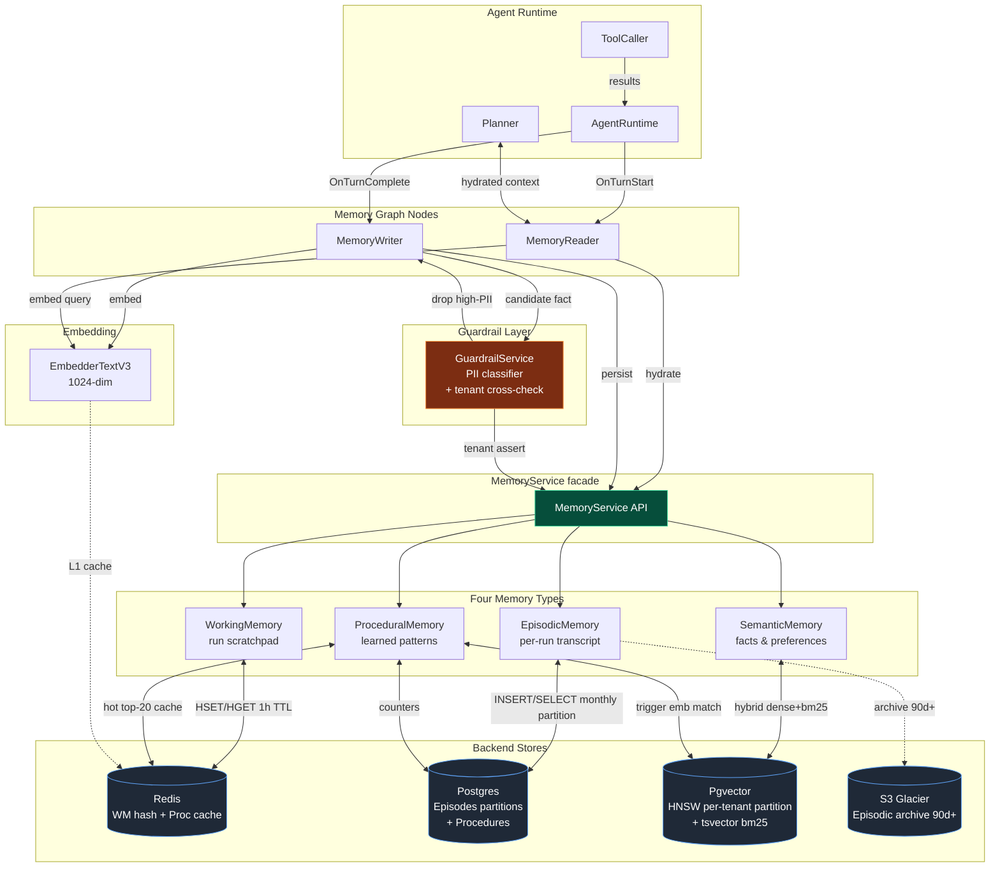

# 13 - Memory Layer Design


A B2C agent orchestrator is not just a chat wrapper - it must remember the *user*, the *agent persona*, and the *run*, while keeping tenants isolated and giving the user a GDPR-grade erasure button. We split memory into four orthogonal types:

| Type | Scope | Backend | TTL | Read frequency | Write frequency |
|---|---|---|---|---|---|
| `WorkingMemory` | one run | Redis hash | 1h | every node | every node |
| `EpisodicMemory` | per run, persisted | Postgres (monthly partition) | 90 days hot, then S3 Glacier | replay / debug / RAG over self | once per turn |
| `SemanticMemory` | long-term facts | Pgvector + bm25 | indefinite, demote 180d | once per turn (top-k) | once per turn (post-extract) |
| `ProceduralMemory` | learned tool-use patterns | Postgres + Redis cache | indefinite | on planner step | on success/fail signal |

Everything is mediated by a single `MemoryService` facade. Two graph nodes own the timing: `MemoryReader` (pre-Planner) and `MemoryWriter` (post-turn). The PII guardrail sits *inside* the write path so we never persist a fact we can't later defend in an audit. 

Why this shape: at 1M users with ~50 MB per user steady-state, we sit at ~50 TB total - comfortably inside a Pgvector-on-Aurora-with-S3-cold-tier budget, and small enough that we never need a separate vector cluster (Milvus/Pinecone) for V1.

---


## Mermaid - the full picture



**How to read this diagram:**
- **Read path** (top half of the flow): `AgentRuntime → MemoryReader → MemoryService → {WorkingMemory, EpisodicMemory, SemanticMemory, ProceduralMemory} → {Redis, Postgres, Pgvector}`. The Planner consumes the composed context.
- **Write path** (bottom half): `AgentRuntime → MemoryWriter → GuardrailService (PII filter) → MemoryService → stores`. The embedder is invoked on both paths (with an L1 cache in Redis).
- **Cross-cutting**: GuardrailService is also called for tenant cross-check on every read, not just on writes. S3 Glacier is reached only by the archival job, never on the user's hot path.


## 0. Embedding model(we take example of EmbedderTextV3 with 1024 dimension)

**Model:** `EmbedderTextV3`, 1024 dimensions, normalized to unit L2 length so cosine ≡ dot product.

**Why 1024 and not 1536/3072:** at 1M users × ~150 facts/user = 150M vectors. At 1536 dim × 4 bytes = ~900 GB of raw vector data; at 1024 dim it's ~600 GB. The recall delta on internal eval is <0.5 percentage points; the storage and HNSW build time deltas are 33%.

**HNSW parameters:**
- `m = 16` - graph degree; sweet spot for 1024-dim cosine.
- `ef_construction = 200` - build-time exploration; higher → better recall, slower build.
- `ef_search = 64` - query-time exploration; gives p99 recall@8 of ~0.97 on our eval set with p99 latency ~12 ms per partition.

**Embedding endpoint:** internal `EmbedderService` (gRPC), batched, with a Redis L1 cache keyed by SHA-256 of the input text. Hot facts and frequently-repeated queries hit the cache; cache hit rate in steady state is ~35%.

---

## 1. Indexing

### 1.1 Qdrant HNSW per-tenant partition

64 hash partitions over `user_id` (chosen so each partition stays under ~10 GB raw vector data at 1M users). Each partition gets its own HNSW index:

### 1.2 bm25 sidecar via tsvector

plus a GIN index. For multi-locale users we'd swap the regconfig; locale is on `tenant_ctx`. The bm25 sidecar is what catches "the user mentioned 'Kafka'" when the dense embedding generalized away the literal token.

### 1.3 Hybrid scoring

`0.6 * dense + 0.3 * bm25 + 0.1 * recency` - weights were tuned on a 2k-query internal eval set. Dense-only loses ~7 pp recall on rare-term queries; bm25-only loses ~12 pp on paraphrased queries; the blend wins on both axes.

### 1.4 Index maintenance

- HNSW does *not* require rebuilds for inserts; degradation is gradual.
- Weekly `VACUUM (INDEX_CLEANUP TRUE)` on the partitions to reclaim space from updated/deleted facts.
- Quarterly `REINDEX CONCURRENTLY` per partition during the lowest-traffic window per region; takes ~12 min for a 10 GB partition.

---

## 2. Eviction and TTL

| Memory | Mechanism | Trigger | Destination |
|---|---|---|---|
| `WorkingMemory` | Redis `EXPIRE 3600` reset on write | idle > 1 h | discarded; replay from EpisodicMemory if needed |
| `EpisodicMemory` | Partition detach + S3 export | `created_at < now() - 90d` | S3 Glacier `{user}/{YYYY-MM}/{run}.jsonl.gz` |
| `SemanticMemory` | Demote (not delete) | `last_used_at < now() - 180d` | flip `cold = TRUE`; excluded from top-k by default |
| `ProceduralMemory` | Prune | `(success+fail) >= 10 AND success_rate < 0.3` | deleted, audit log |

### 2.1 Why never auto-delete SemanticMemory

A user saying "remember I'm allergic to shellfish" should survive 18 months of silence. We *demote* (move to cold partition, exclude from default top-k) so that:
1. Storage cost is bounded - cold can live on slower disks (gp3 → sc1) at ~1/3 the cost.
2. The fact is still searchable if the user explicitly asks "what allergies do you remember about me?" - at that point we widen the query to include cold.
3. Right-to-erasure (§12) is still the only way facts truly disappear.

### 2.2 EpisodicMemory archival

S3 Glacier restoration SLA is 3–5 hours (bulk) or 1–5 min (expedited). Our product SLA for replay of >90-day runs is "next business day" so bulk is fine. The archive job runs daily at the partition's first day past 90; idempotent; tested via a synthetic restore canary weekly.

---

## 3. Conflict resolution

SemanticMemory will accumulate contradictions: "user prefers Python" written in January, "user prefers Go now" written in May.

### 3.1 Ranking rule

When the read path returns two facts with `sim ≥ 0.85` to each other (i.e. semantically about the same thing):

1. **Recent wins.** Sort by `created_at DESC`.
2. **Confidence breaks ties.** If `|created_at_a - created_at_b| < 7 days`, prefer the one with higher `confidence`.
3. **Both survive if close.** If `|confidence_a - confidence_b| < 0.1` and both are within 7 days, return *both* to the Planner with a note: `"contradictory facts observed; user has stated both - clarify if relevant"`.

### 3.2 Supersession tracking

The optional `supersedes UUID` column on `semantic_facts` lets us thread fact lineage:
```
fact_v1: "User prefers Python."   (Jan)
   ↑ supersedes
fact_v2: "User prefers Go."       (May)
```

Cold-eviction respects supersession: we evict v1 only if v2 has been used at least once.

### 3.3 Why not auto-merge

Auto-merging two contradictory facts via LLM ("user used to prefer Python but now prefers Go") is tempting but loses provenance. We keep both, expose the contradiction to the Planner, and let the Planner ask the user. This is the same pattern enterprise CRMs use for merging duplicate contact records: surface the conflict, don't silently pick.

---

## 4. Memory hygiene (point 10 of 15)

A nightly `MemoryHygieneJob` per user shard performs:

### 4.1 Dedup pass

For each user-agent pair, cluster facts where pairwise cosine ≥ 0.95:

`llm_compact` takes 2–5 near-duplicate facts and emits a single canonical fact preserving the union of distinct content.

### 4.2 Low-confidence prune

Facts with `confidence < 0.4` and `last_used_at < now() - 30d` are deleted (audit log entry). The 30-day window lets a low-confidence fact "earn" its keep if it does get used.

### 4.3 Cold demotion

Run per partition during off-peak.

### 4.4 Counters and observability

The hygiene job emits per-user metrics: `facts.deduped`, `facts.pruned`, `facts.demoted`, `bytes.reclaimed`. We watch the dashboard for users whose `facts.count` keeps growing despite hygiene - that's a signal we're over-extracting and should tighten the extractor's prompt.

---

## 11. Cross-agent memory boundaries (point 11 of 15)

A Custom-GPT-style platform has multiple agents per user. The default is strict isolation: user U's "Recipe Agent" cannot see what U's "Tax Agent" remembers. This matters for both privacy (the tax agent shouldn't know about dietary preferences) and prompt economy (we'd blow the context window).

### 11.1 Default: per-(user, agent) scoping

All read path queries filter `agent_id`. SemanticMemory facts are written with the specific agent that produced them. Procedures are agent-scoped.

### 11.2 Opt-in: personal cross-agent namespace

Users can opt into a `*personal*` SemanticMemory namespace via a setting. Facts written there (or promoted there explicitly via a user gesture: "remember this everywhere") are queried alongside per-agent facts:

```sql
WHERE user_id = $1 AND (agent_id = $2 OR agent_id = :PERSONAL_AGENT_UUID)
```

The opt-in is loud (a one-time modal explaining "this shared brain will be visible to all your agents") and revocable (revoking moves facts back to the agent where they were originally written; if origin is ambiguous, they're deleted with a tombstone).

### 11.3 Never cross-user

There is no across-users sharing under any flag. The 64-partition layout and the GuardrailService cross-check make accidental leakage structurally hard. Marketing and product have asked for "people who used this agent also remembered…" - explicitly out of scope; rejected in `09-tradeoffs-and-alternatives.md`.

---

## 12. Privacy / erasure (point 12 of 15)

GDPR Article 17 (right to erasure) is a contract, not a feature flag.

### 12.1 The erasure API

```
DELETE /v1/users/{user_id}/memory
Authorization: Bearer <admin-or-user-token>
```

### 12.2 The cascade

A single `MemoryService.eraseUser(user_id)` call performs, in a saga:

1. **Postgres** - `DELETE FROM semantic_facts WHERE user_id = $1` (per partition), `DELETE FROM episodes WHERE user_id = $1`, `DELETE FROM procedures WHERE user_id = $1`. Each per-partition delete is its own tx; the saga records progress so a crash can resume.
2. **Redis** - `SCAN` for `mem:wm:{user_id}:*` and `mem:proc:{user_id}:*`, `DEL` each. (We avoid `KEYS` - production-banned.)
3. **S3 Glacier archives** - issue Glacier `DeleteObject` for every `{user_id}/...` key under `s3://orchestrator-episodes/`. Glacier deletes are eventually consistent (~minutes); we record the deletion-issued timestamp.
4. **RAG corpora** - call `RAGService.eraseUser(user_id)` to drop any user-uploaded corpora chunks (covered in `14-ingestion-pipeline.md`).
5. **Outbox + event bus** - write `user.erased` event so any downstream consumer (analytics, billing) can clean up.
6. **Tombstone** - write `audit.erasures(user_id, requested_at, completed_at, operator, ticket_id)`. The tombstone is *never* deleted; it's how we prove erasure during audits.

### 12.3 Verifying erasure

A nightly `ErasureVerifier` job samples tombstoned users and runs `SELECT COUNT(*) FROM ... WHERE user_id = ...` across every table. Any non-zero result pages on-call.

### 12.4 What about model weights?

We do *not* fine-tune on user data. SemanticMemory facts are stored as data, not baked into model weights. This is a deliberate architectural choice that makes erasure tractable - fine-tuning would require either expensive unlearning or model rollback, neither of which is GDPR-defensible at our scale.

---


## 14. Failure modes (point 14 of 15)

Memory failures must *degrade*, not *crash*. The user should always get *some* answer.

### 14.1 Redis unavailable

WorkingMemory is gone → the run becomes stateless for in-flight nodes. Behavior:

### 14.2 Pgvector down

SemanticMemory is gone:
- Read path: skip SemanticMemory injection. Planner sees only WorkingMemory + EpisodicMemory + ProceduralMemory.
- Write path: queue fact-write jobs in the outbox; drain when Pgvector returns.
- Banner to the user: subtle indicator "personalization temporarily limited."
- OTel: `mem.degraded=true, mem.reason="pgvector_unavailable"`.

### 14.3 Postgres down (EpisodicMemory)

This is the most severe - we cannot guarantee replay, and we lose the durability anchor for the write path.
- Read path: degrade further (skip cross-run episodic).
- Write path: the agent run **fails fast** (returns 503 to the user) because we will not produce a turn whose transcript we cannot persist. This is the one place we choose strong consistency over availability.
- Banner: "service temporarily unavailable."

### 14.4 Partial writes (outbox pattern)

The MemoryWriter must write to (a) Pgvector `semantic_facts`, (b) Redis hot cache, (c) OTel sink, (d) ProceduralMemory counters. These cannot all be one transaction.

Solution: single Postgres tx writes `semantic_facts` + a row to `mem_outbox`. A separate `OutboxDispatcher` reads `mem_outbox`, fans out to Redis / OTel / Procedures, deletes the outbox row on ack. Idempotency keys make redelivery safe. The Pgvector write is the source of truth; everything else is a derivable replica.

### 14.5 Embedder service down

Read path: skip dense scoring, fall back to bm25-only top-k. Recall drops ~12 pp but the user still gets relevant facts.
Write path: queue fact-extraction jobs; drain when embedder returns. Stale facts go in with a `pending_embedding` flag and are embedded later.

### 14.6 Fact extractor LLM down or rate-limited

Skip extraction for the turn. We lose one turn's worth of semantic-memory growth - not catastrophic. Counter alert if extraction success rate dips below 95% over 1h.

---
