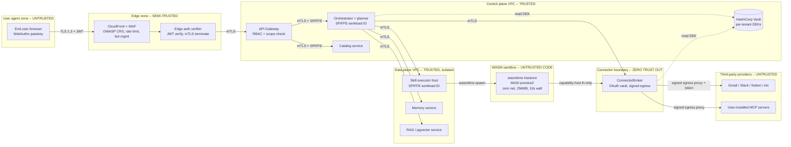

# 07 - Security and Isolation (Infrastructure)

> **Scope.** This document covers **infrastructure security only**: trust boundaries, identity, network isolation, secrets, multi-tenancy, code execution sandboxing, connector boundary, data protection, supply chain, threat model, compliance, audit. Behavioral / content safety (prompt injection, jailbreak, output filtering, hallucination control, agent action approval) is **out of scope** and is owned by `15-guardrails.md`.

## Resume anchors used here

- `(resume.txt:49-50)` - Golang-backed WASM sandbox plane, 1M+ daily zero-shot code executions, unblocking Enterprise SOC-2 compliance.
- `(resume.txt:58-59)` - LLMOps telemetry mesh, 50M spans/day, 2.5TB+ monthly trace data, deterministic replay.
- `(resume.txt:87-89)` - secure multi-tenant ML infrastructure on Kubernetes and Azure: isolation strategies for LLM workloads, GPU scheduling.
- `(resume.txt:93-94)` - CodeQL + GitHub Advanced Security integrated into CI/CD; standardized threat modeling.
- `(resume.txt:97-98)` - TunDRA, secure QUIC-based protocol in Rust, 1M+ Compute Instances.
- `(microsoft-experience.md point 10,11)` - isolation strategies: VNet, subnet, NSG, private endpoints, managed identity, namespaces, network policies, pod security, storage ACLs.
- `(microsoft-experience.md point 17)` - CodeQL + GitHub Advanced Security in CI/CD.
- `(microsoft-experience.md point 18)` - standardized threat modeling for Microsoft compliance.
- `(microsoft-experience.md point 33)` - threat modeling assets, trust boundaries, attack vectors, mitigations.
- `(microsoft-experience.md point 34)` - secrets leakage prevention from jobs, logs, images, env vars, user-provided code.
- `(blackbox-experience.md points 3-5)` - WASM sandbox plane isolating 1M+ daily executions, supporting SOC-2.

---

## 1. Trust boundaries



**Enforcement summary per boundary:**

| Boundary | Direction | Mechanism |
|---|---|---|
| Browser to edge | inbound | TLS 1.3, WAF rules, WebAuthn binding, CORS allowlist |
| Edge to control plane | inbound | mTLS via service mesh, JWT verified at edge |
| Control plane to data plane | east-west | SPIFFE/SPIRE workload identity, mTLS, network policy |
| Tenant logical scope | east-west | RLS on Postgres, namespace prefix on pgvector, key prefix on Redis, S3 prefix IAM |
| WASM sandbox | outbound | wasmtime + WASI preview2, no syscalls, capability host functions only |
| Connector to third party | outbound | ConnectorBroker proxies all egress; raw token never exits broker |
| Third party to platform (webhooks) | inbound | HMAC signature verification + replay window |

---

## 2. Identity and access

Anchored on `(microsoft-experience.md point 11)` (VNet, identity, managed identity), `(resume.txt:87-89)`.

### 2.1 End-user identity

- **Primary**: WebAuthn passkeys (phishing-resistant, FIDO2). User can register multiple authenticators per account.
- **Fallback**: OIDC (Google, Apple, Microsoft) for users without a passkey-capable device. After first OIDC login we prompt the user to enroll a passkey on next visit.
- **Session model**:
  - Access token: JWT, RS256, 15-minute TTL, contains `tenant_id`, `user_id`, `scopes`, `ip_class`, `auth_method` (`webauthn` | `oidc`). Signing key rotated every 90 days; key ID (`kid`) in header.
  - Refresh token: opaque random 256 bits, stored hashed in Postgres, 30-day TTL with sliding renewal, **rotating** (each use issues a new refresh and invalidates the previous, with a 30-second grace window to absorb network retries).
  - Device binding: refresh token bound to a device fingerprint (TPM attestation when available, else passkey credential ID). A token used from a different fingerprint triggers re-auth.
- **Step-up auth** for sensitive actions: granting a new connector scope, exporting full memory, deleting account.

### 2.2 Service-to-service

- **SPIFFE / SPIRE** issues short-lived (1 hour) X.509-SVID workload identities to every pod. Service mesh (Linkerd) enforces mTLS using these identities. Authorization policies are written against SPIFFE IDs (`spiffe://prod.platform/ns/orchestrator/sa/orchestrator`).
- No long-lived service account tokens in env vars. No service-to-service shared secrets.
- Pattern anchored on `(microsoft-experience.md point 11)` and `(resume.txt:97-98)` (TunDRA's secure-by-default compute communication is the design spirit).

### 2.3 Third-party provider tokens (Gmail / Slack / MCP / etc.)

- OAuth 2.0 with **PKCE** for the install flow; state parameter HMAC-signed and bound to user session.
- Access tokens kept short-lived per provider policy; we store them only for the lifetime needed.
- **Refresh tokens are rotated** on every use where the provider supports it (Google, Microsoft do).
- Both access and refresh tokens are encrypted with a per-tenant DEK and stored only in the ConnectorBroker vault - see Section 4.
- Tokens are **never** exposed to skill code; the broker swaps `${TOKEN}` into outgoing requests at the egress proxy.

---

## 3. Network isolation

Anchored on `(microsoft-experience.md point 10,11)` and `(resume.txt:87-89)` - VNet isolation patterns reused on AWS as VPC + subnets + PrivateLink.

### 3.1 VPC layout

```
VPC
├── public subnets (3 AZ)
│   └── NLB (TLS terminate, route to ALB)
├── private subnets (3 AZ)
│   ├── ALB (per-service path routing)
│   ├── API Gateway pods
│   ├── Orchestrator pods
│   ├── Catalog pods
│   ├── ConnectorBroker pods
│   ├── Memory / RAG pods
│   └── SkillExecutor pods (hostNetwork=false, dedicated nodepool)
└── isolated subnets (3 AZ, no IGW/NAT)
    ├── RDS Postgres (primary + read replicas)
    ├── pgvector (separate cluster)
    ├── ElastiCache Redis
    └── VPC endpoints: S3 (Gateway), KMS, Secrets Manager, STS (PrivateLink)
```

Only the public subnet has any inbound from the internet, and only on 443 to the NLB. The isolated subnets have **no route to 0.0.0.0/0** - all access from services is via VPC endpoints.

### 3.2 Egress controls (per service)

Egress is a per-service security group policy and is enforced again at an L7 egress proxy.

| Service | Egress |
|---|---|
| API Gateway | none beyond intra-VPC + edge identity provider |
| Orchestrator | intra-VPC only; LLM provider egress is **not** done here |
| ConnectorBroker | broad egress to OAuth providers and MCP endpoints; goes through the **signed egress proxy** that logs every host, status, byte count |
| LLM router | egress to OpenAI / Anthropic / xAI only, allowlisted at proxy |
| SkillExecutor host | intra-VPC only; the WASM sandbox itself has zero net (see 3.4) |
| Memory / RAG | none |

### 3.3 Service mesh and cross-tenant pod-to-pod policy

Linkerd with strict mTLS for all east-west. Authorization policies:

- Deny by default; allow lists are per source-SPIFFE-ID and target service.
- Orchestrator may call Memory, RAG, ConnectorBroker, SkillExecutor.
- SkillExecutor may call ConnectorBroker (only) for capability host functions.
- Memory / RAG may not call ConnectorBroker.
- **No pod can call another pod in a different tenant's logical scope** - tenancy is logical, not at pod level (we are not pod-per-tenant; see Section 5).

### 3.4 WASM sandbox network policy

Anchored on `(resume.txt:49-50)` and `(blackbox-experience.md 3-5)`.

- The wasmtime instance has **zero outbound network capability** by default.
- HTTP egress is exposed only as a **capability-gated host function** (`platform.http_fetch(req)`).
- Each skill declares an outbound allowlist at install time (`{ "egress": ["api.stripe.com", "*.googleapis.com"] }`); the host function rejects calls outside the allowlist before any DNS lookup.
- The host function routes through the signed egress proxy, which double-checks the allowlist server-side and adds the OAuth token from the ConnectorBroker.

---

## 4. Secrets management

Anchored on `(microsoft-experience.md point 17,34)` - secret leakage prevention from jobs, logs, container images, env vars, user-provided code.

### 4.1 Layering

```
Customer Master Key (CMK) in AWS KMS (HSM-backed, per region)
   │  KMS:GenerateDataKey
   ▼
Per-tenant Data Encryption Key (DEK)   ← envelope-encrypted, stored next to ciphertext
   │  AES-256-GCM
   ▼
Ciphertext at rest (OAuth tokens, memory entries, RAG documents)
```

### 4.2 Where each secret class lives

| Secret class | Storage | Rotation |
|---|---|---|
| End-user passkey credentials | Postgres (`webauthn_credentials`); public key only, no shared secret | n/a (asymmetric) |
| End-user refresh tokens | Postgres, hashed (Argon2id) | rotated on every use |
| Per-tenant DEK for OAuth tokens | Vault transit engine (does not leave HSM), tenant-scoped | 90 days; old key kept for decryption only |
| Connector access tokens | Postgres column `connector_token_ciphertext`, encrypted with tenant DEK; Vault transit decrypts on demand | rotated by provider OAuth flow |
| Connector refresh tokens | Same as access tokens, but in a separate column with stricter audit | every use (where provider supports) |
| Internal service secrets (DB passwords, S3 keys) | External Secrets Operator → HashiCorp Vault → mounted as ephemeral files into pods | 30 days |
| TLS certificates (mesh) | SPIRE-issued SVIDs | 1 hour |
| TLS certificates (edge) | ACM, auto-rotated | per ACM policy |
| Webhook signing secrets (outbound) | Vault, per-tenant | 180 days, rolling overlap |
| Webhook signing secrets (inbound from providers) | Vault, per-connector | per provider policy |
| Catalog signing key (skill artifact signatures) | KMS asymmetric | yearly with overlap |

### 4.3 Rules

- No secret in env vars at rest. Pods get secrets as ephemeral tmpfs mounts via CSI driver.
- No secret in container images. CI fails the build if Trivy / gitleaks find one.
- **Connector tokens are never decrypted into orchestrator memory** - the ConnectorBroker is the only service holding a DEK with `decrypt` permission, and tokens are spliced into requests inside the broker, so a compromise of any other service does not leak tokens. Anchored on `(microsoft-experience.md point 34)`.

---

## 5. Multi-tenant isolation matrix

This is logical multi-tenancy (shared pods, shared databases) for cost reasons. The isolation mechanism per shared resource is explicit:

| Shared resource | Isolation mechanism | Failure mode it prevents |
|---|---|---|
| Postgres (memory, agent state, catalog metadata) | Row-Level Security policy keyed on `tenant_id`; session sets `app.tenant_id` at connection check-out; per-tenant connection pool prevents cross-tenant connection reuse | App bug forgetting WHERE tenant_id=… |
| Pgvector (RAG, semantic memory) | Namespace prefix per agent: `tenant_id::agent_id`; query-time filter is **required** by a wrapper API that refuses unfiltered queries | Wrong embeddings returned to wrong tenant |
| Redis (rate limit, session cache, ephemeral working memory) | Key prefix `{tenant_id}:` enforced by client wrapper; per-tenant memory quota via Redis ACL `maxmemory-on-key-pattern` | Noisy-tenant eviction; cross-tenant key lookup |
| S3 (artifacts, skill bundles, exported runs) | Per-tenant prefix `s3://platform/{tenant_id}/...`; service IAM role has an `s3:prefix` condition; SCP at the org level enforces prefix match | Service code with a bug writing to wrong prefix |
| WASM sandbox | One wasmtime instance per run; killed at run completion; no shared memory between instances; instance is a fresh fuel-bounded Store | Side-channel via shared linear memory; persistence across runs |
| ConnectorBroker token vault | Per-tenant DEK; broker never logs token; tokens redacted at trace ingestion by tag rule | Token bleed via logs / traces |
| Outbound webhook signing | Per-tenant HMAC secret; signature header `X-Platform-Signature: t=…, v1=…` (Stripe pattern) | Replay or forgery of webhooks delivered to user-owned URLs |
| LLM provider calls | Tenant-tagged request; quota and rate limit per tenant; tenancy carried into Langfuse trace tags | One tenant DOS'ing model router or quota |
| GPU pool (if used for embed/rerank) | NodePool taints + namespace quotas; gang-scheduling at job level | Cross-tenant GPU latency interference. Pattern anchored on `(resume.txt:87-89)`. |
| Audit log | Append-only; partitioned by tenant; signed segments | Cross-tenant visibility into admin events |

**Cross-tenant test**: every CI run executes a deny-test suite where a `tenant_A` JWT attempts to read `tenant_B` data through each shared resource. Any 200 is a build failure.

---

## 6. Code execution security (skills)

Anchored on `(resume.txt:49-50)` (Golang-backed WASM sandbox plane, 1M+ daily zero-shot code executions, SOC-2 enabler) and the entire `blackbox-experience.md` sandbox theme. This section is **the** unique-risk surface of the platform: skill code is *fully untrusted user input* and may be AI-generated.

### 6.1 Runtime

- wasmtime (Bytecode Alliance, written in Rust, audited).
- WASI preview2 only. No WASI socket extension. No fork, no exec, no raw sockets, no shared memory, no thread spawn beyond a single execution thread.
- Component model: each skill ships as a WASM component with a typed interface.

### 6.2 Resource limits (per invocation)

| Resource | Limit | Mechanism |
|---|---|---|
| Wall clock | 10 s | wasmtime Store deadline; sandbox host kills after timer |
| CPU | 5 s | wasmtime fuel metering (deterministic, not wall-clock dependent) |
| Memory | 256 MiB | linear memory cap, fuel-bounded growth |
| Filesystem read | read-only ephemeral overlay over a minimal skill bundle | preopened dirs only |
| Filesystem write | 50 MiB scratch dir, discarded at run end | preopened dir + size cap |
| Stdout | 1 MiB, truncated with marker | host stream wrapper |
| Stderr | 256 KiB, truncated with marker | host stream wrapper |
| Concurrency per skill | per-tenant rate limit; max 16 concurrent for free tier | scheduler |
| Network | none by default; HTTPS-only via `platform.http_fetch` host function with per-skill allowlist | capability-gated host fn |
| Syscalls | only WASI preview2 surface | wasmtime config: `wasi_socket=false`, `wasi_proc_exit=true`-only, no inheritance |

### 6.3 Lifecycle

```
upload -> static scan -> sign -> publish -> on-demand spawn -> run -> kill -> evict
                                                 │
                                                 └─ wasmtime Store + fresh Module instance
```

- **Static scan at upload time**: forbidden imports (any non-WASI preview2 import), suspicious patterns (encoded shells, base64 blobs above N bytes), and a Trivy-equivalent SBOM scan over any embedded native dependencies. Anchored on `(microsoft-experience.md point 17)` (CodeQL + GHAS).
- **Signing**: every published skill artifact is signed by the catalog signing key (cosign). The executor verifies signature before instantiation.
- **Fresh instance per run**: no warm-pool reuse of Stores across tenants. (Warm pools are allowed only **within** a single tenant + single skill version + only when memory is zeroed.)
- **Telemetry**: every fuel-exhaust, wall-clock-kill, memory-overflow, denied egress logged with the skill ID, version, tenant, and a hashed source span - feeds the catalog's abuse signal.

### 6.4 Why WASM (not Docker / gVisor / Firecracker)

- Cold start in single-digit milliseconds vs hundreds of ms for microVM. At 1M+ executions/day we cannot pay microVM cold start. `(resume.txt:49)`
- Deterministic fuel metering gives us replay-friendly CPU bounds. Important for `(resume.txt:58-59)` deterministic replay.
- WASI preview2 surface is provably smaller than a Linux syscall surface.
- Tradeoff acknowledged: WASM is weaker than gVisor/Firecracker against *kernel* escape because it shares the host kernel - we mitigate by running executors on a dedicated nodepool with seccomp, AppArmor, and no privileged capabilities. If a future skill type needs full Linux (e.g. `pip install`), it goes to a Firecracker pool instead.

---

## 7. Connector security boundary

This is the unique-to-this-system risk: skill code wants to talk to **third-party providers we do not control** (Gmail, Slack, Notion, MCP servers users install themselves). We treat that boundary as zero-trust outbound.

### 7.1 OAuth install flow

- User opens an agent that requires a connector. UI shows **plain-English requested scopes** ("Read your Gmail inbox", "Send messages on your behalf").
- We minimize scopes by mapping each skill capability to the smallest possible OAuth scope. Skill manifest must declare requested scopes; catalog reviewers can reject scope creep.
- PKCE flow, state HMAC-bound to session.
- User can **revoke any connector at any time**. Revoke immediately invalidates token in our vault AND calls the provider's revoke endpoint.

### 7.2 Token-handling rule

- The ConnectorBroker is the **only** service with `decrypt` permission for connector DEKs.
- Skill code never sees a raw OAuth token. The capability host function takes a target host and request payload; the broker injects `Authorization: Bearer …` at the egress proxy.
- Tokens are tagged at trace ingestion and redacted before reaching Langfuse / ClickHouse - anchored on `(resume.txt:58-59)` telemetry mesh.

### 7.3 Per-agent connector ACL

A connector grant is scoped to (`user`, `agent`, `connector`, `subset_of_scopes`).

Example: a `Calendar Triage` agent gets `gmail.read` but **not** `gmail.send`. Even if the skill code attempts a POST to `gmail.googleapis.com/...sendMessage`, the broker rejects it because the granted ACL has no `gmail.send`.

### 7.4 MCP connectors (user-installed)

- At install time we fetch the MCP server's tool descriptor and **pin** it (hash stored). Future calls outside that pinned descriptor are rejected. This prevents an MCP server from silently exposing new tools that the user never approved.
- MCP server URL allowlist per user.
- We display server identity (URL, cert fingerprint) prominently in the UI.

### 7.5 Inbound webhooks from third parties

- Signature verification (Stripe-style HMAC, or provider-specific like Slack's signing secret).
- Nonce + 5-minute window for replay protection.
- Per-tenant signing secret; we accept callbacks only on a tenant-scoped path `POST /v1/webhooks/{tenant_id}/{connector}` and the path must match the tenant in the signed payload.

---

## 8. Data protection

### 8.1 Encryption

- **In transit**: TLS 1.3 everywhere. mTLS inside the mesh. HSTS on the edge.
- **At rest**: KMS-backed. Envelope encryption with per-tenant DEK for OAuth tokens, memory entries, and RAG documents. RDS storage encryption with CMK; S3 SSE-KMS with CMK; EBS encrypted; Redis at-rest encryption.

### 8.2 PII

- Detection at ingestion (see `14-ingestion-pipeline.md`); flagged spans get a `pii=true` tag in pgvector metadata and a redaction rule applies to logs and traces.
- Logs are scrubbed by a Fluent Bit pipeline before they leave the cluster; redaction rules are unit-tested.
- The **Langfuse trace mesh** (`resume.txt:58-59`) honors per-tenant redaction tags - sensitive fields are masked at write time.

### 8.3 GDPR right-to-erase

`DELETE /v1/users/{user_id}` triggers a tombstone workflow:

1. Postgres rows soft-deleted with `tombstoned_at`; hard-deleted by a daily job after 30 days (so we can rescue accidental deletes via support).
2. Pgvector entries: tombstoned via a `deleted=true` filter; reindex job purges them within 24 hours.
3. S3 objects: marked with a `tombstoned` tag; lifecycle policy removes them after 7 days.
4. Backups: per-region backups expire on a 30-day rolling window; we do not restore tombstoned data on restore.
5. The user gets a receipt with the deletion ID and ETA-to-permanent.

### 8.4 Data residency

- EU users (detected at signup region + on each refresh) have their memory + RAG pinned to `eu-west-1`.
- Catalog metadata can be globally replicated (no user data in catalog).
- LLM provider routing for EU users prefers providers with EU data residency commitments; if none available, the user is shown a consent dialog at agent install.

---

## 9. Supply chain security

Anchored on `(resume.txt:93-94)` and `(microsoft-experience.md point 17)`.

| Concern | Control |
|---|---|
| First-party container images | Built in GHA on hardened runners; signed with cosign (keyless via Sigstore + GitHub OIDC); SBOM (CycloneDX) attached as attestation; scanned by Trivy on every push |
| Image admission | Kyverno policy in cluster: refuse to admit any image not signed by our build identity; refuse images with Critical CVEs older than 14 days |
| Dependencies (Go, Rust, TS) | Renovate + GitHub Dependabot; pinned versions in lockfiles; `govulncheck` / `cargo audit` / `npm audit` gates in CI |
| Static analysis | CodeQL on all PRs - anchored on `(resume.txt:93-94)` and `(microsoft-experience.md point 17)`; semgrep custom rules for our internal anti-patterns |
| Secrets in source | gitleaks pre-commit + CI; PR blocked on hit |
| Third-party (catalog) skill packages | Signature required (publisher key registered at developer onboarding); optional human review for skills that request high-risk scopes (Gmail.send, Drive.write) or wide egress allowlists |
| Build environment | OIDC-only secrets; no long-lived deploy keys; ephemeral runners |
| Provenance | SLSA level 3 target for first-party images |

---

## 10. Threat model (STRIDE)

Anchored on `(microsoft-experience.md point 18,33)`.

| # | Threat | STRIDE | Where it lives | Mitigation | Detection |
|---|---|---|---|---|---|
| 1 | Cross-tenant memory leak - skill or service returns tenant B's data to tenant A | T + I | Postgres, pgvector, Redis | RLS on Postgres, query-wrapper-enforced namespace on pgvector, key prefix on Redis; CI deny-test on every PR | Periodic synthetic queries from a fake tenant against a real tenant's data; alert on any non-404 |
| 2 | OAuth token theft from connector vault | I | ConnectorBroker, Vault, Postgres | Per-tenant DEK; only broker can decrypt; tokens never in logs/traces (redaction); IAM scoped so even broker can't read another tenant's DEK without an audited Vault policy decision | Anomaly detection on Vault decrypt rate per tenant; alert on decrypt from outside broker SPIFFE ID |
| 3 | Malicious skill code escapes WASM sandbox | E | SkillExecutor host | wasmtime + WASI preview2 only, fuel + memory bound, no syscalls, dedicated nodepool with seccomp + no privileged caps; signed images only | Anomaly on host-level syscall audit (auditd); fail closed on any unexpected syscall from the executor process |
| 4 | Connector misuse - skill calls `Gmail.delete` or sends to thousands when granted `gmail.read` only | T | ConnectorBroker | Per-agent ACL enforced at broker; broker matches outbound method+host+path against ACL before egress | Audit log diff: any denied call surfaces in user-visible activity feed |
| 5 | Webhook replay (third party replays a delivery, or attacker replays a leaked signed payload) | S | Inbound webhook endpoint | HMAC signature verify + 5-minute timestamp window + nonce store (Redis, 24h TTL) | Spike in `replay_rejected` metric |
| 6 | DoS via expensive runs - attacker installs an agent that runs forever or burns LLM quota | D | Orchestrator, model router | Per-tenant + per-user concurrency caps; per-skill fuel budget; per-tenant LLM token quota with circuit-breaker; backpressure to 429 | Alert on per-tenant spend rate p99 |
| 7 | Catalog SEO spam - bad actor publishes thousands of low-quality agents | R | Catalog | Publisher identity verification (email + payment hold); rate limit on publish; quality signals + manual review for trending; takedown workflow | Catalog moderation queue + report-this-agent button |
| 8 | Prompt or code injection that exfiltrates secrets via outbound network | I | WASM sandbox + ConnectorBroker | Zero-egress default; per-skill egress allowlist; tokens never available to skill code | Egress proxy logs every host + bytes; alert on unusual destination |
| 9 | Compromised LLM provider (rare but real) | T + I | LLM router | No sensitive secrets in prompts (we strip before send); provider-isolated keys per tenant tier; fast failover to alternate provider | Provider health probe + canary; correlation of failures across tenants |
| 10 | Stolen end-user session | S | Browser, edge | Passkey-bound sessions; refresh token rotation with device-fingerprint binding; step-up auth for high-risk actions | Anomalous device or IP class triggers re-auth |
| 11 | Insider threat - engineer reads tenant memory | T + I | Internal ops | Just-in-time access via Vault; all production access logged with reason; per-tenant DEKs require a Vault policy decision visible in audit; engineers cannot read connector tokens at all | Vault audit log + weekly review |
| 12 | Supply-chain compromise of a skill dependency | T | Catalog, build | SBOM + Trivy on skill bundles; signature pinning; publisher key compromise -> revocation list checked at executor spawn | New CVE on a pinned dep auto-triggers re-scan and quarantine |

---

## 11. Compliance posture

Anchored on `(resume.txt:49-50)` (the WASM sandbox plane was the SOC-2 enabler) and `(microsoft-experience.md point 17,18)` (CodeQL, GHAS, standardized threat modeling).

| Standard | Target | Notes |
|---|---|---|
| SOC-2 Type II | within 12 months of GA | Controls already in place from day 1: access control, change management, encryption, monitoring. The WASM sandbox plane is the architectural enabler - anchored on `(resume.txt:49-50)`. |
| GDPR | day one | Right to access (`GET /v1/me/export`), right to erase (Section 8.3), data residency (Section 8.4), DPA + SCC templates ready |
| ISO 27001 | year 2 | builds on SOC-2 evidence |
| HIPAA / FedRAMP | not in scope for B2C MVP | call-out for enterprise tier if needed |
| Audit log retention | 1 year minimum, 7 years for compliance-flagged tenants | append-only, hash-chained segments signed by KMS |

---

## 12. Audit logging

Anchored on `(resume.txt:58-59)` - telemetry mesh, 50M spans/day, 2.5TB+ trace data, deterministic replay; the audit log is a sibling stream into ClickHouse.

### 12.1 Streams

| Stream | Sink | Retention | Use |
|---|---|---|---|
| Admin audit (control plane actions: connector grants, skill installs, scope changes, deletions) | Append-only ClickHouse `audit_events` table; segments hash-chained, signed daily by KMS; mirrored to S3 Object Lock (compliance mode) | 1 year (7 years for flagged tenants) | SOC-2 evidence, incident IR |
| Per-run trace lineage (tool calls, LLM calls, retrieval, memory reads/writes) | ClickHouse `run_spans` | 30 days hot, 90 days cold, then summary | Deterministic replay + debugging - anchored on `(resume.txt:58-59)` |
| Security events (auth failures, denied egress, scope violations, RLS denies) | ClickHouse `security_events`; high-severity also paged | 1 year | IR, anomaly detection |
| Data-access log (which service read which row of which tenant) | ClickHouse `data_access` | 90 days | Insider-threat detection |

### 12.2 User-visible activity log

Every authenticated user has a UI page that surfaces:

- which agents accessed which connectors when
- which skills were installed and by whom (for shared workspaces)
- export, delete, login events
- session active devices

This is the trust signal that converts "you have my Gmail token" into "I can see exactly what you did with it" - a B2C transparency promise.

### 12.3 Integrity

- Audit segments are hash-chained: `segment_n.hash = sha256(segment_n.body || segment_n-1.hash)`.
- A daily anchor signs the latest hash with a KMS asymmetric key and writes it to S3 Object Lock.
- Any tampering with the audit table is detectable by re-walking the chain against the daily anchor.

---

## Surviving design decisions

- WASM over microVM is a deliberate tradeoff: we trade some kernel-level isolation strength for cold-start latency and deterministic replay. For skill classes that need full Linux (rare), we route to a Firecracker pool instead - that pool is a 10x cost-per-execution surface.
- Logical multi-tenancy (shared DB, RLS) over physical (DB-per-tenant) is justified up to single-digit thousands of tenants. The migration to per-tenant Postgres clusters is pre-designed but not built.
- ConnectorBroker as the only token-holder is a single point of failure for connector availability. We accept that to make token blast-radius zero from any other compromise.
