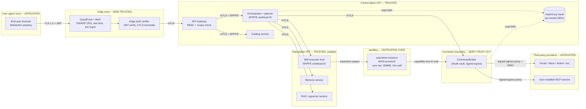

# 07 - Security and Isolation (Infrastructure)


## 1. Trust boundaries



**Enforcement summary per boundary:**

| Boundary | Direction | Mechanism |
|---|---|---|
| Browser to edge | inbound | TLS 1.3, WAF rules, WebAuthn binding, CORS allowlist |
| Edge to control plane | inbound | mTLS via service mesh, JWT verified at edge |
| Control plane to data plane | east-west | SPIFFE/SPIRE workload identity, mTLS, network policy |
| Tenant logical scope | east-west | RLS on Postgres, namespace prefix on pgvector, key prefix on Redis, S3 prefix IAM |
| sandbox | outbound | wasmtime + WASI preview2, no syscalls, capability host functions only |
| Connector to third party | outbound | ConnectorBroker proxies all egress; raw token never exits broker |
| Third party to platform (webhooks) | inbound | HMAC signature verification + replay window |

---

## 2. Identity and access


### 2.1 End-user identity

- **Primary**: WebAuthn passkeys (phishing-resistant, FIDO2). User can register multiple authenticators per account.
- **Fallback**: OIDC (Google, Apple, Microsoft) for users without a passkey-capable device. After first OIDC login we prompt the user to enroll a passkey on next visit.
- **Session model**:
  - Access token: JWT, RS256, 15-minute TTL + Refresh token: opaque random 256 bits,
  - Device binding: refresh token bound to a device fingerprint (TPM attestation when available, else passkey credential ID). A token used from a different fingerprint triggers re-auth.
- **Step-up auth** for sensitive actions: granting a new connector scope, exporting full memory, deleting account.

### 2.2 Service-to-service

- workload identities to every pod. Service mesh (Linkerd) enforces mTLS using these identities. 
- No long-lived service account tokens in env vars. No service-to-service shared secrets.

### 2.3 Third-party provider tokens (Gmail / Slack / MCP / etc.)

- OAuth 2.0 with **PKCE** for the install flow; state parameter HMAC-signed and bound to user session.

---

## 3. Network isolation

### 3.1 VPC layout

```
VPC
├── public subnets (3 AZ)
│   └── NLB (TLS terminate, route to ALB)
├── private subnets (3 AZ)
│   ├── ALB (per-service path routing)
│   ├── API Gateway pods
│   ├── Orchestrator pods
│   ├── Catalog pods
│   ├── ConnectorBroker pods
│   ├── Memory / RAG pods
│   └── SkillExecutor pods (hostNetwork=false, dedicated nodepool)
└── isolated subnets (3 AZ, no IGW/NAT)
    ├── RDS Postgres (primary + read replicas)
    ├── pgvector (separate cluster)
    ├── ElastiCache Redis
    └── VPC endpoints: S3 (Gateway), KMS, Secrets Manager, STS (PrivateLink)
```

Only the public subnet has any inbound from the internet, and only on 443 to the NLB. The isolated subnets have **no route to 0.0.0.0/0** - all access from services is via VPC endpoints.

### 3.2 Egress controls (per service)

Egress is a per-service security group policy and is enforced again at an L7 egress proxy.

### 3.3 Service mesh and cross-tenant pod-to-pod policy

Linkerd with strict mTLS for all east-west. Authorization policies:

### 3.4 Sandbox network policy

- The Sandbox instance has **zero outbound network capability** by default.
- HTTP egress is exposed only as a **capability-gated host function** (`platform.http_fetch(req)`).
---

## 4. Secrets management


### 4.1 Layering

```
Customer Master Key (CMK) in AWS KMS (HSM-backed, per region)
   │  KMS:GenerateDataKey
   ▼
Per-tenant Data Encryption Key (DEK)   ← envelope-encrypted, stored next to ciphertext
   │  AES-256-GCM
   ▼
Ciphertext at rest (OAuth tokens, memory entries, RAG documents)
```

---

## 6. Code execution security (skills)

### 6.1 Runtime

- Firecracker


### 6.3 Lifecycle

```
upload -> static scan -> sign -> publish -> on-demand spawn -> run -> kill -> evict
                                                 │
                                                 └─ wasmtime Store + fresh Module instance
```

- **Static scan at upload time**:
- **Signing**: every published skill artifact is signed by the catalog signing key (cosign). The executor verifies signature before instantiation.
- **Fresh instance per run**: no warm-pool reuse of Stores across tenants. (Warm pools are allowed only **within** a single tenant + single skill version + only when memory is zeroed.)
- **Telemetry**: every fuel-exhaust, wall-clock-kill, memory-overflow, denied egress logged with the skill ID, version, tenant, and a hashed source span - feeds the catalog's abuse signal.

---

## 8. Data protection

### 8.1 Encryption

- **In transit**: TLS 1.3 everywhere. mTLS inside the mesh. HSTS on the edge.
- **At rest**: KMS-backed. Envelope encryption with per-tenant DEK for OAuth tokens, memory entries, and RAG documents. RDS storage encryption with CMK; S3 SSE-KMS with CMK; EBS encrypted; Redis at-rest encryption.

### 8.2 PII

- Detection at ingestion; flagged spans get a `pii=true` tag in pgvector metadata and a redaction rule applies to logs and traces.
- Logs are scrubbed by a Fluent Bit pipeline before they leave the cluster; redaction rules are unit-tested.
- The **Langfuse trace mesh** (`resume.txt:58-59`) honors per-tenant redaction tags - sensitive fields are masked at write time.

### 8.3 GDPR right-to-erase

### 8.4 Data residency


---

## 11. Compliance posture

| Standard | Target | Notes |
|---|---|---|
| SOC-2 Type II | within 12 months of GA | Controls already in place from day 1: access control, change management, encryption, monitoring. |
| GDPR | day one | Right to access (`GET /v1/me/export`), right to erase (Section 8.3), data residency (Section 8.4), DPA + SCC templates ready |
| ISO 27001 | year 2 | builds on SOC-2 evidence |
| HIPAA / FedRAMP | not in scope for B2C MVP | call-out for enterprise tier if needed |
| Audit log retention | 1 year minimum, 7 years for compliance-flagged tenants | append-only, hash-chained segments signed by KMS |

---

## 12. Audit logging

| Stream | Sink | Retention | Use |
|---|---|---|---|
| Admin audit (control plane actions: connector grants, skill installs, scope changes, deletions) | Append-only ClickHouse `audit_events` table; segments hash-chained, signed daily by KMS; mirrored to S3 Object Lock (compliance mode) | 1 year (7 years for flagged tenants) | SOC-2 evidence, incident IR |
| Per-run trace lineage (tool calls, LLM calls, retrieval, memory reads/writes) | ClickHouse `run_spans` | 30 days hot, 90 days cold, then summary | Deterministic replay + debugging - anchored on `(resume.txt:58-59)` |
| Security events (auth failures, denied egress, scope violations, RLS denies) | ClickHouse `security_events`; high-severity also paged | 1 year | IR, anomaly detection |
| Data-access log (which service read which row of which tenant) | ClickHouse `data_access` | 90 days | Insider-threat detection |
