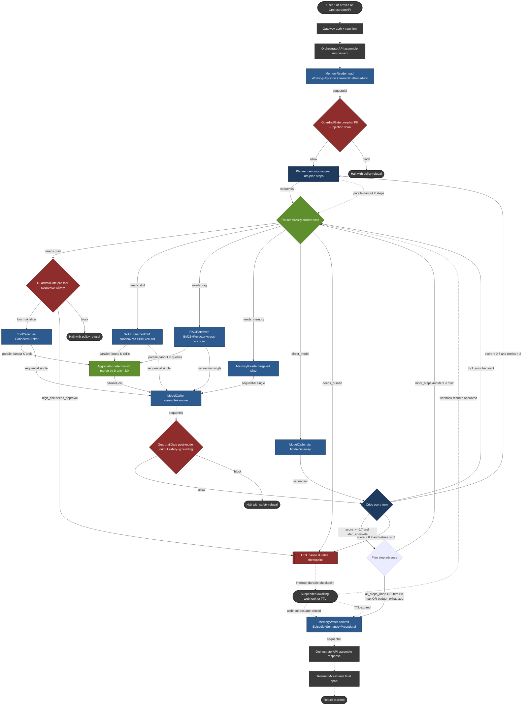

# 12 - Agentic Graph Structure (Two-Layer Deep-Dive)

> Scope: the internal topology and state contract of the `AgentRuntime` for the
> B2C Custom-GPT-style platform. This file is the canonical reference for **how
> a single agent run is shaped as a graph**, what each node does, what the edge
> conditions are, and what gets written into the LangGraph checkpoint at every
> hop. Everything below is grounded in the BlackBox LangGraph/ReAct runtime
> (`resume.txt:51-52`, 10K+ runs/day), the durable-execution + checkpointing
> engine (`resume.txt:53-54`), the multi-model router (`resume.txt:55-56`), and
> `blackbox-experience.md` points 7, 11, 12, 13, 15.

This document is intentionally split into two layers so an interviewer can stop
at Layer 1 ("show me the graph") or go deep into Layer 2 ("show me the state
contract and the predicates"). Layer 1 is the **topology**; Layer 2 is the
**contract**.

---

## Layer 1 - Graph Topology

### 1.1 Design intent

The `AgentRuntime` graph is a **ReAct-style supervisor / worker DAG** with
durable checkpointing on every node boundary. It is not a pure linear chain
and not a free-form swarm. The shape is dictated by four hard constraints from
the BlackBox experience:

1. **Durable, resumable** runs that survive worker crashes, deploys, and HITL
   pauses (`resume.txt:53-54`; `blackbox-experience.md` point 13).
2. **Tool-calling with side effects** that must be idempotent and replayable
   (`blackbox-experience.md` points 11, 15).
3. **Multi-model routing** at the model-call boundary, not at the request
   boundary, so a single run can mix Claude / GPT / Grok per step
   (`resume.txt:55-56`).
4. **Memory persistence across sessions** (`blackbox-experience.md` point 12),
   which forces explicit `MemoryReader` and `MemoryWriter` nodes around the
   reasoning loop instead of implicit context stuffing.

The result is a supervisor (`Planner`) that emits a plan; a `Router` that
dispatches each step to one of four worker classes (`ToolCaller`,
`SkillRunner`, `RAGRetriever`, `MemoryReader`); a `ModelCaller` that runs the
LLM turn; a `Critic` that scores the turn and decides whether to loop; an
`Aggregator` that merges parallel fan-outs; a `MemoryWriter` that commits
durable state; and two safety nodes (`GuardrailGate`, `HITL`) that gate
high-risk transitions.

### 1.2 Node type taxonomy

Every node in the runtime is exactly one of the 12 types below. The "state
shape" column lists the fields the node **owns** in the checkpoint - i.e. it is
the canonical writer. Other nodes may read these fields but only the owner
writes them, which is what makes deterministic replay tractable
(`blackbox-experience.md` point 15).

| # | Node | Class | Role | State it writes | State it reads |
|---|---|---|---|---|---|
| 1 | `Planner` | Supervisor | Decomposes user goal into an ordered/partial-ordered step list. Re-plans on critic failure. | `plan`, `plan_version`, `current_step_idx` | `user_goal`, `persona`, `working_memory`, `critic_feedback` |
| 2 | `Router` | Dispatcher | For the current step, decides which worker class handles it (tool vs skill vs RAG vs memory vs direct model). | `route_decision`, `route_reason` | `plan[current_step_idx]`, `persona.allowed_tools`, `budget` |
| 3 | `ToolCaller` | Worker | Invokes a connector (MCP / OAuth) through `ConnectorBroker`. Owns idempotency keys and the outbox pattern. | `tool_calls[]`, `tool_results[]`, `idempotency_keys[]` | `route_decision`, `persona.connectors`, `working_memory` |
| 4 | `SkillRunner` | Worker | Executes a Claude-skill bundle inside the WASM sandbox via `SkillExecutor`. | `skill_invocations[]`, `skill_outputs[]`, `sandbox_session_id` | `route_decision`, `persona.skills`, `working_memory` |
| 5 | `RAGRetriever` | Worker | Hybrid retrieval (BM25 + Pgvector HNSW + cross-encoder rerank) against the persona's knowledge corpus via `RAGService`. | `retrieved_chunks[]`, `retrieval_query`, `retrieval_scores[]` | `route_decision`, `persona.kb_id`, `query_rewrite` |
| 6 | `MemoryReader` | Worker | Loads relevant Working / Episodic / Semantic / Procedural memory slices via `MemoryService`. | `memory_snapshot`, `memory_provenance[]` | `user_id`, `persona.id`, `current_step_idx` |
| 7 | `ModelCaller` | Worker | Single LLM turn against the model selected by `ModelGateway`. Holds the chat-completion contract. | `messages[]`, `tokens_in`, `tokens_out`, `model_id`, `finish_reason` | `prompt_assembly`, `tool_results[]`, `retrieved_chunks[]`, `memory_snapshot` |
| 8 | `Critic` | Supervisor | Scores the latest model output against the plan step (groundedness, tool-arg validity, safety, refusal correctness). | `critic_score`, `critic_feedback`, `retry_recommended` | `messages[-1]`, `plan[current_step_idx]`, `retrieved_chunks[]` |
| 9 | `Aggregator` | Joiner | Merges results from a parallel fan-out (multi-tool, multi-RAG, multi-model) into a single deterministic record. | `aggregated_result`, `aggregation_strategy` | `fanout_results[]` |
| 10 | `MemoryWriter` | Worker | Commits durable updates to Episodic / Semantic / Procedural memory at end-of-turn or end-of-run. | `memory_writes[]`, `memory_commit_id` | `messages[]`, `tool_results[]`, `critic_score` |
| 11 | `HITL` | Gate | Pauses the run on a durable checkpoint, surfaces an approval card to the user, and waits for webhook resume. | `hitl_pause_token`, `hitl_question`, `hitl_resume_at`, `hitl_decision` | `route_decision`, `tool_calls[]`, `policy_flags[]` |
| 12 | `GuardrailGate` | Gate | Pre- and post-call policy checks via `GuardrailService` (PII, prompt-injection, persona-scope, connector-scope). | `policy_flags[]`, `guardrail_action` | every other field as needed |

Two structural rules follow from this taxonomy:

- **No node both reads and writes the same field** except `Planner` (which may
  re-write `plan` on replan). This is what makes a checkpoint commutative under
  retry - replaying a node N times yields the same write, because its inputs
  are immutable from its perspective.
- **`GuardrailGate` is not on a single edge.** It is a node that any other
  edge can route through; in the diagram below it appears at three positions
  (pre-route, pre-tool, post-model). This matches the BlackBox guardrail
  posture in `15-guardrails.md`.

### 1.3 Edge type taxonomy

LangGraph edges in this runtime come in five flavors. The runtime engine
(`resume.txt:53-54`) treats each flavor as a distinct checkpoint barrier:

| Edge type | When it fires | Checkpoint behavior |
|---|---|---|
| **Sequential** | The default. Node A finishes → node B starts. | One checkpoint write at the boundary; replay-safe. |
| **Conditional** | A router predicate (`Router`, `Critic`, `GuardrailGate`, `Planner`) returns one of N labels and we jump to the matching successor. | Checkpoint stores the predicate **inputs and label** so replay is deterministic even if the predicate is stochastic. |
| **Parallel-fanout** | `Router` or `Planner` decides this step has K independent sub-steps (e.g. three tool calls, two RAG queries). The engine launches K node instances. | Each fan-out branch gets its own sub-checkpoint keyed by `(run_id, step_idx, branch_idx)`. |
| **Parallel-join** | An `Aggregator` waits for all K branches to checkpoint. | Join is **deterministic by sort key** (`branch_idx` asc) so the merged record is stable across replays. Partial joins are allowed only if `aggregation_strategy = "best-effort"` and `min_quorum` is met. |
| **Interrupt/Resume** | `HITL` or a long-running async tool emits a pause; the run is suspended and a `resume_token` is durably stored. A webhook (or TTL expiry) wakes it. | Checkpoint is the **wake contract**: it stores the token, the wake URL, the TTL, and the exact state to resume from. Without this, HITL is just a sleep loop. |

A run is a **DAG of these edges**, not a strict tree, because the
`Planner → Router → Worker → ModelCaller → Critic → Planner` loop forms a
controlled cycle. The cycle is bounded by `max_iterations` (default 12 for B2C
runs, tunable per persona) and by a budget node that aborts when `tokens_in +
tokens_out` crosses the persona's per-run cap.

### 1.4 Full Mermaid diagram



### 1.5 Supervisor / worker hierarchy

The hierarchy is **two-tier with one gate plane**:

```
                ┌───────────── Planner (supervisor) ─────────────┐
                │                                                │
                ▼                                                ▼
            Router (dispatcher)                            Critic (scorer)
                │                                                ▲
   ┌────────┬───┴────┬─────────┬──────────┐                      │
   ▼        ▼        ▼         ▼          ▼                      │
ToolCaller SkillRunner RAGRetriever MemoryReader ModelCaller ────┘
   │        │        │         │
   └────────┴────┬───┴─────────┘
                ▼
            Aggregator (parallel-join)
                │
                ▼
            MemoryWriter (commit)

  Gate plane (orthogonal): GuardrailGate, HITL - can interpose on any edge.
```

- **Supervisor:** `Planner`. It is the only node allowed to mutate the `plan`
  array. It owns the loop counter and the re-plan decision.
- **Co-supervisor:** `Critic`. It cannot edit the plan but it can force a
  jump back to `Planner` (replan) or to `Router` (retry same step) by setting
  `retry_recommended` and `next_node`. Splitting "plan" from "score" prevents
  the classic ReAct failure mode where the same model both proposes and judges
  its own work without a checkpoint between them.
- **Workers:** `ToolCaller`, `SkillRunner`, `RAGRetriever`, `MemoryReader`,
  `ModelCaller`. Each worker is **stateless across runs** and gets all of its
  input from the checkpoint, so a worker pod can die mid-step and another can
  pick up from the last write.
- **Joiner:** `Aggregator`. Only runs after a parallel-fanout. Pure function
  of `fanout_results[]`.
- **Gate plane:** `GuardrailGate` and `HITL`. These are not in the linear
  flow; they are interposed on edges by the runtime engine based on policy.
  This is why a single `GuardrailGate` node appears in three positions in the
  diagram - it is the **same node type** instantiated at three policy hooks
  (pre-plan, pre-tool, post-model).

---

## Layer 2 - Per-Node State and Edge Conditions

### 2.1 Global `AgentState` shape

This is the single LangGraph checkpoint object. Every node reads and writes
slices of it. Field-level ownership was tabulated in §1.2; the type below is
the union.

```ts
// Persisted on every node boundary into Postgres (durable) + Redis (hot).
// Keyed by (tenant_id, run_id). Versioned with `checkpoint_seq` monotonic int.
type AgentState = {
  // ─── Identity and routing ──────────────────────────────────────────────
  run_id: string;                  // ULID, monotonic
  tenant_id: string;               // B2C user_id namespace
  user_id: string;
  persona: PersonaSnapshot;        // immutable snapshot of persona at run start
  session_id: string;              // multi-turn session this run belongs to
  parent_run_id: string | null;    // for forked/branched runs

  // ─── Inputs ────────────────────────────────────────────────────────────
  user_goal: string;               // the user's turn text
  attachments: Attachment[];       // files/images for this turn
  client_locale: string;

  // ─── Planner-owned ─────────────────────────────────────────────────────
  plan: PlanStep[];                // ordered list of steps
  plan_version: number;            // bumps on every replan
  current_step_idx: number;
  iteration_count: number;         // bounded by persona.max_iterations
  replan_count: number;            // bounded (default 3)

  // ─── Router-owned ──────────────────────────────────────────────────────
  route_decision: RouteLabel;      // one of: tool | skill | rag | memory | model | human
  route_reason: string;            // model rationale, kept for replay
  route_branches: RouteBranch[];   // populated only for parallel-fanout

  // ─── Worker outputs (append-only within a run) ─────────────────────────
  tool_calls: ToolCall[];          // {id, tool_id, args, idempotency_key, ...}
  tool_results: ToolResult[];      // {tool_call_id, status, output, latency_ms}
  idempotency_keys: string[];      // dedupe set for ConnectorBroker
  skill_invocations: SkillInvocation[];
  skill_outputs: SkillOutput[];
  sandbox_session_id: string | null;
  retrieved_chunks: RetrievedChunk[];
  retrieval_query: string | null;
  retrieval_scores: number[];
  memory_snapshot: MemorySnapshot | null;
  memory_provenance: MemoryProvenance[];

  // ─── ModelCaller-owned ─────────────────────────────────────────────────
  messages: ChatMessage[];         // OpenAI/Anthropic-style canonical messages
  model_id: string;                // resolved per call by ModelGateway
  tokens_in: number;
  tokens_out: number;
  finish_reason: 'stop' | 'tool_use' | 'length' | 'safety' | 'error';

  // ─── Critic-owned ──────────────────────────────────────────────────────
  critic_score: number;            // 0..1
  critic_feedback: string;
  critic_dimensions: {             // sub-scores for debuggability
    grounded: number;
    tool_arg_valid: number;
    safety: number;
    persona_adherence: number;
  };
  retry_recommended: boolean;
  retry_count_for_step: number;

  // ─── Aggregator-owned ──────────────────────────────────────────────────
  fanout_results: FanoutResult[];
  aggregated_result: unknown | null;
  aggregation_strategy: 'merge_all' | 'best_score' | 'first_success' | 'quorum';

  // ─── HITL-owned ────────────────────────────────────────────────────────
  hitl_pause_token: string | null; // opaque, signed
  hitl_question: HITLPrompt | null;
  hitl_resume_at: number | null;   // epoch ms, TTL deadline
  hitl_decision: 'approved' | 'denied' | 'edited' | 'expired' | null;
  hitl_edited_args: Record<string, unknown> | null;

  // ─── GuardrailGate-owned ───────────────────────────────────────────────
  policy_flags: PolicyFlag[];      // append-only audit trail
  guardrail_action: 'allow' | 'block' | 'redact' | 'needs_approval' | null;

  // ─── MemoryWriter-owned ────────────────────────────────────────────────
  memory_writes: MemoryWrite[];
  memory_commit_id: string | null;

  // ─── Budget / billing ──────────────────────────────────────────────────
  budget: {
    tokens_cap: number;            // from persona/plan tier
    tokens_spent: number;
    cost_usd_cap: number;
    cost_usd_spent: number;
    wall_clock_deadline_ms: number;
  };

  // ─── Checkpoint metadata (engine-owned) ────────────────────────────────
  checkpoint_seq: number;
  last_node: NodeName;
  next_node: NodeName | null;      // set by predicates for conditional edges
  status: 'running' | 'suspended' | 'completed' | 'failed' | 'cancelled';
  error: { kind: string; message: string; retriable: boolean } | null;
};
```

Three properties of this shape are non-obvious and load-bearing:

1. **Append-only arrays.** `tool_calls`, `tool_results`, `messages`,
   `policy_flags`, `memory_writes` are append-only. Replay re-runs a node and
   we dedupe on the inner `id` field; we never truncate. This is the
   foundation of deterministic replay (`blackbox-experience.md` point 15).
2. **`PersonaSnapshot` is immutable for the run.** The persona may be edited
   between turns, but within a run we snapshot it at `Planner` entry so a
   mid-run edit cannot move connectors or skills out from under the workers.
3. **`next_node` is explicit.** Conditional predicates write
   `next_node` into the checkpoint *before* the engine transitions, so a
   crash between "decide" and "execute" lands deterministically.

### 2.2 Per-node state contracts

For each node, the contract is `reads → writes → emits-next`. Emits-next is
either a fixed successor (sequential), a label (conditional), or a list
(fanout).

#### Planner

- **Reads:** `user_goal`, `persona`, `memory_snapshot`, `critic_feedback`,
  `plan` (if replanning).
- **Writes:** `plan`, `plan_version` (`+= 1`), `current_step_idx = 0` on first
  plan, `replan_count` (`+= 1` on replan).
- **Emits:** sequential → `Router`. On fanout-plan emits parallel-fanout to K
  `Router` instances, one per top-level step.
- **Predicate it enforces:** `replan_count <= 3`; on the 4th would-be replan
  it routes to `HITL` ("I'm stuck - confirm direction").

#### Router

- **Reads:** `plan[current_step_idx]`, `persona.allowed_tools`,
  `persona.skills`, `persona.kb_id`, `tool_results` (to avoid loops),
  `budget`.
- **Writes:** `route_decision`, `route_reason`, optionally `route_branches`
  for fanout.
- **Emits:** conditional → one of `{ToolCaller, SkillRunner, RAGRetriever,
  MemoryReader, ModelCaller, HITL}` via `GuardrailGate` for the tool path.

#### ToolCaller

- **Reads:** `route_decision`, `tool_calls` (pending), `persona.connectors`,
  `idempotency_keys`.
- **Writes:** appends to `tool_calls` (with a freshly minted
  `idempotency_key = hash(run_id, step_idx, tool_id, args_canonical)`),
  appends to `tool_results`, updates `budget.cost_usd_spent`.
- **Emits:** sequential → `Critic` (single tool) or `Aggregator` (fanout).
- **Replay rule:** on replay, before issuing the request the node checks
  whether `idempotency_key` already appears in `tool_results`; if yes, it
  short-circuits with the prior result. This is how the engine survives a
  worker crash *after* a side effect but *before* the checkpoint write.

#### SkillRunner

- **Reads:** `route_decision`, `persona.skills`, `working_memory`.
- **Writes:** `skill_invocations`, `skill_outputs`, `sandbox_session_id`
  (sticky across the run so a multi-call skill can keep WASM heap state).
- **Emits:** sequential → `Critic` or fanout → `Aggregator`.

#### RAGRetriever

- **Reads:** `route_decision`, `persona.kb_id`, `query_rewrite` (if the
  planner provided one).
- **Writes:** `retrieved_chunks` (top-K post-rerank, default K=8),
  `retrieval_query`, `retrieval_scores`.
- **Emits:** sequential → `ModelCaller` (most common) or fanout → `Aggregator`
  when the planner asked for K parallel query rewrites.

#### MemoryReader

- **Reads:** `user_id`, `persona.id`, `current_step_idx`.
- **Writes:** `memory_snapshot` (Working + Episodic + Semantic +
  Procedural slices), `memory_provenance` (which memory IDs were loaded,
  for citation and for replay).
- **Emits:** sequential → next node per route.

#### ModelCaller

- **Reads:** assembled prompt (`messages` so far, `retrieved_chunks`,
  `tool_results`, `memory_snapshot`, `persona.system_prompt`).
- **Writes:** appends to `messages`, sets `model_id` (resolved by
  `ModelGateway`), increments `tokens_in`, `tokens_out`, `budget.tokens_spent`,
  sets `finish_reason`.
- **Emits:** sequential → `GuardrailGate` (post-model) → `Critic`.
- **Routing nuance:** `model_id` is chosen per call, not per run, by
  `ModelGateway` using capability signals (`resume.txt:55-56`). The checkpoint
  records the exact `model_id` and `prompt_hash` so replay is bound to the
  same provider response, not just the same prompt.

#### Critic

- **Reads:** `messages[-1]`, `plan[current_step_idx]`, `retrieved_chunks`,
  `tool_results`, `policy_flags`.
- **Writes:** `critic_score`, `critic_feedback`, `critic_dimensions`,
  `retry_recommended`, sets `next_node` per §2.3.
- **Emits:** conditional → `{Planner (replan), Router (retry), ADV (advance)}`
  or `HITL` on repeated low scores.

#### Aggregator

- **Reads:** `fanout_results[]`.
- **Writes:** `aggregated_result`, `aggregation_strategy`.
- **Emits:** sequential → `ModelCaller` (synth) or `Critic` (if the fanout
  was the answer itself).
- **Determinism rule:** results are sorted by `branch_idx` ascending before
  merge so two replays produce byte-identical `aggregated_result`.

#### MemoryWriter

- **Reads:** entire end-of-run snapshot (final `messages`, `tool_results`,
  `critic_score`).
- **Writes:** `memory_writes` (one record per memory layer touched),
  `memory_commit_id` (single transactional commit ID across Episodic +
  Semantic + Procedural; Working is Redis and is a separate write).
- **Emits:** sequential → `OrchestratorAPI` response assembly.

#### HITL

- **Reads:** `route_decision`, `tool_calls`, `policy_flags`,
  `persona.hitl_policy`.
- **Writes:** `hitl_pause_token` (signed JWT-like, 24-hour TTL),
  `hitl_question`, `hitl_resume_at`, `status = 'suspended'`.
- **Emits:** interrupt edge → engine suspends the run; nothing further
  executes until the resume webhook arrives or the TTL fires.
- See §2.5 for the wake contract.

#### GuardrailGate

- **Reads:** the field set relevant to its hook position (text for pre-plan,
  tool args for pre-tool, output text for post-model).
- **Writes:** appends to `policy_flags`, sets `guardrail_action`.
- **Emits:** conditional → `{next-node, HALT, HITL (needs_approval),
  redacted-retry}`.

### 2.3 Conditional edge predicates

Predicates are pure functions of the state. They are evaluated by the engine
between node executions; their inputs and labels are written to the checkpoint
so replay is deterministic even if the predicate itself uses an LLM. The
canonical predicates:

| Source node | Predicate | Label | Successor |
|---|---|---|---|
| `Router` | `route_decision == "needs_tool"` | `tool` | `GuardrailGate` (pre-tool) |
| `Router` | `route_decision == "needs_skill"` | `skill` | `SkillRunner` |
| `Router` | `route_decision == "needs_rag"` | `rag` | `RAGRetriever` |
| `Router` | `route_decision == "needs_memory"` | `memory` | `MemoryReader` |
| `Router` | `route_decision == "direct_model"` | `model` | `ModelCaller` |
| `Router` | `route_decision == "needs_human"` | `human` | `HITL` |
| `Router` | `len(route_branches) > 1` | `fanout` | K worker instances |
| `GuardrailGate` (pre-tool) | `risk_score >= persona.hitl_threshold` | `needs_approval` | `HITL` |
| `GuardrailGate` (pre-tool) | `policy == "deny"` | `block` | `HALT` |
| `GuardrailGate` (pre-tool) | else | `allow` | `ToolCaller` |
| `GuardrailGate` (post-model) | `safety_violation == true` | `block` | `HALT` |
| `GuardrailGate` (post-model) | `pii_detected and persona.redact == true` | `redact` | `ModelCaller` (retry with redaction) |
| `GuardrailGate` (post-model) | else | `allow` | `Critic` |
| `Critic` | `critic_score >= 0.7 and step_complete` | `advance` | `ADV` |
| `Critic` | `critic_score < 0.7 and retry_count_for_step < 2 and error_class == "model"` | `retry_same_step` | `Router` |
| `Critic` | `critic_score < 0.7 and retry_count_for_step < 2 and error_class == "plan"` | `replan` | `Planner` |
| `Critic` | `critic_score < 0.7 and retry_count_for_step >= 2` | `escalate` | `HITL` |
| `Critic` | `tool_error and transient and tool_retries < 3` | `tool_retry` | `Router` (same step) |
| `Critic` | `tool_error and not transient` | `replan` | `Planner` |
| `ADV` (synthetic) | `current_step_idx + 1 < len(plan) and iteration_count < persona.max_iterations and budget_ok` | `next_step` | `Router` (with `current_step_idx += 1`) |
| `ADV` (synthetic) | `current_step_idx + 1 >= len(plan)` | `done` | `MemoryWriter` |
| `ADV` (synthetic) | `iteration_count >= persona.max_iterations or budget_exhausted` | `cap_hit` | `MemoryWriter` (with partial-result flag) |

Two caps are global and override any predicate:

- `iteration_count >= persona.max_iterations` (default 12) → forced
  `MemoryWriter` with `status = 'completed'` and a `partial_result = true`
  marker. The user sees the partial answer plus a "I stopped to keep latency
  bounded" footer.
- `budget.tokens_spent >= budget.tokens_cap` OR `budget.cost_usd_spent >=
  budget.cost_usd_cap` → same forced exit. This is what keeps a runaway
  ReAct loop from eating a B2C user's monthly quota in one turn - a class of
  failure flagged in `blackbox-experience.md` point 11.

### 2.4 Parallel-join semantics

Fanouts come from three sources:

1. **Planner-level fanout** - independent top-level steps (`"book flight"`
   and `"check calendar"` in parallel). K Router instances run, each with its
   own `current_step_idx`.
2. **Tool-level fanout** - the model emits multiple `tool_use` blocks in one
   turn (e.g. three Google Drive lookups). K `ToolCaller` instances.
3. **RAG-level fanout** - the planner asked for K query rewrites against the
   same corpus, expecting an `Aggregator` to rerank.

Join rules:

- **Deterministic ordering.** Every branch writes to
  `fanout_results[branch_idx]`. `Aggregator` sorts by `branch_idx` before
  merging. This means a replay where branches finish in a different order
  still produces the same `aggregated_result`.
- **Merge strategies** (selected by `Planner` and recorded in
  `aggregation_strategy`):
  - `merge_all`: concatenate, keep all. Default for RAG.
  - `best_score`: pick the branch with the highest `critic_score` or
    `retrieval_score`. Default for K-rewrite RAG.
  - `first_success`: take the first branch whose `status == "ok"`. Default
    for redundant tool calls across providers (e.g. two weather APIs).
  - `quorum`: require `min_quorum` branches to agree on a normalized key
    before accepting. Used for high-risk tool calls under a "two-source"
    policy.
- **Last-write-wins is disallowed.** A branch that completes after the
  aggregator has already committed is discarded with a telemetry warning, not
  merged. This avoids the classic LangGraph footgun where a slow branch
  mutates state after the join.
- **Partial joins.** Allowed only when `aggregation_strategy ∈ {first_success,
  quorum}`. Pending branches are cancelled via the engine's branch-cancel API
  and their checkpoints are marked `status = 'cancelled'` for replay clarity.
- **Failure propagation.** If any branch errors and the strategy is
  `merge_all`, the aggregator records the error in `fanout_results` but does
  not abort the join; the critic decides whether the partial result is
  acceptable. If the strategy is `best_score` and all branches error, the
  aggregator emits a synthetic failure result and `Critic` routes to replan.

### 2.5 Human-in-the-loop interrupt / resume contract

HITL is the hardest correctness problem in a B2C agent runtime because the
user may walk away for hours. The contract:

```ts
type HITLPauseCheckpoint = {
  // Written atomically into Postgres on entering HITL.
  run_id: string;
  checkpoint_seq: number;        // exact resume point
  pause_token: string;           // signed: HMAC(secret, run_id|seq|exp)
  exp_at: number;                // epoch ms, default now + 24h
  reason: 'high_risk_tool' | 'critic_stuck' | 'planner_uncertain'
        | 'policy_needs_approval' | 'tool_error_unrecoverable';
  question: HITLPrompt;          // surface text + structured choices
  preview: {                     // what the user is approving
    tool_id?: string;
    args?: Record<string, unknown>;
    cost_estimate_usd?: number;
    side_effects_summary?: string;
  };
  resume_url: string;            // signed URL the client/webhook POSTs to
};
```

Lifecycle:

1. **Pause.** The node entering HITL writes `hitl_pause_token`, sets
   `status = 'suspended'`, and emits an interrupt edge. The engine releases
   the worker pod immediately - no thread blocked, no Redis lock held.
2. **Notify.** `OrchestratorAPI` enqueues a notification (push, email, SSE
   if the user is still connected) carrying the `resume_url`.
3. **Wake - happy path.** The user (or a webhook from a connector for async
   tools) POSTs `{decision, edited_args?}` to `resume_url`. The Gateway
   verifies the signed token, the `OrchestratorAPI` writes `hitl_decision`
   and `hitl_edited_args` to the checkpoint, and the engine schedules the
   resume - which restarts execution from `checkpoint_seq + 1`, *not* from
   the top.
4. **Wake - TTL expiry.** A Kafka delay-queue timer fires at `exp_at`. The
   engine writes `hitl_decision = 'expired'` and routes the run to
   `MemoryWriter` with `status = 'completed'` and a partial-result marker.
   The user sees a "the request expired, here's where we got" message on
   next turn.
5. **Idempotent resume.** The `resume_url` is single-use: the first POST
   commits a `resume_committed_at` field; subsequent POSTs return `409
   Conflict` with the previously recorded decision. This is what keeps a
   double-tapping mobile user from approving the same purchase twice.
6. **Edited args path.** If the user approves with edits
   (`decision = 'edited'`), the resumed `ToolCaller` re-mints the
   `idempotency_key` from the edited args so the connector sees a new
   call, not a retry of the original.
7. **Auth on resume.** The resume webhook re-checks that the resuming
   identity matches `tenant_id` / `user_id` on the checkpoint. A token leak
   does not let a different user approve someone else's run.

Failure modes the contract explicitly handles:

- **Worker crash during HITL wait.** No state is held in worker memory; the
  next resume request goes through `OrchestratorAPI` and is scheduled fresh.
- **Engine crash between "resume webhook received" and "next node scheduled."**
  `OrchestratorAPI` writes the resume to Postgres in the same transaction
  that flips `status` back to `'running'`. The engine's recovery loop scans
  for `running` runs without an active lease and re-schedules them.
- **Concurrent edits to the same persona during pause.** `PersonaSnapshot`
  is frozen at run start, so a mid-pause persona edit cannot retroactively
  expand the approval scope. The next run picks up the new persona.

### 2.6 Replay determinism - why this whole structure exists

Every choice in Layers 1 and 2 collapses into one property: **a stored
checkpoint sequence can be replayed end-to-end and produce a byte-identical
final state, modulo provider non-determinism that we record at the call
site.** This is what powers the 60% MTTR reduction in
`resume.txt:58-59` and `blackbox-experience.md` point 15.

The structural invariants that buy us replay are:

1. **Single-writer fields** (§1.2) - replay never has to reconcile two
   writes.
2. **Append-only arrays** (§2.1) - replay dedupes by inner `id`, never
   truncates.
3. **`next_node` written before transition** (§2.1) - predicate decisions
   are durable.
4. **Deterministic join order** (§2.4) - fanouts replay to the same merge.
5. **Idempotency keys derived from canonicalized args** (§2.2 ToolCaller) -
   replayed tool calls dedupe at the broker.
6. **`model_id` + `prompt_hash` recorded** (§2.2 ModelCaller) - replay
   binds to the exact provider response previously observed; if we want a
   fresh response, we explicitly invalidate the cache.
7. **HITL resume keyed to `checkpoint_seq`** (§2.5) - resume jumps to the
   right node, never to the top.

Together, these are what let an on-call engineer take a failed B2C run,
hit "replay" in the TelemetryMesh UI, and walk through every node decision
with the exact same inputs the production worker saw - which is the
property `blackbox-experience.md` point 15 is describing.

---

## Cross-references

- Layer-2 state contracts are consumed by `04-api-and-contracts.md`
  (`POST /runs`, `POST /runs/{id}/resume`) and `05-low-level-design.md`
  (Postgres checkpoint schema, Redis hot-state cache).
- The `GuardrailGate` policy DSL lives in `15-guardrails.md`.
- The `MemoryReader` / `MemoryWriter` storage model lives in
  `13-memory-layer-design.md`.
- The `RAGRetriever` pipeline lives in `14-ingestion-pipeline.md`.
- Scale targets (per-node concurrency, checkpoint write rate, HITL pause
  fan-out) live in `06-scaling-and-capacity.md`.
- Failure modes and recovery semantics live in
  `08-reliability-observability-and-failures.md`.

## Surviving questions for the in-loop critic

- Should `Critic` itself be a model call, or should it be a deterministic
  rubric scorer with model fallback? Current design assumes model call,
  which doubles the per-turn cost; cheaper rubric is a known optimization
  flagged in `09-tradeoffs-and-alternatives.md`.
- Is `replan_count <= 3` too tight for power users? A persona-level override
  is planned but not yet specified.
- The `quorum` aggregation strategy is described but no concrete consumer
  exists in the v1 connector catalog; it is forward-looking for the
  payments and infra-mutation connectors.
