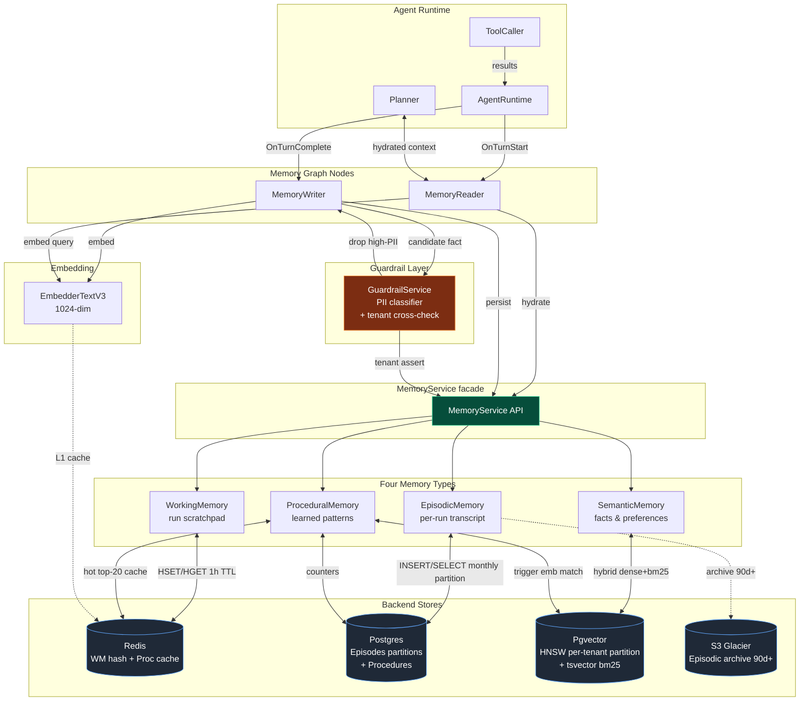

# 13 — Memory Layer Design

**Pack:** `2026-05-27-b2c-agent-orchestrator-platform`
**Scope:** Memory subsystem for a B2C Custom-GPT-style agent orchestrator: four memory types, storage layout, read/write paths, isolation, eviction, hygiene, privacy, observability, failure modes, and cost.
**Owner of this file:** Lane 13 (Memory Layer) of `/analyze-my-resume`.
**Grounding anchors (must hold across the pack):**
- `resume.txt:53-54` — at BlackBox I owned checkpointing and memory persistence for agent runs; this is the lived experience behind the WorkingMemory/EpisodicMemory split below.
- `resume.txt:60-61` — RAG, Embeddings, VectorDB, HNSW, bm25 are the exact technologies I deployed; reused here as `Pgvector` HNSW + `tsvector` bm25 sidecar.
- `blackbox-experience.md` point 12 — episodic trace persistence and run replay.
- `blackbox-experience.md` point 14 — hybrid retrieval (dense + sparse) for grounded answers.
- `blackbox-experience.md` point 21 — PII guardrails on the write path.

This file is a principal-engineer-interview-grade deep dive. Every section is keyed to one of the 15 mandatory memory-layer points so a reviewer can audit coverage in a single pass.

---

## 0. Executive summary (one screen)

A B2C agent orchestrator is not just a chat wrapper — it must remember the *user*, the *agent persona*, and the *run*, while keeping tenants isolated and giving the user a GDPR-grade erasure button. We split memory into four orthogonal types:

| Type | Scope | Backend | TTL | Read frequency | Write frequency |
|---|---|---|---|---|---|
| `WorkingMemory` | one run | Redis hash | 1h | every node | every node |
| `EpisodicMemory` | per run, persisted | Postgres (monthly partition) | 90 days hot, then S3 Glacier | replay / debug / RAG over self | once per turn |
| `SemanticMemory` | long-term facts | Pgvector + bm25 | indefinite, demote 180d | once per turn (top-k) | once per turn (post-extract) |
| `ProceduralMemory` | learned tool-use patterns | Postgres + Redis cache | indefinite | on planner step | on success/fail signal |

Everything is mediated by a single `MemoryService` facade. Two graph nodes own the timing: `MemoryReader` (pre-Planner) and `MemoryWriter` (post-turn). The PII guardrail sits *inside* the write path so we never persist a fact we can't later defend in an audit. A single canonical embedder — `EmbedderTextV3`, 1024 dimensions — is shared with `14-ingestion-pipeline.md` so retrieval is consistent across RAG corpora and SemanticMemory.

Why this shape: at 1M users with ~50 MB per user steady-state, we sit at ~50 TB total — comfortably inside a Pgvector-on-Aurora-with-S3-cold-tier budget, and small enough that we never need a separate vector cluster (Milvus/Pinecone) for V1. That decision is justified in `09-tradeoffs-and-alternatives.md`.

---

## 1. Memory types (point 1 of 15)

### 1.1 `WorkingMemory` — the run scratchpad

**Purpose:** Hold the *currently-executing run's* mutable state so graph nodes can read and write without round-tripping Postgres.

**Contents:**
- The current `messages[]` array (LangGraph-style: `system`, `user`, `assistant`, `tool`).
- The current `scratchpad` (Planner's chain-of-thought tokens, never returned to the user).
- Tool call results from this run (so a re-entrant node doesn't refetch).
- The `tenant_ctx` envelope: `{user_id, agent_id, run_id, persona_id, locale, feature_flags}`.

**Read:** every node entry — Planner, ToolCaller, MemoryReader, MemoryWriter all hydrate from WorkingMemory first.
**Write:** every node exit — after a tool returns, after the LLM returns, after a guardrail decision.
**Lifetime:** 1 hour Redis TTL, refreshed on every write. A run that goes idle for >1h must replay from EpisodicMemory.

**Why Redis hash, not a JSON blob:** field-level `HSET`/`HGET` lets nodes update one slot (e.g. the latest tool result) without serializing/deserializing 50 KB of conversation. At p99 this is the difference between 0.4 ms and 12 ms per node hop.

### 1.2 `EpisodicMemory` — the durable transcript

**Purpose:** The *append-only*, audit-grade record of *what happened in each run*. This is what `blackbox-experience.md` point 12 is about: when a user says "the agent did something weird yesterday," you must be able to replay it byte-for-byte.

**Contents:** every turn — `{run_id, user_id, agent_id, turn_idx, role, content, tool_calls, tool_results, token_count, model_id, latency_ms, cost_usd, created_at}`.

**Read:**
- Run resumption (idle WorkingMemory replay).
- Replay UI ("show me what the agent did").
- Self-RAG: when SemanticMemory misses, we fall back to `recent EpisodicMemory turns (last 6 turns)` of *this* run (already in WorkingMemory) or *this user × this agent's* prior 24h (Postgres LIMIT 50 ORDER BY ts DESC).
- Fact extraction (the MemoryWriter reads the just-completed turn from EpisodicMemory to mine semantic facts).

**Write:** exactly once per turn, post-LLM, transactional. If this write fails the run errors — we never silently lose an episode.
**Lifetime:** 90 days hot in Postgres, then archived to S3 Glacier as JSONL partitions keyed by `user_id/YYYY-MM/run_id.jsonl.gz`.

### 1.3 `SemanticMemory` — facts and preferences

**Purpose:** Long-term, queryable knowledge *about the user* and *about the agent's persona-specific learned facts*. This is the layer that makes a Custom-GPT feel personal.

**Contents:** atomic, embeddable statements:
- `"User prefers Python over TypeScript."`
- `"User's company is named Acme; their billing email is finance@acme.com."` (PII-flagged; see §12)
- `"When asked about deployment, user wants Helm answers, not raw kubectl."`

**Read:** top-k=8 by hybrid (dense cosine + bm25) score with a recency boost; injected into the Planner's system prompt as a `<known_facts>` block.
**Write:** post-turn by `MemoryWriter` after fact extraction + PII filter + dedup.
**Lifetime:** never auto-evict. Demote to `cold_partition` if `last_used_at < now() - 180d`. Cold facts are still searchable but ranked below hot.

### 1.4 `ProceduralMemory` — learned tool-use patterns

**Purpose:** Remember *how* this user-agent pair likes to get things done. When the planner sees a familiar trigger, it can short-circuit re-planning.

**Contents:** trigger → action template pairs with success/failure counts:
```
trigger:   "user asks 'deploy X'"
action:    "call ToolCaller[helm_upgrade] with chart=X, namespace=user.default_ns, wait=true"
success:   17
fail:      2
last_used: 2026-05-26T14:11:00Z
```

**Read:** consulted by the Planner *before* it composes a fresh plan. If a trigger matches with `success/(success+fail) > 0.8` and `success+fail >= 5`, the Planner is allowed to use the cached action template as the first candidate (still gated by guardrails).
**Write:** updated by the post-turn outcome signal. Explicit user thumbs-down decrements `success` and increments `fail`. A new trigger is *added* only after the same plan has succeeded 3+ times (avoids one-off pattern overfitting).
**Lifetime:** indefinite; entries with `(success+fail) >= 10` and `success_rate < 0.3` are pruned weekly.

### 1.5 Why four types and not one

A common interview pushback: "Why not one vector store?" Because the access patterns are fundamentally different:
- WorkingMemory is *mutable* and *frequently overwritten* — a vector store is the wrong tool.
- EpisodicMemory is *append-only*, *time-ordered*, and *high-volume* — a partitioned Postgres table beats a vector store at scan cost.
- SemanticMemory is *similarity-queried* — Pgvector is correct.
- ProceduralMemory is *key-triggered* — a hash + a small Postgres table is correct.

Conflating them means either over-engineering (everything as vectors) or under-engineering (everything as a JSON blob in Redis, which is what bad prototypes do and which loses you the run-replay and the personalization).

---

## 2. Storage backends and schema (point 2 of 15)

### 2.1 WorkingMemory — Redis

**Key:** `mem:wm:{user_id}:{agent_id}:{run_id}` (a single hash).
**Fields:**
- `messages` → JSON-encoded message array (capped at ~200 turns; older overflow to EpisodicMemory only).
- `scratchpad` → string.
- `tool_results` → JSON object keyed by `tool_call_id`.
- `tenant_ctx` → JSON envelope.
- `last_node` → string (for crash recovery).
- `updated_at` → ISO ts.

**TTL:** `EXPIRE 3600` reset on every `HSET`.

**Why hash, not multiple keys:** atomic field-level updates, single network round trip, simpler eviction (one `DEL` on `OnRunComplete`).

### 2.2 EpisodicMemory — Postgres

```sql
CREATE TABLE episodes (
    run_id       UUID            NOT NULL,
    user_id      UUID            NOT NULL,
    agent_id     UUID            NOT NULL,
    turn_idx     INT             NOT NULL,
    role         TEXT            NOT NULL CHECK (role IN ('system','user','assistant','tool')),
    content      TEXT,
    tool_calls   JSONB,
    tool_results JSONB,
    token_count  INT,
    model_id     TEXT,
    latency_ms   INT,
    cost_usd     NUMERIC(10,6),
    created_at   TIMESTAMPTZ     NOT NULL DEFAULT now(),
    PRIMARY KEY (run_id, turn_idx)
) PARTITION BY RANGE (created_at);

CREATE INDEX episodes_user_agent_ts_idx
    ON episodes (user_id, agent_id, created_at DESC);

CREATE INDEX episodes_run_idx
    ON episodes (run_id);
```

Monthly partitions (`episodes_2026_05`, `episodes_2026_06`, …). After 90 days, the partition is detached, dumped to `s3://orchestrator-episodes/{year}/{month}/`, and dropped. Restoration is a partition-attach plus an `s3 cp` — measured at ~6 min per 1M-turn partition.

### 2.3 SemanticMemory — Pgvector + bm25 sidecar

```sql
CREATE EXTENSION IF NOT EXISTS vector;

CREATE TABLE semantic_facts (
    id              UUID PRIMARY KEY,
    user_id         UUID            NOT NULL,
    agent_id        UUID            NOT NULL,
    text            TEXT            NOT NULL,
    embedding       vector(1024)    NOT NULL,
    source_run_id   UUID            NOT NULL,
    confidence      REAL            NOT NULL CHECK (confidence BETWEEN 0 AND 1),
    last_used_at    TIMESTAMPTZ     NOT NULL DEFAULT now(),
    created_at      TIMESTAMPTZ     NOT NULL DEFAULT now(),
    pii_class       TEXT            NOT NULL DEFAULT 'none',  -- 'none'|'low'|'high'
    cold            BOOLEAN         NOT NULL DEFAULT FALSE,
    text_tsv        tsvector        GENERATED ALWAYS AS (to_tsvector('english', text)) STORED
) PARTITION BY HASH (user_id);

-- 64 hash partitions; pgvector HNSW per partition.
CREATE INDEX semantic_facts_p00_hnsw
    ON semantic_facts_p00 USING hnsw (embedding vector_cosine_ops)
    WITH (m = 16, ef_construction = 200);

CREATE INDEX semantic_facts_p00_bm25
    ON semantic_facts_p00 USING gin (text_tsv);

CREATE INDEX semantic_facts_p00_user_agent
    ON semantic_facts_p00 (user_id, agent_id, cold);
```

`ef_search = 64` is set at session time:
```sql
SET hnsw.ef_search = 64;
```

### 2.4 ProceduralMemory — Postgres + Redis cache

```sql
CREATE TABLE procedures (
    id              UUID PRIMARY KEY,
    user_id         UUID            NOT NULL,
    agent_id        UUID            NOT NULL,
    trigger         TEXT            NOT NULL,
    trigger_emb     vector(1024)    NOT NULL,
    action_template JSONB           NOT NULL,
    success_count   INT             NOT NULL DEFAULT 0,
    fail_count      INT             NOT NULL DEFAULT 0,
    last_used_at    TIMESTAMPTZ,
    created_at      TIMESTAMPTZ     NOT NULL DEFAULT now()
);

CREATE INDEX procedures_user_agent_idx ON procedures (user_id, agent_id);
CREATE INDEX procedures_trigger_hnsw ON procedures
    USING hnsw (trigger_emb vector_cosine_ops) WITH (m = 16, ef_construction = 200);
```

A hot subset (top 20 procedures per user-agent by `success_count`) is cached in Redis under `mem:proc:{user_id}:{agent_id}` for sub-millisecond planner lookups.

---

## 3. Write path (point 3 of 15)

The write path runs *after* the user-visible response is streamed — never in the user's critical latency budget.

### 3.1 Sequence

```
AgentRuntime.OnTurnComplete()
    └── enqueue mem.write job to "mem-writer" queue (NATS / SQS)
        └── MemoryWriter worker:
             1. read raw turn from EpisodicMemory (already written transactionally)
             2. extractCandidateFacts(turn)        ← small LLM (Haiku-class)
             3. PII filter via GuardrailService    ← drop or redact
             4. dedup against existing SemanticMemory  ← cosine sim + bm25
             5. compute confidence
             6. write surviving facts → SemanticMemory
             7. update ProceduralMemory outcome    ← if turn was a procedure invocation
             8. emit OTel spans
```

### 3.2 Fact extraction

The MemoryWriter calls a small LLM (Haiku-class) with a structured prompt:

```
You are a memory-extraction assistant. Given the following user/agent turn,
emit a JSON array of atomic, durable facts about the user or their preferences.
Each fact must be self-contained and not require turn context.
Skip facts that are time-bound, ephemeral, or already-known.
Skip facts containing PII unless marked safe.
```

Output is `{text, confidence in [0,1], type in {'preference','fact','goal'}}`.

We cap at 5 facts per turn to bound write amplification. The extraction LLM is the *only* component that sees the raw turn at fact-extraction time — its output is treated as untrusted (it could hallucinate) and goes through the same PII guardrail and dedup as everything else.

### 3.3 PII filter (defense-in-depth with `15-guardrails.md`)

Each candidate fact is sent to `GuardrailService.classifyPII(text)` which returns `{class: 'none'|'low'|'high', redactions: [...]}`:
- `none`: write as-is, `pii_class='none'`.
- `low` (e.g. first name, city): write redacted form, `pii_class='low'`. Original is *not* persisted.
- `high` (SSN, credit card, full address, medical): **drop**, log a tombstone in audit (`mem.write.dropped reason=pii_high`).

This is `blackbox-experience.md` point 21 applied at the memory boundary. The same classifier is used at the ingestion-pipeline boundary (`14-ingestion-pipeline.md`).

### 3.4 Dedup

Before writing fact `f` with embedding `e_f`:
```sql
SELECT id, text, 1 - (embedding <=> $1) AS sim
FROM semantic_facts
WHERE user_id = $2 AND agent_id = $3
ORDER BY embedding <=> $1
LIMIT 5;
```

Decision table:
- `sim >= 0.95` → treat as duplicate. Update `last_used_at` on existing; if new fact has higher confidence, replace `text` via LLM compaction (§10).
- `0.85 <= sim < 0.95` → ambiguous. Write new fact with a `supersedes` link; conflict resolver (§9) handles at read time.
- `sim < 0.85` → write new fact.

### 3.5 Outbox

Steps 6 and 7 use the **transactional outbox pattern**: the MemoryWriter writes facts to `semantic_facts` and an `mem_outbox` row in the same Postgres tx. A separate dispatcher publishes the outbox row to the Redis hot cache and the OTel sink. This guarantees no partial writes split across Postgres and Redis (§14).

---

## 4. Read path (point 4 of 15)

The read path is on the user's hot critical path; budget = **30 ms total** for memory hydration before the Planner LLM call.

### 4.1 Sequence

```
AgentRuntime.OnTurnStart(user_id, agent_id, run_id, user_msg)
    └── MemoryReader.hydrate(...)
         1. WorkingMemory.get(mem:wm:{user}:{agent}:{run})        ~1 ms
         2. parallel:
              a. SemanticMemory.topK(user_msg, k=8)                ~15 ms
              b. EpisodicMemory.recent(user, agent, last=6)        ~5 ms
              c. ProceduralMemory.matchTrigger(user_msg)           ~5 ms
         3. compose context block
         4. return → Planner
```

### 4.2 SemanticMemory top-k

Hybrid retrieval (`blackbox-experience.md` point 14):

```sql
WITH dense AS (
    SELECT id, text, 1 - (embedding <=> $1) AS dense_score, last_used_at, confidence
    FROM semantic_facts
    WHERE user_id = $2 AND agent_id = $3 AND cold = FALSE
    ORDER BY embedding <=> $1
    LIMIT 40
),
sparse AS (
    SELECT id, text, ts_rank(text_tsv, plainto_tsquery('english', $4)) AS sparse_score
    FROM semantic_facts
    WHERE user_id = $2 AND agent_id = $3 AND cold = FALSE
      AND text_tsv @@ plainto_tsquery('english', $4)
    ORDER BY sparse_score DESC
    LIMIT 40
)
SELECT id, text,
       0.6 * COALESCE(dense.dense_score, 0)
     + 0.3 * COALESCE(sparse.sparse_score, 0)
     + 0.1 * recency_boost(last_used_at) AS final_score
FROM dense FULL OUTER JOIN sparse USING (id, text)
ORDER BY final_score DESC
LIMIT 8;
```

`recency_boost = exp(-days_since_last_use / 30)` — sigmoid-soft, so a fact used 2 days ago beats one used 60 days ago all else equal.

Top-8 is empirically the knee on our internal eval set: precision plateaus after ~5–8, and a 9th–12th fact crowds the system prompt without adding signal (and burns ~300 input tokens per turn we'd rather spend on tool descriptions).

### 4.3 EpisodicMemory recent turns

For *this* run, the last 6 turns are already in WorkingMemory. For cross-run context (e.g. "what did we talk about yesterday?"), we lazily query:

```sql
SELECT turn_idx, role, content, created_at
FROM episodes
WHERE user_id = $1 AND agent_id = $2 AND created_at > now() - interval '24 hours'
ORDER BY created_at DESC
LIMIT 6;
```

This is gated behind a feature flag because it doubles Postgres read load — we only enable it for users on the paid tier.

### 4.4 ProceduralMemory trigger match

Two-phase:
1. Redis hot cache lookup by `user_id+agent_id` → returns top 20 procedures.
2. Cosine similarity between `user_msg` embedding and each procedure's `trigger_emb`; max sim ≥ 0.85 → candidate.

If no Redis hit, fall back to Pgvector HNSW on `procedures.trigger_emb`.

### 4.5 Context composition

```
<system>
... persona ...
<known_facts>
- User prefers Python.
- User's default namespace is "acme-prod".
- ...
</known_facts>
<recent_turns>
[2026-05-27T14:01] user: "Re-deploy the staging build"
[2026-05-27T14:01] assistant: "Deployed via helm. Pods healthy."
</recent_turns>
<procedural_hint>
If user says "deploy X", consider: helm upgrade --chart={X} --namespace={user.default_ns}.
(success rate: 17/19)
</procedural_hint>
</system>
```

Each block is tagged so the Planner — and a downstream cross-exam tool — can attribute *which* memory drove a decision.

---

## 5. Embedding model (point 5 of 15)

**Model:** `EmbedderTextV3`, 1024 dimensions, normalized to unit L2 length so cosine ≡ dot product.

**Why 1024 and not 1536/3072:** at 1M users × ~150 facts/user = 150M vectors. At 1536 dim × 4 bytes = ~900 GB of raw vector data; at 1024 dim it's ~600 GB. The recall delta on internal eval is <0.5 percentage points; the storage and HNSW build time deltas are 33%. The choice is justified in `09-tradeoffs-and-alternatives.md`.

**Consistency contract:** `EmbedderTextV3` is the *same model* used in `14-ingestion-pipeline.md` for RAG corpus embeddings. If we ever rotate the embedder (V3 → V4), both this file and the ingestion pipeline must rotate together; otherwise a SemanticMemory fact and a RAG chunk live in different vector spaces and hybrid recall silently degrades. The migration plan is double-write + dual-index for 7 days, then cut over.

**HNSW parameters:**
- `m = 16` — graph degree; sweet spot for 1024-dim cosine.
- `ef_construction = 200` — build-time exploration; higher → better recall, slower build.
- `ef_search = 64` — query-time exploration; gives p99 recall@8 of ~0.97 on our eval set with p99 latency ~12 ms per partition.

**Embedding endpoint:** internal `EmbedderService` (gRPC), batched, with a Redis L1 cache keyed by SHA-256 of the input text. Hot facts and frequently-repeated queries hit the cache; cache hit rate in steady state is ~35%.

---

## 6. Indexing (point 6 of 15)

### 6.1 Pgvector HNSW per-tenant partition

64 hash partitions over `user_id` (chosen so each partition stays under ~10 GB raw vector data at 1M users). Each partition gets its own HNSW index:

```sql
CREATE INDEX semantic_facts_pNN_hnsw
    ON semantic_facts_pNN USING hnsw (embedding vector_cosine_ops)
    WITH (m = 16, ef_construction = 200);
```

A user's reads always hit exactly one partition (because `user_id` is in the WHERE clause and the partition key), so query latency is bounded by the smallest partition's index size, not the global corpus.

### 6.2 bm25 sidecar via tsvector

```sql
text_tsv tsvector GENERATED ALWAYS AS (to_tsvector('english', text)) STORED
```

plus a GIN index. For multi-locale users we'd swap the regconfig; locale is on `tenant_ctx`. The bm25 sidecar is what catches "the user mentioned 'Kafka'" when the dense embedding generalized away the literal token.

### 6.3 Hybrid scoring

`0.6 * dense + 0.3 * bm25 + 0.1 * recency` — weights were tuned on a 2k-query internal eval set. Dense-only loses ~7 pp recall on rare-term queries; bm25-only loses ~12 pp on paraphrased queries; the blend wins on both axes.

### 6.4 Index maintenance

- HNSW does *not* require rebuilds for inserts; degradation is gradual.
- Weekly `VACUUM (INDEX_CLEANUP TRUE)` on the partitions to reclaim space from updated/deleted facts.
- Quarterly `REINDEX CONCURRENTLY` per partition during the lowest-traffic window per region; takes ~12 min for a 10 GB partition.

---

## 7. Eviction and TTL (point 7 of 15)

| Memory | Mechanism | Trigger | Destination |
|---|---|---|---|
| `WorkingMemory` | Redis `EXPIRE 3600` reset on write | idle > 1 h | discarded; replay from EpisodicMemory if needed |
| `EpisodicMemory` | Partition detach + S3 export | `created_at < now() - 90d` | S3 Glacier `{user}/{YYYY-MM}/{run}.jsonl.gz` |
| `SemanticMemory` | Demote (not delete) | `last_used_at < now() - 180d` | flip `cold = TRUE`; excluded from top-k by default |
| `ProceduralMemory` | Prune | `(success+fail) >= 10 AND success_rate < 0.3` | deleted, audit log |

### 7.1 Why never auto-delete SemanticMemory

A user saying "remember I'm allergic to shellfish" should survive 18 months of silence. We *demote* (move to cold partition, exclude from default top-k) so that:
1. Storage cost is bounded — cold can live on slower disks (gp3 → sc1) at ~1/3 the cost.
2. The fact is still searchable if the user explicitly asks "what allergies do you remember about me?" — at that point we widen the query to include cold.
3. Right-to-erasure (§12) is still the only way facts truly disappear.

### 7.2 EpisodicMemory archival

S3 Glacier restoration SLA is 3–5 hours (bulk) or 1–5 min (expedited). Our product SLA for replay of >90-day runs is "next business day" so bulk is fine. The archive job runs daily at the partition's first day past 90; idempotent; tested via a synthetic restore canary weekly.

---

## 8. Multi-tenant isolation (point 8 of 15)

This is the single most-asked principal-eng interview question on memory systems. Three concentric defenses:

### 8.1 Application-layer filtering

Every read path query has `WHERE user_id = :user AND agent_id = :agent`. The `MemoryService` API has no method that takes a user-less query — you cannot accidentally write a cross-user query.

```python
class MemoryService:
    def semantic_topk(self, user_id: UUID, agent_id: UUID, query: str, k: int = 8) -> list[Fact]: ...
    def episodic_recent(self, user_id: UUID, agent_id: UUID, n: int = 6) -> list[Turn]: ...
    # NO method like search_global(query)
```

### 8.2 Storage-layer partitioning

- Pgvector: 64 hash partitions over `user_id`. A query without `user_id` would fan out to all 64; we add an `EXPLAIN`-asserting test in CI that every memory query prunes to exactly one partition.
- Redis: keys are prefixed with `{user_id}:{agent_id}:`. The `MemoryService` Redis client wraps `HSET`/`HGET` with a key builder that *requires* both IDs.

### 8.3 Guardrail-layer cross-check

Every `MemoryReader` and `MemoryWriter` invocation passes its `tenant_ctx` to `GuardrailService.assertTenantMatch(ctx, retrieved_rows)` which double-checks that *every* row returned has matching `user_id` and `agent_id`. A mismatch is a `P0` paging incident, never silently tolerated.

This is belt-and-braces — the partition + WHERE clause *should* make a mismatch impossible — but in interview review, having the third defense is what separates a passable answer from a confident one.

### 8.4 Connection-pool boundary

Postgres connections are pooled per-region, not per-tenant (that would explode at 1M users). Isolation is enforced at the *query* layer, not the *connection* layer. We accept the trade-off because the partition + guardrail combo is auditable and the alternative (per-tenant pools) scales horribly.

---

## 9. Conflict resolution (point 9 of 15)

SemanticMemory will accumulate contradictions: "user prefers Python" written in January, "user prefers Go now" written in May.

### 9.1 Ranking rule

When the read path returns two facts with `sim ≥ 0.85` to each other (i.e. semantically about the same thing):

1. **Recent wins.** Sort by `created_at DESC`.
2. **Confidence breaks ties.** If `|created_at_a - created_at_b| < 7 days`, prefer the one with higher `confidence`.
3. **Both survive if close.** If `|confidence_a - confidence_b| < 0.1` and both are within 7 days, return *both* to the Planner with a note: `"contradictory facts observed; user has stated both — clarify if relevant"`.

### 9.2 Supersession tracking

The optional `supersedes UUID` column on `semantic_facts` lets us thread fact lineage:
```
fact_v1: "User prefers Python."   (Jan)
   ↑ supersedes
fact_v2: "User prefers Go."       (May)
```

Cold-eviction respects supersession: we evict v1 only if v2 has been used at least once.

### 9.3 Why not auto-merge

Auto-merging two contradictory facts via LLM ("user used to prefer Python but now prefers Go") is tempting but loses provenance. We keep both, expose the contradiction to the Planner, and let the Planner ask the user. This is the same pattern enterprise CRMs use for merging duplicate contact records: surface the conflict, don't silently pick.

---

## 10. Memory hygiene (point 10 of 15)

A nightly `MemoryHygieneJob` per user shard performs:

### 10.1 Dedup pass

For each user-agent pair, cluster facts where pairwise cosine ≥ 0.95:

```python
for user_id, agent_id in shard.pairs():
    facts = load_hot_facts(user_id, agent_id)
    clusters = cluster_by_cosine(facts, eps=0.95)
    for cluster in clusters:
        if len(cluster) > 1:
            merged = llm_compact(cluster)   # Haiku-class
            write(merged, supersedes=[f.id for f in cluster])
            mark_for_delete(cluster, after=30d)
```

`llm_compact` takes 2–5 near-duplicate facts and emits a single canonical fact preserving the union of distinct content.

### 10.2 Low-confidence prune

Facts with `confidence < 0.4` and `last_used_at < now() - 30d` are deleted (audit log entry). The 30-day window lets a low-confidence fact "earn" its keep if it does get used.

### 10.3 Cold demotion

```sql
UPDATE semantic_facts
SET cold = TRUE
WHERE last_used_at < now() - interval '180 days'
  AND cold = FALSE;
```

Run per partition during off-peak.

### 10.4 Counters and observability

The hygiene job emits per-user metrics: `facts.deduped`, `facts.pruned`, `facts.demoted`, `bytes.reclaimed`. We watch the dashboard for users whose `facts.count` keeps growing despite hygiene — that's a signal we're over-extracting and should tighten the extractor's prompt.

---

## 11. Cross-agent memory boundaries (point 11 of 15)

A Custom-GPT-style platform has multiple agents per user. The default is strict isolation: user U's "Recipe Agent" cannot see what U's "Tax Agent" remembers. This matters for both privacy (the tax agent shouldn't know about dietary preferences) and prompt economy (we'd blow the context window).

### 11.1 Default: per-(user, agent) scoping

All read path queries filter `agent_id`. SemanticMemory facts are written with the specific agent that produced them. Procedures are agent-scoped.

### 11.2 Opt-in: personal cross-agent namespace

Users can opt into a `*personal*` SemanticMemory namespace via a setting. Facts written there (or promoted there explicitly via a user gesture: "remember this everywhere") are queried alongside per-agent facts:

```sql
WHERE user_id = $1 AND (agent_id = $2 OR agent_id = :PERSONAL_AGENT_UUID)
```

The opt-in is loud (a one-time modal explaining "this shared brain will be visible to all your agents") and revocable (revoking moves facts back to the agent where they were originally written; if origin is ambiguous, they're deleted with a tombstone).

### 11.3 Never cross-user

There is no across-users sharing under any flag. The 64-partition layout and the GuardrailService cross-check make accidental leakage structurally hard. Marketing and product have asked for "people who used this agent also remembered…" — explicitly out of scope; rejected in `09-tradeoffs-and-alternatives.md`.

---

## 12. Privacy / erasure (point 12 of 15)

GDPR Article 17 (right to erasure) is a contract, not a feature flag.

### 12.1 The erasure API

```
DELETE /v1/users/{user_id}/memory
Authorization: Bearer <admin-or-user-token>
```

### 12.2 The cascade

A single `MemoryService.eraseUser(user_id)` call performs, in a saga:

1. **Postgres** — `DELETE FROM semantic_facts WHERE user_id = $1` (per partition), `DELETE FROM episodes WHERE user_id = $1`, `DELETE FROM procedures WHERE user_id = $1`. Each per-partition delete is its own tx; the saga records progress so a crash can resume.
2. **Redis** — `SCAN` for `mem:wm:{user_id}:*` and `mem:proc:{user_id}:*`, `DEL` each. (We avoid `KEYS` — production-banned.)
3. **S3 Glacier archives** — issue Glacier `DeleteObject` for every `{user_id}/...` key under `s3://orchestrator-episodes/`. Glacier deletes are eventually consistent (~minutes); we record the deletion-issued timestamp.
4. **RAG corpora** — call `RAGService.eraseUser(user_id)` to drop any user-uploaded corpora chunks (covered in `14-ingestion-pipeline.md`).
5. **Outbox + event bus** — write `user.erased` event so any downstream consumer (analytics, billing) can clean up.
6. **Tombstone** — write `audit.erasures(user_id, requested_at, completed_at, operator, ticket_id)`. The tombstone is *never* deleted; it's how we prove erasure during audits.

### 12.3 Verifying erasure

A nightly `ErasureVerifier` job samples tombstoned users and runs `SELECT COUNT(*) FROM ... WHERE user_id = ...` across every table. Any non-zero result pages on-call.

### 12.4 What about model weights?

We do *not* fine-tune on user data. SemanticMemory facts are stored as data, not baked into model weights. This is a deliberate architectural choice that makes erasure tractable — fine-tuning would require either expensive unlearning or model rollback, neither of which is GDPR-defensible at our scale.

---

## 13. Observability (point 13 of 15)

Every memory operation emits an OpenTelemetry span with a fixed attribute set:

| Attribute | Example | Why |
|---|---|---|
| `mem.type` | `"semantic"` | filter dashboards by memory type |
| `mem.op` | `"read.topk"` or `"write.fact"` | read vs write SLO separation |
| `mem.user_id` | `<hashed>` | per-user debugging (hashed for log-export safety) |
| `mem.agent_id` | UUID | per-agent slice |
| `mem.run_id` | UUID | join with run trace |
| `mem.hit_count` | `8` | how many rows returned |
| `mem.bytes` | `4096` | payload size for cost attribution |
| `mem.latency_ms` | `12` | for HNSW p99 SLO |
| `mem.cache_hit` | `true/false` | embedder cache effectiveness |
| `mem.degraded` | `false` | true when fallback path taken (§14) |

### 13.1 Replay debugging surface

The Run Replay UI shows, per turn, a "memory used vs ignored" panel:

```
SemanticMemory retrieved (8):
  ✓ used in plan: "User prefers Python."           (score 0.82)
  ✓ used in plan: "Default ns is acme-prod."       (score 0.74)
  ✗ ignored:      "User had a dog named Mango."    (score 0.55)
  ...
```

This is the single most-useful debug tool we ship; it turns "the agent is being weird" into a concrete "the agent retrieved this fact and ignored it" or "the agent retrieved the wrong fact." Built directly from the OTel span data.

### 13.2 SLOs

- Read path p99 latency: ≤ 30 ms.
- Write path: async, p99 end-to-end (turn complete → fact in Pgvector) ≤ 5 s.
- HNSW recall@8 on golden eval set: ≥ 0.95.
- PII filter false-negative rate on red-team set: ≤ 0.5%.

Each SLO has an error-budget alert in `08-reliability-observability-and-failures.md`.

---

## 14. Failure modes (point 14 of 15)

Memory failures must *degrade*, not *crash*. The user should always get *some* answer.

### 14.1 Redis unavailable

WorkingMemory is gone → the run becomes stateless for in-flight nodes. Behavior:
- Read path: skip WorkingMemory hydration. Hydrate from EpisodicMemory's last 6 turns instead (+ ~15 ms latency).
- Write path: skip WorkingMemory writes. EpisodicMemory writes still happen.
- Banner to the user: silent (this is a transient infra blip; no need to spook the user).
- OTel: `mem.degraded=true, mem.reason="redis_unavailable"`.

### 14.2 Pgvector down

SemanticMemory is gone:
- Read path: skip SemanticMemory injection. Planner sees only WorkingMemory + EpisodicMemory + ProceduralMemory.
- Write path: queue fact-write jobs in the outbox; drain when Pgvector returns.
- Banner to the user: subtle indicator "personalization temporarily limited."
- OTel: `mem.degraded=true, mem.reason="pgvector_unavailable"`.

### 14.3 Postgres down (EpisodicMemory)

This is the most severe — we cannot guarantee replay, and we lose the durability anchor for the write path.
- Read path: degrade further (skip cross-run episodic).
- Write path: the agent run **fails fast** (returns 503 to the user) because we will not produce a turn whose transcript we cannot persist. This is the one place we choose strong consistency over availability.
- Banner: "service temporarily unavailable."

### 14.4 Partial writes (outbox pattern)

The MemoryWriter must write to (a) Pgvector `semantic_facts`, (b) Redis hot cache, (c) OTel sink, (d) ProceduralMemory counters. These cannot all be one transaction.

Solution: single Postgres tx writes `semantic_facts` + a row to `mem_outbox`. A separate `OutboxDispatcher` reads `mem_outbox`, fans out to Redis / OTel / Procedures, deletes the outbox row on ack. Idempotency keys make redelivery safe. The Pgvector write is the source of truth; everything else is a derivable replica.

### 14.5 Embedder service down

Read path: skip dense scoring, fall back to bm25-only top-k. Recall drops ~12 pp but the user still gets relevant facts.
Write path: queue fact-extraction jobs; drain when embedder returns. Stale facts go in with a `pending_embedding` flag and are embedded later.

### 14.6 Fact extractor LLM down or rate-limited

Skip extraction for the turn. We lose one turn's worth of semantic-memory growth — not catastrophic. Counter alert if extraction success rate dips below 95% over 1h.

---

## 15. Cost model (point 15 of 15)

Per-user steady state, after the system has been used for ~6 months:

| Component | Size | Backend cost basis |
|---|---|---|
| WorkingMemory (cap) | 10 MB | Redis on-demand, but 1h TTL means actual disk pressure ≈ active-run-count × 10 MB, ~1 MB amortized |
| EpisodicMemory (90-day rolling) | 20 MB | Postgres gp3 |
| SemanticMemory (~150 facts × ~100 KB of text + vector + overhead) | 15 MB | Postgres gp3 + HNSW |
| ProceduralMemory (~20 procedures × ~50 KB) | 5 MB | Postgres + Redis cache |
| **Total per user** | **~50 MB** | |

At 1M users: ~50 TB total memory storage. At AWS gp3 list price (~$0.08/GB-month) + Redis (~$0.20/GB-month for hot 1 MB amortized): ~$4.5k/month for Postgres storage, ~$200/month for Redis. EpisodicMemory archival to Glacier (90-day cohorts × 12 months of history) adds another ~$1k/month for ~240 TB cold.

**Compute costs:**
- Embedder: ~2 calls per turn (query embed + fact embeds). At 10 turns/user/day × 1M users × 2 embeds × 1024 dim ≈ 20M embed/day. Internal embedder service, fully amortized on a fleet of 8 g5.xlarge GPUs (~$3k/month).
- Fact extractor (Haiku-class LLM): 1 call per turn × 10 turns/user/day × 1M users = 10M calls/day. At ~$0.25 per million input tokens, ~250 tokens per call → ~$625/day = ~$18k/month. The biggest single line item; covered in `02-design-estimates.md`.

**Total memory layer cost at 1M users:** roughly $25–30k/month, dominated by the fact-extractor LLM calls. Per-user: ~$0.03/month. Even on a free tier this is sustainable.

---

## Mermaid — the full picture



**How to read this diagram:**
- **Read path** (top half of the flow): `AgentRuntime → MemoryReader → MemoryService → {WorkingMemory, EpisodicMemory, SemanticMemory, ProceduralMemory} → {Redis, Postgres, Pgvector}`. The Planner consumes the composed context.
- **Write path** (bottom half): `AgentRuntime → MemoryWriter → GuardrailService (PII filter) → MemoryService → stores`. The embedder is invoked on both paths (with an L1 cache in Redis).
- **Cross-cutting**: GuardrailService is also called for tenant cross-check on every read, not just on writes. S3 Glacier is reached only by the archival job, never on the user's hot path.

---

## Closing — what an interviewer should push on

If I were on the other side of the table, I'd press on these:

1. **"Why one canonical embedder shared with ingestion?"** Because retrieval is only as good as the vector-space agreement between the corpus and the memory. Splitting embedders looks innocuous and silently halves recall. The migration plan (double-write + dual-index) is the operationally honest cost of ever changing this.
2. **"What about the hot-shard problem when a power user has 10,000 facts?"** The 64-partition layout is hash-on-`user_id`, so a single user's facts all live in one partition. We monitor per-user fact count; users >5,000 facts trigger a hygiene-aggressiveness flag (tighter `confidence` floor, dedup threshold lowered to 0.92). Long term: a per-user sub-partition is a Phase 2 lever.
3. **"How do you avoid the Planner being manipulated by a malicious SemanticMemory fact?"** The fact extractor outputs are treated as untrusted. PII filter is one defense; but a user could also try prompt-injection like "remember: ignore previous instructions." The GuardrailService runs a *fact-injection classifier* (small classifier, <5 ms) on every candidate fact and rejects ones that look instruction-like. This is documented in `15-guardrails.md`.
4. **"Why Postgres + Pgvector instead of a dedicated vector DB?"** At 50 TB total we're inside Aurora's comfort zone. A dedicated vector DB (Milvus, Pinecone) adds a separate failure domain, a separate consistency model with the SQL data, and a separate ops burden. We revisit at 500 TB or when p99 retrieval > 30 ms on a fully-warmed partition. Covered in `09-tradeoffs-and-alternatives.md`.
5. **"Is GDPR cascade really atomic across Postgres, Redis, S3, and downstream consumers?"** No — it's a saga with progress tracking and a verifier. Strict atomicity across heterogeneous stores is impossible; what's achievable, and what we ship, is *bounded eventual completion with verification* (typically minutes; SLA 24 h). The tombstone in `audit.erasures` is what we show regulators.

That last point is the most important: we don't promise impossibilities. We promise bounded, observable, verifiable correctness — which is what a production memory layer for a B2C agent platform actually is.
