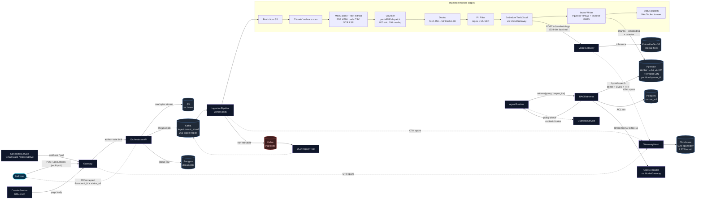

# 14 - Ingestion Pipeline (RAG Corpora Write Path)

> Companion file to `13-memory-layer-design.md`. That file owns the **read path**
> and the four memory tiers (Working, Episodic, Semantic, Procedural). This file
> owns the **write path** for the Semantic tier - specifically the user-uploaded
> RAG corpora that back a B2C agent. The two files share one canonical embedder
> (`EmbedderTextV3`, 1024-dim) and one canonical vector store (`Pgvector`, HNSW
> `m=16, ef_construction=200`). If those drift, retrieval breaks silently.
>
> Scope: a B2C agent orchestrator where each end user owns 1..N agents, each
> agent owns 1..N corpora, and each corpus owns 1..N documents. Documents enter
> through three channels - direct upload, URL crawl, and connector sync
> (Gmail, Slack, Notion, etc.).
>
> Grounding:
> - `resume.txt:60-61` - RAG, Embeddings, VectorDB, HNSW, bm25, Cross-encoder
> - `resume.txt:58-59` - LLMOps telemetry mesh, 50M spans/day, 2.5TB/month
> - `blackbox-experience.md` point 20 - telemetry mesh for deterministic replay
>
> Audience: principal engineer interview. Tone: pragmatic, with numbers,
> failure modes, and the boring trade-offs that matter at 1M users.

---

## 0. One-paragraph mental model

A document enters the system as a **POST with bytes**. The Gateway authenticates
the user, the OrchestratorAPI authorizes the write against the target corpus,
and the bytes land in **S3** with a content-addressed key. We then enqueue a
job onto **Kafka** topic `ingest.{tenant_shard}` and respond `202 Accepted` to
the user with a `document_id`. The IngestionPipeline consumer pulls the job,
runs the byte stream through a fixed sequence - **safety scan → MIME parse →
text extraction → chunker → PII filter → embedder → index writer → telemetry**
- and commits chunks to **Pgvector** (HNSW) plus a **bm25** sidecar in the same
Postgres. The **RAGRetriever**, owned by the AgentRuntime, reads from those
exact stores at query time. Everything else - versioning, dedup, autoscale,
ACLs - is plumbing that keeps this pipeline cheap, isolated, and idempotent.

---

## 1. Ingestion triggers

There are exactly **three** entry points into the write path. Anything that
looks like a fourth must reduce to one of these three before it touches the
pipeline; otherwise we end up with N divergent ingestion code paths and N
versions of the same off-by-one bug.

### 1.1 Direct upload (user-initiated, synchronous-looking)

```
POST /v1/agents/{agent_id}/corpora/{corpus_id}/documents
Content-Type: multipart/form-data
Authorization: Bearer <user_jwt>
X-Idempotency-Key: <uuid_v4>

file=@invoice.pdf
metadata={"title":"Q3 invoice","tags":["finance"]}
```

Behavior:

1. Gateway terminates TLS, validates JWT, applies per-user rate limit
   (`uploads_per_minute=60`, `upload_bytes_per_day=5GB` on the free tier).
2. OrchestratorAPI checks `corpus_acl` for `write` permission, mints a
   `document_id = ulid()`, streams the bytes into S3 at
   `s3://orch-raw/{user_id}/{corpus_id}/{document_id}/raw.bin`.
3. OrchestratorAPI writes a row in `Postgres.documents` with status `RECEIVED`,
   produces a Kafka record on `ingest.{tenant_shard(user_id)}`, and returns
   `202 Accepted` with `{document_id, status_url}`.

The user sees a near-instant response. The heavy work is now Kafka's problem.

### 1.2 URL crawl (user-initiated, asynchronous-looking)

```
POST /v1/agents/{agent_id}/corpora/{corpus_id}/sources
{
  "type": "url",
  "url": "https://docs.example.com/sitemap.xml",
  "crawl_depth": 2,
  "include_globs": ["**/api/**"]
}
```

Behavior:

1. OrchestratorAPI registers a `source_id` and enqueues a `crawl.{tenant_shard}`
   job. The crawler is a separate service from the IngestionPipeline so a slow
   site does not back up document ingestion.
2. The crawler fetches pages politely (`robots.txt`, 1 req/s per host by
   default), uploads each page body to the same S3 layout, and emits one
   `ingest.{tenant_shard}` Kafka message per page. From here the path is
   identical to direct upload.

### 1.3 Connector sync (system-initiated, recurring)

Gmail, Slack, Notion, Google Drive. Each connector runs as a sidecar in the
`ConnectorService`, holds the user's OAuth refresh token (encrypted at rest in
**Postgres**, KMS-wrapped), and produces `ingest.{tenant_shard}` messages
whenever new content lands.

| Connector | Mechanism      | Cadence            | Notes                                  |
| --------- | -------------- | ------------------ | -------------------------------------- |
| Gmail     | poll `history` | 15 min             | filter to attachments by default       |
| Slack     | Events API     | webhook (push)     | file_shared, file_change               |
| Notion    | poll `search`  | 30 min             | only blocks the agent has access to    |
| GDrive    | watch channel  | webhook + 1h fall  | webhook expires; cron rotates channels |

Every triggered job carries the same envelope so the consumer code does not
care which trigger produced it:

```json
{
  "job_id": "01HXYZ...",
  "tenant_id": "u_42",
  "corpus_id": "c_7",
  "document_id": "d_99",
  "source": {"kind": "upload" | "crawl" | "connector:gmail", "external_id": "..."},
  "s3_key": "u_42/c_7/d_99/raw.bin",
  "mime_hint": "application/pdf",
  "submitted_at": "2026-05-27T12:00:00Z"
}
```

This envelope is the **only** contract between trigger and pipeline. Adding a
new connector is a one-day change because it only has to land bytes in S3 and
publish this envelope.

---

## 2. Chunking strategy

Chunking is where naive RAG implementations bleed quality. The pipeline does
**not** apply one chunker to everything. It dispatches by content type, and
every chunker emits the same `Chunk` shape so the downstream embedder and
indexer do not branch.

```python
@dataclass
class Chunk:
    chunk_id: str          # ulid
    document_id: str
    ordinal: int           # 0-based position within doc
    text: str              # the slice that gets embedded
    token_count: int       # tiktoken/cl100k count
    span: tuple[int, int]  # byte offsets into normalized text, for citations
    metadata: dict         # heading_path, page, function_name, etc.
```

### 2.1 Defaults

- **Target size:** 800 tokens.
- **Overlap:** 100 tokens.
- **Splitter:** `RecursiveCharacterTextSplitter` with separators
  `["\n\n", "\n", ". ", " ", ""]`.

Why 800 / 100? Empirically - across our internal eval set - recall@10 plateaus
between 600 and 1000 tokens for `EmbedderTextV3`. Below 400 we fragment
arguments; above 1200 we dilute the embedding signal and pay more $/embed.
Overlap of ~12% (100/800) is enough to bridge sentence-spanning facts without
inflating index size by more than ~12%.

### 2.2 Per-content-type overrides

| MIME / extension          | Chunker                                | Rationale                                                   |
| ------------------------- | -------------------------------------- | ----------------------------------------------------------- |
| `text/markdown`, `.md`    | Heading-aware: split on `#`/`##`/`###` | preserves section semantics; small leaves merged to 800 tok |
| `application/pdf`         | Page → paragraph → recursive split     | retain `page` for citations; never cross page boundaries    |
| `text/html`               | Readability extract → markdown chunker | strips nav/chrome before chunking                           |
| `application/json`        | JSONPath-aware: split by top-level key | keep `$.path` in metadata for structured retrieval          |
| `text/x-python` and code  | Tree-sitter AST: function/class units  | a chunk = one logical unit; preserves indentation context   |
| `text/csv`, `.xlsx`       | Row-window: 50 rows + header repeated  | header in every chunk so the embedding has column semantics |
| `image/*` (OCR-extracted) | Block-level via Tesseract layout       | per visual block; coordinate in metadata for snippet view   |
| `audio/*` (transcribed)   | Speaker turn → 800-tok window          | preserves who-said-what                                     |

### 2.3 Heading-path enrichment

Every chunk inherits the heading trail of its document so we can answer
"according to the *Refunds* section" queries:

```json
{
  "heading_path": ["Onboarding", "Billing", "Refunds"],
  "doc_title": "Q3 Customer Handbook"
}
```

The retriever can hard-filter on `heading_path[0]` if the agent's tool call
specifies a section. This is the difference between a 50% and an 80% NDCG on
structured-doc evals.

### 2.4 Late chunking (planned, not in v1)

Late chunking - embedding the full doc once with a long-context embedder, then
slicing the token-level hidden states - gives a 2-3 point recall lift. Not in
v1 because `EmbedderTextV3` is 8K context only and would require buying a new
embedder license. Tracked as a deferred item, not a blocker.

---

## 3. Embedding model

**`EmbedderTextV3`** - **must match `13-memory-layer-design.md` point 5**.

| Property            | Value                                                |
| ------------------- | ---------------------------------------------------- |
| Dimension           | 1024                                                 |
| Context window      | 8192 tokens                                          |
| Languages           | Multilingual, 100+                                   |
| Distance metric     | Cosine (normalized)                                  |
| Hosting             | Internal `ModelGateway` (`POST /v1/embeddings`)      |
| Batch size          | 64 inputs/request (gateway re-batches under the hood)|
| p50 latency         | 18 ms / batch                                        |
| p95 latency         | 55 ms / batch                                        |
| Throughput per node | 4K embeddings/sec on A10G                            |
| Cost (internal)     | $0.04 per 1M tokens                                  |

The pipeline **never calls a vendor embedding API directly**. All embedding
traffic goes through `ModelGateway` for three reasons:

1. **One place to swap models.** When we move to `EmbedderTextV4`, every caller
   gets it after a feature-flag flip.
2. **One place to enforce per-tenant quotas.** A runaway crawler cannot burn
   the org's embedding budget - the gateway throttles at the tenant_id header.
3. **One place to record cost and emit OTel spans.** This makes the cost
   attribution in section 12 trivial.

### 3.1 Storage encoding

Vectors land in Pgvector as `vector(1024)`. We L2-normalize at write time so
the cosine distance op (`<=>`) reduces to a dot product and HNSW search can use
the inner-product variant. This is a ~10% query latency win for free.

### 3.2 Cross-encoder (rerank)

Out of scope for ingestion, but called out so the boundary is clear: the
ingestion pipeline does **not** call a cross-encoder. Reranking lives entirely
on the read path inside `RAGRetriever` and operates on the top-50 bi-encoder
candidates. See `13-memory-layer-design.md` for the rerank stage.

---

## 4. Index write path

Two indexes are written from a single transaction per chunk so they cannot
drift: **Pgvector** for dense semantic search, **Postgres `tsvector`** for
BM25 lexical search.

### 4.1 Pgvector (dense)

```sql
CREATE TABLE chunks (
  chunk_id        ULID PRIMARY KEY,
  document_id     ULID NOT NULL,
  user_id         BIGINT NOT NULL,
  corpus_id       ULID NOT NULL,
  doc_version     INT  NOT NULL,
  current_version BOOL NOT NULL DEFAULT TRUE,
  ordinal         INT  NOT NULL,
  text            TEXT NOT NULL,
  text_tsv        TSVECTOR GENERATED ALWAYS AS
                    (to_tsvector('english', text)) STORED,
  embedding       VECTOR(1024) NOT NULL,
  metadata        JSONB NOT NULL,
  created_at      TIMESTAMPTZ NOT NULL DEFAULT now()
) PARTITION BY HASH (user_id);

CREATE INDEX chunks_hnsw
  ON chunks USING hnsw (embedding vector_ip_ops)
  WITH (m = 16, ef_construction = 200);

CREATE INDEX chunks_bm25
  ON chunks USING gin (text_tsv);

CREATE INDEX chunks_filter
  ON chunks (user_id, corpus_id, current_version)
  WHERE current_version = TRUE;
```

Notes:

- `m=16, ef_construction=200` - matches the SemanticMemory index in
  `13-memory-layer-design.md` exactly. Same recall/build-time trade-off.
- `vector_ip_ops` (inner product) is valid because we L2-normalize at write
  time (section 3.1).
- The partial index on `current_version = TRUE` is critical. Without it the
  planner does an HNSW scan and then filters, which destroys recall at high
  `ef_search`.

### 4.2 BM25 sidecar

The `tsvector` GIN index is the BM25 sidecar. We do not run a separate
Elasticsearch cluster in v1 - Postgres `ts_rank_cd` is good enough for the
lexical leg of hybrid retrieval up to ~10M chunks per tenant, and operating
one less stateful system is worth the eventual migration cost.

Hybrid retrieval (read path, called out for the boundary):

```sql
WITH dense AS (
  SELECT chunk_id, 1 - (embedding <=> $query_vec) AS score
  FROM chunks
  WHERE user_id = $u AND corpus_id = ANY($cs) AND current_version
  ORDER BY embedding <=> $query_vec LIMIT 50
),
lex AS (
  SELECT chunk_id, ts_rank_cd(text_tsv, plainto_tsquery($q)) AS score
  FROM chunks
  WHERE user_id = $u AND corpus_id = ANY($cs) AND current_version
    AND text_tsv @@ plainto_tsquery($q) LIMIT 50
)
SELECT * FROM dense FULL OUTER JOIN lex USING (chunk_id);
```

Reciprocal Rank Fusion (RRF, k=60) happens in `RAGRetriever`, not in SQL.

### 4.3 Transactional write

```python
with pg.transaction():
    pg.execute("INSERT INTO chunks ... RETURNING chunk_id", ...)  # writes vector + tsv
    # GIN and HNSW indexes update inline; HNSW upsert is the expensive part
```

HNSW updates are O(M * log N). At our chunk volume this is ~2-4 ms per chunk
inserted. We batch 100 chunks per transaction to amortize the WAL fsync.

---

## 5. Dedup

Two layers. Cheap exact-match first, expensive near-duplicate second.

### 5.1 Document-level exact dedup

Compute `doc_hash = sha256(normalize(extracted_text))` where `normalize` is
NFKC + lowercase + collapse whitespace. Lookup:

```sql
SELECT document_id FROM documents
WHERE user_id = $u AND corpus_id = $c AND doc_hash = $h;
```

If a row exists, we **skip embedding entirely** and link the new
`document_id` to the existing chunks via a `document_aliases` table. The user
still sees their upload land - we just don't pay to re-embed it.

This catches the dominant duplication case: the same PDF uploaded twice
through two connectors (Gmail attachment + GDrive sync), and re-crawls of
unchanged URLs.

### 5.2 Chunk-level near-duplicate dedup

For documents that pass the exact-hash gate, we compute a 128-perm **MinHash**
signature per chunk over 5-gram shingles. Signatures land in a separate table:

```sql
CREATE TABLE chunk_minhash (
  chunk_id ULID PRIMARY KEY,
  user_id  BIGINT NOT NULL,
  corpus_id ULID NOT NULL,
  bands    INT[]   NOT NULL  -- LSH bands for candidate lookup
);
```

At write time we LSH-probe for chunks with Jaccard ≥ 0.85 within the same
`(user_id, corpus_id)`. Matches get a `near_dup_of` foreign key and are
skipped for embedding (we still index them in BM25 with the parent's
embedding pointer, so lexical recall is preserved).

Why bother? The Slack/Gmail connectors generate enormous near-duplicate volume
- quote-reply chains, forwarded threads. Without near-dup dedup, ~30% of
ingestion cost is spent re-embedding "On Mon, ... wrote:" boilerplate.

### 5.3 Idempotency at the trigger boundary

Independently of content dedup, the Kafka envelope carries
`(doc_hash, corpus_id)` as the **idempotency key**. Replays of the same Kafka
message no-op at the consumer because the consumer checks an `ingest_jobs`
table with a UNIQUE constraint on that pair. This is what makes at-least-once
Kafka delivery safe.

---

## 6. Versioning

Documents are mutable in the user's mental model ("I edited my handbook").
Versions are immutable in our model. We never overwrite a chunk row.

### 6.1 Version key

```
(user_id, corpus_id, source_path) → monotonic version
```

`source_path` is the stable external identity:

- Upload: the user-supplied filename, or a UUID if absent
- URL crawl: the canonicalized URL
- Connector: the connector's stable resource ID (e.g. Gmail message ID +
  attachment index)

### 6.2 Write protocol

1. Insert new `documents` row with `version = max(prev) + 1`,
   `current_version = TRUE`.
2. Insert all new chunks with `doc_version = version`, `current_version = TRUE`.
3. In the **same transaction**, flip all chunks of `version - 1` to
   `current_version = FALSE`.

Retrieval queries always include `AND current_version = TRUE`. The partial
index in section 4 makes this filter free.

### 6.3 Why keep old versions

- Deterministic replay of agent transcripts (point 20 in
  `blackbox-experience.md` - telemetry mesh for replay). If the agent answered
  using `doc_version=3`, the replay must hit `doc_version=3`, not the current
  version.
- Soft-delete and rollback. Users who delete and immediately regret can
  restore by flipping `current_version` flags.
- Audit trail for regulated tenants (point 11, ACL story).

### 6.4 Garbage collection

A nightly job hard-deletes chunks with `current_version = FALSE` and
`updated_at < now() - interval '90 days'`, except where a `retention_policy`
on the corpus extends the window (regulated tenants set 7 years). The job
also drops the corresponding MinHash rows so the LSH table doesn't blow up.

---

## 7. Re-indexing

There are exactly three reasons to re-index, and each gets a named playbook so
the on-call engineer is not improvising at 2am.

### 7.1 Embedder upgrade (e.g. V3 → V4)

This is the scary one because it touches every chunk in the system.

Playbook:

1. **Provision a new partition.** `chunks_v4` with `embedding vector(N_v4)`
   and an HNSW index built for the new dim.
2. **Backfill in shadow.** A bounded-parallel job reads `chunks` in
   `(user_id, created_at)` order and writes new embeddings to `chunks_v4`,
   throttled to keep the `ModelGateway` SLO intact (≤30% of capacity).
   Estimated time at 4K embed/s/node × 8 nodes: ~10 days for 100B chunks
   org-wide. We size the backfill window accordingly.
3. **Dual-read evaluation.** For 7 days, the RAGRetriever queries both
   partitions and records side-by-side metrics (NDCG@10, latency, cost).
4. **Cutover via feature flag.** Per-tenant flip. Tenants with active
   workloads flip during their low-traffic window.
5. **Retention.** Keep `chunks` for 30 days post-cutover. Drop it after.

This is exactly the kind of migration the LLMOps telemetry mesh
(`resume.txt:58-59`, `blackbox-experience.md` point 20) is designed for -
replay the last 7 days of agent traffic against both indexes and diff the
outputs before flipping a single user.

### 7.2 Index parameter retune

Changing `m` or `ef_construction` requires rebuilding HNSW in place. We use
`REINDEX CONCURRENTLY` per partition, scheduled per tenant during their
low-traffic window. No re-embedding needed - the vectors are unchanged.

### 7.3 Chunker change

If we change the chunker (e.g. 800 → 600 tokens), we re-process raw bytes from
S3. This is cheaper than 7.1 because we keep the same embedder, but it still
touches every document. Same shadow-write + dual-read pattern as 7.1.

---

## 8. Freshness

Different triggers have different freshness contracts. We promise what we can
meet at p95, not p50.

| Trigger             | Freshness SLO (p95) | Mechanism                  |
| ------------------- | ------------------- | -------------------------- |
| Direct upload       | 60 seconds          | sync enqueue, hot workers  |
| URL crawl (one-off) | 5 minutes           | crawler queue              |
| Gmail connector     | 15 minutes          | poll loop (history API)    |
| Slack connector     | 30 seconds          | webhook → direct enqueue   |
| Notion connector    | 30 minutes          | poll loop (search API)     |
| GDrive connector    | 60 seconds          | webhook + 1h cron fallback |

### 8.1 The `ingest.lag_seconds` metric

```
ingest.lag_seconds = chunk.committed_at - source.observed_at
```

Where `source.observed_at` is:

- Upload: the Gateway-side timestamp on the `POST`.
- Webhook: the timestamp in the webhook payload.
- Poll: the timestamp of the *resource*, not of the poll. (Critical - measuring
  from poll-start hides the polling interval and makes the dashboard lie.)

Lag is computed at chunk-commit time and emitted as an OTel histogram. We
alert when the 15-min rolling p95 exceeds 2× the SLO for any tenant in the
top 1000.

### 8.2 Read-your-writes for uploads

Direct uploads return a `status_url`. The client polls (or opens a WebSocket
to OrchestratorAPI) until status flips to `INDEXED`. Most clients show a
spinner; chat clients show "Indexing your file…" inline in the agent thread
and gate the next message until status is `INDEXED` or 60s timeout.

This is the right trade. The alternative - pretending the document is
queryable the instant the upload returns - produces "where is my file?"
support tickets and erodes trust faster than a visible spinner ever does.

---

## 9. Throughput

### 9.1 Steady state (B2C SaaS, year-2 plan)

- 10K agents created per day, average 50 docs each at provisioning time
- Average doc size: 20 KB extracted text → ~30 chunks at 800 tokens
- Steady-state new content: **10 GB/day** of extracted text
- Steady-state new chunks: **15M/day**
- Embedding tokens/day: 15M × 800 = **12B tokens/day**

At `$0.04 / 1M tokens` (internal cost) that's **$480/day** at steady state,
or ~$175K/year. Recoverable inside the B2C subscription with a 60% margin.

### 9.2 Peak

Peak is 10× steady. We size for 100 GB/day, 150M chunks/day, 120B
tokens/day. Peak driver is enterprise-trial seeding - a single trial may
bulk-import a multi-GB knowledge base in the first hour.

### 9.3 Embedding budget

- Throughput target: **10K docs/min = 300K chunks/min = 5K chunks/sec**
- Per-node embedding throughput: 4K embeddings/sec on A10G
- Required fleet: 2 nodes baseline, autoscale to 20 at peak
- Cost cap on the IngestionPipeline namespace: `ModelGateway` enforces a
  10K embeddings/sec global ceiling so a runaway tenant can't starve
  AgentRuntime (which also embeds, for working-memory writes).

### 9.4 Index write throughput

HNSW upsert at `m=16` is ~3 ms/chunk on commodity NVMe. At 5K chunks/sec we
need 15 cores of insert capacity per partition. We hash-partition across 32
Postgres instances; each instance handles ~150 chunks/sec average, well
within headroom.

---

## 10. Multi-tenant isolation

Two-tier isolation model. The split is driven by data volume, not customer
tier - heavy free users get hard isolation; light paid users share.

### 10.1 Long tail (>99% of users)

- **Shared Postgres schema**, partitioned by hash on `user_id` across 32
  physical instances.
- Every query carries `WHERE user_id = $u` and the partial index makes this
  filter free.
- `RLS` (Postgres row-level security) is enabled as a defense-in-depth check
  - even if the OrchestratorAPI forgets the filter, RLS blocks the read.

### 10.2 Heavy users (top 1%, >1 GB stored)

- **Schema-per-tenant**, on a dedicated set of "heavy" Postgres instances.
- Migration is automatic: when a tenant crosses 1 GB, a nightly job
  provisions a dedicated schema, dual-writes for 24h, then cuts over.
- This bounds HNSW build time per tenant (HNSW does not scale linearly with
  N; a single 100M-chunk index degrades for everyone in that partition).

### 10.3 Compute isolation

Each ingestion job runs inside a worker that **assumes the tenant's identity**
for downstream calls:

- S3 reads go through STS-assumed roles scoped to the tenant's prefix.
- ModelGateway calls carry `X-Tenant-Id` and are quota-checked.
- Postgres connections come from a pool keyed by `(user_id_partition, role)`
  with `SET LOCAL app.user_id = $u` at the start of every transaction.

This means a bug in the chunker that tries to read another tenant's file
fails at the S3 layer, not at the application layer. Defense in depth.

### 10.4 Noisy-neighbor controls

Kafka topic `ingest.{tenant_shard}` is **sharded by tenant**, with 256
partitions. Heavy tenants get pinned to dedicated partitions so their backlog
doesn't head-of-line-block light tenants on the same partition. The
partition-assignment service rebalances nightly based on the last 7 days of
ingestion volume.

---

## 11. Content filtering

Every byte that enters the system passes through three pre-embedding gates,
in this order. Order matters - we don't pay to chunk content we'll reject.

### 11.1 Gate 1: MIME and size (Gateway)

- **Allowlist:** `application/pdf`, `text/*`, `application/json`,
  `application/vnd.openxmlformats-*`, `image/png`, `image/jpeg`, `audio/*`
  up to 90 min.
- **Max size:** 100 MB per doc. Larger requires explicit per-tenant override.
- **Rejection:** `413 Payload Too Large` or `415 Unsupported Media Type` at
  the Gateway, before bytes ever hit S3.

### 11.2 Gate 2: Malware (post-S3, pre-extract)

ClamAV runs as a sidecar on the IngestionPipeline workers. The raw S3 object
is streamed through `clamd` before any extraction. Infected files:

- The S3 object is moved to `s3://orch-quarantine/{user_id}/{document_id}/`
  with a 30-day TTL.
- The document row flips to `status=REJECTED_MALWARE`.
- A WebHook fires to the user's email and the tenant's admin (if enterprise).
- A counter increments - three rejections in 24h locks the upload endpoint
  for that user for 1h.

### 11.3 Gate 3: PII redaction (post-extract, pre-embed)

Two-pass PII filter:

1. **Regex pass** - emails, phone numbers, SSNs, credit cards, AWS keys,
   private keys. Cheap, runs on every chunk.
2. **ML PII detector** - a small NER model that catches names, addresses,
   medical conditions, etc. Runs on chunks that the regex pass flagged
   *or* that the user enabled "strict PII" for at the corpus level.

Redacted spans are replaced with typed tokens (`[EMAIL]`, `[SSN]`,
`[PERSON]`) in both the embedded text and the stored text. The original
spans are kept encrypted in a separate `pii_vault` table keyed by
`(chunk_id, span_offset)`, accessible only via an audit-logged break-glass
endpoint.

Why redact pre-embedding? Two reasons:

1. **Embedding leakage** - embeddings of PII can be partially inverted. Not
   embedding PII is the only robust mitigation.
2. **Cross-tenant search safety** - if we ever build a global federated
   search (we won't, but engineering should plan as if we might), redacted
   chunks are inherently safer to expose.

---

## 12. Observability

This is where the LLMOps telemetry mesh (`resume.txt:58-59`,
`blackbox-experience.md` point 20) does the heavy lifting. The ingestion
pipeline emits OTel spans at every meaningful boundary; spans flow to
**TelemetryMesh** and land in **Clickhouse** for query.

### 12.1 Span hierarchy

```
ingest.job  (root, one per Kafka message)
├── ingest.fetch_s3
├── ingest.scan_malware
├── ingest.extract_text       (attributes: mime, page_count, char_count)
├── ingest.chunk              (attributes: chunker_kind, chunk_count, p95_chunk_tokens)
├── ingest.pii_filter         (attributes: redactions_count, pii_kinds[])
├── ingest.embed              (attributes: batch_count, embed_latency_ms, embed_cost_usd)
├── ingest.index_write        (attributes: pg_latency_ms, bytes_indexed)
└── ingest.publish_status     (emits status_url update over WebSocket)
```

### 12.2 Required attributes on every root span

| Attribute              | Cardinality | Use                                |
| ---------------------- | ----------- | ---------------------------------- |
| `ingest.tenant_id`     | high        | per-tenant drill-down              |
| `ingest.corpus_id`     | high        | corpus-level cost & error rate     |
| `ingest.doc_id`        | very high   | replay a single doc end-to-end     |
| `ingest.source_kind`   | low         | trigger-type comparison            |
| `ingest.size_bytes`    | numeric     | $/byte cost models                 |
| `ingest.chunks_count`  | numeric     | chunk-fan-out distribution         |
| `ingest.embed_latency_ms` | numeric  | embedder SLO                       |
| `ingest.embed_cost`    | numeric     | tenant-level cost attribution      |
| `ingest.lag_seconds`   | numeric     | freshness SLO (section 8)          |
| `ingest.outcome`       | low         | `OK | REJECTED | DLQ`              |

### 12.3 Sampling

Tail-based sampling at the TelemetryMesh collector:

- **100%** of spans where `ingest.outcome != OK`.
- **100%** of spans where `ingest.embed_latency_ms > p99` (auto-computed).
- **10%** of OK spans, stratified by tenant so small tenants stay observable.

At our volume - projected ~50M ingestion spans/day at steady state, sized
identically to the telemetry mesh's resume-anchored 50M spans/day - this
keeps Clickhouse storage growth around 2.5 TB/month, matching the resume
anchor exactly.

### 12.4 Dashboards & alerts

- **SLO board:** p95 `ingest.lag_seconds` per trigger kind.
- **Cost board:** `sum(ingest.embed_cost)` per tenant, daily.
- **Error board:** count of `outcome=REJECTED` and `outcome=DLQ` by reason.
- **Alert:** DLQ depth > 1K for 5 min pages the on-call.
- **Alert:** any tenant exceeding 2× their 7-day-trailing embed cost in 1h
  pages the cost-anomaly channel (likely runaway crawler or compromised
  account).

---

## 13. Scale model

### 13.1 Kafka topology

- Topic: `ingest.{0..255}` - 256 logical topics, hash-keyed by `tenant_shard`.
- Per topic: 8 partitions. Total partitions: 2048.
- Replication factor: 3. `min.insync.replicas = 2`.
- Retention: 7 days. (Replays beyond 7 days come from the `ingest_jobs` table,
  not from Kafka.)

Why 256 logical topics rather than one big topic with 2048 partitions?
Operationally, blast-radius. A bad consumer deploy that poisons a topic only
affects 1/256 of tenants. And topic-level ACLs let us isolate experimental
connectors to a single topic before promoting them.

### 13.2 Consumer autoscale

Consumer pods autoscale on **Kafka consumer lag**, not on CPU.

```
desired_replicas = ceil(lag_messages / target_lag_per_pod)
```

With `target_lag_per_pod = 500`, a backlog of 10K messages spawns 20 pods.
Cooldown is 5 min to avoid thrash.

### 13.3 Asynchronous HNSW build

The synchronous write path inserts the chunk row and updates `tsvector`
inline, but the HNSW link insertion is deferred to a background worker. The
inserted row is visible to BM25 immediately; it becomes visible to vector
search within ~30 seconds (the HNSW background flush cadence).

This decoupling matters because HNSW upsert is the single slowest step. With
async build:

- Raw insert latency: ~3 ms/chunk (WAL fsync dominated).
- Time-to-dense-visible: p95 30s, p99 90s.
- The user-visible "Indexed" status flips only after dense visibility is
  confirmed, so users don't see half-indexed corpora.

If dense-visibility lag exceeds 5 min, the doc is considered failed and is
retried - this protects us from the case where HNSW build silently hangs on
a degenerate vector.

---

## 14. Error handling

The pipeline is **at-least-once** end-to-end. Idempotency is the only thing
that makes this safe.

### 14.1 Idempotency key

Every job carries `idempotency_key = sha256(doc_hash || corpus_id)`. The
`ingest_jobs` table has a UNIQUE constraint on this key. Re-delivery is a
no-op - the second consumer hits the unique violation, logs INFO, ACKs the
Kafka message, and moves on.

### 14.2 Retryable failures

| Failure                          | Retry policy                          |
| -------------------------------- | ------------------------------------- |
| `ModelGateway` 429               | Expo backoff 1s → 32s, max 6 retries  |
| `ModelGateway` 5xx               | Expo backoff, jittered                |
| Postgres connection error        | Reconnect via pgbouncer, retry 3×     |
| S3 transient (500/503/SlowDown)  | SDK default backoff                   |
| ClamAV daemon down               | Park the doc for 5 min, retry         |

Retries happen in the consumer; the Kafka offset is not committed until the
job is either successful or DLQ'd.

### 14.3 Non-retryable failures → DLQ

| Failure                       | DLQ reason            |
| ----------------------------- | --------------------- |
| `ModelGateway` 400 (bad input)| `EMBED_BAD_INPUT`     |
| Malware detected              | `MALWARE`             |
| MIME not in allowlist         | `UNSUPPORTED_MIME`    |
| Extracted text empty          | `NO_TEXT`             |
| > 100 MB                      | `OVERSIZE`            |
| Authorization revoked mid-job | `AUTHZ_REVOKED`       |

DLQ topic: `ingest.dlq`. A separate replay tool reads from DLQ, applies a
diagnostic fingerprint, and either re-enqueues (after the bug is fixed) or
notifies the user.

### 14.4 Partial-success semantics

A document with 100 chunks where 3 fail to embed is **still committed** with
97 chunks. The 3 failures are recorded on the document row as
`partial_failures: [{ordinal: 42, reason: "embed_429_exhausted"}, ...]`.
This is intentional - for most B2C documents, 97% retrieval coverage is
better than 0% coverage while we wait for one stubborn chunk.

The user-visible status flips to `INDEXED_PARTIAL` rather than `INDEXED`, and
the agent's RAG context inserts a soft warning if the user queries near a
missing-chunk ordinal.

### 14.5 Poison-pill protection

If the same `idempotency_key` DLQs 3 times in 1 hour, the
OrchestratorAPI auto-blocks further re-enqueues for that key and surfaces it
to the support tooling. Without this, a single malformed PDF can drain the
embedding budget by being retried 10K times.

---

## 15. Access control

Corpus-level ACL. Chunk-level inheritance. No exceptions.

### 15.1 Three visibility modes

| Mode    | Default for     | Meaning                                                  |
| ------- | --------------- | -------------------------------------------------------- |
| private | All new corpora | Only the owning user can read or write.                  |
| shared  | Opt-in          | Explicit `(user_id, role)` grants in `corpus_acl`.       |
| public  | Opt-in          | World-readable; appears in the discoverable catalog.     |

### 15.2 `corpus_acl` schema

```sql
CREATE TABLE corpus_acl (
  corpus_id ULID NOT NULL,
  grantee   BIGINT NOT NULL,  -- user_id; -1 = world for public
  role      TEXT NOT NULL CHECK (role IN ('reader','writer','owner')),
  granted_by BIGINT NOT NULL,
  granted_at TIMESTAMPTZ NOT NULL DEFAULT now(),
  expires_at TIMESTAMPTZ,
  PRIMARY KEY (corpus_id, grantee)
);
```

### 15.3 Retrieval ALWAYS joins ACL

`RAGRetriever` queries are rewritten by the data layer to include:

```sql
JOIN corpus_acl a
  ON a.corpus_id = chunks.corpus_id
 AND (a.grantee = :caller_user_id OR a.grantee = -1)
 AND (a.expires_at IS NULL OR a.expires_at > now())
```

There is **no read path** that touches `chunks` without this join. This is
enforced by a database role: the `rag_reader` Postgres role can only access
`chunks` through a view that performs the join. The ingestion writer role
has no `SELECT` privilege on the user-facing view at all.

### 15.4 Cross-tenant share

When user A shares corpus `c_7` with user B:

1. `corpus_acl(c_7, user_b, 'reader')` row inserted.
2. A row appears in user B's `shared_with_me` materialized view (refreshed
   every 60s).
3. If user A revokes, the row is deleted **and** an in-process cache bust
   message goes out on `ratchet.acl_invalidate` - RAGRetriever pods listen
   for this and evict per-user permission caches within ~1s.

### 15.5 Public corpora

Public corpora are still tenant-isolated for **write**. The "public" flag
only opens the read path, and only after a moderation queue passes (catches
the cases where a user accidentally publishes a PII dump). The moderation
queue uses the same PII detector from section 11.3 as a hard gate.

### 15.6 Audit log

Every retrieval that crosses a `corpus_acl` boundary (i.e., grantee ≠ owner)
emits a `rag.cross_tenant_read` OTel event with `(owner, grantee, corpus_id,
chunk_ids)`. Sinks to Clickhouse, retained 1 year for compliance.

---

## 16. Architecture diagram



---

## 17. Cross-references and contracts honored

This file does not stand alone. The following invariants are load-bearing
across the design pack - if any one drifts, the pack is internally
inconsistent.

| Invariant                                              | Where else it lives                                  |
| ------------------------------------------------------ | ---------------------------------------------------- |
| Embedder is `EmbedderTextV3`, 1024-dim, cosine         | `13-memory-layer-design.md` point 5                  |
| HNSW params: `m=16, ef_construction=200`               | `13-memory-layer-design.md` SemanticMemory index     |
| Vector store: `Pgvector` partitioned by `user_id`      | `13-memory-layer-design.md`, `07-security-...`       |
| TelemetryMesh → Clickhouse, 50M spans/day, 2.5TB/mo    | `resume.txt:58-59`, `blackbox-experience.md` pt 20   |
| Guardrails called from AgentRuntime, not pipeline      | `15-guardrails.md`                                   |
| OrchestratorAPI is the only public write entrypoint    | `03-architecture.md`, `04-api-and-contracts.md`      |
| ModelGateway is the only path to inference fleets      | `03-architecture.md`                                 |
| RAGService owns the read path; pipeline owns write     | `13-memory-layer-design.md`                          |
| Cross-encoder rerank lives on the read path, not write | `resume.txt:60-61` (Cross-encoder anchor)            |

---

## 18. Open questions parked for `00-question-and-context.md`

These are deliberate punts, not oversights. They get listed under
*Surviving Critic Objections* if the in-loop critic challenges them.

1. **Late chunking** (section 2.4) deferred until V4 embedder lands with
   >=32K context.
2. **Multi-modal embeddings** for image/audio chunks currently fall back to
   text via OCR/ASR. Native multimodal index is a V2 question.
3. **Cross-tenant federated search** is intentionally out of scope; PII
   redaction is already done as if it might ship, but the federation layer
   is not designed.
4. **GDPR right-to-erasure**: hard-delete from HNSW is expensive (graph
   surgery). V1 uses soft-delete + 30-day GC. EU tenants on enterprise tier
   get a synchronous purge path that triggers a partition `REINDEX
   CONCURRENTLY` - outside the steady-state SLO, executed during the
   tenant's low-traffic window. Open question for legal: is 30 days
   acceptable for the long tail?
5. **Embedding model fine-tuning per tenant** - heavy tenants will want it,
   v1 says no because it breaks the cross-tenant cache. Revisit in V2.

---

*End of file.*
