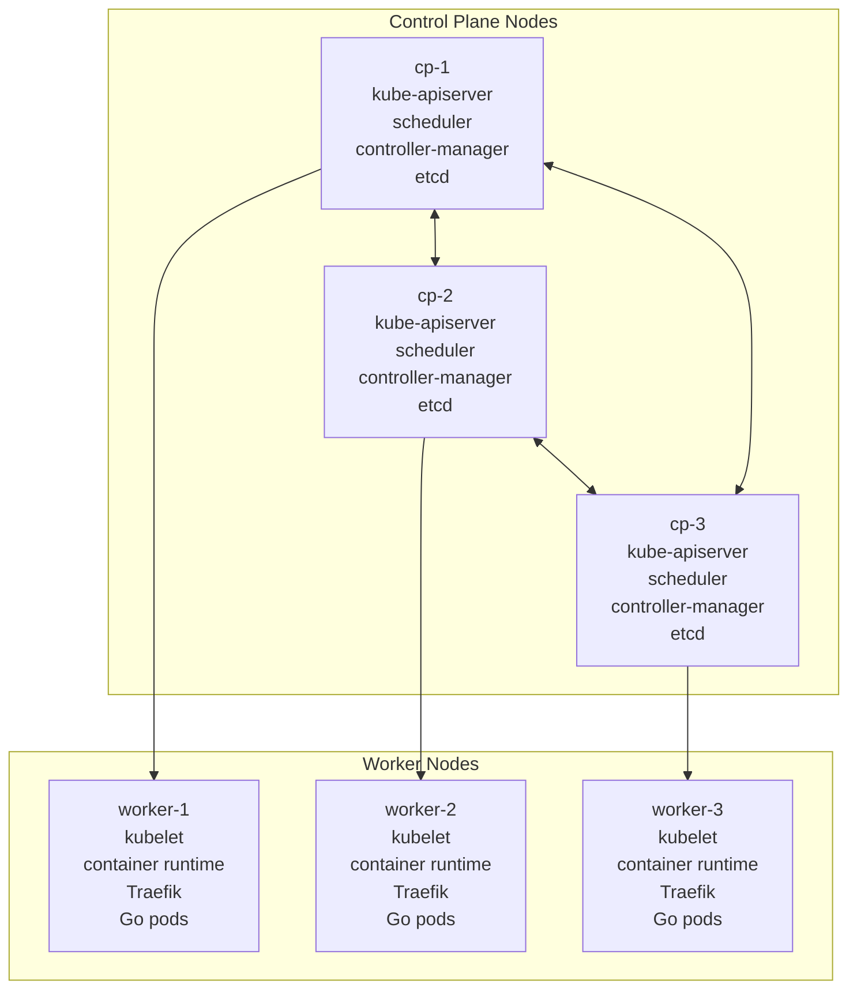
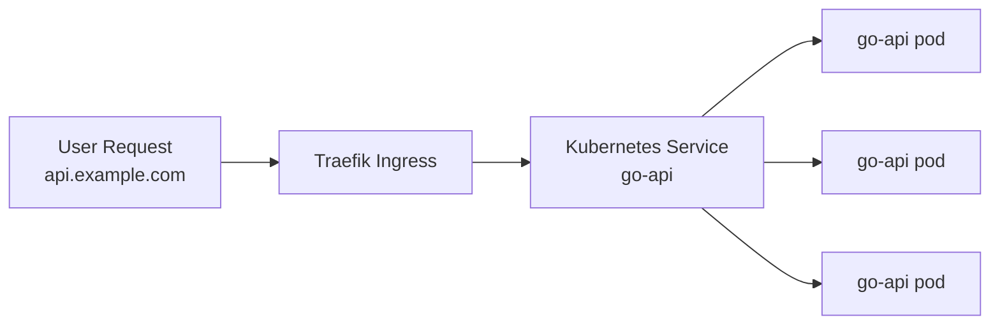
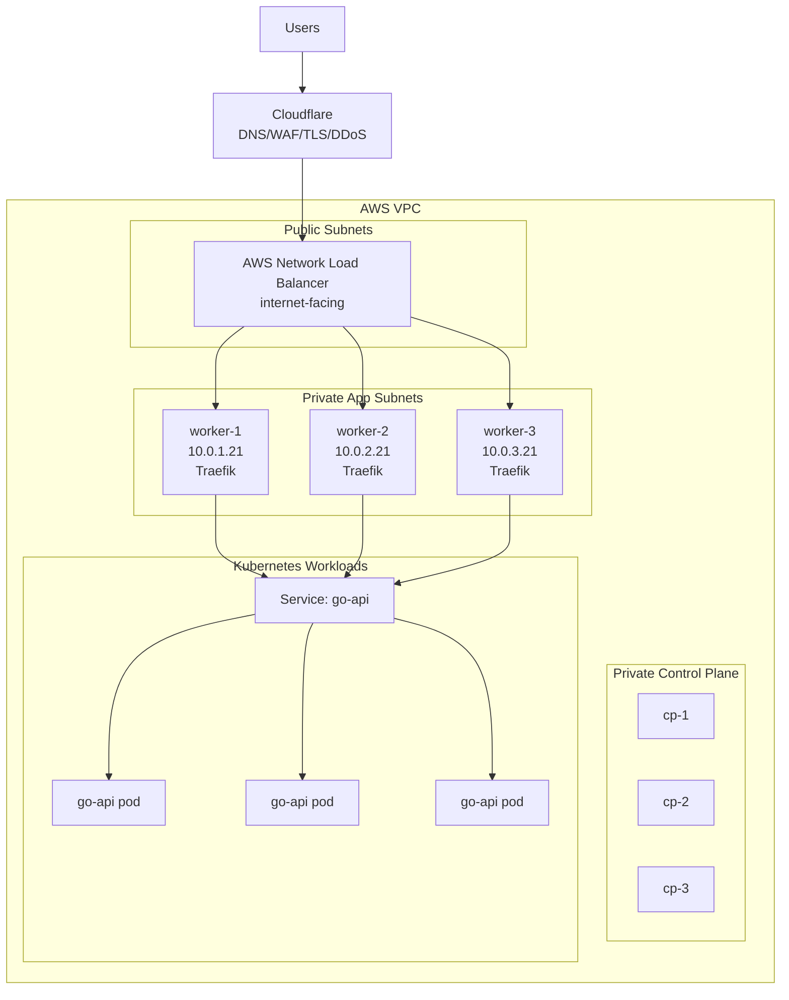
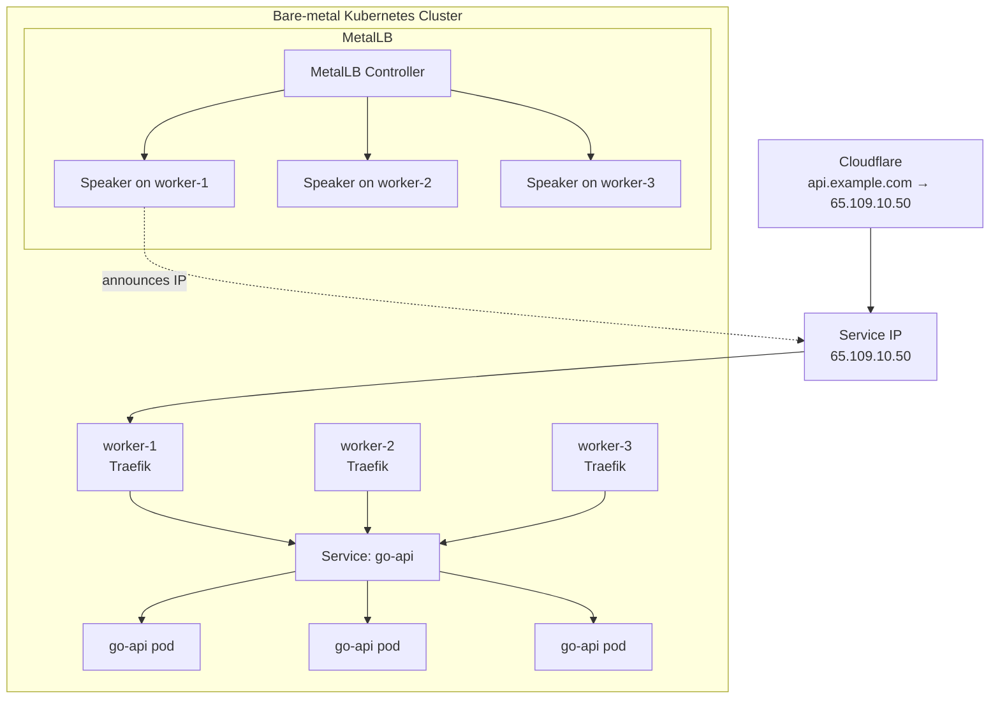
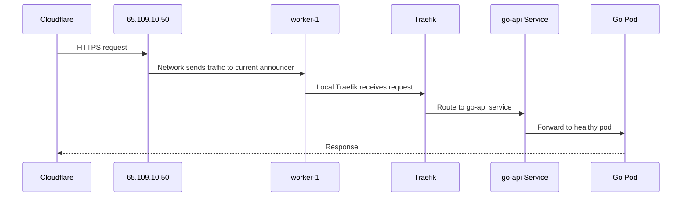
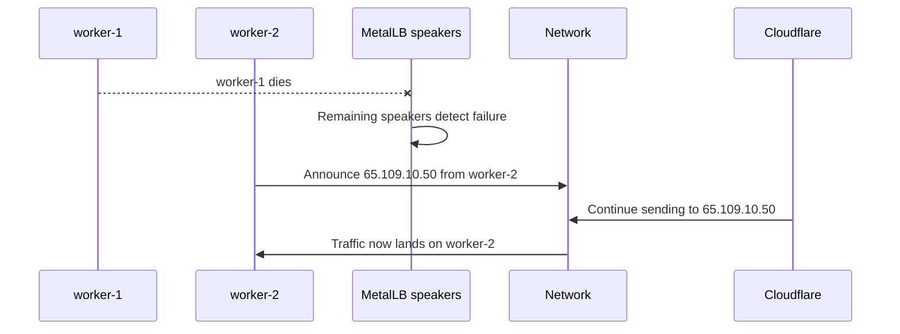
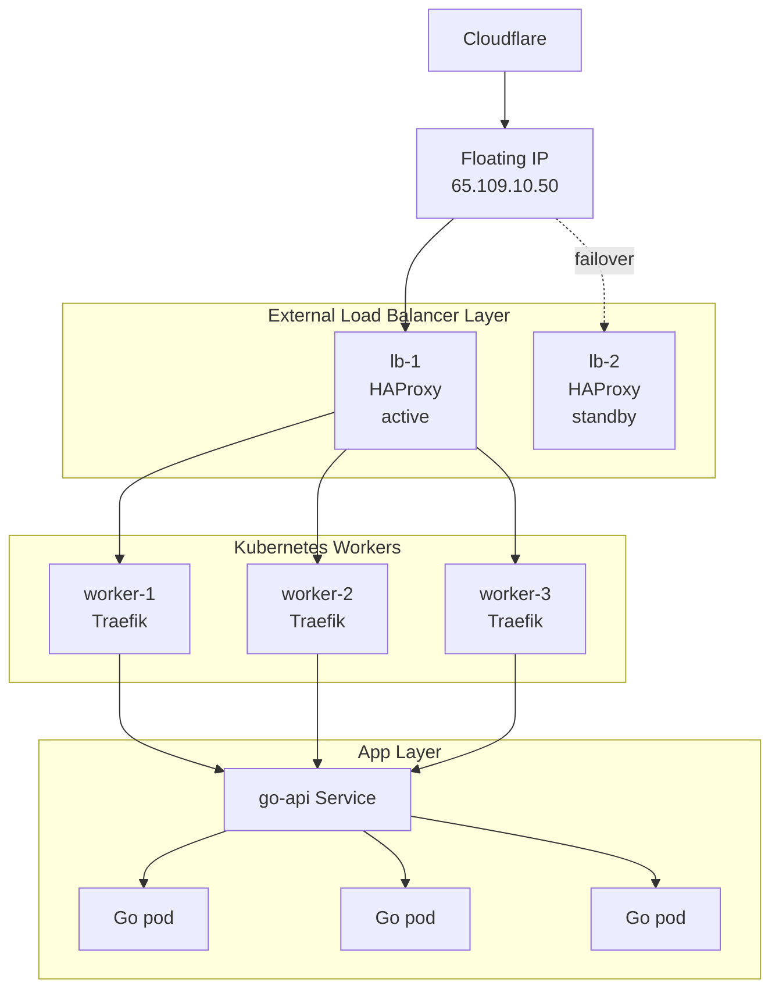
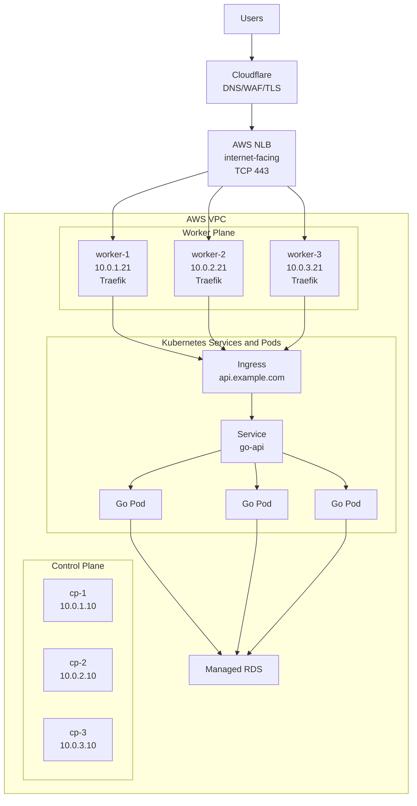
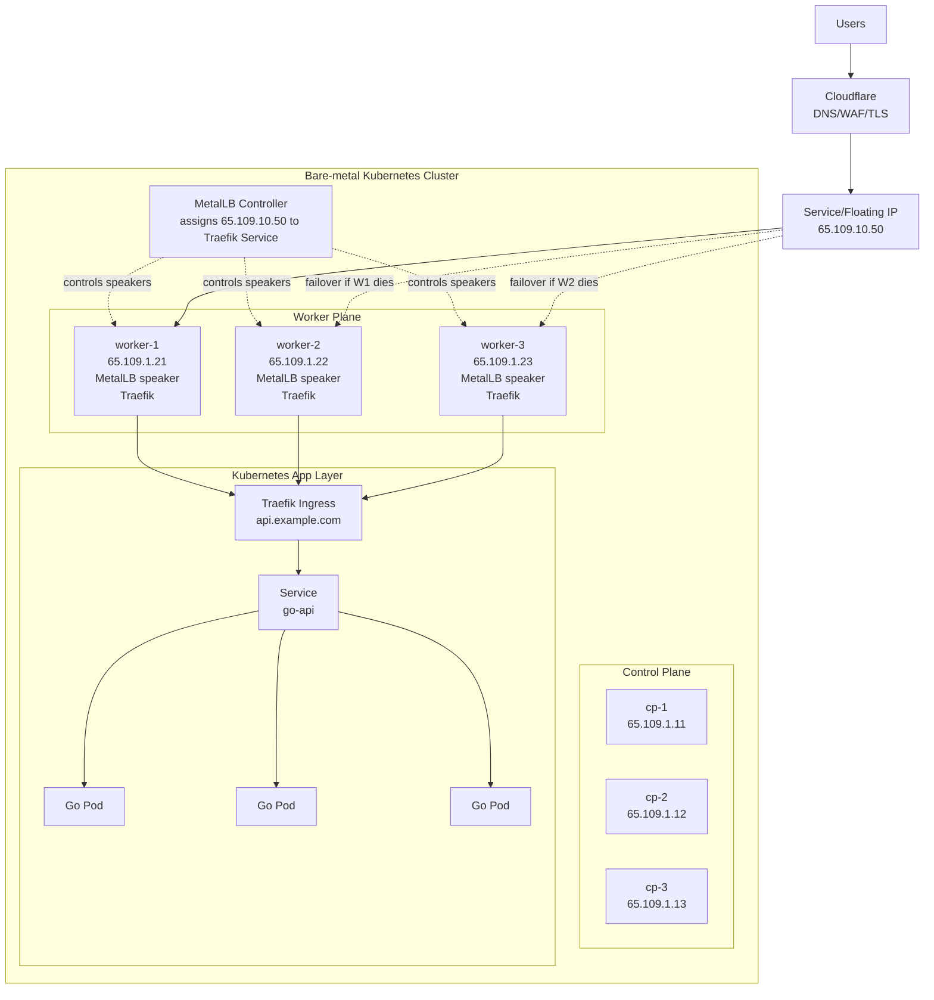

Below is a detailed markdown blog draft you can directly copy into a docs page or blog.

---
https://chatgpt.com/c/6a04b23a-3e48-83a5-902b-c05eec8f20de

# Orchestrating Kubernetes with 6 Nodes: Control Plane, Workers, Traefik, MetalLB, Go Pods, Cloudflare, and AWS NLB

When people first learn Kubernetes networking, the confusing part is usually not pods or services.

The confusing part is this:

> How does public traffic enter the cluster?

In cloud environments like AWS, the answer is usually:

```text
Cloudflare → AWS NLB/ALB → Kubernetes workers → Ingress → Pods
```

In bare-metal environments like Hetzner dedicated servers, the answer is usually:

```text
Cloudflare → Floating IP / MetalLB / HAProxy → Kubernetes workers → Ingress → Pods
```

This blog explains both variants using the same 6-node Kubernetes cluster:

```text
3 control-plane nodes
3 worker nodes
```

We will use:

```text
Cloudflare
Kubernetes / k3s
Traefik
Go application pods
AWS NLB in cloud variant
MetalLB + floating/service IP in bare-metal variant
```

The goal is to understand the architecture, not just copy commands.

---

## 1. The 6-node Kubernetes cluster

Assume we have 6 servers.

```text
cp-1      control plane
cp-2      control plane
cp-3      control plane

worker-1  worker
worker-2  worker
worker-3  worker
```

Control-plane nodes run the Kubernetes brain.

Worker nodes run application workloads.



---

## 2. What does the control plane do?

The control plane is not where user traffic should go.

It is the management brain of the cluster.

It decides:

```text
Create pods
Place pods
Restart pods
Track nodes
Store cluster state
Watch desired state vs actual state
```

For example, when you say:

```yaml
replicas: 12
```

Kubernetes stores this desired state and schedules those 12 pods across workers.

Example:

```text
worker-1 → 4 Go pods
worker-2 → 4 Go pods
worker-3 → 4 Go pods
```

If `worker-2` dies, the control plane notices that some pods are gone and tries to recreate them on healthy workers.

---

## 3. What do the worker nodes do?

Worker nodes run the real application workloads.

They run:

```text
kubelet
container runtime
CNI networking agent
Traefik ingress controller
Go application pods
logging agents
metrics agents
```

User traffic should go to the worker layer, not the control plane.

Correct:

```text
Cloudflare → Load Balancer → Worker nodes → Traefik → Go pods
```

Wrong:

```text
Cloudflare → Control plane nodes
```

The Kubernetes API server is for `kubectl`, controllers, workers, and automation. It is not your product API.

---

## 4. Example Go service running in the cluster

Your Go application might be deployed as a Kubernetes `Deployment`.

```yaml
apiVersion: apps/v1
kind: Deployment
metadata:
  name: go-api
  namespace: prod
spec:
  replicas: 12
  selector:
    matchLabels:
      app: go-api
  template:
    metadata:
      labels:
        app: go-api
    spec:
      containers:
        - name: go-api
          image: ghcr.io/example/go-api:latest
          ports:
            - containerPort: 8080
          resources:
            requests:
              cpu: "250m"
              memory: "256Mi"
            limits:
              cpu: "1"
              memory: "512Mi"
```

Expose it internally using a `ClusterIP` service:

```yaml
apiVersion: v1
kind: Service
metadata:
  name: go-api
  namespace: prod
spec:
  type: ClusterIP
  selector:
    app: go-api
  ports:
    - name: http
      port: 80
      targetPort: 8080
```

Then expose it through Traefik using an Ingress:

```yaml
apiVersion: networking.k8s.io/v1
kind: Ingress
metadata:
  name: go-api
  namespace: prod
spec:
  ingressClassName: traefik
  rules:
    - host: api.example.com
      http:
        paths:
          - path: /
            pathType: Prefix
            backend:
              service:
                name: go-api
                port:
                  number: 80
```

---

## 5. Role of Traefik

Traefik is the HTTP/S ingress router.

It receives traffic like:

```text
https://api.example.com/users
https://api.example.com/orders
```

Then it routes traffic to the right Kubernetes service.



Traefik is not the same thing as MetalLB.

```text
Traefik = HTTP routing
MetalLB = external IP announcement for bare metal
AWS NLB = managed cloud entry load balancer
```

---

# Variant A: Kubernetes on AWS using AWS NLB

In AWS, you normally do not build the public load-balancer layer yourself.

AWS provides a managed load balancer.

For a self-managed Kubernetes or k3s cluster on EC2, the architecture can look like this:

```text
Cloudflare
  ↓
AWS Network Load Balancer
  ↓
worker nodes
  ↓
Traefik
  ↓
Kubernetes Service
  ↓
Go pods
```

AWS says Elastic Load Balancing distributes incoming traffic across registered targets in one or more Availability Zones, and it routes only to healthy targets. ([Amazon Web Services, Inc.][1])

---

## 6. Example AWS node layout

Assume the 6 EC2 instances are spread across 3 Availability Zones.

```text
AZ-a:
  cp-1       private IP: 10.0.1.10
  worker-1   private IP: 10.0.1.21

AZ-b:
  cp-2       private IP: 10.0.2.10
  worker-2   private IP: 10.0.2.21

AZ-c:
  cp-3       private IP: 10.0.3.10
  worker-3   private IP: 10.0.3.21
```

Production recommendation:

```text
Control-plane nodes: private subnets
Worker nodes: private subnets
AWS NLB: public subnets
RDS: private DB subnets
```

---

## 7. AWS NLB architecture



---

## 8. What goes into AWS NLB?

AWS NLB has three important pieces:

```text
Listener
Target group
Registered targets
```

AWS documentation describes NLB configuration as creating target groups, registering targets, and creating listeners that route client requests to those target groups. ([AWS Documentation][2])

For this setup:

```text
NLB listener:
  TCP 443

Target group:
  protocol: TCP
  port: 443 or NodePort
  targets:
    worker-1
    worker-2
    worker-3
```

Example target group:

```text
worker-1:443
worker-2:443
worker-3:443
```

or, if Traefik is exposed through NodePort:

```text
worker-1:32443
worker-2:32443
worker-3:32443
```

The NLB does not need to know about every Go pod.

It only needs to reach the worker/ingress layer.

Inside Kubernetes:

```text
Traefik → Service → Go pods
```

---

## 9. What goes into Cloudflare for AWS NLB?

Cloudflare DNS record:

```text
Type: CNAME
Name: api
Target: prod-api-nlb-abc123.elb.ap-south-1.amazonaws.com
Proxy: enabled
TTL: Auto
```

Result:

```text
api.example.com → Cloudflare → AWS NLB → workers
```

Cloudflare is the public DNS/security edge.

AWS NLB is the regional cloud entry point.

Traefik is the Kubernetes HTTP router.

---

## 10. Why AWS NLB is not one EC2 instance

An AWS NLB is a managed AWS service.

You do not SSH into it.

You do not install HAProxy on it.

You enable it across subnets/AZs, and AWS handles the load-balancer infrastructure. AWS recommends ensuring each enabled Availability Zone has at least one registered target for effective NLB operation. ([AWS Documentation][3])

Conceptually:

```text
Cloudflare
  ↓
AWS NLB
  ├── load-balancer capacity in AZ-a
  ├── load-balancer capacity in AZ-b
  └── load-balancer capacity in AZ-c
      ↓
worker nodes
```

So it is one logical entry point, but not one machine you manage.

---

## 11. Internal Kubernetes API load balancer on AWS

Do not confuse app traffic with Kubernetes management traffic.

You may also create an internal NLB for the Kubernetes API server:

```text
internal-k8s-api-nlb
  ↓
cp-1:6443
cp-2:6443
cp-3:6443
```

Used by:

```text
kubectl
workers
k3s agents
controllers
automation
```

Not used by public users.

Public API path:

```text
Cloudflare → public AWS NLB → workers → Traefik → Go pods
```

Cluster management path:

```text
kubectl/VPN/automation → internal NLB → control plane nodes
```

---

# Variant B: Kubernetes on bare metal using MetalLB + Traefik + Floating IP

Bare metal is different.

There is no automatic AWS NLB.

If you create a Kubernetes service of type `LoadBalancer`, nothing external magically appears unless you install something like MetalLB.

MetalLB is a load-balancer implementation for bare-metal Kubernetes clusters using standard routing protocols. ([MetalLB][4])

The architecture:

```text
Cloudflare
  ↓
Floating/service IP
  ↓
MetalLB announcement
  ↓
worker node running Traefik
  ↓
Kubernetes Service
  ↓
Go pods
```

---

## 12. Example Hetzner-style 6-node layout

Assume 6 Hetzner dedicated servers.

```text
Control plane:
  cp-1      server IP: 65.109.1.11
  cp-2      server IP: 65.109.1.12
  cp-3      server IP: 65.109.1.13

Workers:
  worker-1  server IP: 65.109.1.21
  worker-2  server IP: 65.109.1.22
  worker-3  server IP: 65.109.1.23
```

Each server has its own permanent server IP.

Now add an extra public IP for the API:

```text
Service/Floating IP:
  65.109.10.50
```

Cloudflare points to:

```text
api.example.com → 65.109.10.50
```

Not to:

```text
worker-1 → 65.109.1.21
worker-2 → 65.109.1.22
worker-3 → 65.109.1.23
```

---

## 13. Server IP vs service IP

This is the most important concept.

```text
Server IP = identifies a machine.
Service IP = identifies an application entry point.
```

Server IPs:

```text
65.109.1.21 → worker-1 permanently
65.109.1.22 → worker-2 permanently
65.109.1.23 → worker-3 permanently
```

Service IP:

```text
65.109.10.50 → api.example.com
```

At any moment, the service IP still lands on a real node.

But it is not permanently tied to one worker.

Normal state:

```text
65.109.10.50 → worker-1
```

Failover state:

```text
65.109.10.50 → worker-2
```

---

## 14. MetalLB architecture

MetalLB has two key parts:

```text
controller
speaker
```

The controller manages IP assignment.

The speaker runs on nodes and announces the IP to the network.



---

## 15. MetalLB Layer 2 mode

In Layer 2 mode, one machine in the cluster takes ownership of the service IP and uses ARP for IPv4 or NDP for IPv6 to make that IP reachable on the local network. From the LAN’s view, the announcing machine appears to have multiple IP addresses. ([MetalLB][5])

Example:

```text
worker-1 says:
"I own 65.109.10.50."
```

The network sends traffic for `65.109.10.50` to worker-1.

If worker-1 dies:

```text
worker-2 says:
"I own 65.109.10.50 now."
```

The network mapping changes.

Before:

```text
65.109.10.50 → worker-1
```

After:

```text
65.109.10.50 → worker-2
```

Cloudflare does not change.

It still points to:

```text
api.example.com → 65.109.10.50
```

---

## 16. MetalLB BGP mode

In BGP mode, the nodes announce routes to the network/router.

Instead of saying through ARP:

```text
this IP is mine
```

the node says through routing:

```text
send traffic for 65.109.10.50/32 to me
```

Before failure:

```text
Router route:
65.109.10.50/32 → worker-1
```

After failure:

```text
Router route:
65.109.10.50/32 → worker-2
```

BGP mode is more production-grade for routed networks, but it requires the network/provider to support BGP or routed IP blocks. MetalLB documents BGP support, including FRR mode and BGP/BFD capabilities. ([MetalLB][6])

---

## 17. MetalLB config example

IPAddressPool:

```yaml
apiVersion: metallb.io/v1beta1
kind: IPAddressPool
metadata:
  name: public-api-pool
  namespace: metallb-system
spec:
  addresses:
    - 65.109.10.50/32
```

Layer 2 advertisement:

```yaml
apiVersion: metallb.io/v1beta1
kind: L2Advertisement
metadata:
  name: public-api-l2
  namespace: metallb-system
spec:
  ipAddressPools:
    - public-api-pool
```

Traefik service:

```yaml
apiVersion: v1
kind: Service
metadata:
  name: traefik
  namespace: kube-system
spec:
  type: LoadBalancer
  loadBalancerIP: 65.109.10.50
  selector:
    app.kubernetes.io/name: traefik
  ports:
    - name: websecure
      port: 443
      targetPort: 443
```

Cloudflare DNS:

```text
Type: A
Name: api
Value: 65.109.10.50
Proxy: enabled
TTL: Auto
```

---

## 18. Important: MetalLB does not create public IPs from nothing

MetalLB does not magically generate internet-routable IPs.

You need an IP or IP range that your provider/network routes to your servers.

For Hetzner-like bare metal, this usually means one of:

```text
extra public IP
failover IP
routed subnet
BGP-routed prefix
private L2 network for internal services
```

If the provider permanently routes:

```text
65.109.1.21 → worker-1
```

MetalLB cannot magically move `65.109.1.21` to worker-2.

That is worker-1’s primary server IP.

You need a separate IP intended for service/failover use:

```text
65.109.10.50
```

---

## 19. MetalLB + Traefik failover flow

Normal state:



Failover:



---

# 20. Why Traefik alone is not enough

Suppose Cloudflare points directly to worker-1:

```text
Cloudflare → worker-1 public IP → Traefik → Go pods
```

If worker-1 dies, traffic dies.

Even if Kubernetes starts Traefik on worker-2, Cloudflare still points to worker-1’s permanent IP.

So the problem is not Traefik.

The problem is:

```text
The public IP is pinned to one node.
```

MetalLB or a floating IP solves the IP ownership problem.

Traefik solves the HTTP routing problem.

---

## 21. Correct bare-metal pattern with MetalLB

```text
Cloudflare
  ↓
Service/Floating IP
  ↓
MetalLB announces IP from healthy worker
  ↓
Traefik running on that worker
  ↓
Kubernetes Service
  ↓
Go pods
```

For this to work well, Traefik should run on multiple workers.

Common options:

```text
Traefik as a DaemonSet on ingress-capable workers
Traefik as a Deployment with replicas spread across workers
```

Better:

```text
worker-1: MetalLB speaker + Traefik
worker-2: MetalLB speaker + Traefik
worker-3: MetalLB speaker + Traefik
```

Then if worker-1 dies:

```text
MetalLB moves/announces service IP from worker-2
Traefik is already running on worker-2
Traffic continues
```

---

# 22. What about floating IP + HAProxy instead of MetalLB?

Another bare-metal production pattern is:

```text
Cloudflare
  ↓
Floating IP
  ↓
lb-1/lb-2 running HAProxy + Keepalived
  ↓
worker nodes
  ↓
Traefik
  ↓
Go pods
```

This is not Kubernetes-native, but it is operationally simple.



This pattern is common when provider networking does not make MetalLB Layer 2/BGP easy.

---

# 23. AWS NLB vs bare-metal MetalLB mental model

| Concept                             | AWS Variant            | Bare-metal Variant                         |
| ----------------------------------- | ---------------------- | ------------------------------------------ |
| Public entry                        | AWS NLB DNS name       | Floating/service IP                        |
| DNS in Cloudflare                   | CNAME to NLB           | A record to service/floating IP            |
| Who manages LB layer?               | AWS                    | You / Kubernetes / provider                |
| Worker targets                      | Registered EC2 workers | Nodes announcing service IP                |
| HTTP routing                        | Traefik inside cluster | Traefik inside cluster                     |
| IP failover                         | AWS-managed            | MetalLB / BGP / ARP / provider floating IP |
| User traffic touches control plane? | No                     | No                                         |
| Kubernetes API public?              | No                     | No                                         |

---

# 24. Does one public IP choke at high RPS?

One public IP does not automatically mean one physical bottleneck.

In AWS:

```text
Cloudflare → AWS NLB → distributed AWS-managed load-balancer infrastructure
```

The NLB is a logical entry, but AWS handles capacity behind it.

In simple bare metal:

```text
Cloudflare → Floating IP → one active node
```

Here, yes, the active node can become the bottleneck.

The IP itself does not choke.

The active machine behind the IP can choke.

At 100k RPS, you may need active-active load balancing:

```text
Cloudflare Load Balancing
  ↓
lb-1
lb-2
lb-3
lb-4
  ↓
workers
```

or BGP/Anycast-style routing if your network supports it.

---

# 25. Active-passive vs active-active

## Active-passive

```text
Floating IP → lb-1 active
Floating IP → lb-2 standby
```

Good for HA.

Not great for scaling.

Only one LB handles traffic at a time.

## Active-active

```text
Cloudflare Load Balancing
  ↓
lb-1 active
lb-2 active
lb-3 active
```

Good for scale and HA.

Traffic is distributed across multiple active origins.

For large RPS, active-active is usually better.

---

# 26. Recommended AWS production architecture

```text
Cloudflare
  ↓
AWS NLB across 3 AZs
  ↓
worker nodes across 3 AZs
  ↓
Traefik
  ↓
go-api Service
  ↓
Go pods
  ↓
RDS / Redis / Queue
```

Control plane:

```text
private internal NLB
  ↓
cp-1:6443
cp-2:6443
cp-3:6443
```

Do not expose control plane publicly.

---

# 27. Recommended bare-metal production architecture

For simple but production-minded Hetzner-style setup:

```text
Cloudflare
  ↓
service/floating IP
  ↓
MetalLB or HAProxy/Keepalived
  ↓
worker nodes running Traefik
  ↓
go-api Service
  ↓
Go pods
```

If provider routing supports MetalLB cleanly:

```text
Cloudflare → MetalLB service IP → Traefik → Go pods
```

If provider routing is tricky:

```text
Cloudflare → provider floating IP → lb-1/lb-2 HAProxy → workers → Traefik → Go pods
```

For very high traffic:

```text
Cloudflare Load Balancing → multiple active LB nodes → workers
```

---

# 28. Final full architecture: AWS variant



---

# 29. Final full architecture: bare-metal MetalLB variant



---

# 30. The clean mental model

Remember this:

```text
Control plane decides.
Worker nodes run.
Traefik routes HTTP.
AWS NLB provides managed cloud entry.
MetalLB provides bare-metal service IP announcement.
Cloudflare provides public DNS/security edge.
```

For AWS:

```text
Cloudflare → AWS NLB → workers → Traefik → Go pods
```

For bare metal:

```text
Cloudflare → service/floating IP → MetalLB/HAProxy → workers → Traefik → Go pods
```

The control plane is not in the public request path.

The user request should never go to:

```text
cp-1
cp-2
cp-3
```

It should go to:

```text
worker nodes running ingress
```

And from there:

```text
Traefik → Kubernetes Service → Go pods
```

That is the core production architecture.

[1]: https://aws.amazon.com/elasticloadbalancing/?utm_source=chatgpt.com "Elastic Load Balancing (ELB)"
[2]: https://docs.aws.amazon.com/elasticloadbalancing/latest/network/network-load-balancers.html?utm_source=chatgpt.com "Network Load Balancers"
[3]: https://docs.aws.amazon.com/elasticloadbalancing/latest/network/availability-zones.html?utm_source=chatgpt.com "Update the Availability Zones for your Network Load Balancer"
[4]: https://metallb.io/?utm_source=chatgpt.com "MetalLB :: MetalLB, bare metal load-balancer for Kubernetes"
[5]: https://metallb.universe.tf/concepts/?utm_source=chatgpt.com "Concepts :: MetalLB, bare metal load-balancer for Kubernetes"
[6]: https://metallb.universe.tf/concepts/bgp/?utm_source=chatgpt.com "MetalLB in BGP mode"
